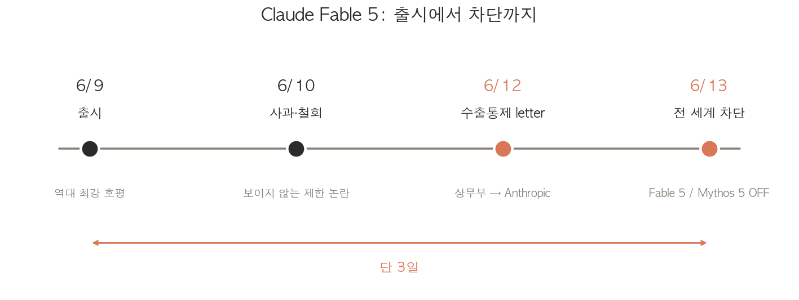

2026년 6월 9일에 공개된 Claude Fable 5는 "역대 최강"이라는 평가를 받았습니다. Karpathy가 "step change"라고 표현했고, Stripe는 5,000만 라인 마이그레이션을 하루 만에 끝냈죠. 그런데 그 모델이 **출시 사흘 만인 6월 12일에 전 세계에서 접근 차단**됐습니다. 서버가 죽은 것도, 회사가 내린 것도 아닙니다. 미국 정부가 막았습니다.

더 정확히 말하면, 미 상무부가 국가안보를 근거로 한 **수출통제(export control) 지침**을 보냈고, Anthropic이 이를 따르느라 Fable 5와 Mythos 5를 전 사용자 대상으로 비활성화했습니다. 칩이나 모델 가중치가 아니라, 미국 서버에서 돌아가던 라이브 상용 서비스가 수출통제 대상이 된 첫 사례입니다. 이번 글에서는 무슨 일이 있었는지, 그리고 이게 왜 단순한 해프닝이 아니라 AI 산업 전체에 남는 선례인지 정리합니다. 출시 당시의 성능과 논란은 [Fable 5 출시 분석 글](/issue/fable-5/)에서 따로 다뤘으니, 여기서는 차단 사건에 집중하겠습니다.

---

## 사흘 동안 무슨 일이 있었나

출시부터 차단까지 걸린 시간은 정확히 사흘입니다. 압축하면 이렇습니다.

- **6월 9일**: Anthropic이 Claude Fable 5와 Mythos 5를 공개. "역대 최강" 호평이 쏟아짐
- **6월 9일~10일**: 319페이지 시스템 카드에서 "사용자에게 알리지 않는" 성능 제한 장치가 발견되며 "secret sabotage" 논란. Anthropic이 *"We made the wrong tradeoff"* 라며 사과하고 해당 장치를 가시적 거부 방식으로 철회
- **6월 12일 저녁(미 동부시간)**: 상무장관 Howard Lutnick이 Dario Amodei 앞으로 수출통제 지침 letter를 발송. Anthropic은 오후 5시 21분에 수령
- **6월 12일~13일**: Anthropic이 Fable 5와 Mythos 5를 전 세계 모든 사용자 대상으로 비활성화

출시 직후의 "보이지 않는 성능 제한" 논란은 회사가 자체적으로 수습한 사안이었습니다. 그런데 그게 정리되자마자, 이번에는 회사 바깥에서 훨씬 큰 일이 터졌습니다.

---

## 미 정부의 수출통제 지침

핵심부터 보겠습니다. 상무부가 보낸 지침의 내용은 **"Fable 5와 Mythos 5를 모든 외국 국적자(foreign national)에게 제공하지 말라"** 였습니다. 여기서 외국 국적자의 범위가 넓습니다.

  <strong>⚠️ 차단 범위</strong> 
  미국 밖의 모든 사용자뿐 아니라, <strong>미국 내에 거주하는 외국 국적자</strong>, 그리고 <strong>Anthropic 자사의 외국 국적 직원</strong>까지 포함됩니다. 즉 미국 시민이 아니면 누구도 쓸 수 없습니다.

문제는 실시간으로 사용자의 국적을 가려낼 방법이 없다는 점입니다. 수억 명이 쓰는 상용 서비스에서 누가 미국 시민이고 누가 아닌지를 즉시 검증할 수 없으니, 선택적으로 차단하는 것 자체가 불가능했습니다. 결국 Anthropic은 전체를 끄는 것 외에 선택지가 없었습니다. 공식 성명의 표현이 이 상황을 그대로 담고 있습니다.

> "The net effect of this order is that we must abruptly disable Fable 5 and Mythos 5 for **all** our customers to ensure compliance." (Anthropic 공식 성명)

다행히 영향 범위는 두 모델로 한정됐습니다. Opus 4.8을 비롯한 나머지 Claude 모델은 그대로 쓸 수 있고, Claude.ai에서 Fable 5를 선택했던 사용자는 Opus 4.8로 폴백됩니다. 다만 API에서 `claude-fable-5`를 직접 호출하도록 짜둔 통합은 즉시 깨졌고, Fable 5를 워크플로우에 넣었던 기업 고객들도 곧바로 영향을 받았습니다. 출시 사흘 만에 워크플로우를 짜두기엔 짧은 시간이었지만, 그 사흘 안에 통합한 곳들은 갑작스럽게 대응해야 했습니다.

---

## 정부의 이유 vs Anthropic의 반박

정부가 든 사유는 **"jailbreak"** 였습니다. 보도를 종합하면, 다른 한 업체가 Mythos를 jailbreak하는 방법을 찾았다고 주장했고, 이것이 행정부 내부에서 국가안보 우려로 번졌습니다. Fable 5와 Mythos 5는 출시 시점에 사이버보안 같은 고위험 영역의 응답을 막는 분류기를 갖추고 있었는데, 그 안전장치를 우회할 수 있다는 것이 문제로 지목된 셈입니다.

Anthropic의 반박은 세 갈래입니다.

<table style="width: 100%; border-collapse: collapse; margin: 20px 0;">
  <thead>
    <tr style="background: #f8f9fa;">
      <th style="padding: 12px 16px; border: 1px solid #e9ecef; text-align: left;">쟁점</th>
      <th style="padding: 12px 16px; border: 1px solid #e9ecef; text-align: left;">정부 측 주장</th>
      <th style="padding: 12px 16px; border: 1px solid #e9ecef; text-align: left;">Anthropic 반박</th>
    </tr>
  </thead>
  <tbody>
    <tr>
      <td style="padding: 12px 16px; border: 1px solid #e9ecef;"><strong>위험의 성격</strong></td>
      <td style="padding: 12px 16px; border: 1px solid #e9ecef;">안전장치를 뚫는 jailbreak 존재</td>
      <td style="padding: 12px 16px; border: 1px solid #e9ecef;">특정 코드베이스를 읽고 결함을 찾는 좁고 비보편적인 jailbreak일 뿐, 모든 안전장치를 무력화하는 게 아님</td>
    </tr>
    <tr>
      <td style="padding: 12px 16px; border: 1px solid #e9ecef;"><strong>고유성</strong></td>
      <td style="padding: 12px 16px; border: 1px solid #e9ecef;">국가안보 위협</td>
      <td style="padding: 12px 16px; border: 1px solid #e9ecef;">같은 수준의 능력은 GPT-5.5 등 이미 공개된 다른 모델에서도 널리 쓸 수 있음</td>
    </tr>
    <tr>
      <td style="padding: 12px 16px; border: 1px solid #e9ecef;"><strong>근거</strong></td>
      <td style="padding: 12px 16px; border: 1px solid #e9ecef;">수출통제 발동</td>
      <td style="padding: 12px 16px; border: 1px solid #e9ecef;">letter에 서면 근거 없이 구두 설명만 제공됨</td>
    </tr>
  </tbody>
</table>

Anthropic이 정부 지침을 법적으로 따르면서도 명확히 선을 그은 문장이 있습니다.

> "We disagree that the finding of a narrow potential jailbreak should be cause for recalling a commercial model deployed to hundreds of millions of people." (Anthropic 공식 성명)

회사의 논리는 일관됩니다. 좁은 jailbreak 하나를 근거로 수억 명에게 배포된 상용 모델을 회수하는 기준을 세운다면, 그 기준을 업계 전체에 똑같이 적용할 경우 **모든 frontier 모델의 신규 출시가 사실상 멈춘다**는 것입니다. 어떤 모델이든 출시 직후 좁은 우회법 하나쯤은 발견되기 마련이니까요.

---

## 왜 이게 전례 없는 일인가

이 사건이 단순한 규제 해프닝이 아닌 이유는 **수출통제를 적용한 대상** 때문입니다. 기존의 AI 관련 수출통제는 물리적인 것, 즉 GPU 같은 하드웨어나 모델 가중치 파일을 대상으로 했습니다. 외국으로 "나가는" 무언가가 있었죠.

<table style="width: 100%; border-collapse: collapse; margin: 20px 0;">
  <thead>
    <tr style="background: #f8f9fa;">
      <th style="padding: 12px 16px; border: 1px solid #e9ecef; text-align: left;">구분</th>
      <th style="padding: 12px 16px; border: 1px solid #e9ecef; text-align: left;">기존 수출통제</th>
      <th style="padding: 12px 16px; border: 1px solid #e9ecef; text-align: left;">이번 Fable 5 차단</th>
    </tr>
  </thead>
  <tbody>
    <tr>
      <td style="padding: 12px 16px; border: 1px solid #e9ecef;"><strong>대상</strong></td>
      <td style="padding: 12px 16px; border: 1px solid #e9ecef;">GPU, 칩 제조 장비, 모델 가중치</td>
      <td style="padding: 12px 16px; border: 1px solid #e9ecef;">미국 서버에서 돌아가는 라이브 상용 서비스</td>
    </tr>
    <tr>
      <td style="padding: 12px 16px; border: 1px solid #e9ecef;"><strong>형태</strong></td>
      <td style="padding: 12px 16px; border: 1px solid #e9ecef;">국경을 넘는 물리적/디지털 자산</td>
      <td style="padding: 12px 16px; border: 1px solid #e9ecef;">이미 배포돼 운영 중인 API 엔드포인트</td>
    </tr>
    <tr>
      <td style="padding: 12px 16px; border: 1px solid #e9ecef;"><strong>실행 속도</strong></td>
      <td style="padding: 12px 16px; border: 1px solid #e9ecef;">심사와 고시 절차</td>
      <td style="padding: 12px 16px; border: 1px solid #e9ecef;">letter 한 통, 수 시간 내 셧다운</td>
    </tr>
  </tbody>
</table>

이번에는 국경을 넘는 게 아무것도 없습니다. 미국 데이터센터에서 돌아가는 서비스에 누가 접속하느냐를 통제한 것입니다. 이는 AI 모델을 **반도체급 전략 자산**으로 취급하기 시작했다는 신호로 읽힙니다. 칩처럼, 이제 모델도 "누구에게 제공할 수 있는가"가 국가안보 사안이 된 것이죠.

속도도 전례가 없습니다. 정식 심사나 고시 절차가 아니라 letter 한 통으로, 그것도 서면 근거 없이, 수억 명이 쓰던 서비스가 몇 시간 만에 멈췄습니다. 정부가 마음먹으면 상용 AI 서비스를 즉시 중단시킬 수 있다는 선례가 만들어진 셈입니다.

---

## 투명성의 역설

이 사건에서 가장 곱씹어볼 지점은 따로 있습니다. 이번 차단의 직접적인 방아쇠는 타 업체의 jailbreak 주장이었지만, 그보다 더 근본적인 문제로 지적되는 것은 **자발적 투명성이 규제의 탄약이 되는 구조**입니다.

Anthropic은 319페이지짜리 시스템 카드와 책임 있는 스케일링 정책(Responsible Scaling Policy)을 통해 모델의 위험과 한계를 상세히 공개해 왔습니다. 사이버보안 능력이 어디까지인지, 어떤 안전장치를 뒀는지, 어떤 우회 가능성이 있는지를 자발적으로 문서화한 것입니다. 문제는 바로 그렇게 공개된 자료가, 규제 당국이 조치의 근거로 삼기에 가장 좋은 재료가 된다는 점입니다.

  <strong>💡 역설의 구조</strong> 
  안전 정보를 투명하게 공개한 회사는 규제 조치의 근거를 제공한 셈이 되고, 아무것도 공개하지 않은 회사는 그만큼 표적이 되지 않습니다. 즉 <strong>투명할수록 처벌받고, 불투명할수록 보호받는</strong> 역인센티브가 생깁니다.

문제는 이 구조가 AI 안전 연구 전체에 던지는 메시지입니다. frontier 랩이 "우리 모델은 이런 위험이 있으니 특별한 통제가 필요하다"고 스스로 밝히는 순간, 정부는 그 진술을 ready-made handle로 삼아 랩이 의도한 것보다 훨씬 거칠고 광범위한 통제를 가할 수 있습니다. 다음 출시 때 어느 회사가 시스템 카드를 319페이지나 쓰려 할까요. 자발적 안전 공개를 위축시키는 방향으로 작동한다면, 이건 안전을 위한 조치가 오히려 안전 정보를 숨기게 만드는 자기모순입니다.

---

## 커뮤니티와 전문가 반응

반응은 크게 세 갈래로 갈렸습니다.

**선례에 대한 우려.** 한 AI 정책 전문가의 코멘트가 분위기를 압축합니다.

> "I can't tell if this is lawfare against Anthropic in particular or extreme national-security hawkery. Regardless, it is simply cartoonish."

Anthropic을 겨냥한 법적 압박(lawfare)인지 과도한 안보 매파주의인지 모르겠지만 어느 쪽이든 만화 같다는 것입니다. Anthropic이 지난 1년간 국방부와 군사적 활용 범위를 두고 마찰을 빚어온 맥락을 떠올리는 시각도 있습니다.

**실효성에 대한 회의.** Hacker News의 반응은 좀 더 냉소적입니다. "지니를 다시 병에 넣을 수는 없다"는 식의 댓글이 대표적인데, 같은 수준의 능력이 GPT-5.5를 비롯한 다른 모델에 이미 존재하고, 시간이 지나면 비슷한 성능의 open-weight 모델이 나오는 것이 거의 불가피하다는 지적입니다. 그렇다면 특정 모델 하나를 막는 것이 실질적으로 무엇을 막느냐는 물음이죠. 1990년대 강한 암호화 기술을 무기로 분류해 수출을 통제했던 "Crypto Wars"의 평행 사례를 드는 분석도 있었습니다. 결국 기술 확산을 막지 못했던 그 역사 말입니다.

**확산 가능성에 대한 경계.** 수출통제가 라이브 서비스에 적용될 수 있다면, 다음은 클라우드 서비스 전반으로 번질 수 있다는 우려도 나왔습니다. 물론 무제한 LLM이 위험 정보를 제공할 수 있다는 점에서 민주적 접근과 책임 있는 배포 사이의 긴장은 실재한다는, 정부 측에 일부 공감하는 목소리도 함께 있었습니다.

  <strong>✅ 참고: Microsoft의 차단은 별개입니다</strong> 
  비슷한 시기에 Microsoft가 직원들의 Claude Fable 5 사용을 일시 금지했다는 보도가 있었는데, 이는 정부 수출통제와 전혀 다른 사안입니다. Anthropic의 <strong>데이터 보존(data retention) 정책</strong>에 따라 민감 정보가 노출될 수 있다는 사내 우려가 이유였습니다. 정부 차단과 혼동하지 않도록 주의가 필요합니다.

---

## 그래서 무엇이 남나

Anthropic은 성명 끝에 "가능한 한 빨리 접근을 복원하기 위해 노력하고 있다"고 밝혔습니다. 차단이 영구적이지는 않을 것이고, 정부와의 협의를 거쳐 어떤 형태로든 풀릴 가능성이 큽니다. 그런데 모델이 다시 켜진다고 해서 이 사건이 없던 일이 되지는 않습니다.

남는 것은 선례입니다. 미국 정부는 이번에 **라이브 상용 AI 서비스를 수 시간 만에, 서면 근거 없이, 국가안보를 이유로 중단시킬 수 있다**는 것을 보여줬습니다. frontier AI의 접근권이 회사의 사업 결정이나 기술적 한계의 문제가 아니라, 본질적으로 정치적인 문제가 되는 순간입니다. 모델의 능력이 전략적으로 의미 있는 수준에 도달하면, 누가 그것을 쓸 수 있는지는 더 이상 회사 혼자 정하는 문제가 아니게 됩니다.

이 사건이 던지는 질문은 결국 거버넌스의 형태입니다. 통제의 손잡이를 회사의 일방적 결정(보이지 않는 성능 제한)에 맡길 수도, 정부의 일방적 지침(서면 근거 없는 셧다운)에 맡길 수도 없다면, 그 사이 어딘가에 가시적인 안전장치, 독립적인 평가, 명확한 이의제기 절차, 그리고 open-source 생태계의 역할을 인정하는 합의가 필요하다는 것입니다. Fable 5는 출시 사흘 만에 그 합의가 아직 존재하지 않는다는 사실을 가장 비싼 방식으로 증명했습니다.

[출시 당시의 성능과 정책 논란](/issue/fable-5/)이 모델 자체에 대한 이야기였다면, 이번 차단은 그 모델을 둘러싼 권력 구조에 대한 이야기입니다. 경쟁의 축이 모델 능력에서 접근성과 거버넌스로 옮겨가고 있다는 신호를, 이번 사건이 다시 한번 확인해 줬습니다.

## 참고자료

- [Anthropic 공식 성명: Statement on the US government directive to suspend access to Fable 5 and Mythos 5](https://www.anthropic.com/news/fable-mythos-access)
- [Al Jazeera: US orders Anthropic to disable AI models for all foreign nationals](https://www.aljazeera.com/news/2026/6/13/us-orders-anthropic-to-disable-ai-models-for-all-foreign-nationals)
- [CNBC: Anthropic disables access to Fable 5 and Mythos 5 to comply with government directive](https://www.cnbc.com/2026/06/12/anthropic-disables-access-to-fable-5-and-mythos-5-to-comply-with-government-directive.html)
- [Fortune: Anthropic disables Fable and Mythos AI models after U.S. government bars foreign access](https://fortune.com/2026/06/13/anthropic-disables-fable-mythos-export-controls-national-security-threat/)
- [Bloomberg: Anthropic Says US Orders Halt to Foreign Access for Fable 5, Mythos 5](https://www.bloomberg.com/news/articles/2026-06-13/anthropic-says-us-limits-foreign-access-to-fable-5-mythos-5)
- [Techzine: US blocks Claude Fable 5 and Mythos 5, is frontier AI now too dangerous?](https://www.techzine.eu/blogs/security/142140/us-blocks-claude-fable-5-and-mythos-5-is-frontier-ai-now-too-dangerous/)
- [Hacker News: Our response to the US ban on Fable 5 and Mythos 5](https://news.ycombinator.com/item?id=48512915)
