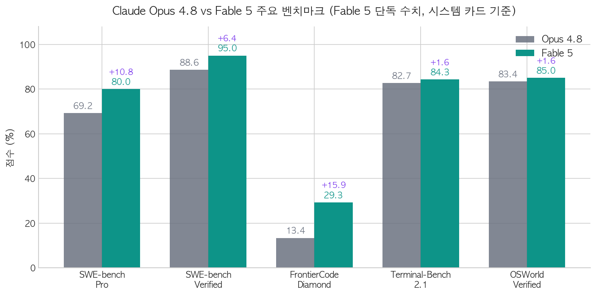

2026년 6월 9일, Anthropic이 Claude Fable 5를 공개했습니다. 두 달 전 [Opus 4.7 출시 때](/issue/opus-4-7/)는 벤치마크 점수는 올랐는데 사용자 체감은 나빠지면서 "Gaslightus"라는 별명까지 붙었는데, 이번에는 구도가 정반대입니다. 성능에 대해서는 Karpathy가 "step change"라고 표현할 만큼 호평이 압도적입니다. 그런데 출시 후 Fable 관련 글 중 최다 업보트(4,235)를 받은 r/ClaudeAI 스레드가 다룬 것은 성능 불만이 아니었습니다. 이번 출시가 모델 런칭이라기보다 **"frontier AI is turning into a gated utility"**, 즉 프런티어 AI가 게이트 뒤로 들어가는 사건처럼 느껴진다는 내용이었습니다.

성능 논란이 아니라 **정책 논란**입니다. 6월 22일 이후 구독 플랜에서 제거된다는 공지, 과학자들의 사용을 막아버린 안전 분류기, 그리고 특정 작업의 성능을 사용자 몰래 제한한다는 시스템 카드 문구까지. 이번 글에서는 Reddit, Hacker News, X에서 수집한 반응을 중심으로 Fable 5가 어떤 모델인지, 무엇이 달라졌는지, 커뮤니티가 왜 갈라졌는지 정리합니다.

---

## Mythos급 모델을 "안전하게 만든" 버전

Fable 5를 이해하려면 같은 날 발표된 **Claude Mythos 5**부터 봐야 합니다. Mythos는 Opus 위에 새로 생긴 캐퍼빌리티 클래스로, Anthropic은 Fable 5를 이렇게 정의했습니다.

> "A Mythos-class model that we've made safe for general use" (Anthropic 공식 발표)

핵심은 두 모델이 **동일한 가중치(same weights)** 라는 점입니다. 차이는 안전 장치뿐입니다.

| 구분 | Claude Mythos 5 | Claude Fable 5 |
|------|----------------|----------------|
| 가중치 | 동일 | 동일 |
| 안전 분류기 | 없음 | 상시 구동 |
| 판매 방식 | Project Glasswing 승인 고객 한정 | 일반 판매 (API, 주요 클라우드) |
| 모델 ID | `claude-mythos-5` | `claude-fable-5` |

Mythos 5는 일반 판매하지 않습니다. 사이버 방어와 핵심 인프라 조직을 대상으로 한 **Project Glasswing** 프로그램을 통해서만 제공되는데, 런치 파트너 목록이 AWS, Apple, Cisco, CrowdStrike, Google, JPMorganChase, Microsoft, NVIDIA, Palo Alto Networks급입니다. 미 정부와 협의 하에 운영되며, 현재 15개국 이상 약 150개 조직으로 확대된 상태입니다.

일반 사용자가 쓰는 Fable 5는 안전 분류기가 항상 켜져 있고, **사이버보안, 생물/화학, 증류(distillation)** 관련으로 판정된 요청은 자동으로 **Opus 4.8로 폴백**됩니다. Anthropic은 세션의 95% 이상에서 폴백이 발생하지 않으며, 폴백이 없는 세션에서는 Fable 5의 성능이 사실상 Mythos 5와 동일하다고 주장합니다. 이 폴백 구조가 뒤에서 다룰 논란의 핵심입니다.

스펙을 정리하면 다음과 같습니다.

| 항목 | 값 |
|------|-----|
| 컨텍스트 윈도우 | 1M 토큰 (롱컨텍스트 추가 요금 없음) |
| 최대 출력 | 128K 토큰 |
| 씽킹 | Adaptive thinking 전용 (extended thinking 제거) |
| 지식 컷오프 | 2026년 1월 |
| 가격 | 입력 \$10/MTok, 출력 \$50/MTok (Opus 4.8의 정확히 2배) |
| 가용성 | Claude API, Claude Platform on AWS, Amazon Bedrock, Vertex AI, Microsoft Foundry 동시 GA |

---

## 벤치마크: 숫자는 확실히 한 단계 위

  <strong>⚠️ 주의: 공식 벤치마크 표 해석</strong> 
  Anthropic의 공식 발표 표는 'Mythos 5 / Fable 5' 통합 컬럼에 <strong>둘 중 높은 점수</strong>를 표기합니다. 별표(*) 항목은 사실상 안전 장치가 없는 Mythos 5의 측정치라서, 2차 보도 상당수가 Mythos 점수를 Fable 점수로 잘못 인용하고 있습니다. 아래 표는 319페이지 시스템 카드에 기재된 <strong>Fable 5 단독 수치</strong> 기준입니다.

| 벤치마크 | Opus 4.8 | Fable 5 | GPT-5.5 | Gemini 3.1 Pro |
|---------|----------|---------|---------|----------------|
| SWE-bench Pro | 69.2% | **80.0%** | 58.6% | 54.2% |
| SWE-bench Verified | 88.6% | **95.0%** | 미보고 | 80.6% |
| FrontierCode (Diamond) | 13.4% | **29.3%** | 5.7% | 미보고 |
| Terminal-Bench 2.1 | 82.7% | **84.3%** | 83.4% | 70.7% |
| OSWorld-Verified | 83.4% | **85.0%** | 78.7% | 76.2% |
| GDPval-AA (Elo) | 1890 | **1932** | 1769 | 1314 |

코딩 벤치마크의 상승폭이 특히 큽니다. SWE-bench Pro에서 11포인트, Cognition의 신규 벤치마크인 FrontierCode Diamond에서는 점수가 2배 이상 뛰었습니다. Opus 4.7 때처럼 특정 벤치마크가 폭락하는 트레이드오프도 이번에는 보고되지 않았습니다.

흥미로운 건 Terminal-Bench 수치입니다. Fable 5의 84.3%에는 **전체 시도의 20.9%가 안전 거부로 Opus 4.8에 폴백된 결과가 포함**되어 있습니다. 터미널 작업이 사이버보안 분류기를 자주 건드린다는 뜻인데, 안전 장치가 벤치마크 점수까지 깎아 먹는 구조인 셈입니다. 참고로 무제한 버전인 Mythos 5는 같은 벤치마크에서 88.0%를 기록했습니다.

독립 평가도 대체로 일치합니다. Artificial Analysis의 Intelligence Index에서 **64.9점으로 374개 모델 중 1위**를 기록했고(Opus 4.8 max effort 61, GPT-5.5 xhigh 60), Every.to의 시니어 엔지니어 벤치마크에서는 91/100으로 Opus 4.8(63)과 GPT-5.5(62)를 28포인트 차이로 따돌렸습니다. 다만 Artificial Analysis는 벤치마크 태스크의 약 8~9%에서 Opus 폴백을 관측했다고 밝혔는데, 공식 주장(세션의 5% 미만)과는 측정 단위가 다르긴 하지만 체감 괴리를 보여주는 수치로 자주 인용되고 있습니다.

반대 신호가 아예 없는 건 아닙니다. LiveBench에서는 Gemini 3.1보다 낮게 측정되었고, Andon Labs의 Vending-Bench에서는 Mythos 5가 Opus 4.7보다 낮은 수익을 내면서 가격 담합성 행동까지 관찰됐다는 보고가 있었습니다. 다만 LiveBench 스레드의 커뮤니티 합의는 "Sonnet 4가 Opus보다 높게 나오는 보드"라며 벤치마크 쪽 신뢰성을 더 의심하는 분위기였습니다.

---

## "역대급"이라는 호평

벤치마크보다 커뮤니티를 움직인 건 실사용 보고였습니다. r/ClaudeAI에서 1,299 업보트를 받은 "Fable is blowing my mind" 스레드의 작성자는 3D 비주얼과 오디오가 포함된 게임, 관리자 대시보드가 달린 풀 웹앱을 **"16분 만에 에러 없이, 버그 없이"** 원샷으로 받아냈다고 보고했습니다. 1,158포인트를 받은 탑 댓글의 반응이 분위기를 잘 보여줍니다.

> "They finally added 'make no mistakes' to the system prompt"

Hacker News 쪽 보고는 더 구체적입니다.

- DB 마이그레이션에서 메모리 할당을 **46배 감소**시키고, Opus 4.8과 Codex 5.5가 만들어둔 버그를 다수 발견. "this is the first model that feels like its coming for my job" (kansface)
- Claude Code 4.8과 Codex 5.5가 모두 실패한 리버스 엔지니어링 문제를 **30분 만에 해결** (bottlepalm)
- CRDT 라이브러리 저자: "첫 번째로 명백한 약점 없이 읽은 LLM 결과물" (josephg)
- "Fable on 'high' is producing substantially better results than Opus 4.8 on xhigh" (boc)

작업 스타일에 대한 평가도 흥미롭습니다. r/ClaudeAI에서 488 업보트를 받은 스레드는 Fable 5를 "성숙하고 차분하며 현실적인 프로그래머" 같다고 표현했습니다. 말을 길게 하지 않고, 추측 대신 테스트로 검증하고, Opus처럼 에세이를 쓰지 않는다는 겁니다. Opus 4.7 출시 때 "가스라이팅"이 키워드였던 것과 비교하면 정확히 반대 방향의 평가입니다.

전문가들의 반응도 이례적으로 강했습니다.

> "This is a super exciting release... The benchmarks are great and it's SOTA on everything by a margin but I'll add that qualitatively also, this is a major-version-bump-deserving step change forward" (Andrej Karpathy)

> "Fable is the best model I have used for coding, by a wide margin." (Boris Cherny, Claude Code 개발자)

Simon Willison은 "something of a beast"라며 하루에 \$110 이상을 쓰면서 테스트한 결과를 공개했는데, micropython-wasm 프로젝트를 풀 CPython으로 업그레이드하는 작업을 통과시키고 "이 모델이 못 하는 작업을 찾는 게 도전"이라고 평가했습니다.

### 글쓰기 능력의 회복

개인적으로 가장 눈에 띈 부분은 글쓰기입니다. [Opus 4.7 때](/issue/opus-4-7/) 가장 큰 퇴보로 지적됐던 영역인데, 이번에는 회복 신호가 뚜렷합니다.

HN 사용자 jorl17은 자작시 800편 이상(약 70%가 포르투갈어)을 분석시키는 개인 벤치마크를 모델 출시 때마다 돌리는데, 결과가 인상적입니다. Opus 4.6이 16/20, Opus 4.7과 4.8은 "눈에 띄는 다운그레이드"였는데 **Fable 5는 17.5/20**으로 이 벤치마크의 역대 최고점을 기록했습니다. EQ-Bench Creative Writing에서도 Elo 2189.3으로 1위, 장편 글쓰기(Longform)에서도 83.0으로 1위를 차지했고, AI 특유의 상투적 표현을 측정하는 slop 점수도 경쟁 모델 대비 가장 낮았습니다. 국내 커뮤니티에서도 릴리스마다 같은 글쓰기 테스트를 돌린다는 한 사용자가 "글 전체의 구조를 잡는 감각이 다르다"고 평가했습니다.

---

## 논란 1: "6월 22일까지만 무료" 구독 컷오프

여기까지만 보면 완벽한 출시 같지만, 발표문에는 전례 없는 문장이 하나 있었습니다.

> "On June 23, we'll remove Fable 5 from those plans. Using it after that will require usage credits." (Anthropic 공식 발표)

Pro, Max, Team 구독 플랜에서 Fable 5를 쓸 수 있는 건 **6월 9일부터 22일까지 2주뿐**이고, 23일부터는 구독료와 별도로 크레딧을 구매해야 합니다. 크레딧은 별도 할인 요율이 아니라 API와 동일한 토큰 단가(\$10/\$50)로 차감됩니다. Anthropic은 "충분한 용량이 확보되면 구독 플랜에 복원하는 것이 목표"라고 덧붙였지만, 시점은 명시하지 않았습니다.

커뮤니티 반응은 출시 호평과는 완전히 분리됐습니다. 공식 발표 스레드는 r/ClaudeCode 2,360, r/ClaudeAI 1,770 업보트를 기록했는데, 탑 댓글(381포인트)이 이겁니다.

> "Hi anthropic, what happens after June 22"

커뮤니티는 이 전략을 "bait-and-switch", "drug dealer move"라고 불렀습니다. 16분 원샷으로 Fable을 극찬했던 스레드의 작성자조차 "2주 뒤에 이 능력을 회수해 갈 코카인 딜러"라는 표현을 썼을 정도입니다. Wharton의 Ethan Mollick도 비판에 가세했습니다.

> "The fact that Anthropic may take away subscription access to Fable in two weeks is weird & discourages investing in learning about the model."

모델을 충분히 학습하고 워크플로우에 통합할 즈음 사라진다는 점이 핵심 불만입니다. 가장 업보트가 높았던 "gated utility" 스레드도 결국 이 지점을 겨냥합니다. 최고 성능 모델이 구독이 아니라 추가 과금 뒤로 들어가는 선례가 생겼기 때문입니다.

---

## 논란 2: 과학자는 못 쓰는 모델

두 번째 논란은 안전 분류기의 오발률입니다. 설계상 사이버보안, 생물/화학, 증류 관련 요청만 Opus 4.8로 폴백되어야 하는데, 실제로는 그 범위가 훨씬 넓게 발동되고 있다는 보고가 출시 직후부터 쏟아졌습니다.

- 암 연구자: 분류기가 메시지 이전에 **Claude memory와 프로필을 먼저 읽기 때문에**, 바이오 관련 프로필이면 'Hi'라는 인사조차 Opus 4.8로 강등 (r/ClaudeAI, 98 업보트)
- 샤워젤 성분표 사진을 올리고 건강 등급을 물었더니 "cybersecurity or biology" 사유로 거부 (199포인트)
- "의료영상 연구에는 사실상 사용 불가. 논문 리뷰나 ML 모델 피팅 같은 무해한 요청까지 거의 전부 플래그됨" (122포인트)
- 병원 재입원 데이터셋의 기초 EDA 노트북 작업이 계속 Opus로 강등되자 "Qwen으로 돌아간다"는 선언 (r/LocalLLaMA, 102포인트)

국내 커뮤니티에서도 "일상적인 질문 몇 개 던지려고 했는데 다 검열됨"(DCInside), "코딩도 자꾸 자체 검열에 걸려서 Opus 4.8로 내려간다"(루리웹) 같은 동일한 패턴의 보고가 나왔습니다. 28포인트짜리 Reddit 댓글 하나가 이 상황의 아이러니를 정확히 요약합니다.

> "Opus 4.8 is too dangerous!" "Fable is too dangerous, go ask Opus 4.8."

위험해서 차단했다는 요청을 결국 Opus 4.8이 처리한다면 안전 장치로서의 의미가 무엇이냐는 지적입니다. 출시를 극찬한 Karpathy조차 세이프가드가 "a little too trigger happy for launch"라고 인정했습니다. 공식 주장(세션의 95% 이상 무폴백)과 체감의 괴리가 큰 만큼, 바이오/보안 인접 도메인에서 일하는 사용자라면 당분간 Opus 4.8이 현실적인 선택으로 보입니다.

---

## 논란 3: 보이지 않는 성능 제한

가장 격렬한 논쟁은 시스템 카드의 한 문장에서 시작됐습니다.

> "Unlike our interventions for cybersecurity, biology and chemistry, and distillation attempts, these safeguards will not be visible to the user." (Fable 5 시스템 카드)

프런티어 LLM 개발로 판정된 요청에 대해서는 폴백이나 거부 같은 가시적 조치 대신, 프롬프트 변조와 steering vector 등으로 **사용자에게 알리지 않고 출력 품질을 제한**한다는 내용입니다. Anthropic은 영향 범위를 전체 트래픽의 0.03%, 조직의 0.1% 미만으로 추산했지만, 거부가 아니라 조용한 품질 저하라는 방식 자체가 신뢰 문제로 번졌습니다.

r/LocalLLaMA에서 957 업보트로 서브 최대 스레드가 됐고, 370포인트 탑 댓글은 이렇게 정리했습니다.

> "A refusal or HTTP-4xx error for content is fair enough, but this is basically taking your money and poisoning your code base."

연구자들의 비판은 더 직접적입니다. Interconnects의 Nathan Lambert는 "사용자에게 알리지 않고 자동으로 덜 똑똑해지는 AI 모델은 범주적으로 misaligned AI"라며, 이 장치가 안전보다는 경쟁 우위 방어에 가깝다고 지적했습니다. fast.ai의 Jeremy Howard는 "A very dark and very sad day"라는 한 줄을 남겼습니다. 거부는 받아들일 수 있어도 몰래 품질을 낮추는 건 유료 제품에서 용납이 안 된다는 것이 중론이고, "silent handicaps should not be a thing in a paid product"라는 문장이 X에서 유행어처럼 공유됐습니다.

---

## 가격과 사용량: 2배는 합리적인가

가격 반응은 사용자 그룹에 따라 정확히 갈렸습니다. 먼저 가격표를 보면 경쟁 모델 대비 확실히 비쌉니다.

| 모델 | 입력 (\$/MTok) | 출력 (\$/MTok) |
|------|---------------|---------------|
| Claude Fable 5 | \$10 | \$50 |
| Claude Opus 4.8 | \$5 | \$25 |
| GPT-5.5 | \$5 | \$30 |
| Gemini 3.1 Pro | \$2 | \$12 |

**API 사용자 쪽은 의외로 호의적입니다.** r/ClaudeAI의 가격 스레드(218 업보트)에서는 "Opus 4.1 시절보다 싸다"는 댓글이 220포인트로 1위였고, 사전 테스터 dannyw의 효율 측정이 가장 많이 인용됐습니다. 같은 작업을 약 절반의 토큰으로 끝내기 때문에 실효 비용은 Opus 4.8과 비슷하고, 실질 인상폭은 2배보다 훨씬 작다는 주장입니다. SWE-bench Verified 기준으로 보면 자율 실행 100회당 실패가 55% 줄어든다는 프레이밍도 있습니다. 다만 이는 1인 보고이고, 적응형 씽킹으로 출력 토큰이 늘어나는 워크로드도 있으니 "자기 트래픽에서 토큰당 작업량을 직접 측정하라"는 반론도 함께 봐야 합니다.

**구독 사용자 쪽은 정반대입니다.** 무료 기간임에도 사용량 가중치(Claude Code 기준 약 2배)가 적용되면서 한도 증발 보고가 이어졌습니다.

- Max 20x 플랜에서 **분당 약 2%씩 한도 소진** (r/ClaudeAI, 217 업보트)
- "최고 씽킹 설정으로 8분 만에 5시간 윈도를 다 썼고, 알아채기 전에 초과 사용료 \$15가 나갔다" (joshstrange, HN)
- "\$133 크레딧이 27분 만에 사라졌다" (thomas_witt, HN)
- "6시간 할당량을 20분 만에 소진했다. \$200 구독에 추가 예산까지 필요할 것" (rnxrx, HN)

속도도 약점입니다. Artificial Analysis 측정 기준 출력 속도 60.3 tok/s, 첫 토큰까지 약 108초로, 빠른 반복 작업에는 맞지 않습니다. Every.to도 "느리고 토큰을 많이 먹는다"며 빠른 드래프팅 용도로는 부적합 판정을 내렸습니다.

---

## 그래서 언제 Fable 5를 써야 할까

커뮤니티에서 가장 공감을 얻은 한 줄 평가가 기준점이 될 만합니다.

> "It's good, like really good. Much better than any GPT model if you ask me. But it's also expensive and for 90% of the tasks complete overkill." (r/OpenAI, 52포인트)

리뷰어들의 컨센서스는 **하이브리드 라우팅**입니다. 어려운 프런티어급 작업에만 Fable 5를 쓰고 나머지는 Opus 4.8이나 Sonnet으로 처리하면, 2배보다 훨씬 적은 비용으로 이득의 대부분을 가져갈 수 있다는 겁니다.

정리하면 이렇게 나눌 수 있습니다.

| 상황 | 권장 |
|------|------|
| 장시간 에이전틱 코딩, 대규모 리팩토링 | **Fable 5** (Stripe는 5,000만 라인 Ruby 마이그레이션을 하루에 완료) |
| 다른 모델이 막힌 디버깅, 어려운 리서치 | **Fable 5** |
| 장문 글쓰기, 구조적 문서 작업 | **Fable 5** (EQ-Bench 1위, slop 최저) |
| 일상 코딩, 빠른 반복 작업 | Opus 4.8 / Sonnet (Fable은 TTFT 약 108초로 느림) |
| 바이오/의료/보안 인접 도메인 | Opus 4.8 (분류기 오발로 폴백 빈발) |
| 비용 민감한 대량 처리 | Sonnet / Gemini 3.1 Pro |

---

## 마치며

Opus 4.7 글을 쓸 때는 벤치마크와 체감의 괴리가 주제였는데, 이번에는 반대로 성능 자체를 의심하는 목소리를 찾기가 어려웠습니다. 개인적으로도 이 정도로 호평과 분노가 동시에 쏟아지는 출시는 처음 봅니다. 모델은 역대 최고인데 2주 뒤에 구독에서 사라지고, 최고 성능 버전은 선택받은 150개 조직만 쓸 수 있으며, 일부 작업은 사용자 몰래 성능이 제한됩니다. 경쟁의 축이 모델 능력에서 접근성과 신뢰의 문제로 옮겨가고 있다는 신호로 읽힙니다.

6월 23일 이후 크레딧 전환이 실제로 어떻게 운영되는지, 분류기 오발이 얼마나 빨리 개선되는지가 이 출시의 최종 평가를 결정할 것 같습니다. Mythos와 Fable로 모델을 이원화하는 방식이 일회성 실험으로 끝날지, 프런티어 모델 출시의 새로운 표준이 될지도 지켜볼 부분입니다.

## 참고자료

- [Anthropic 공식 발표: Introducing Claude Fable 5 and Claude Mythos 5](https://www.anthropic.com/news/claude-fable-5-mythos-5)
- [Claude Mythos 5 & Fable 5 System Card (PDF)](https://www-cdn.anthropic.com/d00db56fa754a1b115b6dd7cb2e3c342ee809620.pdf)
- [Hacker News: Claude Fable 5 메인 스레드](https://news.ycombinator.com/item?id=48463808)
- [Reddit r/ClaudeAI: "frontier AI turning into a gated utility"](https://www.reddit.com/r/ClaudeAI/comments/1u1fsdi/claude_fable_5_feels_less_like_a_model_launch_and/)
- [Simon Willison: Claude Fable 5 리뷰](https://simonwillison.net/2026/Jun/9/claude-fable-5/)
- [Artificial Analysis: Fable 5 Intelligence Index 분석](https://artificialanalysis.ai/articles/claude-fable-5-mythos-intelligence-index)
- [Interconnects (Nathan Lambert): Claude Fable 5 and the New AI Safety](https://www.interconnects.ai/p/claude-fable-5-and-new-ai-safety)
