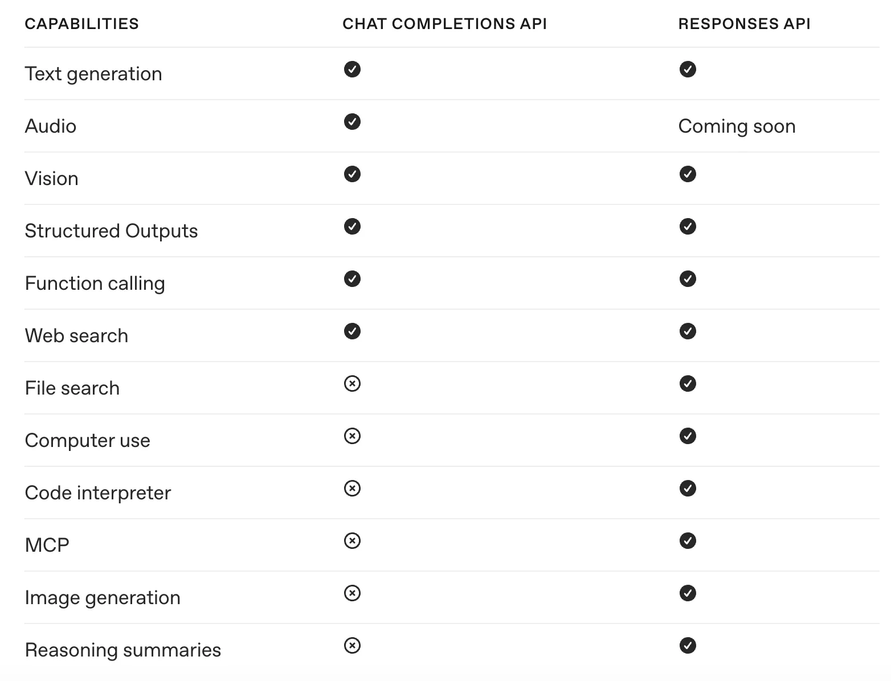

GPT-5가 등장한지 얼마 지나지 않아 GPT-5.1이 공개되었습니다. GPT-5는 공개 당시 기대에 못 미친다는 평이 많았는데, 지적된 점을 빠르게 보완해 내놓은 것으로 보입니다. 기능 추가 외에도 API 쪽 변경이 적지 않아서, 기존에 **Chat Completions API를 사용**하고 있거나 **reasoning effort를 minimal로 사용**하고 있었다면 이번 업데이트를 꼭 확인해야 합니다.

이번 글에서 중점적으로 살펴볼 것들은 다음과 같습니다.

- 모델이 사고량을 스스로 조절하는 **adaptive reasoning**과 새로 생긴 **none** 설정
- API 파라미터 제약 (temperature, top_p 등)
- Chat Completions에서 **Responses**로 API 마이그레이션

## Reasoning Effort의 변화

GPT-5.1의 가장 큰 변화는 **모델이 문제의 복잡도에 따라 사고 시간을 스스로 조절**한다는 점입니다. 쉬운 요청에는 거의 생각하지 않고 바로 답하고, 어려운 요청에는 더 오래 붙잡습니다. 이 동작을 OpenAI는 adaptive reasoning이라고 부릅니다.

reasoning effort는 이 사고량을 개발자가 제어하는 파라미터입니다. GPT-5 이전에는 low, medium, high를 제공했고, GPT-5가 출시되면서 minimal이라는 옵션이 추가되었습니다. GPT-5는 effort를 높게 설정하지 않았는데도 간헐적으로 너무 길게 생각해서 응답 시간이 오래 걸리거나 토큰 비용이 예상보다 많이 나오는 문제가 있었습니다.

GPT-5.1에서는 아예 추론을 하지 않는 **none** 옵션이 추가되었고, **기본값도 none으로 바뀌었습니다.** adaptive reasoning의 한쪽 끝단을 명시적으로 고를 수 있게 된 셈입니다.

<div style="margin: 24px 0; text-align: center;">
<svg viewBox="0 0 400 250" style="width: 100%; height: auto; max-width: 380px;"
     xmlns="http://www.w3.org/2000/svg"
     font-family="Pretendard, -apple-system, sans-serif"
     role="img" aria-label="GPT-5는 medium이 기본값이었으나 GPT-5.1에서는 새로 생긴 none이 기본값이 된 변화">
<style>
.re-t { fill: var(--text, #1c1917); font-size: 16px; font-weight: 700; }
.re-h { fill: var(--text, #1c1917); font-size: 15px; font-weight: 700; }
.re-l { fill: var(--text, #1c1917); font-size: 14px; }
.re-w { fill: var(--on-fill, #14100e); font-size: 14px; }
.re-n { fill: var(--text-muted, #6d6762); font-size: 14px; }
.re-box { fill: var(--bg-subtle, #f5f4f2); stroke: var(--border, #e7e5e4); stroke-width: 1.5; }
.re-def { fill: var(--primary, #0a756c); stroke: var(--primary, #0a756c); stroke-width: 1.5; }
.re-div { stroke: var(--border, #e7e5e4); stroke-width: 1; }
.re-tick { stroke: var(--primary, #0a756c); stroke-width: 1.5; fill: none; }
</style>
<text class="re-t" x="200" y="22" text-anchor="middle">기본값이 옮겨간 자리</text>
<text class="re-h" x="20" y="48">GPT-5</text>
<rect class="re-box" x="16" y="58" width="88" height="32" rx="5"/>
<text class="re-l" x="60" y="79" text-anchor="middle">minimal</text>
<rect class="re-box" x="108" y="58" width="88" height="32" rx="5"/>
<text class="re-l" x="152" y="79" text-anchor="middle">low</text>
<rect class="re-def" x="200" y="58" width="88" height="32" rx="5"/>
<text class="re-w" x="244" y="79" text-anchor="middle">medium</text>
<rect class="re-box" x="292" y="58" width="88" height="32" rx="5"/>
<text class="re-l" x="336" y="79" text-anchor="middle">high</text>
<path class="re-tick" d="M244 90 L244 100"/>
<text class="re-n" x="244" y="116" text-anchor="middle">기본값</text>
<line class="re-div" x1="20" y1="134" x2="380" y2="134"/>
<text class="re-h" x="20" y="160">GPT-5.1</text>
<rect class="re-def" x="16" y="170" width="88" height="32" rx="5"/>
<text class="re-w" x="60" y="191" text-anchor="middle">none</text>
<rect class="re-box" x="108" y="170" width="88" height="32" rx="5"/>
<text class="re-l" x="152" y="191" text-anchor="middle">low</text>
<rect class="re-box" x="200" y="170" width="88" height="32" rx="5"/>
<text class="re-l" x="244" y="191" text-anchor="middle">medium</text>
<rect class="re-box" x="292" y="170" width="88" height="32" rx="5"/>
<text class="re-l" x="336" y="191" text-anchor="middle">high</text>
<path class="re-tick" d="M60 202 L60 212"/>
<text class="re-n" x="60" y="228" text-anchor="middle">기본값</text>
</svg>
</div>

none 설정은 추론 토큰을 최소화해 지연을 줄이는 방향으로 작동합니다. GPT-4.1 같은 비추론 모델과 유사하게 동작하면서도 GPT-5.1의 지능을 활용할 수 있습니다.

```python
from openai import OpenAI
client = OpenAI()

# 빠른 응답이 필요한 경우
result = client.responses.create(
    model="gpt-5.1",
    input="Write a haiku about code.",
    reasoning={"effort": "none"},
    text={"verbosity": "low"}
)
```

## API 파라미터 변경사항

추론 모델 계열에서는 다음 파라미터를 지원하지 않습니다.

- temperature
- top_p
- logprobs

:::note

**GPT-5.1에서 새로 생긴 제약은 아닙니다**

이 제약은 GPT-5 세대부터 적용된 것으로, GPT-5, GPT-5-mini, GPT-5-nano에도 똑같이 해당합니다. 다만 GPT-4.1이나 o 시리즈에서 바로 넘어오는 경우 이 시점에 처음 마주치게 되므로 함께 정리합니다. 참고로 추론 모델이 아닌 `gpt-5.1-chat-latest`는 temperature와 top_p를 지원합니다.

:::

대신 다음과 같은 GPT-5 계열 전용 옵션을 사용합니다. verbosity는 모델이 얼마나 많은 출력 토큰을 생성할지 결정하는 파라미터입니다. 토큰 수를 줄이면 지연도 줄고 답변이 간결해지지만, 답변 품질에도 영향을 미칩니다.

```python
response = client.responses.create(
    model="gpt-5.1",
    input="Your prompt here",
    reasoning={"effort": "none"},  # none | low | medium | high
    text={"verbosity": "medium"},  # low | medium | high
    max_output_tokens=1000
)
```

### 마이그레이션 가이드라인

공식 문서에서 소개하는 전환 권장사항입니다.

| 기존 모델 | GPT-5.1 전환 가이드 |
|---|---|
| `gpt-5` | 모델 ID만 바꾸면 기본값이 `medium`에서 `none`으로 내려갑니다. 기존 동작을 유지하려면 `reasoning_effort`를 명시해야 합니다 |
| `o3` | `medium` 또는 `high` reasoning, 프롬프트 튜닝 필요 |
| `gpt-4.1` | `none` reasoning으로 대체 권장, 프롬프트 튜닝 필요 |
| `o4-mini`, `gpt-4.1-mini` | `gpt-5-mini` 사용, 프롬프트 튜닝 필요 |
| `gpt-4.1-nano` | `gpt-5-nano` 사용, 프롬프트 튜닝 필요 |

:::warning

**모델 ID만 바꾸면 추론이 조용히 꺼집니다**

가장 조심해야 할 지점입니다. GPT-5에서 `reasoning_effort`를 명시하지 않고 기본값(medium)에 의존하고 있었다면, 모델 ID를 `gpt-5.1`로 바꾸는 순간 기본값이 none이 되어 추론이 사라집니다. 에러가 나지 않고 응답도 정상적으로 오기 때문에, 품질이 떨어진 뒤에야 알아차리게 됩니다. 기존 동작을 유지하려면 `reasoning={"effort": "medium"}`을 명시적으로 넘기세요.

:::

## Chat Completions에서 Responses API로

OpenAI의 API는 세 갈래인데 위상이 서로 다릅니다. **Responses**가 현재 표준이고, **Chat Completions**는 계속 지원되지만 신규 프로젝트에 권장되지는 않으며, 레거시 **Completions**는 이미 정리 대상입니다. GPT-5.1 사용 가이드도 Responses를 기준으로 쓰여 있습니다.

Responses API의 주요 장점은 다음과 같습니다.

1. **향상된 성능**: 같은 프롬프트와 설정에서 내부 평가 결과 SWE-bench 점수가 **3% 향상**
2. **캐시 효율**: 캐시 활용률이 내부 테스트 기준 **40~80% 개선**
3. **기본 에이전트 기능**: 한 번의 API 요청으로 여러 도구 호출 가능
4. **상태 유지**: `store: true`로 턴 간 추론 및 도구 컨텍스트 보존



### API 구조 비교

```python
# Chat Completions API
completion = client.chat.completions.create(
    model="gpt-5",
    messages=[
        {"role": "system", "content": "You are a helpful assistant."},
        {"role": "user", "content": "Hello!"}
    ]
)
print(completion.choices[0].message.content)


# Responses API
response = client.responses.create(
    model="gpt-5",
    instructions="You are a helpful assistant.",
    input="Hello!"
)
print(response.output_text)
```

### Multi-turn 대화 처리

```python
# Chat Completions API: 컨텍스트를 수동으로 관리
messages = [{"role": "user", "content": "What is the capital of France?"}]
res1 = client.chat.completions.create(model="gpt-5", messages=messages)

messages += [res1.choices[0].message]
messages.append({"role": "user", "content": "And its population?"})
res2 = client.chat.completions.create(model="gpt-5", messages=messages)


# Responses API: previous_response_id로 간편하게 체이닝
res1 = client.responses.create(
    model="gpt-5",
    input="What is the capital of France?",
    store=True
)

res2 = client.responses.create(
    model="gpt-5",
    input="And its population?",
    previous_response_id=res1.id,
    store=True
)
```

### Function 정의

Chat Completions는 `function` 아래에 한 겹 더 감쌉니다.

```json
{
  "type": "function",
  "function": {
    "name": "get_weather",
    "strict": true,
    "parameters": {}
  }
}
```

Responses는 그 래퍼 없이 평평하게 씁니다.

```json
{
  "type": "function",
  "name": "get_weather",
  "parameters": {}
}
```

`strict`를 생략하면 Responses는 strict 모드를 시도하고, 스키마를 strict로 만들 수 없으면 non-strict로 폴백합니다. "기본이 strict"라기보다 "strict를 먼저 시도한다"에 가깝습니다.

### Structured Outputs 정의

```python
# Chat Completions API: response_format 사용
completion = client.chat.completions.create(
    model="gpt-5",
    messages=[],
    response_format={
        "type": "json_schema",
        "json_schema": {}
    }
)


# Responses API: text.format 사용
response = client.responses.create(
    model="gpt-5",
    input="...",
    text={
        "format": {
            "type": "json_schema",
            "name": "person",
            "schema": {}
        }
    }
)
```

## 마치며

GPT-5.1은 단순한 성능 업그레이드가 아니라 API 사용 방식에도 적지 않은 변화를 가져왔습니다. 특히 reasoning effort 기본값이 바뀐 것은 모델 ID만 교체하는 마이그레이션에서 조용히 품질을 떨어뜨릴 수 있는 변경이라 반드시 확인해야 합니다. 여기서 다룬 것 외에도 코딩용 도구 추가 같은 변화가 더 있으니 공식 문서를 함께 보시길 권합니다.

GPT-5가 기대에 못 미친다는 평이 많았던 만큼 GPT-5.1이 얼마나 보완되었는지는 더 써봐야 알 수 있을 것 같습니다. 엔터프라이즈 시장에서 Anthropic이 자리를 굳히고 멀티모달을 앞세운 Gemini가 빠르게 올라오는 상황에서, OpenAI가 어떤 행보를 보일지도 지켜볼 만합니다.

## 함께 보면 좋은 글

- [Claude Sonnet 5 출시](/issue/claude-sonnet-5-release/) : 이후 나온 경쟁 모델의 가격과 벤치마크

## 참고자료

- [GPT-5.1 모델 문서](https://developers.openai.com/api/docs/models/gpt-5.1)
- [GPT-5.1 for developers](https://openai.com/index/gpt-5-1-for-developers/)
- [Responses API 마이그레이션 가이드](https://developers.openai.com/api/docs/guides/migrate-to-responses)
