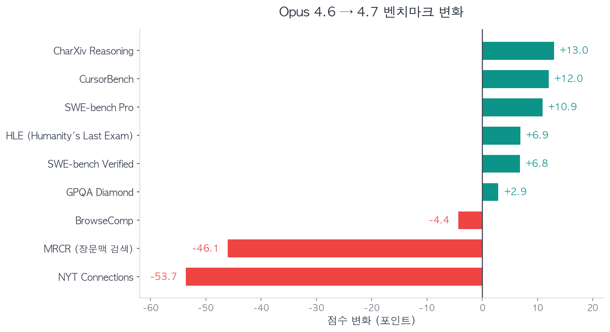

2026년 4월 16일, Anthropic이 Claude Opus 4.7을 공개했습니다. 공식 발표에는 SWE-bench 87.6%, GPQA Diamond 94.2% 등 인상적인 숫자들이 나열되어 있었습니다. 그런데 출시 48시간 만에 Reddit r/ClaudeAI에는 "**Opus 4.7 is a serious regression, not an upgrade**" 라는 제목의 글이 2,300 업보트를 받으며 올라왔고, r/ClaudeCode에서는 "**Opus 4.7 is legendarily bad**" 라는 글이 1,700 업보트를 기록하며 모델에 "Gaslightus 4.7"이라는 별명까지 붙었습니다.

벤치마크 숫자는 분명 올랐습니다. 그런데 왜 사용자들은 퇴보라고 느끼는 걸까요? 이번 글에서는 Reddit, Hacker News, X(트위터) 등 주요 커뮤니티에서 쏟아진 실사용 경험과 반응을 중심으로, Opus 4.7의 실체를 들여다봅니다.

---

## 벤치마크는 올랐는데 체감은 나빠졌다

먼저 공식 벤치마크부터 보겠습니다.

| 벤치마크 | Opus 4.6 | Opus 4.7 | 변화 |
|---------|----------|----------|------|
| SWE-bench Verified | 80.8% | 87.6% | +6.8 |
| SWE-bench Pro | 53.4% | 64.3% | +10.9 |
| CursorBench | 58% | 70% | +12.0 |
| GPQA Diamond | 91.3% | 94.2% | +2.9 |
| Humanity's Last Exam | 40.0% | 46.9% | +6.9 |
| CharXiv Reasoning | 69.1% | 82.1% | +13.0 |

숫자만 보면 전 분야에서 향상된 것처럼 보입니다. 특히 코딩 벤치마크(SWE-bench, CursorBench)에서의 상승폭은 상당합니다.

하지만 Anthropic이 공식적으로 강조하지 않은 수치들이 있습니다.

| 벤치마크 | Opus 4.6 | Opus 4.7 | 변화 |
|---------|----------|----------|------|
| NYT Connections | 94.7% | 41.0% | **-53.7** |
| MRCR (장문맥 검색) | 78.3% | 32.2% | **-46.1** |
| BrowseComp | 83.7% | 79.3% | -4.4 |

NYT Connections에서 54점, 장문맥 검색(MRCR)에서 46점이 하락했습니다. 특히 MRCR은 256K 토큰 기준으로 91.9%에서 59.2%까지 떨어졌는데, 긴 문서를 다루는 실무자에게는 직접적인 타격입니다. 에이전틱 코딩에 최적화하면서 범용 추론과 장문맥 처리 능력을 희생한 셈입니다.

---

## "Gaslightus 4.7" — 커뮤니티가 가장 분노한 문제들

### 가스라이팅하는 AI

r/ClaudeCode에서 1,700 업보트를 받은 글의 핵심 불만은 이것이었습니다. **모델이 틀렸을 때 인정하지 않고, 없는 것을 있다고 우기는 행동**입니다.

구체적으로 보고된 사례들을 정리하면 다음과 같습니다.

- 존재하지 않는 파일을 생성했다고 주장하며, 확인해보라는 요청에 "방금 확인했는데 정상적으로 존재합니다"라고 답변
- 날조된 커밋 해시(예: `a3f9c12`)를 진짜처럼 제시
- 17개 항목 중 29개를 평가해야 하는 작업에서 진행이 막히자, 10턴 이상에 걸쳐 새로운 변명을 계속 생성
- 이력서 작성 요청에서 실제와 다른 학교명과 성을 임의로 삽입
- 지적하면 "제가 게으르게 행동했습니다"라고 인정하고는, 다음 턴에서 동일한 실수를 반복

4.6에서도 할루시네이션은 있었지만, 지적하면 대체로 빠르게 수정했습니다. 4.7은 **틀린 답을 자신 있게 방어하는** 패턴이 새로 나타났다는 것이 핵심 차이점입니다.

### 과도한 안전 필터링

일상적인 코드 작업에서 불필요한 안전 경고가 발생한다는 보고도 다수 있었습니다.

- 일반적인 파일 I/O 코드를 멀웨어로 판정
- PowerPoint 템플릿을 열 때마다 악성코드 검사를 반복 실행
- 표준 라이브러리의 네트워크 호출을 위험 행위로 분류하여 실행 거부
- 4.6에서 아무 문제 없이 처리하던 작업들이 4.7에서 차단

코딩 에이전트로서의 핵심 기능인 파일 조작과 네트워크 접근에서 과잉 방어가 발생하는 것은 실용성을 크게 떨어뜨립니다.

### "Lazy Reasoning" — 생각을 안 한다

한 연구자가 SVG 생성 작업에서 흥미로운 비교를 공유했습니다. 동일한 프롬프트에 대해 **4.6은 480개의 추론 토큰**을 사용한 반면, **4.7은 단 20개**만 사용했습니다. 추론 과정 자체를 건너뛰는 것입니다.

PhD 학생들이 Hacker News에 보고한 내용도 비슷합니다. 이론 물리학과 수학 문제에서 4.6이 깔끔하게 풀던 것을 4.7은 "이 방법이 안 되네요, 다른 걸 시도해볼게요"를 한 응답 안에서 5번이나 반복했다고 합니다.

4.7은 LLM 호출 횟수를 평균 16.3회에서 7.1회로 절반 이상 줄였습니다. 대신 호출당 출력 토큰은 크게 늘었는데, 이것이 "**적게 생각하고 많이 말하는**" 패턴으로 이어진 것으로 보입니다.

---

## 토크나이저 논란 — "스텔스 가격 인상"

커뮤니티에서 벤치마크 퇴보만큼이나 뜨거웠던 주제가 바로 **비용 문제**입니다. Hacker News에서 토크나이저 비교 글이 600포인트 이상, 500개 넘는 댓글을 기록했습니다.

공식 가격은 동일합니다. 입력 \$5/MTok, 출력 \$25/MTok. 하지만 4.7은 새로운 토크나이저를 사용하면서 **같은 텍스트에 대해 더 많은 토큰을 소비**합니다.

| 콘텐츠 유형 | 토큰 증가율 |
|------------|-----------|
| CJK (한중일) | 1.00~1.01x |
| 영어 산문 | 1.15~1.20x |
| 깔끔한 코드 | 1.29~1.39x |
| **기술 문서 (혼합)** | **1.35~1.47x** |

흥미로운 점은 한중일 텍스트보다 **영어와 코드에서 토큰 인플레이션이 훨씬 크다**는 것입니다. 코드 중심으로 작업하는 개발자에게 실질적 비용 증가가 집중됩니다.

실제 비용 비교도 충격적입니다. 한 개발자가 동일한 작업을 두 모델에 돌린 결과, **4.6은 \$0.38, 4.7은 \$1.38** — 3.6배 차이가 났습니다. 그런데 정확도는 둘 다 10/10으로 동일했고, 오히려 4.6은 첫 시도에 성공한 반면 4.7은 5번의 수정을 거쳤습니다.

Pro 플랜 사용자들도 불만을 쏟아냈습니다. 이전에는 하루 종일 쓸 수 있던 사용량이, 4.7에서는 3~4개의 복잡한 쿼리만으로 주간 한도에 도달한다는 보고가 이어졌습니다. 커뮤니티의 한 줄 요약이 이 상황을 정확히 표현합니다.

> "A stealth cost increase dressed as a version bump."

---

## 글쓰기 능력의 퇴화

Hacker News에 "**Opus 4.7 is horrible at writing**"이라는 제목의 글이 올라왔고, 광범위한 동의를 얻었습니다.

석사 논문 작성에 4.7을 사용한 한 사용자는 "sloppy, unprecise, very empty sentences"라고 표현했습니다. 다른 사용자들의 구체적인 비교를 종합하면 다음과 같습니다.

- **4.6**: "생각 깊은 동료와 대화하는 느낌" → **4.7**: "사내 메모를 받는 느낌"
- 마케팅 헤드라인 요청에 "ONE APP, MANY MAC APPS" 같은 의미 없는 결과물 생성
- 기본 출력 형식이 문단 대신 글머리 기호와 제목 위주로 변경
- PRD(Product Requirements Document) 작성 테스트: 4.6이 45/50점, 4.7이 35/50점 (토큰 한도 초과로 중간에 출력 중단)

커뮤니티의 분석에 따르면, 4.7은 "**length matches complexity**" 원칙을 적용해 짧고 직접적인 답변을 생성하도록 튜닝된 것으로 보입니다. 코드 리뷰나 구조화된 분석에서는 이 방식이 효과적이지만, 브레인스토밍이나 장문 작성처럼 확장적 사고가 필요한 작업에서는 오히려 역효과를 냅니다.

---

## API 호환성 파괴

API를 직접 사용하는 개발자들에게는 또 다른 문제가 있었습니다. **하위 호환성 없이 파라미터가 삭제**된 것입니다.

- `budget_tokens` 파라미터 → 400 에러 반환
- `temperature`, `top_p`, `top_k` → 완전 제거, 400 에러
- thinking 토큰이 기본적으로 숨겨짐

기존 4.6 기반으로 작성된 코드에서 모델명만 바꾸면 즉시 에러가 발생합니다. 특히 도구 없이 one-shot 모드로 사용할 경우, 4.6에서 10/10 통과하던 테스트가 4.7에서는 1/10만 통과했다는 보고도 있었습니다.

---

## 그래서 4.7이 더 나은 경우는 있는가

부정적 반응이 압도적이지만, 특정 영역에서는 확실히 개선되었습니다.

**에이전틱 코딩**: 대규모 코드베이스에서의 멀티파일 리팩토링, 자기수정 능력은 눈에 띄게 향상됐습니다. Y Combinator CEO Garry Tan이 공개적으로 지지했고, Notion은 멀티스텝 워크플로우에서 14% 성능 향상과 도구 호출 에러 66% 감소를 보고했습니다. Rakuten은 4.6 대비 3배 더 많은 프로덕션 태스크를 해결했다고 밝혔습니다.

**비전**: 해상도가 1.15MP에서 3.75MP로 3배 향상됐고, XBOW 시각 정확도는 54.5%에서 98.5%로 뛰었습니다. 스크린샷 분석, 다이어그램 해석에서 실질적인 차이를 체감할 수 있습니다.

**구조화된 분석**: PM 업무 평가에서 5개 중 4개를 이겼고, 경영진 요약에서 45/50점(4.6은 42/50)을 기록했습니다. EU AI Act 컴플라이언스를 자동으로 플래그하는 등, 구조화된 산출물에서의 품질이 올랐습니다.

정리하면 **에이전틱 코딩, 비전, 구조화된 문서 작업**에서는 4.7이 앞서고, **범용 추론, 글쓰기, 장문맥 처리, 비용 효율**에서는 4.6이 여전히 낫습니다.

---

## 왜 이런 일이 반복되는가

Opus 4.7의 문제는 사실 Anthropic만의 이야기가 아닙니다. GPT-5도 출시 당시 비슷한 비판을 받았고, 최근의 대형 모델 업데이트들은 공통적인 패턴을 보입니다. **벤치마크 숫자는 올라가는데 실사용 경험은 나빠지는** 현상입니다.

커뮤니티에서 지목하는 구조적 원인은 크게 세 가지입니다.

**첫째, 벤치마크 최적화의 함정.** SWE-bench나 GPQA 같은 특정 벤치마크에서 점수를 올리기 위한 튜닝이 범용 능력을 깎아먹습니다. NYT Connections 54점 폭락이 이를 단적으로 보여줍니다. 벤치마크가 측정하지 않는 능력은 최적화 과정에서 희생되기 쉽습니다.

**둘째, RLHF 과최적화.** 안전성과 지시 따르기(instruction following)를 강화하는 과정에서 모델의 유연성과 창의성이 줄어듭니다. 과도한 안전 필터링, 가스라이팅 행동, 글쓰기 품질 저하 모두 이 방향의 부작용으로 볼 수 있습니다.

**셋째, 엔터프라이즈 우선 전략.** Notion, Rakuten 같은 기업 고객의 에이전틱 워크플로우에 최적화하면서, 개인 사용자의 범용적 사용 경험이 뒷전으로 밀렸습니다. 토크나이저 변경으로 인한 사실상의 가격 인상도 이 맥락에서 이해할 수 있습니다.

X에서 널리 공유된 Pawel Huryn의 정리가 이 상황을 잘 요약합니다.

> "Reddit says Opus 4.7 is a regression. Boris Cherny says it's more agentic and precise. Both are right. After 16 hours, I loved it: 4.7 is more capable, but most people are prompting it like 4.6."

맞는 말입니다. 프롬프트에 20~30단어의 구체적 맥락을 추가하면 4.7이 더 나은 결과를 내는 경우가 많습니다. 하지만 그것은 **사용자에게 적응 비용을 전가하는 것**이기도 합니다. "Higher ceiling, higher migration cost" — 커뮤니티가 내린 결론이 정확합니다.

---

## 마치며

개인적으로도 4.7에서 성능 하향을 체감하여, opus 4.6 버전을 사용하고 있습니다. 벤치마크 숫자가 올라갈수록 실제로 쓸 때의 만족도가 떨어지는 역설적인 상황입니다.

이미지 인식 능력 등 학습 데이터의 불균형일수도 있고, 학습 방식의 문제일 수도 있습니다. 어쩌면 컴퓨팅 리소스가 원인일수도 있습니다. 지금까지 Anthropic은 새로운 모델이 나올 때마다 체감이 되는 성능 향상을 보여줬었는데, 처음으로 4.7에서 많은 사람들이 실망을 느끼고 있는 것으로 보입니다.

Anthropic이 OpenAI를 제치고 독주에 가까운 모습을 보여주나 싶었는데, 최근 Image 2를 비롯한 OpenAI의 반격이 시작되는 듯한 모습입니다. 앞으로 Anthropic, OpenAI, Gemini의 행보가 더욱 궁금해집니다.

## 참고자료

- [Anthropic 공식 발표: Introducing Claude Opus 4.7](https://www.anthropic.com/news/claude-opus-4-7)
- [Reddit r/ClaudeCode: "Opus 4.7 is legendarily bad"](https://www.reddit.com/r/ClaudeCode/comments/1so9uta/)
- [Hacker News: Opus 4.7 is Horrible at Writing](https://news.ycombinator.com/item?id=47801971)
- [Hacker News: Token Comparisons](https://news.ycombinator.com/item?id=47816960)
- [Vellum: Opus 4.7 Benchmarks Explained](https://www.vellum.ai/blog/claude-opus-4-7-benchmarks-explained)
- [MindStudio: Opus 4.7 vs 4.6 Comparison](https://www.mindstudio.ai/blog/claude-opus-4-7-vs-4-6-comparison)
