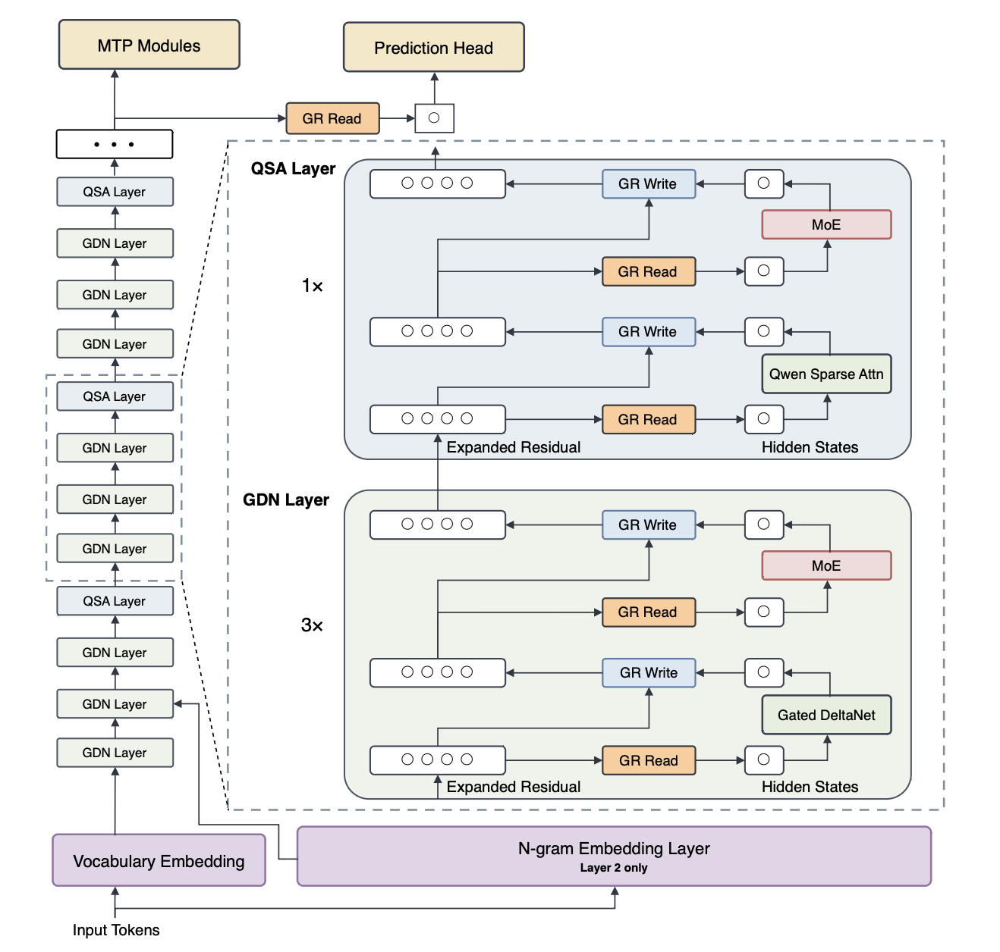
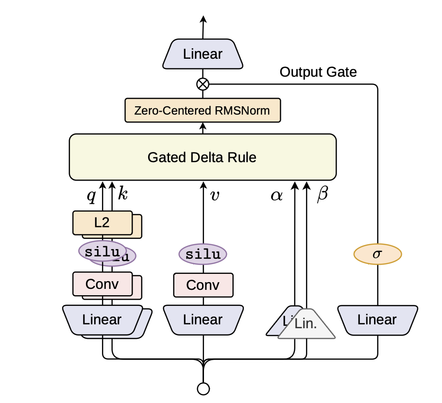
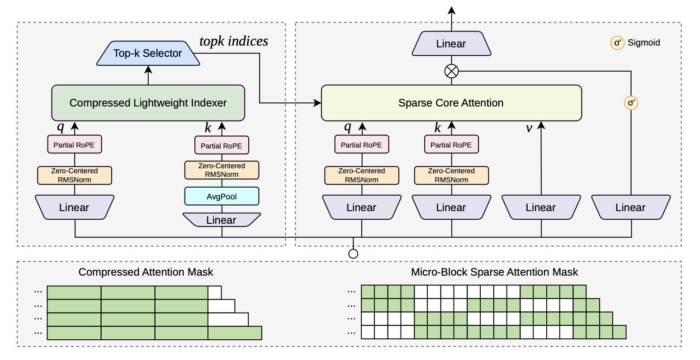
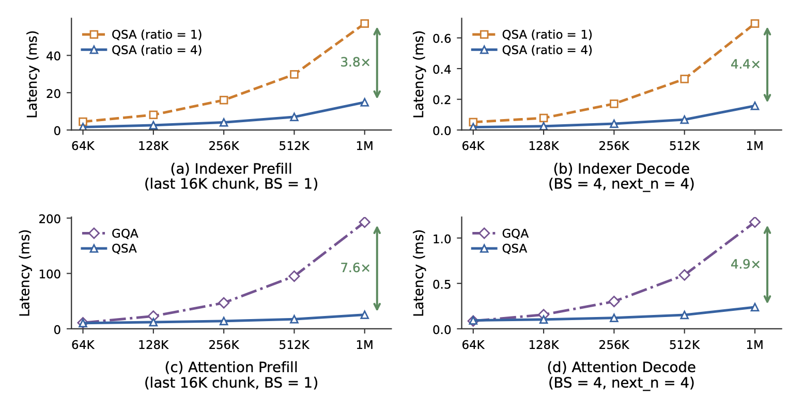
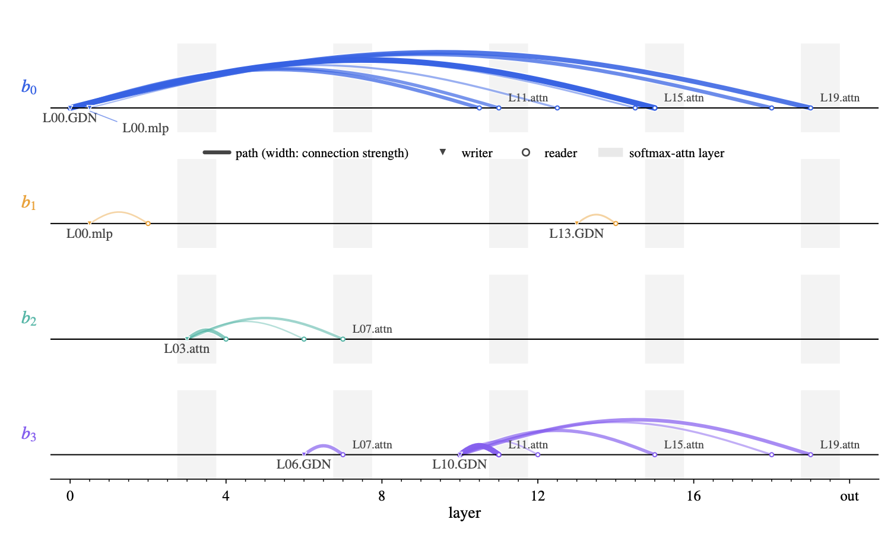
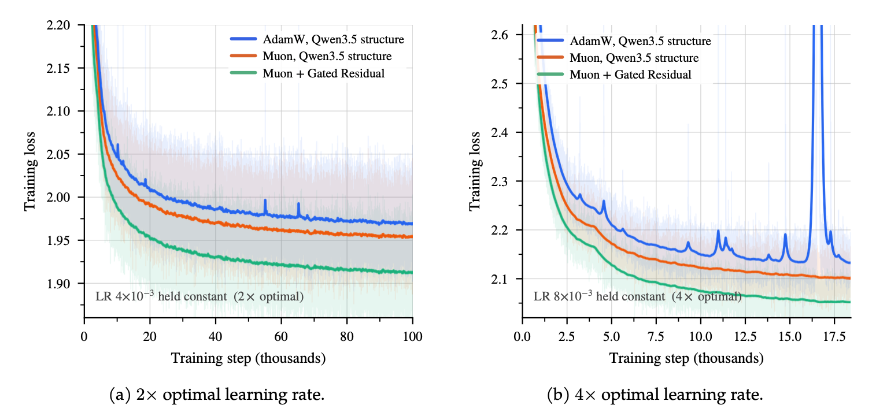

2026년 8월 26일, Qwen 팀이 **Qwen3.8-Flash-Next**를 공개했습니다. [Qwen3.8-27B](/issue/qwen3-8-27b/)를 내놓은 지 6일 만인데, 이번에는 아키텍처부터 다릅니다. 125B MoE 모델에서 토큰당 6B만 활성화하면서도, 전세대 플래그십 Qwen3.7-Plus(397B total, 17B active)를 14개 프리트레이닝 벤치마크 중 8개에서 이깁니다. 활성 파라미터는 1/3, 학습 토큰도 1/3이고, 학습 FLOPs는 약 1/9 수준입니다.

 

이 글은 함께 공개된 28페이지짜리 테크 리포트 <em>"On the Design of Qwen3.8-Next Architecture: Evaluation, Efficiency, and Training Stability"</em>를 읽고, 네 가지 핵심 아키텍처와 설계 결정의 근거를 정리합니다.

## 핵심 스펙

| 항목 | 값 |
|------|-----|
| 총 파라미터 | 125B (Sparse MoE) |
| 토큰당 활성 파라미터 | **6B** (활성 비율 4.8%) |
| N-gram 임베딩 파라미터 | 51B (호스트 메모리) |
| MTP 헤드 | 4B |
| 레이어 | 48 (GDN 36 + QSA 12) |
| Hidden dimension | 2,560 |
| 총 Expert 수 | 512 (10 routed + 1 shared / token) |
| 컨텍스트 | 262K (YaRN 확장 시 1M) |
| 라이선스 | Qwen Community License 1.0 |
| API 가격 | $0.16 / $0.47 (input / output per 1M tokens) |

눈에 띄는 숫자가 두 가지입니다. 첫째, 활성 비율이 4.8%(6B/125B)로 매우 낮습니다. 둘째, N-gram 임베딩 51B가 GPU가 아니라 호스트(CPU) 메모리에 올라갑니다. 이 51B는 FLOPs 관점에서 사실상 공짜인데, 그 이유는 뒤에서 다룹니다.

:::note

**Qwen Community License**

Apache 2.0이 아닙니다. 상업 사용은 가능하지만, MAU 1억 명 또는 월 매출 $20M을 넘기면 모델명 표기 의무가 생기고, Model-as-a-Service나 AI 워크 어시스턴트 사업에는 별도 라이선스가 필요합니다.

:::

## 하나의 설계 문제, 세 개의 평가 축

이 리포트의 독특한 점은 아키텍처 변경을 **세 축으로 동시에 평가**한다는 것입니다.

- **성능**: 프리트레이닝 loss와 downstream benchmark를 함께 봄
- **비용**: 학습, prefill, decode 각각의 연산 비용 변화
- **안정성**: 최적 하이퍼파라미터와 학습 안정성에 미치는 영향

Qwen 팀은 이 세 축이 자주 충돌한다고 명시합니다. Loss가 내려가는데 accuracy는 그대로인 경우, 효율은 좋은데 학습이 불안정해지는 경우가 반복됩니다. 리포트 전체를 관통하는 메시지는 **"loss, benchmarks, efficiency, stability는 하나의 설계 문제"**라는 것입니다.

이 관점에서 설계된 네 가지 핵심 컴포넌트를 하나씩 살펴봅니다.

  <em>Qwen3.8-Flash-Next 전체 아키텍처. GDN 3개와 QSA 1개가 블록 단위로 반복되며, 모든 sublayer가 Gated Residual로 읽고 쓴다. Layer 2에는 N-gram 임베딩이 배치된다. (출처: Qwen3.8-Flash-Next Tech Report, Figure 1)</em>

## GDN Hybrid: Recurrent과 Attention의 결합

### 왜 Full Attention이 아닌가

Self-attention의 연산량은 시퀀스 길이 $n$에 대해 $O(n^2)$이고, 추론 시 KV 캐시는 시퀀스와 함께 선형으로 커집니다. 1M 토큰 컨텍스트에서 감당하기 어려운 비용입니다.

Sliding Window Attention(SWA)은 비용을 줄이지만, 윈도우 밖의 정보는 깊이(depth)로만 간접 전파됩니다. 효율적 로컬 처리와 글로벌 정보 유지 사이의 근본적인 긴장이 생깁니다.

Flash-Next는 이 긴장을 **Gated DeltaNet(GDN)**과 full attention의 **layer-wise 하이브리드**로 해결합니다. 4개 레이어 블록 중 3개가 GDN, 1개가 full softmax attention인 구조입니다.

### Gated DeltaNet이 하는 일

GDN은 각 헤드마다 key-value association을 행렬 상태 $S_t$에 저장하는 **fast-weight memory**로, 핵심은 **gated delta rule**입니다. 두 개의 gate가 상보적 역할을 합니다.

- **Decay gate** $\alpha_t$: 기존 상태의 수명을 전체적으로 조절합니다. 0에 가까우면 과거 정보를 빠르게 잊습니다.
- **Write gate** $\beta_t$: 새 key-value 쌍을 얼마나 강하게 쓸지 결정합니다. 기존에 해당 key와 연관된 값이 있으면 그 잔차(residual error)만 씁니다.

이 "지우고 다시 쓰는" 방식이 중요합니다. 순수한 additive linear attention은 outer product를 계속 쌓기 때문에 상태가 무한히 커집니다. GDN은 기존 association을 직접 업데이트하므로 상태 크기가 고정됩니다. 선형 비용으로 prefix를 고정 크기 상태에 압축하는 셈입니다.

반면 4개 중 1개인 full attention 레이어는 이 recurrent state만으로는 불가능한 **직접적인 토큰 레벨 검색**을 담당합니다. "어떤 finite-state recurrent memory도 정확히 재현할 수 없는 검색"이라고 리포트는 표현합니다.

  <em>Gated DeltaNet token mixer. Query, key, value가 short causal convolution을 거친 뒤 gated delta recurrence에 들어간다. Decay gate α와 write gate β가 recurrent update를 제어하고, sigmoid output gate가 최종 출력을 조절한다. (출처: Tech Report, Figure 2)</em>

### 설계 세부 사항

원래 GDN은 SiLU output gate를 사용했는데, Flash-Next는 **bounded sigmoid gate**로 바꿨습니다. SiLU는 음수 출력을 허용하지만, sigmoid는 $[0, 1]$ 범위에 머뭅니다. 이 제한이 벤치마크에서 일관된 개선을 가져왔고, 학습 안정성에서도 유리합니다.

모든 RMSNorm도 **zero-centered RMSNorm**으로 교체했습니다. RMSNorm weight의 성장을 제어하기 위함입니다.

### Positional Encoding 실험: 프리트레이닝과 포스트트레이닝의 간극

Full attention 레이어에 RoPE를 넣은 버전과 positional encoding을 아예 넣지 않은 NoPE 버전을 비교한 결과가, 이 리포트에서 반복되는 교훈을 처음으로 보여줍니다. **프리트레이닝 단계에서는 둘 사이에 거의 차이가 없었습니다.** 그런데 포스트트레이닝(RLHF 등) 이후에는 NoPE 모델의 **endless generation**(응답이 끝나지 않는 현상) 발생률이 크게 올라갔습니다.

프리트레이닝 loss만 보면 positional encoding을 빼는 게 "무해한 shortcut"처럼 보이지만, 포스트트레이닝까지 가면 실패합니다. 이 패턴은 리포트 전체에서 여러 번 반복됩니다.

### 아키텍처 Ablation 결과

25B-A3B 규모의 ablation(Table 1)에서 GDN hybrid는 9개 벤치마크 중 **8개에서 full attention Transformer를 이기고**, 7개에서 SWA hybrid를 이겼습니다. 전체 평균 53.81로 가장 높았습니다.

| 아키텍처 | Knowledge | STEM | Reasoning | Multilingual | Code | 평균 |
|---------|-----------|------|-----------|-------------|------|------|
| Full Attention | 62.65 / 37.59 | 21.76 / 49.40 | 75.13 / 63.78 | 47.74 | 51.01 / 39.73 | 49.87 |
| SWA Hybrid | **66.30** / 40.67 | 22.45 / 45.48 | 74.22 / 65.88 | 51.33 | **52.12** / 41.93 | 51.15 |
| **GDN Hybrid** | 66.26 / **42.82** | **23.45** / **53.98** | **77.07** / **68.72** | **54.83** | 49.71 / **47.48** | **53.81** |

  <em>Table 1 재구성. Knowledge = MMLU / MMLU-Pro / SuperGPQA, Code = EvalPlus / MultiPL-E. 굵은 값이 최고 점수.</em>

## Qwen Sparse Attention: 긴 컨텍스트의 해법

### Continued Pretraining에서 도입

QSA(Qwen Sparse Attention)는 처음부터 학습에 쓰이는 것이 아닙니다. 프리트레이닝이 진행된 시점에서 full attention 레이어를 교체합니다. 이를 **Continued Pretraining(CPT)** 단계라고 부릅니다.

실용적 이유가 있습니다. 프리트레이닝 초기에는 full attention으로 모델이 attention 분포를 충분히 학습하게 두고, 그 분포 지식을 QSA의 indexer에 증류(distill)합니다.

### Compressed Lightweight Indexer

QSA의 핵심은 **compressed lightweight indexer**입니다. 기존 sparse attention 방식(예: DSA)은 토큰 레벨에서 중요도를 매기기 때문에 indexer 자체의 비용이 $O(n^2)$으로 남아 있었습니다. QSA는 이 비용을 **블록 단위 압축**으로 줄입니다.

동작 순서는 이렇습니다.

1. 입력 key를 $r$개 토큰($r=4$)의 비겹침 **마이크로블록**으로 나누고, 각 블록의 key를 average pooling으로 하나의 벡터로 압축합니다.
2. 압축된 key와 query 사이의 유사도를 계산합니다. 이때 **partial RoPE**(128차원 중 64차원만)를 적용해서 위치 정보를 보존합니다.
3. 토큰 예산 $K=2{,}048$에서 블록 예산 $K_B = \lceil K/r \rceil = 512$개의 **최고 점수 블록을 선택**합니다.
4. 선택된 블록을 원래 토큰 인덱스로 확장하고, 마지막 불완전 블록의 토큰을 포함합니다.

핵심 효율: indexer 복잡도가 <strong>$O(n^2)$에서 $O(n^2/r)$로</strong> 줄어듭니다.

indexer 자체도 가볍습니다. MQA 구조(query head 4개, shared key head 1개)로, 실제 attention 모듈(query head 24개, key-value head 2개)보다 훨씬 작습니다.

  <em>QSA 구조. 왼쪽: compressed lightweight indexer가 블록 단위 중요도를 추정해 top-k 인덱스를 선택한다. 오른쪽: 선택된 인덱스가 micro-block sparse attention mask로 확장되어 core attention을 수행한다. (출처: Tech Report, Figure 3)</em>

### 2단계 학습

QSA 학습은 두 단계로 나뉩니다.

**Stage 1: Dense Distillation (1,000 steps)**: indexer만 학습합니다. Full attention의 softmax attention 분포를 max pooling으로 블록 레벨에 집계한 뒤, KL divergence로 indexer에 증류합니다. 약 2B 토큰 소비.

**Stage 2: Sparse Training (8,000 steps)**: backbone과 indexer를 함께 학습합니다. 실제 sparse attention으로 전환하고, 약 200B 토큰을 소비합니다.

:::note

**QSA의 loss 궤적**

Stage 2 sparse training 동안 QSA의 loss는 full attention 대비 $10^{-4}$ 수준의 차이로 거의 동일합니다. Indexer의 중요도 추정이 full attention의 attention 패턴을 정확히 근사한다는 뜻입니다.

:::

### 속도와 장기 컨텍스트 성능

1M 토큰 컨텍스트에서 dense GQA(FlashInfer 기반) 대비 커널 레벨 속도입니다.

| 단계 | 속도 향상 |
|------|----------|
| Prefill (마지막 16K 청크) | **7.6배** |
| Decode (batch=4, next_n=4) | **4.9배** |

컨텍스트가 길어질수록 이득이 커집니다. 64K에서는 차이가 미미하지만 1M에서는 확연합니다.

  <em>QSA의 커널 레벨 latency. (a,b) indexer latency, (c,d) indexer + core attention 포함 전체 latency. 1M 컨텍스트에서 prefill 7.6배, decode 4.9배 속도 향상. (출처: Tech Report, Figure 6)</em>

장기 컨텍스트 검색 벤치마크 RULER에서도 QSA는 512K 이상에서 full attention보다 점수가 **오히려 올라갑니다**(90.08 → **93.00**). Sparse attention이 정보를 잃는 게 아니라, indexer가 노이즈를 걸러주는 효과가 있습니다.

MTP(Multi-Token Prediction) 모듈에서도 top-k 인덱스를 재사용합니다. Speculative decoding의 draft model 비용을 추가로 줄이는 장치입니다.

## Gated Residual: Loss와 Accuracy는 왜 갈라지나

### Residual Connection의 한계

Transformer의 residual connection은 모든 블록에 출력까지의 직접 경로를 제공합니다. 그런데 pre-normalization 구조에서는 모든 레이어가 같은 residual stream을 읽고 써야 합니다. 초기 레이어에서 쓰인 정보가 이후 모든 레이어의 쓰기와 경쟁하면서, 깊어질수록 초기 정보가 희석됩니다.

이 문제를 해결하는 접근이 두 가지입니다. 하나는 stream 자체를 **넓히는** 것이고, 다른 하나는 넓힌 stream을 **어떻게 읽고 쓸지** 정교하게 설계하는 것입니다. Flash-Next는 둘 다 합니다.

### 4-Branch 확장과 Gated Residual

Flash-Next는 residual stream을 **4개 branch**($n_r = 4$)로 확장합니다. 단순히 넓히는 것만으로도 25B-A3B MoE 모델에서 학습 loss가 약 0.01 내려갑니다.

하지만 핵심은 넓이가 아니라 **읽기/쓰기 메커니즘**입니다. Flash-Next가 설계한 **Gated Residual(GR)**의 동작은 이렇습니다.

**읽기(Read)**: 각 branch를 독립적으로 RMSNorm하고, 학습 가능한 per-channel gain $\gamma_c$를 곱한 뒤, data-dependent gate $G$로 elementwise gating합니다. 그 결과를 branch들 사이에서 평균냅니다.

**쓰기(Write)**: 블록 출력 $y$를 data-dependent scalar gate $s_i$로 조절해서 각 branch에 씁니다.

:::note

**GatedNorm: 안정성의 핵심 장치**

RMSNorm 뒤에 sigmoid self-gate를 하나 붙인 것을 **GatedNorm**이라 부릅니다.

$$\text{GatedNorm}(u) = \text{RMSNorm}(u) \odot \sigma(W_2 \, \text{SiLU}(W_1 \, \text{RMSNorm}(u)))$$

이 작은 gate가 학습 안정성에서 결정적 기여를 합니다. Stress test 섹션에서 다시 등장합니다.

:::

### Loss 0.002 차이, Benchmark 1.98점 차이

Read와 write를 **static**(고정 가중치)으로 할 때와 **dynamic**(data-dependent)으로 할 때를 비교하면, 프리트레이닝 loss 차이는 **0.002**에 불과합니다. 거의 차이가 없는 셈입니다.

그런데 downstream benchmark에서는 **1.98점** 차이가 발생합니다. Static 대비 dynamic이 평균 50.91에서 54.47로, benchmark 향상 폭이 두 배 이상입니다(Table 5).

| Residual 구성 | Loss | Knowledge | STEM | Reasoning | Code | 평균 |
|-------------|------|-----------|------|-----------|------|------|
| Pre-norm (baseline) | 1.617 | 38.40 | 49.40 / 77.41 | 64.73 | 37.15 | 50.91 |
| mHC (static) | 1.596 | 43.69 | 55.08 / 78.05 | 65.42 | 40.94 | 52.49 |
| mHC (dynamic) | 1.594 | 45.84 | 59.54 / 78.51 | 66.01 | 41.30 | 54.47 |
| **GR** | **1.590** | **46.02** | **61.18** / **78.20** | **66.54** | **42.00** | **54.66** |

Loss만 보고 설계를 결정했다면 data-dependent 변형을 채택하지 않았을 것이고, 1.98점이라는 벤치마크 향상을 놓쳤을 것입니다.

### Cross-layer Path 분석

GR이 만들어내는 cross-layer 정보 흐름을 분석한 결과가 흥미롭습니다.

4개 branch 중 **하나의 branch가 장거리 경로를 전담**합니다. 이 branch의 연결은 median으로 **10.9개 레이어**를 건너뜁니다. Layer 0에서 쓰여진 정보가 Layer 10 이후의 attention 레이어까지 보존됩니다.

나머지 3개 branch는 **로컬 경로**를 담당합니다. Median skip이 1.2~3.5 레이어에 불과합니다.

모델이 학습 과정에서 자동으로 역할을 분화시킨 것입니다. 장거리 branch에서 가장 많이 읽는 sublayer는 대부분 **softmax attention 레이어**였습니다. GDN이 압축한 문맥을 full attention이 정밀하게 검색하는 구조가 GR을 통해 자연스럽게 형성되는 셈입니다.

  <em>GR이 추가한 cross-layer 경로. 각 행이 하나의 residual branch이고, 연결 선의 폭이 기여도를 나타낸다. b₀ branch가 장거리 경로를 전담하며, 나머지 세 branch는 로컬에 집중한다. 회색 음영은 softmax attention 레이어. (출처: Tech Report, Figure 7)</em>

### FP8 저장

GR의 gate와 GDN의 bounded output 덕분에 residual state의 값 범위가 좁습니다. 이를 이용해 residual branch를 **FP8**로 저장하면 바이트 수가 절반으로 줄고, 품질 저하는 거의 없습니다. Gate가 값을 $[0, 1]$로 제한하고, GDN도 bounded activation을 쓰기 때문에 FP8의 좁은 표현 범위와 잘 맞는 것입니다.

## N-gram Embedding: GPU 밖의 51B 파라미터

### 개념

짧은 n-gram(예: "of the", "in the")을 키로 사용해 임베딩 테이블에서 벡터를 조회하고, 그 벡터를 토큰 표현에 더합니다. 토큰의 **주변 문맥을 반영한 보강 표현**을 얻는 것입니다. 이 아이디어 자체는 Google DeepMind(Gemma 3n)나 RWKV 커뮤니티에서도 탐구되었는데, Flash-Next는 이를 대규모 MoE와 결합해서 체계적으로 검증했습니다.

Flash-Next에서는 이 테이블이 51B 파라미터에 달하지만, **GPU 메모리에 올리지 않습니다.** 호스트(CPU) 메모리에 테이블을 올려놓고, n-gram 주소가 결정론적(deterministic)이므로 미리 계산해서 **비동기 prefetch**합니다.

**Layer 2에 배치한 이유**가 여기에 있습니다. Layer 1이 연산되는 동안 Layer 2에 필요한 n-gram 벡터를 미리 가져오면, host-to-device 전송 시간을 연산 뒤에 숨길 수 있습니다.

토큰당 추가 FLOPs는 lookup뿐이라 사실상 제로. 51B라는 파라미터 수가 무색할 정도로 추론 비용에 영향이 없습니다.

:::note

**N-gram Embedding의 핵심 구조**

| 항목 | 값 |
|------|-----|
| 배치 위치 | Layer 2 (Layer 1 연산 중 prefetch) |
| 파라미터 | 51B (호스트 메모리) |
| 토큰당 추가 FLOPs | ~0 (lookup only) |
| TPP (tokens per parameter) | 300 |
| Vocabulary 크기 | 기본 토크나이저의 200배까지 실험 |

:::

### MoE와 독립적인 스케일링 축

MoE expert 수를 고정한 채 N-gram vocabulary를 키우면 성능이 올라가고, 반대로 N-gram을 고정한 채 expert를 키워도 성능이 올라갑니다. **둘은 모델 용량에서 서로 다른 역할을 합니다.** N-gram embedding이 토큰의 로컬 문맥을 보강하고, MoE expert가 고차원 추론을 담당하는 식입니다.

리포트는 이 둘을 **독립적으로 스케일링할 가능성**을 시사합니다. N-gram 쪽은 GPU 연산 없이 호스트 메모리만으로 늘릴 수 있으니, 비용 대비 용량 확장에 유리한 축입니다.

### Loss 감소 ≠ Accuracy 향상의 또 다른 사례

N-gram vocabulary를 기본 토크나이저 대비 200배까지 키우면 loss는 **단조 감소**합니다. 더 큰 vocabulary가 항상 더 낮은 loss를 줍니다. 그런데 downstream accuracy는 일정 수준에서 **포화**합니다. 특히 out-of-domain uncheatable PPL은 vocabulary 크기에 거의 반응하지 않습니다.

GR에서 본 것과 같은 패턴입니다. Loss만 보면 vocabulary를 최대한 키우는 게 정답처럼 보이지만, 벤치마크 기준으로는 그렇지 않습니다.

## Muon Optimizer와 학습 안정성

### Muon 옵티마이저

**Muon**은 momentum을 Newton-Schulz(NS) iteration으로 직교화하는 행렬 기반 옵티마이저입니다. Kimi K2, DeepSeek 등에서도 대규모 학습에 효과적이라고 보고된 바 있습니다.

Flash-Next에서 Muon은 **선형 맵 역할을 하는 2D 가중치**에만 적용됩니다. Attention의 q/k/v projection, GDN의 입출력 projection, MoE expert의 fc1/fc2, n-gram embedding의 key/value projection이 대상입니다. NS iteration은 8회, Polar Express 스케줄을 따릅니다.

주목할 점은 **MoE router에는 Muon을 쓰지 않는다**는 것입니다. Muon이 router의 초기 학습을 불안정하게 만들기 때문입니다. 리포트는 그 원인을 router의 각 output dimension이 하나의 expert 점수에 대응하므로, 차원 간에 orthogonalization이 활용할 공유 선형 구조가 없기 때문이라고 분석합니다.

### Canzona: 분산 Muon 프레임워크

Muon의 NS iteration은 각 파라미터 행렬 전체에 대한 holistic update를 요구합니다. 이건 Megatron의 Tensor Parallelism(TP)과 충돌합니다. TP에서는 어떤 rank도 전체 행렬을 소유하지 않기 때문입니다.

Qwen 팀은 이 문제를 해결하기 위해 **Canzona**라는 분산 프레임워크를 개발했습니다.

- **α-balanced static partitioner**: 텐서를 자르지 않고 전체 파라미터를 재배치해서, 추정 NS FLOPs가 DP rank 사이에서 균등해지도록 함
- **비동기 Micro-Group pipeline**: fused All-to-All 통신으로 Muon-owned 행렬을 TP rank 사이에서 재구성
- **CUDA graph 캡처**: 분할 후 수백 개의 작은 커널이 생기는데, 전체 optimizer step을 CUDA graph로 캡처해서 launch overhead를 제거

### Scaling Law 재피팅

Muon과 새 아키텍처(GDN + GR)는 기존 Qwen3.5의 hyperparameter scaling law를 무력화합니다. 최적 batch size와 learning rate가 모두 달라지기 때문입니다.

새로 피팅한 scaling law의 예측값입니다.

- **Batch size**: 기존 12.6M → 새 최적 **25.2M** (약 2배)
- **Learning rate**: 기존보다 상당히 높은 값, 모델 크기에 따른 감쇠가 더 느림

특히 **batch-size warmup이 불필요**해진 점이 눈에 띕니다. 대규모 학습에서 batch를 작게 시작해서 키우는 것은 일종의 관행이었는데, Muon에서는 처음부터 목표 batch size로 시작하는 게 더 좋았습니다. Warmup은 18.8% 더 많은 optimizer step을 소모하면서 최종 loss도 약간 높았습니다.

그 이유는 Muon이 큰 batch에서도 data efficiency를 유지하고, sparse MoE에서는 큰 batch가 각 expert에 충분한 토큰을 보내서 전문화를 돕기 때문입니다.

### Stress Test: GR의 Gate가 만드는 안정성

학습 안정성 검증을 위해 learning rate를 최적값의 2배, 4배로 고정하는 stress test를 수행했습니다. 평가 기준은 기존 Qwen3.5 구조 + AdamW 조합(이미 대규모 학습에 성공한 레시피)과 **동등하거나 더 나은 안정성**을 보이는 것입니다.

**4배 optimal learning rate에서의 결과:**

| 구성 | Loss Spike (10k step당) | Clipping Threshold 초과 |
|------|----------------------|---------------------|
| AdamW + Qwen3.5 구조 | 183회 | 213 / 19,932 step |
| Muon + Qwen3.5 구조 | 0회 | 0 |
| **Muon + Gated Residual** | **0회** | **0** |

AdamW + Qwen3.5 조합은 끊임없이 불안정합니다. Muon만 적용해도 clipping threshold를 넘지 않고, GR을 더하면 loss spike 자체가 사라집니다.

  <em>Stress test 결과. (a) 2배 optimal LR, (b) 4배 optimal LR에서의 학습 loss. AdamW + Qwen3.5 구조(파란색)는 빈번하게 spike가 발생하지만, Muon + Gated Residual(초록색)은 spike 없이 안정적이다. (출처: Tech Report, Figure 10)</em>

GatedNorm의 gate가 **activation outlier의 성장을 억제**하기 때문입니다. Gate 없이는 activation outlier가 learning rate에 비례해서 커지지만, gate를 넣으면 가장 높은 learning rate에서도 outlier 수준이 가장 낮은 learning rate의 gate 없는 baseline보다 낮아집니다.

이 rescaling 효과 덕분에 Flash-Next의 **전체 프로덕션 학습(276B 토큰)**은 loss spike 없이, gradient norm 이상 없이, qk-clip이나 SwiGLU-clip 같은 명시적 clipping 기법 없이 완료되었습니다.

## 평가 결과

### Base Model 비교

14개 프리트레이닝 벤치마크에서 두 모델과 비교한 결과입니다(Table 11).

| 벤치마크 | Flash-Next (6B active) | Qwen3.8-27B (27B) | Qwen3.7-Plus (17B active) |
|---------|:---:|:---:|:---:|
| MMLU | 90.36 | 87.51 | **90.43** |
| MMLU-Redux | **90.68** | 87.26 | 91.47 |
| MMLU-Pro | **73.23** | 68.60 | 70.90 |
| SuperGPQA | **51.36** | 44.86 | 48.42 |
| BBH | **90.87** | 89.56 | 89.41 |
| GPQA | 51.42 | 45.01 | **51.52** |
| GSM8K | **93.29** | 93.18 | 92.95 |
| MATH | 72.78 | 60.54 | **74.38** |
| EvalPlus | **78.76** | 76.05 | 78.06 |
| MultiPL-E | 79.09 | 74.50 | **81.68** |
| SWEBench-Pretrain | **50.99** | 41.66 | 49.24 |
| MGSM | **89.33** | 86.37 | 85.42 |
| MMMLU | **84.86** | 79.74 | 84.53 |
| INCLUDE | 78.40 | 74.37 | **78.90** |

Flash-Next는 27B보다 작은 6B 활성 파라미터로 **Qwen3.8-27B를 14개 전 벤치마크에서 이깁니다.** 397B인 Qwen3.7-Plus와는 14개 중 8개에서 우위이고, 나머지 6개에서도 최대 2.6점 열세에 불과합니다.

### Post-training 벤치마크

포스트트레이닝 후 벤치마크도 공개되었습니다. 코딩과 에이전트 작업에서 특히 강합니다.

| 벤치마크 | Flash-Next | 비교 대상 |
|---------|:---:|:---:|
| DeepSWE 1.1 | **58.7** | DeepSeek V4 Flash 54.4 |
| SWE-bench Pro | **62.5** | Claude Opus 4.6 53.4 |
| SWE-bench Multilingual | **81.0** | Claude Opus 4.6 77.5 |
| GPQA Diamond | **91.7** | Claude Opus 4.6 91.3 |
| LiveCodeBench v6 | **91.9** | DeepSeek V4 Flash 90.6 |
| AndroidWorld | **84.5** | Claude Opus 4.6 62.0 |
| Humanity's Last Exam | 35.9 | Claude Opus 4.6 **40.0** |

Qwen 측은 Claude Opus 4.6 Max와 비교 가능한 9개 벤치마크 중 8개에서 우위를 주장합니다.

:::note

**Vendor-Reported 수치**

현재 공개된 post-training 벤치마크 수치는 모두 Qwen 팀이 자체 harness로 측정한 것입니다. 독립 평가 기관의 재현 결과는 아직 나오지 않았고, Arena ELO 랭킹도 투표 수 부족으로 확정되지 않은 상태입니다. 에이전트 체인에서의 brittleness가 보고되었다는 점도 참고해야 합니다.

:::

### 가격과 추론 속도

QwenCloud API에서 `qwen3.8-flash`로 제공되며, input **$0.16** / output **$0.47** per 1M tokens입니다. Qwen3.8-Max($2.00 / $6.00) 대비 약 **12배 저렴**합니다.

MTP 모듈이 내장되어 speculative decoding이 자체적으로 가능합니다. Draft acceptance rate 58.3~89.5%. NVIDIA B200에서 NVFP4 양자화, TP4 설정으로 SGLang 기준 **540 tok/s**(batch=1, accept length 3.3)를 기록했습니다.

로컬 배포 시에는 1-bit GGUF 기준 최소 75GB 이상의 RAM이 필요하고, 실용적인 추론 품질을 위해서는 192GB 이상의 VRAM이 권장됩니다.

## 설계 철학이 남긴 교훈

구체적 아키텍처 못지않게 이 테크 리포트에서 가치 있는 부분은 설계 과정에서 정제된 방법론입니다. 세 가지를 짚어봅니다.

### "프리트레이닝에서 무해한 shortcut이 포스트트레이닝에서 깨진다"

NoPE(positional encoding 제거)는 프리트레이닝 중에는 차이가 없었지만, 포스트트레이닝 후 endless generation이 급증했습니다. Sparse writes(상위 2개 branch만 쓰기)는 프리트레이닝 loss에 거의 영향이 없었지만, 포스트트레이닝 후 품질이 분명히 떨어졌습니다.

프리트레이닝 ablation만으로는 포스트트레이닝 후의 행동을 예측할 수 없다는 것입니다.

### "Loss만 보면 잘못된 결정을 내린다"

N-gram vocabulary 확대 시 loss는 단조 감소하지만 accuracy는 포화합니다. GR의 data-dependent 변형은 loss 0.002 차이로 미미하지만 benchmark는 1.98점이나 벌어집니다. 두 사례 모두 **loss optimum과 accuracy optimum이 다른 곳에 있음**을 보여줍니다.

### "아키텍처, 옵티마이저, 하이퍼파라미터는 하나의 coupled system"

Muon이 GR의 gate와 결합되면서 activation outlier가 억제되고, 이 안정성이 더 큰 batch size와 learning rate를 가능하게 하며, 더 큰 batch는 batch warmup을 불필요하게 만듭니다. 각각을 독립적으로 최적화했다면 이 시너지를 놓쳤을 것입니다.

리포트의 결론에서 Qwen 팀은 이렇게 적었습니다.

> *"a cheaper mid-scale probe that reliably predicts post-training ordering would make the design space far more searchable."*

더 싸고 신뢰할 수 있는 중간 규모 탐침(probe)이 포스트트레이닝 순위를 예측할 수 있다면, 설계 공간을 훨씬 넓게 탐색할 수 있을 것이라는 이야기입니다. 현재 가장 빡빡한 병목은 평가 throughput이라는 솔직한 고백이기도 합니다.

## 마치며

28페이지 리포트의 밀도가 상당합니다. 아키텍처 네 개, 옵티마이저 하나, 스케일링 법칙 재피팅, 안정성 스트레스 테스트가 한 논문에 담겨 있습니다. 특히 돋보이는 건 각 결정을 성능, 비용, 안정성 세 축으로 교차 검증하는 방식이고, "loss만 보면 틀린다"라는 관찰을 구체적 수치로 입증한 부분입니다.

후속 세대 모델이 이 아키텍처 위에 구축된다면, 효율성과 안정성을 동시에 확보한 상태에서 스케일업이 진행될 것입니다. 독립 검증이 쌓이면 이 설계가 실제로 얼마나 견고한지 더 명확해질 겁니다.

## 참고자료

- [On the Design of Qwen3.8-Next Architecture (Tech Report, 2026-08-26)](https://github.com/QwenLM/Qwen3.8-Flash-Next/blob/main/tech_report.pdf)
- [Qwen3.8-Flash-Next - Hugging Face](https://huggingface.co/Qwen/Qwen3.8-Flash-Next)
- [Gated Delta Networks: Improving Mamba2 with Delta Rule (Yang et al., 2024)](https://arxiv.org/abs/2412.06464)
- [Muon: An Optimizer for Hidden Layers in Neural Networks (Jordan et al., 2024)](https://kellerjordan.github.io/posts/muon/)
- [Canzona: Distributed Matrix-based Optimizers (Wang et al., 2026)](https://arxiv.org/abs/2602.06079)
