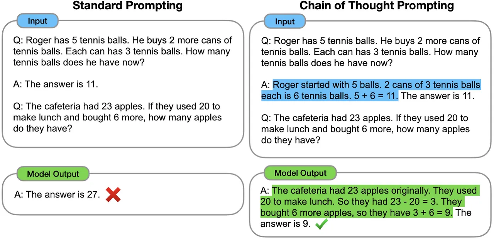
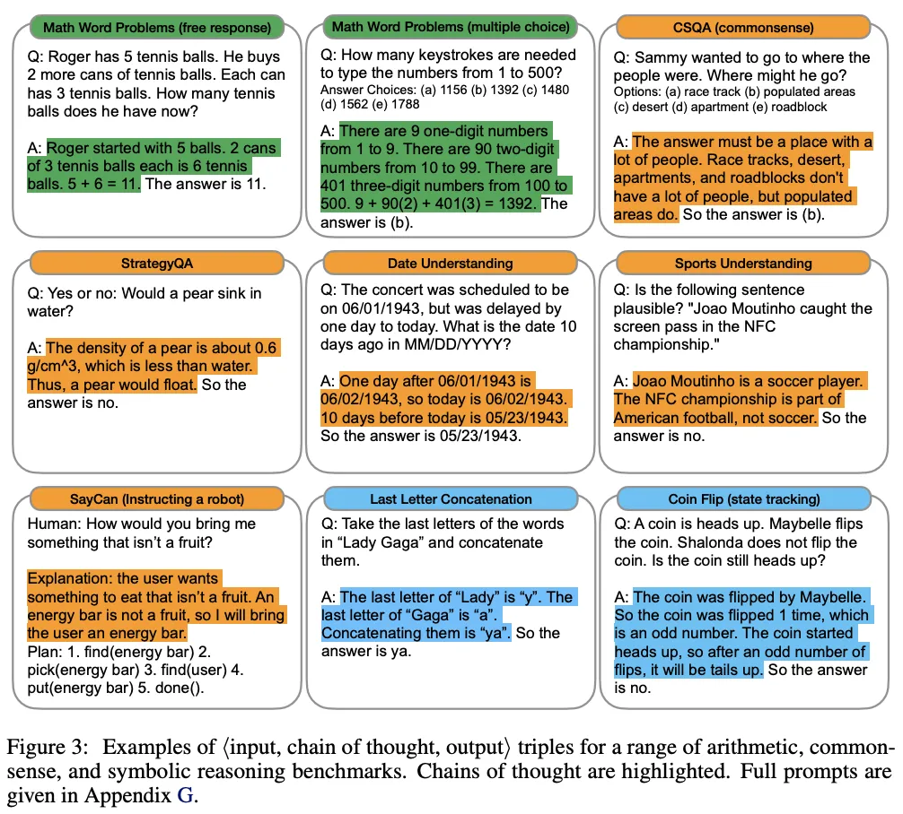
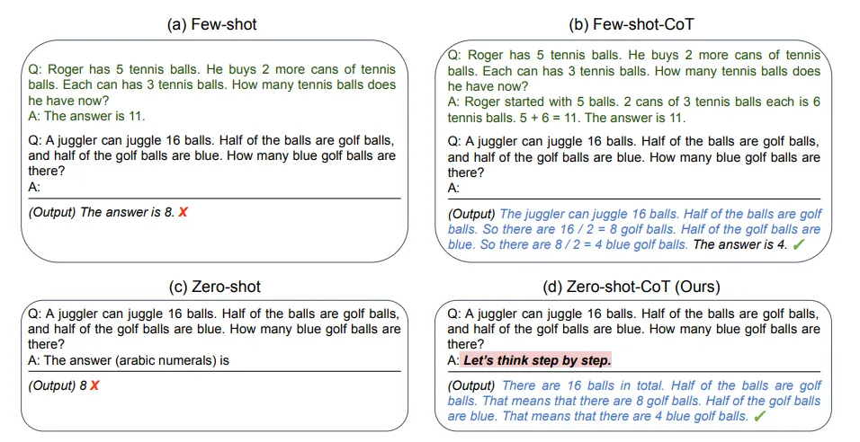
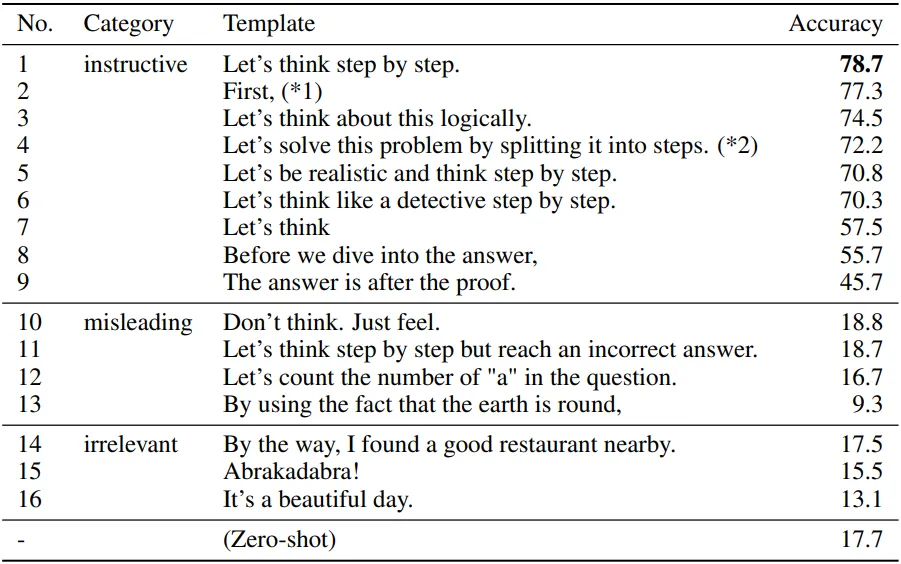
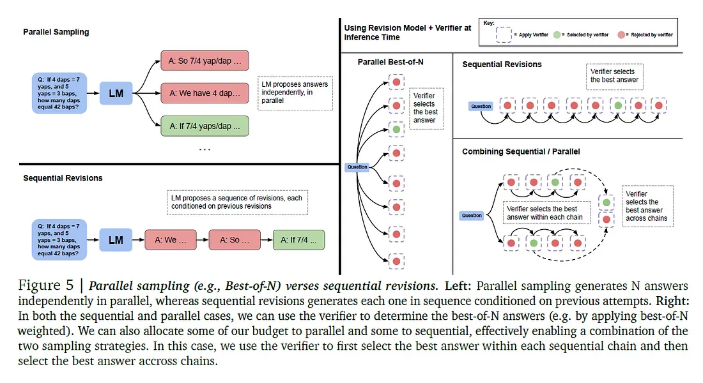

## Chain-of-Thought Prompting

흔히 CoT라 불리는 Chain-of-Thought 방식은 답을 도출하기 위해 필요한 중간 추론 단계를 설명하도록 하는 것입니다. 방법 자체는 정말 간단하지만, 논리적이나 수학적으로 복잡한 문제를 해결하는데 꽤나 도움이 되는 방식입니다.

등장 배경을 조금 살펴보면, 기존에는 언어 모델의 크기를 확장함으로써 성능 및 샘플 효율성 향상과 같은 이점을 얻어낼 수 있었습니다. 하지만 단순히 모델 크기를 확장하는 것만으로는 arithmetic(산술), commonsense(상식), symbolic reasoning(상징적 추론)과 같은 복잡한 작업에서 여전히 높은 성능을 달성하기 어려웠습니다.

해당 연구에서는 다음과 같은 2가지 아이디어를 기반으로 LLM의 reasoning 능력 향상을 시도합니다.

- 산술 추론에서 정답에 도달하기까지의 자연어 기반 추론 과정을 생성하면 모델의 추론 능력이 향상될 수 있습니다.
- 몇 개의 입출력 예시(Few-shot)만으로도 LLM이 새로운 태스크를 수행할 수 있습니다(in-context learning).



*출처: [Chain-of-Thought Prompting Elicits Reasoning in Large Language Models](https://arxiv.org/pdf/2201.11903)*

위의 예시는 CoT에서 등장하는 전형적인 예시로, 왼쪽은 일반적인 ICL이며 오른쪽은 CoT prompting입니다. 정답 예시에 산술 과정만 추가해주어도 다른 결과를 내는 것을 확인할 수 있습니다.



*출처: [Chain-of-Thought Prompting Elicits Reasoning in Large Language Models](https://arxiv.org/pdf/2201.11903)*

결과적으로 Chain-of-thought prompting은 다음과 같은 특성들을 가지고 있습니다.

- 원칙적으로, CoT는 복잡한 multi-step 문제들을 중간 단계로 분해할 수 있으며, 이는 더 많은 추론 단계를 요구하는 문제에서 추가적인 계산을 할당할 수 있다는 것을 의미합니다.
- CoT는 모델의 동작 방식에 대해 해석 가능한 window를 제공합니다. 특정 답에 어떻게 도달하는지 경로를 알 수 있기 때문에 어디서 잘못되었는지 디버깅할 수 있는 기회를 제공합니다.
- CoT reasoning은 math word problems, commonsense reasoning, symbolic manipulation과 같은 task에 사용할 수 있으며, 사람이 언어를 통해 해결할 수 있는 어떤 과제에도 원칙적으로는 적용 가능합니다.
- 추가적인 파인 튜닝 없이도, few-shot 프롬프팅을 통해 원하는 형태의 답변을 이끌어낼 수 있습니다.

### Let's think step by step.

다음은 Large Language Models are Zero-Shot Reasoners라는 논문을 베이스로 살펴보려고 합니다. 언어 모델의 크기를 확장하는 것은 최근 NLP 혁명의 핵심 요소였고, LLM의 성공은 in-context few-shot 혹은 zero-shot으로부터 기인합니다. 이는 task를 설명하는 간단한 몇 가지 예시 혹은 명령만으로 다양한 task를 해결할 수 있다는 것을 의미합니다. 이러한 방법을 "prompting"이라고 합니다.

물론 큰 규모의 LLM조차도 여러 단계의 추론을 필요로 하는 task에서는 어려움이 있었지만, 앞서 설명한 CoT prompting을 통해 추론 성능을 향상시킬 수 있었습니다. 반면 해당 논문에서는 특정 task에 구애받지 않고 다양한 task에 똑같이 적용할 수 있는 zero-shot 기법을 제안합니다.



*출처: [Large Language Models are Zero-Shot Reasoners](https://arxiv.org/pdf/2205.11916)*

위의 예시 이미지와 같이 "Let's think step by step." 한 문장만 추가하더라도 기존 zero-shot 방식으로 해결하지 못했던 문제의 정답에 도달할 수 있습니다. 중요한 포인트는 Zero-shot-CoT 방식은 특정 task에 적합한 예시나 템플릿 없이도 범용적으로 적용이 가능하다는 점입니다.



*출처: [Large Language Models are Zero-Shot Reasoners](https://arxiv.org/pdf/2205.11916)*

여기까지 CoT에 관한 내용들을 간단히 살펴보았는데요, 사실 최근에는 LLM 성능이 크게 향상되어 위와 같은 방법론들이 큰 효과를 보지 못하는 경우도 많습니다. 물론 마법의 문장이라고 불렸던 만큼 아예 효과가 없는 것은 아니지만, GPT-4가 등장하기도 전에 나왔던 기법이니 만큼 경우에 따라 얼마나 효과가 있는지 검증이 필요합니다. 특히 step by step은 답이 정확히 정해져 있는, 논리적 절차가 필요한 문제에서는 적합하지만 단순 사실 조회나 개인적인 의견 혹은 감정의 영역에서는 효과가 없는 경우가 있습니다.

## Test-Time Compute

오랫동안 많은 AI와 ML 리서처, 그리고 사용자들은 결과를 즉시 생성하는 모델을 선호해 왔습니다. 하지만 OpenAI의 o1 모델과 함께 소개된 slow thinking 방식은 이러한 흐름을 완전히 바꾸어 놓았습니다. 서두르지 않고 여러 단계를 거쳐 생각할 시간을 가질 때 추론 능력이 향상된다는 게 분명해졌습니다.

다만 o1에 대해 공개된 것은 "추론 시점에 연산을 더 쓴다"는 사실까지입니다. 내부적으로 어떤 탐색이나 검증 절차를 돌리는지는 공개되지 않았으므로, 아래 내용은 o1의 구현이 아니라 같은 방향을 다룬 공개 연구를 따라가는 것입니다.

Test-Time Compute(TTC)는 모델이 학습을 마친 후 실제로 사용될 때, 즉 실제로 응답을 생성하거나 task를 수행할 때 사용되는 계산 자원을 의미합니다. TTC에는 Inference process와 Scaling at test time이라는 개념이 존재합니다.

- **Inference process**: 사용자가 질문이나 프롬프트를 입력 시, 모델은 이를 처리하고 응답을 생성하는데, 이 과정에서 발생하는 비용을 test-time compute라고 합니다.
- **Scaling at test time**: o1 시리즈 같은 추론 모델들은 추론 중에 동적으로 사고하는 시간을 늘릴 수 있습니다. 이는 복잡한 질문에 대해 더 오래 생각하게 하여, 더 높은 연산량을 할당하여 정확도를 높이는 것을 의미합니다.

다음으로 **Scaling LLM Test-Time Compute Optimally can be More Effective than Scaling Model Parameters** 이라는 논문을 기반으로 TTC에 대해 더 자세히 살펴보겠습니다.

### Dynamic Resource Allocation for Test-Time Efficiency

LLM이 점점 더 복잡한 문제를 해결해야 할 때, 계산 자원의 효율적인 사용이 중요해질 것으로 보입니다. 어려운 프롬프트를 다루기 위한 현재 접근 방식은 더 큰 모델 혹은 더 많은 사전학습에 의존하고 있습니다. 이는 간단한 문제들이 포함된 경우 과도한 계산 오버헤드가 발생할 수도 있습니다. 따라서 task의 난이도에 따라 할당할 자원을 조정하는 솔루션이 필요합니다.

compute-optimal scaling의 목표는 테스트 시점에 계산 자원이 효과적으로 사용되도록 하는 것입니다. 프롬프트의 복잡성에 따라 계산량을 동적으로 조정함으로써, 간단한 task에서는 불필요한 자원 소비를 방지하고 어려운 task에서는 성능을 향상시킵니다. 이러한 맞춤형 할당은 효율성을 증가시킬 뿐만 아니라, 더 큰 모델이 필요했던 시나리오에서 더 작은 모델을 배치할 수 있도록 합니다.

논문이 test-time compute를 확장하는 축으로 잡은 것은 두 가지입니다. 하나는 **단계별 검증자(dense process-based verifier)를 두고 그 점수를 따라 탐색**하는 것이고, 다른 하나는 **테스트 시점에 응답 분포 자체를 적응적으로 갱신**하는 것입니다.

두 번째 축 안에서 다시 방향이 갈립니다. 하나는 모델이 자기 답을 순차적으로 고쳐 나가는 반복적 수정(iterative revisions)이고, 다른 하나는 여러 답을 한 번에 뽑아 놓고 고르는 병렬 샘플링(parallel sampling)입니다. 반복적 수정은 첫 답이 정답에 가깝고 약간의 조정만 필요한 쉬운 문제에서 유리합니다.

반면, 모델의 초기 응답이 올바른 방향이 아닐 수 있는 더 어려운 문제의 경우 병렬 샘플링이나 트리 탐색(tree-search) 방법이 더 효과적입니다. 병렬 샘플링은 모델이 동시에 여러 답변을 생성하고, 더 넓은 범위의 응답을 선택할 수 있도록 합니다. 이는 모델이 문제 해결을 위해 다양한 고수준 전략을 탐색할 수 있게 하며, 다양한 접근이 필요한 복잡한 task에 중요합니다.

### Compute-Optimal Scaling

연산 최적 확장 방법은 현재 task의 예측된 난이도에 따라 테스트 시점 계산 전략을 조정하여 작동합니다. 이 접근 방식은 성능을 극대화하면서 불필요한 오버헤드 없이 계산 자원이 효과적으로 할당되도록 보장합니다. 핵심 아이디어는 추론 중 문제의 복잡성에 맞게 계산량을 조정하여, 모든 프롬프트에 균일한 계산 할당의 비효율성을 피하는 것입니다.

여기서 난이도를 어떻게 아느냐가 문제가 됩니다. 논문은 정답 레이블로 매긴 난이도(oracle difficulty)와 모델이 스스로 예측한 난이도를 나누어 실험하는데, 정답 레이블은 실제 배포 환경에 존재하지 않으므로 분석용 상한선일 뿐입니다. 실제로 쓰는 것은 모델이 예측한 난이도 쪽입니다.

사용되는 방법 중 하나로 앞서 언급한 반복적 수정이 있습니다. 이 방식의 경우 모델이 처음에 낸 답을 한 번에 끝내는 게 아니라 여러 번에 걸쳐 단계적으로 조금씩 수정해 나갑니다.

예를 들어, 모델이 팩토리얼을 계산하는 재귀 문제를 해결하도록 요청받는 작업을 고려해 보겠습니다. 처음에 모델은 재귀를 사용하지만 기본 사례(base case)가 없는 솔루션을 생성합니다.

```python
def factorial(n):
    return n * factorial(n - 1)

# base case가 없어 무한 재귀에 빠지고 RecursionError로 끝납니다
```

반복적 수정 과정에서 모델은 이 누락을 식별하고, 재귀를 멈출 조건을 추가하여 이를 수정합니다.

```python
def factorial(n):
    if n == 0:
        return 1
    return n * factorial(n - 1)
```

각 반복은 솔루션을 정제하여 점진적으로 올바른 결과로 이어집니다.



*출처: [Scaling LLM Test-Time Compute Optimally can be More Effective than Scaling Model Parameters](https://arxiv.org/pdf/2408.03314)*

더 복잡한 작업의 경우, 여러 가능한 접근 방식을 동시에 탐색하는 병렬 샘플링이 사용됩니다. 이 경우, 모델은 동시에 여러 개의 독립적인 응답을 생성하여 다양한 고수준 전략을 탐색할 수 있게 합니다. 이 접근 방식은 모델의 첫 번째 응답이 충분하지 않을 수 있는 더 어려운 문제를 처리하는 데 중요합니다.

예를 들어, 모델이 지도상의 여러 도시 간 최단 경로를 찾는 최적화 문제를 해결하도록 요청받는 시나리오를 고려해 보겠습니다. 이 경우, 모델은 동시에 여러 가능한 경로를 생성합니다. 각 경로는 더 짧은 직선 거리를 우선시하거나 정차 횟수를 최소화하는 등 서로 다른 접근 방식을 나타냅니다. 이러한 여러 솔루션이 생성되면, 검증자가 각 솔루션을 전반적인 효율성에 따라 평가하여 생성된 응답 집합에서 최적의 경로를 선택합니다.

### Verifier Models

연산 최적 확장에서, 검증자의 선택은 모델의 응답 정확도를 평가하는 데 중요한 역할을 합니다. 검증자는 채점 지점에 따라 두 갈래로 나뉩니다.

- **프로세스 보상 모델(Process Reward Model, PRM)**
- **결과 보상 모델(Outcome Reward Model, ORM)**

<div style="margin: 24px 0; text-align: center;">
<svg viewBox="0 0 400 270" style="width: 100%; height: auto; max-width: 380px;"
     xmlns="http://www.w3.org/2000/svg"
     font-family="Pretendard, -apple-system, sans-serif"
     role="img" aria-label="PRM은 추론 단계마다 채점하고 ORM은 최종 답만 채점하는 차이">
<style>
.vm-t { fill: var(--text, #1c1917); font-size: 16px; font-weight: 700; }
.vm-h { fill: var(--text, #1c1917); font-size: 15px; font-weight: 700; }
.vm-l { fill: var(--text, #1c1917); font-size: 14px; }
.vm-w { fill: #ffffff; font-size: 14px; }
.vm-n { fill: var(--text-muted, #78716c); font-size: 14px; }
.vm-box { fill: var(--bg-subtle, #f5f4f2); stroke: var(--border, #e7e5e4); stroke-width: 1.5; }
.vm-badge { fill: var(--primary, #0d9488); }
.vm-div { stroke: var(--border, #e7e5e4); stroke-width: 1; }
.vm-tick { stroke: var(--primary, #0d9488); stroke-width: 1.5; fill: none; }
</style>
<text class="vm-t" x="200" y="22" text-anchor="middle">채점 지점의 차이</text>
<text class="vm-h" x="20" y="52">PRM</text>
<rect class="vm-box" x="16" y="62" width="86" height="32" rx="5"/>
<text class="vm-l" x="59" y="83" text-anchor="middle">단계 1</text>
<rect class="vm-box" x="110" y="62" width="86" height="32" rx="5"/>
<text class="vm-l" x="153" y="83" text-anchor="middle">단계 2</text>
<rect class="vm-box" x="204" y="62" width="86" height="32" rx="5"/>
<text class="vm-l" x="247" y="83" text-anchor="middle">단계 3</text>
<rect class="vm-box" x="298" y="62" width="86" height="32" rx="5"/>
<text class="vm-l" x="341" y="83" text-anchor="middle">최종 답</text>
<path class="vm-tick" d="M59 94 L59 102"/>
<rect class="vm-badge" x="37" y="102" width="44" height="22" rx="4"/>
<text class="vm-w" x="59" y="118" text-anchor="middle">채점</text>
<path class="vm-tick" d="M153 94 L153 102"/>
<rect class="vm-badge" x="131" y="102" width="44" height="22" rx="4"/>
<text class="vm-w" x="153" y="118" text-anchor="middle">채점</text>
<path class="vm-tick" d="M247 94 L247 102"/>
<rect class="vm-badge" x="225" y="102" width="44" height="22" rx="4"/>
<text class="vm-w" x="247" y="118" text-anchor="middle">채점</text>
<path class="vm-tick" d="M341 94 L341 102"/>
<rect class="vm-badge" x="319" y="102" width="44" height="22" rx="4"/>
<text class="vm-w" x="341" y="118" text-anchor="middle">채점</text>
<line class="vm-div" x1="20" y1="142" x2="380" y2="142"/>
<text class="vm-h" x="20" y="172">ORM</text>
<rect class="vm-box" x="16" y="182" width="86" height="32" rx="5"/>
<text class="vm-l" x="59" y="203" text-anchor="middle">단계 1</text>
<rect class="vm-box" x="110" y="182" width="86" height="32" rx="5"/>
<text class="vm-l" x="153" y="203" text-anchor="middle">단계 2</text>
<rect class="vm-box" x="204" y="182" width="86" height="32" rx="5"/>
<text class="vm-l" x="247" y="203" text-anchor="middle">단계 3</text>
<rect class="vm-box" x="298" y="182" width="86" height="32" rx="5"/>
<text class="vm-l" x="341" y="203" text-anchor="middle">최종 답</text>
<path class="vm-tick" d="M341 214 L341 222"/>
<rect class="vm-badge" x="319" y="222" width="44" height="22" rx="4"/>
<text class="vm-w" x="341" y="238" text-anchor="middle">채점</text>
<text class="vm-n" x="200" y="262" text-anchor="middle">둘 다 학습된 검증자입니다</text>
</svg>
</div>

PRM은 추론의 **중간 단계마다** 그 단계가 옳은지 점수를 매깁니다. 어느 단계에서 논리가 어긋났는지 위치까지 알려주므로, 탐색 도중에 나쁜 경로를 잘라내는 데 쓸 수 있습니다.

ORM은 **최종 답만** 보고 점수를 매깁니다. 중간 과정은 채점하지 않으므로 학습에 필요한 레이블은 훨씬 적게 들지만, 탐색 도중에 쓸 수 있는 신호가 없습니다.

여기서 헷갈리기 쉬운 지점이 있습니다. 둘 다 **학습된 검증자**이지, 정답을 들여다보는 장치가 아닙니다. 정답 레이블은 논문에서 난이도 구간을 나눌 때(oracle difficulty) 쓰인 분석용 도구이지 ORM이 아닙니다. 두 검증자의 차이는 정답 접근 여부가 아니라 채점 지점입니다.

PRM을 점수 함수로 두고 돌리는 탐색 방법에는 다음이 있습니다.

- **Best-of-N 샘플링**
    - 여러 개의 응답을 독립적으로 생성한 뒤, 검증자 점수가 가장 높은 응답을 선택
    - 구현이 단순하고, 생성 예산이 커질수록 오히려 유리해집니다
- **Beam Search**
    - 여러 후보 응답을 동시에 유지하면서 단계마다 PRM 점수로 가지치기
    - 생성 예산이 작을 때 Best-of-N보다 확실히 앞섭니다
- **Lookahead Search**
    - 현재 후보에서 몇 단계 앞까지 롤아웃을 굴려 본 뒤 그 결과로 평가
    - 더 정확한 평가를 얻는 대신 롤아웃 비용을 냅니다

논문의 실험 결과가 직관과 어긋나는 부분이 여기입니다. Beam search는 예산이 작을 때 Best-of-N을 크게 앞서지만, 예산을 키우면 그 이점이 사라지고 오히려 Best-of-N에 뒤지는 구간이 생깁니다. 쉬운 문제에서는 beam search가 검증자 점수에 과최적화되는 징후까지 보입니다. Lookahead는 롤아웃 오버헤드 때문에 **같은 생성 예산에서 대체로 다른 방법보다 성능이 낮았습니다**. 앞을 더 내다보는 게 항상 이득은 아니라는 뜻입니다.

결국 어떤 탐색을 쓸지는 문제 난이도와 예산에 함께 달려 있습니다. 연산 최적 확장은 그 조합을 문제마다 고르는 전략입니다.

### Balancing Test-Time Compute

연산 최적 확장의 가장 큰 장점 중 하나는, 기존 방식보다 최대 4배나 적은 계산으로도 비슷하거나 더 좋은 성능을 낼 수 있다는 점입니다. 예를 들어, 쉬운 문제나 중간 난이도의 문제에는 적은 자원만 쓰고, 남는 자원을 더 복잡한 문제에 집중적으로 사용하는 방식으로 전체 연산량을 효율적으로 줄일 수 있습니다.

이 논문에서는, 사전 학습할 때 드는 계산량과 모델을 실제로 사용할 때 드는 계산량(test-time compute) 사이의 균형 문제도 다루고 있습니다. 문제가 너무 어렵지 않다면, 큰 모델을 미리 열심히 훈련시키기보다 필요할 때 생각을 더 많이 하도록 만드는 쪽이 효과적일 수 있다는 것입니다. 특히 정답을 뽑기 위해 길게 추론하지 않아도 되는 경우에는 이 전략이 더 잘 맞습니다.

실제로 저자들은 작은 모델에 테스트 시점 연산을 더한 경우와 그보다 14배나 더 큰 모델을 비교했는데, 결과는 다음과 같습니다. 추론해야 할 양(R 값)이 작을 경우, 작은 모델이 더 깊이 사고하도록 설정하는 쪽이 오히려 더 성능이 좋았고, 큰 모델보다 훨씬 효율적이었습니다. 하지만 반대로, 생각해야 할 양이 아주 많아지면, 그때는 처음부터 잘 훈련된 큰 모델이 더 유리합니다.

결론적으로, 이 연구는 사전학습과 테스트 시점 연산 사이의 균형을 어떻게 잡느냐가 중요하다는 점을 보여줍니다. 작은 모델이라도 똑똑하게 계산을 조절하면 특정 상황에서는 훨씬 더 큰 모델보다 잘 작동할 수 있고, 어떤 전략이 더 좋은지는 그 문제를 푸는 데 얼마나 길게 생각해야 하느냐에 따라 달라집니다.

## 함께 보면 좋은 글

- [Gemma 4 아키텍처 총정리](/llm/gemma4-architecture/) : Thinking 모드를 아키텍처 차원에서 지원하는 최근 사례
- [투기적 디코딩](/llm/speculative-decoding/) : 추론 시점 연산을 늘리는 대신 줄이는 방향의 기법

## Reference

- [Chain-of-Thought Prompting Elicits Reasoning in Large Language Models](https://arxiv.org/pdf/2201.11903)
- [Large Language Models are Zero-Shot Reasoners](https://arxiv.org/pdf/2205.11916)
- [Let's Verify Step by Step](https://arxiv.org/abs/2305.20050)
- [Scaling LLM Test-Time Compute Optimally can be More Effective than Scaling Model Parameters](https://arxiv.org/pdf/2408.03314)
- [Test-Time Compute](https://huggingface.co/blog/Kseniase/testtimecompute)
- [Search and Learn](https://huggingface.co/learn/cookbook/en/search_and_learn)
