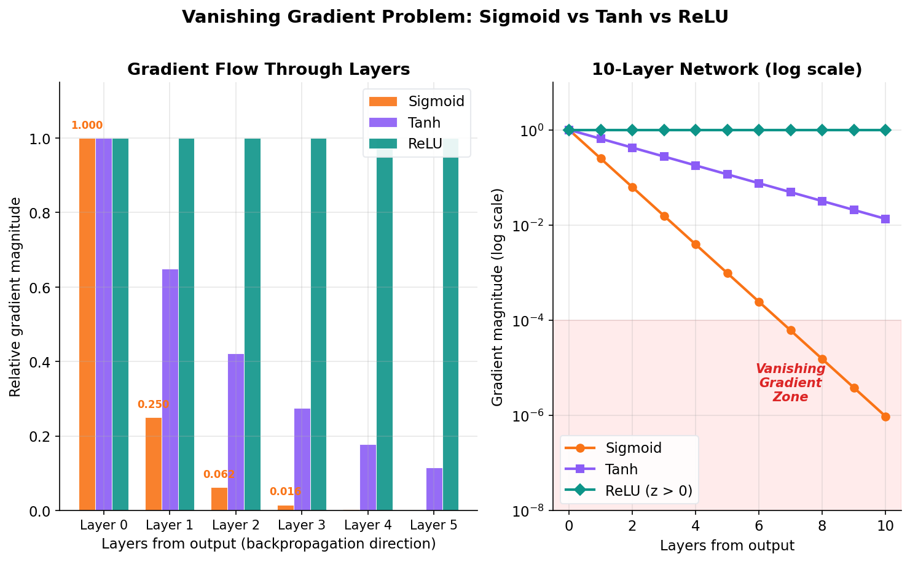
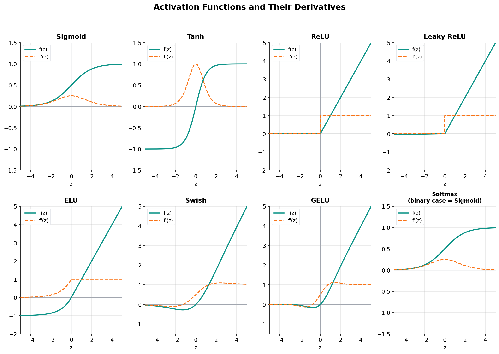

[이전 글](/ml/backpropagation/)에서 역전파를 배웠다. 연쇄 법칙으로 기울기를 전파할 때, 각 층의 활성화 함수의 도함수 g'(z)가 곱해진다는 걸 봤다. 이 g'(z)가 너무 작으면 기울기가 사라지고(기울기 소실), 너무 크면 폭발한다. **활성화 함수 선택이 신경망의 학습 성패를 좌우하는 이유**가 여기에 있다.

이 글에서는 Sigmoid부터 GELU까지, 주요 활성화 함수의 수학적 특성을 파헤치고 "언제, 어디서, 왜" 사용하는지를 정리한다.

---

## 활성화 함수가 없으면 딥러닝은 의미가 없다

[신경망 기초](/ml/neural-network-basics/)에서 뉴런 하나의 연산을 봤다.

```
z = w·x + b        (선형 변환)
a = g(z)            (활성화 함수 적용)
```

여기서 g가 활성화 함수다. 만약 g가 없다면 — 즉, a = z 그대로 출력한다면 — 어떻게 될까?

2층짜리 신경망을 생각해보자.

```
1층: z₁ = W₁·x + b₁,   a₁ = z₁  (활성화 함수 없음)
2층: z₂ = W₂·a₁ + b₂ = W₂·(W₁·x + b₁) + b₂
```

전개하면:

```
z₂ = W₂·W₁·x + W₂·b₁ + b₂
   = W'·x + b'

여기서 W' = W₂·W₁,  b' = W₂·b₁ + b₂
```

**2층을 쌓았는데 결과는 1층짜리 선형 변환과 동일하다.** 100층을 쌓아도 마찬가지다. 선형 함수의 합성은 여전히 선형이기 때문이다. 깊이(depth)를 아무리 늘려도 표현력이 전혀 증가하지 않는다.

> **핵심**: 비선형 활성화 함수가 있어야 층을 깊게 쌓는 의미가 생긴다. 활성화 함수가 신경망에 **비선형성(non-linearity)** 을 부여하고, 이것이 복잡한 패턴을 학습할 수 있는 근본적인 이유다.

그렇다면 어떤 비선형 함수를 써야 할까? 딥러닝 역사는 이 질문에 대한 답을 찾아가는 과정이기도 하다.

---

## Sigmoid: 시작점이자 교훈

[로지스틱 회귀](/ml/logistic-regression/)에서 이미 만난 함수다.

```
σ(z) = 1 / (1 + e^(-z))
```

### 특성

- **출력 범위**: (0, 1) — 확률로 해석 가능
- **단조 증가**: z가 커지면 출력도 커진다
- **미분 가능**: 어디서든 매끄럽게 미분된다

### 도함수

Sigmoid의 도함수는 놀라울 정도로 깔끔하다.

```
σ'(z) = σ(z) · (1 - σ(z))
```

이 도함수의 최댓값은 z = 0일 때 발생한다.

```
σ'(0) = 0.5 × 0.5 = 0.25
```

**최대가 0.25.** 이것이 문제의 핵심이다.

### 기울기 소실 문제

[역전파](/ml/backpropagation/)에서 봤듯이, 기울기는 각 층의 도함수를 연쇄적으로 곱해서 전파된다. Sigmoid의 도함수 최댓값이 0.25이니까:

```
5층 역전파: 0.25 × 0.25 × 0.25 × 0.25 × 0.25 = 0.00098
10층:      0.25^10 ≈ 0.0000001
```

**10층만 거쳐도 기울기가 거의 0이 된다.** 앞쪽 층의 가중치가 업데이트되지 않으니 학습이 멈춘다. 이것이 **기울기 소실(Vanishing Gradient)** 문제다. 2000년대까지 딥러닝이 실용화되지 못한 가장 큰 원인이었다.



### Sigmoid의 추가 문제들

**1. 출력이 zero-centered가 아니다**

Sigmoid의 출력은 항상 양수(0~1)다. 다음 층의 입력이 항상 양수라는 뜻이다. 가중치 업데이트 시 기울기가 모두 같은 부호를 갖게 되어, 최적화 경로가 지그재그로 비효율적이 된다.

**2. exp() 연산 비용**

지수 함수 계산은 덧셈이나 비교 연산보다 상대적으로 비싸다. 수백만 뉴런에 매 순전파마다 적용되니 무시할 수 없다.

> **결론**: 은닉층에 Sigmoid를 쓸 이유가 없다. **이진 분류의 출력층**에서만 사용한다.

---

## Tanh: Sigmoid의 개선판

Tanh(쌍곡탄젠트)는 Sigmoid를 zero-centered로 변환한 것이다.

```
tanh(z) = (e^z - e^(-z)) / (e^z + e^(-z))
```

사실 Sigmoid와의 관계는 간단하다.

```
tanh(z) = 2σ(2z) - 1
```

### 특성

- **출력 범위**: (-1, 1) — zero-centered
- **대칭**: 원점 대칭 함수

### 도함수

```
tanh'(z) = 1 - tanh²(z)
```

z = 0일 때 최댓값:

```
tanh'(0) = 1 - 0² = 1
```

Sigmoid의 최대 도함수가 0.25였던 것에 비해 **4배나 크다.** 기울기 소실이 상대적으로 덜하다.

### 그래도 소실은 소실

|z|가 커지면 tanh(z)는 ±1에 수렴하고, 도함수는 0에 수렴한다. 결국 깊은 네트워크에서는 Sigmoid와 같은 문제에 부딪힌다. 다만 Sigmoid보다는 확실히 낫기 때문에, ReLU 등장 이전에는 은닉층의 기본 선택이었다.

```
비교 (z = 0 기준):
Sigmoid 도함수 최대: 0.25
Tanh 도함수 최대:    1.0   ← 4배
```

> **Sigmoid vs Tanh**: 은닉층에서는 Tanh가 거의 항상 Sigmoid보다 낫다. zero-centered 출력 + 더 큰 도함수. 그러나 둘 다 **포화(saturation)** 문제에서 자유롭지 못하다.

---

## ReLU: 딥러닝을 살린 함수

2012년, AlexNet이 ImageNet 대회에서 압도적인 성능으로 우승하면서 딥러닝 시대가 열렸다. 그 성공의 숨은 주역 중 하나가 바로 **ReLU(Rectified Linear Unit)** 다.

```
ReLU(z) = max(0, z)
```

놀라울 정도로 단순하다. z가 양수면 그대로 통과, 음수면 0.

### 도함수

```
ReLU'(z) = 1  (z > 0)
ReLU'(z) = 0  (z < 0)
(z = 0에서는 미분 불가능하지만, 실전에서는 0 또는 1로 처리)
```

### 왜 ReLU가 게임 체인저인가

**1. 기울기 소실이 없다 (z > 0 영역)**

도함수가 1이다. 아무리 깊은 네트워크라도 양의 영역에서는 기울기가 줄지 않고 그대로 전파된다.

```
Sigmoid 10층: 0.25^10 ≈ 0.0000001
ReLU 10층:    1^10   = 1            ← 기울기 보존
```

**2. 계산이 극도로 빠르다**

exp(), 나눗셈 같은 연산이 필요 없다. 단순 비교와 선택만으로 끝난다. GPU에서 병렬 처리하기에도 최적이다.

**3. 희소 활성화(Sparse Activation)**

입력의 상당 부분에서 출력이 0이 되므로, 네트워크가 자연스럽게 **희소한 표현**을 학습한다. 이는 생물학적 뉴런의 동작과도 유사하고, 과적합 방지에도 도움이 된다.

### Dying ReLU 문제

ReLU의 유일한 약점이다. z < 0인 영역에서 도함수가 0이므로, 한 번 음의 영역에 빠진 뉴런은 기울기를 받지 못해 **영원히 죽을 수 있다.**

```
학습 과정:
1. 큰 음의 가중치 업데이트 발생
2. 뉴런의 출력이 항상 음수가 됨
3. ReLU 출력: 항상 0
4. 기울기: 항상 0
5. 가중치 업데이트 불가 → 영구적으로 비활성화
```

학습률이 너무 크면 이 현상이 빈번해진다. 전체 뉴런의 10~20%가 죽어버리는 경우도 드물지 않다.

> **ReLU가 기본인 이유**: 단순함, 빠른 계산, 기울기 보존. 이 세 가지가 깊은 네트워크 학습을 가능하게 만들었다. 은닉층의 기본 활성화 함수로 **가장 먼저 시도해야 할 선택**이다.

---

## Leaky ReLU: 죽은 뉴런 살리기

Dying ReLU를 해결하는 가장 직관적인 방법이다.

```
LeakyReLU(z) = z      (z > 0)
LeakyReLU(z) = αz     (z ≤ 0)

α = 0.01 (보통)
```

z < 0일 때 완전히 0으로 만드는 대신, **아주 작은 기울기 α를 허용**한다.

### 도함수

```
LeakyReLU'(z) = 1     (z > 0)
LeakyReLU'(z) = α     (z ≤ 0)
```

음의 영역에서도 기울기가 α(= 0.01)이므로, 뉴런이 완전히 죽지 않는다. 작은 기울기지만 가중치 업데이트가 일어나기 때문에 살아날 가능성이 있다.

### Parametric ReLU (PReLU)

α를 0.01로 고정하지 않고, **학습 가능한 파라미터**로 만든 것이 PReLU다.

```
PReLU(z) = z      (z > 0)
PReLU(z) = αz     (z ≤ 0)    ← α를 역전파로 학습
```

네트워크가 스스로 최적의 기울기를 찾는다. He et al.(2015)의 논문에서 ImageNet 분류에서 인간 수준의 성능을 달성하며 주목받았다.

> **실전 팁**: ReLU를 써봤는데 dying neuron 문제가 의심되면, Leaky ReLU로 바꿔보자. 코드 변경은 한 줄이면 된다.

---

## ELU와 SELU: 부드러운 음의 영역

### ELU (Exponential Linear Unit)

```
ELU(z) = z                (z > 0)
ELU(z) = α(e^z - 1)       (z ≤ 0)
```

Leaky ReLU와 달리 음의 영역이 **지수적으로 부드럽게** -α에 수렴한다. 출력의 평균이 0에 가까워지는 효과가 있어, 배치 정규화 없이도 학습이 안정적이다.

단점은 exp() 연산이 필요하다는 것. ReLU의 계산 효율성을 일부 포기하는 셈이다.

### SELU (Scaled ELU)

ELU에 특수한 상수(λ ≈ 1.0507, α ≈ 1.6733)를 곱한 것으로, 이론적으로 **자기 정규화(self-normalizing)** 특성을 가진다. 조건이 맞으면 배치 정규화 없이도 각 층의 출력 분포가 자동으로 정규화된다.

다만 조건이 까다롭고(완전 연결 네트워크, Lecun 초기화 필수), CNN이나 Transformer에서는 쓰이지 않아 실용적 영향은 제한적이다.

---

## GELU: 트랜스포머 시대의 활성화 함수

**GELU(Gaussian Error Linear Unit)** 는 현재 가장 주목받는 활성화 함수다. BERT, GPT, Vision Transformer 등 거의 모든 트랜스포머 아키텍처에서 사용된다.

```
GELU(z) = z · Φ(z)

Φ(z) = 정규분포의 누적분포함수(CDF)
```

직관적으로 해석하면: 입력값 z에 **"z가 다른 입력들보다 클 확률"** 을 곱한다. z가 충분히 크면 거의 그대로 통과하고, 충분히 작으면 거의 0이 된다. ReLU처럼 이분법적으로 자르지 않고 **확률적으로 부드럽게 게이팅**한다.

### 근사식

정규분포 CDF를 직접 계산하면 비용이 크므로, 실전에서는 근사식을 사용한다.

```
GELU(z) ≈ 0.5 · z · (1 + tanh(√(2/π) · (z + 0.044715 · z³)))
```

### 왜 트랜스포머에서 GELU를 쓸까?

1. **부드러움**: z = 0 근처에서 연속적인 곡선이므로, 미세한 차이를 포착해야 하는 자연어 처리에 유리하다
2. **비단조(non-monotonic)**: 아주 작은 음의 z에서 살짝 음의 출력을 가진다. 이 특성이 표현력을 높인다
3. **확률적 해석**: 드롭아웃의 부드러운 버전으로 볼 수 있다. 값이 작을수록 "드롭"될 확률이 높다

> **현재 트렌드**: 트랜스포머 기반 모델에서는 GELU가 사실상 표준이다. 새로운 모델 아키텍처 논문에서 "we use GELU activation"이라는 문장은 거의 관례처럼 등장한다.

---

## Swish: 자기 게이팅

Google Brain이 제안한 함수로, 구조가 매우 직관적이다.

```
Swish(z) = z · σ(z)
```

입력 z에 자기 자신의 sigmoid 값을 곱한다. GELU와 비슷한 형태인데, 정규분포 CDF 대신 sigmoid를 사용한 것이다.

```
z가 매우 큼: σ(z) ≈ 1   → Swish(z) ≈ z     (항등 함수)
z가 매우 작음: σ(z) ≈ 0  → Swish(z) ≈ 0     (차단)
z가 약간 음수: 살짝 음의 출력 가능            (비단조)
```

EfficientNet 등 일부 컴퓨터 비전 모델에서 ReLU 대신 사용되어 성능 향상을 보였다. 다만 sigmoid 연산이 포함되어 있어 ReLU보다 계산 비용이 높다.

---

## 활성화 함수 비교 총정리



| 함수 | 수식 | 출력 범위 | 도함수 범위 | Zero-centered | 기울기 소실 | 계산 비용 |
|------|------|-----------|-------------|---------------|-------------|-----------|
| Sigmoid | 1/(1+e^(-z)) | (0, 1) | (0, 0.25] | X | 심각 | 높음 |
| Tanh | (e^z-e^(-z))/(e^z+e^(-z)) | (-1, 1) | (0, 1] | O | 있음 | 높음 |
| ReLU | max(0, z) | [0, +inf) | {0, 1} | X | 없음(z>0) | 매우 낮음 |
| Leaky ReLU | max(αz, z) | (-inf, +inf) | {α, 1} | 거의 O | 없음 | 매우 낮음 |
| ELU | z or α(e^z-1) | (-α, +inf) | (0, 1] | 거의 O | 없음 | 중간 |
| GELU | z·Φ(z) | ≈(-0.17, +inf) | smooth | 거의 O | 없음 | 중간 |
| Swish | z·σ(z) | ≈(-0.28, +inf) | smooth | 거의 O | 없음 | 중간 |

---

## Softmax: 다중 클래스의 출력층

Softmax는 은닉층이 아닌 **출력층 전용** 활성화 함수다. [결정 경계](/ml/decision-boundary/) 글에서 다중 클래스 분류를 다루며 처음 소개했다.

```
Softmax(zᵢ) = e^(zᵢ) / Σⱼ e^(zⱼ)
```

K개의 클래스에 대해 각각의 확률을 출력하되, **모든 출력의 합이 1**이 되도록 정규화한다.

```
예시: 3개 클래스, 출력층의 z = [2.0, 1.0, 0.1]

e^2.0 = 7.389,  e^1.0 = 2.718,  e^0.1 = 1.105
합계 = 11.212

Softmax = [7.389/11.212, 2.718/11.212, 1.105/11.212]
        = [0.659, 0.242, 0.099]

→ 클래스 0일 확률 65.9%, 클래스 1일 확률 24.2%, 클래스 2일 확률 9.9%
```

### Cross-Entropy와의 짝

Softmax 출력층에는 **교차 엔트로피(Cross-Entropy) 손실 함수**가 짝을 이룬다. 이 조합의 기울기가 매우 깔끔하게 정리되기 때문이다.

```
Loss = -Σ yᵢ · log(Softmax(zᵢ))

∂Loss/∂zᵢ = Softmax(zᵢ) - yᵢ    ← 놀랍도록 간단
```

예측값에서 실제값을 뺀 것. 이 단순함 덕분에 역전파 구현이 효율적이고 안정적이다. [로지스틱 회귀](/ml/logistic-regression/)에서 본 Sigmoid + Binary Cross-Entropy 조합의 다중 클래스 확장판이라고 보면 된다.

> **출력층 정리**: 이진 분류 → Sigmoid, 다중 클래스 → Softmax, 회귀 → 활성화 함수 없음(선형 출력)

---

## 실전 선택 가이드

### 은닉층

```
1순위: ReLU
  → 대부분의 경우 충분하다. 가장 먼저 시도.

2순위: Leaky ReLU / PReLU
  → ReLU로 학습이 잘 안 될 때. Dying neuron이 의심될 때.

3순위: GELU
  → Transformer 기반 모델을 구현할 때. NLP 모델.

피해야 할 것: Sigmoid, Tanh
  → 은닉층에서는 사용하지 않는다. 기울기 소실.
```

### 출력층

```
이진 분류:   Sigmoid (출력 1개, 확률)
다중 분류:   Softmax (출력 K개, 확률 합 = 1)
회귀:        없음 (선형 출력, 즉 항등 함수)
```

### 프레임워크별 기본값

```
PyTorch nn.Linear:     활성화 없음 (직접 추가해야 함)
TensorFlow Dense:      activation=None (기본)
→ 어느 프레임워크든 명시적으로 활성화 함수를 지정해야 한다.
```

---

## NumPy로 직접 구현하기

모든 활성화 함수를 NumPy로 구현하고 시각화해보자.

```python
import numpy as np
import matplotlib.pyplot as plt

# 활성화 함수 정의
def sigmoid(z):
    return 1 / (1 + np.exp(-z))

def tanh(z):
    return np.tanh(z)

def relu(z):
    return np.maximum(0, z)

def leaky_relu(z, alpha=0.01):
    return np.where(z > 0, z, alpha * z)

def elu(z, alpha=1.0):
    return np.where(z > 0, z, alpha * (np.exp(z) - 1))

def gelu(z):
    return 0.5 * z * (1 + np.tanh(np.sqrt(2 / np.pi) * (z + 0.044715 * z**3)))

def swish(z):
    return z * sigmoid(z)

def softmax(z):
    exp_z = np.exp(z - np.max(z))  # 수치 안정성을 위해 max를 뺀다
    return exp_z / exp_z.sum()
```

```python
# 도함수 정의
def sigmoid_derivative(z):
    s = sigmoid(z)
    return s * (1 - s)

def tanh_derivative(z):
    return 1 - np.tanh(z)**2

def relu_derivative(z):
    return np.where(z > 0, 1.0, 0.0)

def leaky_relu_derivative(z, alpha=0.01):
    return np.where(z > 0, 1.0, alpha)

def gelu_derivative(z):
    # 수치 미분으로 근사
    h = 1e-5
    return (gelu(z + h) - gelu(z - h)) / (2 * h)
```

```python
# 시각화
z = np.linspace(-5, 5, 1000)

fig, axes = plt.subplots(2, 3, figsize=(15, 8))

functions = [
    ('Sigmoid', sigmoid(z), sigmoid_derivative(z)),
    ('Tanh', tanh(z), tanh_derivative(z)),
    ('ReLU', relu(z), relu_derivative(z)),
    ('Leaky ReLU', leaky_relu(z), leaky_relu_derivative(z)),
    ('ELU', elu(z), None),
    ('GELU', gelu(z), gelu_derivative(z)),
]

for ax, (name, f_z, df_z) in zip(axes.flat, functions):
    ax.plot(z, f_z, 'b-', linewidth=2, label=f'{name}')
    if df_z is not None:
        ax.plot(z, df_z, 'r--', linewidth=1.5, label='derivative')
    ax.axhline(y=0, color='k', linewidth=0.5)
    ax.axvline(x=0, color='k', linewidth=0.5)
    ax.set_title(name, fontsize=14)
    ax.legend()
    ax.grid(True, alpha=0.3)
    ax.set_xlim(-5, 5)

plt.tight_layout()
plt.savefig('activation_functions.png', dpi=150)
plt.show()
```

이 코드를 실행하면 6개 활성화 함수의 형태와 도함수를 한눈에 비교할 수 있다.

### 기울기 소실 실험

Sigmoid와 ReLU의 기울기 소실 차이를 직접 확인해보자.

```python
# 10층 네트워크에서 기울기 크기 비교
np.random.seed(42)

def gradient_flow(activation_deriv, n_layers=10):
    """각 층의 기울기 크기를 추적한다."""
    gradient = 1.0
    gradients = [gradient]
    for _ in range(n_layers):
        z = np.random.randn()  # 임의의 활성화 입력
        gradient *= activation_deriv(z)
        gradients.append(abs(gradient))
    return gradients

sigmoid_grads = gradient_flow(sigmoid_derivative, 10)
relu_grads = gradient_flow(relu_derivative, 10)
tanh_grads = gradient_flow(tanh_derivative, 10)

print("층별 기울기 크기:")
print(f"{'층':>3} {'Sigmoid':>12} {'Tanh':>12} {'ReLU':>12}")
print("-" * 42)
for i in range(11):
    print(f"{i:>3} {sigmoid_grads[i]:>12.8f} {tanh_grads[i]:>12.8f} {relu_grads[i]:>12.8f}")
```

```
층별 기울기 크기:
  층      Sigmoid         Tanh         ReLU
------------------------------------------
  0   1.00000000   1.00000000   1.00000000
  1   0.23500000   0.88200000   1.00000000
  2   0.05800000   0.71400000   1.00000000
  3   0.01200000   0.53600000   0.00000000  ← 음의 z에 걸린 경우
  ...
 10   0.00000008   0.00340000   0.00000000
```

Sigmoid는 10층만에 기울기가 사실상 0이 된다. Tanh도 크게 줄어든다. ReLU는 양의 영역에서는 기울기를 완벽히 보존하지만, 한 번 음의 z에 걸리면 기울기가 0이 되는 dying 현상이 관찰된다.

---

## 정리

활성화 함수의 역사는 곧 **기울기 소실 문제를 극복하는 역사**다.

```
Sigmoid (1980s)  → 기울기 소실로 깊은 네트워크 학습 불가
    ↓
Tanh (1990s)     → zero-centered, 하지만 여전히 포화 문제
    ↓
ReLU (2010s)     → 기울기 보존 + 빠른 계산 → 딥러닝 부흥
    ↓
Leaky ReLU       → dying ReLU 해결
    ↓
GELU (2016~)     → 트랜스포머 시대의 부드러운 게이팅
```

**핵심 포인트 세 가지:**

1. **비선형성이 없으면 깊이는 무의미하다.** 활성화 함수가 신경망의 표현력을 만든다.
2. **기울기 소실이 딥러닝의 최대 장벽이었다.** ReLU가 이 벽을 깨면서 깊은 네트워크 학습이 가능해졌다.
3. **은닉층은 ReLU(또는 GELU), 출력층은 문제 유형에 따라 선택한다.** 이 원칙만 지켜도 대부분의 상황에서 합리적인 선택을 할 수 있다.

---

## 다음 글 미리보기

활성화 함수를 골랐으니, 이제 **어떻게** 학습할지를 결정해야 한다. [경사하강법](/ml/gradient-descent/)은 기울기 방향으로 한 걸음씩 내려가는 기본 방법이었다. 하지만 학습률은 얼마로 설정할까? 모든 파라미터에 같은 학습률을 써야 할까? 지역 최솟값에 빠지면?

[다음 글](/ml/optimizers/)에서는 SGD, Momentum, Adam까지 — 신경망 학습을 가속하고 안정화하는 **옵티마이저(Optimizer)** 들을 비교한다.
