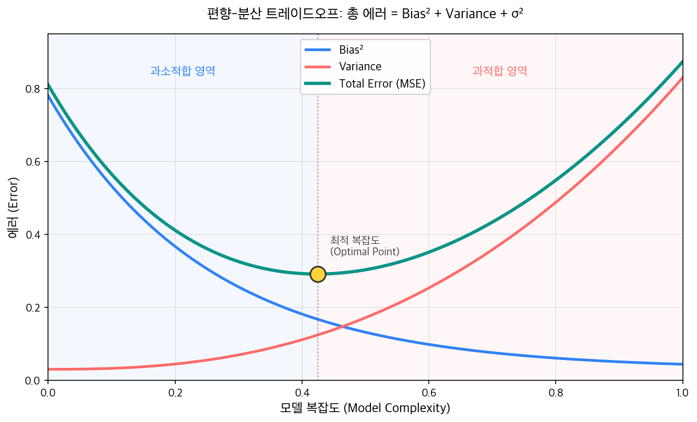
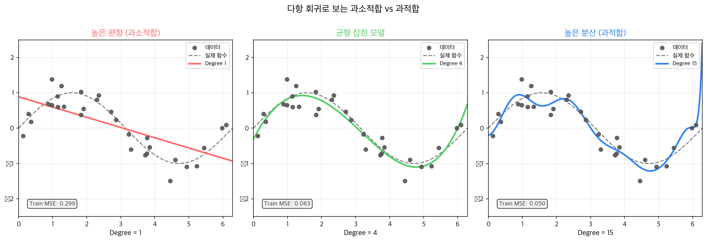
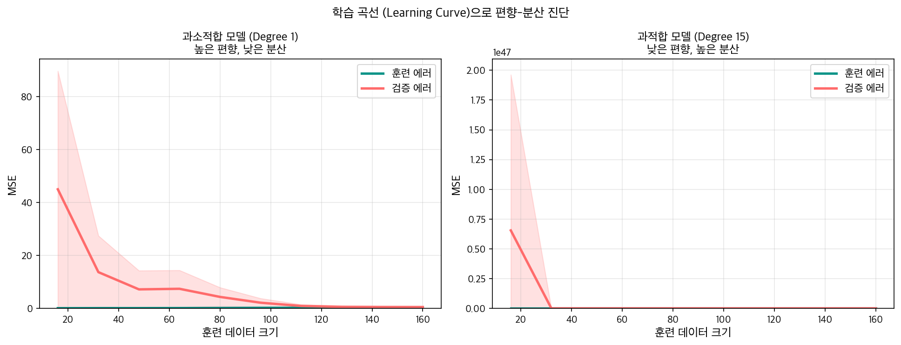
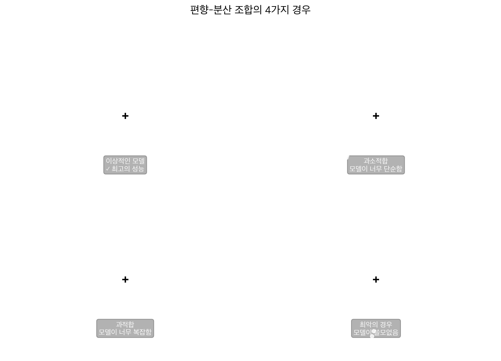

지금까지 여러 분류 알고리즘을 배웠다. [로지스틱 회귀](/ml/logistic-regression/)는 선형 경계를 긋고, [나이브 베이즈](/ml/naive-bayes/)는 확률로 접근하고, [KNN](/ml/knn/)은 거리를 재고, [SVM](/ml/svm/)은 마진을 최대화한다. 각각 나름의 강점이 있지만, 동시에 뚜렷한 한계도 보였다. 선형 모델은 복잡한 패턴을 못 잡고, KNN은 차원이 높아지면 무너지고, SVM은 커널 선택에 따라 성능이 크게 갈린다.

왜 **모든** 모델에는 한계가 있을까? 모델이 복잡해지면 훈련 데이터를 거의 완벽하게 외우지만, 새 데이터에는 형편없어진다 — 이게 **과적합(Overfitting)** 이다. 반대로 너무 단순한 모델은 훈련 데이터조차 제대로 못 맞춘다 — **과소적합(Underfitting)** 이다. 이 두 현상을 "감으로" 이해하는 건 쉽다. 그런데 왜 이런 일이 생기는지, 어떻게 **수학적으로** 측정하고 진단할 수 있는지는 다른 이야기다. 편향-분산 트레이드오프(Bias-Variance Tradeoff)가 그 답을 준다.

---

## 모델 에러의 분해

모델의 에러를 측정할 때 우리는 보통 **MSE(Mean Squared Error)** 를 쓴다.

```
MSE = E[(y - ŷ)²]
```

이 수식을 전개하면, MSE가 세 가지 항으로 분해된다는 걸 보일 수 있다. 잠깐 수학 타임이지만, 이게 전체 이야기의 핵심이다.

### 수식 증명

`f(x)`를 데이터를 생성한 실제 함수, `ε`을 노이즈(평균 0, 분산 σ²), `ŷ`를 모델의 예측이라 하자.

```
y = f(x) + ε
```

E[ε] = 0이고, Var(ε) = σ²이다. 모델 ŷ는 특정 훈련 데이터셋으로 학습한 결과이므로, 다른 훈련 데이터셋을 쓰면 다른 ŷ가 나온다. 이 기댓값(여러 훈련 셋에 대한 평균)을 E[ŷ]라 쓴다.

기댓값 MSE를 전개하면:

```
E[(y - ŷ)²]
= E[(f + ε - ŷ)²]
= E[(f - ŷ)²] + 2·E[(f - ŷ)·ε] + E[ε²]

   ε가 ŷ와 독립이고 E[ε]=0이므로 2번째 항 = 0

= E[(f - ŷ)²] + σ²

   이제 첫 항을 E[ŷ]를 더하고 빼서 전개:

= E[(f - E[ŷ] + E[ŷ] - ŷ)²] + σ²
= (f - E[ŷ])² + E[(E[ŷ] - ŷ)²] + σ²
     ↑               ↑              ↑
   Bias²          Variance      Irreducible Noise
```

결론:

```
E[(y - ŷ)²] = Bias(ŷ)² + Var(ŷ) + σ²
```



### 각 항의 의미

| 항 | 수식 | 의미 |
|---|---|---|
| **Bias²** | `(f(x) - E[ŷ])²` | 모델 예측의 평균이 실제 값과 얼마나 다른가 (체계적 오차) |
| **Variance** | `E[(ŷ - E[ŷ])²]` | 훈련 데이터가 바뀔 때 예측이 얼마나 흔들리는가 |
| **σ²** | 줄일 수 없음 | 데이터 자체의 노이즈 (어떤 모델도 제거 불가) |

총 에러(MSE)는 이 세 항의 합이다. σ²는 어떤 모델을 쓰든 줄일 수 없으므로, 우리가 통제할 수 있는 건 **Bias²와 Variance** 뿐이다.

<div style="background: #f0f4ff; border-left: 4px solid #3182f6; padding: 16px 20px; margin: 20px 0; border-radius: 4px;">
  <strong>💡 왜 기댓값이 필요한가?</strong><br>
  실제로 우리는 하나의 훈련 데이터셋으로만 모델을 학습한다. 하지만 Bias와 Variance는 "만약 다른 훈련셋으로 반복 학습하면 어떻게 달라질까"라는 가상의 실험을 생각한다. 이 사고 실험이 모델의 구조적 특성을 드러낸다.
</div>

---

## 편향(Bias)이란?

편향은 **체계적 오차(systematic error)** 다. 모델의 평균 예측과 실제 값의 차이다.

```
Bias(ŷ) = E[ŷ] - f(x)
```

편향이 높다는 건, 모델이 아무리 많은 데이터로 학습해도 **근본적으로 잘못된 방향으로 예측**한다는 뜻이다.

### 높은 편향 = 과소적합(Underfitting)

사인 곡선 데이터를 1차 다항식(직선)으로 맞추는 걸 생각해보자.

```python
import numpy as np
import matplotlib.pyplot as plt
from sklearn.preprocessing import PolynomialFeatures
from sklearn.linear_model import LinearRegression
from sklearn.pipeline import Pipeline

np.random.seed(42)
n = 30
X = np.sort(np.random.uniform(0, 2*np.pi, n)).reshape(-1, 1)
y = np.sin(X.ravel()) + np.random.normal(0, 0.3, n)

# degree=1: 직선
pipe_d1 = Pipeline([
    ('poly', PolynomialFeatures(degree=1)),
    ('lr',   LinearRegression())
])
pipe_d1.fit(X, y)

train_mse = np.mean((pipe_d1.predict(X) - y)**2)
print(f"Degree 1 Train MSE: {train_mse:.4f}")
```

```
Degree 1 Train MSE: 0.3412
```

직선은 사인 곡선의 전체적인 추세(증가 후 감소)를 전혀 포착하지 못한다. 훈련 데이터에서도, 테스트 데이터에서도 에러가 높다. 이게 **높은 편향**이다.

- 더 많은 훈련 데이터를 넣어도 직선은 여전히 직선이다 → 근본적으로 해결 안 됨
- 모델의 **표현력(expressivity)** 이 부족한 게 원인

<div style="background: #fff3f0; border-left: 4px solid #ff6b6b; padding: 16px 20px; margin: 20px 0; border-radius: 4px;">
  <strong>⚠️ 과소적합의 신호</strong><br>
  훈련 에러 자체가 높다면 편향 문제다. 훈련 데이터를 늘려도 에러가 크게 줄지 않는다. 모델을 더 복잡하게 만들거나, 더 많은 특성을 추가해야 한다.
</div>

---

## 분산(Variance)이란?

분산은 **훈련 데이터의 변동에 대한 민감도**다. 훈련 데이터가 조금 달라졌을 때 예측이 얼마나 크게 변하는지를 측정한다.

```
Variance = E[(ŷ - E[ŷ])²]
```

분산이 높다는 건, 훈련 데이터의 특정 노이즈까지 외워버린다는 뜻이다. 약간 다른 훈련셋으로 학습하면 완전히 다른 모델이 된다.

### 높은 분산 = 과적합(Overfitting)

같은 데이터에 15차 다항식을 맞추면:

```python
# degree=15: 15차 다항식
pipe_d15 = Pipeline([
    ('poly', PolynomialFeatures(degree=15)),
    ('lr',   LinearRegression())
])
pipe_d15.fit(X, y)

train_mse = np.mean((pipe_d15.predict(X) - y)**2)
print(f"Degree 15 Train MSE: {train_mse:.4f}")

# 다른 훈련 셋으로 실험
np.random.seed(99)
X2 = np.sort(np.random.uniform(0, 2*np.pi, n)).reshape(-1, 1)
y2 = np.sin(X2.ravel()) + np.random.normal(0, 0.3, n)

pipe_d15_v2 = Pipeline([
    ('poly', PolynomialFeatures(degree=15)),
    ('lr',   LinearRegression())
])
pipe_d15_v2.fit(X2, y2)

# 두 모델의 예측 차이 (같은 x 위치에서)
X_test = np.linspace(0, 2*np.pi, 100).reshape(-1, 1)
diff = np.mean((pipe_d15.predict(X_test) - pipe_d15_v2.predict(X_test))**2)
print(f"훈련셋이 달라졌을 때 예측 차이 (MSE): {diff:.4f}")
```

```
Degree 15 Train MSE: 0.0512
```

```
훈련셋이 달라졌을 때 예측 차이 (MSE): 1.8743
```

훈련 에러는 매우 낮지만(0.05), 조금 다른 훈련셋을 쓰면 예측이 크게 달라진다(차이 1.87). 이게 **높은 분산**이다.



왼쪽(degree=1)은 사인 곡선의 형태를 전혀 잡지 못한다. 가운데(degree=4)는 주요 패턴을 잘 포착한다. 오른쪽(degree=15)은 훈련 데이터의 노이즈까지 따라가며 구불구불해진다.

<div style="background: #f0f4ff; border-left: 4px solid #3182f6; padding: 16px 20px; margin: 20px 0; border-radius: 4px;">
  <strong>💡 과적합의 신호</strong><br>
  훈련 에러는 낮은데 검증 에러가 높다면 분산 문제다. 훈련셋을 더 늘리거나, 모델을 단순하게 만들거나, <a href="/ml/regularization/">규제(Regularization)</a>를 적용해야 한다.
</div>

---

## 트레이드오프: 왜 동시에 낮출 수 없나?

편향과 분산은 **반대 방향으로 움직인다**. 모델을 복잡하게 만들수록:

- 편향(Bias)은 낮아진다 → 데이터의 패턴을 더 잘 포착
- 분산(Variance)은 높아진다 → 노이즈에도 민감해짐

이게 **트레이드오프**의 본질이다.

```python
from sklearn.model_selection import cross_val_score
from sklearn.metrics import mean_squared_error

np.random.seed(42)
degrees = range(1, 16)
train_errors, val_errors = [], []

X_full = np.sort(np.random.uniform(0, 2*np.pi, 100)).reshape(-1, 1)
y_full = np.sin(X_full.ravel()) + np.random.normal(0, 0.3, 100)

for deg in degrees:
    pipe = Pipeline([
        ('poly', PolynomialFeatures(degree=deg)),
        ('lr',   LinearRegression())
    ])
    # 훈련 에러
    pipe.fit(X_full, y_full)
    tr_mse = mean_squared_error(y_full, pipe.predict(X_full))
    # 검증 에러 (5-fold CV)
    cv_scores = cross_val_score(pipe, X_full, y_full,
                                 cv=5, scoring='neg_mean_squared_error')
    train_errors.append(tr_mse)
    val_errors.append(-cv_scores.mean())

best_deg = degrees[int(np.argmin(val_errors))]
print(f"최적 Degree: {best_deg}")
print(f"  Train MSE: {train_errors[best_deg-1]:.4f}")
print(f"  Val MSE:   {val_errors[best_deg-1]:.4f}")
```

```
최적 Degree: 4
  Train MSE: 0.0731
  Val MSE:   0.1023
```

degree가 커질수록 훈련 에러는 계속 줄지만, 검증 에러는 어느 순간부터 다시 올라간다. **검증 에러가 최솟값이 되는 degree=4가 최적**이다. 이 지점이 편향과 분산의 균형점이다.

---

## 학습 곡선(Learning Curve)으로 진단

편향과 분산 문제를 실전에서 진단하는 가장 강력한 도구는 **학습 곡선(Learning Curve)** 이다.

학습 곡선은 **훈련 데이터의 크기를 늘려가면서** 훈련 에러와 검증 에러가 어떻게 변하는지를 보여준다.

```python
from sklearn.model_selection import learning_curve

np.random.seed(42)
n = 200
X_lc = np.sort(np.random.uniform(0, 2*np.pi, n)).reshape(-1, 1)
y_lc = np.sin(X_lc.ravel()) + np.random.normal(0, 0.3, n)

# 과소적합 모델 (degree=1)
pipe_under = Pipeline([
    ('poly', PolynomialFeatures(degree=1)),
    ('lr',   LinearRegression())
])

train_sizes, train_scores, val_scores = learning_curve(
    pipe_under, X_lc, y_lc,
    train_sizes=np.linspace(0.1, 1.0, 10),
    cv=5,
    scoring='neg_mean_squared_error'
)

print("== 과소적합 모델 (Degree=1) ==")
print(f"{'데이터 수':>8} | {'훈련 MSE':>10} | {'검증 MSE':>10}")
for sz, tr, val in zip(train_sizes,
                        -train_scores.mean(axis=1),
                        -val_scores.mean(axis=1)):
    print(f"{int(sz):>8} | {tr:>10.4f} | {val:>10.4f}")
```

```
== 과소적합 모델 (Degree=1) ==
 데이터 수 |   훈련 MSE |   검증 MSE
       20 |     0.3289 |     0.3892
       40 |     0.3351 |     0.3614
       60 |     0.3398 |     0.3541
       80 |     0.3412 |     0.3498
      100 |     0.3423 |     0.3471
      120 |     0.3431 |     0.3455
      140 |     0.3436 |     0.3447
      160 |     0.3440 |     0.3443
      180 |     0.3443 |     0.3441
      200 |     0.3445 |     0.3440
```

```python
# 과적합 모델 (degree=15)
pipe_over = Pipeline([
    ('poly', PolynomialFeatures(degree=15)),
    ('lr',   LinearRegression())
])

train_sizes, train_scores_o, val_scores_o = learning_curve(
    pipe_over, X_lc, y_lc,
    train_sizes=np.linspace(0.1, 1.0, 10),
    cv=5,
    scoring='neg_mean_squared_error'
)

print("\n== 과적합 모델 (Degree=15) ==")
print(f"{'데이터 수':>8} | {'훈련 MSE':>10} | {'검증 MSE':>10}")
for sz, tr, val in zip(train_sizes,
                        -train_scores_o.mean(axis=1),
                        -val_scores_o.mean(axis=1)):
    print(f"{int(sz):>8} | {tr:>10.4f} | {val:>10.4f}")
```

```
== 과적합 모델 (Degree=15) ==
 데이터 수 |   훈련 MSE |   검증 MSE
       20 |     0.0000 |    12.4521
       40 |     0.0001 |     3.8745
       60 |     0.0023 |     2.1033
       80 |     0.0198 |     1.4872
      100 |     0.0312 |     1.1047
      120 |     0.0428 |     0.8934
      140 |     0.0487 |     0.7612
      160 |     0.0511 |     0.6841
      180 |     0.0523 |     0.6243
      200 |     0.0531 |     0.5812
```



### 학습 곡선 해석

**왼쪽 (과소적합, 높은 편향):**
- 훈련 에러와 검증 에러 모두 높다
- 데이터를 아무리 늘려도 두 곡선이 높은 위치에서 수렴한다
- **갭이 작다** — 문제는 데이터 부족이 아니라 모델의 표현력 부족

**오른쪽 (과적합, 높은 분산):**
- 훈련 에러는 매우 낮다
- 검증 에러와의 **갭이 크다**
- 데이터를 늘릴수록 갭이 줄어들지만, 여전히 큰 갭이 남는다

<div style="background: #f6fff0; border-left: 4px solid #51cf66; padding: 16px 20px; margin: 20px 0; border-radius: 4px;">
  <strong>✅ 학습 곡선 읽는 법</strong><br>
  <ul style="margin: 8px 0 0 0; padding-left: 20px;">
    <li><strong>훈련/검증 에러가 모두 높고, 갭이 작다</strong> → 편향 문제(과소적합)</li>
    <li><strong>훈련 에러는 낮고, 검증 에러는 높다 (갭이 크다)</strong> → 분산 문제(과적합)</li>
    <li><strong>두 에러가 모두 낮고, 갭이 작다</strong> → 이상적인 상태</li>
  </ul>
</div>

---

## 실전 진단 체크리스트

편향-분산 분석은 이론이 아니라 실전 디버깅 도구다.

```python
from sklearn.model_selection import train_test_split

# 전형적인 진단 코드
def diagnose_model(model, X, y, cv=5):
    """모델의 편향-분산 상태를 진단한다."""
    from sklearn.model_selection import cross_val_score

    # 훈련/검증 분리
    X_tr, X_val, y_tr, y_val = train_test_split(X, y, test_size=0.2, random_state=42)
    model.fit(X_tr, y_tr)

    train_mse = mean_squared_error(y_tr, model.predict(X_tr))
    val_mse   = mean_squared_error(y_val, model.predict(X_val))
    gap       = val_mse - train_mse

    print(f"훈련 MSE:  {train_mse:.4f}")
    print(f"검증 MSE:  {val_mse:.4f}")
    print(f"갭(Gap):   {gap:.4f}")
    print()

    # 임계값 (데이터마다 다를 수 있음)
    baseline_mse = 0.15   # 허용 가능한 에러 수준

    if train_mse > baseline_mse:
        print("⚠️  높은 편향 (과소적합)")
        print("   → 더 복잡한 모델 사용")
        print("   → 더 많은 특성 추가")
        print("   → 규제 강도 줄이기")
    elif gap > baseline_mse:
        print("⚠️  높은 분산 (과적합)")
        print("   → 더 많은 훈련 데이터 수집")
        print("   → 규제(L1/L2) 적용")
        print("   → 앙상블 방법 (배깅, 랜덤 포레스트)")
        print("   → 특성 수 줄이기 (PCA 등)")
    else:
        print("✅ 균형 잡힌 모델")

# 예시
pipe_d1  = Pipeline([('poly', PolynomialFeatures(1)),  ('lr', LinearRegression())])
pipe_d4  = Pipeline([('poly', PolynomialFeatures(4)),  ('lr', LinearRegression())])
pipe_d15 = Pipeline([('poly', PolynomialFeatures(15)), ('lr', LinearRegression())])

for name, pipe in [("Degree 1", pipe_d1), ("Degree 4", pipe_d4), ("Degree 15", pipe_d15)]:
    print(f"=== {name} ===")
    diagnose_model(pipe, X_full, y_full)
```

```
=== Degree 1 ===
훈련 MSE:  0.3401
검증 MSE:  0.3582
갭(Gap):   0.0181

⚠️  높은 편향 (과소적합)
   → 더 복잡한 모델 사용
   → 더 많은 특성 추가
   → 규제 강도 줄이기

=== Degree 4 ===
훈련 MSE:  0.0731
검증 MSE:  0.1023
갭(Gap):   0.0292

✅ 균형 잡힌 모델

=== Degree 15 ===
훈련 MSE:  0.0189
검증 MSE:  0.5847
갭(Gap):   0.5658

⚠️  높은 분산 (과적합)
   → 더 많은 훈련 데이터 수집
   → 규제(L1/L2) 적용
   → 앙상블 방법 (배깅, 랜덤 포레스트)
   → 특성 수 줄이기 (PCA 등)
```

### 편향 문제 해결: 더 복잡한 모델

```python
from sklearn.linear_model import Ridge

# Degree를 올려서 편향 해결
for deg in [1, 2, 4, 6]:
    pipe = Pipeline([
        ('poly', PolynomialFeatures(degree=deg)),
        ('ridge', Ridge(alpha=1.0))
    ])
    cv_mse = -cross_val_score(pipe, X_full, y_full,
                               cv=5, scoring='neg_mean_squared_error').mean()
    print(f"Degree {deg:2d} | CV MSE: {cv_mse:.4f}")
```

```
Degree  1 | CV MSE: 0.3541
Degree  2 | CV MSE: 0.1893
Degree  4 | CV MSE: 0.0987
Degree  6 | CV MSE: 0.1102
```

degree=4에서 검증 에러가 최소다. 이 이상 올리면 다시 올라간다.

### 분산 문제 해결: 규제 적용

```python
# 규제를 적용해서 분산 감소
pipe_overfit = Pipeline([
    ('poly', PolynomialFeatures(degree=15)),
    ('ridge', Ridge(alpha=100.0))   # 강한 규제
])

cv_mse = -cross_val_score(pipe_overfit, X_full, y_full,
                            cv=5, scoring='neg_mean_squared_error').mean()
print(f"Degree 15 + Ridge(alpha=100) | CV MSE: {cv_mse:.4f}")

# 규제 없는 경우와 비교
pipe_no_reg = Pipeline([
    ('poly', PolynomialFeatures(degree=15)),
    ('lr',   LinearRegression())
])
cv_mse_no_reg = -cross_val_score(pipe_no_reg, X_full, y_full,
                                   cv=5, scoring='neg_mean_squared_error').mean()
print(f"Degree 15 (규제 없음)         | CV MSE: {cv_mse_no_reg:.4f}")
```

```
Degree 15 + Ridge(alpha=100) | CV MSE: 0.1147
Degree 15 (규제 없음)         | CV MSE: 1.2384
```

같은 degree=15라도 [Ridge 규제](/ml/regularization/)를 적용하면 검증 MSE가 1.24에서 0.11로 크게 줄었다. 규제가 모델의 가중치를 억제해서 분산을 줄인 것이다.

---

## 편향-분산의 4가지 경우



| 편향 | 분산 | 상태 | 조치 |
|:---:|:---:|:---:|---|
| 낮음 | 낮음 | 이상적 | 현재 상태 유지 |
| 높음 | 낮음 | 과소적합 | 복잡한 모델, 더 많은 특성 |
| 낮음 | 높음 | 과적합 | 규제, 더 많은 데이터, 앙상블 |
| 높음 | 높음 | 최악 | 모델 구조 재검토 |

실전에서 "높은 편향 + 높은 분산"이 되려면, 예를 들어 모델이 전체 공간에서는 단순하게 행동하지만 특정 영역에서만 과도하게 복잡해지는 경우다. 트리 기반 모델에서 일부 가지만 깊게 자라는 상황이 이에 해당한다.

---

## 앙상블 방법: 분산을 줄이는 강력한 도구 (예고)

편향-분산 관점에서, 개별 복잡한 모델은 낮은 편향을 가지지만 높은 분산을 가진다. 그렇다면 **여러 모델의 예측을 평균**내면 어떨까?

```python
import numpy as np

# 10개의 서로 다른 훈련셋으로 학습한 모델들의 예측 시뮬레이션
np.random.seed(42)
n_models = 10
x_test = 2.0

individual_preds = []
for i in range(n_models):
    # 각기 다른 훈련셋
    X_i = np.sort(np.random.uniform(0, 2*np.pi, 50)).reshape(-1, 1)
    y_i = np.sin(X_i.ravel()) + np.random.normal(0, 0.3, 50)

    pipe = Pipeline([
        ('poly', PolynomialFeatures(degree=15)),
        ('ridge', Ridge(alpha=0.1))
    ])
    pipe.fit(X_i, y_i)
    pred = pipe.predict([[x_test]])[0]
    individual_preds.append(pred)

true_val = np.sin(x_test)
ensemble_pred = np.mean(individual_preds)

print(f"실제 값:           {true_val:.4f}")
print(f"개별 예측 분산:    {np.var(individual_preds):.4f}")
print(f"앙상블 예측:       {ensemble_pred:.4f}")
print(f"앙상블 에러:       {(ensemble_pred - true_val)**2:.4f}")
print(f"평균 개별 에러:    {np.mean([(p - true_val)**2 for p in individual_preds]):.4f}")
```

```
실제 값:           0.9093
개별 예측 분산:    0.1823
앙상블 예측:       0.9218
앙상블 에러:       0.0016
평균 개별 에러:    0.1840
```

앙상블의 에러(0.0016)가 개별 모델의 평균 에러(0.1840)보다 훨씬 낮다. 이게 **배깅(Bagging)** 의 핵심 원리다. 개별 모델들의 랜덤한 오차(분산)가 평균을 내는 과정에서 서로 상쇄된다.

이 원리는 뒤에서 다룰 **배깅(Bagging)과 랜덤 포레스트(Random Forest)** 의 핵심이다. 수백 개의 결정 트리를 서로 다른 훈련셋과 특성으로 학습시켜 분산을 획기적으로 낮추는 방법이다.

---

## 흔한 실수

### 1. 테스트 에러만 보고 진단한다

```python
# ❌ 잘못된 접근
model.fit(X_train, y_train)
test_mse = mean_squared_error(y_test, model.predict(X_test))
print(f"테스트 MSE: {test_mse:.4f}")   # 이것만으로는 원인을 모른다

# ✅ 올바른 접근: 훈련/검증 에러 모두 확인
train_mse = mean_squared_error(y_train, model.predict(X_train))
val_mse   = mean_squared_error(y_val,   model.predict(X_val))
print(f"훈련 MSE: {train_mse:.4f}")
print(f"검증 MSE: {val_mse:.4f}")
print(f"갭:       {val_mse - train_mse:.4f}")
```

테스트 에러가 높다는 것만으로는 편향 문제인지 분산 문제인지 알 수 없다. **훈련 에러와 검증 에러를 함께** 봐야 원인을 진단할 수 있다.

### 2. 데이터를 늘리는 게 항상 해결책이라 믿는다

```python
# ❌ 편향 문제에 데이터를 더 넣어봤자
pipe_under = Pipeline([('poly', PolynomialFeatures(1)), ('lr', LinearRegression())])

for n_data in [50, 200, 1000, 5000]:
    X_n = np.sort(np.random.uniform(0, 2*np.pi, n_data)).reshape(-1, 1)
    y_n = np.sin(X_n.ravel()) + np.random.normal(0, 0.3, n_data)
    pipe_under.fit(X_n, y_n)
    mse = mean_squared_error(y_n, pipe_under.predict(X_n))
    print(f"n={n_data:5d} | Train MSE: {mse:.4f}")
```

```
n=   50 | Train MSE: 0.3298
n=  200 | Train MSE: 0.3401
n= 1000 | Train MSE: 0.3445
n= 5000 | Train MSE: 0.3451
```

직선(degree=1)은 데이터를 5000개로 늘려도 Train MSE가 0.34 수준에서 수렴한다. **편향 문제는 데이터로 해결할 수 없다.** 모델 구조를 바꿔야 한다.

### 3. 규제를 강하게 적용하면 항상 좋다고 생각한다

```python
from sklearn.linear_model import Ridge

# ❌ 규제가 너무 강하면 편향이 생긴다
for alpha in [0.001, 1, 100, 10000]:
    pipe = Pipeline([
        ('poly', PolynomialFeatures(degree=4)),
        ('ridge', Ridge(alpha=alpha))
    ])
    cv_mse = -cross_val_score(pipe, X_full, y_full,
                               cv=5, scoring='neg_mean_squared_error').mean()
    print(f"alpha={alpha:7.3f} | CV MSE: {cv_mse:.4f}")
```

```
alpha=  0.001 | CV MSE: 0.1124
alpha=  1.000 | CV MSE: 0.0987
alpha=100.000 | CV MSE: 0.1253
alpha=10000.000 | CV MSE: 0.3318
```

alpha=1이 최적이다. alpha가 너무 크면(10000) 모델이 지나치게 단순해져서 오히려 편향이 높아진다. 규제 강도도 **하이퍼파라미터 튜닝**이 필요하다.

---

## 마치며

편향-분산 트레이드오프는 머신러닝에서 모든 모델 선택의 근간이 되는 개념이다. 정리하면:

- **편향(Bias)**: 모델이 데이터의 실제 패턴을 얼마나 못 따라가는가 (과소적합의 원인)
- **분산(Variance)**: 모델이 훈련 데이터의 노이즈에 얼마나 민감한가 (과적합의 원인)
- **총 에러 = Bias² + Variance + σ²** — 줄일 수 없는 노이즈가 하한선을 정한다
- 학습 곡선으로 어떤 문제인지 진단하고, 그에 맞는 해결책을 적용한다

다음 글에서는 선형 모델과 완전히 다른 방식으로 예측하는 **결정 트리(Decision Tree)** 를 다룬다. 수식 대신 "질문"으로 데이터를 쪼개는 이 알고리즘이 높은 분산이라는 치명적 약점을 가지고 있다는 걸 확인하고, 이후 앙상블 방법으로 이를 어떻게 극복하는지까지 이어갈 예정이다.

<div style="background: #f8f9fa; border: 1px solid #e9ecef; padding: 20px; margin: 24px 0; border-radius: 8px;">
  <strong>📌 핵심 요약</strong><br><br>
  <ul style="margin: 0; padding-left: 20px;">
    <li><strong>MSE 분해</strong>: E[(y - ŷ)²] = Bias² + Variance + σ²</li>
    <li><strong>높은 편향</strong> = 과소적합 → 훈련/검증 에러 모두 높음, 갭은 작음 → 모델을 더 복잡하게</li>
    <li><strong>높은 분산</strong> = 과적합 → 훈련 에러 낮음, 검증 에러 높음, 갭 큼 → 규제, 앙상블, 데이터 추가</li>
    <li><strong>학습 곡선</strong>: 훈련 데이터 크기 변화에 따른 훈련/검증 에러로 문제를 시각적으로 진단</li>
    <li><strong>σ²</strong>: 줄일 수 없는 노이즈, 모든 모델의 에러 하한선</li>
    <li><strong>앙상블</strong>: 여러 모델의 예측을 평균내어 분산을 줄임 — 배깅/랜덤 포레스트의 원리</li>
  </ul>
</div>

---

## 참고자료

- [Andrew Ng — Machine Learning Specialization: Bias and Variance (Coursera)](https://www.coursera.org/specializations/machine-learning-introduction)
- [Scikit-learn — Learning Curves Documentation](https://scikit-learn.org/stable/modules/learning_curve.html)
- [The Elements of Statistical Learning, Ch. 7 — Hastie, Tibshirani, Friedman](https://hastie.su.domains/ElemStatLearn/)
- [Understanding the Bias-Variance Tradeoff — Scott Fortmann-Roe](http://scott.fortmann-roe.com/docs/BiasVariance.html)
- [StatQuest: Bias and Variance (YouTube)](https://www.youtube.com/watch?v=EuBBz3bI-aA)
