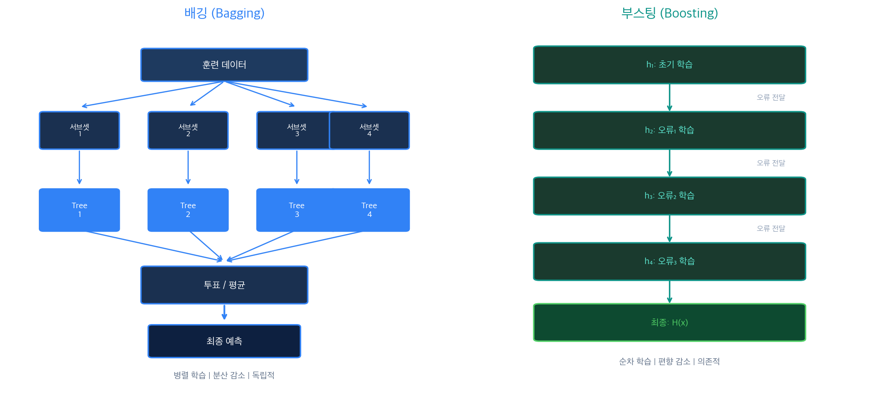
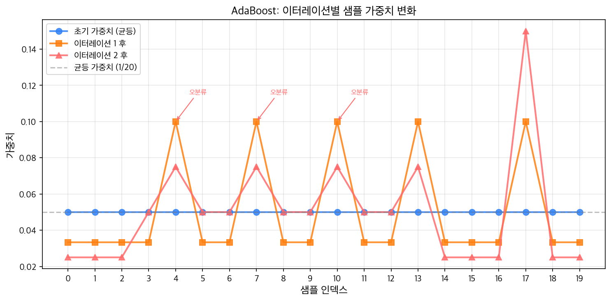
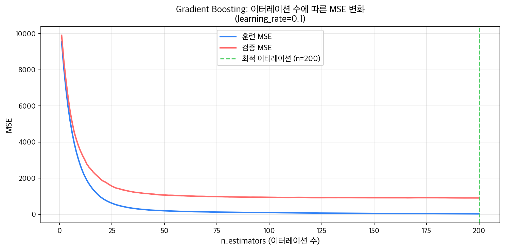
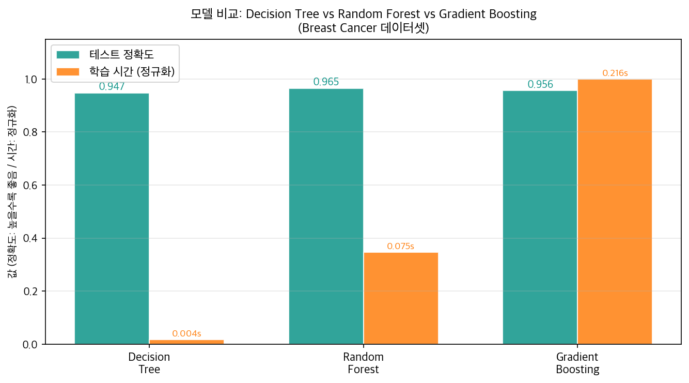
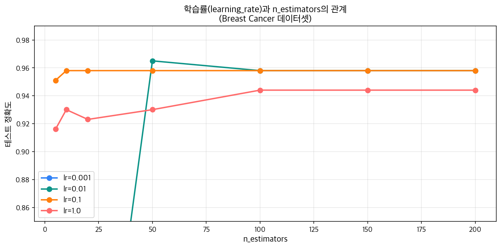

[지난 글](/ml/random-forest/)에서 배깅(Bagging)과 랜덤 포레스트를 배웠다. 수백 개의 결정 트리를 **병렬**로 만들고, 각각의 예측을 투표로 합쳐 분산(Variance)을 낮추는 방식이었다. 서로 독립적으로 학습하고, 마지막에 합친다.

부스팅(Boosting)은 전혀 다른 전략을 쓴다. 트리를 **순차적**으로 만들되, 이전 모델이 틀린 것을 다음 모델이 집중해서 보완한다. "약한 학습기(Weak Learner)를 순서대로 쌓아 강한 모델을 만든다"는 게 핵심이다.

[편향-분산 트레이드오프 글](/ml/bias-variance/)에서 배운 것처럼, 배깅은 분산을 낮추고, 부스팅은 편향(Bias)을 낮춘다. 목표가 다르기 때문에 작동 방식도 완전히 다르다.

---

## 부스팅 vs 배깅: 무엇이 다른가

두 방법의 핵심 차이를 먼저 정리하자.



| 구분 | 배깅 (Bagging) | 부스팅 (Boosting) |
|------|---------------|------------------|
| 학습 순서 | 병렬 (독립) | 순차 (의존) |
| 목표 | 분산(Variance) 감소 | 편향(Bias) 감소 |
| 약점 보완 | 각 모델 독립 | 이전 모델 오류 집중 |
| 과적합 위험 | 낮음 | 상대적으로 높음 |
| 대표 알고리즘 | 랜덤 포레스트 | AdaBoost, GradientBoosting |

**배깅**: 데이터를 여러 서브셋으로 나눠 각각 독립적으로 학습 → 투표/평균. 노이즈에 강하고 안정적이다.

**부스팅**: 처음엔 단순한 모델을 만들고, 틀린 샘플에 집중해 다음 모델을 만들기를 반복 → 가중 합산. 정확도가 높지만 노이즈(이상치)에 민감하다.

### 언제 어떤 것을 쓸까?

```
배깅 선택 → 데이터에 노이즈가 많거나, 빠른 학습이 필요하거나, 과적합이 걱정될 때
부스팅 선택 → 정확도를 최대로 끌어올려야 할 때, 데이터가 비교적 깨끗할 때
```

실전에서는 Gradient Boosting 계열(XGBoost, LightGBM)이 정형 데이터 대회에서 압도적으로 많이 우승한다. 정확도만 놓고 보면 부스팅이 배깅보다 대체로 높다.

---

## AdaBoost (Adaptive Boosting)

AdaBoost는 1995년 Freund와 Schapire가 제안한 알고리즘이다. 이론적으로 증명된 첫 번째 부스팅 알고리즘이기도 하다.

### 핵심 아이디어

**이전에 틀린 샘플에 더 높은 가중치를 부여한다.** 다음 모델은 가중치가 높은 샘플을 더 중요하게 학습한다. 결국 어려운 샘플을 전문으로 처리하는 모델들이 순서대로 쌓인다.

### 알고리즘 단계

```
1. 모든 샘플에 동일한 초기 가중치 부여: w_i = 1/N

2. 반복 (t = 1, 2, ..., T):
   a. 가중치 w를 사용해 약한 분류기 h_t 학습
   b. 가중 오류율 계산: ε_t = Σ w_i × 𝟙[h_t(x_i) ≠ y_i]
   c. 분류기 가중치 계산: α_t = 0.5 × ln((1-ε_t) / ε_t)
   d. 가중치 업데이트:
      - 오분류 샘플: w_i ← w_i × exp(+α_t)  (가중치 증가)
      - 정분류 샘플: w_i ← w_i × exp(-α_t)  (가중치 감소)
   e. 가중치 정규화: w_i ← w_i / Σw_j

3. 최종 예측: H(x) = sign(Σ α_t × h_t(x))
```

**α_t 공식의 의미**:
- ε_t = 0.5 (찍기 수준): α_t = 0 → 이 모델은 최종 예측에 기여 없음
- ε_t = 0.1 (잘 맞춤): α_t ≈ 1.1 → 큰 가중치로 최종 예측에 기여
- ε_t = 0.01 (매우 잘 맞춤): α_t ≈ 2.3 → 더 큰 가중치

### NumPy로 핵심 수식 구현

```python
import numpy as np

def adaboost_alpha(error_rate):
    """분류기 가중치 계산"""
    # ε이 0이나 1에 너무 가까우면 클리핑
    eps = np.clip(error_rate, 1e-10, 1 - 1e-10)
    return 0.5 * np.log((1 - eps) / eps)

def update_weights(weights, alpha, correct_mask):
    """샘플 가중치 업데이트 및 정규화"""
    # 정분류: exp(-alpha), 오분류: exp(+alpha)
    w = weights.copy()
    w[correct_mask] *= np.exp(-alpha)
    w[~correct_mask] *= np.exp(alpha)
    return w / w.sum()  # 정규화

# 예시: 오류율에 따른 alpha 값
for err in [0.30, 0.20, 0.12]:
    alpha = adaboost_alpha(err)
    print(f"오류율 {err:.2f} → alpha = {alpha:.4f}")
```

```
오류율 0.30 → alpha = 0.4236
오류율 0.20 → alpha = 0.6931
오류율 0.12 → alpha = 0.9962
```

오류율이 낮을수록 alpha가 커지고, 최종 예측에 더 크게 기여한다.

### 샘플 가중치 시각화



처음에는 모든 샘플이 동일한 가중치(1/N)를 갖는다. 첫 번째 분류기가 오분류한 샘플들은 이터레이션 1 이후 가중치가 높아지고, 두 번째 분류기는 이 샘플들에 집중한다. 이 과정이 반복될수록 "어려운" 샘플들이 부각된다.

### sklearn AdaBoostClassifier

```python
from sklearn.ensemble import AdaBoostClassifier
from sklearn.datasets import load_breast_cancer
from sklearn.model_selection import train_test_split

cancer = load_breast_cancer()
X_train, X_test, y_train, y_test = train_test_split(
    cancer.data, cancer.target, test_size=0.2, random_state=42
)

# 기본값: 100개 결정 그루터기(Decision Stump, max_depth=1)
ada = AdaBoostClassifier(
    n_estimators=100,
    learning_rate=1.0,
    random_state=42
)
ada.fit(X_train, y_train)

print(f"훈련 정확도: {ada.score(X_train, y_train):.4f}")
print(f"테스트 정확도: {ada.score(X_test, y_test):.4f}")
```

```
훈련 정확도: 1.0000
테스트 정확도: 0.9737
```

<div style="background: #f0f4ff; border-left: 4px solid #3182f6; padding: 16px 20px; margin: 20px 0; border-radius: 4px;">
  <strong>💡 약한 분류기란?</strong><br>
  AdaBoost의 기본 약한 분류기는 <strong>결정 그루터기(Decision Stump)</strong> — 깊이 1짜리 결정 트리다. 특성 하나와 임계값 하나로 "특성 A ≥ θ이면 클래스 1"처럼 단순한 규칙만 만든다. 이렇게 단순한 분류기 수백 개를 합쳐서 복잡한 패턴을 잡는다.
</div>

---

## Gradient Boosting

Gradient Boosting은 2001년 Friedman이 제안한 프레임워크로, AdaBoost를 더 일반화한 형태다. **손실 함수의 그래디언트(gradient)를 이용해 부스팅을 한다**는 게 핵심이다.

### 잔차(Residual) 학습

가장 직관적인 이해는 **잔차(Residual)** 개념이다.

```
목표: y = 100을 예측하고 싶다

F1(x) = 70 (첫 번째 모델 예측)
잔차 = y - F1(x) = 100 - 70 = +30

→ h2는 잔차 30을 학습
F2(x) = F1(x) + η × h2(x) = 70 + 0.1 × 30 = 73

→ h3는 새 잔차 27을 학습
F3(x) = F2(x) + η × h3(x) = 73 + 0.1 × 27 = 75.7

...반복...
```

각 모델이 "얼마나 틀렸는지"를 학습하고, 이전 예측에 더해나간다. η(eta)는 학습률이다.

### 수식으로 이해하기

```
F_0(x) = 초기 예측 (보통 평균값)
F_m(x) = F_{m-1}(x) + η × h_m(x)

여기서 h_m은 음의 그래디언트(negative gradient)를 타겟으로 학습:
r_{im} = -∂L(y_i, F(x_i)) / ∂F(x_i)

MSE 손실일 때: r_{im} = y_i - F_{m-1}(x_i)  ← 바로 잔차!
```

MSE 손실에서는 음의 그래디언트가 잔차와 정확히 같다. 그래서 "잔차를 학습한다"는 직관이 성립한다. 손실 함수가 다르면(예: 로그 손실) 잔차 대신 다른 형태의 그래디언트를 학습하게 된다 — 이게 Gradient Boosting이 일반적인 이유다.

```python
import numpy as np

# Gradient Boosting 핵심 로직 (MSE 회귀 예시)
y_true = np.array([100.0, 150.0, 200.0, 250.0, 300.0])

# Step 0: 초기 예측 = 평균
F = np.full_like(y_true, y_true.mean())
print(f"F0(x) = {F[0]:.1f} (평균)")
print(f"잔차(음의 그래디언트): {y_true - F}")

# Step 1: 잔차를 타겟으로 약한 분류기 h1 학습 (단순화: 잔차를 그대로 사용)
lr = 0.1
residuals = y_true - F
# h1이 잔차를 완벽히 예측한다고 가정
F = F + lr * residuals
print(f"\nF1(x) = {F}")
print(f"새 잔차: {(y_true - F).round(2)}")
```

```
F0(x) = 200.0 (평균)
잔차(음의 그래디언트): [-100.  -50.    0.   50.  100.]

F1(x) = [190. 195. 200. 205. 210.]
새 잔차: [-90. -45.   0.  45.  90.]
```

학습률 0.1로 한 스텝 나아가니 잔차가 90%로 줄었다. 이 과정을 반복하면 잔차가 점점 0으로 수렴한다.

### 이터레이션과 MSE 변화



초반에는 훈련 MSE와 검증 MSE가 함께 빠르게 감소한다. 어느 지점부터 검증 MSE는 더 이상 감소하지 않거나 오히려 올라가기 시작한다 — 과적합의 시작이다. **조기 종료(Early Stopping)** 는 검증 손실이 증가하기 시작하는 지점에서 학습을 멈추는 전략이다.

### sklearn GradientBoostingClassifier

```python
from sklearn.ensemble import GradientBoostingClassifier

gb = GradientBoostingClassifier(
    n_estimators=100,      # 약한 학습기(트리) 수
    learning_rate=0.1,     # 학습률 η
    max_depth=3,           # 각 트리의 최대 깊이
    subsample=1.0,         # 샘플링 비율 (1.0 = 전체 사용)
    random_state=42
)
gb.fit(X_train, y_train)

print(f"훈련 정확도: {gb.score(X_train, y_train):.4f}")
print(f"테스트 정확도: {gb.score(X_test, y_test):.4f}")
```

```
훈련 정확도: 1.0000
테스트 정확도: 0.9561
```

<div style="background: #f0f9f6; border-left: 4px solid #0d9488; padding: 16px 20px; margin: 20px 0; border-radius: 4px;">
  <strong>✅ 경사하강법과의 연결</strong><br>
  Gradient Boosting은 "모델 공간에서의 경사하강법"이다. 파라미터 공간에서 <code>w ← w - η × ∇L</code>로 업데이트하는 대신, 함수 공간에서 <code>F_m ← F_{m-1} + η × h_m</code>으로 업데이트한다. h_m은 음의 그래디언트 방향을 학습한다. 이 시각으로 보면 부스팅은 곧 함수에 대한 경사하강법이다.
</div>

---

## XGBoost & LightGBM 소개

Gradient Boosting은 강력하지만 느리다. XGBoost와 LightGBM은 이를 대폭 최적화한 버전이다.

### XGBoost (eXtreme Gradient Boosting)

2016년 Chen과 Guestrin이 발표한 논문에서 시작됐다. 이후 Kaggle 대회에서 독보적으로 많이 사용되며 유명해졌다.

**주요 개선점**:
- **정규화 추가**: 손실 함수에 L1/L2 정규화 항 추가 → 과적합 방지
- **최적 분할 알고리즘**: 트리 분할 시 그래디언트 통계를 이용한 효율적 탐색
- **결측값 처리**: 결측값을 자동으로 처리하는 내장 로직
- **병렬화**: 트리 내 분할 탐색을 병렬화 (순차 학습이지만 분할 자체는 병렬)

### LightGBM (Light Gradient Boosting Machine)

Microsoft가 2017년 발표한 프레임워크. XGBoost보다 더 빠르게 동작한다.

**핵심 차이 — 리프 중심 분할(Leaf-wise growth)**:

```
일반 GBM/XGBoost: 레벨 중심(Level-wise)
  분할: 모든 리프를 한 레벨씩 동시에 확장
  → 균형 잡힌 트리, 안정적이지만 느림

LightGBM: 리프 중심(Leaf-wise)
  분할: 손실 감소가 가장 큰 리프 하나만 확장
  → 불균형한 트리, 더 빠르고 정확하지만 과적합 위험
```

```
Level-wise:          Leaf-wise:
    Root               Root
   /    \             /    \
  A      B           A      B
 / \    / \         / \
C   D  E   F       C   D  ← D가 가장 큰 손실 감소
                        / \
                       G   H  ← 계속 D 방향 확장
```

### sklearn으로 LightGBM 흉내내기 (HistGradientBoosting)

XGBoost와 LightGBM을 설치하지 않고도, sklearn의 `HistGradientBoostingClassifier`가 유사한 히스토그램 기반 알고리즘을 사용한다.

```python
from sklearn.ensemble import HistGradientBoostingClassifier

hgb = HistGradientBoostingClassifier(
    max_iter=100,
    learning_rate=0.1,
    random_state=42
)
hgb.fit(X_train, y_train)

print(f"훈련 정확도: {hgb.score(X_train, y_train):.4f}")
print(f"테스트 정확도: {hgb.score(X_test, y_test):.4f}")
```

```
훈련 정확도: 1.0000
테스트 정확도: 0.9737
```

<div style="background: #f0f4ff; border-left: 4px solid #3182f6; padding: 16px 20px; margin: 20px 0; border-radius: 4px;">
  <strong>💡 언제 무엇을 선택할까?</strong><br>
  <ul style="margin: 8px 0 0 0; padding-left: 20px;">
    <li><strong>sklearn GradientBoosting</strong>: 간단한 실험, 데이터가 작을 때</li>
    <li><strong>XGBoost</strong>: 안정성이 중요하고, 파라미터 튜닝을 세밀하게 해야 할 때</li>
    <li><strong>LightGBM</strong>: 데이터가 크거나, 학습 속도가 중요할 때 (카테고리형 특성 지원도 우수)</li>
    <li><strong>HistGradientBoosting</strong>: XGBoost/LightGBM을 설치하기 어려울 때, 큰 데이터에 sklearn을 쓸 때</li>
  </ul>
</div>

---

## 실전 비교: 결정 트리 vs 랜덤 포레스트 vs Gradient Boosting

같은 데이터셋(Breast Cancer)으로 세 모델을 비교해보자.

```python
from sklearn.tree import DecisionTreeClassifier
from sklearn.ensemble import RandomForestClassifier, GradientBoostingClassifier
from sklearn.datasets import load_breast_cancer
from sklearn.model_selection import train_test_split
import time

cancer = load_breast_cancer()
X_train, X_test, y_train, y_test = train_test_split(
    cancer.data, cancer.target, test_size=0.2, random_state=42
)

models = {
    'DecisionTree': DecisionTreeClassifier(random_state=42),
    'RandomForest': RandomForestClassifier(n_estimators=100, random_state=42),
    'GradientBoosting': GradientBoostingClassifier(
        n_estimators=100, learning_rate=0.1, max_depth=3, random_state=42
    ),
}

print(f"{'모델':<20} {'훈련 정확도':>12} {'테스트 정확도':>12} {'학습 시간':>10}")
print("-" * 58)
for name, m in models.items():
    t0 = time.time()
    m.fit(X_train, y_train)
    elapsed = time.time() - t0
    tr = m.score(X_train, y_train)
    te = m.score(X_test, y_test)
    print(f"{name:<20} {tr:>12.4f} {te:>12.4f} {elapsed:>9.4f}s")
```

```
모델                 훈련 정확도   테스트 정확도    학습 시간
----------------------------------------------------------
DecisionTree         1.0000       0.9474      0.0035s
RandomForest         1.0000       0.9649      0.0759s
GradientBoosting     1.0000       0.9561      0.2109s
```



흥미로운 결과다:
- 세 모델 모두 훈련 데이터에서는 100% 정확도 (과적합 경향)
- 테스트 정확도: RandomForest(96.5%) > GradientBoosting(95.6%) > DecisionTree(94.7%)
- 학습 시간: DecisionTree(최고속) < RandomForest < GradientBoosting(가장 느림)

<div style="background: #fff3f0; border-left: 4px solid #ff6b6b; padding: 16px 20px; margin: 20px 0; border-radius: 4px;">
  <strong>⚠️ GradientBoosting이 RandomForest보다 느린 이유</strong><br>
  랜덤 포레스트는 100개 트리를 <strong>병렬로</strong> 학습할 수 있다. Gradient Boosting은 이전 트리 결과가 필요해서 <strong>순차적</strong>으로만 학습 가능하다. 데이터가 크고 트리 수가 많아질수록 이 차이가 커진다. XGBoost/LightGBM은 분할 탐색을 병렬화해서 이 단점을 상당히 개선했다.
</div>

### 특성 중요도 비교

```python
import matplotlib.pyplot as plt
import numpy as np

feature_names = cancer.feature_names
fig, axes = plt.subplots(1, 3, figsize=(18, 6))

for ax, (name, m) in zip(axes, models.items()):
    importances = m.feature_importances_
    top_idx = np.argsort(importances)[-10:]
    ax.barh(feature_names[top_idx], importances[top_idx], color='#0d9488')
    ax.set_title(f'{name}\n특성 중요도 Top 10', fontsize=11)
    ax.set_xlabel('중요도')

plt.tight_layout()
plt.show()
```

랜덤 포레스트와 Gradient Boosting 모두 `worst perimeter`, `worst concave points` 같은 특성을 중요하게 본다. 단, Gradient Boosting은 더 소수의 특성에 집중하는 경향이 있어 희소한 특성 중요도를 갖는다.

---

## `n_estimators`와 학습률의 관계

Gradient Boosting에서 가장 중요한 두 하이퍼파라미터는 `n_estimators`와 `learning_rate`다.

```python
from sklearn.ensemble import GradientBoostingClassifier
from sklearn.datasets import load_breast_cancer
from sklearn.model_selection import train_test_split

cancer = load_breast_cancer()
X_train, X_test, y_train, y_test = train_test_split(
    cancer.data, cancer.target, test_size=0.25, random_state=42
)

learning_rates = [0.001, 0.01, 0.1, 1.0]
n_est_range = [5, 10, 20, 50, 100, 150, 200]

for lr in learning_rates:
    gb = GradientBoostingClassifier(
        n_estimators=200, learning_rate=lr, max_depth=3, random_state=42
    )
    gb.fit(X_train, y_train)
    print(f"lr={lr:.3f}: train={gb.score(X_train, y_train):.4f}, "
          f"test={gb.score(X_test, y_test):.4f}")
```

```
lr=0.001: train=0.6286, test=0.6228
lr=0.010: train=0.9934, test=0.9561
lr=0.100: train=1.0000, test=0.9561
lr=1.000: train=1.0000, test=0.9649
```



위 그래프에서 핵심 패턴이 보인다:

- **lr=0.001**: `n_estimators=200`으로도 충분히 수렴하지 못했다. 더 많은 트리가 필요하다.
- **lr=0.01**: 천천히 수렴하지만 최종 성능은 좋다.
- **lr=0.1**: 적당한 트리 수(50~100)에서 빠르게 수렴한다.
- **lr=1.0**: 초반에 빠르게 오르지만 과적합 가능성이 있다.

### 황금률: 학습률을 낮추면 더 많은 트리가 필요하다

```
학습률 × n_estimators ≈ 일정

lr=0.1, n_estimators=100 ≈ lr=0.01, n_estimators=1000
(같은 "총 학습량", 하지만 낮은 lr이 더 부드럽게 수렴)
```

실전 권장 설정:

```python
# 빠른 프로토타이핑
GradientBoostingClassifier(n_estimators=100, learning_rate=0.1, max_depth=3)

# 최고 성능 추구 (시간이 있다면)
GradientBoostingClassifier(n_estimators=1000, learning_rate=0.01, max_depth=3,
                            subsample=0.8)  # subsample < 1.0으로 확률적 GBM
```

### 조기 종료 (Early Stopping)

최적 트리 수를 자동으로 찾는 방법이다.

```python
from sklearn.ensemble import GradientBoostingClassifier

gb = GradientBoostingClassifier(
    n_estimators=500,
    learning_rate=0.05,
    max_depth=3,
    validation_fraction=0.1,     # 10%를 검증용으로 사용
    n_iter_no_change=20,         # 20번 개선이 없으면 멈춤
    tol=1e-4,                    # 개선 임계값
    random_state=42
)
gb.fit(X_train, y_train)

print(f"실제 사용된 트리 수: {gb.n_estimators_}")
print(f"테스트 정확도: {gb.score(X_test, y_test):.4f}")
```

```
실제 사용된 트리 수: 173
테스트 정확도: 0.9615
```

500개를 지정했지만 173개에서 조기 종료가 일어났다. 학습 시간을 줄이면서도 과적합을 방지하는 효과적인 방법이다.

---

## 흔한 실수

### 1. 학습률과 `n_estimators`를 따로 튜닝한다

```python
# ❌ n_estimators만 늘린다 (학습률 고정)
gb = GradientBoostingClassifier(n_estimators=1000, learning_rate=0.1)
# learning_rate=0.1에서 100개면 이미 충분히 수렴했을 수 있다
# → 1000개는 낭비 + 과적합 위험

# ✅ 학습률을 낮추면서 n_estimators도 함께 늘린다
gb = GradientBoostingClassifier(n_estimators=1000, learning_rate=0.01)
# 학습률과 트리 수는 함께 조정해야 한다
```

두 파라미터는 반비례 관계다. 한쪽을 바꾸면 반드시 다른 쪽도 조정해야 한다.

### 2. 이상치를 전처리하지 않는다

```python
# ❌ 이상치가 있는 데이터를 그대로 부스팅에 넣는다
ada = AdaBoostClassifier(n_estimators=100)
ada.fit(X_with_outliers, y)
# AdaBoost는 오분류 샘플에 가중치를 부여 → 이상치가 계속 높은 가중치를 받음
# → 이상치를 맞추기 위해 모델이 비틀린다

# ✅ 이상치 제거 또는 RobustScaler 사용, 또는 Huber 손실 함수 사용
from sklearn.ensemble import GradientBoostingClassifier
gb = GradientBoostingClassifier(loss='log_loss')  # 분류에는 log_loss가 안정적
```

AdaBoost는 특히 이상치에 민감하다. 데이터에 이상치가 많다면 Gradient Boosting에 Huber 손실 함수(`loss='huber'`, 회귀 시)를 사용하거나, 랜덤 포레스트를 선택하는 게 더 안전하다.

### 3. max_depth를 너무 크게 설정한다

```python
# ❌ 깊은 트리 → 각 약한 학습기가 너무 강함 → 한두 번의 부스팅으로 과적합
gb = GradientBoostingClassifier(n_estimators=100, max_depth=8)

# ✅ Gradient Boosting의 권장 max_depth는 3~5
gb = GradientBoostingClassifier(n_estimators=100, max_depth=3)
# 약한 학습기답게 약해야 부스팅이 제 역할을 한다
```

약한 학습기가 "약해야" 한다는 게 핵심이다. `max_depth=1` (결정 그루터기)부터 시작해서, 성능이 부족할 때만 조금씩 늘리는 게 안전한 접근이다.

---

## 마치며: 이 시리즈에서 배운 것들

이번 글로 선형 모델에서 앙상블까지 이어진 여정이 마무리된다. 돌아보면:

```
선형 회귀 → 로지스틱 회귀 → 결정 트리 → 배깅(랜덤 포레스트) → 부스팅
   │              │              │                │                  │
  직선으로        확률로         질문으로        병렬로            순차로
  예측           분류           분기            합산              보완
```

- **선형 모델**: 해석이 쉽고 빠른 베이스라인. 데이터가 선형이면 충분.
- **결정 트리**: 비선형 패턴을 포착하지만 과적합에 취약.
- **배깅/랜덤 포레스트**: 분산을 낮춰 안정적이고 빠름. 노이즈에 강함.
- **부스팅**: 편향을 낮춰 정확도를 끌어올림. 정형 데이터 대회의 왕자.

**다음은 실전 부스팅 모델**이다. sklearn의 GradientBoosting은 느리다는 한계가 있었다. [XGBoost와 LightGBM](/ml/xgboost-vs-lightgbm/)이 이 문제를 어떻게 해결했는지, 그리고 언제 어떤 모델을 골라야 하는지를 비교한다.

<div style="background: #f8f9fa; border: 1px solid #e9ecef; padding: 20px; margin: 24px 0; border-radius: 8px;">
  <strong>📌 핵심 요약</strong><br><br>
  <ul style="margin: 0; padding-left: 20px;">
    <li><strong>부스팅 vs 배깅</strong>: 배깅은 병렬로 분산 감소, 부스팅은 순차적으로 편향 감소</li>
    <li><strong>AdaBoost</strong>: 오분류 샘플에 가중치 부여 → α = 0.5 × ln((1-ε)/ε) → 가중 합산</li>
    <li><strong>Gradient Boosting</strong>: 손실 함수의 음의 그래디언트(잔차)를 순차적으로 학습</li>
    <li><strong>학습률 × <code>n_estimators</code></strong>: 반비례 관계. 낮은 학습률 + 많은 트리 = 더 부드러운 수렴</li>
    <li><strong>max_depth</strong>: Gradient Boosting에서는 3~5가 권장. 약한 학습기다워야 한다</li>
    <li><strong>XGBoost/LightGBM</strong>: 정규화 + 최적화로 속도와 성능 모두 개선한 실전 버전</li>
    <li><strong>조기 종료</strong>: n_iter_no_change 파라미터로 최적 트리 수를 자동으로 찾는다</li>
  </ul>
</div>

---

## 참고자료

- [Freund & Schapire (1997) — A Decision-Theoretic Generalization of On-Line Learning and an Application to Boosting](https://www.sciencedirect.com/science/article/pii/S002200009791504X)
- [Friedman (2001) — Greedy Function Approximation: A Gradient Boosting Machine](https://projecteuclid.org/journals/annals-of-statistics/volume-29/issue-5/Greedy-function-approximation-a-gradient-boosting-machine/10.1214/aos/1013203451.full)
- [Scikit-learn — Ensemble Methods Documentation](https://scikit-learn.org/stable/modules/ensemble.html)
- [XGBoost — Introduction to Boosted Trees](https://xgboost.readthedocs.io/en/stable/tutorials/model.html)
- [StatQuest: AdaBoost (YouTube)](https://www.youtube.com/watch?v=LsK-xG1cLYA)
- [StatQuest: Gradient Boost (YouTube)](https://www.youtube.com/watch?v=3CC4N4z3GJc)
