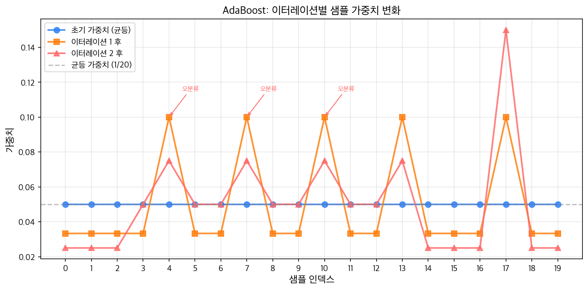
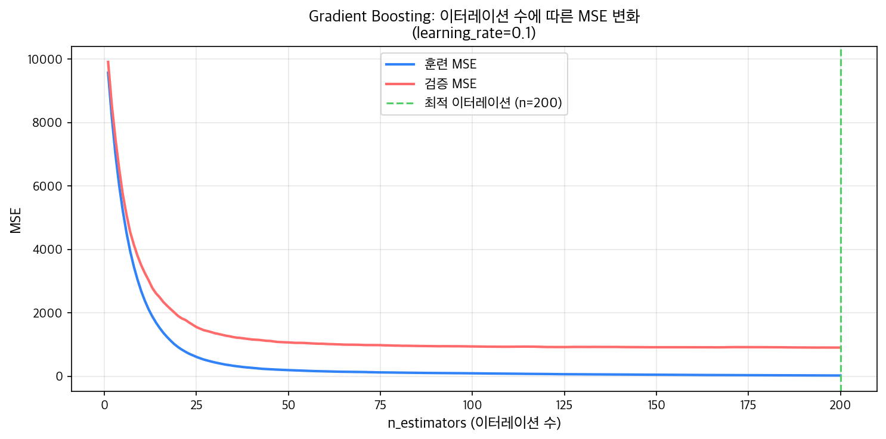

배깅(Bagging)은 트리 수백 그루를 서로 모르는 채로 학습시킨 뒤 투표로 합친다. 어느 트리도 다른 트리가 무엇을 틀렸는지 모른다. 그래서 트리마다 제각각인 들쭉날쭉함은 평균에 깎여 사라지지만, 모든 트리가 공통으로 못 맞추는 부분은 그대로 남는다. 분산은 줄고 편향은 안 준다.

부스팅(Boosting)은 반대로 간다. 트리를 하나씩 순서대로 만들되, 새 트리는 앞선 모델이 남긴 오차만 겨냥한다. 혼자서는 찍기보다 조금 나은 수준인 약한 학습기(Weak Learner)라도 앞사람의 실수를 이어받으며 쌓이면 편향(Bias)이 낮은 모델이 된다.

## 배깅과 부스팅은 목표가 다르다

| 구분 | 배깅 | 부스팅 |
|------|------|--------|
| 학습 순서 | 병렬, 서로 독립 | 순차, 앞 모델에 의존 |
| 줄이는 것 | 분산(Variance) | 편향(Bias) |
| 각 모델의 타겟 | 원래 정답 | 앞 모델이 남긴 오차 |
| 과적합 | 트리를 늘려도 잘 안 는다 | 트리를 늘리면 는다 |
| 이상치 | 둔감 | 민감 |

순서의 차이는 학습 시간에 그대로 나타난다. 배깅은 트리 100그루를 코어 여러 개에 흩어 동시에 학습시킬 수 있지만, 부스팅은 앞 트리의 예측이 있어야 다음 트리의 타겟이 정해지므로 트리 사이를 병렬화할 방법이 없다. 같은 100그루라도 부스팅 쪽이 몇 배 오래 걸린다.

노이즈가 많은 데이터, 학습을 병렬로 돌려야 하는 상황이면 배깅이 안전하다. 데이터가 비교적 깨끗하고 마지막 몇 퍼센트를 짜내야 하면 부스팅이다. 정형 데이터 대회에서 상위권 해법이 대체로 Gradient Boosting 계열인 것도 이 때문이다.

## AdaBoost

1995년 Freund와 Schapire가 제안한, 이론적 보장을 갖춘 첫 부스팅 알고리즘이다. "앞 모델이 틀린 것을 다음 모델이 맡는다"를 **샘플 가중치**로 구현한다. 오분류된 샘플의 가중치를 키워두면, 다음 분류기는 그 샘플을 틀렸을 때 손해가 크므로 자연히 거기에 집중한다.

기본 약한 학습기는 깊이 1짜리 결정 트리인 결정 그루터기(Decision Stump)다. 특성 하나와 임계값 하나로 "특성 A가 $\theta$ 이상이면 클래스 1"이라는 규칙만 만든다.

절차는 다섯 줄이다.

1. 모든 샘플에 같은 가중치 $w_i = 1/N$ 을 준다.
2. 그 가중치로 약한 분류기 $h_t$ 를 학습한다.
3. 가중 오류율 $\epsilon_t = \sum_i w_i \mathbf{1}[h_t(x_i) \neq y_i]$ 를 잰다.
4. 분류기 가중치 $\alpha_t$ 를 정하고, 오분류한 샘플은 $w_i$ 를 $e^{\alpha_t}$ 배로 키우고 맞춘 샘플은 $e^{-\alpha_t}$ 배로 줄인 뒤 합이 1이 되게 정규화한다.
5. 2번으로 돌아간다.

최종 예측은 분류기들의 가중 투표다.

$$H(x) = \operatorname{sign}\left(\sum_{t=1}^{T} \alpha_t h_t(x)\right), \qquad \alpha_t = \frac{1}{2}\ln\frac{1-\epsilon_t}{\epsilon_t}$$

$\alpha_t$ 하나가 두 가지 일을 동시에 한다. 잘 맞춘 분류기일수록 최종 투표에서 큰 지분을 갖고, 같은 값이 그 분류기가 틀린 샘플의 가중치를 밀어 올리는 폭도 정한다.

| 가중 오류율 $\epsilon_t$ | $\alpha_t$ | 최종 투표에서의 지분 |
|---|---|---|
| 0.5 | 0 | 없음. 찍기와 같으므로 버려진다 |
| 0.3 | 0.42 | 보통 |
| 0.1 | 1.10 | 큼 |
| 0.01 | 2.30 | 매우 큼 |

오류율이 0.5를 넘으면 $\alpha_t$ 가 음수가 되어, 그 분류기의 예측이 뒤집힌 채 반영된다. 찍기보다 못한 분류기도 버리지 않고 부호를 바꿔 쓰는 셈이다.



가로축은 샘플 하나하나, 세로축은 그 샘플이 다음 학습에서 갖는 비중이다. 처음에는 20개 샘플이 모두 1/20으로 평평하다. 첫 분류기가 틀린 네 개(인덱스 4, 7, 10, 13)만 0.1로 솟고 나머지는 그만큼 내려간다. 두 번째 이터레이션에서는 17번이 다시 틀리면서 0.15까지 올라간다. 어려운 샘플일수록 봉우리가 계속 높아진다.

:::warning

**AdaBoost는 이상치에 취약하다**

가중치가 $e^{\alpha_t}$ 배씩 곱해지며 누적된다는 점이 문제가 된다. 라벨이 잘못 붙은 샘플처럼 아무리 학습해도 못 맞추는 데이터가 있으면, 그 샘플의 가중치만 지수적으로 커져 나머지 데이터를 압도한다. 결국 앙상블 전체가 이상치 몇 개를 맞추려고 비틀린다.

이상치가 섞인 데이터라면 AdaBoost보다 Gradient Boosting이 낫다. 회귀에서는 `loss='huber'` 로 큰 잔차의 영향을 잘라낼 수 있다.

:::

```python
from sklearn.ensemble import AdaBoostClassifier
from sklearn.datasets import load_breast_cancer
from sklearn.model_selection import train_test_split

X_train, X_test, y_train, y_test = train_test_split(
    *load_breast_cancer(return_X_y=True), test_size=0.2, random_state=42
)

# 기본 학습기는 max_depth=1 결정 그루터기
ada = AdaBoostClassifier(n_estimators=100, learning_rate=1.0, random_state=42)
ada.fit(X_train, y_train)
print(ada.score(X_test, y_test))
```

```text
0.9737
```

## Gradient Boosting

2001년 Friedman이 제안한 쪽은 접근이 다르다. AdaBoost가 샘플 가중치를 바꾸며 나아간다면, Gradient Boosting은 **다음 트리에게 아예 다른 타겟을 준다.** 원래 정답 $y$ 대신, 지금까지 만든 모델이 남긴 오차를 맞추라고 시킨다.

목표가 $y = 100$ 인 샘플 하나를 따라가 보자. 첫 모델이 70을 내놓으면 잔차(Residual)는 30이다. 두 번째 트리는 이 30을 타겟으로 학습하고, 학습률 0.1만큼만 반영해서 예측을 73으로 옮긴다. 이제 남은 잔차는 27이고, 세 번째 트리가 그 27을 맡는다.

<div style="margin: 24px 0; text-align: center;">
<svg viewBox="0 0 400 432" style="width: 100%; height: auto; max-width: 380px;"
     xmlns="http://www.w3.org/2000/svg"
     font-family="Pretendard, -apple-system, sans-serif"
     role="img" aria-label="목표값 100에 대해 첫 모델이 70을 예측하고 남은 잔차 30을 다음 트리가 학습해 예측이 73, 75.7로 올라가면서 잔차가 0으로 줄어드는 순차 구조">
<style>
.bs1-t { fill: var(--text, #1c1917); }
.bs1-m { fill: var(--text-muted, #6d6762); }
.bs1-r { fill: var(--text-warn, #9d5604); }
.bs1-g { fill: var(--text-success, #107836); }
.bs1-box { fill: var(--bg-subtle, #f5f4f2); stroke: var(--border, #e7e5e4); stroke-width: 1.5; }
.bs1-done { fill: var(--bg-success, #f0fdf4); stroke: var(--text-success, #107836); stroke-width: 1.5; }
.bs1-arrow { stroke: var(--text-muted, #6d6762); stroke-width: 1.6; fill: none; }
.bs1-dot { fill: var(--text-muted, #6d6762); }
</style>
<defs>
<marker id="bs1Head" markerWidth="8" markerHeight="8" refX="6.5" refY="3" orient="auto">
<path d="M0,0 L7,3 L0,6 Z" fill="var(--text-muted, #6d6762)" />
</marker>
</defs>
<text x="200" y="24" text-anchor="middle" font-size="17" font-weight="700" class="bs1-t">잔차를 이어받는 순차 학습</text>
<text x="200" y="46" text-anchor="middle" font-size="14" class="bs1-m">목표 y = 100, 학습률 0.1</text>
<!-- 1단계 -->
<rect x="24" y="60" width="352" height="50" rx="8" class="bs1-box" />
<text x="44" y="91" font-size="17" class="bs1-t">F1(x) = 70</text>
<text x="356" y="91" text-anchor="end" font-size="16" class="bs1-r">잔차 +30</text>
<line x1="200" y1="110" x2="200" y2="150" class="bs1-arrow" marker-end="url(#bs1Head)" />
<text x="212" y="136" font-size="14" class="bs1-m">h2가 잔차 30을 학습</text>
<!-- 2단계 -->
<rect x="24" y="152" width="352" height="50" rx="8" class="bs1-box" />
<text x="44" y="183" font-size="17" class="bs1-t">F2(x) = 73</text>
<text x="356" y="183" text-anchor="end" font-size="16" class="bs1-r">잔차 +27</text>
<line x1="200" y1="202" x2="200" y2="242" class="bs1-arrow" marker-end="url(#bs1Head)" />
<text x="212" y="228" font-size="14" class="bs1-m">h3가 잔차 27을 학습</text>
<!-- 3단계 -->
<rect x="24" y="244" width="352" height="50" rx="8" class="bs1-box" />
<text x="44" y="275" font-size="17" class="bs1-t">F3(x) = 75.7</text>
<text x="356" y="275" text-anchor="end" font-size="16" class="bs1-r">잔차 +24.3</text>
<!-- 반복 생략 -->
<circle cx="200" cy="312" r="2.5" class="bs1-dot" />
<circle cx="200" cy="324" r="2.5" class="bs1-dot" />
<circle cx="200" cy="336" r="2.5" class="bs1-dot" />
<!-- 수렴 -->
<rect x="24" y="352" width="352" height="50" rx="8" class="bs1-done" />
<text x="44" y="383" font-size="17" class="bs1-t">Fm(x) → 100</text>
<text x="356" y="383" text-anchor="end" font-size="16" class="bs1-g">잔차 → 0</text>
<text x="200" y="422" text-anchor="middle" font-size="14" class="bs1-m">각 트리는 앞 단계가 남긴 잔차만 학습</text>
</svg>
</div>

한 단계의 업데이트는 이렇게 쓴다.

$$F_m(x) = F_{m-1}(x) + \eta \, h_m(x)$$

여기서 $h_m$ 이 학습하는 타겟이 정확히 무엇이냐가 이 방법의 핵심이다. 잔차가 아니라 손실 함수의 음의 그래디언트다.

$$r_{im} = -\left. \frac{\partial L(y_i, F(x_i))}{\partial F(x_i)} \right|_{F = F_{m-1}}$$

제곱 오차 $L = \frac{1}{2}(y - F)^2$ 를 쓰면 이 값이 $y_i - F_{m-1}(x_i)$, 즉 잔차와 정확히 같아진다. "잔차를 학습한다"는 직관이 성립하는 건 이 손실에서다. 분류에 쓰는 로그 손실이라면 타겟이 $y_i - p_i$ 형태로 바뀌지만 절차는 한 글자도 달라지지 않는다. 손실 함수를 갈아 끼워도 부스팅이 그대로 돌아가는 이유가 여기 있다.

:::info

**함수 공간에서의 경사하강법**

파라미터를 학습할 때는 $w \leftarrow w - \eta \nabla L$ 로 숫자 하나를 옮긴다. Gradient Boosting은 옮기는 대상이 파라미터가 아니라 모델 자체다. $F_m \leftarrow F_{m-1} + \eta h_m$ 에서 $h_m$ 이 음의 그래디언트 방향을 근사하니, 트리 한 그루가 경사하강법의 한 스텝에 해당한다. 학습률 $\eta$ 가 스텝 크기라는 것도 그대로다.

:::



트리를 늘릴수록 훈련 MSE는 0을 향해 계속 내려간다. 검증 MSE도 처음 25그루 사이에 대부분의 이득을 가져가고, 그 뒤로는 거의 평평하다. 두 곡선 사이에 벌어진 간격이 과적합의 크기이고, 검증 곡선이 평평해진 뒤에 쌓는 트리는 훈련 데이터만 더 정확히 외운다. 조기 종료(Early Stopping)는 이 평평해지는 지점을 자동으로 찾아 학습을 멈추는 장치다.

## 학습률과 트리 수는 함께 움직인다

Gradient Boosting에서 손댈 파라미터가 하나뿐이라면 `learning_rate`, 둘이라면 `n_estimators`까지다. 그리고 이 둘은 따로 정할 수 없다. 학습률은 트리 한 그루의 기여를 얼마나 줄일지 정하므로, 낮추면 같은 지점에 도달하는 데 더 많은 트리가 필요하다. 대략 `learning_rate × n_estimators` 가 총 학습량이라고 보면 된다.

`n_estimators=200`, `max_depth=3` 으로 고정하고 학습률만 바꿔본 결과다(Breast Cancer, `test_size=0.25`).

| `learning_rate` | 훈련 정확도 | 테스트 정확도 |
|---|---|---|
| 0.001 | 0.6291 | 0.6224 |
| 0.01 | 0.9930 | 0.9580 |
| 0.1 | 1.0000 | 0.9580 |
| 1.0 | 1.0000 | 0.9441 |

0.001은 200그루를 다 쓰고도 출발점에서 거의 못 벗어났다. 트리가 한참 더 필요하다는 뜻이다. 0.01과 0.1은 같은 테스트 정확도에 도달했는데, 200그루라는 예산 안에서는 둘 다 충분히 수렴했다는 신호다. 1.0은 오히려 가장 낮다. 트리 한 그루가 잔차를 통째로 삼켜버려서, 앙상블이라기보다 초반 몇 그루에 끌려가는 모델이 된다.

실무에서는 학습률을 0.05 근처로 낮게 잡고 `n_estimators`를 넉넉히 준 다음, 멈추는 시점은 조기 종료에 맡기는 쪽이 편하다.

```python
from sklearn.ensemble import GradientBoostingClassifier

gb = GradientBoostingClassifier(
    n_estimators=500,
    learning_rate=0.05,
    max_depth=3,
    validation_fraction=0.1,   # 훈련 데이터의 10%를 검증용으로 뗀다
    n_iter_no_change=20,       # 20라운드 개선이 없으면 중단
    tol=1e-4,
    random_state=42,
)
gb.fit(X_train, y_train)
print(gb.n_estimators_, gb.score(X_test, y_test))
```

```text
75 0.9473684210526315
```

500그루를 지정했지만 75그루에서 멈췄다. 다만 이 설정의 테스트 정확도는 100그루를 끝까지 학습시킨 0.9561보다 낮다. 조기 종료가 찾아주는 건 최고 성능 지점이 아니라 **검증 손실이 더 이상 줄지 않는 지점**이다. 검증용으로 떼어낸 10%가 작을수록 이 판단은 흔들리므로, 데이터가 작다면 `n_iter_no_change`를 넉넉히 주는 편이 안전하다.

## 흔한 실수

### 트리 수만 늘린다

```python
# 학습률은 그대로 두고 트리만 늘렸다
gb = GradientBoostingClassifier(n_estimators=1000, learning_rate=0.1)

# 학습률을 낮추면서 함께 늘려야 의미가 있다
gb = GradientBoostingClassifier(n_estimators=1000, learning_rate=0.01)
```

`learning_rate=0.1`에서 100그루면 이미 수렴이 끝났을 수 있다. 그 상태로 1000그루를 쌓으면 학습 시간만 10배가 되고, 남는 트리는 훈련 데이터의 노이즈를 외우는 데 쓰인다.

### `max_depth`를 키운다

```python
# 각 트리가 너무 강해진다
gb = GradientBoostingClassifier(n_estimators=100, max_depth=8)

# 부스팅의 권장 범위는 3에서 5 사이다
gb = GradientBoostingClassifier(n_estimators=100, max_depth=3)
```

깊은 트리는 혼자서도 훈련 데이터를 거의 맞춘다. 그러면 두세 번째 트리가 학습할 잔차가 노이즈밖에 남지 않아, 오차를 나눠 갖는 부스팅의 구조 자체가 무너진다. 약한 학습기는 약해야 한다.

## 마치며

부스팅의 정체는 오차를 다음 사람에게 넘기는 릴레이다. AdaBoost는 넘기는 방식이 샘플 가중치였고, Gradient Boosting은 타겟 자체를 오차로 바꿔치기했다. 후자가 살아남은 건 성능 때문이라기보다 손실 함수를 자유롭게 고를 수 있어서다. 회귀든 분류든 순위 학습이든 미분 가능한 손실만 있으면 같은 절차가 돌아간다.

그래서 튜닝에서 신경 쓸 것도 둘로 좁혀진다. 각 트리를 충분히 약하게 유지하는 것(`max_depth` 3에서 5), 그리고 학습률과 트리 수를 한 쌍으로 다루는 것이다. 나머지는 조기 종료가 대신 판단해준다.

다만 sklearn의 `GradientBoostingClassifier` 는 분할점 후보를 특성 값 전부에서 찾기 때문에, 데이터가 커지면 감당이 안 될 만큼 느려진다. 이 병목을 정면으로 뜯어고친 것이 XGBoost와 LightGBM이고, 두 라이브러리가 갈라진 지점이 다음 이야기다.

## 함께 보면 좋은 글

- [앙상블과 배깅](/ml/ensemble-and-bagging/) : 모델을 병렬로 쌓아 분산을 줄이는 반대편 전략
- [편향-분산 트레이드오프](/ml/bias-variance/) : 부스팅이 줄이는 편향이 무엇인지
- [XGBoost와 LightGBM](/ml/xgboost-vs-lightgbm/) : 같은 원리를 실전 속도로 끌어올린 구현체

## 참고자료

- [Freund & Schapire (1997), A Decision-Theoretic Generalization of On-Line Learning and an Application to Boosting](https://www.sciencedirect.com/science/article/pii/S002200009791504X)
- [Friedman (2001), Greedy Function Approximation: A Gradient Boosting Machine](https://projecteuclid.org/journals/annals-of-statistics/volume-29/issue-5/Greedy-function-approximation-a-gradient-boosting-machine/10.1214/aos/1013203451.full)
- [scikit-learn, Ensemble methods](https://scikit-learn.org/stable/modules/ensemble.html)
- [XGBoost, Introduction to Boosted Trees](https://xgboost.readthedocs.io/en/stable/tutorials/model.html)
