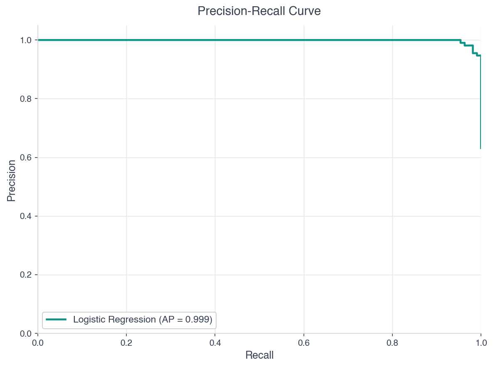
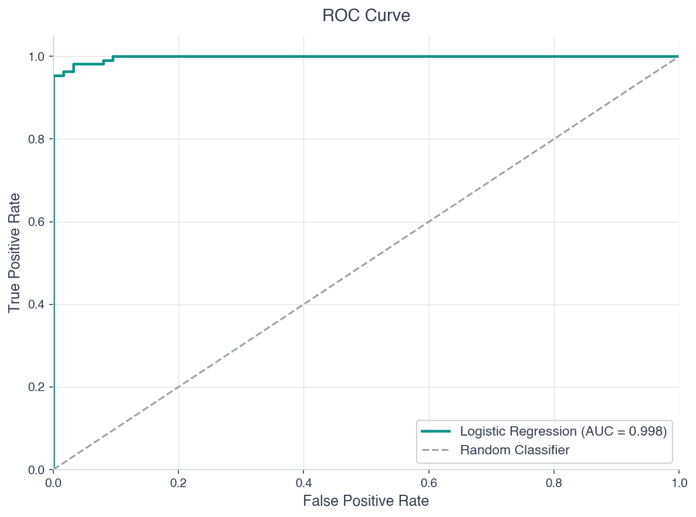

Phase 5까지 24개 글에 걸쳐 긴 여정을 달려왔다. [선형 회귀](/ml/linear-regression/)에서 시작해 [로지스틱 회귀](/ml/logistic-regression/), [결정 트리](/ml/decision-tree/)와 [랜덤 포레스트](/ml/random-forest/), [XGBoost/LightGBM](/ml/xgboost-vs-lightgbm/), 그리고 [신경망](/ml/neural-network-basics/)과 [학습 안정화 기법](/ml/neural-network-tips/)까지 -- 주요 지도학습 알고리즘은 전부 다뤘다. 도구상자는 꽉 찼다.

이제 핵심 질문이 남았다. **이 모델들 중 어떤 게 더 좋은가?** "좋다"는 걸 어떻게 측정하는가?

"정확도(Accuracy) 높은 게 좋은 모델 아니야?"라고 생각할 수 있다. 맞는 것 같지만, 현실은 그렇게 단순하지 않다. 이번 글부터 Phase 6 -- 모델 평가 -- 를 시작한다. 첫 번째 주제는 **분류 모델의 평가 지표**다.

---

## 1. Accuracy의 함정

Accuracy(정확도)는 가장 직관적인 지표다.

```
Accuracy = 정확히 맞힌 수 / 전체 수
```

테스트 데이터 100개 중 95개를 맞히면 Accuracy 95%. 깔끔하다. 그런데 이런 상황을 보자.

**예시: 신용카드 사기 탐지**

| 구분 | 건수 |
|------|------|
| 정상 거래 | 9,900건 |
| 사기 거래 | 100건 |
| 합계 | 10,000건 |

여기서 모델이 **모든 거래를 "정상"이라고 예측**하면 어떻게 될까?

```
Accuracy = 9,900 / 10,000 = 99%
```

99% 정확도. 숫자만 보면 훌륭하다. 하지만 이 모델은 사기를 **단 하나도** 잡지 못한다. 사기 탐지기로서 완전히 쓸모없다.

이것이 **Accuracy Paradox**다. 클래스 불균형(imbalanced data)이 심한 데이터에서 Accuracy는 모델의 실제 성능을 감춘다. 현실의 데이터는 거의 항상 불균형이다 -- 스팸 메일, 질병 진단, 이상 탐지, 제조 불량 검출... 모두 양성(Positive) 클래스가 소수다.

<div style="background: #f0f4ff; border-left: 4px solid #3182f6; padding: 16px 20px; margin: 20px 0; border-radius: 4px;"><strong>💡 Accuracy가 유용한 경우</strong><br>클래스 비율이 대체로 균형 잡혀 있고(예: 50:50 ~ 70:30), 양성/음성 오분류의 비용이 비슷할 때는 Accuracy도 충분히 좋은 지표다. 문제는 이런 조건이 현실에서 드물다는 것이다.</div>

Accuracy만으로 부족하다면, **어떤 종류의 실수를 얼마나 했는지** 분해해서 봐야 한다. 그 시작점이 Confusion Matrix다.

---

## 2. Confusion Matrix (혼동 행렬)

Confusion Matrix는 모델의 예측 결과를 4가지로 분류한 표다.

|  | 예측: Positive | 예측: Negative |
|--|----------------|----------------|
| **실제: Positive** | True Positive (TP) | False Negative (FN) |
| **실제: Negative** | False Positive (FP) | True Negative (TN) |

각 칸의 의미를 암 검진 예시로 풀어보자.

- **TP (True Positive)**: 실제 암 환자를 "암"이라고 정확히 진단
- **FN (False Negative)**: 실제 암 환자를 "정상"이라고 놓침 → **가장 위험한 실수**
- **FP (False Positive)**: 정상인을 "암"이라고 잘못 진단 → 불필요한 추가 검사
- **TN (True Negative)**: 정상인을 "정상"이라고 정확히 진단

```python
from sklearn.metrics import confusion_matrix

y_true = [1, 0, 1, 1, 0, 1, 0, 0, 1, 0]
y_pred = [1, 0, 1, 0, 0, 1, 1, 0, 1, 0]

cm = confusion_matrix(y_true, y_pred)
print(cm)
# [[4, 1],   ← 실제 Negative: TN=4, FP=1
#  [1, 4]]   ← 실제 Positive: FN=1, TP=4
```

Confusion Matrix 자체는 숫자의 나열일 뿐이다. 여기서 **의미 있는 지표**를 뽑아내야 한다.

---

## 3. Precision (정밀도)

```
Precision = TP / (TP + FP)
```

**"모델이 Positive라고 예측한 것 중에서, 실제로 Positive인 비율"**

직관적으로 말하면: 모델이 "이건 양성이다"라고 말했을 때, **그 말을 얼마나 믿을 수 있는가?**

### Precision이 중요한 상황

**False Positive의 비용이 클 때** Precision을 중시한다.

| 상황 | FP의 결과 | Precision 중요도 |
|------|----------|-----------------|
| 스팸 메일 필터 | 정상 메일이 스팸함으로 → 중요 메일 놓침 | 매우 높음 |
| 추천 시스템 | 관련 없는 상품 추천 → 사용자 이탈 | 높음 |
| 법적 판결 | 무고한 사람 유죄 판결 | 매우 높음 |

스팸 필터를 예로 들면, 중요한 업무 메일이 스팸으로 분류되면 치명적이다. 차라리 스팸을 몇 개 놓치더라도(FN 증가), 스팸이라고 판단한 것은 확실히 스팸이어야 한다(높은 Precision).

---

## 4. Recall (재현율, Sensitivity)

```
Recall = TP / (TP + FN)
```

**"실제 Positive인 것 중에서, 모델이 Positive로 잡아낸 비율"**

직관적으로: 진짜 양성 케이스를 **얼마나 빠짐없이 잡아내는가?**

### Recall이 중요한 상황

**False Negative의 비용이 클 때** Recall을 중시한다.

| 상황 | FN의 결과 | Recall 중요도 |
|------|----------|--------------|
| 암 조기 검진 | 암 환자를 정상으로 판단 → 치료 시기 놓침 | 매우 높음 |
| 제조 불량 검출 | 불량품이 출하 → 사고/리콜 | 매우 높음 |
| 바이러스 탐지 | 악성코드를 정상으로 판단 → 시스템 감염 | 매우 높음 |

암 검진에서 실제 암 환자 100명 중 모델이 80명만 잡아내면 Recall은 80%다. 나머지 20명은 "정상"이라는 결과를 받고 집에 간다. 이 20명에게 Accuracy 99%는 의미 없다.

<div style="background: #f0f4ff; border-left: 4px solid #3182f6; padding: 16px 20px; margin: 20px 0; border-radius: 4px;"><strong>💡 Specificity (특이도)</strong><br>Recall이 "실제 양성 중 양성 예측 비율"이라면, Specificity는 반대쪽이다.<br><br><code>Specificity = TN / (TN + FP)</code><br><br>"실제 음성 중 음성으로 정확히 예측한 비율." ROC 곡선에서 X축이 1 - Specificity(= FPR)다.</div>

---

## 5. Precision-Recall Trade-off

Precision과 Recall은 **시소 관계**다. 하나를 올리면 다른 하나가 내려간다.

[로지스틱 회귀](/ml/logistic-regression/)를 떠올려보자. 출력은 0~1 사이의 확률값이고, 기본 threshold는 0.5다. 확률이 0.5 이상이면 Positive, 미만이면 Negative로 분류한다. 이 threshold를 조절하면 Precision-Recall 균형이 바뀐다.

```
threshold를 낮추면 (예: 0.3):
→ 더 많은 샘플을 Positive로 분류
→ 실제 Positive를 더 많이 잡음 → Recall ↑
→ 하지만 Negative도 Positive로 잘못 분류 → Precision ↓

threshold를 높이면 (예: 0.7):
→ 확실한 것만 Positive로 분류
→ Positive라고 한 것은 거의 맞음 → Precision ↑
→ 하지만 애매한 Positive를 놓침 → Recall ↓
```

### PR Curve

threshold를 0에서 1까지 변화시키면서 Precision과 Recall을 기록하면 **PR Curve**(Precision-Recall Curve)가 된다.

```python
from sklearn.metrics import precision_recall_curve
import matplotlib.pyplot as plt

# y_scores: 모델이 출력한 확률값
precision, recall, thresholds = precision_recall_curve(y_true, y_scores)

plt.plot(recall, precision)
plt.xlabel('Recall')
plt.ylabel('Precision')
plt.title('Precision-Recall Curve')
plt.show()
```



이상적인 모델은 Precision과 Recall이 모두 1인 **우상단 꼭짓점**에 가깝다. 곡선 아래 면적(AP, Average Precision)이 클수록 좋다.

---

## 6. F1-Score

Precision과 Recall 중 하나만 보면 전체 그림을 놓친다. 둘을 하나의 숫자로 합치고 싶다. 산술 평균을 쓰면 되지 않을까?

```
산술 평균 = (Precision + Recall) / 2

예시: Precision = 1.0, Recall = 0.01
산술 평균 = (1.0 + 0.01) / 2 = 0.505
```

Recall이 0.01(거의 아무것도 못 잡음)인데 0.505라는 그럴듯한 점수가 나온다. 산술 평균은 극단적인 불균형을 제대로 반영하지 못한다.

**F1-Score**는 **조화 평균**(harmonic mean)을 사용한다.

```
F1 = 2 × (Precision × Recall) / (Precision + Recall)

예시: Precision = 1.0, Recall = 0.01
F1 = 2 × (1.0 × 0.01) / (1.0 + 0.01) = 0.0198
```

왜 조화 평균인가? 산술 평균은 (a+b)/2로 "크면 보상"이지만, 조화 평균은 2ab/(a+b)로 "작으면 벌점"이다. 속도의 평균(왕복 평균 속도)을 구할 때와 같은 원리다. Precision과 Recall **모두** 적절해야 높은 점수가 나온다.

| Precision | Recall | 산술 평균 | F1 (조화 평균) |
|-----------|--------|----------|--------------|
| 0.9 | 0.9 | 0.90 | 0.90 |
| 1.0 | 0.01 | 0.505 | 0.020 |
| 0.6 | 0.4 | 0.50 | 0.48 |
| 0.8 | 0.8 | 0.80 | 0.80 |

Precision과 Recall이 비슷할 때는 두 평균이 거의 같지만, 차이가 벌어질수록 F1이 훨씬 보수적인 점수를 매기는 것을 확인할 수 있다.

---

## 7. F-beta Score

F1은 Precision과 Recall에 **동일한 가중치**를 준다. 하지만 실무에서는 한쪽이 더 중요한 경우가 대부분이다. 이때 **F-beta Score**를 쓴다.

```
F_β = (1 + β²) × (Precision × Recall) / (β² × Precision + Recall)
```

- **β = 1**: F1과 동일. Precision = Recall 동일 비중
- **β = 0.5**: Precision에 더 큰 가중치. "거짓 알람을 줄이는 게 우선"
- **β = 2**: Recall에 더 큰 가중치. "놓치지 않는 게 우선"

```python
from sklearn.metrics import fbeta_score

# Recall 중시 (암 검진)
f2 = fbeta_score(y_true, y_pred, beta=2)

# Precision 중시 (스팸 필터)
f05 = fbeta_score(y_true, y_pred, beta=0.5)
```

β의 의미를 직관적으로 풀면: **"Recall이 Precision보다 β배 더 중요하다"**는 뜻이다. β=2이면 Recall을 Precision보다 2배 중시한다.

---

## 8. ROC Curve와 AUC

### ROC Curve

**ROC(Receiver Operating Characteristic) Curve**는 threshold를 변화시키면서 **TPR(True Positive Rate)**과 **FPR(False Positive Rate)**의 관계를 그린 곡선이다.

```
TPR = TP / (TP + FN)  ← Recall과 동일
FPR = FP / (FP + TN)  ← 1 - Specificity
```

- X축: FPR (음성을 양성으로 잘못 분류한 비율)
- Y축: TPR (양성을 양성으로 올바르게 분류한 비율)

```python
from sklearn.metrics import roc_curve, roc_auc_score

fpr, tpr, thresholds = roc_curve(y_true, y_scores)
auc = roc_auc_score(y_true, y_scores)

plt.plot(fpr, tpr, label=f'ROC (AUC = {auc:.3f})')
plt.plot([0, 1], [0, 1], 'k--', label='Random (AUC = 0.5)')
plt.xlabel('False Positive Rate')
plt.ylabel('True Positive Rate')
plt.title('ROC Curve')
plt.legend()
plt.show()
```



### AUC (Area Under the Curve)

**AUC**는 ROC 곡선 아래의 면적이다. 0에서 1 사이 값을 가진다.

| AUC 범위 | 해석 |
|----------|------|
| 0.9 ~ 1.0 | 매우 우수 |
| 0.8 ~ 0.9 | 우수 |
| 0.7 ~ 0.8 | 보통 |
| 0.6 ~ 0.7 | 미흡 |
| 0.5 | 랜덤 추측과 동일 (대각선) |

AUC의 직관적 의미: **임의의 양성 샘플이 임의의 음성 샘플보다 높은 점수를 받을 확률**이다. AUC = 0.85면, 양성 샘플 하나와 음성 샘플 하나를 무작위로 뽑았을 때 모델이 양성에 더 높은 점수를 줄 확률이 85%다.

<div style="background: #f0f4ff; border-left: 4px solid #3182f6; padding: 16px 20px; margin: 20px 0; border-radius: 4px;"><strong>💡 AUC의 장점</strong><br>AUC는 threshold에 독립적이다. 특정 threshold를 정하지 않아도 모델의 전반적인 분류 능력을 하나의 숫자로 평가할 수 있다. 서로 다른 모델을 비교할 때 특히 유용하다.</div>

---

## 9. ROC Curve vs PR Curve

두 곡선 모두 모델의 성능을 시각화하지만, **어떤 상황에서 어떤 걸 쓸지**가 중요하다.

| 기준 | ROC Curve | PR Curve |
|------|-----------|----------|
| 축 | FPR vs TPR | Recall vs Precision |
| 클래스 균형 | 균형 데이터에서 잘 작동 | 불균형 데이터에서 더 정직 |
| 음성 클래스 영향 | TN 포함 → 음성 많으면 FPR 낮게 유지 | TN 미포함 → 양성 클래스에만 집중 |
| Random baseline | 대각선 (AUC = 0.5) | 양성 비율에 따라 달라짐 |

**핵심: 클래스 불균형이 심하면 PR Curve를 써라.**

이유가 있다. 클래스 비율이 99:1인 데이터에서 ROC Curve는 FPR 계산에 TN이 포함되므로, 음성이 9,900개면 FP가 100개 나와도 FPR은 겨우 1%다. ROC Curve에서는 꽤 좋아 보인다. 하지만 PR Curve에서 Precision을 보면, 실제로 양성이라고 예측한 것 중 절반이 틀린 셈이라 성능이 낮게 나타난다. PR Curve가 더 정직한 평가를 해준다.

```python
from sklearn.metrics import (
    precision_recall_curve,
    average_precision_score,
    roc_curve,
    roc_auc_score
)

# ROC
fpr, tpr, _ = roc_curve(y_true, y_scores)
roc_auc = roc_auc_score(y_true, y_scores)

# PR
precision, recall, _ = precision_recall_curve(y_true, y_scores)
pr_auc = average_precision_score(y_true, y_scores)

print(f"ROC-AUC: {roc_auc:.3f}")
print(f"PR-AUC (AP): {pr_auc:.3f}")
```

---

## 10. 다중 클래스 평가: Macro, Micro, Weighted

지금까지는 이진 분류를 다뤘다. [결정 경계](/ml/decision-boundary/)를 여러 클래스로 확장할 때, 각 클래스별 Precision/Recall/F1을 어떻게 하나로 합칠까? 세 가지 평균 방식이 있다.

### Macro Average

각 클래스의 지표를 **단순 평균**한다.

```
Macro F1 = (F1_class0 + F1_class1 + F1_class2) / 3
```

모든 클래스를 **동등하게** 취급한다. 소수 클래스의 성능이 전체 점수에 크게 반영된다. 클래스 불균형이 있을 때 소수 클래스 성능을 확인하기 좋다.

### Micro Average

전체 TP, FP, FN을 **합산**한 후 지표를 계산한다.

```
Micro Precision = 전체 TP / (전체 TP + 전체 FP)
```

다수 클래스의 영향력이 크다. 전체적인 정확도와 비슷한 값이 나온다.

### Weighted Average

각 클래스의 **샘플 수에 비례**하여 가중 평균한다.

```
Weighted F1 = Σ (n_i / N) × F1_i
```

클래스 불균형을 반영하면서도 각 클래스의 기여를 샘플 수에 따라 조절한다.

| 방식 | 계산 | 적합한 상황 |
|------|------|------------|
| Macro | 클래스별 단순 평균 | 소수 클래스 성능이 중요할 때 |
| Micro | 전체 합산 후 계산 | 전체 정확도가 중요할 때 |
| Weighted | 샘플 수 가중 평균 | 불균형 데이터의 균형잡힌 평가 |

---

## 11. 실전 예제: 여러 모델 비교

지금까지 배운 지표를 모두 활용해서, [랜덤 포레스트](/ml/random-forest/)와 [XGBoost](/ml/xgboost-vs-lightgbm/) 등 여러 모델을 비교해보자.

```python
from sklearn.datasets import make_classification
from sklearn.model_selection import train_test_split
from sklearn.linear_model import LogisticRegression
from sklearn.ensemble import RandomForestClassifier, GradientBoostingClassifier
from sklearn.svm import SVC
from sklearn.metrics import (
    classification_report,
    roc_auc_score,
    average_precision_score
)
import numpy as np

# 불균형 데이터 생성 (양성 10%)
X, y = make_classification(
    n_samples=2000,
    n_features=20,
    n_informative=10,
    weights=[0.9, 0.1],  # 90:10 불균형
    random_state=42
)
X_train, X_test, y_train, y_test = train_test_split(
    X, y, test_size=0.3, random_state=42, stratify=y
)

# 모델 정의
models = {
    'Logistic Regression': LogisticRegression(max_iter=1000),
    'Random Forest': RandomForestClassifier(n_estimators=100, random_state=42),
    'Gradient Boosting': GradientBoostingClassifier(n_estimators=100, random_state=42),
    'SVM (RBF)': SVC(probability=True, random_state=42),
}

# 학습 및 평가
for name, model in models.items():
    model.fit(X_train, y_train)
    y_pred = model.predict(X_test)
    y_proba = model.predict_proba(X_test)[:, 1]

    print(f"\n{'='*50}")
    print(f"  {name}")
    print(f"{'='*50}")
    print(classification_report(y_test, y_pred, digits=3))
    print(f"  ROC-AUC:  {roc_auc_score(y_test, y_proba):.3f}")
    print(f"  PR-AUC:   {average_precision_score(y_test, y_proba):.3f}")
```

실행하면 이런 식의 결과가 나온다.

```
==================================================
  Gradient Boosting
==================================================
              precision    recall  f1-score   support

           0      0.967     0.985     0.976       540
           1      0.831     0.717     0.770        60

    accuracy                          0.957       600
   macro avg      0.899     0.851     0.873       600
weighted avg      0.954     0.957     0.955       600

  ROC-AUC:  0.952
  PR-AUC:   0.836
```

이 결과를 읽는 법:

1. **Accuracy는 95.7%**로 높지만, 이건 다수 클래스(0) 덕분이다
2. **양성 클래스(1)의 Recall은 71.7%** -- 실제 양성 60명 중 약 17명을 놓쳤다
3. **양성 클래스의 Precision은 83.1%** -- 양성이라고 한 것 중 17%는 오탐
4. **ROC-AUC 0.952** -- 전반적인 분류 능력은 우수
5. **PR-AUC 0.836** -- 불균형 상황에서도 양성 탐지 성능이 양호

모델 간 비교 시 **어떤 지표를 기준으로 삼을지**는 비즈니스 맥락에 따라 달라진다.

---

## 12. 지표 선택 가이드

모든 지표를 알았으니, 이제 실전에서 **언제 어떤 지표를 쓸지** 정리하자.

### 비즈니스 맥락별 선택

| 도메인 | 핵심 지표 | 이유 |
|--------|----------|------|
| 스팸 필터 | **Precision** | 정상 메일을 스팸으로 분류하면 비즈니스 피해 |
| 암/질병 검진 | **Recall** | 환자를 놓치면 생명 위험 |
| 일반적인 균형 분류 | **F1-Score** | Precision/Recall 양쪽 균형 |
| 정보 검색 | **Precision@K** | 상위 K개 결과의 관련성 |
| 사기 탐지 | **PR-AUC** | 불균형 + 놓치면 안 됨 |
| 모델 전반 비교 | **ROC-AUC** | threshold 독립적 비교 |
| 소수 클래스 중시 | **Macro F1** | 클래스별 동등한 비중 |

### 실전 의사결정 플로우

```
클래스가 균형인가?
├── Yes → Accuracy + F1로 충분
└── No → 불균형 데이터
    ├── FN 비용 > FP 비용?
    │   └── Yes → Recall (또는 F2) 중시
    ├── FP 비용 > FN 비용?
    │   └── Yes → Precision (또는 F0.5) 중시
    └── 전반적 비교?
        └── PR-AUC 사용
```

<div style="background: #f0f4ff; border-left: 4px solid #3182f6; padding: 16px 20px; margin: 20px 0; border-radius: 4px;"><strong>💡 실무 팁: 지표는 하나만 보지 마라</strong><br>보고서에는 주요 지표(primary metric) 하나를 기준으로 삼되, 보조 지표(secondary metrics)도 함께 제시해야 한다. 예를 들어 암 검진 모델이면 Recall을 primary로 삼되, Precision이 너무 낮지 않은지(false alarm이 너무 많으면 의료진이 무시하게 됨) 반드시 확인한다. 지표 하나에 올인하면 다른 쪽이 무너지는 함정에 빠진다.</div>

### 지표와 [결정 경계](/ml/decision-boundary/)의 관계

threshold를 조절하면 [결정 경계](/ml/decision-boundary/)가 이동한다. threshold를 낮추면 경계가 Negative 쪽으로 밀려서 더 많은 샘플이 Positive로 분류된다. 결국 평가 지표 선택은 **"결정 경계를 어디에 그을 것인가"**에 대한 비즈니스 판단과 직결된다.

---

## 정리

| 지표 | 공식 | 핵심 질문 |
|------|------|----------|
| Accuracy | (TP+TN) / 전체 | 전체 중 맞힌 비율은? |
| Precision | TP / (TP+FP) | 양성 예측 중 진짜 양성은? |
| Recall | TP / (TP+FN) | 진짜 양성 중 잡아낸 비율은? |
| F1 | 2×P×R / (P+R) | P와 R의 균형 점수는? |
| F-beta | (1+β²)×P×R / (β²×P+R) | P/R에 가중치를 주면? |
| ROC-AUC | ROC 곡선 아래 면적 | 전반적 분류 능력은? |
| PR-AUC | PR 곡선 아래 면적 | 불균형 데이터에서의 실력은? |

핵심 원칙을 세 줄로:

1. **Accuracy만 보지 마라** -- 불균형 데이터에서는 거짓말쟁이다
2. **FP와 FN 중 뭐가 더 치명적인지** 먼저 정하라 -- 그게 지표를 결정한다
3. **ROC-AUC로 전반적 비교, PR-AUC로 불균형 검증** -- 둘 다 확인하라

---

## 다음 글 미리보기

분류 모델의 평가 지표를 정리했다. 하지만 [선형 회귀](/ml/linear-regression/)나 [다중 선형 회귀](/ml/multiple-linear-regression/)처럼 **연속된 값을 예측하는 회귀 모델**은 Precision이나 Recall로 평가할 수 없다. 다음 글에서는 MSE, RMSE, MAE, R² 등 [회귀 모델의 평가 지표](/ml/regression-metrics/)를 다룬다.
