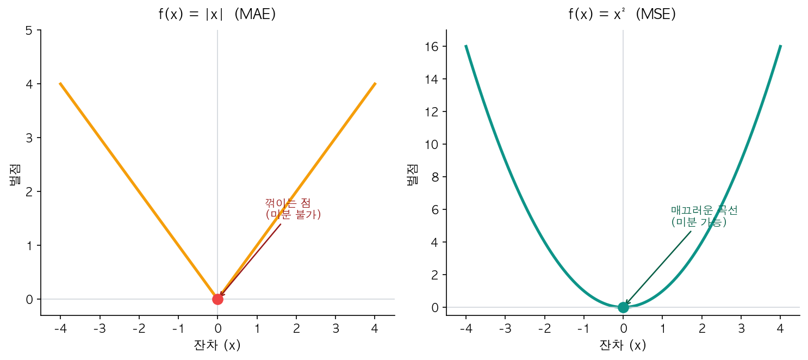
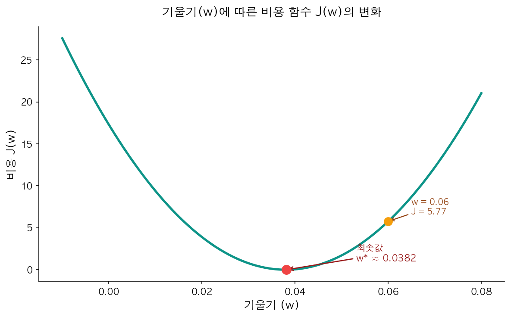

[지난 글에서](/ml/linear-regression/) 선형 회귀의 목표가 "잔차를 최소화하는 직선을 찾는 것"이라고 했다. 그런데 잠깐 — 데이터가 100개면 잔차도 100개다. 100개의 숫자를 동시에 "최소화"한다는 게 정확히 무슨 뜻인가?

여기서 **비용 함수(Cost Function)**가 등장한다. 여러 잔차를 **숫자 하나**로 요약하는 함수다. 이 숫자가 작을수록 모델이 데이터를 잘 맞추고 있다는 뜻이고, 학습(training)의 목표는 이 숫자를 가능한 한 줄이는 것이다.

단순해 보이지만, "어떻게 요약하느냐"에 따라 모델의 행동이 완전히 달라진다. 잔차를 제곱해야 하는 이유, 평균을 내는 이유, 그리고 이게 어떻게 최적화 문제로 연결되는지 — 이번 글에서 전부 다룬다.

---

## 잔차를 어떻게 하나의 숫자로 만들까

[지난 글의 잔차](/ml/linear-regression/)를 다시 떠올려보자. 8개 데이터에 잔차 8개. 이걸 "모델이 얼마나 틀렸는가"를 나타내는 숫자 하나로 만들어야 한다.

가장 직관적인 방법 세 가지를 순서대로 시도해보자.

### 시도 1: 단순 합산

잔차를 다 더하면 어떨까?

```
잔차: +3, -2, +1, -2
합계: 0
```

합이 0이다. 4개 예측이 모두 틀렸는데 오차가 0이라니. 양수 잔차(과소 예측)와 음수 잔차(과대 예측)가 서로 **상쇄**됐기 때문이다. 이 방법은 쓸 수 없다.

### 시도 2: 절댓값의 평균 (MAE)

잔차의 절댓값을 취하면 상쇄 문제가 사라진다.

```
잔차:    +3, -2, +1, -2
|잔차|:   3,  2,  1,  2
평균: (3+2+1+2) / 4 = 2.0
```

이건 실제로 쓰이는 방법이다 — **평균 절대 오차(Mean Absolute Error, MAE)**. 직관적이고 단위도 원래 값과 같다.

하지만 수학적으로 한 가지 불편한 점이 있다. 절댓값 함수 |x|는 x = 0에서 꺾인다. 미분이 깔끔하지 않다. 왜 이게 문제인지는 뒤에서 다룬다.

### 시도 3: 제곱의 평균 (MSE)

잔차를 **제곱**하면 음수도 양수가 되고, 큰 오차에 더 큰 벌점을 매길 수 있다.

```
잔차:    +3, -2, +1, -2
잔차²:    9,  4,  1,  4
평균: (9+4+1+4) / 4 = 4.5
```

이 방법이 **평균 제곱 오차(Mean Squared Error, MSE)** — ML에서 회귀 문제의 기본 비용 함수다.

---

## MSE — 가장 대표적인 비용 함수

MSE의 수식을 정확히 적으면 이렇다.

> **J(w, b) = (1/n) × Σᵢ(ŷᵢ − yᵢ)²**
>
> - **n**: 데이터 포인트 수
> - **ŷᵢ**: i번째 예측값 (= wxᵢ + b)
> - **yᵢ**: i번째 실제값
> - **J**: 비용(Cost) — 이 값을 최소화하는 게 학습의 목표

[지난 글의 면적-가격 데이터](/ml/linear-regression/)로 직접 계산해보자.

```python
import numpy as np
from sklearn.linear_model import LinearRegression

# 면적-가격 데이터 (선형 회귀 글과 동일)
area = np.array([60, 75, 85, 95, 110, 120, 140, 155]).reshape(-1, 1)
price = np.array([2.1, 2.8, 3.2, 3.6, 4.1, 4.5, 5.2, 5.8])

model = LinearRegression()
model.fit(area, price)
y_pred = model.predict(area)

# MSE 직접 계산
residuals = price - y_pred
mse = np.mean(residuals ** 2)
print(f"MSE: {mse:.4f}")  # 0.0025
```

sklearn의 함수로도 같은 결과를 얻을 수 있다.

```python
from sklearn.metrics import mean_squared_error
print(f"MSE (sklearn): {mean_squared_error(price, y_pred):.4f}")  # 0.0025
```

MSE가 0.0025라는 건, 평균적으로 예측이 √0.0025 ≈ **0.05억 (약 500만 원)** 정도 빗나간다는 뜻이다. 이 값(√MSE)이 곧 RMSE — 단위가 원래 y와 같아서 해석이 직관적이다. 데이터가 8개뿐이고 거의 직선에 가까워서 오차가 매우 작다.

<div style="background: #f0f4ff; border-left: 4px solid #3182f6; padding: 16px 20px; margin: 20px 0; border-radius: 4px;">
  <strong>💡 1/2n 관습</strong><br>
  교과서나 강의에 따라 MSE를 <code>J = (1/2n) × Σ(ŷ − y)²</code>로 쓰기도 한다. 분모에 2를 넣는 이유는 미분할 때 제곱의 지수 2와 상쇄되어 수식이 깔끔해지기 때문이다. 최솟값의 <strong>위치</strong>는 변하지 않는다 — 상수 배율은 "어디서 최소가 되는가"에 영향을 주지 않으므로.
</div>

---

## 왜 절댓값이 아니라 제곱인가

MAE 대신 MSE가 기본값인 데는 세 가지 실용적 이유가 있다.

### 1. 큰 오차에 더 큰 벌점

제곱은 큰 잔차를 **불균형하게** 크게 만든다.

| 잔차 | \|잔차\| (MAE) | 잔차² (MSE) |
|------|------------|-----------|
| 0.5  | 0.5        | 0.25      |
| 1.0  | 1.0        | 1.00      |
| 2.0  | 2.0        | 4.00      |
| 5.0  | 5.0        | **25.00** |

잔차가 5일 때, MAE는 "5만큼 나쁘다"고 평가하지만 MSE는 "25만큼 나쁘다"고 평가한다. 대부분의 회귀 문제에서 이게 바람직하다 — 크게 빗나간 예측 하나가 조금씩 빗나간 여러 예측보다 보통 더 심각하기 때문이다.

### 2. 미분 가능성

|x|와 x²을 그래프로 비교하면 차이가 한눈에 보인다.


<p align="center" style="color: #888; font-size: 13px;"><em>절댓값 함수는 x = 0에서 꺾인다. 제곱 함수는 모든 점에서 매끄럽다.</em></p>

절댓값 함수는 x = 0에서 꺾이며, 이 지점에서 미분값이 정의되지 않는다. 반면 x²은 모든 구간에서 매끄럽게 미분된다.

왜 이게 중요한가? 다음 글에서 다룰 **경사하강법(Gradient Descent)**이 비용 함수의 **미분값(기울기)**을 따라 파라미터를 업데이트하기 때문이다. 미분이 매끄러우면 학습이 안정적이다.

<div style="background: #f0fff4; border-left: 4px solid #51cf66; padding: 16px 20px; margin: 20px 0; border-radius: 4px;">
  <strong>✅ 참고</strong><br>
  MAE의 미분 불가능 문제는 subgradient 같은 기법으로 해결할 수 있어서 사용 자체가 불가능한 건 아니다. 다만 MSE가 수학적으로 더 다루기 쉬운 건 사실이고, 그래서 회귀의 기본값으로 자리잡았다.
</div>

### 3. 볼록성 — 최솟값이 하나

MSE는 선형 회귀의 파라미터(w, b)에 대해 **볼록 함수(Convex Function)**다. 볼록 함수는 극솟값(local minimum)이 곧 전역 최솟값(global minimum)이라는 강력한 성질을 갖는다. 어디서 출발하든 바닥에 도달할 수 있다.

이 세 가지 — 큰 오차 벌점, 미분 가능성, 볼록성 — 때문에 MSE가 회귀 비용 함수의 표준이 됐다.

---

## 비용 함수의 모양 — 최적화 문제로의 전환

비용 함수를 이해하는 가장 직관적인 방법은 직접 **그려보는 것**이다.

단순화를 위해 절편 b를 고정하고, 기울기 w만 바꿔가면서 J(w)를 계산해보자.

```python
import numpy as np

area = np.array([60, 75, 85, 95, 110, 120, 140, 155])
price = np.array([2.1, 2.8, 3.2, 3.6, 4.1, 4.5, 5.2, 5.8])
b_optimal = -0.0818  # sklearn이 계산한 최적 절편

# w를 바꿔가며 MSE 계산
w_values = np.linspace(-0.01, 0.08, 200)
costs = [np.mean((price - (w * area + b_optimal)) ** 2) for w in w_values]
```


<p align="center" style="color: #888; font-size: 13px;"><em>기울기(w)를 바꿔가며 계산한 비용 J(w). 포물선의 바닥이 최적의 w다.</em></p>

깨끗한 U자 곡선이다. w가 너무 작으면 직선이 너무 눕기 때문에 큰 면적의 집값을 과소 예측해서 비용이 크고, 너무 크면 직선이 너무 가파르기 때문에 작은 면적의 집값을 과대 예측해서 비용이 크다. 정확히 맞는 지점에서 비용이 최소가 된다.

실제로는 w와 b가 모두 변한다. 2차원으로 그리면 J(w, b)는 **밥그릇처럼 생긴 3D 표면**이 된다. 밥그릇의 바닥이 최적의 (w*, b*) 지점이다.

지금까지 "무엇을 줄여야 하는지"를 정의했다. 다음 질문은 "어떻게 줄이는가"다. 이 U자 커브의 바닥을 찾아가는 체계적인 알고리즘이 **경사하강법(Gradient Descent)** — 다음 글의 주제다.

<div style="background: #fff3f0; border-left: 4px solid #ff6b6b; padding: 16px 20px; margin: 20px 0; border-radius: 4px;">
  <strong>⚠️ 주의</strong><br>
  선형 회귀의 비용 함수가 매끈한 U자(볼록) 형태인 건 <strong>선형 모델</strong>이라서 가능한 것이다. 신경망 같은 비선형 모델에서는 비용 함수가 울퉁불퉁한 지형이 되어 여러 개의 극솟값(local minima)이 존재한다. 최적화가 훨씬 어려워지는데, 이 주제는 딥러닝 시리즈에서 다룬다.
</div>

---

## 다른 비용 함수들

MSE만 있는 건 아니다. 데이터 특성에 따라 더 적합한 비용 함수가 있을 수 있다.

| 비용 함수 | 수식 | 큰 오차 반응 | 이상치 민감도 | 미분 | 주 용도 |
|-----------|------|-------------|-------------|------|--------|
| **MSE** | (1/n)Σ(ŷ−y)² | 제곱 가중 벌점 | 높음 | 매끄러움 | 일반 회귀 (기본값) |
| **MAE** | (1/n)Σ\|ŷ−y\| | 동일 취급 | 낮음 | x=0에서 꺾임 | 이상치 많은 데이터 |
| **RMSE** | √MSE | MSE와 동일 | 높음 | — | 해석 가능한 평가 지표 |
| **Huber** | 작으면 MSE, 크면 MAE | 혼합 | 중간 | 매끄러움 | 이상치 대응 회귀 |

코드로 비교해보자.

```python
# 위 코드에서 학습한 model, area를 그대로 사용
from sklearn.metrics import mean_squared_error, mean_absolute_error

y_pred = model.predict(area)

mse  = mean_squared_error(y_true, y_pred)
mae  = mean_absolute_error(y_true, y_pred)
rmse = np.sqrt(mse)

print(f"MSE:  {mse:.4f}")   # 0.0025
print(f"MAE:  {mae:.4f}")   # 0.0405
print(f"RMSE: {rmse:.4f}")  # 0.0504
```

RMSE가 MAE보다 큰 이유는? MSE가 큰 오차에 가중 벌점을 주기 때문이다. 잔차가 모두 동일하면 RMSE = MAE지만, 잔차의 편차가 클수록 RMSE > MAE 격차가 벌어진다. 이 **격차 자체**가 "유독 크게 빗나간 예측이 있는가"의 지표가 된다.

<div style="background: #f0fff4; border-left: 4px solid #51cf66; padding: 16px 20px; margin: 20px 0; border-radius: 4px;">
  <strong>✅ 어떤 비용 함수를 쓸지 고민된다면</strong><br>
  일단 <strong>MSE</strong>로 시작하자. 대부분의 회귀 문제에서 잘 동작한다. 이상치가 많은 데이터라면 MAE나 Huber Loss를 시도하고 성능을 비교해보면 된다. "정답"은 없다 — 데이터에 맞는 걸 실험으로 찾는 것이다.
</div>

<div style="background: #f0f4ff; border-left: 4px solid #3182f6; padding: 16px 20px; margin: 20px 0; border-radius: 4px;">
  <strong>💡 비용 함수 vs 손실 함수</strong><br>
  문헌에 따라 <strong>비용 함수(Cost Function)</strong>와 <strong>손실 함수(Loss Function)</strong>를 구분하기도 한다. 엄밀히 말하면 손실 함수는 <strong>개별</strong> 데이터 포인트의 오차(예: (ŷᵢ − yᵢ)²)를 뜻하고, 비용 함수는 전체 데이터에 대한 손실의 <strong>평균</strong>이다. 실무에서는 두 용어를 거의 같은 의미로 혼용하는 경우가 많다.
</div>

---

## 마치며

비용 함수는 모델의 성적표다. 잔차라는 여러 개의 개별 점수를 하나의 총점으로 요약하고, 학습은 이 총점을 줄이는 과정이다. MSE가 기본값인 이유 — 큰 오차에 가중 벌점, 미분 가능성, 유일한 최솟값 — 를 이해하면 "왜 이렇게 하는가"에 대한 의문이 풀린다.

이번 글에서 "무엇을 줄여야 하는지"를 정의했으니, 다음 글에서는 "어떻게 줄이는지"를 다룬다. 비용 함수의 기울기를 따라 파라미터를 조금씩 조정하는 **[경사하강법(Gradient Descent)](/ml/gradient-descent/)** — U자 커브를 따라 바닥으로 한 걸음씩 걸어 내려가는 알고리즘이다.

## 참고자료

- [Scikit-learn Regression Metrics Documentation](https://scikit-learn.org/stable/modules/model_evaluation.html#regression-metrics)
- [Andrew Ng — Machine Learning Specialization: Cost Function (Coursera)](https://www.coursera.org/specializations/machine-learning-introduction)
- [StatQuest: Linear Regression, Clearly Explained (YouTube)](https://www.youtube.com/watch?v=nk2CQITm_eo)
- [Wikipedia: Mean Squared Error](https://en.wikipedia.org/wiki/Mean_squared_error)
