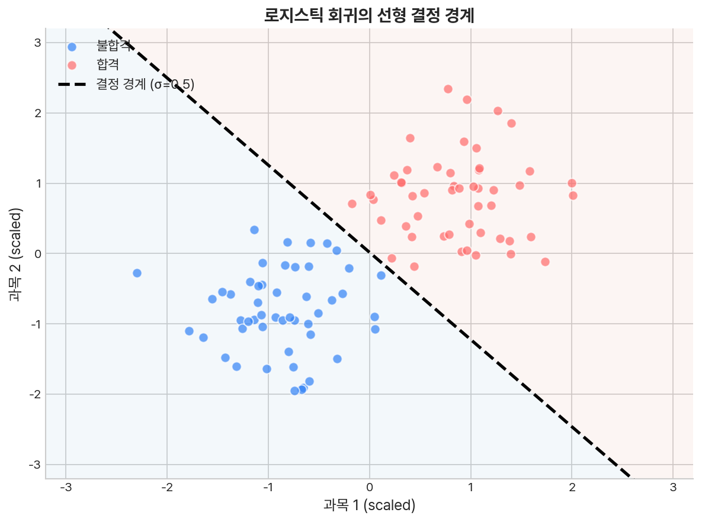
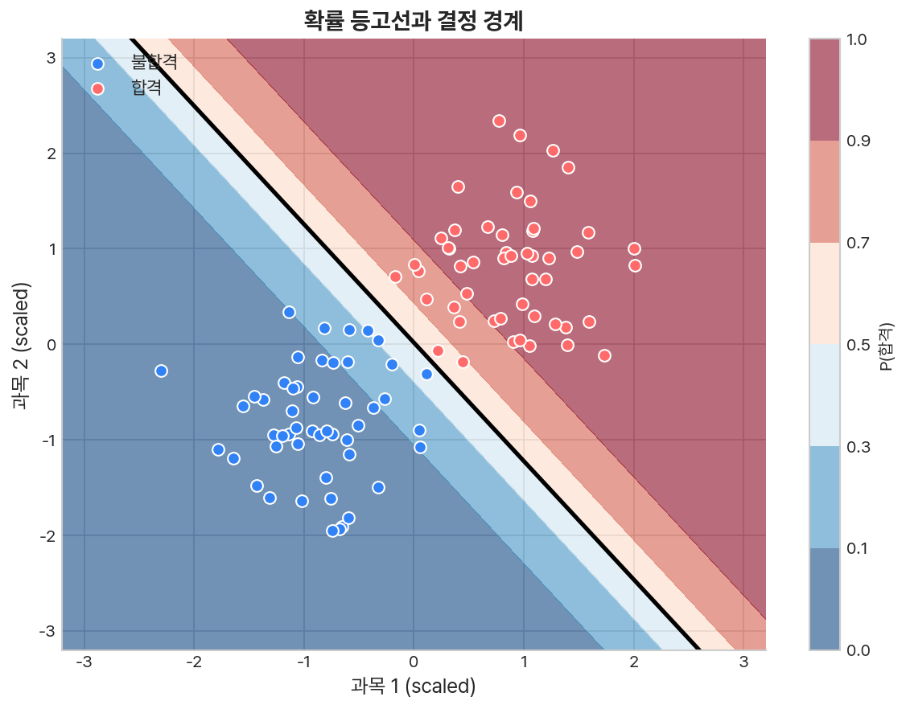
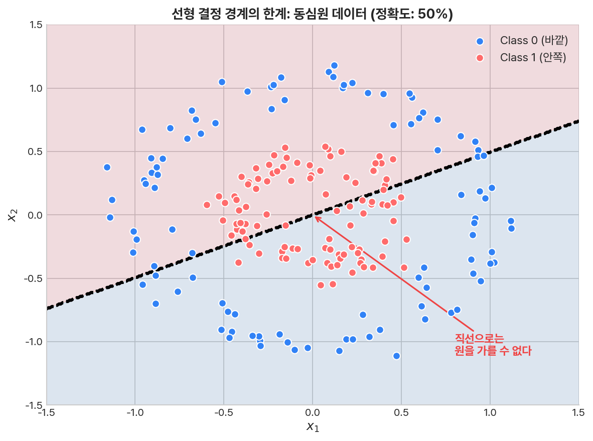
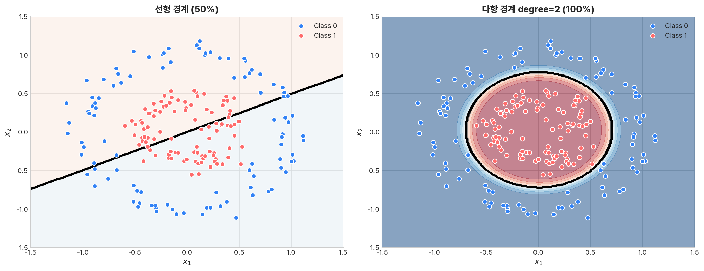
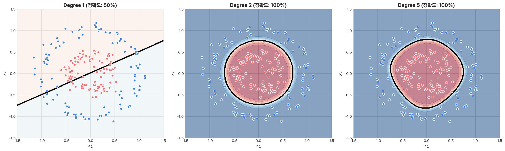
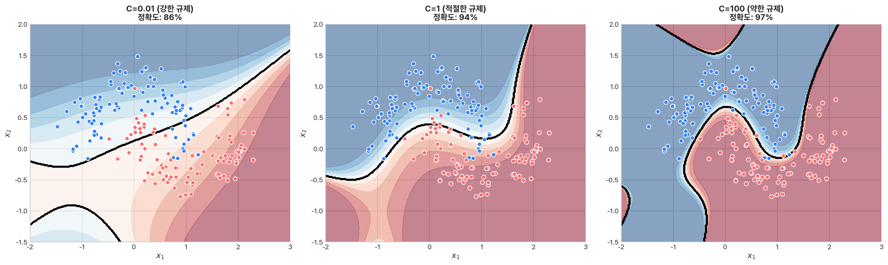
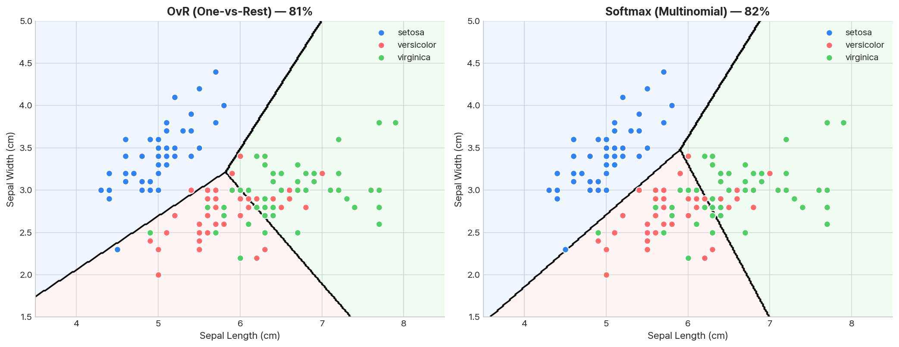
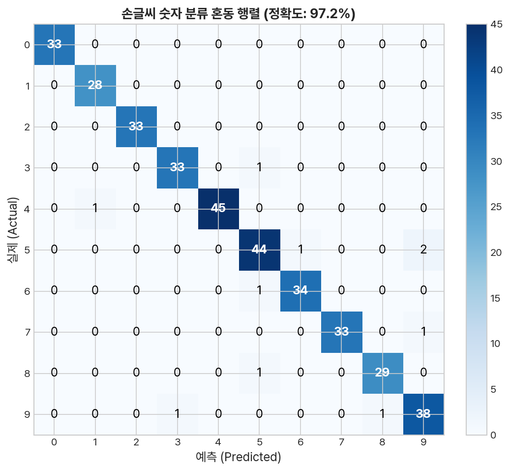
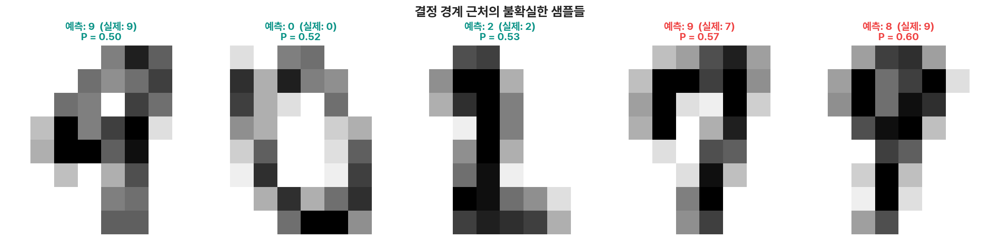

[이전 글](/ml/logistic-regression/)에서 로지스틱 회귀의 핵심을 배웠다. 시그모이드 함수로 확률을 출력하고, threshold 0.5를 기준으로 클래스를 나눈다. 그런데 한 가지 질문이 남았다 — 모델이 데이터를 **어디서** 가르는 걸까?

시그모이드의 출력이 정확히 0.5인 지점, 즉 `wx + b = 0`인 지점이 바로 **결정 경계(Decision Boundary)** 다. 이 경계 하나가 전체 입력 공간을 "클래스 0" 영역과 "클래스 1" 영역으로 나눈다. 결정 경계를 이해하면, 모델이 왜 그렇게 예측하는지, 어디에서 틀리는지, 어떻게 개선할 수 있는지가 보인다.

---

## 결정 경계란?

로지스틱 회귀의 예측 공식을 다시 보자.

```
h(x) = σ(w₁x₁ + w₂x₂ + b)
```

[비용 함수 글](/ml/cost-function/)에서 배운 것처럼, σ(z) = 0.5가 되는 지점은 z = 0일 때다. 즉:

```
w₁x₁ + w₂x₂ + b = 0
```

이 등식은 2차원 평면에서 **직선**이다. 직선의 한쪽은 z > 0 → σ(z) > 0.5 → 클래스 1, 반대쪽은 z < 0 → σ(z) < 0.5 → 클래스 0이 된다.

```
                     w₁x₁ + w₂x₂ + b = 0
                              │
        클래스 0 영역          │          클래스 1 영역
        σ(z) < 0.5            │          σ(z) > 0.5
                              │
```

변수가 3개면 결정 경계는 **평면**, n개면 **초평면(hyperplane)** 이 된다. 차원이 올라가도 원리는 같다 — `w·x + b = 0`인 점들의 집합이 결정 경계다.

---

## 선형 결정 경계 시각화

실제로 결정 경계가 어떻게 생기는지 보자. 시험 점수 두 과목으로 합격/불합격을 예측하는 예제다.

```python
import numpy as np
import matplotlib.pyplot as plt
from sklearn.linear_model import LogisticRegression
from sklearn.preprocessing import StandardScaler

# 시험 점수 데이터 (과목1, 과목2 → 합격 여부)
np.random.seed(42)
n = 100

# 불합격 그룹 (평균 40점)
X_fail = np.random.randn(n // 2, 2) * 10 + [40, 40]
# 합격 그룹 (평균 70점)
X_pass = np.random.randn(n // 2, 2) * 10 + [70, 65]

X = np.vstack([X_fail, X_pass])
y = np.array([0] * (n // 2) + [1] * (n // 2))

# 학습
scaler = StandardScaler()
X_scaled = scaler.fit_transform(X)
model = LogisticRegression()
model.fit(X_scaled, y)

print(f"w = {model.coef_[0].round(4)}")   # [2.5386, 2.0475]
print(f"b = {model.intercept_[0]:.4f}")    # -0.0341
print(f"정확도 = {model.score(X_scaled, y):.2%}")
```

```
w = [2.5386, 2.0475]
b = -0.0341
정확도 = 100.00%
```

### 결정 경계 그리기

결정 경계는 `w₁x₁ + w₂x₂ + b = 0`을 x₂에 대해 정리하면 된다.

```
x₂ = -(w₁x₁ + b) / w₂
```

```python
# 결정 경계 시각화
fig, ax = plt.subplots(figsize=(8, 6))

# 데이터 포인트
ax.scatter(X_scaled[y == 0, 0], X_scaled[y == 0, 1],
           c='#3182f6', label='불합격', alpha=0.7, edgecolors='white')
ax.scatter(X_scaled[y == 1, 0], X_scaled[y == 1, 1],
           c='#ff6b6b', label='합격', alpha=0.7, edgecolors='white')

# 결정 경계 직선
w1, w2 = model.coef_[0]
b = model.intercept_[0]
x1_range = np.linspace(-3, 3, 100)
x2_boundary = -(w1 * x1_range + b) / w2

ax.plot(x1_range, x2_boundary, 'k--', linewidth=2, label='결정 경계')
ax.set_xlabel('과목 1 (scaled)')
ax.set_ylabel('과목 2 (scaled)')
ax.legend()
ax.set_title('로지스틱 회귀의 선형 결정 경계')
plt.show()
```



직선 하나가 데이터를 깔끔하게 두 영역으로 나눈다. 이 직선이 바로 σ(z) = 0.5인 지점이다.

---

## 확률 등고선: 경계 너머의 정보

결정 경계는 0.5 threshold에 해당하는 **하나의 선**이지만, 실제로 모델은 모든 점에서 확률을 출력한다. 이 확률 분포를 등고선으로 그리면, 모델의 "확신 정도"가 보인다.

```python
fig, ax = plt.subplots(figsize=(8, 6))

# 격자 생성
xx, yy = np.meshgrid(np.linspace(-3, 3, 200), np.linspace(-3, 3, 200))
grid = np.c_[xx.ravel(), yy.ravel()]

# 확률 예측
probs = model.predict_proba(grid)[:, 1].reshape(xx.shape)

# 등고선 (확률 0.1, 0.3, 0.5, 0.7, 0.9)
contour = ax.contourf(xx, yy, probs, levels=[0, 0.1, 0.3, 0.5, 0.7, 0.9, 1.0],
                       cmap='RdBu_r', alpha=0.6)
plt.colorbar(contour, label='P(합격)')

# 결정 경계 (0.5 등고선)
ax.contour(xx, yy, probs, levels=[0.5], colors='black', linewidths=2)

# 데이터 포인트
ax.scatter(X_scaled[y == 0, 0], X_scaled[y == 0, 1],
           c='#3182f6', edgecolors='white', label='불합격')
ax.scatter(X_scaled[y == 1, 0], X_scaled[y == 1, 1],
           c='#ff6b6b', edgecolors='white', label='합격')

ax.set_xlabel('과목 1 (scaled)')
ax.set_ylabel('과목 2 (scaled)')
ax.set_title('확률 등고선과 결정 경계')
ax.legend()
plt.show()
```



경계에서 멀어질수록 확률이 0 또는 1에 가까워진다 — 모델이 더 확신한다. 경계 근처의 점들은 0.5 부근으로, 모델이 "잘 모르겠다"고 말하는 영역이다.

<div style="background: #f0f4ff; border-left: 4px solid #3182f6; padding: 16px 20px; margin: 20px 0; border-radius: 4px;">
  <strong>💡 확률 그래디언트의 방향</strong><br>
  확률이 변하는 방향은 가중치 벡터 <code>w = [w₁, w₂]</code>의 방향과 일치한다. 즉, 결정 경계에 <strong>수직인 방향</strong>으로 확률이 가장 빠르게 변한다. 가중치의 크기(||w||)가 클수록 경계 근처에서 확률이 급격하게 변한다 — 모델이 더 "날카로운" 결정을 내리는 것이다.
</div>

### 경계에서의 거리와 확률

한 점이 결정 경계에서 얼마나 떨어져 있는지가 확률을 결정한다. 수학적으로, 점 x에서 결정 경계까지의 **부호 있는 거리(signed distance)** 는:

```
d(x) = (w · x + b) / ||w||
```

이 거리가 클수록 시그모이드의 입력(z = w·x + b)이 크므로, [경사하강법 글](/ml/gradient-descent/)에서 본 것처럼 확률이 1에 가까워진다. 음수면 확률이 0에 가까워진다.

```python
# 특정 학생들의 결정 경계로부터의 거리와 확률
test_points = np.array([[-2, -2], [-0.5, -0.3], [0.1, 0.0], [1.0, 0.8], [2.5, 2.0]])
w_vec = model.coef_[0]
w_norm = np.linalg.norm(w_vec)

for point in test_points:
    z = w_vec @ point + model.intercept_[0]
    distance = z / w_norm
    prob = model.predict_proba(point.reshape(1, -1))[0, 1]
    print(f"점 {point} | 거리: {distance:+.2f} | 확률: {prob:.4f}")
```

```
점 [-2.  -2. ] | 거리: -2.82 | 확률: 0.0001
점 [-0.5 -0.3] | 거리: -0.59 | 확률: 0.1281
점 [0.1 0. ] | 거리: +0.07 | 확률: 0.5547
점 [1.  0.8] | 거리: +1.27 | 확률: 0.9844
점 [2.5 2. ] | 거리: +3.19 | 확률: 1.0000
```

거리 0 근처(결정 경계 위)에서 확률 ≈ 0.5, 거리가 양수/음수로 커질수록 1/0에 수렴한다.

---

## 선형 경계의 한계

직선으로 나눌 수 있는 데이터만 있는 건 아니다. 원형으로 분포된 데이터를 생각해보자.

```python
from sklearn.datasets import make_circles

# 동심원 데이터: 안쪽 원(클래스 1), 바깥 원(클래스 0)
X_circle, y_circle = make_circles(n_samples=200, noise=0.1, factor=0.4, random_state=42)

# 로지스틱 회귀 적용
model_linear = LogisticRegression()
model_linear.fit(X_circle, y_circle)
print(f"선형 모델 정확도: {model_linear.score(X_circle, y_circle):.2%}")
```

```
선형 모델 정확도: 50.50%
```

50% — 동전 던지기 수준이다. 직선으로는 동심원을 가를 수 없기 때문이다.



이런 데이터를 **선형 분리 불가능(linearly inseparable)** 하다고 한다. 결정 경계가 직선이라는 제약이 모델의 표현력을 제한하는 것이다.

---

## 다항 특성으로 비선형 경계 만들기

해결책은 의외로 간단하다 — **입력 특성을 변환**하면 된다.

x₁, x₂ 두 변수에 대해 제곱과 교차 항을 추가해보자.

```
[x₁, x₂] → [x₁, x₂, x₁², x₂², x₁x₂]
```

변환된 공간에서는 결정 경계가 여전히 "선형"이지만:

```
w₁x₁ + w₂x₂ + w₃x₁² + w₄x₂² + w₅x₁x₂ + b = 0
```

**원래 공간에서 보면 곡선**이 된다. 이게 핵심이다 — 모델 자체는 바꾸지 않고, 입력 데이터의 **표현(representation)** 을 바꿔서 비선형 경계를 만든다.

```python
from sklearn.preprocessing import PolynomialFeatures
from sklearn.pipeline import Pipeline

# degree=2: x₁, x₂ → 1, x₁, x₂, x₁², x₁x₂, x₂²
pipe_poly = Pipeline([
    ('poly', PolynomialFeatures(degree=2)),
    ('scaler', StandardScaler()),
    ('clf', LogisticRegression(C=10))
])

pipe_poly.fit(X_circle, y_circle)
print(f"다항 특성(degree=2) 정확도: {pipe_poly.score(X_circle, y_circle):.2%}")
```

```
다항 특성(degree=2) 정확도: 100.00%
```

50%에서 100%로. 같은 로지스틱 회귀인데, 입력 공간을 확장한 것만으로 성능이 극적으로 올랐다.

### 비선형 경계 시각화

```python
fig, axes = plt.subplots(1, 2, figsize=(14, 5))

for ax, (title, model, data) in zip(axes, [
    ('선형 경계 (50%)', model_linear, X_circle),
    ('다항 경계 degree=2 (100%)', pipe_poly, X_circle)
]):
    xx, yy = np.meshgrid(np.linspace(-1.5, 1.5, 300),
                          np.linspace(-1.5, 1.5, 300))
    grid = np.c_[xx.ravel(), yy.ravel()]
    Z = model.predict(grid).reshape(xx.shape)

    ax.contourf(xx, yy, Z, alpha=0.3, cmap='RdBu_r')
    ax.contour(xx, yy, Z, colors='black', linewidths=1.5)
    ax.scatter(data[y_circle == 0, 0], data[y_circle == 0, 1],
               c='#3182f6', edgecolors='white', label='Class 0')
    ax.scatter(data[y_circle == 1, 0], data[y_circle == 1, 1],
               c='#ff6b6b', edgecolors='white', label='Class 1')
    ax.set_title(title)
    ax.legend()

plt.tight_layout()
plt.show()
```



왼쪽의 직선은 데이터를 전혀 가르지 못하지만, 오른쪽의 원형 경계는 두 클래스를 깔끔하게 분리한다.

<div style="background: #f0f4ff; border-left: 4px solid #3182f6; padding: 16px 20px; margin: 20px 0; border-radius: 4px;">
  <strong>💡 왜 원이 나올까?</strong><br>
  2차 다항 특성에서 결정 경계는 <code>w₃x₁² + w₄x₂² + ... = 0</code> 형태다. w₃ ≈ w₄이고 나머지가 작으면, 이건 원의 방정식 <code>x₁² + x₂² = r²</code>과 같다. 동심원 데이터는 바로 이 구조이기 때문에 degree=2에서 완벽하게 분리된다.
</div>

### Degree에 따른 경계 변화

차수를 올리면 더 복잡한 경계를 만들 수 있다. 하지만 [규제 글](/ml/regularization/)에서 배운 것처럼, 복잡한 경계는 과적합의 위험이 있다.

```python
fig, axes = plt.subplots(1, 3, figsize=(18, 5))
degrees = [1, 2, 5]

for ax, deg in zip(axes, degrees):
    pipe = Pipeline([
        ('poly', PolynomialFeatures(degree=deg)),
        ('scaler', StandardScaler()),
        ('clf', LogisticRegression(C=10, max_iter=1000))
    ])
    pipe.fit(X_circle, y_circle)
    acc = pipe.score(X_circle, y_circle)

    xx, yy = np.meshgrid(np.linspace(-1.5, 1.5, 300),
                          np.linspace(-1.5, 1.5, 300))
    grid = np.c_[xx.ravel(), yy.ravel()]
    Z = pipe.predict(grid).reshape(xx.shape)

    ax.contourf(xx, yy, Z, alpha=0.3, cmap='RdBu_r')
    ax.contour(xx, yy, Z, colors='black', linewidths=1.5)
    ax.scatter(X_circle[y_circle == 0, 0], X_circle[y_circle == 0, 1],
               c='#3182f6', edgecolors='white')
    ax.scatter(X_circle[y_circle == 1, 0], X_circle[y_circle == 1, 1],
               c='#ff6b6b', edgecolors='white')
    ax.set_title(f'Degree {deg} (정확도: {acc:.0%})')

plt.tight_layout()
plt.show()
```



```
Degree 1: 직선 → 분리 불가
Degree 2: 원/타원 → 적절한 경계
Degree 5: 복잡한 곡선 → 데이터에 과하게 맞춤 (과적합 위험)
```

degree=2가 이 데이터에 가장 적합하다. degree=5는 훈련 정확도는 높지만, 경계가 데이터의 노이즈까지 따라가면서 울퉁불퉁해진다.

---

## 규제가 결정 경계에 미치는 영향

[이전 글](/ml/regularization/)에서 배운 규제를 결정 경계 관점에서 다시 보자. sklearn의 `LogisticRegression`에서 `C` 파라미터는 **규제 강도의 역수**다.

```
C가 크다 = 규제 약함 = 복잡한 경계 허용
C가 작다 = 규제 강함 = 단순한 경계 강제
```

```python
from sklearn.datasets import make_moons

# 초승달 데이터 (비선형 분리)
X_moon, y_moon = make_moons(n_samples=200, noise=0.2, random_state=42)

fig, axes = plt.subplots(1, 3, figsize=(18, 5))
C_values = [0.01, 1, 100]

for ax, C in zip(axes, C_values):
    pipe = Pipeline([
        ('poly', PolynomialFeatures(degree=4)),
        ('scaler', StandardScaler()),
        ('clf', LogisticRegression(C=C, max_iter=1000))
    ])
    pipe.fit(X_moon, y_moon)
    acc = pipe.score(X_moon, y_moon)

    xx, yy = np.meshgrid(np.linspace(-2, 3, 300),
                          np.linspace(-1.5, 2, 300))
    grid = np.c_[xx.ravel(), yy.ravel()]
    Z = pipe.predict(grid).reshape(xx.shape)

    ax.contourf(xx, yy, Z, alpha=0.3, cmap='RdBu_r')
    ax.contour(xx, yy, Z, colors='black', linewidths=1.5)
    ax.scatter(X_moon[y_moon == 0, 0], X_moon[y_moon == 0, 1],
               c='#3182f6', edgecolors='white')
    ax.scatter(X_moon[y_moon == 1, 0], X_moon[y_moon == 1, 1],
               c='#ff6b6b', edgecolors='white')
    ax.set_title(f'C={C} (정확도: {acc:.0%})')

plt.tight_layout()
plt.show()
```



- **C=0.01** (강한 규제): 거의 직선. 데이터를 충분히 분리하지 못함 → 과소적합
- **C=1** (적절한 규제): 부드러운 곡선. 전체 패턴을 잘 포착
- **C=100** (약한 규제): 경계가 꼬불꼬불. 노이즈까지 따라감 → 과적합

규제와 다항 차수 — 이 두 가지가 결정 경계의 복잡도를 조절하는 레버다.

---

## 다중 클래스 분류

지금까지는 0/1 두 클래스만 다뤘다. 하지만 현실에는 세 개 이상의 클래스가 흔하다.

- 손글씨 숫자 인식: 0~9 (10 클래스)
- 이미지 분류: 고양이, 개, 새, ... (N 클래스)
- 붓꽃 종 분류: setosa, versicolor, virginica (3 클래스)

### 방법 1: One-vs-Rest (OvR)

가장 직관적인 방법. K개 클래스가 있으면, **K개의 이진 분류기**를 따로 만든다.

```
분류기 1: "클래스 0 vs 나머지" → P(y=0|x)
분류기 2: "클래스 1 vs 나머지" → P(y=1|x)
분류기 3: "클래스 2 vs 나머지" → P(y=2|x)

최종 예측: 확률이 가장 높은 클래스
```

```python
from sklearn.datasets import load_iris
from sklearn.multiclass import OneVsRestClassifier

# 붓꽃 데이터 (4개 특성 → 3개 종)
iris = load_iris()
X_iris, y_iris = iris.data[:, :2], iris.target  # 시각화를 위해 2개 특성만

# OvR 방식: 명시적으로 OneVsRestClassifier 사용
model_ovr = OneVsRestClassifier(LogisticRegression(max_iter=1000))
model_ovr.fit(X_iris, y_iris)
print(f"OvR 정확도: {model_ovr.score(X_iris, y_iris):.2%}")
```

```
OvR 정확도: 80.67%
```

OvR은 구현이 간단하지만 한 가지 문제가 있다 — 각 분류기가 독립적으로 확률을 내기 때문에, K개의 확률 합이 1이 되지 않는다. 예를 들어 어떤 점이 "클래스 0일 확률 0.7, 클래스 1일 확률 0.6"이 될 수 있다.

### 방법 2: Softmax 회귀 (Multinomial)

더 자연스러운 방법은 **Softmax 함수**를 사용하는 것이다. K개 클래스 각각에 대해 점수(z)를 계산한 뒤, Softmax로 확률로 변환한다.

```
z₁ = w₁ · x + b₁     (클래스 0의 점수)
z₂ = w₂ · x + b₂     (클래스 1의 점수)
z₃ = w₃ · x + b₃     (클래스 2의 점수)

P(y=k|x) = e^zk / (e^z₁ + e^z₂ + e^z₃)
```

Softmax의 핵심 성질:

- 모든 출력이 0~1 사이
- **K개 확률의 합이 정확히 1** (시그모이드와의 차이)
- 가장 큰 z를 가진 클래스의 확률이 가장 높음

<div style="background: #f0f4ff; border-left: 4px solid #3182f6; padding: 16px 20px; margin: 20px 0; border-radius: 4px;">
  <strong>💡 Softmax와 Sigmoid의 관계</strong><br>
  K=2일 때 Softmax는 Sigmoid와 수학적으로 동치다. 클래스가 2개뿐이면 <code>P(y=1) = 1 - P(y=0)</code>이므로, Softmax의 두 출력 중 하나만 계산하면 된다 — 그게 바로 Sigmoid다. Softmax는 Sigmoid의 <strong>다중 클래스 일반화</strong>다.
</div>

### NumPy로 Softmax 구현

```python
def softmax(z):
    """수치적으로 안정한 Softmax"""
    z_shifted = z - np.max(z, axis=1, keepdims=True)  # 오버플로 방지
    exp_z = np.exp(z_shifted)
    return exp_z / np.sum(exp_z, axis=1, keepdims=True)

# 예시: 3개 샘플, 3개 클래스
z = np.array([
    [2.0, 1.0, 0.1],   # 클래스 0 점수가 가장 높음
    [0.5, 2.5, 0.3],   # 클래스 1 점수가 가장 높음
    [0.1, 0.3, 3.0],   # 클래스 2 점수가 가장 높음
])

probs = softmax(z)
for i, (scores, p) in enumerate(zip(z, probs)):
    print(f"샘플 {i}: z={scores} → P={np.round(p, 3)} (합={p.sum():.4f})")
```

```
샘플 0: z=[2.  1.  0.1] → P=[0.659 0.242 0.099] (합=1.0000)
샘플 1: z=[0.5 2.5 0.3] → P=[0.118 0.871 0.010] (합=1.0000)
샘플 2: z=[0.1 0.3 3.0] → P=[0.043 0.053 0.905] (합=1.0000)
```

확률의 합이 정확히 1이다. 가장 큰 점수를 가진 클래스의 확률이 가장 높고, 나머지 클래스의 확률은 자연스럽게 줄어든다.

<div style="background: #fff3f0; border-left: 4px solid #ff6b6b; padding: 16px 20px; margin: 20px 0; border-radius: 4px;">
  <strong>⚠️ z - max(z)를 빼는 이유</strong><br>
  <code>e^1000</code> 같은 큰 값은 float 오버플로를 일으킨다. z에서 최댓값을 빼면 <code>e^0</code> 이하가 되어 안전하다. 수학적으로 Softmax의 출력은 변하지 않는다 — 분자/분모에 같은 상수가 곱해지기 때문이다. 이건 실전에서 반드시 지켜야 할 구현 트릭이다.
</div>

### Softmax의 비용 함수: Cross-Entropy

이진 분류의 Log Loss를 K 클래스로 확장한 것이 **Categorical Cross-Entropy**다.

```
J = -(1/m) Σᵢ Σₖ yᵢₖ × log(P(y=k|xᵢ))
```

여기서 yᵢₖ는 원-핫 인코딩된 레이블이다 (정답 클래스만 1, 나머지 0). 결과적으로 **정답 클래스의 예측 확률에만 log를 취한다** — Log Loss와 같은 원리다.

```python
# 원-핫 인코딩
def one_hot(y, K):
    return np.eye(K)[y]

# Cross-Entropy Loss
def cross_entropy(y_true, probs):
    m = len(y_true)
    y_onehot = one_hot(y_true, probs.shape[1])
    return -np.mean(np.sum(y_onehot * np.log(probs + 1e-8), axis=1))

# 예시
y_true = np.array([0, 1, 2])
loss = cross_entropy(y_true, probs)
print(f"Cross-Entropy Loss: {loss:.4f}")
```

```
Cross-Entropy Loss: 0.2111
```

### 다중 클래스 결정 경계 시각화

```python
# Softmax(multinomial) 방식 — sklearn의 기본 LogisticRegression이 multinomial을 사용
model_softmax = LogisticRegression(max_iter=1000)
model_softmax.fit(X_iris, y_iris)

fig, axes = plt.subplots(1, 2, figsize=(14, 5))

for ax, (title, model) in zip(axes, [
    ('OvR (One-vs-Rest)', model_ovr),
    ('Softmax (Multinomial)', model_softmax)
]):
    xx, yy = np.meshgrid(np.linspace(3.5, 8.5, 300),
                          np.linspace(1.5, 5, 300))
    grid = np.c_[xx.ravel(), yy.ravel()]
    Z = model.predict(grid).reshape(xx.shape)

    ax.contourf(xx, yy, Z, alpha=0.3, cmap='viridis')
    ax.contour(xx, yy, Z, colors='black', linewidths=1)

    colors = ['#3182f6', '#ff6b6b', '#51cf66']
    for k, color in enumerate(colors):
        mask = y_iris == k
        ax.scatter(X_iris[mask, 0], X_iris[mask, 1],
                   c=color, edgecolors='white', label=iris.target_names[k])

    ax.set_xlabel('Sepal Length')
    ax.set_ylabel('Sepal Width')
    ax.set_title(title)
    ax.legend()

plt.tight_layout()
plt.show()
```



3개 클래스에 대한 결정 경계가 입력 공간을 3개 영역으로 나눈다. OvR과 Softmax 모두 선형 경계를 만들지만, Softmax가 경계 간의 관계를 더 자연스럽게 학습한다.

---

## 실전: 손글씨 숫자 분류

결정 경계의 힘을 제대로 느끼려면, 실제 다중 클래스 문제를 풀어봐야 한다. 8×8 픽셀 손글씨 숫자(0~9) 분류를 해보자.

```python
from sklearn.datasets import load_digits
from sklearn.model_selection import train_test_split
from sklearn.metrics import classification_report, confusion_matrix

# 손글씨 숫자 데이터 (8x8 = 64 특성, 10 클래스)
digits = load_digits()
X_digits, y_digits = digits.data, digits.target

# 학습/테스트 분리
X_train, X_test, y_train, y_test = train_test_split(
    X_digits, y_digits, test_size=0.2, random_state=42
)

# 파이프라인: 스케일링 → Softmax 로지스틱 회귀
pipe_digits = Pipeline([
    ('scaler', StandardScaler()),
    ('clf', LogisticRegression(max_iter=5000, C=1.0))
])

pipe_digits.fit(X_train, y_train)
y_pred = pipe_digits.predict(X_test)

print(f"테스트 정확도: {pipe_digits.score(X_test, y_test):.2%}")
print()
print(classification_report(y_test, y_pred))
```

```
테스트 정확도: 97.22%

              precision    recall  f1-score   support

           0       1.00      1.00      1.00        33
           1       0.97      1.00      0.98        28
           2       1.00      1.00      1.00        33
           3       0.97      0.97      0.97        34
           4       0.98      0.98      0.98        46
           5       0.94      0.94      0.94        47
           6       0.97      0.97      0.97        35
           7       0.97      0.97      0.97        34
           8       0.97      0.97      0.97        30
           9       0.93      0.95      0.94        40

    accuracy                           0.97       360
   macro avg       0.97      0.97      0.97       360
weighted avg       0.97      0.97      0.97       360
```

64개 특성(픽셀)과 10개 클래스. 로지스틱 회귀만으로 **97%** 정확도다. 결정 경계가 64차원 공간에서 10개 영역을 깔끔하게 나누고 있다는 뜻이다.

### 혼동 행렬로 경계 분석

```python
cm = confusion_matrix(y_test, y_pred)
fig, ax = plt.subplots(figsize=(8, 6))
im = ax.imshow(cm, cmap='Blues')
plt.colorbar(im)

for i in range(10):
    for j in range(10):
        color = 'white' if cm[i, j] > cm.max() / 2 else 'black'
        ax.text(j, i, cm[i, j], ha='center', va='center', color=color, fontsize=11)

ax.set_xlabel('예측')
ax.set_ylabel('실제')
ax.set_title('손글씨 숫자 분류 혼동 행렬')
ax.set_xticks(range(10))
ax.set_yticks(range(10))
plt.show()
```



대각선이 진하면 정확하다는 뜻이다. 5가 9로 혼동되는 사례(2건)가 눈에 띄는데, 필기체에서 5의 아래 곡선과 9의 둥근 부분이 비슷하게 보일 수 있기 때문이다. 이런 혼동 패턴은 결정 경계가 두 클래스 사이에서 미묘하게 흔들리는 영역을 알려준다.

### 예측 확률 분석

```python
# 가장 "헷갈리는" 샘플 찾기 — 최대 확률이 가장 낮은 것
probs_test = pipe_digits.predict_proba(X_test)
max_probs = probs_test.max(axis=1)
uncertain_idx = np.argsort(max_probs)[:5]  # 가장 불확실한 5개

fig, axes = plt.subplots(1, 5, figsize=(15, 3))
for ax, idx in zip(axes, uncertain_idx):
    ax.imshow(X_test[idx].reshape(8, 8), cmap='gray')
    pred = y_pred[idx]
    true = y_test[idx]
    prob = max_probs[idx]
    ax.set_title(f'예측:{pred} (실제:{true})\nP={prob:.2f}',
                fontsize=10, color='red' if pred != true else 'green')
    ax.axis('off')
plt.suptitle('결정 경계 근처의 불확실한 샘플들', fontsize=13)
plt.tight_layout()
plt.show()
```



결정 경계 근처에 있는 샘플들은 확률이 0.5~0.6 수준으로, 모델이 "아슬아슬하게" 판단한 것들이다. 사람이 봐도 헷갈리는 필기체가 대부분이다.

---

## 흔한 실수

### 1. 선형 분리 불가능한 데이터에 선형 모델을 고집한다

```python
# ❌ 동심원 데이터에 기본 로지스틱 회귀 적용 → 50%
model = LogisticRegression()
model.fit(X_circle, y_circle)  # 직선으로는 원을 가를 수 없다

# ✅ 다항 특성 추가 → 100%
pipe = Pipeline([
    ('poly', PolynomialFeatures(degree=2)),
    ('scaler', StandardScaler()),
    ('clf', LogisticRegression())
])
```

정확도가 낮으면 데이터를 시각화해보자. 클래스가 선형으로 분리 가능한지 눈으로 확인하는 게 첫 번째다. 비선형 패턴이 보이면 다항 특성이나 더 복잡한 모델(트리, SVM 등)을 고려한다.

### 2. Degree를 무작정 올린다

```python
# ❌ degree=10: 특성이 66개로 폭발 (C(12,2) = 66)
pipe = Pipeline([
    ('poly', PolynomialFeatures(degree=10)),  # 2 → 66개 특성
    ('clf', LogisticRegression())
])
```

degree=2이면 특성 2개 → 6개. degree=5이면 21개. **degree=10이면 66개**로 폭발한다. 특성 수가 데이터 수를 넘으면 과적합이 시작된다. 규제(C 조절)와 함께 사용하고, 교차 검증으로 적절한 degree를 찾는다.

```
특성 수 공식: C(n+d, d) = (n+d)! / (n! × d!)
n=2, d=2: 6개  |  n=2, d=5: 21개  |  n=2, d=10: 66개
n=10, d=2: 66개  |  n=10, d=3: 286개  |  n=10, d=5: 3003개
```

### 3. OvR과 Softmax의 차이를 무시한다

```python
# OvR: 각 분류기가 독립 → 확률 합 ≠ 1
from sklearn.multiclass import OneVsRestClassifier
model_ovr = OneVsRestClassifier(LogisticRegression())

# Softmax: 모든 클래스를 동시에 고려 → 확률 합 = 1 (sklearn 기본)
model_softmax = LogisticRegression()
```

sklearn의 `LogisticRegression`은 기본적으로 Softmax(multinomial)를 사용한다. OvR이 필요하면 `OneVsRestClassifier`로 감싸면 된다. 클래스 간 관계가 중요하면 Softmax를, 각 클래스가 완전히 독립이면 OvR을 선택한다.

<div style="background: #f8f9fa; border: 1px solid #e9ecef; padding: 20px; margin: 24px 0; border-radius: 8px;">
  <strong>📌 핵심 요약</strong><br><br>
  <ul style="margin: 0; padding-left: 20px;">
    <li><strong>결정 경계</strong>: <code>w·x + b = 0</code>인 점들의 집합. 입력 공간을 클래스별 영역으로 나눈다</li>
    <li><strong>선형 경계</strong>: 로지스틱 회귀의 기본. 직선(2D), 평면(3D), 초평면(nD)</li>
    <li><strong>비선형 경계</strong>: 다항 특성(PolynomialFeatures)으로 입력 공간을 확장 → 원래 공간에서 곡선</li>
    <li><strong>규제(C)</strong>: C가 크면 복잡한 경계(과적합 위험), 작으면 단순한 경계(과소적합 위험)</li>
    <li><strong>다중 클래스</strong>: OvR(K개 이진 분류기) vs Softmax(확률 합=1, 더 자연스러운 해석)</li>
    <li><strong>확률 등고선</strong>: 경계에서의 거리가 모델의 확신 정도를 결정한다</li>
  </ul>
</div>

---

## 마치며

결정 경계는 모델이 "어디서 마음을 바꾸는지"를 보여주는 선이다. 선형 모델은 직선 하나로 세상을 나누고, 다항 특성을 추가하면 곡선으로 더 복잡한 패턴을 잡아낸다. 다중 클래스로 확장하면 Softmax가 K개 영역을 확률적으로 나눈다.

여기까지가 로지스틱 회귀의 이야기다. 선형 모델은 해석이 쉽고 강력한 베이스라인이지만, 결국 결정 경계가 선형(또는 다항)이라는 제약이 있다. 다음 글에서는 이 제약에서 벗어나, 데이터를 **질문으로 쪼개며** 경계를 만드는 전혀 다른 접근법 — **결정 트리(Decision Tree)** 를 다룬다.

## 참고자료

- [Andrew Ng — Machine Learning Specialization: Classification (Coursera)](https://www.coursera.org/specializations/machine-learning-introduction)
- [Scikit-learn — LogisticRegression Documentation](https://scikit-learn.org/stable/modules/generated/sklearn.linear_model.LogisticRegression.html)
- [Scikit-learn — PolynomialFeatures Documentation](https://scikit-learn.org/stable/modules/generated/sklearn.preprocessing.PolynomialFeatures.html)
- [Stanford CS229 — Lecture Notes on Generalized Linear Models](https://cs229.stanford.edu/main_notes.pdf)
- [StatQuest: Logistic Regression Details (YouTube)](https://www.youtube.com/watch?v=vN5cNN2-HWE)
