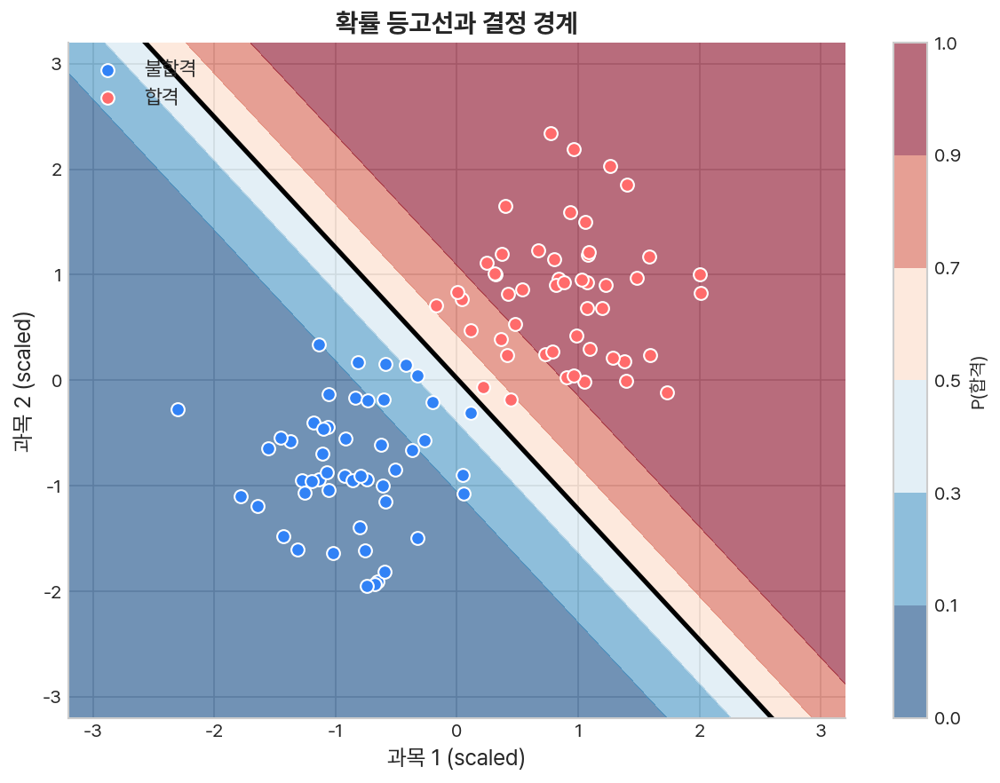
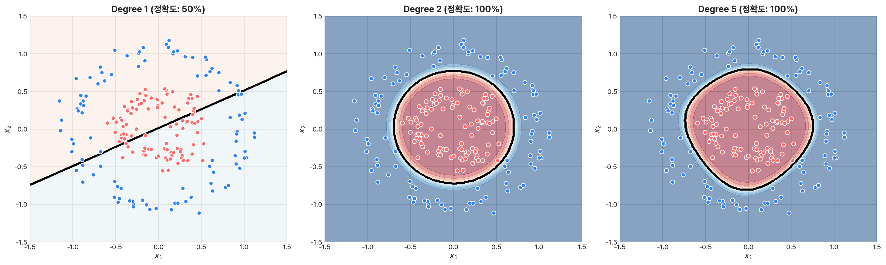
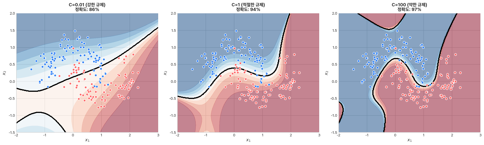
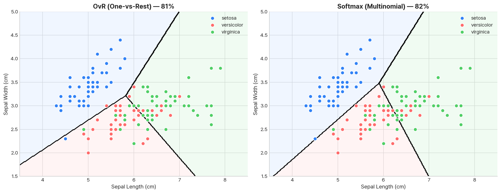

학습이 끝난 분류 모델은 입력 공간 어딘가에 선을 긋는다. 그 선의 한쪽은 클래스 0, 반대쪽은 클래스 1이다. 이 선을 **결정 경계(Decision Boundary)** 라고 한다.

경계의 모양을 알면 모델의 성질이 거의 다 보인다. 어떤 데이터를 못 가르는지, 어디서 틀리는지, 복잡도를 올렸을 때 무엇이 망가지는지가 전부 경계의 모양 문제로 돌아온다.

## 결정 경계는 어디에 생기나

로지스틱 회귀는 입력에 가중치를 곱해 더한 $z = w \cdot x + b$를 시그모이드에 넣어 확률을 낸다.

$$h(x) = \sigma(w \cdot x + b), \qquad \sigma(z) = \frac{1}{1 + e^{-z}}$$

$\sigma$가 정확히 0.5를 지나는 지점은 $z = 0$ 하나뿐이다. 따라서 0.5를 임계값으로 쓰는 한, 예측이 갈리는 자리는 다음 등식을 만족하는 점들이다.

$$w_1 x_1 + w_2 x_2 + b = 0$$

2차원 평면에서 이건 직선이다. 변수가 3개면 평면, $n$개면 초평면이 된다. 차원이 올라가도 식은 그대로다.

<div style="margin: 24px 0; text-align: center;">
<svg viewBox="0 0 400 280" style="width: 100%; height: auto; max-width: 380px;"
     xmlns="http://www.w3.org/2000/svg"
     font-family="Pretendard, -apple-system, sans-serif"
     role="img" aria-label="2차원 특성 공간에 찍힌 두 클래스의 점을 직선 하나가 가르는 그림. 직선 위에서 w와 x의 내적에 b를 더한 값이 0이 되고, 한쪽은 시그모이드 출력이 0.5보다 크며 반대쪽은 작다.">
<style>
.db1-plot { fill: var(--bg-subtle, #f5f4f2); stroke: var(--border, #e7e5e4); stroke-width: 1.2; }
.db1-line { stroke: var(--accent, #9d5604); stroke-width: 2.2; fill: none; }
.db1-c0 { fill: var(--text-muted, #6d6762); }
.db1-c1 { fill: var(--primary, #0a756c); }
.db1-t { fill: var(--text, #1c1917); font-size: 17px; font-weight: 600; }
.db1-n { fill: var(--text-muted, #6d6762); font-size: 14px; }
.db1-m { fill: var(--text-muted, #6d6762); font-size: 15px; font-weight: 600; }
.db1-p { fill: var(--primary, #0a756c); font-size: 15px; font-weight: 600; }
.db1-pn { fill: var(--primary, #0a756c); font-size: 14px; }
.db1-a { fill: var(--accent, #9d5604); font-size: 14px; font-weight: 600; }
</style>
<text class="db1-t" x="200" y="24" text-anchor="middle">2차원에서의 결정 경계</text>
<rect class="db1-plot" x="50" y="40" width="310" height="210" rx="6"/>
<!-- 클래스 0: 원 -->
<circle class="db1-c0" cx="80" cy="160" r="5.5"/>
<circle class="db1-c0" cx="100" cy="190" r="5.5"/>
<circle class="db1-c0" cx="132" cy="214" r="5.5"/>
<circle class="db1-c0" cx="78" cy="196" r="5.5"/>
<circle class="db1-c0" cx="140" cy="190" r="5.5"/>
<circle class="db1-c0" cx="115" cy="166" r="5.5"/>
<circle class="db1-c0" cx="152" cy="224" r="5.5"/>
<!-- 클래스 1: 사각형 -->
<rect class="db1-c1" x="224.5" y="79.5" width="11" height="11"/>
<rect class="db1-c1" x="249.5" y="104.5" width="11" height="11"/>
<rect class="db1-c1" x="279.5" y="89.5" width="11" height="11"/>
<rect class="db1-c1" x="294.5" y="126.5" width="11" height="11"/>
<rect class="db1-c1" x="264.5" y="134.5" width="11" height="11"/>
<rect class="db1-c1" x="314.5" y="99.5" width="11" height="11"/>
<rect class="db1-c1" x="232.5" y="119.5" width="11" height="11"/>
<!-- 결정 경계 -->
<path class="db1-line" d="M 75 60 L 335 230"/>
<text class="db1-a" x="330" y="244" text-anchor="end">w &#183; x + b = 0</text>
<!-- 양쪽 영역 -->
<text class="db1-m" x="62" y="226" text-anchor="start">클래스 0</text>
<text class="db1-n" x="62" y="243" text-anchor="start">&#963;(z) &lt; 0.5</text>
<text class="db1-p" x="348" y="62" text-anchor="end">클래스 1</text>
<text class="db1-pn" x="348" y="79" text-anchor="end">&#963;(z) &#8805; 0.5</text>
<!-- 축 이름 -->
<text class="db1-n" x="205" y="268" text-anchor="middle">특성 1</text>
<text class="db1-n" x="30" y="145" text-anchor="middle" transform="rotate(-90 30 145)">특성 2</text>
</svg>
</div>

가중치 벡터 $w$는 이 경계의 법선이다. 경계는 언제나 $w$에 수직이고, $b$는 경계를 원점에서 얼마나 밀어낼지를 정한다. 학습이란 결국 이 직선의 방향과 위치를 옮기는 일이다.

두 과목 점수로 합격을 예측하는 데이터에 실제로 맞춰보면 이렇다.

```python
import numpy as np
from sklearn.linear_model import LogisticRegression
from sklearn.preprocessing import StandardScaler

np.random.seed(42)
X = np.vstack([np.random.randn(50, 2) * 10 + [40, 40],    # 불합격 그룹
               np.random.randn(50, 2) * 10 + [70, 65]])   # 합격 그룹
y = np.array([0] * 50 + [1] * 50)

X_scaled = StandardScaler().fit_transform(X)
model = LogisticRegression().fit(X_scaled, y)

print(model.coef_[0], model.intercept_[0])   # [2.5386 2.0475] -0.0341
```

경계를 그림으로 옮길 때는 $w_1x_1 + w_2x_2 + b = 0$을 $x_2$에 대해 풀어 $x_2 = -(w_1x_1 + b) / w_2$ 직선을 그리면 된다. 두 가중치가 비슷하니 기울기가 약 $-1.24$인, 두 과목을 거의 같은 비중으로 합산하는 경계가 나온다.

## 경계에서 멀어질수록 확신이 커진다

결정 경계는 확률 0.5에 해당하는 선 하나지만, 모델은 공간의 모든 점에서 확률을 낸다.



경계에서 멀어질수록 확률이 0이나 1에 붙는다. 얼마나 빨리 붙는지는 가중치 벡터의 크기가 정한다. 점 $x$에서 경계까지의 부호 있는 거리는

$$d(x) = \frac{w \cdot x + b}{\lVert w \rVert}$$

이고, 시그모이드에 들어가는 값은 $z = \lVert w \rVert \cdot d(x)$다. 거리가 같아도 $\lVert w \rVert$가 크면 확률이 훨씬 가파르게 변한다. 뒤에 나올 규제가 결정 경계를 부드럽게 만드는 것도 여기서 나온다. 가중치의 크기를 누르면 경계의 위치가 그대로여도 경계 근처의 확률 변화가 완만해진다.

앞의 모델로 몇 개 점을 찍어보면 거리와 확률이 정확히 시그모이드 관계로 붙어 있다.

| 점 | 경계까지의 거리 | P(합격) |
|---|---|---|
| (-2.0, -2.0) | -2.82 | 0.0001 |
| (-0.5, -0.3) | -0.59 | 0.1281 |
| (0.1, 0.0) | +0.07 | 0.5547 |
| (1.0, 0.8) | +1.27 | 0.9844 |
| (2.5, 2.0) | +3.19 | 1.0000 |

거리의 부호가 곧 예측 클래스이고, 거리 0 근처에서 확률이 0.5다. 경계 바로 옆의 점은 모델이 잘 모르겠다고 말하는 점이다.

## 직선으로 못 가르는 데이터

안쪽 원과 바깥 고리로 나뉜 데이터를 생각해보자.

```python
from sklearn.datasets import make_circles

X_circle, y_circle = make_circles(n_samples=200, noise=0.1, factor=0.4, random_state=42)
print(LogisticRegression().fit(X_circle, y_circle).score(X_circle, y_circle))   # 0.505
```

50.5%, 동전 던지기다. 어느 방향으로 직선을 그어도 양쪽에 두 클래스가 섞여 들어가니 당연한 결과다. 이런 데이터를 **선형 분리 불가능(linearly inseparable)** 하다고 한다.

문제는 데이터가 어렵다는 게 아니라 모델이 그을 수 있는 선의 모양이 하나뿐이라는 것이다. $w \cdot x + b = 0$은 무엇을 대입해도 평평하다.

## 다항 특성이 직선을 곡선으로 바꾼다

모델을 바꾸는 대신 입력을 바꾼다. 두 변수에 제곱 항과 교차 항을 더해 다섯 개로 늘려보자.

$$[\,x_1,\; x_2\,] \quad \longrightarrow \quad [\,x_1,\; x_2,\; x_1^2,\; x_2^2,\; x_1 x_2\,]$$

로지스틱 회귀는 이 확장된 5차원 공간에서 여전히 평평한 경계를 긋는다.

$$w_1x_1 + w_2x_2 + w_3x_1^2 + w_4x_2^2 + w_5x_1x_2 + b = 0$$

그런데 같은 식을 원래의 $(x_1, x_2)$ 평면에서 보면 2차 곡선이다. $w_3 \approx w_4$이고 나머지 항이 작으면 $x_1^2 + x_2^2 = r^2$, 곧 원의 방정식이 된다. 동심원 데이터가 정확히 그 구조라서 2차에서 완전히 갈린다.

<div style="margin: 24px 0; text-align: center;">
<svg viewBox="0 0 400 604" style="width: 100%; height: auto; max-width: 380px;"
     xmlns="http://www.w3.org/2000/svg"
     font-family="Pretendard, -apple-system, sans-serif"
     role="img" aria-label="위 패널은 동심원 데이터에 그은 직선 경계가 두 클래스를 가르지 못해 정확도가 50.5퍼센트에 머무는 모습이고, 아래 패널은 제곱 항을 특성에 추가해 얻은 원형 경계가 두 클래스를 완전히 분리하는 모습이다.">
<style>
.db2-plot { fill: var(--bg-subtle, #f5f4f2); stroke: var(--border, #e7e5e4); stroke-width: 1.2; }
.db2-fail { stroke: var(--accent, #9d5604); stroke-width: 2.2; fill: none; stroke-dasharray: 6 4; }
.db2-ok { stroke: var(--accent, #9d5604); stroke-width: 2.4; fill: none; }
.db2-c0 { fill: var(--text-muted, #6d6762); }
.db2-c1 { fill: var(--primary, #0a756c); }
.db2-t { fill: var(--text, #1c1917); font-size: 16px; font-weight: 600; }
.db2-n { fill: var(--text-muted, #6d6762); font-size: 14px; }
.db2-a { fill: var(--accent, #9d5604); font-size: 15px; font-weight: 600; }
.db2-bad { fill: var(--text-danger, #cb2121); font-size: 14px; font-weight: 600; }
.db2-good { fill: var(--text-success, #107836); font-size: 14px; font-weight: 600; }
.db2-x { stroke: var(--text-danger, #cb2121); stroke-width: 2.2; fill: none; }
.db2-v { stroke: var(--text-success, #107836); stroke-width: 2.4; fill: none; }
</style>
<!-- 위 패널: 원래 특성 -->
<text class="db2-t" x="200" y="24" text-anchor="middle">위 &#183; 원래 특성 2개</text>
<rect class="db2-plot" x="100" y="38" width="200" height="200" rx="6"/>
<circle class="db2-c0" cx="278" cy="138" r="5.5"/>
<circle class="db2-c0" cx="267.5" cy="99" r="5.5"/>
<circle class="db2-c0" cx="239" cy="70.4" r="5.5"/>
<circle class="db2-c0" cx="200" cy="60" r="5.5"/>
<circle class="db2-c0" cx="161" cy="70.4" r="5.5"/>
<circle class="db2-c0" cx="132.5" cy="99" r="5.5"/>
<circle class="db2-c0" cx="122" cy="138" r="5.5"/>
<circle class="db2-c0" cx="132.5" cy="177" r="5.5"/>
<circle class="db2-c0" cx="161" cy="205.6" r="5.5"/>
<circle class="db2-c0" cx="200" cy="216" r="5.5"/>
<circle class="db2-c0" cx="239" cy="205.6" r="5.5"/>
<circle class="db2-c0" cx="267.5" cy="177" r="5.5"/>
<rect class="db2-c1" x="222.5" y="132.5" width="11" height="11"/>
<rect class="db2-c1" x="208.5" y="108.3" width="11" height="11"/>
<rect class="db2-c1" x="180.5" y="108.3" width="11" height="11"/>
<rect class="db2-c1" x="166.5" y="132.5" width="11" height="11"/>
<rect class="db2-c1" x="180.5" y="156.7" width="11" height="11"/>
<rect class="db2-c1" x="208.5" y="156.7" width="11" height="11"/>
<rect class="db2-c1" x="194.5" y="132.5" width="11" height="11"/>
<path class="db2-fail" d="M 108 196 L 292 80"/>
<text class="db2-a" x="200" y="258" text-anchor="middle">w &#183; x + b = 0</text>
<path class="db2-x" d="M 143 269 L 153 279 M 153 269 L 143 279"/>
<text class="db2-bad" x="206" y="278" text-anchor="middle">정확도 50.5%</text>
<!-- 아래 패널: 제곱 항 추가 -->
<text class="db2-t" x="200" y="310" text-anchor="middle">아래 &#183; 제곱 항 추가</text>
<rect class="db2-plot" x="100" y="324" width="200" height="200" rx="6"/>
<circle class="db2-c0" cx="278" cy="424" r="5.5"/>
<circle class="db2-c0" cx="267.5" cy="385" r="5.5"/>
<circle class="db2-c0" cx="239" cy="356.4" r="5.5"/>
<circle class="db2-c0" cx="200" cy="346" r="5.5"/>
<circle class="db2-c0" cx="161" cy="356.4" r="5.5"/>
<circle class="db2-c0" cx="132.5" cy="385" r="5.5"/>
<circle class="db2-c0" cx="122" cy="424" r="5.5"/>
<circle class="db2-c0" cx="132.5" cy="463" r="5.5"/>
<circle class="db2-c0" cx="161" cy="491.6" r="5.5"/>
<circle class="db2-c0" cx="200" cy="502" r="5.5"/>
<circle class="db2-c0" cx="239" cy="491.6" r="5.5"/>
<circle class="db2-c0" cx="267.5" cy="463" r="5.5"/>
<rect class="db2-c1" x="222.5" y="418.5" width="11" height="11"/>
<rect class="db2-c1" x="208.5" y="394.3" width="11" height="11"/>
<rect class="db2-c1" x="180.5" y="394.3" width="11" height="11"/>
<rect class="db2-c1" x="166.5" y="418.5" width="11" height="11"/>
<rect class="db2-c1" x="180.5" y="442.7" width="11" height="11"/>
<rect class="db2-c1" x="208.5" y="442.7" width="11" height="11"/>
<rect class="db2-c1" x="194.5" y="418.5" width="11" height="11"/>
<circle class="db2-ok" cx="200" cy="424" r="53"/>
<text class="db2-a" x="200" y="544" text-anchor="middle">제곱 항 포함 &#8594; 원형 경계</text>
<path class="db2-v" d="M 140 564 L 146 570 L 156 556"/>
<text class="db2-good" x="206" y="564" text-anchor="middle">정확도 100%</text>
<!-- 범례 -->
<circle class="db2-c0" cx="112" cy="588" r="5.5"/>
<text class="db2-n" x="124" y="593" text-anchor="start">클래스 0</text>
<rect class="db2-c1" x="212" y="582.5" width="11" height="11"/>
<text class="db2-n" x="231" y="593" text-anchor="start">클래스 1</text>
</svg>
</div>

`PolynomialFeatures`가 이 확장을 대신 해준다.

```python
from sklearn.preprocessing import PolynomialFeatures
from sklearn.pipeline import Pipeline

pipe = Pipeline([
    ('poly', PolynomialFeatures(degree=2)),   # 1, x1, x2, x1^2, x1x2, x2^2
    ('scaler', StandardScaler()),
    ('clf', LogisticRegression(C=10)),
])
pipe.fit(X_circle, y_circle)
print(pipe.score(X_circle, y_circle))   # 1.0
```

50.5%에서 100%로 올랐는데 모델은 한 글자도 바뀌지 않았다. 바뀐 건 입력의 표현뿐이다. 커널 SVM이나 신경망의 은닉층이 하는 일도 결국 같은 종류다. 원래 공간에서 선형으로 안 풀리는 문제를 선형으로 풀리는 공간으로 옮긴다.

## 경계의 복잡도를 조절하는 두 레버

경계를 얼마나 구불거리게 할지는 두 손잡이가 정한다. 다항 차수는 경계가 취할 수 있는 모양의 범위를 넓히고, 규제 강도는 그 범위 안에서 실제로 얼마나 휠지를 억누른다. sklearn에서 `LogisticRegression(C=...)`의 `C`는 규제 강도의 역수라 C가 크면 규제가 약하다.

| 손잡이 | 값 | 경계 모양 | 훈련 정확도 |
|---|---|---|---|
| degree (동심원 데이터) | 1 | 직선 | 50.5% |
| | 2 | 원 | 100% |
| | 5 | 울퉁불퉁한 폐곡선 | 100% |
| C (초승달 데이터, degree=4) | 0.01 | 거의 직선 | 85.5% |
| | 1 | 부드러운 곡선 | 93.5% |
| | 100 | 노이즈까지 따라가는 곡선 | 97.0% |





두 손잡이의 방향은 반대지만 그림에서 나오는 결과는 같다. 복잡도를 올리면 경계가 표본 하나하나의 위치를 따라가기 시작한다.

:::warning

**훈련 정확도로 이 두 값을 고르면 안 된다**

표의 마지막 열은 복잡도를 올리는 쪽으로 단조롭게 좋아진다. degree 2와 degree 5는 훈련에서 둘 다 100%지만 5쪽 경계는 표본 몇 개의 배치에 맞춰 휘어 있어서 새 데이터에서 더 자주 틀린다. C=100이 97%로 가장 높은 것도 같은 이유다. degree와 C는 교차 검증 점수로 골라야 한다.

:::

## 클래스가 셋 이상일 때

붓꽃 종 분류나 손글씨 숫자 인식처럼 클래스가 K개인 문제로 넘어가는 방법은 두 가지다.

| | One-vs-Rest | Softmax (Multinomial) |
|---|---|---|
| 구조 | K개의 이진 분류기를 따로 학습 | 한 모델이 K개 점수를 동시에 출력 |
| 확률의 합 | 1이 아님 | 정확히 1 |
| 학습 | 각 분류기가 서로를 모름 | 클래스끼리 경쟁하며 함께 학습 |
| sklearn | `OneVsRestClassifier`로 감싼다 | `LogisticRegression` 기본 동작 |

One-vs-Rest는 "클래스 0 대 나머지", "클래스 1 대 나머지" 식으로 K개의 이진 분류기를 만들고 확률이 가장 높은 클래스를 고른다. 구현은 단순하지만 각 분류기가 독립이라 어떤 점에서 "클래스 0일 확률 0.7, 클래스 1일 확률 0.6"이 동시에 나올 수 있다.

Softmax는 K개 점수를 한꺼번에 정규화한다.

$$P(y = k \mid x) = \frac{e^{z_k}}{\sum_{j=1}^{K} e^{z_j}}, \qquad z_k = w_k \cdot x + b_k$$

:::note

**Softmax와 시그모이드의 관계**

$K = 2$를 넣고 정리하면 $P(y=1 \mid x) = \sigma(z_1 - z_0)$가 되어 시그모이드로 돌아온다. Softmax는 시그모이드의 다중 클래스 일반화이고, 반대로 시그모이드는 클래스가 둘일 때 계산을 한 번으로 줄인 특수한 경우다.

:::

직접 구현할 때 반드시 지켜야 할 줄이 하나 있다.

```python
def softmax(z):
    z = z - np.max(z, axis=1, keepdims=True)   # 오버플로 방지
    e = np.exp(z)
    return e / e.sum(axis=1, keepdims=True)
```

:::tip

**최댓값을 빼는 이유**

$z$에 1000 같은 값이 들어오면 `np.exp`가 float 범위를 넘겨 `inf`를 반환하고, `inf / inf`가 되어 결과 전체가 `nan`으로 무너진다. 최댓값을 빼면 지수가 0 이하로 눌려 안전해진다. 분자와 분모에 같은 상수가 곱해지는 것이라 출력값은 변하지 않는다.

:::

비용 함수는 로그 손실을 K개 클래스로 늘린 Categorical Cross-Entropy다.

$$J = -\frac{1}{m}\sum_{i=1}^{m}\sum_{k=1}^{K} y_{ik} \log P(y = k \mid x_i)$$

$y_{ik}$가 원-핫 레이블이라 안쪽 합에서 정답 클래스의 항 하나만 살아남는다. 이진 분류의 로그 손실과 정확히 같은 원리다.



붓꽃 데이터의 꽃받침 길이와 너비 두 특성만 쓰면 One-vs-Rest가 80.7%, Softmax가 82.0%다. 둘 다 직선 경계를 긋지만 Softmax는 세 클래스의 점수를 한 번에 정규화하므로 경계들이 서로를 고려하며 자리를 잡는다. 한 샘플에 정답이 하나뿐인 상호 배타적 문제라면 Softmax가 기본 선택이고, 한 샘플에 여러 레이블이 동시에 붙을 수 있는 다중 레이블 문제에서는 각 분류기가 독립인 One-vs-Rest 구조가 맞다.

## 흔한 실수

### 정확도가 낮으면 모델부터 바꾼다

동심원 데이터에서 50%가 나왔을 때 필요한 건 더 무거운 모델이 아니라 산점도 한 장이다. 클래스가 선형으로 갈리는 모양인지 눈으로 확인하는 게 먼저고, 곡선이 필요해 보이면 특성 확장이 가장 싼 처방이다.

```python
# 직선으로는 원을 가를 수 없다
LogisticRegression().fit(X_circle, y_circle)                       # 50.5%

# 모델은 그대로, 입력만 바꾼다
Pipeline([('poly', PolynomialFeatures(degree=2)),
          ('scaler', StandardScaler()),
          ('clf', LogisticRegression())]).fit(X_circle, y_circle)  # 100%
```

### degree를 무작정 올린다

다항 특성의 개수는 $\binom{n+d}{d}$로 늘어난다. 원래 변수가 조금만 많아도 폭발한다.

| 원래 특성 수 | degree 2 | degree 3 | degree 5 | degree 10 |
|---|---|---|---|---|
| 2개 | 6 | 10 | 21 | 66 |
| 10개 | 66 | 286 | 3,003 | 184,756 |

특성 수가 표본 수에 가까워지면 모델이 훈련 데이터를 사실상 외울 수 있게 되고, 경계는 표본의 배치에 완전히 종속된다. degree는 규제와 짝으로 움직여야 하고 값은 교차 검증으로 고른다.

## 마치며

결정 경계는 모델이 마음을 바꾸는 자리다. 로지스틱 회귀에서 그 자리는 언제나 $w \cdot x + b = 0$이고, 이 식은 몇 차원에서 보든 평평하다. 아무리 오래 학습시켜도 이 사실은 바뀌지 않는다.

그래서 곡선 경계를 얻는 길은 모델을 손보는 쪽이 아니라 입력을 손보는 쪽으로 열린다. 제곱 항을 더하면 확장된 공간에서는 여전히 평평한 경계가 원래 공간에서 원으로 보인다. 이 발상은 로지스틱 회귀에서 멈추지 않는다. 커널 SVM은 특성을 명시적으로 만들지 않고 내적만으로 같은 일을 하고, 신경망은 어떤 특성을 만들지를 학습으로 찾는다.

대신 대가가 따라온다. 경계를 구불거리게 만들 수 있게 되는 순간 훈련 데이터에 지나치게 맞출 수도 있게 된다. 다항 차수와 규제가 그 정도를 조절하는 손잡이인데, 다음은 그중 규제가 가중치의 크기를 어떻게 억누르는지다.

## 함께 보면 좋은 글

- [로지스틱 회귀](/ml/logistic-regression/) : 결정 경계가 왜 확률 0.5 자리에 생기는지
- [규제](/ml/regularization/) : 경계의 구불거림을 가중치 크기로 억누르는 방법
- [편향-분산 트레이드오프](/ml/bias-variance/) : 복잡도를 올릴 때 무엇이 좋아지고 무엇이 나빠지는지
- [SVM](/ml/svm/) : 특성을 직접 만들지 않고 커널로 비선형 경계를 얻는 방법

## 참고자료

- [Andrew Ng, Machine Learning Specialization: Classification (Coursera)](https://www.coursera.org/specializations/machine-learning-introduction)
- [Scikit-learn, PolynomialFeatures Documentation](https://scikit-learn.org/stable/modules/generated/sklearn.preprocessing.PolynomialFeatures.html)
- [Stanford CS229, Lecture Notes on Generalized Linear Models](https://cs229.stanford.edu/main_notes.pdf)
