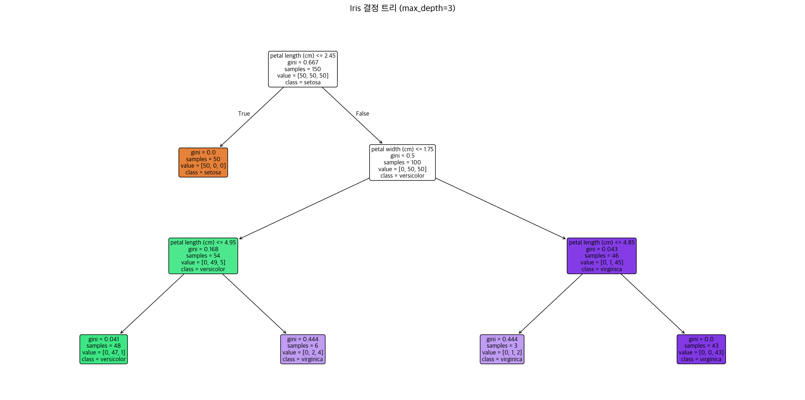
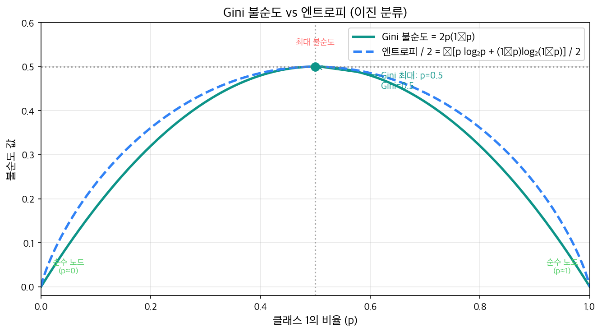
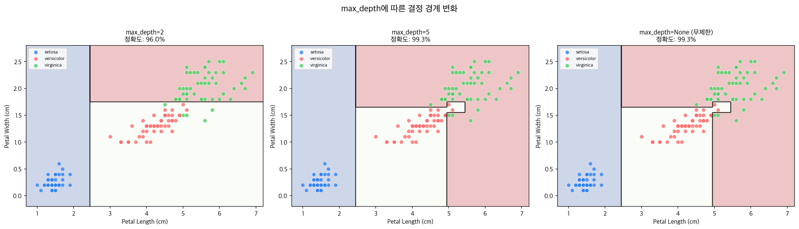
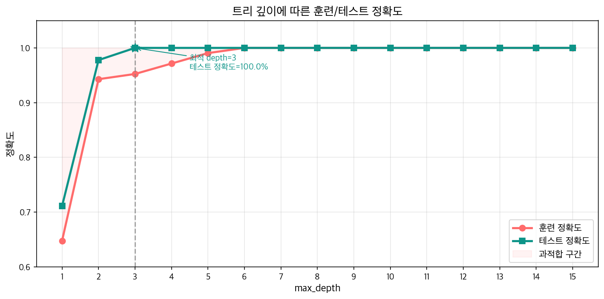
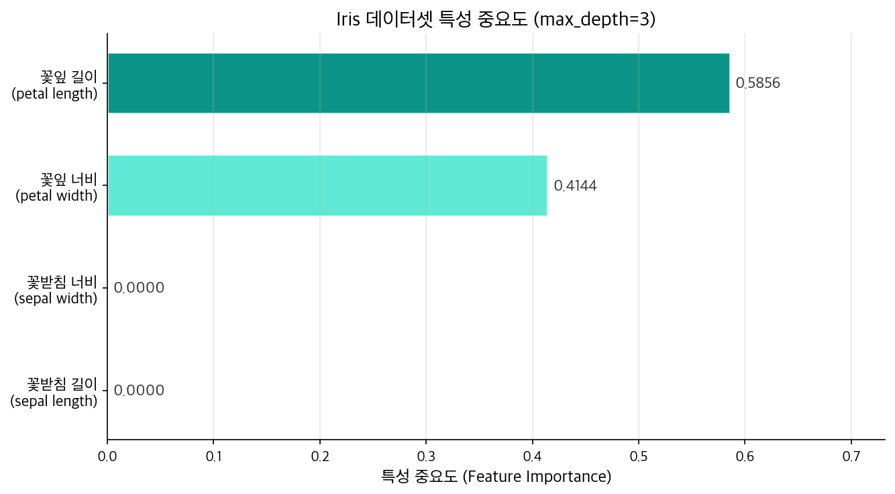

[이전 글](/ml/bias-variance/)에서 모델의 에러를 편향(Bias)과 분산(Variance)으로 분해했다. 편향이 높으면 과소적합, 분산이 높으면 과적합 — 이 트레이드오프가 모든 모델 선택의 근간이다. 지금까지 배운 선형 모델은 `w·x + b = 0`이라는 **직선 하나**로 세상을 나눈다. 다항 특성을 추가하면 곡선도 만들 수 있지만, 결국 수식이 경계를 결정한다는 구조는 바뀌지 않는다.

결정 트리는 완전히 다른 방식으로 접근한다. 수식 대신 **질문**을 사용한다.

```
"꽃잎 길이가 2.5cm 이하인가?"
  → Yes: setosa
  → No: "꽃잎 너비가 1.8cm 이하인가?"
         → Yes: versicolor
         → No: virginica
```

사람이 의사결정을 내리는 방식과 같다. 단계적으로 질문을 던져서 점점 범위를 좁혀나간다. 이 글에서는 결정 트리가 어떻게 최적의 질문을 선택하는지, 과적합은 어떻게 막는지, 시각화와 코드로 완전히 이해한다.

---

## 결정 트리란?

결정 트리(Decision Tree)는 데이터를 **트리(tree) 구조의 질문들**로 반복적으로 쪼개어 분류 또는 예측을 수행하는 알고리즘이다.

```
                    [루트 노드: Root Node]
                    꽃잎 길이 ≤ 2.5?
                    Gini=0.667, n=150
                   /                 \
          Yes /                       \ No
             /                         \
    [내부 노드: Internal Node]    [내부 노드: Internal Node]
       setosa (순수)               꽃잎 너비 ≤ 1.8?
       Gini=0.0, n=50              Gini=0.5, n=100
                                  /             \
                           Yes /                 \ No
                              /                   \
                    [리프 노드: Leaf Node]    [리프 노드: Leaf Node]
                       versicolor              virginica
                       Gini≈0.05, n=54         Gini≈0.04, n=46
```

트리는 세 종류의 노드로 구성된다.

| 노드 종류 | 역할 |
|-----------|------|
| **루트 노드 (Root)** | 트리의 시작점. 전체 데이터에 첫 질문을 던진다 |
| **내부 노드 (Internal)** | 질문을 담고 있으며, 두 자식 노드로 분기한다 |
| **리프 노드 (Leaf)** | 더 이상 분기하지 않는 끝 노드. 최종 예측 클래스를 반환한다 |

각 노드에는 **특성(feature) + 임계값(threshold)** 형태의 조건이 담긴다. 예를 들어 "꽃잎 길이 ≤ 2.5"가 하나의 질문이다. 데이터 포인트는 질문에 Yes/No로 답하며 리프까지 내려가고, 도착한 리프의 다수 클래스가 예측값이 된다.



실제 sklearn으로 학습한 Iris 결정 트리다. 각 노드에는 분할 조건(feature ≤ threshold), Gini 불순도, 샘플 수, 클래스 분포가 표시된다. 파란색일수록 setosa, 주황색은 versicolor, 초록색은 virginica에 가깝다.

---

## 어떻게 분할할까? — 분할 기준

결정 트리가 가장 중요하게 해결해야 할 문제는 **"어떤 특성의 어떤 임계값으로 쪼갤 것인가?"**다. 가능한 모든 특성과 임계값 조합을 시도해보고, **가장 좋은 분할**을 선택한다.

"좋은 분할"이란? 분할 후 각 그룹이 **더 순수(pure)** 해지는 것이다. 즉, 한 그룹 안에 최대한 같은 클래스끼리 모이게 만드는 분할이 좋은 분할이다. 이 순수도를 측정하는 기준이 **Gini 불순도**와 **정보 이득**이다.

---

### Gini 불순도 (Gini Impurity)

Gini 불순도는 노드의 **혼잡도**를 측정한다. 한 노드에서 임의로 샘플을 뽑아 무작위로 레이블을 붙였을 때 틀릴 확률이다.

```
Gini(t) = 1 - Σᵢ pᵢ²

pᵢ = 노드 t에서 클래스 i의 비율
```

**계산 예시** — Iris 데이터의 첫 번째 분할:

```python
# 분할 전: 루트 노드 [setosa=50, versicolor=50, virginica=50]
# 총 150개, 각 클래스 비율 = 1/3

def gini(counts):
    total = sum(counts)
    probs = [c / total for c in counts]
    return 1 - sum(p**2 for p in probs)

# 루트 노드
g_root = gini([50, 50, 50])
print(f"루트 Gini: {g_root:.4f}")

# 분할: petal_length <= 2.5
# 왼쪽: [setosa=50, versicolor=0, virginica=0] → 완전 순수
g_left = gini([50, 0, 0])
print(f"왼쪽 Gini: {g_left:.4f}")

# 오른쪽: [setosa=0, versicolor=50, virginica=50]
g_right = gini([0, 50, 50])
print(f"오른쪽 Gini: {g_right:.4f}")
```

```
루트 Gini: 0.6667
왼쪽 Gini: 0.0000
오른쪽 Gini: 0.5000
```

분할 후의 **가중 평균 Gini**를 계산한다.

```python
# 가중 평균 (샘플 수 기준)
n_left, n_right, n_total = 50, 100, 150
g_weighted = (n_left/n_total) * g_left + (n_right/n_total) * g_right
print(f"가중 평균 Gini: {g_weighted:.4f}")

# Gini 감소량 (클수록 좋은 분할)
gini_gain = g_root - g_weighted
print(f"Gini 감소량: {gini_gain:.4f}")
```

```
가중 평균 Gini: 0.3333
Gini 감소량: 0.3333
```

루트의 Gini 0.6667에서 분할 후 0.3333으로 절반이 줄었다. 이 분할이 Gini를 가장 많이 줄이는 조합이라면, 결정 트리는 이것을 첫 번째 분할로 선택한다.

<div style="background: #f0f4ff; border-left: 4px solid #3182f6; padding: 16px 20px; margin: 20px 0; border-radius: 4px;">
  <strong>Gini 값의 해석</strong><br>
  <ul style="margin: 8px 0 0 0; padding-left: 20px;">
    <li><strong>Gini = 0</strong>: 완전히 순수한 노드. 한 클래스만 존재</li>
    <li><strong>Gini = 0.5</strong> (이진 분류): 최대 불순도. 두 클래스가 50:50으로 섞임</li>
    <li><strong>Gini = 1 - 1/K</strong> (K 클래스): 각 클래스가 균등하게 섞인 최악의 상태</li>
  </ul>
</div>

---

### 정보 이득 (Information Gain) & 엔트로피 (Entropy)

또 다른 분할 기준은 정보 이론에서 가져온 **엔트로피(Entropy)**다. 엔트로피는 노드의 **무질서도(불확실성)** 를 나타낸다.

```
Entropy(t) = -Σᵢ pᵢ × log₂(pᵢ)

이진 분류: Entropy = -p log₂p - (1-p) log₂(1-p)
```

**정보 이득(Information Gain)** 은 분할 전후 엔트로피의 감소량이다.

```
IG = Entropy(parent) - Σⱼ (nⱼ/n) × Entropy(childⱼ)
```

같은 Iris 예시로 계산해보자.

```python
import numpy as np

def entropy(counts):
    total = sum(counts)
    result = 0
    for c in counts:
        if c > 0:
            p = c / total
            result -= p * np.log2(p)
    return result

# 루트 엔트로피: 3개 클래스가 균등 → 최대 불순도
e_root = entropy([50, 50, 50])
print(f"루트 Entropy: {e_root:.4f}")  # log₂(3) = 1.585

# 분할 후
e_left  = entropy([50, 0, 0])    # 완전 순수 → 0
e_right = entropy([0, 50, 50])   # 2 클래스 균등 → 1.0
e_weighted = (50/150) * e_left + (100/150) * e_right

ig = e_root - e_weighted
print(f"엔트로피 왼쪽: {e_left:.4f}")
print(f"엔트로피 오른쪽: {e_right:.4f}")
print(f"정보 이득(IG): {ig:.4f}")
```

```
루트 Entropy: 1.5850
엔트로피 왼쪽: 0.0000
엔트로피 오른쪽: 1.0000
정보 이득(IG): 0.9183
```

루트의 1.585비트에서 가중 평균 0.667비트로, **0.918비트**의 정보를 얻었다.



두 지표 모두 p=0.5 (가장 불순한 상태)에서 최대가 되고, p=0 또는 p=1 (완전히 순수)에서 0이 된다. 곡선의 형태는 다르지만, 어떤 분할이 "좋은가"에 대해 두 기준은 거의 항상 같은 결론을 내린다.

---

### 두 기준의 비교

| 기준 | 수식 | sklearn 기본값 | 특징 |
|------|------|----------------|------|
| **Gini** | 1 - Σpᵢ² | `criterion='gini'` | 계산 빠름 (log 없음), 가장 큰 클래스를 격리하는 경향 |
| **Entropy** | -Σpᵢ log₂pᵢ | `criterion='entropy'` | 정보이론적 해석, 조금 더 균형 잡힌 트리 |

실무에서는 두 기준의 성능 차이가 거의 없다. **기본값인 Gini를 사용하면 무난하다.** 계산 속도가 약간 빠르기 때문이다.

---

## NumPy로 Gini 구현해보기

실제로 결정 트리가 분할 기준을 탐색하는 과정을 직접 구현해보자.

```python
import numpy as np

def gini(y):
    """레이블 배열의 Gini 불순도 계산"""
    if len(y) == 0:
        return 0
    classes, counts = np.unique(y, return_counts=True)
    probs = counts / len(y)
    return 1 - np.sum(probs ** 2)

def best_split(X, y):
    """모든 특성과 임계값을 탐색해 최적 분할 반환"""
    best_gain = -1
    best_feature, best_threshold = None, None
    g_parent = gini(y)

    for feature_idx in range(X.shape[1]):
        thresholds = np.unique(X[:, feature_idx])

        for threshold in thresholds:
            left_mask = X[:, feature_idx] <= threshold
            right_mask = ~left_mask

            if left_mask.sum() == 0 or right_mask.sum() == 0:
                continue

            g_left  = gini(y[left_mask])
            g_right = gini(y[right_mask])
            n, n_l, n_r = len(y), left_mask.sum(), right_mask.sum()
            g_weighted = (n_l/n) * g_left + (n_r/n) * g_right

            gain = g_parent - g_weighted
            if gain > best_gain:
                best_gain = gain
                best_feature = feature_idx
                best_threshold = threshold

    return best_feature, best_threshold, best_gain

# Iris 데이터에 적용
from sklearn.datasets import load_iris
iris = load_iris()
X, y = iris.data, iris.target

feat, thresh, gain = best_split(X, y)
print(f"최적 분할 특성: {iris.feature_names[feat]}")
print(f"최적 임계값:    {thresh:.2f} cm")
print(f"Gini 감소량:    {gain:.4f}")
```

```
최적 분할 특성: petal length (cm)
최적 임계값:    1.90 cm
Gini 감소량:    0.3333
```

꽃잎 길이(petal length) ≤ 1.90cm로 분할할 때 Gini 감소량이 0.3333으로 가장 크다. (sklearn 내부는 중간점 2.45를 사용하지만, 같은 분할 결과를 만드는 첫 번째 임계값이다.)

<div style="background: #f0fff4; border-left: 4px solid #51cf66; padding: 16px 20px; margin: 20px 0; border-radius: 4px;">
  <strong>탐색 복잡도</strong><br>
  특성이 m개, 각 특성의 고유값이 평균 n개라면 한 노드당 <strong>O(m × n)</strong>번의 Gini 계산이 필요하다. sklearn은 이를 최적화해서 정렬 후 순차 탐색으로 빠르게 처리한다. 특성 수가 많아지면 <code>max_features</code> 파라미터로 후보 특성 수를 제한할 수 있다 (랜덤 포레스트에서 핵심).
</div>

---

## sklearn으로 결정 트리 학습

직접 구현을 이해했으면, 실전에서는 sklearn을 사용한다.

```python
from sklearn.datasets import load_iris
from sklearn.tree import DecisionTreeClassifier, plot_tree
from sklearn.model_selection import train_test_split
import matplotlib.pyplot as plt

iris = load_iris()
X, y = iris.data, iris.target
X_train, X_test, y_train, y_test = train_test_split(
    X, y, test_size=0.3, random_state=42
)

# 깊이 3으로 제한
clf = DecisionTreeClassifier(max_depth=3, random_state=42)
clf.fit(X_train, y_train)

print(f"훈련 정확도: {clf.score(X_train, y_train):.4f}")
print(f"테스트 정확도: {clf.score(X_test, y_test):.4f}")
```

```
훈련 정확도: 0.9524
테스트 정확도: 1.0000
```

### `plot_tree`로 트리 시각화

```python
fig, ax = plt.subplots(figsize=(20, 10))
plot_tree(clf,
          feature_names=iris.feature_names,
          class_names=iris.target_names,
          filled=True,       # 클래스별 색상 채움
          rounded=True,      # 노드 모서리 둥글게
          fontsize=11,
          ax=ax)
ax.set_title('Iris 결정 트리 (max_depth=3)', fontsize=16)
plt.tight_layout()
plt.show()
```


각 노드에 표시되는 정보를 읽는 법:

```
꽃잎 길이 (cm) <= 2.45      ← 분할 조건
gini = 0.667                ← 현재 노드의 Gini 불순도
samples = 105               ← 이 노드에 도달한 훈련 샘플 수
value = [36, 31, 38]        ← [setosa, versicolor, virginica] 수
class = virginica            ← 현재 다수 클래스 (예측값)
```

### 결정 경계 시각화

2개 특성(꽃잎 길이, 꽃잎 너비)만 사용해서 결정 경계를 그려보자.

```python
import numpy as np

X_2d = iris.data[:, 2:4]  # petal length, petal width
clf_2d = DecisionTreeClassifier(max_depth=3, random_state=42)
clf_2d.fit(X_2d, y)

xx, yy = np.meshgrid(np.linspace(0.5, 7.5, 300),
                      np.linspace(0.0, 2.7, 300))
Z = clf_2d.predict(np.c_[xx.ravel(), yy.ravel()]).reshape(xx.shape)

plt.figure(figsize=(8, 6))
plt.contourf(xx, yy, Z, alpha=0.25, cmap='RdYlBu_r')
plt.contour(xx, yy, Z, colors='black', linewidths=0.8, alpha=0.5)

colors = ['#3182f6', '#ff6b6b', '#51cf66']
for k, (c, name) in enumerate(zip(colors, iris.target_names)):
    mask = y == k
    plt.scatter(X_2d[mask, 0], X_2d[mask, 1],
                c=c, edgecolors='white', label=name, s=50)

plt.xlabel('Petal Length (cm)')
plt.ylabel('Petal Width (cm)')
plt.title('결정 트리의 결정 경계 (max_depth=3)')
plt.legend()
plt.show()
```



결정 트리의 경계는 항상 **수직선과 수평선의 조합**이다. 각 분할이 "특성 ≤ 임계값"이라는 축에 평행한 조건이기 때문이다. max_depth가 깊어질수록 경계가 세분화되고, 결국 훈련 데이터의 모든 점을 정확히 맞추는 매우 복잡한 경계가 만들어진다.

---

## 과적합 문제와 제어

결정 트리는 **max_depth 제한이 없으면 훈련 데이터를 완벽하게 암기**한다. 리프 노드 하나에 샘플이 1개가 될 때까지 쪼개기 때문이다. 이게 바로 과적합(Overfitting)이다.

```python
# 깊이 무제한 → 훈련 100%, 하지만 새 데이터에는?
clf_full = DecisionTreeClassifier(random_state=42)
clf_full.fit(X_train, y_train)
print(f"훈련 정확도: {clf_full.score(X_train, y_train):.4f}")  # 1.0000
print(f"테스트 정확도: {clf_full.score(X_test, y_test):.4f}")  # 1.0000
print(f"트리 깊이: {clf_full.get_depth()}")                    # 6
print(f"리프 노드 수: {clf_full.get_n_leaves()}")              # 10
```

```
훈련 정확도: 1.0000
테스트 정확도: 1.0000
트리 깊이: 6
리프 노드 수: 10
```

Iris는 비교적 단순한 데이터라 과적합이 심하지 않다. 노이즈가 많은 실제 데이터에서는 테스트 정확도가 훈련 정확도보다 훨씬 낮아진다.

---

### 규제 파라미터

sklearn의 `DecisionTreeClassifier`는 다양한 규제 파라미터를 제공한다.

```python
clf = DecisionTreeClassifier(
    max_depth=3,           # 최대 깊이. 가장 중요한 파라미터
    min_samples_split=10,  # 분할하려면 노드에 최소 이 수 이상의 샘플 필요
    min_samples_leaf=5,    # 리프 노드에 최소 이 수의 샘플 필요
    max_features=None,     # 분할 후보 특성 수 ('sqrt', 'log2', int)
    random_state=42
)
```

각 파라미터의 역할:

| 파라미터 | 기본값 | 역할 |
|----------|--------|------|
| `max_depth` | None | 트리 최대 깊이. 가장 직관적인 규제 |
| `min_samples_split` | 2 | 노드를 분할하기 위한 최소 샘플 수 |
| `min_samples_leaf` | 1 | 리프 노드의 최소 샘플 수 |
| `max_leaf_nodes` | None | 전체 리프 노드 수 제한 |
| `min_impurity_decrease` | 0.0 | 분할로 인한 Gini 감소량 최소 기준 |

---

### 깊이에 따른 훈련/테스트 정확도 비교

```python
from sklearn.model_selection import train_test_split

X_train, X_test, y_train, y_test = train_test_split(
    iris.data, iris.target, test_size=0.3, random_state=42
)

depths = range(1, 16)
train_accs, test_accs = [], []

for d in depths:
    clf = DecisionTreeClassifier(max_depth=d, random_state=42)
    clf.fit(X_train, y_train)
    train_accs.append(clf.score(X_train, y_train))
    test_accs.append(clf.score(X_test, y_test))

# 주요 결과
for d in [1, 2, 3, 5, None]:
    clf = DecisionTreeClassifier(max_depth=d, random_state=42)
    clf.fit(X_train, y_train)
    print(f"depth={str(d):4s} | train={clf.score(X_train, y_train):.4f} "
          f"| test={clf.score(X_test, y_test):.4f}")
```

```
depth=1    | train=0.6476 | test=0.7111
depth=2    | train=0.9429 | test=0.9778
depth=3    | train=0.9524 | test=1.0000
depth=5    | train=0.9905 | test=1.0000
depth=None | train=1.0000 | test=1.0000
```



Iris처럼 잘 정리된 데이터는 depth=3에서 테스트 100%를 달성한다. 노이즈가 많은 실제 데이터에서는 훈련 정확도는 계속 오르지만, 테스트 정확도는 특정 깊이에서 peak를 찍고 떨어진다. **교차 검증(cross-validation)으로 최적 depth를 찾는 것이 실전 방법**이다.

```python
from sklearn.model_selection import cross_val_score

for d in [2, 3, 4, 5]:
    clf = DecisionTreeClassifier(max_depth=d, random_state=42)
    cv_scores = cross_val_score(clf, iris.data, iris.target, cv=5)
    print(f"depth={d}: CV 평균={cv_scores.mean():.4f} (±{cv_scores.std():.4f})")
```

```
depth=2: CV 평균=0.9333 (±0.0471)
depth=3: CV 평균=0.9733 (±0.0249)
depth=4: CV 평균=0.9533 (±0.0340)
depth=5: CV 평균=0.9533 (±0.0340)
```

5-fold 교차검증 기준으로 depth=3이 가장 안정적이다.

<div style="background: #fff3f0; border-left: 4px solid #ff6b6b; padding: 16px 20px; margin: 20px 0; border-radius: 4px;">
  <strong>결정 트리의 분산 문제</strong><br>
  결정 트리는 훈련 데이터의 작은 변화에도 트리 구조가 크게 달라질 수 있다 — <strong>고분산(high variance)</strong> 모델이다. <a href="/ml/bias-variance/">이전 글</a>에서 배운 편향-분산 분해를 떠올려보면, 결정 트리는 편향은 낮지만 분산이 높은 전형적인 케이스다. 이 약점을 극복하기 위해 여러 트리를 앙상블하는 <strong>랜덤 포레스트</strong>나 <strong>그래디언트 부스팅</strong>이 등장했다.
</div>

---

## 특성 중요도 (Feature Importance)

결정 트리의 큰 장점 중 하나는 **각 특성이 예측에 얼마나 기여하는지** 자동으로 계산해준다는 점이다.

특성 중요도는 해당 특성이 트리 전체에서 Gini 불순도를 **총 얼마나 감소시켰는지**를 정규화한 값이다.

```
특성 j의 중요도 = Σ (노드 샘플 비율 × Gini 감소량) / 총합
                   j로 분할하는 모든 노드
```

```python
clf = DecisionTreeClassifier(max_depth=3, random_state=42)
clf.fit(X_train, y_train)

importances = clf.feature_importances_
for name, imp in zip(iris.feature_names, importances):
    bar = '█' * int(imp * 40)
    print(f"{name:25s}: {imp:.4f}  {bar}")
```

```
sepal length (cm)        : 0.0000
sepal width (cm)         : 0.0000
petal length (cm)        : 0.9251  █████████████████████████████████████
petal width (cm)         : 0.0749  ██
```



<div style="background: #f0f4ff; border-left: 4px solid #3182f6; padding: 16px 20px; margin: 20px 0; border-radius: 4px;">
  <strong>특성 중요도 해석 주의사항</strong><br>
  <ul style="margin: 8px 0 0 0; padding-left: 20px;">
    <li>중요도가 0이라도 해당 특성이 "쓸모없다"는 뜻은 아니다. 단지 이 트리에서 사용되지 않은 것</li>
    <li>연속형 특성이 범주형보다 중요도가 과장되는 경향이 있다 (가능한 임계값이 더 많기 때문)</li>
    <li>특성들이 상관관계가 있으면 중요도가 분산되어 모두 낮게 나올 수 있다</li>
    <li>더 신뢰할 수 있는 방법: <strong>Permutation Importance</strong> (sklearn의 <code>permutation_importance</code>)</li>
  </ul>
</div>

특성 중요도는 어떤 변수가 예측에 핵심적인지 파악하는 **탐색적 데이터 분석(EDA)**에 유용하다. 중요도가 0인 특성은 제거 후보로 볼 수 있다.

---

## 흔한 실수

### 1. 스케일링을 한다

```python
# ❌ 결정 트리에 StandardScaler 적용 — 불필요
from sklearn.preprocessing import StandardScaler
from sklearn.pipeline import Pipeline

pipe = Pipeline([
    ('scaler', StandardScaler()),  # 필요 없음
    ('clf', DecisionTreeClassifier())
])

# ✅ 스케일링 없이 바로 학습
clf = DecisionTreeClassifier()
clf.fit(X_train, y_train)
```

결정 트리는 **"특성 값 ≤ 임계값"** 형태의 비교만 한다. 스케일을 바꿔도 순서가 바뀌지 않으므로 결과가 동일하다. 로지스틱 회귀, SVM과 달리 결정 트리(와 랜덤 포레스트, 부스팅 계열)에는 스케일링이 필요 없다.

### 2. 깊이 제한 없이 학습한다

```python
# ❌ max_depth 제한 없음 → 훈련 데이터 암기
clf = DecisionTreeClassifier(random_state=42)
clf.fit(X_train, y_train)
print(clf.score(X_train, y_train))  # 1.0000 (훈련 완벽)
print(clf.score(X_test, y_test))    # 노이즈 있는 데이터면 크게 낮아질 수 있음

# ✅ max_depth 설정 + 교차 검증으로 최적화
from sklearn.model_selection import GridSearchCV

param_grid = {'max_depth': [2, 3, 4, 5, 6, 7, 8]}
grid = GridSearchCV(DecisionTreeClassifier(random_state=42),
                    param_grid, cv=5, scoring='accuracy')
grid.fit(X_train, y_train)
print(f"최적 depth: {grid.best_params_['max_depth']}")
print(f"CV 정확도: {grid.best_score_:.4f}")
```

```
최적 depth: 3
CV 정확도: 0.9333
```

[규제 글](/ml/regularization/)에서 배운 것과 동일한 원리다. 과적합을 막으려면 반드시 모델 복잡도를 제어해야 한다.

### 3. 불균형 클래스를 무시한다

```python
# ❌ 클래스 불균형 데이터 (예: 사기 탐지 1% vs 정상 99%)
# 기본 결정 트리는 다수 클래스를 맞추는 쪽으로 편향된다
clf = DecisionTreeClassifier()

# ✅ class_weight='balanced' 또는 직접 가중치 설정
clf_balanced = DecisionTreeClassifier(
    class_weight='balanced',  # 각 클래스를 n_samples / (n_classes * count)로 가중
    random_state=42
)
```

클래스 불균형이 있으면 Gini 계산 시 소수 클래스의 기여가 작아진다. `class_weight='balanced'`를 설정하면 소수 클래스에 더 높은 가중치를 부여해 균형 잡힌 트리를 만든다.

---

## 마치며

결정 트리는 머신러닝의 핵심 알고리즘 중 하나다. 해석이 쉽고, 데이터 전처리(스케일링, 결측값 처리 등)에 덜 민감하며, 시각화가 가능하다. 수식보다 "질문"이라는 직관적인 방식으로 예측한다.

하지만 단일 결정 트리의 핵심 문제는 **고분산**이다. 훈련 데이터가 조금만 달라져도 트리 구조가 크게 변한다. 이 약점을 극복하는 방법이 바로 다음에 다룰 내용이다.

핵심을 다시 정리하면:

- **Gini 감소량을 최대화하는 분할**을 반복해서 트리를 만든다
- 분할 기준: **Gini 불순도** (기본값) 또는 **엔트로피** (정보 이득)
- **과적합 제어**: `max_depth`, `min_samples_split`, `min_samples_leaf`
- **특성 중요도**: Gini 감소 기여량 기반 — EDA에 유용
- **스케일링 불필요**: 순서 기반 분할이므로 스케일 무관

다음 글에서는 결정 트리의 고분산 문제를 정면으로 해결하는 **앙상블 학습과 배깅(Bagging)** 을 다룬다. 여러 트리의 예측을 합쳐서 분산을 줄이는 원리와, 부트스트랩 샘플링의 수학적 근거를 파헤친다.

---

## 참고자료

- [Scikit-learn — DecisionTreeClassifier Documentation](https://scikit-learn.org/stable/modules/generated/sklearn.tree.DecisionTreeClassifier.html)
- [Scikit-learn — Decision Trees User Guide](https://scikit-learn.org/stable/modules/tree.html)
- [Aurélien Géron — Hands-On Machine Learning, Ch.6 Decision Trees](https://www.oreilly.com/library/view/hands-on-machine-learning/9781492032632/)
- [StatQuest: Decision Trees (YouTube)](https://www.youtube.com/watch?v=7VeUPuFGJHk)
- [Stanford CS229 — Decision Trees Lecture Notes](https://cs229.stanford.edu/main_notes.pdf)

<div style="background: #f8f9fa; border: 1px solid #e9ecef; padding: 20px; margin: 24px 0; border-radius: 8px;">
  <strong>핵심 요약</strong><br><br>
  <ul style="margin: 0; padding-left: 20px;">
    <li><strong>결정 트리</strong>: "특성 ≤ 임계값?" 질문을 반복해 데이터를 쪼개는 알고리즘. 루트 → 내부 노드 → 리프</li>
    <li><strong>Gini 불순도</strong>: <code>1 - Σpᵢ²</code>. 노드의 혼잡도. 분할 후 감소량이 클수록 좋은 분할</li>
    <li><strong>정보 이득</strong>: 엔트로피 감소량 <code>IG = Entropy(parent) - Weighted Entropy(children)</code></li>
    <li><strong>과적합 제어</strong>: <code>max_depth</code>, <code>min_samples_split</code>, <code>min_samples_leaf</code>로 규제</li>
    <li><strong>특성 중요도</strong>: 해당 특성이 전체 트리에서 Gini를 얼마나 감소시켰는지의 비율</li>
    <li><strong>스케일링 불필요</strong>: 순서 비교 기반이므로 StandardScaler 등 불필요</li>
    <li><strong>고분산 문제</strong>: 훈련 데이터 변화에 민감 → 랜덤 포레스트, 부스팅으로 극복</li>
  </ul>
</div>
