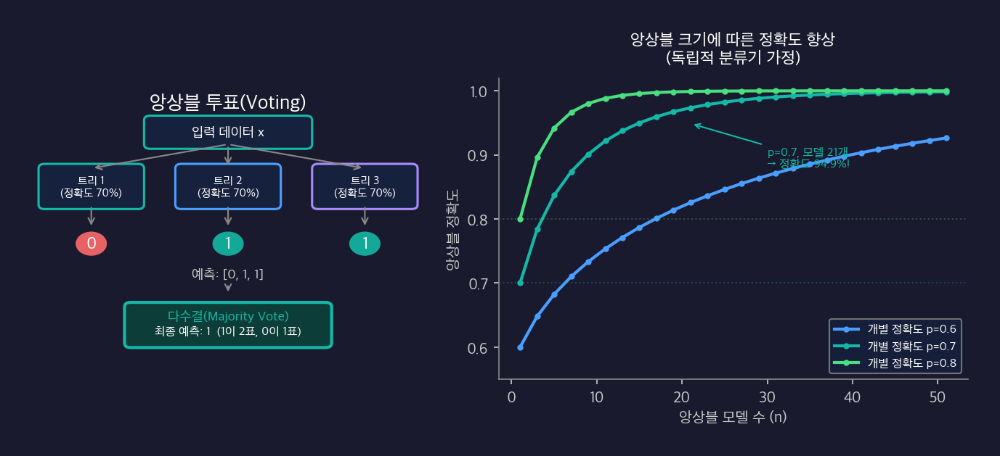
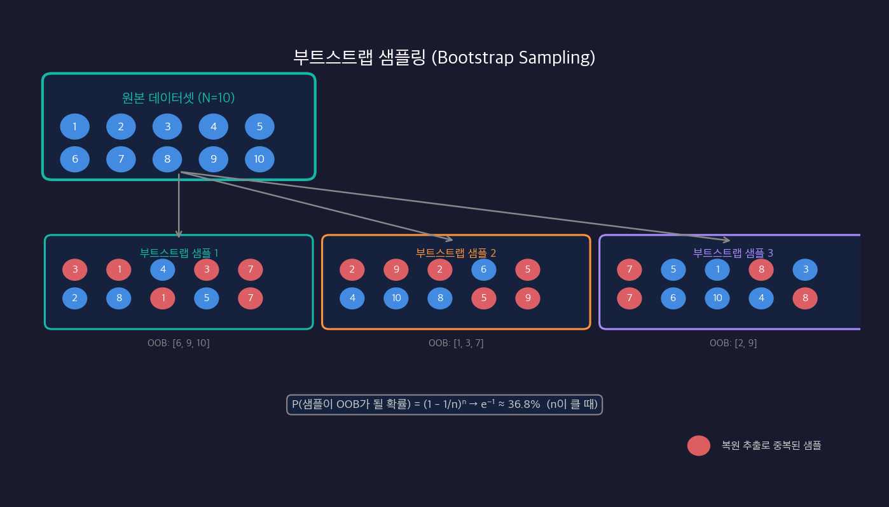
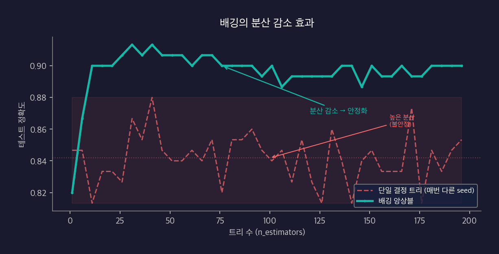
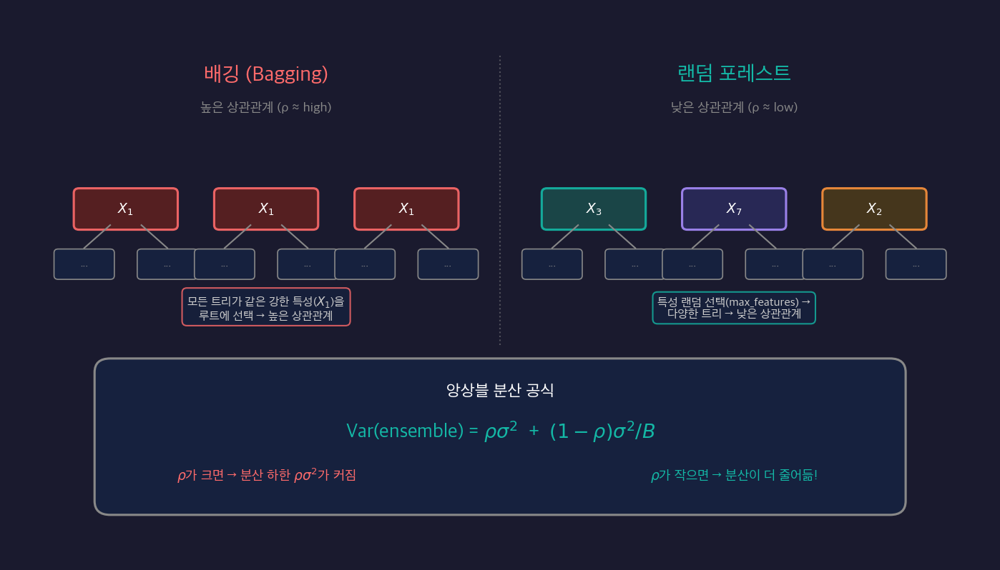

[결정 트리](/ml/decision-tree/) 글에서 트리의 고질적인 문제를 봤다 — **높은 분산(Variance)**. 훈련 데이터가 조금만 달라져도 트리의 모양이 크게 바뀐다. [편향-분산 트레이드오프](/ml/bias-variance/)에서 배운 MSE 분해를 떠올려보면, 결정 트리는 편향은 낮지만 분산이 커서 전체 오류가 높아진다.

그렇다면 분산을 줄이려면 어떻게 해야 할까? 답은 의외로 단순하다 — **여러 모델을 만들어서 합치면 된다.** 개별 모델의 오류가 서로 상쇄되어, 전체 분산이 줄어든다. 이것이 **앙상블(Ensemble)** 의 핵심 아이디어다.

이 글에서는 앙상블의 원리, 부트스트랩 샘플링, 그리고 배깅(Bagging)이 분산을 줄이는 수학적 근거를 코드와 함께 이해한다.

---

## 앙상블(Ensemble) 개념

### 여러 모델을 합치면 왜 더 좋을까?

직관적인 예시부터 시작하자. 어떤 퀴즈 대회에서 혼자 답을 맞히는 것보다, 100명의 청중에게 물어봐서 다수결로 정하는 것이 더 정확하다. 이것이 **지혜의 군중(Wisdom of the Crowd)** 효과다. 개인의 실수는 랜덤하게 분포하기 때문에, 평균을 내면 서로 상쇄된다.

머신러닝에서도 같은 원리가 적용된다. 각 모델이 독립적으로 오류를 내고, 그 오류들이 서로 연관되지 않는다면, 모델을 합칠수록 오류가 줄어든다.

### 투표(Voting)로 오류 줄이기

개별 정확도가 70%인 분류기 3개가 있다고 해보자. 다수결 투표를 하면 앙상블의 정확도는 얼마일까?

세 분류기 중 최소 2개가 맞아야 다수결이 맞다. 독립적이라고 가정할 때:

```
P(정확히 2개 맞음) = C(3,2) x 0.7^2 x 0.3^1 = 3 x 0.49 x 0.3 = 0.441
P(정확히 3개 맞음) = C(3,3) x 0.7^3 x 0.3^0 = 1 x 0.343 = 0.343

P(다수결 정확) = 0.441 + 0.343 = 0.784
```

개별 70% -> 앙상블 **78.4%**. 모델 수를 늘릴수록 이 효과는 커진다.



오른쪽 그래프에서 볼 수 있듯이, 개별 정확도 70%인 모델을 21개 앙상블하면 전체 정확도가 94.5%에 달한다. 단, 이 계산에는 중요한 전제가 있다 — **오류들이 서로 독립**이어야 한다는 것이다.

### 오류 독립성 조건

수학적으로, n개의 독립적인 분류기를 다수결로 합칠 때 앙상블 정확도는:

```
P(앙상블 정확) = Sigma_{k=ceil(n/2)}^{n} C(n,k) x p^k x (1-p)^(n-k)
```

여기서 p는 개별 분류기의 정확도다. n -> inf이면 이 값은 1에 수렴한다 — **단, p > 0.5일 때만**.

핵심은 **오류의 독립성**이다. 모든 모델이 같은 데이터로 학습하면, 같은 샘플에서 같이 틀리는 경향이 있다 — 오류가 독립적이지 않다. 그래서 각 모델에게 **다른 데이터**를 주는 것이 중요하다.

---

## 부트스트랩 샘플링(Bootstrap Sampling)

각 모델에 다른 데이터를 주는 가장 간단한 방법이 **부트스트랩 샘플링**이다.

### 복원 추출 개념

원본 데이터셋 N개에서 **복원 추출(sampling with replacement)** 로 N개를 뽑는다. 한 번 뽑힌 샘플을 돌려놓고 다시 뽑을 수 있으므로, 같은 샘플이 여러 번 선택될 수 있고, 어떤 샘플은 한 번도 선택되지 않을 수 있다.



빨간색으로 표시된 숫자가 **복원 추출로 중복된 샘플**이다. 어떤 샘플은 두 번, 세 번 뽑히고, 어떤 샘플은 아예 뽑히지 않는다.

### OOB(Out-of-Bag) 샘플이란?

각 부트스트랩 샘플에 포함되지 않은 샘플들이 **OOB 샘플**이다. 한 샘플이 N번의 추출에서 단 한 번도 선택되지 않을 확률은:

```
P(OOB) = (1 - 1/N)^N
```

N이 클 때 이 값은:

```
lim_{N->inf} (1 - 1/N)^N = e^{-1} ~= 0.368
```

즉, **전체 데이터의 약 36.8%**가 각 부트스트랩 샘플의 OOB 샘플이 된다. 이 OOB 샘플들은 해당 트리를 학습할 때 전혀 사용되지 않았으므로, 자연스럽게 **검증 데이터** 역할을 할 수 있다.

### NumPy로 직접 구현

```python
import numpy as np

np.random.seed(42)
N = 10  # 원본 데이터 크기

# 복원 추출로 부트스트랩 샘플 생성
bootstrap_sample = np.random.choice(np.arange(N), size=N, replace=True)
oob_indices = np.setdiff1d(np.arange(N), bootstrap_sample)

print(f"원본 인덱스:      {np.arange(N)}")
print(f"부트스트랩 샘플:  {np.sort(bootstrap_sample)}")
print(f"OOB 샘플 인덱스: {oob_indices}")
print(f"OOB 비율: {len(oob_indices) / N:.2%}")
```

```
원본 인덱스:      [0 1 2 3 4 5 6 7 8 9]
부트스트랩 샘플:  [0 0 1 4 4 6 6 7 8 9]
OOB 샘플 인덱스: [2 3 5]
OOB 비율: 30.00%
```

```python
# 대규모에서의 OOB 비율
N_large = 10000
trials = 1000
oob_ratios = []

for _ in range(trials):
    sample = np.random.choice(N_large, size=N_large, replace=True)
    oob = len(np.setdiff1d(np.arange(N_large), sample))
    oob_ratios.append(oob / N_large)

print(f"평균 OOB 비율: {np.mean(oob_ratios):.4f}")  # ~= 0.3679 ~= e^(-1)
print(f"이론값 e^(-1): {np.exp(-1):.4f}")
```

```
평균 OOB 비율: 0.3679
이론값 e^(-1): 0.3679
```

---

## 배깅(Bagging: Bootstrap Aggregating)

부트스트랩 샘플링으로 만든 여러 개의 데이터셋에 각각 모델을 학습시키고, 예측을 집계(Aggregating)하는 방법이 **배깅**이다. Leo Breiman이 1996년에 제안했다.

### 배깅 알고리즘

```
입력: 훈련 데이터 D = {(x_1,y_1), ..., (x_n,y_n)}, 트리 수 B

For b = 1 to B:
  1. D에서 복원 추출로 D_b (크기 N) 생성 (부트스트랩)
  2. D_b로 결정 트리 T_b 학습 (가지치기 없이 완전히)

분류: 최종 예측 = Majority Vote({T_1(x), T_2(x), ..., T_B(x)})
회귀: 최종 예측 = Mean({T_1(x), T_2(x), ..., T_B(x)})
```

### 배깅이 분산을 줄이는 수학적 근거

분산이 sigma^2이고 서로 **독립**인 B개의 트리 예측값 `T_1`, `T_2`, ..., `T_B`의 평균을 내면:

```
Var(T_bar) = Var((T_1 + T_2 + ... + T_B) / B) = sigma^2 / B
```

트리 수 B를 늘릴수록 분산이 **B분의 1**로 줄어든다. 100개 트리면 분산이 1/100이 된다.



그래프에서 트리 수가 늘어날수록 분산이 급격히 줄어드는 것을 확인할 수 있다. 하지만 현실에서는 한 가지 문제가 있다.

### 상관관계가 있는 경우의 분산 공식

현실에서 트리들은 완전히 독립이 아니다. 같은 원본 데이터에서 부트스트랩 샘플링을 하므로, 트리들 사이에 **상관관계 rho**가 생긴다. 이때 분산 공식은:

```
Var(T_bar) = rho * sigma^2 + (1 - rho) * sigma^2 / B
```

이 공식이 배깅의 핵심이자 한계를 동시에 보여준다:

- **두 번째 항** `(1 - rho) * sigma^2 / B`: B를 늘리면 0에 가까워진다. 이것이 배깅의 힘이다.
- **첫 번째 항** `rho * sigma^2`: B와 무관하게 남는다. 이것이 배깅의 한계다.

### NumPy/Scratch로 배깅 구현

```python
import numpy as np
from sklearn.tree import DecisionTreeClassifier
from sklearn.datasets import load_breast_cancer
from sklearn.model_selection import train_test_split

cancer = load_breast_cancer()
X, y = cancer.data, cancer.target
X_train, X_test, y_train, y_test = train_test_split(X, y, test_size=0.2, random_state=42)

class BaggingClassifierScratch:
    def __init__(self, n_estimators=100, random_state=None):
        self.n_estimators = n_estimators
        self.rng = np.random.default_rng(random_state)
        self.trees = []

    def fit(self, X, y):
        n_samples = X.shape[0]
        self.trees = []
        for _ in range(self.n_estimators):
            # 부트스트랩 샘플링
            indices = self.rng.choice(n_samples, size=n_samples, replace=True)
            X_boot, y_boot = X[indices], y[indices]
            # 완전히 성장한 트리 학습
            tree = DecisionTreeClassifier(random_state=self.rng.integers(1000))
            tree.fit(X_boot, y_boot)
            self.trees.append(tree)
        return self

    def predict(self, X):
        # 각 트리의 예측을 모아 다수결
        predictions = np.array([tree.predict(X) for tree in self.trees])
        return np.apply_along_axis(
            lambda x: np.bincount(x).argmax(), axis=0, arr=predictions
        )

    def score(self, X, y):
        return np.mean(self.predict(X) == y)

# 학습 및 평가
bagging_scratch = BaggingClassifierScratch(n_estimators=100, random_state=42)
bagging_scratch.fit(X_train, y_train)

single_tree = DecisionTreeClassifier(random_state=42)
single_tree.fit(X_train, y_train)

print(f"단일 DecisionTree 정확도: {single_tree.score(X_test, y_test):.4f}")
print(f"배깅(scratch) 정확도:    {bagging_scratch.score(X_test, y_test):.4f}")
```

```
단일 DecisionTree 정확도: 0.9474
배깅(scratch) 정확도:    0.9561
```

단일 트리보다 배깅이 약 1%p 더 높은 정확도를 보인다. 분산이 줄어든 덕분이다.

---

## sklearn BaggingClassifier

직접 구현이 원리 이해에는 좋지만, 실전에서는 sklearn의 `BaggingClassifier`를 사용한다.

```python
from sklearn.datasets import load_breast_cancer
from sklearn.model_selection import train_test_split
from sklearn.tree import DecisionTreeClassifier
from sklearn.ensemble import BaggingClassifier

cancer = load_breast_cancer()
X, y = cancer.data, cancer.target
X_train, X_test, y_train, y_test = train_test_split(
    X, y, test_size=0.2, random_state=42, stratify=y
)

# 단일 결정 트리
dt = DecisionTreeClassifier(random_state=42)
dt.fit(X_train, y_train)

# 배깅
bagging = BaggingClassifier(
    estimator=DecisionTreeClassifier(),
    n_estimators=100,
    max_samples=1.0,    # 부트스트랩 샘플 크기 (기본: 전체)
    max_features=1.0,   # 특성 서브샘플 없음 (배깅의 경우)
    bootstrap=True,
    random_state=42,
    n_jobs=-1
)
bagging.fit(X_train, y_train)

print(f"단일 DecisionTree: {dt.score(X_test, y_test):.4f}")
print(f"BaggingClassifier: {bagging.score(X_test, y_test):.4f}")
```

```
단일 DecisionTree: 0.9474
BaggingClassifier: 0.9561
```

### 주요 파라미터

| 파라미터 | 기본값 | 설명 |
|---------|--------|------|
| `estimator` | None(DecisionTree) | 기본 학습기. 트리 외에도 사용 가능 |
| `n_estimators` | 10 | 앙상블에 포함할 모델 수 |
| `max_samples` | 1.0 | 각 부트스트랩 샘플의 크기 (비율 또는 정수) |
| `max_features` | 1.0 | 각 모델이 사용할 특성 비율 |
| `bootstrap` | True | 복원 추출 여부 |
| `oob_score` | False | OOB 점수 계산 여부 |

<div style="background: #f0f4ff; border-left: 4px solid #3182f6; padding: 16px 20px; margin: 20px 0; border-radius: 4px;">
  <strong>💡 BaggingClassifier는 트리 전용이 아니다</strong><br>
  <code>estimator</code>에 KNN, SVM 등 다른 모델도 넣을 수 있다. 다만 배깅의 효과가 가장 큰 것은 <strong>불안정한(high-variance) 모델</strong>이다. 결정 트리가 배깅의 단골 손님인 이유다. 이미 안정적인 모델(예: 릿지 회귀)에 배깅을 적용하면 효과가 미미하다.
</div>

---

## OOB(Out-of-Bag) 평가

배깅에서 각 트리는 자신의 OOB 샘플(약 36.8%)로 평가할 수 있다. 전체 데이터의 각 샘플은 평균적으로 **B x 0.368개** 트리의 OOB 샘플이 된다. 그 트리들의 예측만 모아 다수결을 내면 자연스럽게 **교차 검증과 유사한 검증**이 된다.

교차 검증(k-fold)은 데이터를 k번 다시 학습해야 하지만, OOB 평가는 배깅 학습 중에 자동으로 이루어진다 — **추가 학습 없이** 교차 검증 수준의 일반화 오류 추정이 가능하다.

```python
from sklearn.ensemble import BaggingClassifier
from sklearn.tree import DecisionTreeClassifier

bagging_oob = BaggingClassifier(
    estimator=DecisionTreeClassifier(),
    n_estimators=100,
    oob_score=True,     # OOB 점수 계산 활성화
    random_state=42,
    n_jobs=-1
)
bagging_oob.fit(X_train, y_train)

print(f"OOB Score:    {bagging_oob.oob_score_:.4f}")
print(f"Test Score:   {bagging_oob.score(X_test, y_test):.4f}")
```

```
OOB Score:    0.9560
Test Score:   0.9561
```

OOB 점수와 테스트 점수가 매우 가깝다. 별도의 검증 셋 없이도 일반화 성능을 추정할 수 있다는 뜻이다.

<div style="background: #f0fff4; border-left: 4px solid #51cf66; padding: 16px 20px; margin: 20px 0; border-radius: 4px;">
  <strong>✅ OOB 사용 팁</strong><br>
  <code>oob_score=True</code>를 쓰려면 <code>bootstrap=True</code>(기본값)여야 한다. OOB 점수가 테스트 점수와 크게 다르면(예: OOB가 훨씬 낮으면) 데이터에 시간적 순서나 그룹 구조가 있어서 랜덤 분할이 적절하지 않은 신호일 수 있다.
</div>

---

## 배깅의 한계와 상관관계

배깅은 분산을 줄이는 강력한 도구이지만, 넘지 못하는 벽이 있다.

### 지배적 특성 문제

30개의 특성 중 1개가 압도적으로 중요한 특성이라고 하자. 배깅에서는 모든 트리가 그 특성을 최상위 분기점으로 사용한다. 부트스트랩 샘플이 다르더라도, **트리의 구조 자체가 비슷해진다**.



왼쪽 그래프는 트리들이 서로 독립일 때(rho ~= 0) 분산이 빠르게 0에 수렴하는 것을 보여준다. 오른쪽 그래프는 상관관계가 높을 때(rho ~= 0.8) 분산이 어느 수준 이하로 내려가지 않는 것을 보여준다.

### 수학으로 이해하는 한계

분산 공식을 다시 보자:

```
Var(T_bar) = rho * sigma^2 + (1 - rho) * sigma^2 / B
```

B -> inf (트리를 무한히 많이 사용)로 보내면:

```
lim_{B->inf} Var(T_bar) = rho * sigma^2
```

**rho * sigma^2가 분산의 하한선**이다. rho가 0.8이면, 아무리 많은 트리를 써도 분산의 80%가 남는다. 배깅의 효과가 20%에 그치는 것이다.

이것이 바로 배깅만으로는 부족한 이유다. **트리 간 상관관계(rho)를 줄여야** 분산을 더 낮출 수 있다.

### rho를 줄이는 방법은?

배깅은 **데이터를 다르게** 해서 트리를 다양하게 만든다. 하지만 같은 특성을 보고 있으면 결국 비슷한 트리가 나온다. 그렇다면 **특성도 다르게** 하면 어떨까?

각 노드에서 전체 특성 중 일부만 무작위로 선택해서 분기점을 찾는다면, 지배적인 특성이 매번 선택되지 않으므로 트리들이 더 다양해진다. 이것이 바로 **랜덤 포레스트(Random Forest)** 의 아이디어다.

---

## 흔한 실수

### 1. 개별 모델이 약해야 한다는 사실을 모른다

```python
from sklearn.ensemble import BaggingClassifier
from sklearn.linear_model import LogisticRegression

# ❌ 이미 안정적인 모델에 배깅을 적용
bagging_lr = BaggingClassifier(
    estimator=LogisticRegression(max_iter=1000),
    n_estimators=100,
    random_state=42
)
bagging_lr.fit(X_train, y_train)
lr = LogisticRegression(max_iter=1000)
lr.fit(X_train, y_train)

print(f"단일 LogisticRegression: {lr.score(X_test, y_test):.4f}")
print(f"배깅 LogisticRegression: {bagging_lr.score(X_test, y_test):.4f}")
# 거의 차이 없음 — 로지스틱 회귀는 이미 분산이 낮은 모델
```

배깅은 **분산이 높은 모델**(결정 트리, KNN 등)에 효과적이다. 분산이 이미 낮은 모델에는 효과가 미미하다.

### 2. bootstrap=False로 설정한다

```python
# ❌ bootstrap=False는 같은 데이터로 같은 트리를 만든다
bagging_no_boot = BaggingClassifier(
    estimator=DecisionTreeClassifier(),
    n_estimators=100,
    bootstrap=False,     # 모든 트리가 동일 데이터로 학습
    random_state=42
)
# → 모든 트리가 동일 → 앙상블 효과 없음

# ✅ bootstrap=True (기본값)로 각 트리에 다른 데이터를 주자
bagging_boot = BaggingClassifier(
    estimator=DecisionTreeClassifier(),
    n_estimators=100,
    bootstrap=True,      # 복원 추출로 다양한 데이터셋
    random_state=42
)
```

`bootstrap=False`에서 `max_samples < 1.0`을 함께 쓰면 비복원 서브샘플링이 되어 다양성이 생기긴 하지만, 기본적으로는 `bootstrap=True`가 배깅의 정의에 맞는 설정이다.

---

## 마치며

배깅은 부트스트랩 샘플링으로 여러 트리를 만들고 다수결/평균으로 합치는 앙상블 기법이다. 핵심 원리를 정리하면:

- **앙상블**: 독립적인 모델들의 오류가 서로 상쇄 -> 분산 감소. 오류 독립성이 핵심
- **부트스트랩**: 복원 추출로 N개 샘플링. OOB 비율 ~= e^(-1) ~= 36.8%
- **배깅**: `Var(T̄) = σ²/B` (독립 가정). 트리 수 증가 -> 분산 감소
- **상관관계 한계**: 실제로는 `Var(T̄) = ρσ² + (1 - ρ)σ²/B`. B -> inf여도 `ρσ²`가 남는다

배깅은 분산을 줄이는 강력한 도구이지만, 트리 간 상관관계라는 벽에 부딪힌다. 다음 글에서는 이 벽을 넘는 방법 — 각 노드에서 특성을 무작위로 선택하는 **랜덤 포레스트(Random Forest)** 를 다룬다.

<div style="background: #f8f9fa; border: 1px solid #e9ecef; padding: 20px; margin: 24px 0; border-radius: 8px;">
  <strong>📌 핵심 요약</strong><br><br>
  <ul style="margin: 0; padding-left: 20px;">
    <li><strong>앙상블</strong>: 독립적인 모델들의 오류가 서로 상쇄 -> 분산 감소. 오류 독립성이 핵심</li>
    <li><strong>부트스트랩</strong>: 복원 추출로 N개 샘플링. OOB 확률 ~= e^(-1) ~= 36.8%</li>
    <li><strong>배깅</strong>: <code>Var(T̄) = σ²/B</code> (독립 가정). 트리 수 증가 -> 분산 감소</li>
    <li><strong>상관관계 한계</strong>: <code>Var(T̄) = ρσ² + (1 - ρ)σ²/B</code>. ρ가 높으면 배깅 효과 제한</li>
    <li><strong>OOB Score</strong>: oob_score=True로 추가 학습 없이 교차 검증 수준 성능 추정</li>
    <li><strong>다음 단계</strong>: rho를 줄이기 위해 특성 무작위성을 추가한 랜덤 포레스트</li>
  </ul>
</div>

---

## 참고자료

- [Leo Breiman -- "Bagging Predictors" (1996), Machine Learning 24:123-140](https://link.springer.com/article/10.1007/BF00058655)
- [Leo Breiman -- "Random Forests" (2001), Machine Learning 45:5-32](https://link.springer.com/article/10.1023/A:1010933404324)
- [Scikit-learn -- BaggingClassifier Documentation](https://scikit-learn.org/stable/modules/generated/sklearn.ensemble.BaggingClassifier.html)
- [Scikit-learn -- Ensemble Methods User Guide](https://scikit-learn.org/stable/modules/ensemble.html)
- [Trevor Hastie et al. -- "The Elements of Statistical Learning", Chapter 8](https://hastie.su.domains/ElemStatLearn/)
