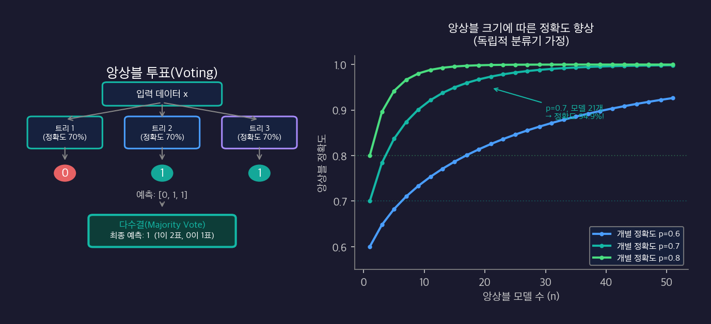
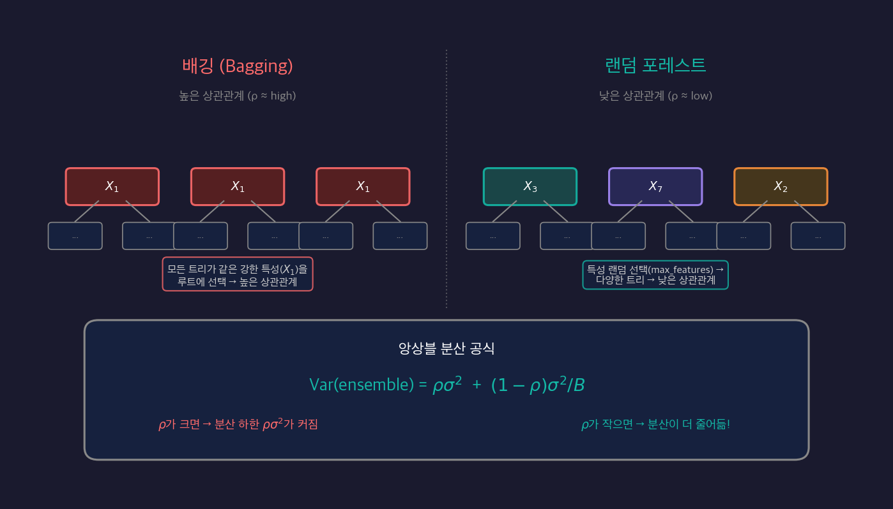

결정 트리는 편향이 낮은 대신 분산이 크다. 훈련 데이터에서 몇 개만 빠져도 루트의 분할 기준이 바뀌고, 그 아래 트리가 통째로 다시 그려진다. 데이터를 어떻게 뽑았느냐에 따라 예측이 출렁인다는 뜻이다.

이 출렁임을 줄이는 방법은 의외로 평범하다. 모델을 여러 개 만들어 답을 모으면 된다. 각 모델이 서로 다른 지점에서 틀린다면 틀린 답들은 흩어지고 맞은 답만 겹쳐서 남는다. 이것이 **앙상블**의 전부다.

---

## 오류가 상쇄된다는 것의 의미

혼자 답을 맞히는 것보다 100명에게 물어 다수결로 정하는 편이 더 정확하다는 관찰이 있다. 개인의 실수가 제각기 다른 방향으로 흩어지기 때문에, 모으면 서로 지워진다.

정확도 70%짜리 분류기 세 개를 다수결로 합쳐보자. 셋 중 최소 둘이 맞으면 다수결이 맞는다. 세 분류기가 독립이라면

$$\binom{3}{2}(0.7)^2(0.3) + \binom{3}{3}(0.7)^3 = 0.441 + 0.343 = 0.784$$

개별 70%가 앙상블 78.4%가 된다. 일반화하면 $n$ 개를 합쳤을 때 다수결이 맞을 확률은

$$P = \sum_{k=\lceil n/2 \rceil}^{n} \binom{n}{k} p^k (1-p)^{n-k}$$

이고, $p > 0.5$ 이기만 하면 $n$ 이 커질수록 1에 수렴한다. 개별 70%짜리를 11개 모으면 92.2%, 21개 모으면 97.4%다.



문제는 이 계산이 전부 **오류가 서로 독립**이라는 가정 위에 서 있다는 점이다. 모든 모델을 같은 데이터로 학습시키면 같은 샘플에서 나란히 틀린다. 그러면 다수결의 답이 모델 하나의 답과 같아져서, 모델을 아무리 늘려도 얻는 것이 없다. 앙상블의 성패는 개별 모델의 성능이 아니라 **모델들이 서로 얼마나 다르게 틀리는가**에 달려 있다.

---

## 부트스트랩 샘플링

모델마다 다른 데이터를 주는 가장 간단한 방법이 부트스트랩 샘플링이다. 원본 $N$ 개에서 **복원 추출**로 다시 $N$ 개를 뽑는다. 뽑은 것을 도로 넣고 다시 뽑기 때문에 같은 샘플이 두세 번 들어가기도 하고, 한 번도 안 뽑히는 샘플도 생긴다.

```python
import numpy as np

rng = np.random.default_rng(0)
N = 10
boot = rng.choice(N, size=N, replace=True)
oob = np.setdiff1d(np.arange(N), boot)
print(np.sort(boot), oob)
```

```text
[0 0 0 1 2 3 5 6 8 8] [4 7 9]
```

뽑히지 않고 남은 샘플을 **OOB(Out-of-Bag)** 샘플이라고 부른다. 한 샘플이 $N$ 번의 추출에서 한 번도 안 걸릴 확률은 $\left(1 - \frac{1}{N}\right)^N$ 이고, $N$ 이 커지면 익숙한 상수로 간다.

$$\lim_{N \to \infty} \left(1 - \frac{1}{N}\right)^N = e^{-1} \approx 0.368$$

즉 부트스트랩 샘플 하나마다 원본의 약 36.8%가 학습에 쓰이지 않고 남는다. 이 샘플들은 그 모델이 한 번도 본 적 없으므로 그대로 검증 데이터가 된다. $N = 10000$ 으로 200번 반복해 재보면 평균 0.368로 이론값과 맞아떨어진다.

---

## 배깅

부트스트랩 샘플을 $B$ 개 만들고 각각에 트리를 하나씩 학습시킨 다음, 분류면 다수결로 회귀면 평균으로 예측을 모은다. 이것이 배깅(Bootstrap Aggregating)이고, Leo Breiman이 1996년에 제안했다.

<div style="margin: 24px 0; text-align: center;">
<svg viewBox="0 0 400 336" style="width: 100%; height: auto; max-width: 380px;"
     xmlns="http://www.w3.org/2000/svg"
     font-family="Pretendard, -apple-system, sans-serif"
     role="img" aria-label="원본 데이터 다섯 개에서 복원 추출로 부트스트랩 샘플 세 개를 만들고 각각에 트리를 학습시킨 뒤, 세 트리의 예측을 다수결로 합쳐 최종 예측을 내는 흐름도">
<defs>
<marker id="bg1Arrow" viewBox="0 0 8 8" refX="7" refY="4" markerWidth="6" markerHeight="6" orient="auto">
<path d="M0 0 L8 4 L0 8 Z" fill="var(--text-muted, #6d6762)"/>
</marker>
</defs>
<text x="200" y="22" text-anchor="middle" font-size="16" font-weight="700" fill="var(--text, #1c1917)">배깅의 흐름</text>
<!-- 원본 데이터 -->
<rect x="125" y="38" width="150" height="44" rx="6" fill="var(--bg-subtle, #f5f4f2)" stroke="var(--border, #e7e5e4)" stroke-width="1.5"/>
<text x="200" y="60" text-anchor="middle" font-size="15" fill="var(--text, #1c1917)">원본 데이터</text>
<text x="200" y="76" text-anchor="middle" font-size="14" fill="var(--text-muted, #6d6762)">1 2 3 4 5</text>
<!-- 복원 추출 화살표 -->
<line x1="200" y1="82" x2="70" y2="109" stroke="var(--text-muted, #6d6762)" stroke-width="1.5" marker-end="url(#bg1Arrow)"/>
<line x1="200" y1="82" x2="200" y2="109" stroke="var(--text-muted, #6d6762)" stroke-width="1.5" marker-end="url(#bg1Arrow)"/>
<line x1="200" y1="82" x2="330" y2="109" stroke="var(--text-muted, #6d6762)" stroke-width="1.5" marker-end="url(#bg1Arrow)"/>
<!-- 부트스트랩 샘플 -->
<rect x="12" y="112" width="112" height="62" rx="6" fill="var(--bg-subtle, #f5f4f2)" stroke="var(--border, #e7e5e4)" stroke-width="1.5"/>
<text x="68" y="132" text-anchor="middle" font-size="14" fill="var(--text, #1c1917)">부트스트랩 1</text>
<text x="68" y="150" text-anchor="middle" font-size="14" fill="var(--text, #1c1917)">1 1 3 4 5</text>
<text x="68" y="168" text-anchor="middle" font-size="14" fill="var(--text-muted, #6d6762)">OOB 2</text>
<rect x="144" y="112" width="112" height="62" rx="6" fill="var(--bg-subtle, #f5f4f2)" stroke="var(--border, #e7e5e4)" stroke-width="1.5"/>
<text x="200" y="132" text-anchor="middle" font-size="14" fill="var(--text, #1c1917)">부트스트랩 2</text>
<text x="200" y="150" text-anchor="middle" font-size="14" fill="var(--text, #1c1917)">2 3 3 4 5</text>
<text x="200" y="168" text-anchor="middle" font-size="14" fill="var(--text-muted, #6d6762)">OOB 1</text>
<rect x="276" y="112" width="112" height="62" rx="6" fill="var(--bg-subtle, #f5f4f2)" stroke="var(--border, #e7e5e4)" stroke-width="1.5"/>
<text x="332" y="132" text-anchor="middle" font-size="14" fill="var(--text, #1c1917)">부트스트랩 3</text>
<text x="332" y="150" text-anchor="middle" font-size="14" fill="var(--text, #1c1917)">1 2 4 5 5</text>
<text x="332" y="168" text-anchor="middle" font-size="14" fill="var(--text-muted, #6d6762)">OOB 3</text>
<!-- 학습 화살표 -->
<line x1="68" y1="174" x2="68" y2="197" stroke="var(--text-muted, #6d6762)" stroke-width="1.5" marker-end="url(#bg1Arrow)"/>
<line x1="200" y1="174" x2="200" y2="197" stroke="var(--text-muted, #6d6762)" stroke-width="1.5" marker-end="url(#bg1Arrow)"/>
<line x1="332" y1="174" x2="332" y2="197" stroke="var(--text-muted, #6d6762)" stroke-width="1.5" marker-end="url(#bg1Arrow)"/>
<!-- 트리와 예측 -->
<rect x="12" y="200" width="112" height="44" rx="6" fill="var(--bg-success, #f0fdf4)" stroke="var(--text-success, #107836)" stroke-width="1.5"/>
<text x="68" y="222" text-anchor="middle" font-size="15" fill="var(--text, #1c1917)">트리 1</text>
<text x="68" y="239" text-anchor="middle" font-size="14" fill="var(--text-success, #107836)">예측 A</text>
<rect x="144" y="200" width="112" height="44" rx="6" fill="var(--bg-warn, #fffbeb)" stroke="var(--text-warn, #9d5604)" stroke-width="1.5"/>
<text x="200" y="222" text-anchor="middle" font-size="15" fill="var(--text, #1c1917)">트리 2</text>
<text x="200" y="239" text-anchor="middle" font-size="14" fill="var(--text-warn, #9d5604)">예측 B</text>
<rect x="276" y="200" width="112" height="44" rx="6" fill="var(--bg-success, #f0fdf4)" stroke="var(--text-success, #107836)" stroke-width="1.5"/>
<text x="332" y="222" text-anchor="middle" font-size="15" fill="var(--text, #1c1917)">트리 3</text>
<text x="332" y="239" text-anchor="middle" font-size="14" fill="var(--text-success, #107836)">예측 A</text>
<!-- 집계 화살표 -->
<line x1="68" y1="244" x2="193" y2="274" stroke="var(--text-muted, #6d6762)" stroke-width="1.5" marker-end="url(#bg1Arrow)"/>
<line x1="200" y1="244" x2="200" y2="274" stroke="var(--text-muted, #6d6762)" stroke-width="1.5" marker-end="url(#bg1Arrow)"/>
<line x1="332" y1="244" x2="207" y2="274" stroke="var(--text-muted, #6d6762)" stroke-width="1.5" marker-end="url(#bg1Arrow)"/>
<!-- 다수결 -->
<rect x="115" y="278" width="170" height="44" rx="6" fill="var(--primary, #0a756c)"/>
<text x="200" y="300" text-anchor="middle" font-size="15" font-weight="700" fill="var(--on-fill, #ffffff)">다수결 결과 A</text>
<text x="200" y="317" text-anchor="middle" font-size="14" fill="var(--on-fill, #ffffff)">A 2표 · B 1표</text>
</svg>
</div>

여기서 각 트리는 **가지치기 없이 끝까지 키운다**. 개별 트리는 과적합해도 상관없다. 배깅이 손대는 것은 편향이 아니라 분산이고, 편향이 낮고 분산이 큰 모델일수록 평균을 낼 때 얻는 것이 많기 때문이다.

### 왜 분산이 줄어드는가

분산이 $\sigma^2$ 이고 서로 독립인 $B$ 개의 예측값을 평균 내면

$$\mathrm{Var}(\bar{T}) = \mathrm{Var}\!\left(\frac{1}{B}\sum_{b=1}^{B} T_b\right) = \frac{\sigma^2}{B}$$

트리 100그루면 분산이 100분의 1이 된다. 이 식이 배깅의 근거 전부다. 코드로 옮기면 반복문 하나로 끝난다.

```python
import numpy as np
from sklearn.tree import DecisionTreeClassifier
from sklearn.datasets import load_breast_cancer
from sklearn.model_selection import train_test_split

X, y = load_breast_cancer(return_X_y=True)
X_train, X_test, y_train, y_test = train_test_split(
    X, y, test_size=0.2, random_state=42
)

rng = np.random.default_rng(42)
trees = []
for _ in range(100):
    idx = rng.choice(len(X_train), size=len(X_train), replace=True)
    tree = DecisionTreeClassifier(random_state=int(rng.integers(1000)))
    trees.append(tree.fit(X_train[idx], y_train[idx]))

votes = np.array([t.predict(X_test) for t in trees]).mean(axis=0)
single = DecisionTreeClassifier(random_state=42).fit(X_train, y_train)

print(f"단일 트리 {single.score(X_test, y_test):.4f}")
print(f"배깅     {((votes >= 0.5) == y_test).mean():.4f}")
```

```text
단일 트리 0.9474
배깅     0.9561
```

---

## sklearn과 OOB 평가

실전에서는 `BaggingClassifier`를 쓴다. 위의 반복문과 하는 일이 같고, `oob_score=True`를 켜면 남겨진 36.8%로 자동 검증까지 해준다.

```python
from sklearn.ensemble import BaggingClassifier

bagging = BaggingClassifier(
    estimator=DecisionTreeClassifier(),
    n_estimators=100,
    oob_score=True,
    random_state=42,
    n_jobs=-1,
).fit(X_train, y_train)

print(f"OOB  {bagging.oob_score_:.4f}")
print(f"테스트 {bagging.score(X_test, y_test):.4f}")
```

```text
OOB  0.9604
테스트 0.9561
```

OOB 평가가 성립하는 이유는 이렇다. 어떤 샘플 하나를 놓고 보면 전체 $B$ 그루 중 평균 $0.368B$ 그루가 그 샘플을 학습에 쓰지 않았다. 그 그루들의 예측만 모아 다수결을 내면, 그 샘플을 한 번도 본 적 없는 앙상블의 예측이 된다. 모든 샘플에서 이렇게 구한 점수가 OOB 점수다.

교차검증은 같은 일을 하려고 데이터를 $k$ 번 나눠 $k$ 번 다시 학습한다. OOB는 배깅을 한 번 학습하는 도중에 공짜로 나온다. 데이터가 크거나 학습이 오래 걸릴수록 이 차이가 크다.

| 파라미터 | 기본값 | 설명 |
|---|---|---|
| `estimator` | None (결정 트리) | 기본 학습기. 트리가 아니어도 된다 |
| `n_estimators` | 10 | 앙상블에 넣을 모델 수 |
| `max_samples` | 1.0 | 부트스트랩 샘플 크기 (비율 또는 개수) |
| `max_features` | 1.0 | 각 모델이 볼 특성 비율 |
| `bootstrap` | True | 복원 추출 여부 |
| `oob_score` | False | OOB 점수 계산 여부 |

:::tip

**OOB 점수를 읽는 법**

`oob_score=True`는 `bootstrap=True`일 때만 쓸 수 있다. 뽑히지 않은 샘플이 있어야 검증할 것이 생기기 때문이다.

OOB 점수가 테스트 점수보다 눈에 띄게 낮다면 데이터에 시간 순서나 그룹 구조가 있어서 무작위 분할이 맞지 않는다는 신호일 수 있다.

:::

---

## 배깅이 넘지 못하는 벽

$\sigma^2 / B$ 라는 식은 트리들이 서로 독립일 때만 성립한다. 현실에서는 아니다. 부트스트랩 샘플 하나에는 중복을 빼고 세어도 원본의 63.2%가 들어가므로 두 트리의 훈련 데이터가 크게 겹치고, 그만큼 트리들 사이에 상관관계 $\rho$ 가 생긴다. 상관관계를 반영한 평균의 분산은 이렇게 바뀐다.

$$\mathrm{Var}(\bar{T}) = \rho \sigma^2 + \frac{1 - \rho}{B}\,\sigma^2$$

두 항의 운명이 다르다. 뒷항은 $B$ 를 늘리면 0으로 사라지고, 이것이 배깅이 실제로 벌어들이는 몫이다. 앞항은 $B$ 와 무관하게 그대로 남는다.

$$\lim_{B \to \infty} \mathrm{Var}(\bar{T}) = \rho \sigma^2$$

$\rho \sigma^2$ 가 분산의 바닥이다. 상관관계가 0.8이라면 트리를 만 그루 심어도 원래 분산의 80%가 남는다.



$\rho$ 가 커지는 전형적인 상황은 **특성 하나가 지나치게 강할 때**다. 30개 특성 중 하나가 압도적으로 예측력이 높으면 어느 부트스트랩 샘플로 학습하든 모든 트리가 그 특성을 루트에 놓는다. 데이터를 다르게 줬는데도 트리 모양이 형제처럼 닮아버리고, 같은 곳에서 같이 틀린다. 데이터만 흔들어서는 여기까지가 한계다.

---

## 자주 하는 실수

**분산이 낮은 모델에 배깅을 씌운다.** 배깅이 줄이는 것은 분산뿐이다. 로지스틱 회귀나 릿지 회귀처럼 데이터가 조금 바뀌어도 계수가 거의 그대로인 모델은 부트스트랩 샘플을 100개 만들어도 100개의 거의 같은 모델이 나온다. 평균을 내도 원래 모델과 다를 것이 없다. 배깅의 단골 손님이 결정 트리인 것은 트리가 그만큼 불안정하기 때문이다.

**`bootstrap=False`로 둔다.** 복원 추출을 끄면 모든 모델이 같은 훈련 데이터를 통째로 받는다. 결정 트리처럼 결정론적인 학습기라면 100그루가 전부 동일한 트리가 되어 앙상블 효과가 0이 된다. `max_samples`를 1.0보다 작게 함께 주면 비복원 서브샘플링이 되어 다양성이 조금 생기지만, 배깅의 정의에 맞는 설정은 `bootstrap=True`다.

---

## 마치며

배깅의 논리는 두 줄로 요약된다. 부트스트랩으로 서로 다른 훈련 데이터를 만들어 모델을 여러 개 학습시키고, 예측을 평균 내면 분산이 $\sigma^2 / B$ 로 줄어든다. 여기에 OOB라는 부산물이 따라와서 별도의 검증 셋 없이 일반화 성능까지 추정하게 해준다.

동시에 배깅은 자기 한계를 스스로 드러내는 방법이기도 하다. $\rho \sigma^2 + \frac{1-\rho}{B}\sigma^2$ 라는 식은 트리를 더 심어서 얻을 수 있는 몫과 얻을 수 없는 몫을 정확히 갈라놓는다. 트리 수를 늘리는 것으로는 $\rho \sigma^2$ 에 손댈 수 없다.

그래서 다음 수는 트리 수가 아니라 $\rho$ 를 겨냥해야 한다. 데이터를 다르게 주는 것만으로는 부족하니, 트리가 볼 수 있는 것 자체를 제한해서 서로 다른 트리가 나오게 만드는 방법을 다음 글에서 다룬다.

---

## 함께 보면 좋은 글

- [결정 트리](/ml/decision-tree/) : 배깅이 쌓아 올리는 개별 트리가 어떻게 학습되는지
- [랜덤 포레스트](/ml/random-forest/) : 트리 간 상관관계를 직접 낮추는 방법
- [부스팅](/ml/boosting/) : 분산이 아니라 편향을 겨냥하는 반대편 앙상블

---

## 참고자료

- [Leo Breiman, "Bagging Predictors" (1996), Machine Learning 24:123-140](https://link.springer.com/article/10.1007/BF00058655)
- [Scikit-learn BaggingClassifier](https://scikit-learn.org/stable/modules/generated/sklearn.ensemble.BaggingClassifier.html)
- [Scikit-learn Ensemble Methods User Guide](https://scikit-learn.org/stable/modules/ensemble.html)
- [Trevor Hastie et al., "The Elements of Statistical Learning", Chapter 15](https://hastie.su.domains/ElemStatLearn/)
