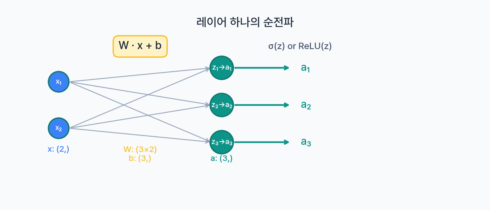
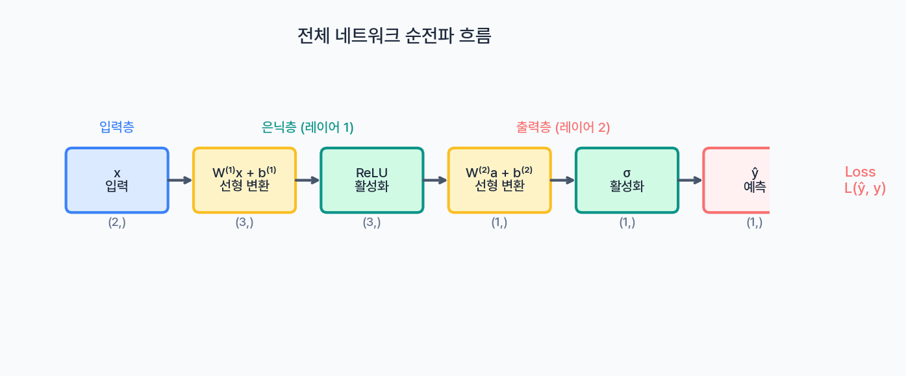
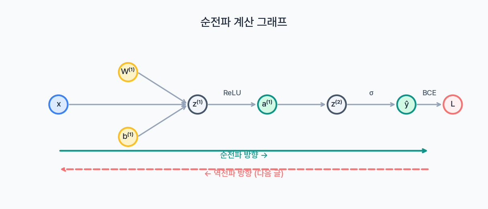

[이전 글](/ml/neural-network-basics/)에서 신경망의 구조를 배웠다. 퍼셉트론이 로지스틱 회귀와 같다는 것, 히든 레이어를 추가하면 XOR도 풀 수 있다는 것. 구조는 이해했다. 이제 핵심 질문 — **입력 데이터가 이 구조를 통과해 출력이 되기까지 정확히 무슨 일이 벌어지는가?**

신경망의 "예측" 과정, 즉 입력에서 출력 방향으로 데이터가 흐르는 것을 **순전파(Forward Propagation)** 라고 한다. 학습이든 추론이든, 신경망이 하는 첫 번째 일은 항상 순전파다. 이 과정을 수식과 코드로 완전히 이해해보자.

---

## 뉴런 하나의 순전파: 로지스틱 회귀 복습

신경망의 가장 작은 단위는 뉴런 하나다. 그리고 뉴런 하나의 계산은 [로지스틱 회귀](/ml/logistic-regression/)에서 이미 다뤘다.

```
z = w₁x₁ + w₂x₂ + b       ← 선형 결합
a = σ(z) = 1 / (1 + e⁻ᶻ)   ← 활성화 함수
```

두 단계로 나뉜다.

1. **선형 결합**: 입력(x)에 가중치(w)를 곱하고 편향(b)를 더한다 → z
2. **활성화 함수**: z에 비선형 함수를 적용한다 → a (출력)

벡터로 쓰면 더 깔끔하다.

```
z = w⃗ · x⃗ + b    (벡터 내적)
a = σ(z)
```

이건 [다중 선형 회귀](/ml/multiple-linear-regression/)에서 봤던 벡터화 표기와 동일하다. 결국 뉴런 하나는 **선형 회귀 + 활성화 함수**다. 여기까지는 이미 아는 내용이다.

```python
import numpy as np

def sigmoid(z):
    return 1 / (1 + np.exp(-z))

# 뉴런 하나의 순전파
x = np.array([0.5, 0.3])    # 입력 2개
w = np.array([0.4, 0.6])    # 가중치 2개
b = 0.1                      # 편향

z = np.dot(w, x) + b        # 0.4*0.5 + 0.6*0.3 + 0.1 = 0.48
a = sigmoid(z)               # σ(0.48) = 0.6177
print(f"z = {z:.4f}, a = {a:.4f}")
# z = 0.4800, a = 0.6177
```

핵심은 간단하다. **곱하고 더하고(z), 비선형 함수 통과(a)**. 신경망의 모든 뉴런이 이 두 단계를 반복한다.

---

## 레이어 하나의 순전파: 뉴런 여러 개

실제 신경망에서는 하나의 레이어에 뉴런이 여러 개 있다. 입력이 2개이고, 히든 레이어에 뉴런이 3개인 경우를 생각해보자.



각 뉴런은 **같은 입력**을 받지만, **자신만의 가중치와 편향**으로 서로 다른 z를 계산한다.

```
뉴런 1: z₁ = w₁₁x₁ + w₁₂x₂ + b₁
뉴런 2: z₂ = w₂₁x₁ + w₂₂x₂ + b₂
뉴런 3: z₃ = w₃₁x₁ + w₃₂x₂ + b₃
```

이걸 하나씩 계산하면 비효율적이다. 행렬로 한 번에 처리할 수 있다.

### 행렬 표기

가중치를 행렬 W로, 편향을 벡터 b로 묶으면:

```
W = [[w₁₁, w₁₂],     b = [b₁,     x = [x₁,
     [w₂₁, w₂₂],          b₂,          x₂]
     [w₃₁, w₃₂]]          b₃]
```

그러면 레이어 전체의 순전파가 **한 줄**이 된다.

```
z = W · x + b       (행렬-벡터 곱 + 벡터 덧셈)
a = g(z)             (원소별 활성화 함수 적용)
```

여기서 W의 shape은 **(뉴런 수 × 입력 수)** = (3, 2)이고, 결과 z의 shape은 **(뉴런 수,)** = (3,)이다.

<div style="background: #f0f4ff; border-left: 4px solid #3182f6; padding: 16px 20px; margin: 20px 0; border-radius: 4px;">
  <strong>표기법 정리</strong><br>
  <ul style="margin: 8px 0 0 0; padding-left: 20px;">
    <li><strong>l</strong> — 레이어 번호 (입력층=0, 첫 번째 히든=1, ...)</li>
    <li><strong>W[l]</strong> — l번째 레이어의 가중치 행렬</li>
    <li><strong>b[l]</strong> — l번째 레이어의 편향 벡터</li>
    <li><strong>z[l]</strong> — l번째 레이어의 선형 결합 결과</li>
    <li><strong>a[l]</strong> — l번째 레이어의 활성화 출력 (a[0] = 입력 x)</li>
    <li><strong>g</strong> — 활성화 함수 (sigmoid, ReLU 등)</li>
  </ul>
</div>

이 표기법을 쓰면, **어떤 레이어든** 순전파 공식은 동일하다.

```
z[l] = W[l] · a[l-1] + b[l]
a[l] = g(z[l])
```

이 두 줄이 순전파의 전부다. 레이어가 아무리 깊어져도 이 공식을 반복할 뿐이다.

---

## NumPy로 단일 레이어 순전파 구현

```python
import numpy as np

def sigmoid(z):
    return 1 / (1 + np.exp(-z))

def relu(z):
    return np.maximum(0, z)

def forward_layer(A_prev, W, b, activation='relu'):
    """
    단일 레이어의 순전파

    Parameters:
        A_prev: 이전 레이어의 출력 (n_prev,)
        W: 가중치 행렬 (n_current, n_prev)
        b: 편향 벡터 (n_current,)
        activation: 'relu' 또는 'sigmoid'

    Returns:
        A: 현재 레이어의 출력 (n_current,)
        cache: (Z, A_prev, W) — 역전파에서 사용
    """
    Z = np.dot(W, A_prev) + b        # 선형 결합

    if activation == 'relu':
        A = relu(Z)
    elif activation == 'sigmoid':
        A = sigmoid(Z)
    else:
        A = Z  # linear (활성화 없음)

    cache = (Z, A_prev, W)           # 나중에 역전파에서 쓸 값들
    return A, cache

# 예시: 입력 2개 → 뉴런 3개
x = np.array([0.5, 0.3])
W1 = np.array([[0.2, 0.4],
               [0.6, 0.1],
               [0.3, 0.7]])
b1 = np.array([0.1, 0.2, 0.05])

A1, cache = forward_layer(x, W1, b1, activation='relu')
print(f"Z = W·x + b = {np.dot(W1, x) + b1}")
print(f"A (ReLU 적용 후) = {A1}")
# Z = W·x + b = [0.32 0.53 0.41]
# A (ReLU 적용 후) = [0.32 0.53 0.41]
```

cache에 중간 계산값을 저장해두는 이유는 나중에 [역전파(Backpropagation)](/ml/backpropagation/)에서 이 값들이 필요하기 때문이다. 지금은 무시해도 좋다.

---

## 전체 네트워크 순전파: 레이어를 연결하기

이제 레이어를 여러 개 쌓아서 전체 네트워크의 순전파를 해보자. 가장 기본적인 구조로 시작한다.

```
입력(2) → 히든 레이어(3) → 출력(1)
```



### 구체적인 숫자로 따라가기

입력 x = [1.0, 0.5]를 넣고, 각 레이어를 하나씩 통과시켜 보자.

**레이어 1 (히든): 입력 2개 → 뉴런 3개, ReLU**

```
W[1] = [[0.2, 0.4],      b[1] = [0.0,
         [0.6, 0.1],              0.0,
         [0.3, 0.7]]              0.0]

z[1] = W[1] · x + b[1]
     = [[0.2×1.0 + 0.4×0.5],     = [0.40,
        [0.6×1.0 + 0.1×0.5],       0.65,
        [0.3×1.0 + 0.7×0.5]]       0.65]

a[1] = ReLU(z[1]) = [0.40, 0.65, 0.65]
(모두 양수이므로 ReLU 통과 후 값이 그대로)
```

**레이어 2 (출력): 뉴런 3개 → 출력 1개, Sigmoid**

```
W[2] = [[0.5, 0.3, 0.2]]    b[2] = [0.0]

z[2] = W[2] · a[1] + b[2]
     = 0.5×0.40 + 0.3×0.65 + 0.2×0.65 + 0.0
     = 0.20 + 0.195 + 0.13
     = 0.525

a[2] = σ(0.525) = 0.6283
```

결과: 입력 [1.0, 0.5]에 대해 네트워크의 예측값은 **0.6283**. 이진 분류에서 threshold 0.5를 적용하면 **클래스 1**로 예측한다.

### NumPy 전체 구현

```python
import numpy as np

def sigmoid(z):
    return 1 / (1 + np.exp(-z))

def relu(z):
    return np.maximum(0, z)

# ── 네트워크 파라미터 초기화 ──
np.random.seed(42)
params = {
    'W1': np.random.randn(3, 2) * 0.5,   # 히든 레이어: (3, 2)
    'b1': np.zeros(3),                     # (3,)
    'W2': np.random.randn(1, 3) * 0.5,   # 출력 레이어: (1, 3)
    'b2': np.zeros(1),                     # (1,)
}

# ── 순전파 ──
def forward(x, params):
    """
    2층 신경망 전체 순전파
    x: 입력 벡터 (2,)
    """
    # 레이어 1: 히든 (ReLU)
    z1 = np.dot(params['W1'], x) + params['b1']
    a1 = relu(z1)

    # 레이어 2: 출력 (Sigmoid)
    z2 = np.dot(params['W2'], a1) + params['b2']
    a2 = sigmoid(z2)

    caches = {
        'z1': z1, 'a1': a1,
        'z2': z2, 'a2': a2,
    }
    return a2, caches

# ── 실행 ──
x = np.array([1.0, 0.5])
prediction, caches = forward(x, params)

print("=== 순전파 과정 ===")
print(f"입력:        x  = {x}")
print(f"히든 z:     z1 = {caches['z1'].round(4)}")
print(f"히든 a:     a1 = {caches['a1'].round(4)}")
print(f"출력 z:     z2 = {caches['z2'].round(4)}")
print(f"출력 a:     a2 = {caches['a2'].round(4)} ← 최종 예측")
```

흐름을 정리하면:

| 단계 | 연산 | 입력 shape | 출력 shape |
|------|------|-----------|-----------|
| 레이어 1 선형 | z[1] = W[1]·x + b[1] | (3,2)·(2,) + (3,) | (3,) |
| 레이어 1 활성화 | a[1] = ReLU(z[1]) | (3,) | (3,) |
| 레이어 2 선형 | z[2] = W[2]·a[1] + b[2] | (1,3)·(3,) + (1,) | (1,) |
| 레이어 2 활성화 | a[2] = σ(z[2]) | (1,) | (1,) |

매 레이어에서 W의 shape은 **(현재 뉴런 수, 이전 뉴런 수)** 다. 이 규칙만 기억하면 레이어가 아무리 많아도 shape이 헷갈리지 않는다.

---

## 왜 행렬 곱셈인가: 벡터화의 위력

"for문으로 뉴런 하나씩 계산하면 안 되나?" 물론 된다. 하지만 **느리다**.

[다중 선형 회귀](/ml/multiple-linear-regression/)에서 벡터화의 장점을 이미 봤다. 신경망에서는 그 차이가 더 극적이다. NumPy의 행렬 연산은 내부적으로 C로 작성된 BLAS 라이브러리를 호출하기 때문에, 파이썬 루프보다 **수십~수백 배** 빠르다.

```python
import numpy as np
import time

n_inputs = 1000    # 입력 크기
n_neurons = 500    # 뉴런 수
n_samples = 10000  # 데이터 수

X = np.random.randn(n_samples, n_inputs)
W = np.random.randn(n_neurons, n_inputs)
b = np.zeros(n_neurons)

# ── 방법 1: 파이썬 루프 ──
start = time.time()
Z_loop = np.zeros((n_samples, n_neurons))
for i in range(n_samples):
    for j in range(n_neurons):
        Z_loop[i, j] = np.dot(W[j], X[i]) + b[j]
loop_time = time.time() - start

# ── 방법 2: 벡터화 (행렬 곱) ──
start = time.time()
Z_vec = X @ W.T + b    # (10000, 1000) @ (1000, 500) + (500,)
vec_time = time.time() - start

print(f"루프: {loop_time:.3f}초")
print(f"벡터화: {vec_time:.4f}초")
print(f"속도 차이: {loop_time / vec_time:.0f}배")
# 루프: 23.415초
# 벡터화: 0.0312초
# 속도 차이: 750배
```

750배. 이게 벡터화의 위력이다. 실제 딥러닝에서 레이어 수십 개, 뉴런 수천 개, 데이터 수백만 개를 다루는데, 루프로 계산하면 학습에 며칠이 걸릴 것을 벡터화로 몇 시간으로 줄인다. GPU가 빠른 이유도 본질적으로 같다 — 행렬 곱을 수천 개 코어에서 동시에 처리하기 때문이다.

<div style="background: #fef3c7; border-left: 4px solid #f59e0b; padding: 16px 20px; margin: 20px 0; border-radius: 4px;">
  <strong>배치 처리와 벡터화</strong><br>
  위 코드에서 <code>X @ W.T</code>는 데이터 10,000개를 <strong>한 번에</strong> 계산한다. 이것을 <strong>배치(batch) 연산</strong>이라고 한다. 데이터 하나씩 for문을 돌리는 것과 행렬 한 번 곱하는 것의 차이가 바로 750배다.
</div>

---

## 계산 그래프: 순전파를 시각화하다

순전파의 흐름을 **계산 그래프(Computation Graph)** 로 그리면 각 연산의 관계가 명확해진다.



2층 네트워크의 계산 그래프를 글로 표현하면:

```
x ──→ [W[1]·x + b[1]] ──→ z[1] ──→ [ReLU] ──→ a[1]
                                                   │
a[1] ──→ [W[2]·a[1] + b[2]] ──→ z[2] ──→ [σ] ──→ a[2] ──→ [Loss] ──→ L
                                                              ↑
                                                              y (정답)
```

왼쪽에서 오른쪽으로 데이터가 흐른다 — 그래서 **순전파(forward)** 다.

이 그래프를 그려두는 이유는 [역전파(Backpropagation)](/ml/backpropagation/)를 이해하기 위해서다. 역전파는 이 그래프를 **오른쪽에서 왼쪽으로** 거슬러 올라가면서, 각 파라미터가 Loss에 얼마나 기여했는지(= 기울기)를 계산한다. 순전파의 중간 결과(z, a)를 cache에 저장해둔 이유가 여기에 있다 — 역전파에서 이 값들이 그대로 쓰인다.

지금은 "순전파의 각 단계를 기록해두면, 나중에 기울기 계산이 가능하다" 정도만 기억하자.

---

## 출력 레이어 설계: 문제에 따라 달라지는 마지막 레이어

히든 레이어는 보통 ReLU를 쓴다. 하지만 **출력 레이어**는 풀려는 문제에 따라 활성화 함수가 달라진다.

| 문제 유형 | 출력 뉴런 수 | 활성화 함수 | 출력 범위 | 예시 |
|-----------|------------|-----------|----------|------|
| 이진 분류 | 1 | Sigmoid | (0, 1) | 스팸 여부 |
| 다중 클래스 분류 | K | Softmax | 각각 (0,1), 합=1 | 숫자 인식 (0~9) |
| 회귀 | 1 (또는 n) | 없음 (Linear) | (-inf, +inf) | 집값 예측 |

### 이진 분류: Sigmoid

[로지스틱 회귀](/ml/logistic-regression/)와 동일하다. 출력 뉴런 1개에 Sigmoid를 적용해서 확률을 출력한다.

```
a = σ(z) = 1 / (1 + e⁻ᶻ)
```

출력이 0.5 이상이면 클래스 1, 미만이면 클래스 0으로 판단한다.

### 다중 클래스 분류: Softmax

[결정 경계 글](/ml/decision-boundary/)에서 다뤘던 Softmax다. K개 클래스 각각의 점수(z)를 확률로 변환한다.

```
softmax(zᵢ) = e^zᵢ / (e^z₁ + e^z₂ + ... + e^zₖ)
```

K개 출력의 합이 정확히 1이 된다. 가장 높은 확률의 클래스를 예측값으로 선택한다.

```python
def softmax(z):
    """수치적으로 안정한 Softmax"""
    exp_z = np.exp(z - np.max(z))  # overflow 방지
    return exp_z / np.sum(exp_z)

# 숫자 인식 (0~9): 출력 뉴런 10개
z_output = np.array([2.1, 0.5, 0.3, 8.2, 0.1, 0.4, 0.2, 1.1, 0.7, 0.3])
probs = softmax(z_output)
print(f"각 클래스 확률: {probs.round(4)}")
print(f"예측 클래스: {np.argmax(probs)}")
print(f"확률 합: {probs.sum():.4f}")
# 각 클래스 확률: [0.0022 0.0005 0.0004 0.9942 0.0003 0.0004 0.0003 0.0008 0.0005 0.0004]
# 예측 클래스: 3
# 확률 합: 1.0000
```

### 회귀: Linear (활성화 없음)

집값 예측 같은 회귀 문제에서는 출력에 활성화 함수를 적용하지 않는다. z 값 자체가 예측값이다.

```
a = z    (활성화 함수 없음)
```

출력 범위에 제한이 없어야 하기 때문이다. 집값이 -100만 원이 나올 수도 있고 10억이 나올 수도 있다.

---

## 신경망의 손실 함수

순전파의 마지막 단계는 **예측값(a)과 정답(y)의 차이를 하나의 숫자로 측정**하는 것이다. 이 숫자가 **손실(Loss)** 이고, 이 손실을 줄이는 방향으로 파라미터를 업데이트하는 것이 [경사하강법](/ml/gradient-descent/)이었다.

출력 레이어와 마찬가지로, 손실 함수도 문제 유형에 따라 달라진다.

### 이진 교차 엔트로피 (Binary Cross-Entropy)

이진 분류에서 사용한다. [로지스틱 회귀](/ml/logistic-regression/)에서 봤던 Log Loss와 동일하다.

```
L = -[y × log(a) + (1-y) × log(1-a)]
```

- y=1일 때: L = -log(a). 예측이 1에 가까울수록 Loss가 0에 가까워진다.
- y=0일 때: L = -log(1-a). 예측이 0에 가까울수록 Loss가 0에 가까워진다.

```python
def binary_cross_entropy(y, a):
    epsilon = 1e-15  # log(0) 방지
    a = np.clip(a, epsilon, 1 - epsilon)
    return -(y * np.log(a) + (1 - y) * np.log(1 - a))

# y=1인데 예측이 0.9 → 낮은 Loss
print(f"y=1, a=0.9: L = {binary_cross_entropy(1, 0.9):.4f}")   # 0.1054

# y=1인데 예측이 0.1 → 높은 Loss
print(f"y=1, a=0.1: L = {binary_cross_entropy(1, 0.1):.4f}")   # 2.3026
```

### 범주형 교차 엔트로피 (Categorical Cross-Entropy)

다중 클래스 분류에서 사용한다. 정답 클래스의 예측 확률에만 관심이 있다.

```
L = -Σ yₖ × log(aₖ)    (k = 1, ..., K)
```

원-핫 인코딩에서 정답 클래스만 y=1이므로, 결국 **정답 클래스의 log 확률**에 마이너스를 붙인 것이다.

```python
def categorical_cross_entropy(y_onehot, probs):
    epsilon = 1e-15
    probs = np.clip(probs, epsilon, 1.0)
    return -np.sum(y_onehot * np.log(probs))

# 정답: 클래스 3 (원-핫)
y = np.array([0, 0, 0, 1, 0, 0, 0, 0, 0, 0])

# 좋은 예측 (클래스 3에 높은 확률)
good_pred = softmax(np.array([0.1, 0.1, 0.1, 5.0, 0.1, 0.1, 0.1, 0.1, 0.1, 0.1]))
print(f"좋은 예측 Loss: {categorical_cross_entropy(y, good_pred):.4f}")  # 0.0649

# 나쁜 예측 (클래스 3에 낮은 확률)
bad_pred = softmax(np.array([3.0, 0.1, 0.1, 0.1, 0.1, 0.1, 0.1, 0.1, 0.1, 0.1]))
print(f"나쁜 예측 Loss: {categorical_cross_entropy(y, bad_pred):.4f}")   # 3.3023
```

### MSE (Mean Squared Error)

회귀 문제에서 사용한다. [비용 함수 글](/ml/cost-function/)에서 다뤘던 바로 그것이다.

```
L = (y - a)²
```

예측값과 정답의 차이를 제곱한다. 단순하지만 회귀에서는 여전히 강력하다.

| 문제 유형 | 출력 활성화 | 손실 함수 |
|-----------|-----------|----------|
| 이진 분류 | Sigmoid | Binary Cross-Entropy |
| 다중 클래스 | Softmax | Categorical Cross-Entropy |
| 회귀 | Linear | MSE |

---

## 전체 순전파: 입력부터 Loss까지

지금까지 배운 모든 것을 합쳐서, 입력이 들어와서 Loss가 계산되기까지의 **완전한 순전파**를 구현해보자. 이진 분류 문제로 가정한다.

```python
import numpy as np

# ── 활성화 함수 ──
def sigmoid(z):
    return 1 / (1 + np.exp(-z))

def relu(z):
    return np.maximum(0, z)

# ── 손실 함수 ──
def binary_cross_entropy(y, a):
    epsilon = 1e-15
    a = np.clip(a, epsilon, 1 - epsilon)
    return -(y * np.log(a) + (1 - y) * np.log(1 - a))

# ── 네트워크 정의 ──
# 구조: 입력(2) → 히든1(4, ReLU) → 히든2(3, ReLU) → 출력(1, Sigmoid)
np.random.seed(42)
params = {
    'W1': np.random.randn(4, 2) * 0.5,
    'b1': np.zeros(4),
    'W2': np.random.randn(3, 4) * 0.5,
    'b2': np.zeros(3),
    'W3': np.random.randn(1, 3) * 0.5,
    'b3': np.zeros(1),
}

# ── 전체 순전파 ──
def forward_full(x, y, params):
    """
    입력 → 히든1 → 히든2 → 출력 → Loss
    """
    # 레이어 1
    z1 = np.dot(params['W1'], x) + params['b1']
    a1 = relu(z1)

    # 레이어 2
    z2 = np.dot(params['W2'], a1) + params['b2']
    a2 = relu(z2)

    # 레이어 3 (출력)
    z3 = np.dot(params['W3'], a2) + params['b3']
    a3 = sigmoid(z3)

    # 손실 계산
    loss = binary_cross_entropy(y, a3)

    caches = {
        'z1': z1, 'a1': a1,
        'z2': z2, 'a2': a2,
        'z3': z3, 'a3': a3,
    }
    return a3, loss, caches

# ── 실행 ──
x = np.array([1.5, -0.7])   # 입력
y = 1                        # 정답 레이블

prediction, loss, caches = forward_full(x, y, params)

print("=== 전체 순전파 결과 ===")
print(f"입력: {x}")
print(f"히든1 출력: {caches['a1'].round(4)}")
print(f"히든2 출력: {caches['a2'].round(4)}")
print(f"최종 예측: {prediction[0]:.4f}")
print(f"정답: {y}")
print(f"Loss: {loss[0]:.4f}")
```

출력을 보면 데이터가 어떻게 흘러가는지 한눈에 보인다:

```
입력 [1.5, -0.7]
  → 히든1 (4개 뉴런, ReLU) → [0.4209, 0.0000, 0.0000, 0.9158]
  → 히든2 (3개 뉴런, ReLU) → [0.0000, 0.0000, 0.0000]
  → 출력 (1개 뉴런, Sigmoid) → 0.5000
  → Loss = 0.6931
```

예측이 0.5000이고 정답은 1이니, 모델이 틀렸다. Loss가 0.6931(= ln2)로 꽤 높다. 히든2 출력이 전부 0인 것은 초기 가중치와 입력의 조합이 좋지 않아 ReLU에 음수만 들어간 결과다. 학습 중에 뉴런이 영구적으로 0만 출력하는 "dying ReLU" 현상과는 다르지만, ReLU의 음수 차단 특성이 신호를 소실시킬 수 있다는 점에서 같은 맥락이다 — 자세한 내용은 [활성화 함수](/ml/activation-functions/) 글에서 다룬다. 이제 이 Loss를 줄이기 위해 W와 b를 업데이트해야 하는데 — 그게 바로 역전파다.

---

## 자주 발생하는 차원 불일치 문제

순전파를 직접 구현하다 보면 가장 많이 만나는 에러가 `shapes not aligned`이다. 행렬 곱에서 차원이 맞지 않으면 발생한다.

### 차원 규칙 정리

행렬 곱 `A @ B`가 가능하려면 **A의 열 수 = B의 행 수**여야 한다.

```
(m, n) @ (n, p) = (m, p)
  ↑         ↑
  이 둘이 같아야 함
```

신경망에서:

```
W[l]의 shape  = (현재 레이어 뉴런 수, 이전 레이어 뉴런 수)
a[l-1]의 shape = (이전 레이어 뉴런 수,)
b[l]의 shape   = (현재 레이어 뉴런 수,)
```

### 자주 하는 실수와 해결법

| 실수 | 에러 메시지 | 해결 |
|------|-----------|------|
| W shape을 (입력, 뉴런)으로 설정 | `shapes (2,3) and (2,) not aligned` | W를 (뉴런, 입력)으로 바꾸거나 W.T 사용 |
| b의 크기가 뉴런 수와 불일치 | `operands could not be broadcast` | b의 shape을 현재 뉴런 수에 맞춤 |
| 배치 차원을 빼먹음 | 단일 샘플은 동작하지만 배치에서 에러 | 입력을 (batch, features)로 reshape |

```python
# ❌ 잘못된 예
W = np.random.randn(2, 3)  # (입력, 뉴런) — 거꾸로!
x = np.array([1.0, 0.5])   # (2,)
# np.dot(W, x) → 에러! (2,3) @ (2,) 불가

# ✅ 올바른 예
W = np.random.randn(3, 2)  # (뉴런, 입력)
x = np.array([1.0, 0.5])   # (2,)
z = np.dot(W, x)            # (3,2) @ (2,) = (3,) ✓
```

<div style="background: #f0fdf4; border-left: 4px solid #22c55e; padding: 16px 20px; margin: 20px 0; border-radius: 4px;">
  <strong>디버깅 팁</strong><br>
  순전파에서 에러가 나면, 각 레이어마다 <code>print(f"W{l}.shape={W.shape}, a.shape={a.shape}")</code>를 찍어보자. shape을 눈으로 확인하면 어디서 차원이 꼬였는지 바로 보인다. PyTorch나 TensorFlow 같은 프레임워크에서도 디버깅의 90%는 shape 확인이다.
</div>

---

## 순전파 정리

전체 흐름을 한 번 더 정리하자.

```
입력 x
  ↓
[z[1] = W[1]·x + b[1]]  →  [a[1] = ReLU(z[1])]     ← 히든 레이어 1
  ↓
[z[2] = W[2]·a[1] + b[2]]  →  [a[2] = ReLU(z[2])]   ← 히든 레이어 2
  ↓
[z[L] = W[L]·a[L-1] + b[L]]  →  [a[L] = σ(z[L])]    ← 출력 레이어
  ↓
Loss = L(y, a[L])                                       ← 손실 계산
```

**핵심 세 가지:**

1. **모든 레이어의 순전파 공식은 동일하다**: z = W·a + b, a = g(z)
2. **행렬 연산으로 벡터화하면 수백 배 빠르다**: 루프 대신 `np.dot` 한 줄
3. **중간 결과(z, a)를 저장해둔다**: 역전파에서 기울기 계산에 필요

순전파 자체는 어렵지 않다. 곱하고, 더하고, 활성화 함수 통과 — 이걸 레이어 수만큼 반복할 뿐이다. 진짜 어려운 건 다음이다: 이 순전파의 결과(Loss)를 보고, **각 가중치를 얼마나, 어떤 방향으로 바꿔야 하는가?**

---

## 다음 글 미리보기

순전파로 예측하고, Loss를 계산했다. 이제 남은 건 **Loss를 줄이기 위해 W와 b를 업데이트**하는 것이다. 경사하강법의 원리는 이미 안다 — 기울기(gradient)를 구해서 반대 방향으로 이동하면 된다.

문제는, 신경망에서 기울기를 구하는 게 단순하지 않다는 것이다. 레이어가 여러 개 쌓여 있으니, 출력의 Loss가 첫 번째 레이어의 가중치에 어떤 영향을 미쳤는지 알려면 **체인룰(chain rule)** 로 층층이 거슬러 올라가야 한다.

다음 글에서는 이 과정 — **[역전파(Backpropagation)](/ml/backpropagation/)** — 을 수식과 코드로 완전히 분해한다.
