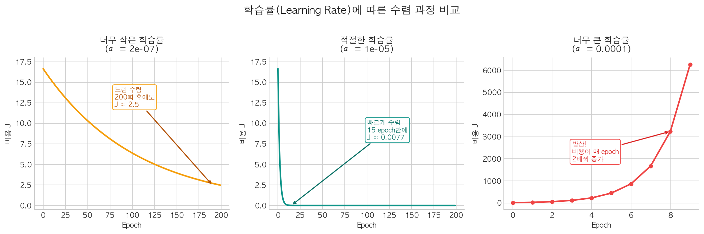

[지난 글에서](/ml/cost-function/) 비용 함수가 모델의 "성적표"라고 했다. MSE라는 숫자 하나로 모델이 얼마나 틀렸는지 측정할 수 있게 됐다. 남은 질문은 하나다 — **이 숫자를 어떻게 줄이는가?**

비용 함수 J(w, b)의 U자 커브를 떠올려보자. 바닥이 최적의 파라미터다. 그런데 처음에는 우리가 이 커브의 어디에 서 있는지 모른다. 바닥이 왼쪽인지 오른쪽인지도 모른다. 이 상태에서 바닥을 찾아가는 방법이 **경사하강법(Gradient Descent)**이다.

아이디어는 놀랍도록 단순하다. **현재 위치에서 기울기(경사)를 계산하고, 내리막 방향으로 한 걸음 이동한다.** 이걸 반복하면 결국 바닥에 도달한다.

---

## 직관: 안개 낀 산에서 내려오기

경사하강법을 이해하는 가장 쉬운 비유는 이것이다.

> 안개가 짙게 낀 산 위에 서 있다. 사방이 안 보여서 정상이 어딘지, 계곡이 어딘지 알 수 없다. 할 수 있는 건 딱 하나 — **발밑의 경사를 느끼고, 내리막 방향으로 한 발 내딛는 것**이다. 이걸 반복하면 결국 계곡(최저점)에 도달한다.

이게 경사하강법의 전부다. "발밑의 경사"가 미분값(gradient)이고, "한 발"이 학습률(learning rate)이다.

---

## 수식으로 표현하면

파라미터 w를 업데이트하는 규칙은 다음과 같다.

> **w := w − α × ∂J/∂w**
>
> - **w**: 현재 파라미터 값
> - **α** (알파): 학습률(learning rate) — 한 번에 얼마나 이동할지
> - **∂J/∂w**: 비용 함수 J를 w에 대해 미분한 값 — 현재 위치의 기울기

b도 동일한 방식으로 업데이트한다.

> **b := b − α × ∂J/∂b**

왜 **빼는** 건가? 기울기가 양수라는 건 "w를 키우면 J가 올라간다"는 뜻이다. 우리는 J를 줄이고 싶으니 반대 방향(-)으로 가야 한다. 기울기가 음수면 w를 키워야 J가 줄어드니 자연스럽게 양의 방향으로 이동한다.

<div style="background: #f0f4ff; border-left: 4px solid #3182f6; padding: 16px 20px; margin: 20px 0; border-radius: 4px;">
  <strong>💡 := 표기</strong><br>
  수학에서 <code>=</code>는 "같다"를 의미하지만, 여기서 <code>:=</code>는 "업데이트한다"는 뜻이다. 오른쪽 값을 계산해서 왼쪽에 대입한다. 프로그래밍의 <code>w = w - alpha * gradient</code>와 같다.
</div>

---

## MSE의 편미분 유도

[비용 함수 글](/ml/cost-function/)에서 MSE를 이렇게 정의했다.

```
J(w, b) = (1/n) × Σᵢ(ŷᵢ − yᵢ)²
         = (1/n) × Σᵢ(wxᵢ + b − yᵢ)²
```

이걸 w와 b에 대해 각각 편미분하면:

```
∂J/∂w = (2/n) × Σᵢ(wxᵢ + b − yᵢ) × xᵢ
∂J/∂b = (2/n) × Σᵢ(wxᵢ + b − yᵢ)
```

복잡해 보이지만, 코드로 옮기면 단순하다.

```python
import numpy as np

def compute_gradients(X, y, w, b):
    n = len(y)
    y_pred = w * X + b
    error = y_pred - y             # 각 포인트의 오차
    dw = (2/n) * np.sum(error * X)  # w에 대한 기울기
    db = (2/n) * np.sum(error)      # b에 대한 기울기
    return dw, db
```

`error * X`에서 각 오차에 해당 x값을 곱하는 이유는, x가 큰 데이터 포인트의 오차가 w에 더 큰 영향을 미치기 때문이다.

---

## 경사하강법 구현

이제 전체 알고리즘을 처음부터 구현해보자.

```python
import numpy as np

# 데이터 (선형 회귀 글과 동일)
X = np.array([60, 75, 85, 95, 110, 120, 140, 155], dtype=float)
y = np.array([2.1, 2.8, 3.2, 3.6, 4.1, 4.5, 5.2, 5.8])

# 초기값
w = 0.0
b = 0.0
learning_rate = 0.00001  # 학습률
epochs = 5000            # 반복 횟수

# 학습 기록
history = []

for epoch in range(epochs):
    # 1. 예측
    y_pred = w * X + b

    # 2. 비용 계산
    cost = np.mean((y_pred - y) ** 2)

    # 3. 기울기 계산
    n = len(y)
    dw = (2/n) * np.sum((y_pred - y) * X)
    db = (2/n) * np.sum(y_pred - y)

    # 4. 파라미터 업데이트
    w = w - learning_rate * dw
    b = b - learning_rate * db

    if epoch % 1000 == 0:
        history.append((epoch, cost, w, b))
        print(f"Epoch {epoch:5d} | Cost: {cost:.6f} | w: {w:.6f} | b: {b:.6f}")

print(f"\n최종 결과: w = {w:.4f}, b = {b:.4f}")
```

```
Epoch     0 | Cost: 15.100625 | w: 0.007549 | b: 0.000072
Epoch  1000 | Cost: 0.014498 | w: 0.037483 | b: 0.003699
Epoch  2000 | Cost: 0.005720 | w: 0.038459 | b: -0.027949
Epoch  3000 | Cost: 0.003474 | w: 0.038527 | b: -0.047975
Epoch  4000 | Cost: 0.002901 | w: 0.038317 | b: -0.060634

최종 결과: w = 0.0381, b = -0.0685
```

5000번 반복 후 w ≈ 0.038, b ≈ -0.069. [선형 회귀 글](/ml/linear-regression/)에서 정규 방정식으로 구한 정확한 해(w = 0.0380, b = -0.0818)에 상당히 가깝지만, 아직 완전히 수렴하지는 않았다. 반복 횟수를 늘리거나 학습률을 조정하면 더 가까워진다.

<div style="background: #f0fff4; border-left: 4px solid #51cf66; padding: 16px 20px; margin: 20px 0; border-radius: 4px;">
  <strong>✅ 정규 방정식 vs 경사하강법</strong><br>
  정규 방정식은 한 번에 정확한 해를 구하지만, 데이터가 클수록 느려진다 (O(n³)). 경사하강법은 반복이 필요하지만 데이터 크기에 관계없이 효율적이다. 현실의 대규모 데이터에서는 경사하강법이 사실상 유일한 선택지다.
</div>

---

## 학습률(Learning Rate)의 역할

학습률 α는 경사하강법에서 **가장 중요한 하이퍼파라미터**다. 한 번에 얼마나 이동할지를 결정한다.

### 학습률이 너무 작으면

수렴이 극도로 느려진다. 바닥까지 도달하긴 하지만, 수만 번을 반복해야 할 수 있다. 시간과 컴퓨팅 자원의 낭비다.

### 학습률이 너무 크면

바닥을 지나쳐 반대편으로 튕겨나간다. 심하면 비용이 줄어들지 않고 오히려 발산(diverge)한다 — J가 무한대로 커진다.

### 적절한 학습률이면

처음에는 큰 보폭으로 빠르게 내려오다가, 바닥에 가까워질수록 기울기가 작아지면서 자연스럽게 보폭이 줄어든다. 별도의 감속 장치 없이도 알아서 속도가 조절되는 셈이다.


<p align="center" style="color: #888; font-size: 13px;"><em>학습률이 너무 작으면 수렴이 느리고, 너무 크면 발산한다. 적절한 학습률에서 효율적으로 수렴한다.</em></p>

코드로 확인해보자.

```python
learning_rates = [0.000001, 0.00001, 0.0001]

for lr in learning_rates:
    w, b = 0.0, 0.0
    for _ in range(3000):
        y_pred = w * X + b
        dw = (2/len(y)) * np.sum((y_pred - y) * X)
        db = (2/len(y)) * np.sum(y_pred - y)
        w -= lr * dw
        b -= lr * db
    cost = np.mean((w * X + b - y) ** 2)
    print(f"lr={lr:.6f} → w={w:.4f}, b={b:.4f}, cost={cost:.6f}")
```

```
lr=0.000001 → w=0.0323, b=0.0003, cost=0.174549
lr=0.000010 → w=0.0385, b=-0.0413, cost=0.004183
lr=0.000100 → w=nan, b=nan, cost=nan
```

학습률 0.0001은 이 데이터에서 발산했다. 0.00001이 적절한 범위다. 실무에서는 보통 0.01, 0.001, 0.0001 등을 시도해보며 가장 안정적으로 수렴하는 값을 찾는다.

<div style="background: #fff3f0; border-left: 4px solid #ff6b6b; padding: 16px 20px; margin: 20px 0; border-radius: 4px;">
  <strong>⚠️ 주의: Feature Scaling</strong><br>
  위 예제에서 학습률이 0.00001처럼 극히 작은 이유는, 입력값(면적)의 스케일이 60~155로 크기 때문이다. 입력을 <strong>정규화(normalization)</strong>하면 학습률을 0.01 수준으로 올릴 수 있고, 수렴도 훨씬 빨라진다. Feature scaling은 경사하강법의 거의 필수 전처리다.
</div>

---

## 경사하강법의 변형들

지금까지 다룬 건 **배치 경사하강법(Batch Gradient Descent)** — 매 업데이트마다 전체 데이터를 사용한다. 데이터가 수백만 건이면 한 번 업데이트에 수백만 개를 계산해야 해서 매우 느리다.

이 문제를 해결하는 변형들이 있다.

| 변형 | 데이터 사용량 | 장점 | 단점 |
|------|-------------|------|------|
| **배치(Batch)** | 전체 데이터 | 안정적 수렴 | 대규모 데이터에서 느림 |
| **확률적(SGD)** | 1개 | 매우 빠름 | 불안정한 수렴 (진동) |
| **미니배치(Mini-batch)** | n개 (32, 64, 128 등) | 속도 + 안정성 균형 | 배치 크기 튜닝 필요 |

실무에서는 **미니배치 경사하강법**이 표준이다. 딥러닝 프레임워크(PyTorch, TensorFlow)의 기본값도 미니배치다.

```python
# 미니배치 경사하강법 예시
batch_size = 4

for epoch in range(1000):
    # 데이터를 랜덤하게 셔플
    indices = np.random.permutation(len(y))

    for start in range(0, len(y), batch_size):
        batch_idx = indices[start:start + batch_size]
        X_batch = X[batch_idx]
        y_batch = y[batch_idx]

        y_pred = w * X_batch + b
        dw = (2/len(y_batch)) * np.sum((y_pred - y_batch) * X_batch)
        db = (2/len(y_batch)) * np.sum(y_pred - y_batch)
        w -= learning_rate * dw
        b -= learning_rate * db
```

<div style="background: #f0f4ff; border-left: 4px solid #3182f6; padding: 16px 20px; margin: 20px 0; border-radius: 4px;">
  <strong>💡 SGD라는 이름의 혼란</strong><br>
  "SGD(Stochastic Gradient Descent)"라는 용어가 실무에서는 미니배치까지 포함해서 통칭으로 쓰이는 경우가 많다. PyTorch의 <code>torch.optim.SGD</code>도 실제로는 미니배치 방식이다. 문맥에 따라 "순수 SGD(1개씩)"인지 "통칭 SGD"인지 구분해야 한다.
</div>

---

## 수렴 판정: 언제 멈출 것인가

경사하강법을 언제 멈춰야 할까? 세 가지 기준이 일반적이다.

1. **최대 반복 횟수(epochs)**: 미리 정한 횟수만큼 반복 후 중단. 가장 단순하지만 조기 종료가 안 됨
2. **비용 변화량**: 연속된 epoch 간 비용 차이가 threshold 이하면 중단 (예: |J_prev - J_curr| < 1e-7)
3. **기울기 크기**: 기울기의 절대값이 거의 0이면 바닥에 도달한 것이므로 중단

```python
tolerance = 1e-7
prev_cost = float('inf')

for epoch in range(100000):
    y_pred = w * X + b
    cost = np.mean((y_pred - y) ** 2)

    # 수렴 판정
    if abs(prev_cost - cost) < tolerance:
        print(f"수렴! Epoch {epoch}, Cost: {cost:.8f}")
        break

    prev_cost = cost
    # ... (기울기 계산 및 업데이트)
```

---

## 마치며

경사하강법의 핵심은 결국 한 문장이다 — **기울기의 반대 방향으로 조금씩 이동한다.** 이 단순한 아이디어가 선형 회귀뿐 아니라 로지스틱 회귀, 신경망, 대규모 언어 모델까지 모든 ML/DL 학습의 기반이다.

이 시리즈에서 ML의 핵심 흐름을 따라왔다. [데이터에 직선을 맞추고](/ml/linear-regression/), [오차를 측정하는 기준을 정의하고](/ml/cost-function/), 그 오차를 줄이는 알고리즘을 이해했다. 이 세 가지 — 모델, 비용 함수, 최적화 — 가 ML의 뼈대다. 앞으로 만나는 어떤 복잡한 모델이든 이 구조 위에서 동작한다.

## 참고자료

- [Andrew Ng — Machine Learning Specialization: Gradient Descent (Coursera)](https://www.coursera.org/specializations/machine-learning-introduction)
- [3Blue1Brown — Gradient Descent, How Neural Networks Learn (YouTube)](https://www.youtube.com/watch?v=IHZwWFHWa-w)
- [Sebastian Ruder — An Overview of Gradient Descent Optimization Algorithms](https://arxiv.org/abs/1609.04747)
- [Scikit-learn SGDRegressor Documentation](https://scikit-learn.org/stable/modules/generated/sklearn.linear_model.SGDRegressor.html)
