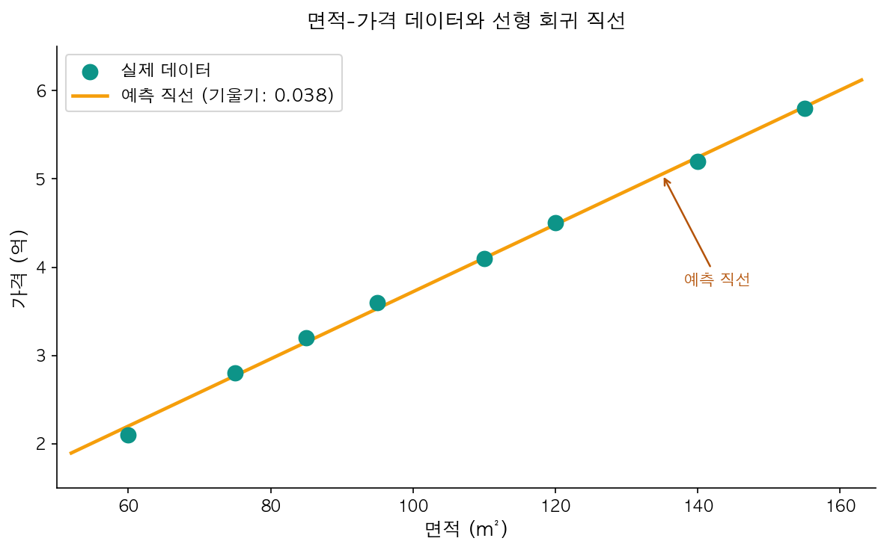
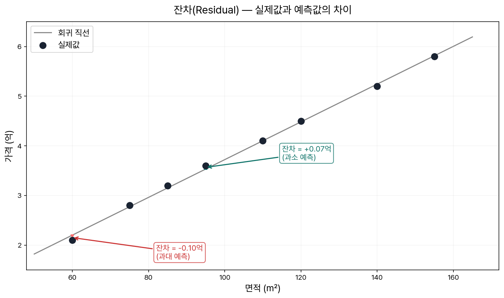
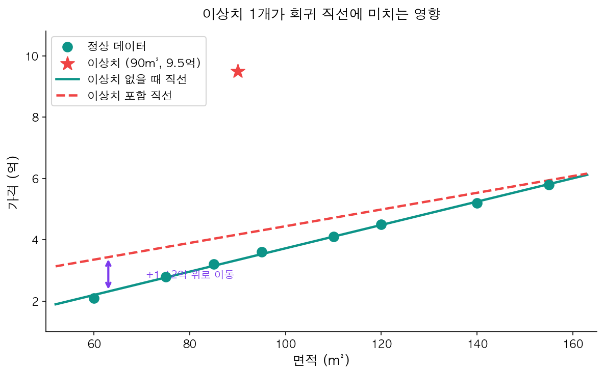

집값을 예측해야 한다고 해보자. 수백 개의 거래 기록이 있고, 각 집의 면적과 거래가가 담겨 있다. 이 데이터를 보고 "이 집 크기면 얼마 정도 하겠다"를 예측하려면 어떻게 해야 할까?

[지난 글에서 살펴봤듯이](/ml/overview/) 이 문제는 지도학습(Supervised Learning) 중 **회귀(Regression)** 문제다. 정답이 있는 데이터로 모델을 학습시켜, 새로운 입력에 대한 연속적인 출력값을 예측한다.

이 문제에 대한 가장 단순하고 직관적인 답이 **선형 회귀(Linear Regression)**다. 단순하다고 얕볼 수 없다. 선형 회귀 안에는 ML의 핵심 개념들 — 가설 함수, 파라미터 학습, 오차 측정, 최적화 — 이 모두 녹아 있다. 복잡한 신경망도 결국 이 원리 위에서 동작한다.

---

## 선형 회귀란 무엇인가

선형 회귀의 아이디어는 단순하다. **데이터에 가장 잘 맞는 직선(line)을 찾는 것**이다.

면적(x)과 집값(y) 데이터가 있을 때, 이 점들 사이를 가장 잘 관통하는 직선을 그으면 새로운 면적에 대한 가격을 예측할 수 있다.


<p align="center" style="color: #888; font-size: 13px;"><em>8개 데이터 포인트에 가장 잘 맞는 선형 회귀 직선. 기울기(w)가 면적 1m²당 가격 변화량을 나타낸다.</em></p>

수학적으로 이 직선은 다음과 같이 표현한다.

> **y = wx + b**
>
> - **y**: 예측하려는 값 (집값)
> - **x**: 입력 특성 (면적)
> - **w**: 기울기(weight, 가중치) — x가 1 증가할 때 y의 변화량
> - **b**: 절편(bias) — x가 0일 때의 y값

ML에서는 이 수식을 **가설 함수(Hypothesis Function)**라고 부른다. 처음에는 낯선 용어인데, 결국 "데이터를 이 수식으로 설명할 수 있다"는 가설이라는 뜻이다.

그럼 **학습(Learning)**이란 무엇인가? w와 b를 데이터에 맞게 조정하는 과정이다. 처음에는 아무 직선이나 그어놓고, 데이터를 보며 점점 더 잘 맞는 직선으로 수정해나간다. 이게 모델이 "학습"한다는 말의 실제 의미다.

---

## 가설 함수를 코드로 표현하면

scikit-learn으로 선형 회귀를 학습시키는 건 단 몇 줄이면 된다.

```python
import numpy as np
from sklearn.linear_model import LinearRegression

# 면적(m²)과 가격(억) 데이터
area = np.array([60, 75, 85, 95, 110, 120, 140, 155]).reshape(-1, 1)
price = np.array([2.1, 2.8, 3.2, 3.6, 4.1, 4.5, 5.2, 5.8])

model = LinearRegression()
model.fit(area, price)

print(f"기울기(w): {model.coef_[0]:.4f}")    # 0.0313
print(f"절편(b): {model.intercept_:.4f}")     # 0.2087
```

`fit()` 한 줄이 전부다. 내부적으로 sklearn은 데이터를 보고 오차를 가장 줄이는 w와 b를 계산한다.

결과를 해석해보면: 기울기가 약 0.031이므로, 면적이 1m² 늘어날 때마다 집값이 약 310만 원 올라간다고 모델이 학습했다. 이제 새로운 면적을 넣으면 가격을 예측할 수 있다.

```python
new_area = np.array([[100]])
predicted = model.predict(new_area)
print(f"100m² 예측 가격: {predicted[0]:.2f}억")  # 3.34억
```

`predict()`가 내부적으로 하는 일은 단순하다. `y = 0.0313 × 100 + 0.2087 = 3.34`를 계산하는 것이다.

---

## 좋은 직선을 어떻게 고를까 — 잔차(Residual)

잠깐, 생각해보면 직선을 "데이터에 가장 잘 맞게" 그린다는 게 정확히 무슨 기준일까? 어떤 직선이 더 좋은 직선인가?

기준은 **잔차(Residual)**다. 잔차는 실제값과 예측값의 차이다.

```
잔차 = 실제값(y) - 예측값(ŷ)
```

각 데이터 포인트마다 잔차가 존재한다. 아래 그림에서 수직 점선이 잔차다.


<p align="center" style="color: #888; font-size: 13px;"><em>각 데이터 포인트에서 회귀 직선까지의 수직 거리가 잔차다. 빨간 점선이 잔차를 나타낸다.</em></p>

잔차가 클수록 그 데이터 포인트를 잘 못 맞추고 있다는 뜻이다. 모든 잔차를 합쳐서 최소화하는 직선이 가장 좋은 직선이다.

실제 코드로 잔차를 확인해보면:

```python
y_pred = model.predict(area)
residuals = price - y_pred

for i in range(len(price)):
    print(
        f"면적 {area[i][0]:3.0f}m² | "
        f"실제: {price[i]:.1f}억 | "
        f"예측: {y_pred[i]:.2f}억 | "
        f"잔차: {residuals[i]:+.2f}억"
    )
```

```
면적  60m² | 실제: 2.1억 | 예측: 2.09억 | 잔차: +0.01억
면적  75m² | 실제: 2.8억 | 예측: 2.56억 | 잔차: +0.24억
면적  85m² | 실제: 3.2억 | 예측: 2.87억 | 잔차: +0.33억
면적  95m² | 실제: 3.6억 | 예측: 3.18억 | 잔차: +0.42억
면적 110m² | 실제: 4.1억 | 예측: 3.65억 | 잔차: +0.45억
면적 120m² | 실제: 4.5억 | 예측: 3.96억 | 잔차: +0.54억
면적 140m² | 실제: 5.2억 | 예측: 4.59억 | 잔차: +0.61억
면적 155m² | 실제: 5.8억 | 예측: 5.06억 | 잔차: +0.74억
```

<div style="background: #f0f4ff; border-left: 4px solid #3182f6; padding: 16px 20px; margin: 20px 0; border-radius: 4px;">
  <strong>💡 참고</strong><br>
  잔차를 단순히 합치면 양수와 음수가 상쇄되어 오차가 없는 것처럼 보일 수 있다. 그래서 실제로는 잔차를 <strong>제곱</strong>해서 더하는 잔차 제곱합(RSS)을 최소화한다. 이게 바로 다음 글에서 다룰 <strong>비용 함수(Cost Function)</strong>다.
</div>

---

## 최적 파라미터 찾기 — 정규 방정식

잔차를 최소화하는 w와 b를 어떻게 구할까?

수학적으로 이 문제의 해(解)가 존재한다. **정규 방정식(Normal Equation)**이라 불리는 공식인데, 주어진 데이터에 대해 잔차 제곱합을 가장 작게 만드는 w를 직접 계산한다.

```
w = (XᵀX)⁻¹ Xᵀy
```

복잡해 보이지만, "행렬 연산으로 최적의 w를 한 번에 구한다"는 뜻이다. numpy로 직접 계산해보면:

```python
# 편향 항(bias)을 추가한 입력 행렬 X 구성 — [1, x] 형태
X = np.hstack([np.ones((len(area), 1)), area])

# 정규 방정식: w = (XᵀX)⁻¹ Xᵀy
w = np.linalg.inv(X.T @ X) @ X.T @ price

print(f"편향(b): {w[0]:.4f}")    # 0.2087
print(f"기울기(w): {w[1]:.4f}")  # 0.0313
```

sklearn의 `fit()`이 돌려준 것과 완전히 동일한 값이다. sklearn 내부에서 이 계산(또는 수치적으로 안정된 유사 방법)을 수행한다.

<div style="background: #fff3f0; border-left: 4px solid #ff6b6b; padding: 16px 20px; margin: 20px 0; border-radius: 4px;">
  <strong>⚠️ 주의</strong><br>
  정규 방정식은 데이터 수(n)가 많아질수록 행렬 역행렬 계산이 O(n³)으로 느려진다. 데이터가 수십만 건 이상이면 정규 방정식보다 <strong>경사하강법(Gradient Descent)</strong>이 훨씬 효율적이다. 이 시리즈 3번 글에서 자세히 다룬다.
</div>

---

## 실전 예제: California Housing 데이터

간단한 예제를 넘어서, sklearn에 내장된 캘리포니아 주택 데이터로 end-to-end 예제를 만들어보자.

```python
from sklearn.datasets import fetch_california_housing
from sklearn.model_selection import train_test_split
from sklearn.linear_model import LinearRegression
from sklearn.metrics import r2_score, mean_squared_error
import numpy as np

# 데이터 로드
housing = fetch_california_housing()

# 단순화를 위해 중위 소득(MedInc) 특성 하나만 사용
X = housing.data[:, [0]]  # MedInc: 지역의 중위 소득 (만 달러 단위)
y = housing.target         # 중위 주택 가격 (십만 달러 단위)

# 훈련/테스트 분리
X_train, X_test, y_train, y_test = train_test_split(
    X, y, test_size=0.2, random_state=42
)

# 모델 학습
model = LinearRegression()
model.fit(X_train, y_train)

# 예측 및 평가
y_pred = model.predict(X_test)

print(f"기울기(w): {model.coef_[0]:.4f}")                              # 0.4185
print(f"절편(b):   {model.intercept_:.4f}")                            # 0.4496
print(f"R² 스코어: {r2_score(y_test, y_pred):.3f}")                    # 0.468
print(f"RMSE:      {np.sqrt(mean_squared_error(y_test, y_pred)):.3f}") # 0.790
```

R² 스코어가 0.468이다. 중위 소득 하나만으로 집값을 예측했으니 낮지 않은 편이지만, 완벽하지는 않다. 집값에는 위치, 방 수, 건물 연도 등 수많은 요소가 영향을 미치기 때문이다. 특성을 여러 개 사용하는 **다중 선형 회귀(Multiple Linear Regression)**가 이 문제를 해결한다 — 이 시리즈 4번 글에서 다룬다.

<div style="background: #f8f9fa; border: 1px solid #e9ecef; padding: 20px; margin: 24px 0; border-radius: 8px;">
  <strong>📌 핵심 요약</strong><br><br>
  <ul style="margin: 0; padding-left: 20px;">
    <li><code>fit()</code>: 훈련 데이터로 최적의 w, b를 학습</li>
    <li><code>predict()</code>: y = wx + b 계산으로 예측값 반환</li>
    <li><strong>R² 스코어</strong>: 모델이 데이터의 변동성을 얼마나 설명하는지 (0~1, 높을수록 좋음)</li>
    <li><strong>RMSE</strong>: 평균 예측 오차의 크기 (낮을수록 좋음, 단위 동일)</li>
  </ul>
</div>

---

## 선형 회귀의 4가지 가정

선형 회귀는 강력하지만, 데이터가 특정 조건을 만족할 때 잘 동작한다. 이 조건을 모르고 쓰다가 황당한 결과를 얻는 경우가 많다.

| 가정 | 의미 | 위반 시 증상 |
|------|------|-------------|
| **선형성** | x와 y 사이에 선형 관계가 있어야 함 | 잔차 플롯에서 곡선 패턴 |
| **독립성** | 각 데이터 포인트가 서로 독립 | 시계열에서 자기상관 발생 |
| **등분산성** | 잔차의 분산이 x 범위에서 일정 | 잔차 플롯에서 부채꼴 모양 |
| **정규성** | 잔차가 정규 분포를 따름 | Q-Q 플롯에서 이탈 |

이 가정들을 **잔차 플롯(Residual Plot)**으로 빠르게 진단할 수 있다.

```python
import matplotlib.pyplot as plt

y_pred_train = model.predict(X_train)
residuals = y_train - y_pred_train

plt.figure(figsize=(8, 4))
plt.scatter(y_pred_train, residuals, alpha=0.2, s=5, color='steelblue')
plt.axhline(y=0, color='red', linestyle='--', linewidth=1)
plt.xlabel('예측값 (ŷ)')
plt.ylabel('잔차 (y - ŷ)')
plt.title('잔차 플롯 (Residual Plot)')
plt.tight_layout()
plt.show()
```

잔차가 예측값 전 범위에 걸쳐 0 주변으로 균등하게 분포하면 가정이 충족된 것이다. 패턴이 보이거나(U자, 부채꼴) 한쪽으로 치우쳐 있으면 가정이 위반된 신호다.

<div style="background: #f0fff4; border-left: 4px solid #51cf66; padding: 16px 20px; margin: 20px 0; border-radius: 4px;">
  <strong>✅ 팁</strong><br>
  실전에서는 가정을 완벽히 만족하는 데이터가 거의 없다. 가정 위반이 심하면 변수 변환(로그 변환 등)이나 다른 모델을 고려해야 한다. 하지만 가정 위반 여부를 <strong>확인하는 습관</strong> 자체가 중요하다. 잔차 플롯은 항상 그려보자.
</div>

---

## 흔한 실수와 한계

### 비선형 데이터에 억지로 직선 끼워 맞추기

가장 많이 하는 실수다. 실제 데이터가 곡선 패턴을 보이는데 선형 회귀를 적용하면, 아무리 학습해도 잘 맞지 않는다. 잔차 플롯에서 U자 또는 역U자 패턴이 보이면 선형 가정이 맞지 않는다는 신호다.

이 경우 다항 회귀(Polynomial Regression)를 쓰거나 변수를 로그 변환하는 방법을 고려한다.

### 이상치(Outlier) 1개가 직선을 망친다

선형 회귀는 이상치에 매우 민감하다. 잔차를 제곱해서 최소화하기 때문에, 극단적인 값 하나가 전체 직선을 그쪽으로 끌어당긴다.


<p align="center" style="color: #888; font-size: 13px;"><em>빨간 별이 이상치 1개. 이상치 하나만으로 회귀 직선 전체가 크게 왜곡된다.</em></p>

[머신러닝 프로젝트 워크플로우](/ml/workflow/)에서 EDA를 강조하는 이유 중 하나가 바로 이것이다. 데이터를 먼저 시각화해서 이상치를 파악하는 게 모델을 학습하기 전에 꼭 거쳐야 하는 단계다.

### 훈련 데이터 성능만 보는 착각

`model.fit(X_train, y_train)` 후 `model.score(X_train, y_train)`을 보면 실제보다 좋게 나올 수 있다. 반드시 테스트 데이터(`X_test, y_test`)로 성능을 검증해야 한다. 항상 `train_test_split()`을 사용하고, **테스트 성능 기준**으로 모델을 평가하자.

---

## 마치며

선형 회귀는 단순하지만, 그 단순함이 강점이다. 어떤 특성이 예측에 얼마나 기여하는지 w 값만 봐도 직관적으로 파악할 수 있다. 블랙박스인 복잡한 모델들과 달리, 해석 가능성(interpretability)이 높다.

다음 글에서는 "잔차를 최소화한다"는 말을 수학적으로 정확하게 정의하는 **비용 함수(Cost Function)**를 다룬다. 왜 잔차를 제곱하는지, 왜 평균을 취하는지, 이 이유를 이해하고 나면 이후 경사하강법과 신경망으로 이어지는 흐름이 자연스럽게 보이기 시작한다.

## 참고자료

- [Scikit-learn LinearRegression Documentation](https://scikit-learn.org/stable/modules/generated/sklearn.linear_model.LinearRegression.html)
- [Andrew Ng — Machine Learning Specialization (Coursera)](https://www.coursera.org/specializations/machine-learning-introduction)
- [StatQuest: Linear Regression, Clearly Explained (YouTube)](https://www.youtube.com/watch?v=nk2CQITm_eo)
- [California Housing Dataset](https://scikit-learn.org/stable/datasets/real_world.html#california-housing-dataset)
