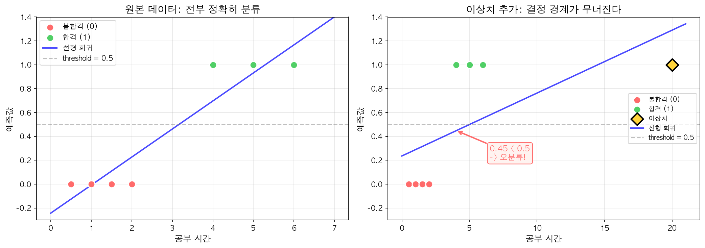
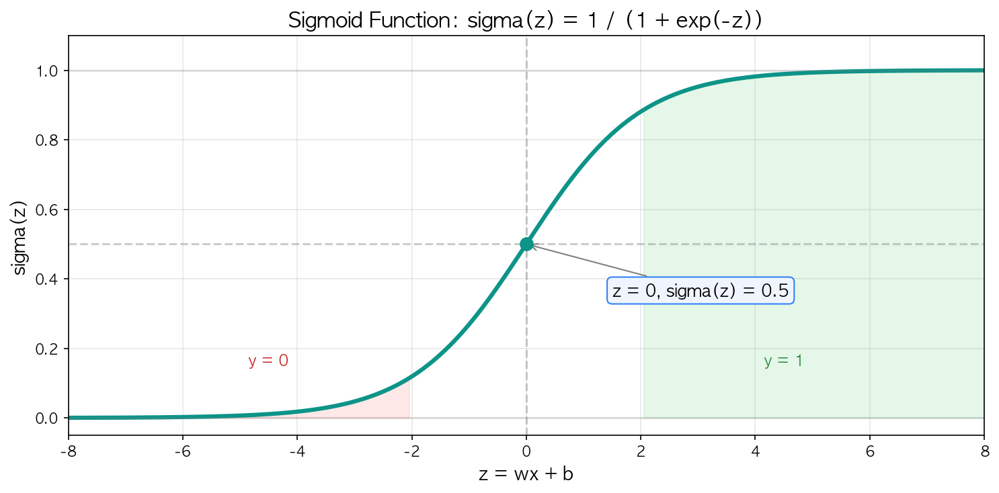
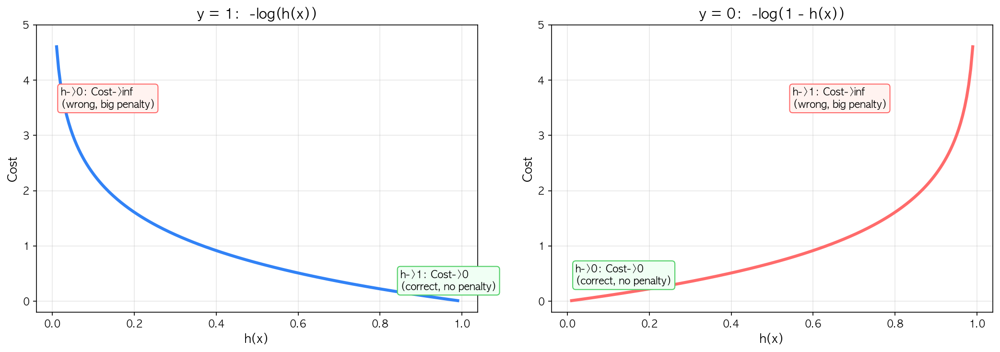
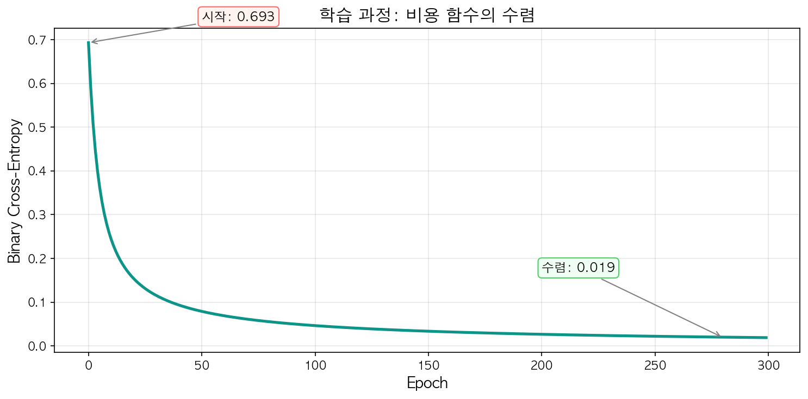
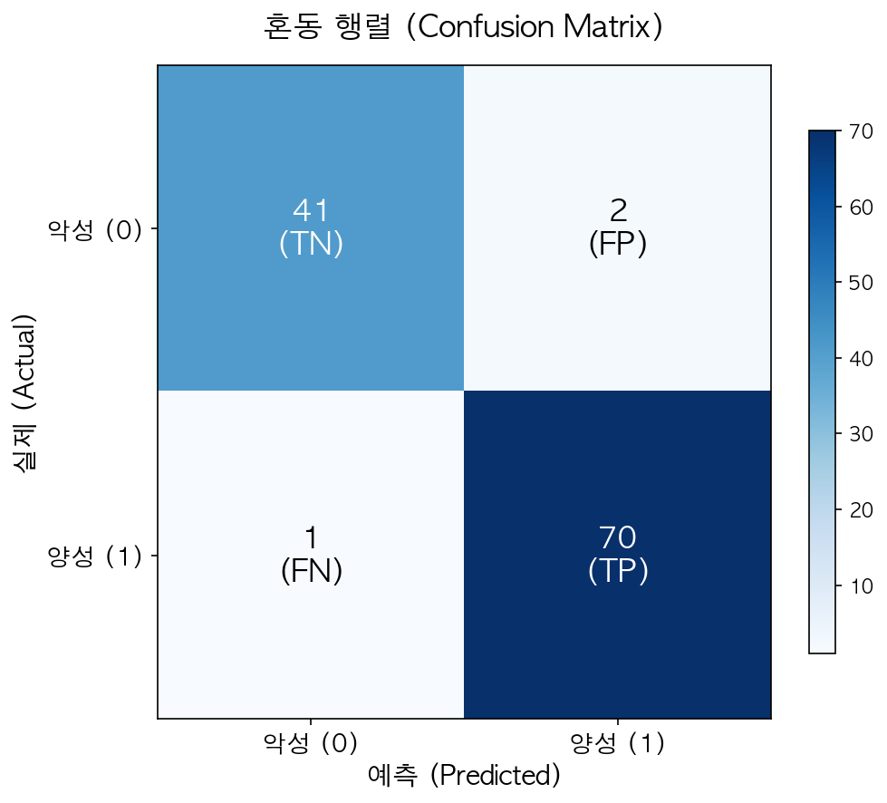

[이전 글](/ml/multiple-linear-regression/)에서 변수를 여러 개로 늘려 더 정확한 예측 모델을 만들었다. 선형 회귀, 비용 함수, 경사하강법, Feature Scaling — 하나의 흐름으로 연결되는 이 개념들은 모두 **연속적인 값을 예측**하는 회귀 문제를 다뤘다. 그런데 현실에서는 다른 종류의 질문이 훨씬 많다.

"이 이메일이 스팸인가, 아닌가?"
"이 종양이 양성인가, 악성인가?"
"이 고객이 이탈할 것인가, 아닌가?"

Yes 또는 No. 0 또는 1. 이런 문제를 **분류(Classification)** 라고 한다. 그리고 이 분류 문제를 푸는 가장 기본적인 모델이 **로지스틱 회귀(Logistic Regression)** 다. 직감적으로 "선형 회귀를 살짝 변형하면 되지 않을까?"라는 생각이 드는데 — 실제로 그 직감이 맞다. 다만, **어디를 어떻게 변형하는지**가 핵심이다.

---

## 왜 선형 회귀로는 분류할 수 없을까?

가장 먼저 떠오르는 아이디어: 선형 회귀의 출력이 0.5 이상이면 1, 미만이면 0으로 분류하면 되지 않을까?

간단한 예로 확인해보자. 공부 시간(x)에 따른 합격 여부(y = 0 또는 1) 데이터가 있다.

```python
import numpy as np
from sklearn.linear_model import LinearRegression

x = np.array([0.5, 1, 1.5, 2, 4, 5, 6]).reshape(-1, 1)
y = np.array([0, 0, 0, 0, 1, 1, 1])

model = LinearRegression()
model.fit(x, y)
print(f"예측값: {np.round(model.predict(x), 2)}")
# 예측값: [-0.13 -0.01  0.11  0.23  0.7   0.93  1.17]
```

threshold 0.5를 기준으로 나누면, 2시간 이하는 불합격(< 0.5), 4시간 이상은 합격(≥ 0.5)으로 전부 맞게 분류된다. 꽤 잘 동작하는 것처럼 보인다.

문제는 **이상치(outlier)** 가 들어오면 터진다. 공부 시간이 20시간인 합격자 데이터 하나를 추가해보자.

```python
x2 = np.array([0.5, 1, 1.5, 2, 4, 5, 6, 20]).reshape(-1, 1)
y2 = np.array([0, 0, 0, 0, 1, 1, 1, 1])

model2 = LinearRegression()
model2.fit(x2, y2)
print(f"예측값: {np.round(model2.predict(x2), 2)}")
# 예측값: [0.26  0.29  0.32  0.34  0.45  0.5   0.55  1.29]
```

이상치 하나에 **직선이 눌려 평평해지면서**, x=4인 합격자의 예측값이 0.70에서 0.45로 떨어졌다. 기존에 맞던 것까지 틀리게 된 것이다.



선형 회귀가 분류에 실패하는 근본 원인은 두 가지다:

1. **출력 범위**: 선형 회귀의 출력은 −∞ ~ +∞다. 확률(0~1)이 아니라서 해석이 불가능하다
2. **이상치 민감도**: 직선 하나가 모든 데이터를 관통해야 하므로, 극단적 데이터 하나에 전체가 흔들린다

분류에는 "출력을 0과 1 사이로 가두는" 새로운 장치가 필요하다.

---

## 시그모이드 함수: 실수를 확률로 바꾸는 장치

**시그모이드 함수(Sigmoid Function)** 는 실수 전체를 (0, 1) 범위로 매핑하는 함수다.

> **σ(z) = 1 / (1 + e⁻ᶻ)**



핵심 성질을 정리하면:

| z 값 | σ(z) | 해석 |
|------|------|------|
| z → +∞ | → 1 | 거의 확실히 양성 |
| z = 0 | 0.5 | 반반 |
| z → −∞ | → 0 | 거의 확실히 음성 |

z가 0에서 멀어질수록 출력이 0 또는 1에 빠르게 수렴한다. "확신이 강할수록 극단에 가까워지는" 직관적인 형태다.

### "Logistic"이라는 이름의 유래

시그모이드가 왜 분류에 자연스러운 선택인지, odds와 logit의 관계에서 이해할 수 있다.

어떤 사건이 일어날 확률이 p라면, **승산(Odds)** 은 "일어날 확률 / 일어나지 않을 확률"이다.

> **Odds = p / (1 − p)**

합격 확률이 0.8이면, Odds = 0.8 / 0.2 = 4. "불합격 1번당 합격 4번"이라는 뜻이다.

여기에 로그를 씌운 것이 **로짓(Logit)**:

> **logit(p) = log(p / (1 − p))**

Logit의 범위는 −∞ ~ +∞다. 이걸 선형 모델 wx + b와 같다고 놓으면:

```
log(p / (1 − p)) = wx + b
```

이 식을 p에 대해 풀면 — 바로 시그모이드가 나온다:

```
p = 1 / (1 + e^(-(wx + b))) = σ(wx + b)
```

시그모이드는 "억지로 갖다 붙인 함수"가 아니라, **확률과 선형 모델을 잇는 자연스러운 다리**인 셈이다.

<div style="background: #f0f4ff; border-left: 4px solid #3182f6; padding: 16px 20px; margin: 20px 0; border-radius: 4px;">
  <strong>💡 시그모이드의 미분</strong><br>
  σ'(z) = σ(z) × (1 − σ(z)). 미분 결과가 자기 자신으로 표현된다. 이 성질 덕분에 경사하강법 계산이 깔끔해진다. 뒤에서 직접 확인한다.
</div>

---

## 로지스틱 회귀 모델

[선형 회귀](/ml/linear-regression/)의 가설 함수 h(x) = wx + b에 시그모이드를 씌우면, 로지스틱 회귀가 된다.

> **h(x) = σ(wx + b) = 1 / (1 + e⁻⁽ʷˣ⁺ᵇ⁾)**

이 출력을 **"y = 1일 확률"** 로 해석한다:

```
P(y = 1 | x) = h(x)
P(y = 0 | x) = 1 − h(x)
```

분류 기준은 단순하다:

```
h(x) ≥ 0.5 → 클래스 1로 예측
h(x) < 0.5 → 클래스 0으로 예측
```

h(x) = 0.5가 되는 지점, 즉 **wx + b = 0**이 **결정 경계(Decision Boundary)** 다. 이 경계를 기준으로 양쪽이 갈린다. 결정 경계에 대한 자세한 분석은 다음 글에서 다룬다.

<div style="background: #f0fff4; border-left: 4px solid #51cf66; padding: 16px 20px; margin: 20px 0; border-radius: 4px;">
  <strong>✅ 핵심 차이</strong><br>
  선형 회귀: h(x) = wx + b → 연속값 출력<br>
  로지스틱 회귀: h(x) = σ(wx + b) → 0~1 확률 출력<br>
  차이는 <strong>시그모이드 하나</strong>뿐이다. 나머지 학습 프레임워크(비용 함수 → 경사하강법)는 동일한 구조를 따른다.
</div>

---

## 비용 함수: Binary Cross-Entropy

### MSE를 쓰면 안 되는 이유

[비용 함수 글](/ml/cost-function/)에서 배운 MSE를 그대로 쓰면 안 될까?

> **J(w, b) = (1/m) × Σᵢ(h(xᵢ) − yᵢ)²**

문제는 h(x)가 시그모이드라서 **J(w, b)가 non-convex**가 된다는 것이다. 볼록하지 않은 곡면에는 지역 최솟값(local minimum)이 여러 개 존재하고, [경사하강법](/ml/gradient-descent/)이 전역 최솟값을 찾는다는 보장이 사라진다.

### Log Loss

로지스틱 회귀에서는 **Binary Cross-Entropy**(또는 Log Loss)를 사용한다.

> **J(w, b) = −(1/m) × Σᵢ [yᵢ × log(h(xᵢ)) + (1 − yᵢ) × log(1 − h(xᵢ))]**

복잡해 보이지만, 케이스를 나눠보면 직관적이다.

**y = 1일 때** → 비용 = −log(h(x))

| h(x) 값 | 비용 | 해석 |
|----------|------|------|
| 1.0 | 0 | 확신 있게 맞춤 → 벌 없음 |
| 0.5 | 0.69 | 애매하게 맞춤 → 약간의 벌 |
| 0.01 | 4.61 | 확신 있게 틀림 → 큰 벌 |

**y = 0일 때** → 비용 = −log(1 − h(x))

| h(x) 값 | 비용 | 해석 |
|----------|------|------|
| 0.0 | 0 | 확신 있게 맞춤 → 벌 없음 |
| 0.5 | 0.69 | 애매하게 맞춤 → 약간의 벌 |
| 0.99 | 4.61 | 확신 있게 틀림 → 큰 벌 |



핵심 직관은 이거다: **"확신 있게 틀리면 큰 벌을 받는다."** 정답이 1인데 h(x) = 0.01이라고 예측하면, −log(0.01) ≈ 4.6이라는 큰 벌. 반대로 정답이 1이고 h(x) = 0.99면, −log(0.99) ≈ 0.01로 거의 벌 없음.

이 비용 함수는 **볼록(convex)** 하다. 경사하강법이 전역 최솟값을 확실히 찾을 수 있다.

<div style="background: #f0f4ff; border-left: 4px solid #3182f6; padding: 16px 20px; margin: 20px 0; border-radius: 4px;">
  <strong>💡 Cross-Entropy의 정보이론적 의미</strong><br>
  Cross-Entropy는 원래 정보이론에서 "두 확률분포의 차이"를 측정하는 개념이다. 여기서 두 분포는 실제 레이블의 분포(y)와 모델이 예측한 분포(h(x))다. 이 둘의 차이를 최소화하는 것이 곧 모델을 학습시키는 것이다.
</div>

---

## 경사하강법으로 학습

비용 함수 J(w, b)를 w와 b에 대해 편미분하면:

```
∂J/∂w = (1/m) × Σᵢ(h(xᵢ) − yᵢ) × xᵢ
∂J/∂b = (1/m) × Σᵢ(h(xᵢ) − yᵢ)
```

놀라운 사실 — [선형 회귀의 경사하강법](/ml/gradient-descent/)과 **형태가 완전히 동일**하다. 차이는 h(x)의 정의뿐이다. 선형 회귀에서는 h(x) = wx + b였고, 로지스틱 회귀에서는 h(x) = σ(wx + b)다. 시그모이드의 미분 성질(σ' = σ(1−σ))이 수식을 이렇게 깔끔하게 만들어준다.

NumPy로 구현해보자.

```python
import numpy as np

def sigmoid(z):
    return 1 / (1 + np.exp(-z))

def logistic_regression(X, y, lr=0.1, epochs=1000):
    m = len(y)
    w = np.zeros(X.shape[1])
    b = 0
    costs = []

    for epoch in range(epochs):
        # 순전파
        z = X @ w + b
        h = sigmoid(z)

        # 비용 계산 (epsilon으로 log(0) 방지)
        cost = -np.mean(y * np.log(h + 1e-8) + (1 - y) * np.log(1 - h + 1e-8))
        costs.append(cost)

        # 경사하강법
        dw = (1 / m) * X.T @ (h - y)
        db = (1 / m) * np.sum(h - y)
        w -= lr * dw
        b -= lr * db

    return w, b, costs
```

핵심은 `1e-8`을 더한 부분이다. h가 정확히 0이나 1이 되면 log(0) = −∞가 되어 계산이 터진다. 이걸 방지하는 작은 값(epsilon)을 더해주는 건 실전에서 흔한 패턴이다.

아까의 합격/불합격 데이터에 적용하면:

```python
from sklearn.preprocessing import StandardScaler

x = np.array([0.5, 1, 1.5, 2, 4, 5, 6]).reshape(-1, 1)
y = np.array([0, 0, 0, 0, 1, 1, 1])

scaler = StandardScaler()
X_scaled = scaler.fit_transform(x)

w, b, costs = logistic_regression(X_scaled, y, lr=0.5, epochs=300)

# 예측
h = sigmoid(X_scaled @ w + b)
predictions = (h >= 0.5).astype(int)

print(f"확률: {np.round(h, 3)}")
print(f"예측: {predictions}")
print(f"정답: {y}")
```

```
확률: [0.001 0.003 0.012 0.05  0.941 0.996 1.   ]
예측: [0 0 0 0 1 1 1]
정답: [0 0 0 0 1 1 1]
```

전부 맞았다. 선형 회귀와 달리 출력이 0~1 사이의 확률로 나오고, 이상치에도 흔들리지 않는다.



비용이 매 반복마다 감소하면서 수렴하는 모습 — 경사하강법이 정상적으로 동작하고 있다는 신호다.

---

## sklearn으로 실전 적용

실전에서는 직접 구현 대신 `LogisticRegression`을 쓴다. 유방암 진단 데이터셋으로 실습해보자.

```python
from sklearn.datasets import load_breast_cancer
from sklearn.model_selection import train_test_split
from sklearn.linear_model import LogisticRegression
from sklearn.preprocessing import StandardScaler
from sklearn.pipeline import Pipeline
from sklearn.metrics import accuracy_score, confusion_matrix

# 데이터 로드
data = load_breast_cancer()
X_train, X_test, y_train, y_test = train_test_split(
    data.data, data.target, test_size=0.2, random_state=42
)

# 파이프라인: 스케일링 → 로지스틱 회귀
pipe = Pipeline([
    ('scaler', StandardScaler()),
    ('lr', LogisticRegression(C=1.0, max_iter=1000))
])

pipe.fit(X_train, y_train)
y_pred = pipe.predict(X_test)

print(f"정확도: {accuracy_score(y_test, y_pred):.4f}")
print(f"\n혼동 행렬:\n{confusion_matrix(y_test, y_pred)}")
```

```
정확도: 0.9737

혼동 행렬:
[[41  2]
 [ 1 70]]
```

30개의 특성으로 악성/양성을 구분하는데, 정확도가 97%다. 114개 테스트 데이터 중 3개만 틀렸다.

### 혼동 행렬 읽는 법



|  | 예측: 악성(0) | 예측: 양성(1) |
|---|---|---|
| **실제: 악성(0)** | **TN = 41** (정확) | FP = 2 (오진) |
| **실제: 양성(1)** | FN = 1 (놓침) | **TP = 70** (정확) |

- **TN (True Negative)**: 악성인데 악성으로 맞춤 → 41개
- **TP (True Positive)**: 양성인데 양성으로 맞춤 → 70개
- **FP (False Positive)**: 실제 악성인데 양성으로 잘못 예측 → 2개
- **FN (False Negative)**: 실제 양성인데 악성으로 잘못 예측 → 1개

97%라는 높은 정확도에도 3건의 오류가 존재한다. 여기서 가장 위험한 건 **FP=2** — 실제로 악성 종양인데 양성으로 오진한 사례다. 암을 놓치는 것이므로 의료 진단에서 치명적이다. 반면 FN=1은 양성 종양을 악성으로 잘못 판단한 것으로, 불필요한 추가 검사로 이어지지만 생명에 직결되지는 않는다. 이런 오류 유형 간 균형은 threshold 조정으로 바꿀 수 있는데, "흔한 실수" 섹션에서 다시 다룬다.

<div style="background: #f0fff4; border-left: 4px solid #51cf66; padding: 16px 20px; margin: 20px 0; border-radius: 4px;">
  <strong>✅ C 파라미터</strong><br>
  sklearn의 <code>LogisticRegression(C=1.0)</code>에서 C는 <strong>규제 강도의 역수</strong>다. C가 크면 규제가 약하고(과적합 위험↑), C가 작으면 규제가 강하다(과소적합 위험↑). 뒤에서 다룰 <a href="/ml/regularization/">규제(Regularization) 글</a>의 α(lambda)와 반대 관계인 셈이다. 기본값 C=1.0은 대부분의 경우 잘 동작한다.
</div>

---

## 흔한 실수

### 1. "회귀인데 왜 분류에 쓰나요?"

이름 때문에 혼란스러울 수 있다. "로지스틱 **회귀**"인데 실제로는 **분류 모델**이다. 역사적으로 이 모델이 처음 등장했을 때(1958년), 출력이 연속적인 확률값이라서 "회귀"라는 이름이 붙었다. 최종 예측은 분류이지만, 내부적으로는 **확률을 회귀**하는 것이라고 이해하면 된다.

### 2. Feature Scaling을 빠뜨린다

```python
# ❌ 스케일링 없이 바로 학습
lr = LogisticRegression()
lr.fit(X_train, y_train)  # 수렴이 느리거나 실패할 수 있음

# ✅ 반드시 스케일링 먼저
pipe = Pipeline([
    ('scaler', StandardScaler()),
    ('lr', LogisticRegression())
])
```

로지스틱 회귀도 경사하강법으로 학습한다. [다중 선형 회귀 글](/ml/multiple-linear-regression/)에서 봤듯이, 변수 간 스케일이 다르면 경사하강법이 지그재그로 수렴하거나 아예 수렴하지 않는다.

### 3. threshold 0.5를 무조건 쓴다

기본 threshold 0.5가 항상 최적은 아니다. 특히 **오분류 비용이 비대칭인 경우**:

- **암 진단**: FN(양성을 놓침)이 FP(과잉 진단)보다 치명적 → threshold를 낮춰서 양성 판정을 더 관대하게
- **스팸 필터**: FP(정상 메일을 스팸으로)가 FN(스팸을 통과시킴)보다 나쁨 → threshold를 높여서 스팸 판정을 더 엄격하게

threshold 조정은 Precision-Recall Trade-off와 연결되는데, 이건 모델 평가 시리즈에서 자세히 다룬다.

<div style="background: #fff3f0; border-left: 4px solid #ff6b6b; padding: 16px 20px; margin: 20px 0; border-radius: 4px;">
  <strong>⚠️ 주의: 클래스 불균형</strong><br>
  사기 탐지처럼 양성 비율이 0.1%인 데이터에서는, 모든 걸 "정상"으로 예측해도 정확도 99.9%가 나온다. 정확도만 보면 안 되는 이유다. 이런 경우 <code>class_weight='balanced'</code> 옵션을 사용하거나, F1 Score 같은 다른 지표를 봐야 한다.
</div>

---

## 마치며

선형 회귀에 **시그모이드 하나**를 얹었을 뿐인데, 연속값 예측이 확률 기반 분류로 바뀐다. 비용 함수가 MSE에서 Log Loss로 바뀌지만, 경사하강법의 업데이트 규칙은 놀랍도록 같은 형태를 유지한다. 개인적으로 로지스틱 회귀는 새 데이터셋을 만나면 가장 먼저 돌려보는 모델이다. 구현이 단순하고, 결과가 확률로 나오며, 베이스라인으로 충분히 강력하다.

다음 글에서는 로지스틱 회귀가 만드는 **결정 경계(Decision Boundary)** 를 자세히 분석한다. 직선 하나로 데이터를 가르는 과정, 비선형 결정 경계를 만드는 방법, 그리고 모델 출력의 확률적 해석까지 다룬다.

## 참고자료

- [Andrew Ng — Machine Learning Specialization: Classification (Coursera)](https://www.coursera.org/specializations/machine-learning-introduction)
- [Scikit-learn — LogisticRegression Documentation](https://scikit-learn.org/stable/modules/generated/sklearn.linear_model.LogisticRegression.html)
- [StatQuest: Logistic Regression (YouTube)](https://www.youtube.com/watch?v=yIYKR4sgzI8)
- [Stanford CS229 — Lecture Notes on Logistic Regression](https://cs229.stanford.edu/main_notes.pdf)
