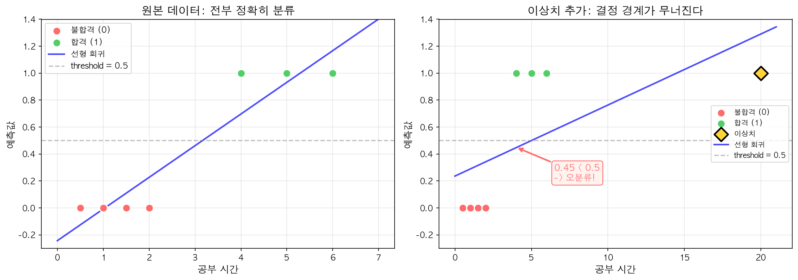
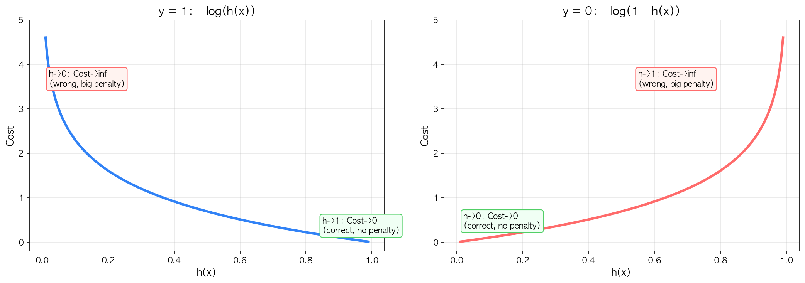
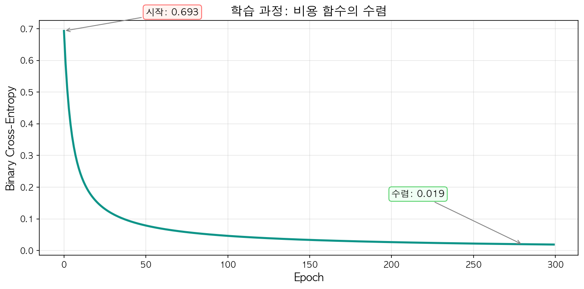

이 이메일이 스팸인가. 이 종양이 악성인가. 이 고객이 이탈할 것인가. 답이 Yes 아니면 No, 0 아니면 1로 떨어지는 문제를 **분류(Classification)** 라고 한다. 연속적인 값을 맞히는 회귀와는 목표가 다르다.

분류를 푸는 가장 기본적인 모델이 **로지스틱 회귀(Logistic Regression)** 다. 선형 회귀를 조금 변형한 것이라는 직감은 맞다. 다만 어디를 어떻게 변형하느냐가 전부다.

## 선형 회귀로 분류하면 어디가 깨지나

가장 먼저 떠오르는 아이디어는 선형 회귀의 출력이 0.5 이상이면 1, 미만이면 0으로 자르는 것이다. 공부 시간에 따른 합격 여부 데이터로 확인해보자.

```python
import numpy as np
from sklearn.linear_model import LinearRegression

x = np.array([0.5, 1, 1.5, 2, 4, 5, 6]).reshape(-1, 1)
y = np.array([0, 0, 0, 0, 1, 1, 1])
print(np.round(LinearRegression().fit(x, y).predict(x), 2))
# [-0.13 -0.01  0.11  0.23  0.7   0.93  1.17]

# 20시간 공부한 합격자 한 명 추가
x2 = np.append(x, [[20]], axis=0)
y2 = np.append(y, 1)
print(np.round(LinearRegression().fit(x2, y2).predict(x2), 2))
# [0.26 0.29 0.32 0.34 0.45 0.5   0.55 1.29]
```

첫 번째 결과는 0.5로 자르면 일곱 개를 전부 맞힌다. 그런데 이상치 하나가 들어오자 직선이 눌려 평평해지면서, 4시간 공부한 합격자의 예측값이 0.70에서 0.45로 떨어졌다. 원래 맞던 것까지 틀리게 됐다.



두 가지가 근본 원인이다. 하나는 출력 범위다. 선형 회귀의 출력은 음의 무한대에서 양의 무한대까지 열려 있어서 1.29 같은 값이 나오는데, 이건 확률로 읽을 수 없다. 다른 하나는 이상치 민감도다. 직선 하나가 모든 점과의 제곱 오차를 줄이려 하므로, 클래스 내부에서 멀리 떨어진 점 하나가 직선 전체를 끌고 간다.

출력을 0과 1 사이에 가두는 장치가 필요하다.

## 시그모이드가 실수를 확률로 바꾼다

**시그모이드 함수(Sigmoid Function)** 는 실수 전체를 (0, 1) 구간으로 옮긴다.

$$\sigma(z) = \frac{1}{1 + e^{-z}}$$

<div style="margin: 24px 0; text-align: center;">
<svg viewBox="0 0 400 292" style="width: 100%; height: auto; max-width: 380px;"
     xmlns="http://www.w3.org/2000/svg"
     font-family="Pretendard, -apple-system, sans-serif"
     role="img" aria-label="시그모이드 곡선. 입력 z가 0일 때 출력이 0.5이고, 이 값을 임계값으로 삼아 왼쪽은 클래스 0, 오른쪽은 클래스 1로 예측한다.">
<style>
.lr1-axis { stroke: var(--text-muted, #6d6762); stroke-width: 1.2; fill: none; }
.lr1-curve { stroke: var(--primary, #0a756c); stroke-width: 2.4; fill: none; }
.lr1-dash { stroke: var(--accent, #9d5604); stroke-width: 1.4; fill: none; stroke-dasharray: 5 4; }
.lr1-t { fill: var(--text, #1c1917); font-size: 17px; font-weight: 600; }
.lr1-n { fill: var(--text-muted, #6d6762); font-size: 14px; }
.lr1-a { fill: var(--accent, #9d5604); font-size: 14px; font-weight: 600; }
.lr1-m { fill: var(--text-muted, #6d6762); font-size: 15px; font-weight: 600; }
.lr1-p { fill: var(--primary, #0a756c); font-size: 15px; font-weight: 600; }
.lr1-b0 { fill: var(--bg-subtle, #f5f4f2); stroke: var(--border, #e7e5e4); stroke-width: 1.2; }
.lr1-b1 { fill: var(--bg-muted, #eeecea); stroke: var(--primary, #0a756c); stroke-width: 1.2; }
</style>
<text class="lr1-t" x="200" y="24" text-anchor="middle">시그모이드와 임계값 0.5</text>
<!-- 축과 눈금 -->
<path class="lr1-axis" d="M 60 40 L 60 212"/>
<path class="lr1-axis" d="M 56 208 L 378 208"/>
<text class="lr1-n" x="52" y="53" text-anchor="end">1.0</text>
<text class="lr1-n" x="52" y="133" text-anchor="end">0.5</text>
<text class="lr1-n" x="52" y="213" text-anchor="end">0</text>
<!-- 임계값 보조선 -->
<path class="lr1-dash" d="M 60 128 L 370 128"/>
<path class="lr1-dash" d="M 215 48 L 215 208"/>
<text class="lr1-a" x="368" y="120" text-anchor="end">임계값 0.5</text>
<text class="lr1-n" x="222" y="60" text-anchor="start">z = 0</text>
<!-- 시그모이드 곡선 -->
<polyline class="lr1-curve" points="60,207.6 85.8,206.9 111.7,205.1 137.5,200.4 150.4,195.9 163.3,188.9 176.3,178.8 189.2,165.0 202.1,147.6 215,128 227.9,108.4 240.8,91.0 253.8,77.2 266.7,67.1 279.6,60.1 292.5,55.6 318.3,50.9 344.2,49.1 370,48.4"/>
<!-- 예측이 갈리는 두 구간 -->
<rect class="lr1-b0" x="60" y="216" width="155" height="40" rx="5"/>
<text class="lr1-m" x="137" y="234" text-anchor="middle">클래스 0</text>
<text class="lr1-n" x="137" y="250" text-anchor="middle">&#963;(z) &lt; 0.5</text>
<rect class="lr1-b1" x="215" y="216" width="155" height="40" rx="5"/>
<text class="lr1-p" x="292" y="234" text-anchor="middle">클래스 1</text>
<text class="lr1-n" x="292" y="250" text-anchor="middle">&#963;(z) &#8805; 0.5</text>
<text class="lr1-n" x="215" y="276" text-anchor="middle">z = w &#183; x + b</text>
</svg>
</div>

$z$가 0에서 멀어질수록 출력이 0이나 1에 빠르게 붙고, $z = 0$에서 정확히 0.5를 지난다. 확신이 강할수록 극단에 가까워지는 모양이다.

이 함수가 분류에 자연스럽게 들어맞는 이유는 승산에서 나온다. 어떤 사건의 확률이 $p$일 때 **승산(Odds)** 은 일어날 확률을 일어나지 않을 확률로 나눈 값이고, 여기에 로그를 씌운 것이 **로짓(Logit)** 이다.

$$\text{Odds} = \frac{p}{1-p}, \qquad \text{logit}(p) = \log\frac{p}{1-p}$$

합격 확률이 0.8이면 승산은 4다. 불합격 한 번당 합격 네 번이라는 뜻이다. 확률은 0과 1 사이에 갇혀 있지만 로짓의 범위는 실수 전체다. 그래서 로짓이라면 선형 모델이 그대로 맞힐 수 있다. 이 등식을 $p$에 대해 풀면 시그모이드가 그냥 튀어나온다.

$$\log\frac{p}{1-p} = wx + b \quad \Longrightarrow \quad p = \frac{1}{1 + e^{-(wx+b)}} = \sigma(wx+b)$$

시그모이드는 범위를 맞추려고 갖다 붙인 함수가 아니라, 확률과 선형 모델을 잇는 다리다.

:::note

**분류 모델인데 이름이 회귀인 이유**

최종 출력은 클래스지만, 모델이 실제로 맞히는 대상은 로그 승산이라는 연속량이다. 1958년 통계학에서 이 형태가 제안될 때 이름이 붙었고 그대로 굳었다.

:::

## 로지스틱 회귀 모델

선형 회귀의 가설 함수에 시그모이드를 씌우면 그대로 로지스틱 회귀가 된다.

$$h(x) = \sigma(w \cdot x + b) = \frac{1}{1 + e^{-(w \cdot x + b)}}$$

이 출력을 $y = 1$일 확률로 읽는다. 즉 $P(y=1 \mid x) = h(x)$이고 $P(y=0 \mid x) = 1 - h(x)$다. 예측은 $h(x) \ge 0.5$면 클래스 1, 미만이면 클래스 0으로 자른다.

$\sigma$가 0.5를 지나는 지점은 $z = 0$ 하나뿐이므로, 예측이 갈리는 자리는 $w \cdot x + b = 0$을 만족하는 점들이다. 2차원 입력이면 직선이고 3차원이면 평면인 이 집합을 **결정 경계(Decision Boundary)** 라고 부른다.

선형 회귀와 다른 것은 시그모이드 하나뿐이다. 비용 함수를 정하고 경사하강법으로 파라미터를 움직이는 틀은 그대로 간다. 다만 비용 함수는 갈아 끼워야 한다.

## 로그 손실

회귀에서 쓰던 MSE를 그대로 가져오면 문제가 생긴다.

$$J(w, b) = \frac{1}{m}\sum_{i=1}^{m}\left(h(x_i) - y_i\right)^2$$

$h$가 시그모이드라서 이 $J$는 볼록하지 않다. 곡면에 지역 최솟값이 여러 개 생기고, 경사하강법이 어디서 출발하느냐에 따라 다른 곳에 멈춘다. 전역 최솟값에 닿는다는 보장이 사라진다.

로지스틱 회귀는 대신 **Binary Cross-Entropy**(로그 손실)를 쓴다.

$$J(w, b) = -\frac{1}{m}\sum_{i=1}^{m}\left[y_i \log h(x_i) + (1 - y_i) \log \left(1 - h(x_i)\right)\right]$$

$y$가 0 아니면 1이므로 대괄호 안의 두 항 중 하나는 항상 0이 되어 사라진다. $y=1$이면 $-\log h(x)$만, $y=0$이면 $-\log(1 - h(x))$만 남는다. 두 경우 모두 **모델이 정답 클래스에 부여한 확률에 로그를 씌워 부호를 뒤집은 값**이다.

| 정답에 부여한 확률 | 비용 | |
|---|---|---|
| 0.99 | 0.01 | 확신 있게 맞힘 |
| 0.5 | 0.69 | 반반 |
| 0.01 | 4.61 | 확신 있게 틀림 |



벌이 대칭이 아니라는 게 핵심이다. 잘 맞힌 쪽의 이득은 0에서 멈추지만, 확신 있게 틀린 쪽의 벌은 로그를 따라 발산한다. 정답 확률을 0에 가깝게 준 예측 하나가 나머지 수백 건의 잘 맞힌 예측을 상쇄할 만큼 커진다. 그리고 이 함수는 볼록하다.

## 경사하강법 업데이트가 선형 회귀와 같은 이유

$J$를 $w$와 $b$로 편미분하면 이렇게 된다.

$$\frac{\partial J}{\partial w} = \frac{1}{m}\sum_{i=1}^{m}\left(h(x_i) - y_i\right) x_i, \qquad \frac{\partial J}{\partial b} = \frac{1}{m}\sum_{i=1}^{m}\left(h(x_i) - y_i\right)$$

선형 회귀에서 MSE를 미분한 결과와 형태가 똑같다. 달라진 것은 $h$의 정의뿐이다.

우연이 아니다. $-\log h$를 미분하면 $-1/h$가 나오고, 시그모이드를 미분하면 $\sigma'(z) = \sigma(z)\left(1 - \sigma(z)\right)$, 즉 $h(1-h)$가 나온다. 연쇄 법칙으로 둘을 곱하는 순간 $h$가 약분되면서 $(h - y)x$만 남는다. 앞에서 MSE를 버리고 로그 손실을 고른 대가로 곡면이 볼록해졌는데, 그 로그가 시그모이드의 미분과 정확히 맞물려 업데이트 규칙까지 단순하게 만들어준다.

그래서 구현은 짧다.

```python
import numpy as np

def sigmoid(z):
    return 1 / (1 + np.exp(-z))

def fit(X, y, lr=0.5, epochs=300):
    m = len(y)
    w, b = np.zeros(X.shape[1]), 0.0
    for _ in range(epochs):
        h = sigmoid(X @ w + b)
        w -= lr * (X.T @ (h - y)) / m
        b -= lr * np.sum(h - y) / m
    return w, b
```

비용값을 함께 찍고 싶다면 `np.log(h + 1e-8)`처럼 작은 값을 더한다. $h$가 0이나 1에 정확히 닿는 순간 $\log 0$이 되어 계산이 `-inf`로 무너지기 때문이다.

앞의 합격/불합격 데이터에 돌리면 이렇게 나온다.

```python
from sklearn.preprocessing import StandardScaler

X = StandardScaler().fit_transform(x)
w, b = fit(X, y.astype(float))
h = sigmoid(X @ w + b)

print(np.round(h, 3))          # [0.001 0.003 0.012 0.05  0.941 0.996 1.   ]
print((h >= 0.5).astype(int))  # [0 0 0 0 1 1 1]
```

출력이 0과 1 사이의 확률로 나오고, 일곱 개를 전부 맞힌다.



## sklearn으로 쓸 때

실무에서는 직접 구현 대신 `LogisticRegression`을 쓴다. 유방암 진단 데이터로 확인해보자.

```python
from sklearn.datasets import load_breast_cancer
from sklearn.model_selection import train_test_split
from sklearn.linear_model import LogisticRegression
from sklearn.pipeline import Pipeline
from sklearn.metrics import accuracy_score

data = load_breast_cancer()
X_train, X_test, y_train, y_test = train_test_split(
    data.data, data.target, test_size=0.2, random_state=42
)

pipe = Pipeline([
    ('scaler', StandardScaler()),
    ('lr', LogisticRegression(C=1.0, max_iter=1000)),
])
pipe.fit(X_train, y_train)

print(f"{accuracy_score(y_test, pipe.predict(X_test)):.4f}")   # 0.9737
```

30개 특성으로 악성과 양성을 가르는데 테스트 114건 중 3건만 틀린다.

스케일러를 파이프라인에 묶은 건 장식이 아니다. 로지스틱 회귀도 반복 최적화로 푸는 모델이라, 변수 간 스케일 차이가 크면 등고선이 길쭉해져 수렴이 느려진다. `max_iter`를 다 쓰고도 수렴하지 못했다는 경고가 뜬다면 스케일링을 빠뜨렸을 확률이 가장 높다.

:::info

**C 파라미터**

`LogisticRegression(C=1.0)`의 `C`는 규제 강도의 **역수**다. C가 크면 규제가 약해 가중치가 커질 수 있고(과적합 쪽), C가 작으면 가중치를 강하게 눌러 경계가 단순해진다(과소적합 쪽). 규제 계수를 직접 받는 다른 모델과 방향이 반대라 헷갈리기 쉽다.

:::

## 흔한 실수

### 임계값 0.5를 고정으로 쓴다

0.5는 확률의 중간값일 뿐 아무 근거가 없는 기본값이다. 두 종류의 오분류가 같은 비용이라는 가정이 깔려 있는데, 현실에서 그런 경우는 드물다.

- 암 진단에서는 실제 환자를 놓치는 쪽이 과잉 진단보다 훨씬 치명적이다. 임계값을 낮춰 양성 판정을 관대하게 만든다.
- 스팸 필터에서는 정상 메일을 스팸함으로 보내는 쪽이 스팸 하나를 통과시키는 것보다 나쁘다. 임계값을 올려 스팸 판정을 엄격하게 만든다.

임계값을 옮기면 정밀도와 재현율이 서로 반대로 움직인다. 어느 쪽을 얼마나 포기할지는 통계가 아니라 도메인이 정한다.

### 정확도 하나로 판단한다

앞의 유방암 예제에서 정확도 97%가 좋아 보였던 건 두 클래스의 비율이 비슷했기 때문이다. 비율이 무너지면 이 숫자는 아무것도 말해주지 않는다.

:::warning

**클래스 불균형**

사기 탐지처럼 양성 비율이 0.1%인 데이터에서는 전부 "정상"으로 찍어도 정확도가 99.9%다. 이런 데이터에서는 `class_weight='balanced'`로 소수 클래스의 손실 가중치를 올리거나, 정확도 대신 정밀도와 재현율을 함께 보는 지표를 기준으로 삼아야 한다.

:::

## 마치며

선형 회귀에 시그모이드 하나를 얹으면 출력이 확률이 된다. 그런데 바뀌는 건 출력만이 아니다. MSE를 그대로 두면 곡면이 볼록하지 않아 학습이 불안정해지므로 비용 함수를 로그 손실로 갈아야 하고, 그 로그가 시그모이드의 미분과 약분되면서 업데이트 규칙은 다시 선형 회귀와 같은 모양으로 돌아온다. 세 조각이 서로를 붙들고 있어서 하나만 바꿔 끼울 수 없다.

로지스틱 회귀가 오래 살아남은 이유는 성능이 아니라 이 구조가 훤히 들여다보인다는 데 있다. 계수 하나하나가 로그 승산에 대한 기여로 읽히고, 출력이 확률이라 임계값을 도메인 사정에 맞게 옮길 수 있다. 새 분류 데이터셋을 받았을 때 먼저 돌려보는 기준선으로 쓰기 좋은 것도 그래서다.

남은 질문은 학습이 끝난 $w$와 $b$가 입력 공간을 실제로 어떤 모양으로 가르느냐다.

## 함께 보면 좋은 글

- [결정 경계](/ml/decision-boundary/) : 학습된 가중치가 입력 공간을 가르는 선의 모양
- [비용 함수](/ml/cost-function/) : 로그 손실 이전에 MSE가 맡던 역할
- [분류 모델 평가 지표](/ml/classification-metrics/) : 정확도 대신 볼 정밀도와 재현율

## 참고자료

- [Andrew Ng, Machine Learning Specialization: Classification (Coursera)](https://www.coursera.org/specializations/machine-learning-introduction)
- [Scikit-learn, LogisticRegression Documentation](https://scikit-learn.org/stable/modules/generated/sklearn.linear_model.LogisticRegression.html)
- [Stanford CS229, Lecture Notes on Logistic Regression](https://cs229.stanford.edu/main_notes.pdf)
