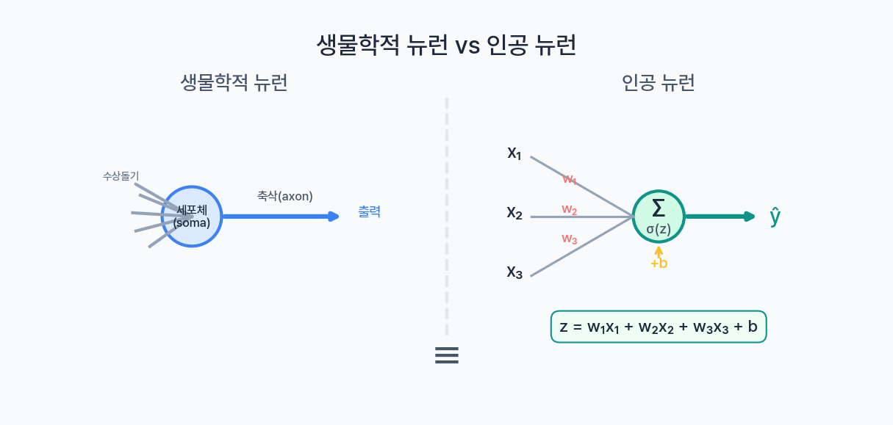
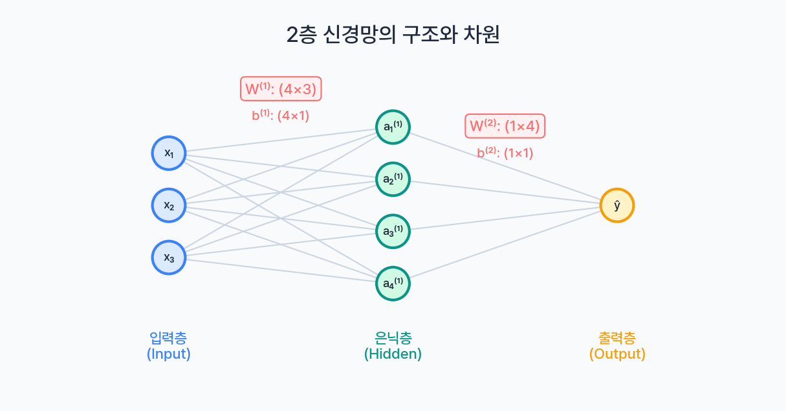
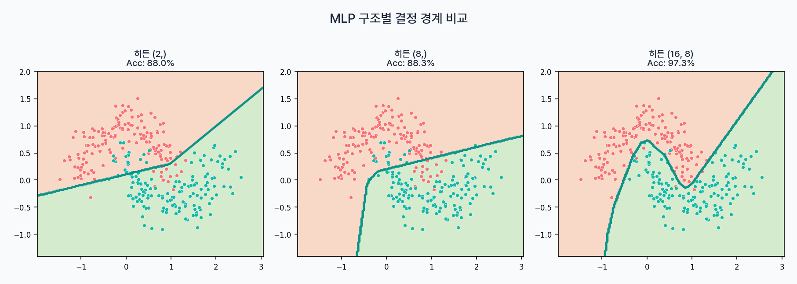

지금까지 18개의 글에 걸쳐 Classical ML의 핵심 알고리즘을 모두 다뤘다. [선형 회귀](/ml/linear-regression/)로 시작해 [XGBoost와 LightGBM](/ml/xgboost-vs-lightgbm/)까지 — 회귀, 분류, 앙상블을 아우르는 여정이었다. 이제 완전히 새로운 패러다임으로 들어간다. **인공 신경망(Artificial Neural Network)**.

지금까지 배운 모든 모델에는 한 가지 공통점이 있었다. 사람이 모델의 구조를 정해줘야 한다는 것이다. 선형 회귀에서는 어떤 특성을 넣을지 결정했고, [결정 경계](/ml/decision-boundary/)에서는 다항 특성(polynomial features)을 직접 만들어 비선형 경계를 구현했다. SVM에서는 커널 함수를 선택했고, 랜덤 포레스트에서는 트리 수와 깊이를 조절했다.

신경망은 다르다. **모델이 스스로 특성을 학습한다.** 어떤 조합이 유용한지를 데이터에서 알아내는 것이다. 이것이 딥러닝 혁명의 핵심이고, 이미지 인식, 자연어 처리, 음성 합성 같은 분야에서 Classical ML을 압도하는 이유다.

---

## 생물학적 영감 — 하지만 진짜 이유는 따로 있다

신경망이라는 이름은 뇌의 뉴런에서 왔다. 생물학적 뉴런은 수상돌기(dendrite)로 신호를 받아들이고, 세포체(soma)에서 신호를 합산한 뒤, 역치를 넘으면 축삭돌기(axon)를 통해 다음 뉴런에 신호를 전달한다. 인공 신경망의 노드도 비슷한 구조다 — 입력을 받아 가중합을 구하고, 활성화 함수를 거쳐 출력을 내보낸다.



하지만 솔직히, 생물학적 유사성은 **이름의 유래**일 뿐이다. 현대 신경망이 뇌처럼 작동한다고 보기는 어렵다. 신경망이 강력한 진짜 이유는 수학에 있다. 바로 **범용 근사 정리(Universal Approximation Theorem)** 인데, 이건 뒤에서 자세히 다룬다.

지금은 하나의 뉴런이 무엇을 하는지부터 시작하자.

---

## 퍼셉트론: 가장 단순한 신경망

### 하나의 뉴런이 하는 일

1957년, 프랭크 로젠블랫(Frank Rosenblatt)이 **퍼셉트론(Perceptron)** 을 발표했다. 구조를 보면:

```
입력: x₁, x₂, ..., xₙ
가중치: w₁, w₂, ..., wₙ
편향: b

1단계 — 가중합: z = w₁x₁ + w₂x₂ + ... + wₙxₙ + b
2단계 — 활성화: ŷ = f(z)
```

여기서 `f`가 활성화 함수(activation function)다. 원래 퍼셉트론은 계단 함수(step function)를 사용했다:

```
f(z) = 1  (z ≥ 0)
f(z) = 0  (z < 0)
```

이게 전부다. 입력의 가중합을 구하고, 역치를 넘으면 1, 아니면 0. 이것이 하나의 인공 뉴런이 하는 일이다.

### 잠깐 — 이거 로지스틱 회귀 아닌가?

맞다. 활성화 함수를 계단 함수 대신 **시그모이드**로 바꾸면, 그게 바로 [로지스틱 회귀](/ml/logistic-regression/)다.

```
퍼셉트론:     z = wx + b  →  step(z)  →  0 or 1
로지스틱 회귀: z = wx + b  →  σ(z)     →  0~1 사이의 확률
```

| 비교 항목 | 퍼셉트론 | 로지스틱 회귀 |
|----------|---------|-------------|
| 가중합 | z = wx + b | z = wx + b |
| 활성화 함수 | 계단 함수 | 시그모이드 |
| 출력 | 0 또는 1 | 0~1 연속값 (확률) |
| 학습 방법 | 퍼셉트론 규칙 | 경사하강법 + Log Loss |
| 미분 가능 여부 | 불가 (계단) | 가능 (시그모이드) |

로지스틱 회귀는 "시그모이드를 활성화 함수로 쓰는 1개짜리 뉴런"과 정확히 같다. 이 관점이 중요하다. **신경망은 로지스틱 회귀의 확장**이라고 볼 수 있기 때문이다.

<div style="background: #f0f4ff; border-left: 4px solid #3182f6; padding: 16px 20px; margin: 20px 0; border-radius: 4px;">
  <strong>💡 핵심 인사이트</strong><br>
  로지스틱 회귀 = 뉴런 1개짜리 신경망. 신경망을 "처음부터 배우는 새로운 것"으로 생각하지 말자. 이미 배운 것의 확장이다.
</div>

### 퍼셉트론 학습 규칙

퍼셉트론은 틀린 샘플을 만날 때마다 가중치를 업데이트한다. 규칙은 간단하다:

```
예측이 틀렸을 때:
  w ← w + η × (y - ŷ) × x
  b ← b + η × (y - ŷ)

η: 학습률 (learning rate)
y: 실제값, ŷ: 예측값
```

예를 들어, 실제 y=1인데 ŷ=0으로 예측했다면 (y - ŷ) = 1이므로, 입력 x 방향으로 가중치가 커진다. 다음에는 같은 입력에 대해 z 값이 올라가서 1로 분류될 가능성이 높아지는 것이다.

### NumPy로 퍼셉트론 구현

AND 게이트를 학습하는 퍼셉트론을 만들어보자.

```python
import numpy as np

# AND 게이트 데이터
X = np.array([[0, 0], [0, 1], [1, 0], [1, 1]])
y = np.array([0, 0, 0, 1])

# 퍼셉트론
np.random.seed(42)
w = np.random.randn(2) * 0.01
b = 0.0
lr = 0.1

for epoch in range(20):
    errors = 0
    for xi, yi in zip(X, y):
        z = np.dot(w, xi) + b
        y_hat = 1 if z >= 0 else 0

        if y_hat != yi:
            w += lr * (yi - y_hat) * xi
            b += lr * (yi - y_hat)
            errors += 1

    if errors == 0:
        print(f"Epoch {epoch}: 수렴 완료!")
        break

# 학습 결과 확인
for xi in X:
    z = np.dot(w, xi) + b
    print(f"{xi} → {1 if z >= 0 else 0}")

# [0 0] → 0
# [0 1] → 0
# [1 0] → 0
# [1 1] → 1
```

AND, OR 게이트 모두 완벽하게 학습한다. 퍼셉트론 수렴 정리(Perceptron Convergence Theorem)에 의하면, 데이터가 **선형 분리 가능**하면 퍼셉트론은 반드시 답을 찾는다.

하지만 "선형 분리 가능"이라는 조건이 문제다.

---

## XOR 문제: 퍼셉트론의 근본적 한계

### 하나의 직선으로는 안 되는 문제

XOR(배타적 논리합) 게이트를 보자:

| x₁ | x₂ | XOR |
|----|----|-----|
| 0  | 0  |  0  |
| 0  | 1  |  1  |
| 1  | 0  |  1  |
| 1  | 1  |  0  |

이걸 2차원 평면에 그리면:

```
x₂
 1 |  ●(1)     ○(0)
   |
 0 |  ○(0)     ●(1)
   └──────────── x₁
      0          1

● = 클래스 1, ○ = 클래스 0
```

어떻게 직선 하나를 그어도 ●과 ○을 완벽하게 분리할 수 없다. 이것이 **선형 분리 불가능(linearly inseparable)** 한 문제다.

1969년, 마빈 민스키(Marvin Minsky)와 시모어 패퍼트(Seymour Papert)가 저서 *Perceptrons*에서 이 한계를 수학적으로 증명했다. 단일 퍼셉트론으로는 XOR을 절대 풀 수 없다. 이 증명은 신경망 연구를 10년 넘게 얼어붙게 만든 "AI 겨울"의 방아쇠가 됐다.

[결정 경계](/ml/decision-boundary/) 글에서 다항 특성(polynomial features)을 추가해 비선형 경계를 만들었던 것을 떠올려보자. x₁x₂ 같은 교차항을 수동으로 추가하면 XOR도 풀 수 있다. 하지만 이건 사람이 "어떤 특성을 만들어야 하는지" 미리 알아야 한다는 뜻이다. 특성이 수백, 수천 개가 되면 어떤 조합이 유용한지 사람이 판단하기 불가능하다.

그래서 **모델이 스스로 유용한 특성 조합을 학습하게 만들자** — 이것이 다층 신경망의 핵심 아이디어다.

### XOR을 직접 못 푸는 것을 코드로 확인하기

```python
import numpy as np

# XOR 데이터
X = np.array([[0, 0], [0, 1], [1, 0], [1, 1]])
y = np.array([0, 1, 1, 0])

np.random.seed(42)
w = np.random.randn(2) * 0.01
b = 0.0
lr = 0.1

# 100번 돌려도 수렴하지 않는다
for epoch in range(100):
    errors = 0
    for xi, yi in zip(X, y):
        z = np.dot(w, xi) + b
        y_hat = 1 if z >= 0 else 0
        if y_hat != yi:
            w += lr * (yi - y_hat) * xi
            b += lr * (yi - y_hat)
            errors += 1
    if epoch % 20 == 0:
        print(f"Epoch {epoch}: errors = {errors}")

# Epoch 0: errors = 3
# Epoch 20: errors = 2
# Epoch 40: errors = 2
# Epoch 60: errors = 2
# Epoch 80: errors = 2
# → 영원히 수렴하지 않는다!
```

에러가 0으로 떨어지지 않는다. 퍼셉트론이 XOR을 절대 풀 수 없다는 증거다.

---

## 다층 퍼셉트론(MLP): 레이어를 쌓으면 해결된다

### 핵심 아이디어

XOR을 하나의 직선으로는 못 가르지만, **직선 두 개를 조합하면** 가를 수 있다.

```
직선 1: x₁ + x₂ - 0.5 > 0  →  "x₁ OR x₂"
직선 2: x₁ + x₂ - 1.5 > 0  →  "x₁ AND x₂"

XOR = (직선 1) AND NOT(직선 2)
    = OR 결과가 1이면서, AND 결과가 0인 경우
```

이걸 뉴런으로 구성하면:

```
입력층        히든층         출력층
            ┌───────┐
x₁ ────────→│ h₁(OR) │──→
     ╲    ╱ └───────┘     ╲  ┌──────┐
      ╲  ╱                  →│ out  │→ ŷ
      ╱  ╲                ╱  └──────┘
     ╱    ╲ ┌────────┐   ╱
x₂ ────────→│h₂(NAND)│──→
            └────────┘
```

히든층의 첫 번째 뉴런(h₁)은 OR 역할, 두 번째 뉴런(h₂)은 NAND 역할을 한다. 출력 뉴런이 이 둘의 결과를 AND로 결합하면 XOR이 완성된다. 직선 하나로 안 되는 문제를 **직선 여러 개의 조합**으로 풀어낸 것이다.

이것이 **다층 퍼셉트론(Multi-Layer Perceptron, MLP)** 의 핵심이다. 단순한 함수들을 조합해서 복잡한 함수를 만든다.

<div style="background: #f0f4ff; border-left: 4px solid #3182f6; padding: 16px 20px; margin: 20px 0; border-radius: 4px;">
  <strong>💡 레고 블록 비유</strong><br>
  각 뉴런은 "직선 하나를 긋는" 단순한 작업만 한다. 하지만 이 직선들을 여러 층으로 쌓아 조합하면, 아무리 복잡한 결정 경계도 만들 수 있다. 레고 블록 하나하나는 단순하지만, 조합하면 어떤 형태든 만들 수 있는 것과 같다.
</div>

### MLP의 구조

다층 신경망은 세 종류의 레이어로 구성된다:

```
입력층(Input Layer)    히든층(Hidden Layer)    출력층(Output Layer)
     x₁ ─────────→  h₁  ─────────→
     x₂ ─────────→  h₂  ─────────→  ŷ
     x₃ ─────────→  h₃  ─────────→
          W[1], b[1]       W[2], b[2]
```

| 레이어 | 역할 | 특징 |
|--------|------|------|
| 입력층 | 원본 특성을 받아들임 | 뉴런 수 = 특성 수 |
| 히든층 | 입력의 새로운 표현(representation) 학습 | 여러 층 가능, 뉴런 수는 하이퍼파라미터 |
| 출력층 | 최종 예측 생성 | 뉴런 수 = 클래스 수 (분류) 또는 1 (회귀) |

**각 뉴런이 하는 일은 전부 동일하다:** 가중합 → 활성화 함수. 즉 **모든 뉴런은 작은 로지스틱 회귀**다. 이것만 기억하면 아무리 복잡한 신경망도 겁나지 않는다.

---

## 범용 근사 정리: 신경망이 강력한 수학적 이유

1989년, 조지 사이벤코(George Cybenko)가 증명한 **범용 근사 정리(Universal Approximation Theorem)** 는 이렇게 말한다:

> 히든 레이어가 1개이고, 뉴런 수가 충분하면, 시그모이드 활성화 함수를 가진 신경망은 **임의의 연속 함수**를 원하는 정밀도로 근사할 수 있다.

쉽게 말하면, 세상의 어떤 패턴이든 — 아무리 복잡한 비선형 관계든 — 뉴런을 충분히 넣으면 표현할 수 있다는 것이다.

```
이론적으로:
  1개의 히든 레이어 + 충분한 뉴런 → 모든 연속 함수를 근사 가능

실제로:
  뉴런을 하나의 층에 수만 개 쌓는 것보다
  적당한 수의 뉴런을 여러 층으로 쌓는 것(딥러닝)이 효율적
```

<div style="background: #f0f4ff; border-left: 4px solid #3182f6; padding: 16px 20px; margin: 20px 0; border-radius: 4px;">
  <strong>💡 범용 근사 정리의 의미</strong><br>
  이 정리는 "신경망이 답을 <em>찾을 수 있다</em>"는 존재성(existence)만 보장한다. "어떻게 찾느냐"는 별개 문제다. 그 "어떻게"가 바로 다음 글에서 다룰 순전파와 역전파다.
</div>

이 정리가 중요한 이유는, 모델 선택의 고민을 줄여준다는 것이다. 결정 트리를 쓸지, SVM을 쓸지, 다항 특성을 몇 차로 할지 — 이런 고민 대신, 신경망은 "충분히 크게 만들면 이론적으로 어떤 함수든 표현 가능"이라는 보장이 있다. 물론 실전에서는 과적합, 계산량, 데이터 양 같은 현실적 제약이 있지만.

---

## 신경망의 수학적 표기

신경망 논문이나 교재를 읽으려면 표기법에 익숙해져야 한다. 2층 신경망(히든 1개 + 출력 1개)을 기준으로 정리하자.

### 레이어별 표기

```
[0] 입력층       [1] 히든층           [2] 출력층

a[0] = x         z[1] = W[1]a[0] + b[1]   z[2] = W[2]a[1] + b[2]
(입력 그대로)     a[1] = f(z[1])           a[2] = f(z[2]) = ŷ
```

| 기호 | 의미 | 예시 |
|------|------|------|
| l | 레이어 번호 | l=0 (입력), l=1 (히든), l=2 (출력) |
| n[l] | l번째 레이어의 뉴런 수 | n[0]=3, n[1]=4, n[2]=1 |
| W[l] | l번째 레이어의 가중치 행렬 | 크기: n[l] × n[l-1] |
| b[l] | l번째 레이어의 편향 벡터 | 크기: n[l] × 1 |
| z[l] | 가중합 (활성화 전) | z[l] = W[l]a[l-1] + b[l] |
| a[l] | 활성화 출력 | a[l] = f(z[l]) |

### 가중치 행렬의 차원

이 부분을 많이 헷갈려하는데, 규칙은 간단하다:

```
W[l]의 크기 = (현재 층 뉴런 수) × (이전 층 뉴런 수)
            = n[l] × n[l-1]

예시: 입력 3개 → 히든 4개 → 출력 1개
  W[1]: 4 × 3  (히든 4개가 각각 입력 3개와 연결)
  b[1]: 4 × 1
  W[2]: 1 × 4  (출력 1개가 히든 4개와 연결)
  b[2]: 1 × 1

총 파라미터 수 = (4×3 + 4) + (1×4 + 1) = 12 + 4 + 4 + 1 = 21
```



왜 `n[l] x n[l-1]`인지 직관적으로 이해하면: 현재 층의 각 뉴런은 이전 층의 **모든** 뉴런과 연결된다. 뉴런 하나가 필요한 가중치 수 = 이전 층 뉴런 수. 그런 뉴런이 n[l]개이므로, 전체 가중치는 n[l] × n[l-1]개다.

---

## 로지스틱 회귀 vs 신경망: 나란히 비교

이제 [로지스틱 회귀](/ml/logistic-regression/)와 신경망을 공식으로 나란히 놓아보자.

### 로지스틱 회귀 (뉴런 1개)

```
z = w₁x₁ + w₂x₂ + w₃x₃ + b
ŷ = σ(z)

파라미터: w (3개) + b (1개) = 4개
표현력: 직선 하나 (선형 결정 경계)
```

### 2층 신경망 (히든 뉴런 4개)

```
히든층:
  z₁[1] = w₁₁x₁ + w₁₂x₂ + w₁₃x₃ + b₁
  z₂[1] = w₂₁x₁ + w₂₂x₂ + w₂₃x₃ + b₂
  z₃[1] = w₃₁x₁ + w₃₂x₂ + w₃₃x₃ + b₃
  z₄[1] = w₄₁x₁ + w₄₂x₂ + w₄₃x₃ + b₄
  a[1] = σ(z[1])  ← 각각 시그모이드 통과

출력층:
  z[2] = v₁a₁ + v₂a₂ + v₃a₃ + v₄a₄ + c
  ŷ = σ(z[2])

파라미터: W[1](12) + b[1](4) + W[2](4) + b[2](1) = 21개
표현력: 직선 4개의 비선형 조합 (복잡한 결정 경계)
```

히든층의 4개 뉴런은 각각 **서로 다른 직선**을 학습한다. 출력 뉴런이 이 직선들의 결과를 조합해서 최종 결정 경계를 만든다. 직선 하나(로지스틱 회귀)로 안 되는 문제도, 직선 여러 개를 조합하면 풀 수 있는 원리다.

```
로지스틱 회귀:  x → [직선 1개] → ŷ
신경망:        x → [직선 4개] → [조합] → ŷ
                    히든층         출력층
```

---

## 언제 신경망을 쓰고, 언제 Classical ML을 쓸까?

신경망이 만능은 아니다. 데이터 유형에 따라 최적의 모델이 다르다.

| 기준 | Classical ML (XGBoost 등) | 신경망 (MLP, CNN, RNN 등) |
|------|--------------------------|--------------------------|
| 정형 데이터 (표) | 강함 — 보통 1등 | 비슷하거나 약간 뒤처짐 |
| 이미지 | 수동 특성 추출 필요 | 압도적 (CNN) |
| 텍스트 | TF-IDF + 모델 조합 | 압도적 (Transformer) |
| 데이터 양 | 적어도 잘 작동 | 많을수록 유리 |
| 해석 가능성 | 높음 (feature importance) | 낮음 (블랙박스) |
| 학습 속도 | 빠름 | GPU 필요, 느림 |
| 하이퍼파라미터 | 상대적으로 적음 | 아키텍처 선택이 곧 설계 |

<div style="background: #f0f4ff; border-left: 4px solid #3182f6; padding: 16px 20px; margin: 20px 0; border-radius: 4px;">
  <strong>💡 실전 경험칙</strong><br>
  Kaggle 정형 데이터 대회에서는 XGBoost/LightGBM이 거의 항상 이긴다. 반면 이미지, 텍스트, 음성 같은 비정형 데이터에서는 신경망이 유일한 선택지다. "어떤 모델이 더 좋냐"가 아니라 "어떤 데이터에 어떤 모델이 맞느냐"의 문제다.
</div>

---

## sklearn으로 MLP 실습

이론은 충분하다. sklearn의 `MLPClassifier`로 실제 비선형 분류 문제를 풀어보자.

### XOR 문제 해결

```python
import numpy as np
from sklearn.neural_network import MLPClassifier
from sklearn.metrics import accuracy_score

# XOR 데이터
X = np.array([[0, 0], [0, 1], [1, 0], [1, 1]])
y = np.array([0, 1, 1, 0])

# MLP: 히든 레이어 1개, 뉴런 4개
mlp = MLPClassifier(
    hidden_layer_sizes=(4,),      # 히든층 뉴런 수
    activation='relu',             # 활성화 함수
    max_iter=1000,
    random_state=42
)
mlp.fit(X, y)

print(f"예측: {mlp.predict(X)}")
print(f"정확도: {accuracy_score(y, mlp.predict(X)):.2f}")

# 예측: [0 1 1 0]
# 정확도: 1.00
```

퍼셉트론이 절대 풀 수 없었던 XOR을 히든 레이어 하나만 추가해서 완벽하게 풀었다.

### 비선형 결정 경계 시각화

좀 더 현실적인 데이터로 시각화해보자.

```python
import numpy as np
import matplotlib.pyplot as plt
from sklearn.neural_network import MLPClassifier
from sklearn.datasets import make_moons

# 반달 형태의 비선형 데이터 생성
X, y = make_moons(n_samples=200, noise=0.2, random_state=42)

# 다양한 구조의 MLP 비교
configs = [
    ((4,), "히든 (4,)"),
    ((8, 4), "히든 (8, 4)"),
    ((16, 8, 4), "히든 (16, 8, 4)")
]

fig, axes = plt.subplots(1, 3, figsize=(15, 4))

for ax, (layers, title) in zip(axes, configs):
    mlp = MLPClassifier(
        hidden_layer_sizes=layers,
        activation='relu',
        max_iter=2000,
        random_state=42
    )
    mlp.fit(X, y)

    # 결정 경계 그리기
    xx, yy = np.meshgrid(
        np.linspace(X[:, 0].min()-0.5, X[:, 0].max()+0.5, 200),
        np.linspace(X[:, 1].min()-0.5, X[:, 1].max()+0.5, 200)
    )
    Z = mlp.predict(np.c_[xx.ravel(), yy.ravel()])
    Z = Z.reshape(xx.shape)

    ax.contourf(xx, yy, Z, alpha=0.3, cmap='coolwarm')
    ax.scatter(X[:, 0], X[:, 1], c=y, cmap='coolwarm', edgecolors='k', s=20)
    ax.set_title(f"{title}\nacc: {mlp.score(X, y):.3f}")

plt.tight_layout()
plt.savefig('mlp_decision_boundaries.png', dpi=150)
plt.show()
```



히든 레이어를 깊게 쌓을수록 더 복잡한 결정 경계를 만들 수 있다. 하지만 무조건 깊다고 좋은 건 아니다 — [편향-분산 트레이드오프](/ml/bias-variance/)를 떠올려보자. 너무 복잡한 모델은 훈련 데이터에 과적합될 수 있다.

### 네트워크 내부 들여다보기

학습된 가중치와 구조를 확인해보자.

```python
mlp = MLPClassifier(
    hidden_layer_sizes=(4,),
    activation='relu',
    max_iter=1000,
    random_state=42
)
mlp.fit(X, y)

# 가중치 행렬 확인
print("=== 레이어별 가중치 ===")
for i, (W, b) in enumerate(zip(mlp.coefs_, mlp.intercepts_)):
    print(f"W[{i+1}] shape: {W.shape}, b[{i+1}] shape: {b.shape}")
    print(f"  파라미터 수: {W.size + b.size}")

# W[1] shape: (2, 4), b[1] shape: (4,)   → 입력 2개 × 히든 4개 (sklearn은 (입력, 출력) 순으로 저장)
#   파라미터 수: 12
# W[2] shape: (4, 1), b[2] shape: (1,)   → 히든 4개 × 출력 1개
#   파라미터 수: 5
# 총 파라미터: 17개

print(f"\n총 파라미터 수: {sum(W.size + b.size for W, b in zip(mlp.coefs_, mlp.intercepts_))}")
```

<div style="background: #f0f4ff; border-left: 4px solid #3182f6; padding: 16px 20px; margin: 20px 0; border-radius: 4px;">
  <strong>💡 sklearn의 한계</strong><br>
  sklearn의 MLPClassifier는 학습 원리를 이해하기엔 좋지만, 실전 딥러닝에서는 사용하지 않는다. GPU 지원이 없고, CNN/RNN 같은 특수 구조를 만들 수 없기 때문이다. 실전에서는 PyTorch나 TensorFlow를 사용한다. 이 시리즈에서도 신경망이 깊어지면 PyTorch로 전환할 예정이다.
</div>

---

## 정리: 지금까지 배운 것과 앞으로 배울 것

이번 글에서 다룬 핵심을 정리하면:

1. **퍼셉트론** = 가중합 + 활성화 함수. 로지스틱 회귀와 본질적으로 같다
2. **XOR 문제**: 단일 퍼셉트론(직선 하나)으로는 비선형 분리가 불가능하다
3. **다층 신경망(MLP)**: 히든 레이어를 추가하면 비선형 문제를 풀 수 있다. 각 뉴런이 학습한 직선들을 조합하는 원리다
4. **범용 근사 정리**: 뉴런이 충분하면 어떤 연속 함수든 근사 가능하다
5. **표기법**: W[l], b[l], z[l], a[l] — 레이어별 행렬 연산으로 정리된다
6. **선택 기준**: 정형 데이터 → XGBoost, 비정형 데이터 → 신경망

그런데 빠진 것이 있다. 신경망의 **학습 방법**을 아직 다루지 않았다. W[1], W[2], b[1], b[2]의 값을 **어떻게** 찾는 걸까?

[경사하강법](/ml/gradient-descent/)에서 배운 것처럼, 손실 함수를 미분해서 파라미터를 업데이트해야 한다. 하지만 다층 신경망에서는 파라미터가 여러 레이어에 분산되어 있어서, 미분을 구하는 것 자체가 도전이다. 이 문제를 해결하는 알고리즘이 **역전파(Backpropagation)** 이고, 그 전 단계로 네트워크의 출력을 계산하는 **순전파(Forward Propagation)** 를 먼저 이해해야 한다.

---

## 다음 글 미리보기

[순전파(Forward Propagation)](/ml/forward-propagation/) — 입력이 네트워크를 통과하며 출력으로 변환되는 과정을 수식과 NumPy 코드로 단계별로 구현한다. 행렬 곱셈 한 줄로 전체 레이어의 연산이 표현되는 벡터화(vectorization)의 위력도 함께 다룬다.
