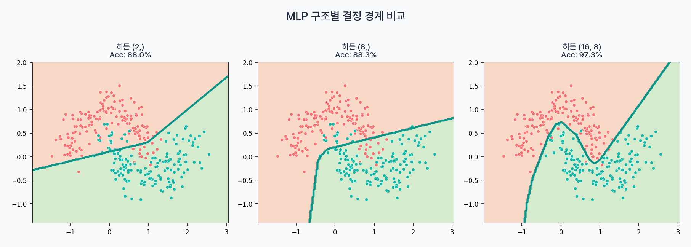

선형 회귀도, SVM도, 랜덤 포레스트도 사람이 모델의 모양을 정해줘야 했다. 어떤 특성을 넣을지, 다항 항을 몇 차까지 만들지, 커널을 무엇으로 쓸지. 성능의 상당 부분이 이 선택에서 갈렸다.

인공 신경망(Artificial Neural Network)은 그 선택을 모델에게 넘긴다. 어떤 특성 조합이 유용한지를 데이터에서 스스로 찾아낸다. 이미지나 음성처럼 사람이 좋은 특성을 설계하기 어려운 영역에서 신경망이 압도적인 이유가 이것이다.

구조 자체는 생각보다 단순하다. 이미 아는 로지스틱 회귀를 옆으로 여러 개 늘어놓고, 그 묶음을 앞뒤로 쌓은 것이다.

---

## 퍼셉트론, 뉴런 하나가 하는 일

1957년 프랭크 로젠블랫이 발표한 **퍼셉트론(Perceptron)** 은 인공 뉴런 하나짜리 모델이다. 하는 일은 두 단계뿐이다. 입력에 가중치를 곱해 전부 더하고, 그 결과를 함수 하나에 통과시킨다.

$$z = w_1x_1 + w_2x_2 + \cdots + w_nx_n + b = \mathbf{w}^\top\mathbf{x} + b$$

$$\hat{y} = f(z)$$

$\mathbf{w}$가 가중치, $b$가 편향, $f$가 활성화 함수다. 로젠블랫의 원래 퍼셉트론에서 $f$는 계단 함수였다.

$$f(z) = \begin{cases} 1 & (z \ge 0) \\ 0 & (z < 0) \end{cases}$$

가중합이 문턱을 넘으면 1, 아니면 0. 인공 뉴런 하나가 하는 일은 여기서 끝난다.

### 가중치와 편향이 각각 무엇을 정하는가

$w_i$는 입력 $x_i$가 결과에 얼마나 세게 작용하는지를 정한다. 부호까지 포함해서다. 양수면 그 입력이 커질 때 출력이 1 쪽으로 밀리고, 음수면 반대로 0 쪽으로 밀린다. 절댓값이 크면 그 입력 하나가 판단을 좌우한다.

$b$는 문턱의 위치를 옮긴다. $b$가 없으면 $z = 0$이라는 경계면이 항상 원점을 지나야 해서, 원점을 지나지 않는 경계는 아예 표현할 수 없다. $b$를 키우면 입력이 작아도 쉽게 1이 되고, 줄이면 웬만해서는 0에 머문다. 선형 회귀의 절편이 하는 역할과 같다.

### 이건 로지스틱 회귀와 같다

계단 함수 대신 시그모이드를 끼우면 그대로 로지스틱 회귀가 된다.

| 비교 항목 | 퍼셉트론 | 로지스틱 회귀 |
|---|---|---|
| 가중합 | $z = \mathbf{w}^\top\mathbf{x} + b$ | 같음 |
| 활성화 함수 | 계단 함수 | 시그모이드 |
| 출력 | 0 또는 1 | 0과 1 사이 확률 |
| 학습 방법 | 퍼셉트론 규칙 | 경사하강법 + Log Loss |
| 미분 가능 | 불가 | 가능 |

마지막 줄이 결정적이다. 계단 함수는 $z=0$에서 미분이 정의되지 않고 나머지 구간에서는 도함수가 0이라, 경사하강법을 쓸 방법이 없다. 퍼셉트론이 자기만의 학습 규칙을 따로 가져야 했던 이유이자, 신경망이 계단 함수를 버린 이유다.

:::info

**로지스틱 회귀 = 뉴런 하나짜리 신경망**

신경망은 처음부터 새로 배우는 모델이 아니다. 이미 아는 모델을 여러 개 늘어놓고 층으로 쌓은 것이다.

:::

### 퍼셉트론 학습 규칙

퍼셉트론은 틀린 샘플을 만날 때마다 가중치를 고친다.

$$\mathbf{w} \leftarrow \mathbf{w} + \eta(y - \hat{y})\mathbf{x}, \qquad b \leftarrow b + \eta(y - \hat{y})$$

$\eta$는 학습률이다. 실제 $y=1$인데 $\hat{y}=0$으로 예측했다면 $(y - \hat{y}) = 1$이므로 가중치가 입력 $\mathbf{x}$ 방향으로 커진다. 다음에 같은 입력이 들어오면 $z$가 올라가서 1로 분류될 가능성이 높아진다. 맞힌 샘플에서는 $(y - \hat{y}) = 0$이라 아무 일도 일어나지 않는다.

```python
import numpy as np

X = np.array([[0, 0], [0, 1], [1, 0], [1, 1]])
y = np.array([0, 0, 0, 1])                  # AND

w, b, lr = np.zeros(2), 0.0, 0.1
for epoch in range(20):
    errors = 0
    for xi, yi in zip(X, y):
        y_hat = 1 if np.dot(w, xi) + b >= 0 else 0
        if y_hat != yi:
            w += lr * (yi - y_hat) * xi
            b += lr * (yi - y_hat)
            errors += 1
    if errors == 0:
        break

print(epoch, [1 if np.dot(w, xi) + b >= 0 else 0 for xi in X])
# 3 [0, 0, 0, 1]
```

네 번째 에폭에서 오류가 사라진다. 퍼셉트론 수렴 정리는 데이터가 **선형 분리 가능**하기만 하면 퍼셉트론이 유한 번 안에 반드시 답을 찾는다고 보장한다. 문제는 그 조건이다.

---

## XOR, 직선 하나로는 안 되는 문제

AND와 OR은 직선 하나로 갈린다. XOR은 아니다.

| $x_1$ | $x_2$ | XOR |
|---|---|---|
| 0 | 0 | 0 |
| 0 | 1 | 1 |
| 1 | 0 | 1 |
| 1 | 1 | 0 |

<div style="margin: 24px 0; text-align: center;">
<svg viewBox="0 0 400 330" style="width: 100%; height: auto; max-width: 380px;"
     xmlns="http://www.w3.org/2000/svg"
     font-family="Pretendard, -apple-system, sans-serif"
     role="img" aria-label="XOR 데이터를 x1, x2 평면에 그린 그림. 클래스 1인 두 점과 클래스 0인 두 점이 각각 대각선으로 마주 보고 있어서, 직선 하나를 어떻게 그어도 한쪽에 두 클래스가 섞인다.">
<style>
.nb1-t { fill: var(--text, #1c1917); font-size: 17px; font-weight: 600; }
.nb1-l { fill: var(--text-muted, #6d6762); font-size: 14px; }
.nb1-ax { stroke: var(--text-muted, #6d6762); stroke-width: 1.4; fill: none; }
.nb1-cut { stroke: var(--text-muted, #6d6762); stroke-width: 1.6; stroke-dasharray: 6 4; fill: none; }
.nb1-one { fill: var(--primary, #0a756c); }
.nb1-zero { fill: var(--bg, #fafaf8); stroke: var(--accent, #9d5604); stroke-width: 2.4; }
.nb1-bad { stroke: var(--text-danger, #cb2121); stroke-width: 2.4; fill: none; }
.nb1-dg { fill: var(--text-danger, #cb2121); font-size: 14px; font-weight: 600; }
</style>
<text class="nb1-t" x="200" y="24" text-anchor="middle">직선 하나로는 못 가른다</text>
<!-- 축 -->
<path class="nb1-ax" d="M 88 258 L 336 258"/>
<path class="nb1-ax" d="M 88 258 L 88 58"/>
<text class="nb1-l" x="110" y="278" text-anchor="middle">0</text>
<text class="nb1-l" x="280" y="278" text-anchor="middle">1</text>
<text class="nb1-l" x="76" y="235" text-anchor="end">0</text>
<text class="nb1-l" x="76" y="95" text-anchor="end">1</text>
<text class="nb1-l" x="344" y="264" text-anchor="start">x₁</text>
<text class="nb1-l" x="88" y="46" text-anchor="middle">x₂</text>
<!-- 후보 직선 하나 -->
<path class="nb1-cut" d="M 150 53 L 330 201"/>
<!-- 점 네 개 -->
<circle class="nb1-zero" cx="110" cy="230" r="10"/>
<circle class="nb1-one" cx="110" cy="90" r="10"/>
<circle class="nb1-one" cx="280" cy="230" r="10"/>
<circle class="nb1-zero" cx="280" cy="90" r="10"/>
<!-- 잘못 분류된 점 -->
<circle class="nb1-bad" cx="110" cy="230" r="19"/>
<text class="nb1-dg" x="110" y="202" text-anchor="middle">틀림</text>
<!-- 범례 -->
<circle class="nb1-one" cx="118" cy="306" r="9"/>
<text class="nb1-l" x="134" y="311" text-anchor="start">XOR = 1</text>
<circle class="nb1-zero" cx="238" cy="306" r="9"/>
<text class="nb1-l" x="254" y="311" text-anchor="start">XOR = 0</text>
</svg>
</div>

같은 클래스끼리 대각선으로 마주 본다. 어떤 각도로 직선을 그어도 한쪽에 두 클래스가 섞인다. 1969년 마빈 민스키와 시모어 패퍼트가 저서 *Perceptrons*에서 이 한계를 증명했고, 이후 신경망 연구는 10년 넘게 얼어붙었다.

우회로가 없지는 않다. $x_1x_2$ 같은 교차항을 특성으로 직접 추가하면 XOR도 선형 분리가 된다. 다만 이건 어떤 조합이 필요한지 사람이 미리 알아야 한다는 뜻이다. 특성이 수백 개로 늘어나면 그 판단은 불가능해진다.

그래서 방향을 바꾼다. 쓸모 있는 특성 조합을 모델이 직접 만들게 한다.

---

## 은닉층 하나를 넣으면 풀린다

직선 하나로 못 가르는 문제도 직선 두 개를 조합하면 갈린다. XOR은 이렇게 분해된다.

- $x_1 + x_2 - 0.5 > 0$: OR에 해당하는 직선
- $-x_1 - x_2 + 1.5 > 0$: NAND에 해당하는 직선
- 두 조건이 동시에 참인 영역이 정확히 XOR = 1이다

$(1,1)$은 OR은 통과하지만 NAND에서 걸리고, $(0,0)$은 NAND는 통과하지만 OR에서 걸린다. 남는 것은 $(0,1)$과 $(1,0)$뿐이다.

중간 층의 뉴런 두 개가 각각 OR과 NAND라는 직선을 긋고, 출력 뉴런이 그 둘을 AND로 묶는다. 사람이 교차항을 설계해 넣어주던 일을 중간 층이 대신한 것이다. 이 중간 층을 **은닉층(hidden layer)**, 은닉층을 가진 신경망을 **다층 퍼셉트론(Multi-Layer Perceptron, MLP)** 이라 부른다.

### 층의 구조와 파라미터

<div style="margin: 24px 0; text-align: center;">
<svg viewBox="0 0 400 340" style="width: 100%; height: auto; max-width: 380px;"
     xmlns="http://www.w3.org/2000/svg"
     font-family="Pretendard, -apple-system, sans-serif"
     role="img" aria-label="입력 3개, 은닉 4개, 출력 1개인 신경망 구조. 모든 노드가 다음 층의 모든 노드와 연결되어 있고, 층 사이마다 가중치 행렬 W와 편향 벡터 b의 크기가 표시되어 있다.">
<style>
.nb2-edge { stroke: var(--border, #e7e5e4); stroke-width: 1.2; fill: none; }
.nb2-in { fill: var(--bg-subtle, #f5f4f2); stroke: var(--border, #e7e5e4); stroke-width: 1.8; }
.nb2-hid { fill: var(--primary, #0a756c); }
.nb2-out { fill: var(--accent, #9d5604); }
.nb2-ink { fill: var(--text, #1c1917); font-size: 14px; }
.nb2-on { fill: var(--on-fill, #ffffff); font-size: 14px; font-weight: 600; }
.nb2-lab { fill: var(--text-muted, #6d6762); font-size: 14px; }
.nb2-dim { fill: var(--text, #1c1917); font-size: 14px; font-weight: 600; }
</style>
<!-- 연결선: 입력 3 x 은닉 4 -->
<path class="nb2-edge" d="M 78 125 L 182 95 M 78 125 L 182 155 M 78 125 L 182 215 M 78 125 L 182 275"/>
<path class="nb2-edge" d="M 78 185 L 182 95 M 78 185 L 182 155 M 78 185 L 182 215 M 78 185 L 182 275"/>
<path class="nb2-edge" d="M 78 245 L 182 95 M 78 245 L 182 155 M 78 245 L 182 215 M 78 245 L 182 275"/>
<!-- 연결선: 은닉 4 x 출력 1 -->
<path class="nb2-edge" d="M 218 95 L 322 185 M 218 155 L 322 185 M 218 215 L 322 185 M 218 275 L 322 185"/>
<!-- 차원 라벨 -->
<text class="nb2-dim" x="130" y="52" text-anchor="middle">W[1] : 4×3</text>
<text class="nb2-lab" x="130" y="72" text-anchor="middle">b[1] : 4×1</text>
<text class="nb2-dim" x="270" y="52" text-anchor="middle">W[2] : 1×4</text>
<text class="nb2-lab" x="270" y="72" text-anchor="middle">b[2] : 1×1</text>
<!-- 입력층 -->
<circle class="nb2-in" cx="60" cy="125" r="18"/>
<text class="nb2-ink" x="60" y="130" text-anchor="middle">x₁</text>
<circle class="nb2-in" cx="60" cy="185" r="18"/>
<text class="nb2-ink" x="60" y="190" text-anchor="middle">x₂</text>
<circle class="nb2-in" cx="60" cy="245" r="18"/>
<text class="nb2-ink" x="60" y="250" text-anchor="middle">x₃</text>
<!-- 은닉층 -->
<circle class="nb2-hid" cx="200" cy="95" r="18"/>
<text class="nb2-on" x="200" y="100" text-anchor="middle">a₁</text>
<circle class="nb2-hid" cx="200" cy="155" r="18"/>
<text class="nb2-on" x="200" y="160" text-anchor="middle">a₂</text>
<circle class="nb2-hid" cx="200" cy="215" r="18"/>
<text class="nb2-on" x="200" y="220" text-anchor="middle">a₃</text>
<circle class="nb2-hid" cx="200" cy="275" r="18"/>
<text class="nb2-on" x="200" y="280" text-anchor="middle">a₄</text>
<!-- 출력층 -->
<circle class="nb2-out" cx="340" cy="185" r="18"/>
<text class="nb2-on" x="340" y="190" text-anchor="middle">ŷ</text>
<!-- 층 이름 -->
<text class="nb2-lab" x="60" y="318" text-anchor="middle">입력층</text>
<text class="nb2-lab" x="200" y="318" text-anchor="middle">은닉층</text>
<text class="nb2-lab" x="340" y="318" text-anchor="middle">출력층</text>
</svg>
</div>

| 층 | 역할 | 뉴런 수 |
|---|---|---|
| 입력층 | 원본 특성을 그대로 받는다 | 특성 수 |
| 은닉층 | 입력을 다른 표현으로 바꾼다 | 하이퍼파라미터 |
| 출력층 | 최종 예측을 낸다 | 클래스 수, 회귀면 1 |

층이 몇 개든 각 층이 하는 계산은 동일하다.

$$z^{[l]} = W^{[l]}a^{[l-1]} + b^{[l]}, \qquad a^{[l]} = g(z^{[l]})$$

$l$은 층 번호, $a^{[0]}$은 입력 $x$, $g$는 활성화 함수다. 층 하나가 곧 뉴런 여러 개이므로 가중치는 벡터가 아니라 행렬 $W^{[l]}$이 되고, 크기는 항상 이렇게 정해진다.

$$W^{[l]} : n^{[l]} \times n^{[l-1]}, \qquad b^{[l]} : n^{[l]} \times 1$$

$n^{[l]}$은 층 $l$의 뉴런 수다. 현재 층의 뉴런 하나는 이전 층의 모든 뉴런과 연결되므로 뉴런 하나당 가중치가 $n^{[l-1]}$개 필요하고, 그런 뉴런이 $n^{[l]}$개 있다. 행렬의 각 행이 뉴런 하나의 가중치 벡터인 셈이다. 위 그림의 파라미터 수는 $(4 \times 3 + 4) + (1 \times 4 + 1) = 21$개다.

:::tip

**shape 에러 대부분은 이 규칙 하나로 잡힌다**

`shapes not aligned`가 뜨면 $W$를 (이전 층, 현재 층) 순으로 만들었을 가능성이 높다. NumPy에서 `W @ a` 순으로 곱하려면 (현재 층, 이전 층)이어야 한다. sklearn의 `coefs_`는 반대로 (이전 층, 현재 층)에 저장하니 값을 꺼내 볼 때 헷갈리지 않도록 한다.

:::

---

## 은닉층 하나로 어디까지 갈 수 있나

1989년 조지 사이벤코가 증명한 **범용 근사 정리(Universal Approximation Theorem)** 가 그 상한을 알려준다.

> 은닉층이 하나이고 뉴런 수가 충분하면, 시그모이드 활성화 함수를 쓰는 신경망은 유계 폐구간 위의 임의의 연속 함수를 원하는 정밀도로 근사할 수 있다.

주의할 점은 이 정리가 그런 가중치의 **존재**만 말한다는 것이다. 어떻게 찾는지는 말하지 않고, 경사하강법이 실제로 그 값에 도달한다는 보장도 없다. "뉴런 수가 충분하면"의 충분함이 현실적으로 감당 못 할 크기일 수도 있다. 특정 함수족에서는 얕은 한 층으로 표현하려면 뉴런이 지수적으로 필요한 반면 층을 나누면 훨씬 적게 든다는 결과들이 알려져 있고, 딥러닝이 넓은 쪽 대신 깊은 쪽을 택한 근거가 여기에 있다.

---

## sklearn으로 확인하기

퍼셉트론이 영원히 못 풀던 XOR을 은닉층 하나로 풀어보자.

```python
import numpy as np
from sklearn.neural_network import MLPClassifier

X = np.array([[0, 0], [0, 1], [1, 0], [1, 1]])
y = np.array([0, 1, 1, 0])

mlp = MLPClassifier(hidden_layer_sizes=(8,), activation='relu',
                    max_iter=1000, random_state=42)
mlp.fit(X, y)
print(mlp.predict(X), mlp.score(X, y))
# [0 1 1 0] 1.0
```

은닉 뉴런을 2개까지 줄이면 초기값에 따라 실패하기도 한다. 표현할 수 있다는 것과 경사하강법이 실제로 그 해를 찾아낸다는 것은 다른 문제라는 사실이 이런 데서 드러난다.

좀 더 현실적인 데이터에서 은닉층 구성에 따라 결정 경계가 어떻게 달라지는지 보자.

```python
from sklearn.datasets import make_moons

X, y = make_moons(n_samples=200, noise=0.2, random_state=42)
for layers in [(2,), (8,), (16, 8)]:
    mlp = MLPClassifier(hidden_layer_sizes=layers, activation='relu',
                        max_iter=2000, random_state=42).fit(X, y)
```



뉴런이 2개일 때는 경계가 거의 직선이고, 8개가 되면 한 번 꺾인다. 층을 두 개 쌓았을 때만 반달 모양을 따라 휘면서 정확도가 눈에 띄게 오른다. 물론 복잡할수록 좋은 것은 아니다. 표현력이 커지면 훈련 데이터의 잡음까지 따라가는 과적합 위험도 같이 커진다.

---

## 언제 신경망을 쓰나

| 기준 | 트리 앙상블(XGBoost 등) | 신경망 |
|---|---|---|
| 정형 데이터(표) | 대체로 우세 | 비슷하거나 약간 뒤짐 |
| 이미지·텍스트·음성 | 특성을 사람이 만들어야 함 | 사실상 유일한 선택지 |
| 데이터 양 | 적어도 작동 | 많을수록 유리 |
| 해석 | feature importance | 어려움 |
| 학습 비용 | CPU로 충분 | GPU 필요 |

정형 데이터에서 신경망이 트리 앙상블을 이기기는 쉽지 않다. 반대로 픽셀이나 토큰처럼 사람이 좋은 특성을 설계하기 어려운 입력에서는 신경망 말고 대안이 없다. 어느 쪽이 더 좋은 모델이냐가 아니라, 어떤 데이터에 어느 쪽이 맞느냐의 문제다.

---

## 마치며

퍼셉트론은 가중합 하나와 활성화 함수 하나다. 시그모이드를 끼우면 로지스틱 회귀와 같은 모델이 되고, 직선 하나로 가를 수 있는 문제까지만 푼다. XOR이 그 벽이었다.

벽을 넘은 방법은 새로운 알고리즘이 아니라 배치였다. 같은 뉴런을 옆으로 여러 개 늘어놓아 층을 만들고, 그 층을 앞뒤로 쌓았다. 앞 층이 그은 직선들이 뒤 층의 입력이 되면서, 사람이 손으로 만들던 특성 조합을 모델이 만들어낸다. 층의 계산은 어디서나 $z = Wa + b$, $a = g(z)$ 두 줄로 같고, $W$의 크기는 (현재 층 뉴런 수) × (이전 층 뉴런 수)로 고정된다.

빠진 것은 $W$와 $b$의 값을 어떻게 정하느냐다. 층이 여러 개면 손실이 앞쪽 가중치까지 어떤 경로로 전달되는지부터 따져야 한다. 다음 글에서는 그 앞 단계, 입력이 층을 통과해 예측값이 되는 계산부터 정리한다.

---

## 함께 보면 좋은 글

- [로지스틱 회귀](/ml/logistic-regression/) : 뉴런 하나가 하는 계산을 확률 모델로 유도한다
- [순전파](/ml/forward-propagation/) : 층을 통과하며 값이 계산되는 과정을 행렬 연산으로 정리한다
- [활성화 함수](/ml/activation-functions/) : 계단 함수 대신 무엇을 쓰고 왜 그런지 다룬다
- [결정 경계](/ml/decision-boundary/) : 선형 모델이 그릴 수 있는 경계의 모양
