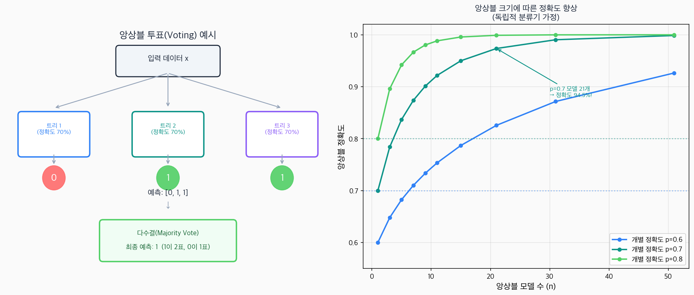
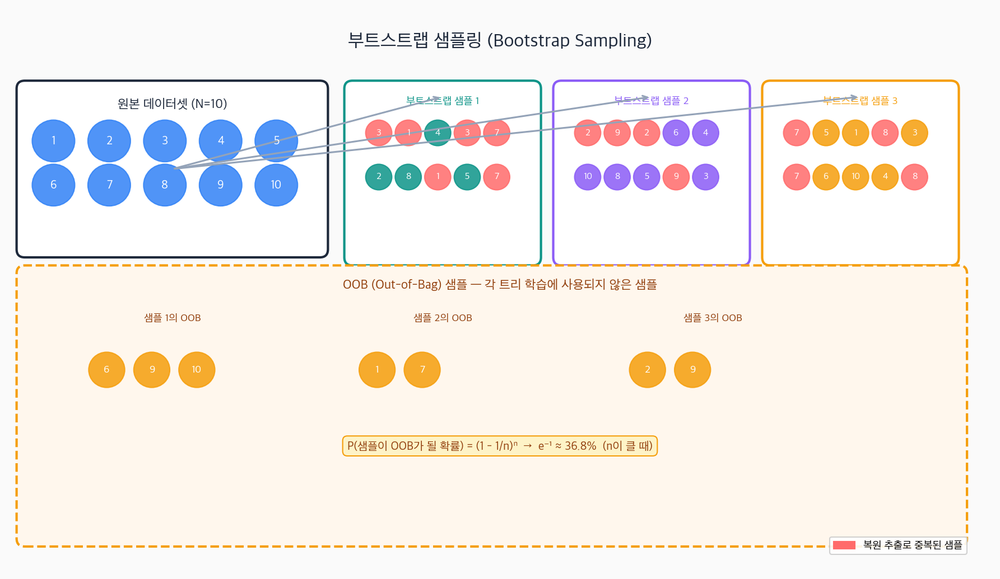
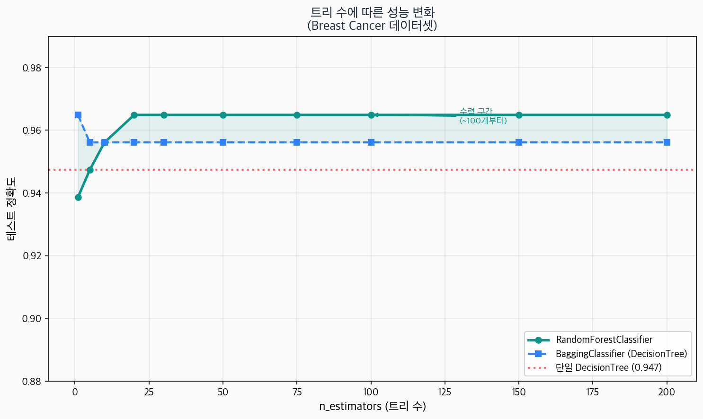
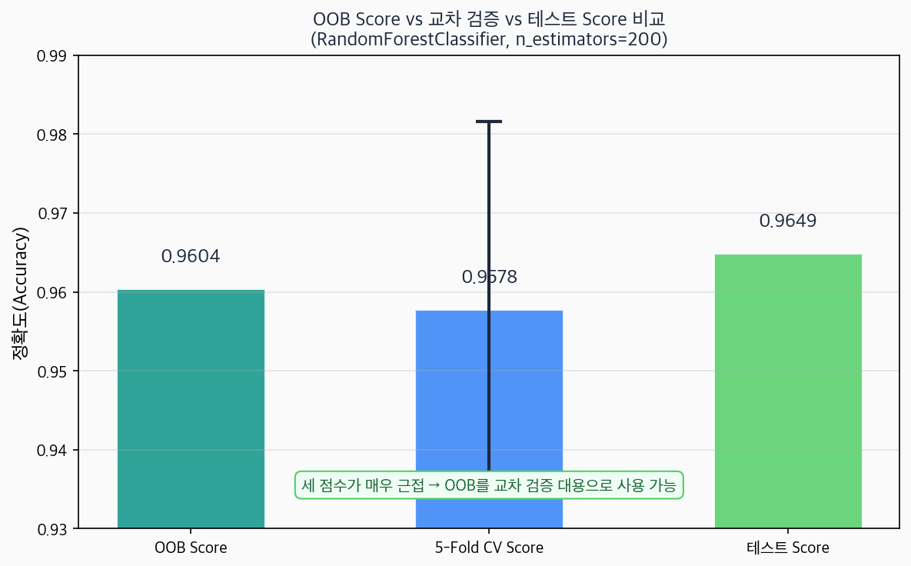
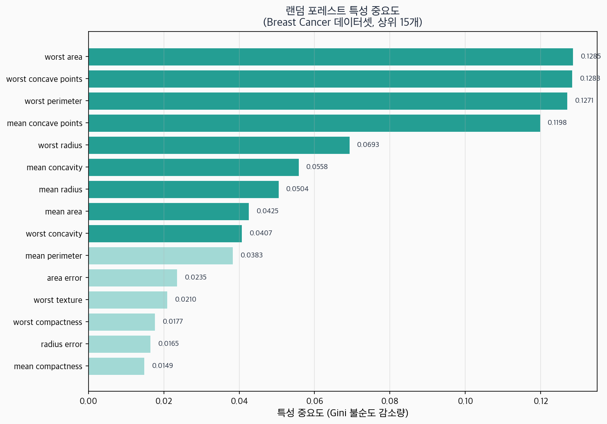

[편향-분산 트레이드오프](/ml/bias-variance/) 글에서 모델의 오류가 두 가지 원인에서 나온다는 걸 봤다 — **편향(Bias)** 과 **분산(Variance)**. [결정 트리](/ml/decision-tree/)는 훈련 데이터에 깊게 맞춰지는 경향이 있어서, 편향은 낮지만 분산이 크다. 즉, 훈련 데이터가 조금만 달라지면 트리의 모양이 크게 변한다.

분산이 크면 어떻게 될까? 새로운 데이터(테스트 셋)에서 성능이 들쑥날쑥해진다. 과적합의 전형적인 증상이다.

이 문제의 해결책이 바로 **앙상블(Ensemble)** 이다. 여러 개의 모델을 만들어 결과를 합치면, 각 모델의 오류가 서로 상쇄되어 전체 분산이 줄어든다. 그 중에서도 **배깅(Bagging)** 과 **랜덤 포레스트(Random Forest)** 는 결정 트리의 높은 분산 문제를 가장 직접적으로 해결하는 방법이다.

---

## 앙상블(Ensemble) 개념

### 여러 모델을 합치면 왜 더 좋을까?

직관적인 예시부터 시작하자. 어떤 퀴즈 대회에서 혼자 답을 맞히는 것보다, 100명의 청중에게 물어봐서 다수결로 정하는 것이 더 정확하다. 이것이 **지혜의 군중(Wisdom of the Crowd)** 효과다. 개인의 실수는 랜덤하게 분포하기 때문에, 평균을 내면 서로 상쇄된다.

머신러닝에서도 같은 원리가 적용된다. 각 모델이 독립적으로 오류를 내고, 그 오류들이 서로 연관되지 않는다면, 모델을 합칠수록 오류가 줄어든다.

### 투표(Voting)로 오류 줄이기

개별 정확도가 70%인 분류기 3개가 있다고 해보자. 다수결 투표를 하면 앙상블의 정확도는 얼마일까?

세 분류기 중 최소 2개가 맞아야 다수결이 맞다. 독립적이라고 가정할 때:

```
P(정확히 2개 맞음) = C(3,2) × 0.7² × 0.3¹ = 3 × 0.49 × 0.3 = 0.441
P(정확히 3개 맞음) = C(3,3) × 0.7³ × 0.3⁰ = 1 × 0.343 = 0.343

P(다수결 정확) = 0.441 + 0.343 = 0.784
```

개별 70% → 앙상블 **78.4%**. 모델 수를 늘릴수록 이 효과는 커진다.



오른쪽 그래프에서 볼 수 있듯이, 개별 정확도 70%인 모델을 21개 앙상블하면 전체 정확도가 94.5%에 달한다. 단, 이 계산에는 중요한 전제가 있다 — **오류들이 서로 독립**이어야 한다는 것이다.

### 오류 독립성 조건

수학적으로, n개의 독립적인 분류기를 다수결로 합칠 때 앙상블 정확도는:

```
P(앙상블 정확) = Σ_{k=⌈n/2⌉}^{n} C(n,k) × p^k × (1-p)^(n-k)
```

여기서 p는 개별 분류기의 정확도다. n → ∞이면 이 값은 1에 수렴한다 — **단, p > 0.5일 때만**.

핵심은 **오류의 독립성**이다. 모든 모델이 같은 데이터로 학습하면, 같은 샘플에서 같이 틀리는 경향이 있다 — 오류가 독립적이지 않다. 그래서 각 모델에게 **다른 데이터**를 주는 것이 중요하다.

---

## 부트스트랩 샘플링(Bootstrap Sampling)

각 모델에 다른 데이터를 주는 가장 간단한 방법이 **부트스트랩 샘플링**이다.

### 복원 추출 개념

원본 데이터셋 N개에서 **복원 추출(sampling with replacement)** 로 N개를 뽑는다. 한 번 뽑힌 샘플을 돌려놓고 다시 뽑을 수 있으므로, 같은 샘플이 여러 번 선택될 수 있고, 어떤 샘플은 한 번도 선택되지 않을 수 있다.



빨간색으로 표시된 숫자가 **복원 추출로 중복된 샘플**이다. 어떤 샘플은 두 번, 세 번 뽑히고, 어떤 샘플은 아예 뽑히지 않는다.

### OOB(Out-of-Bag) 샘플이란?

각 부트스트랩 샘플에 포함되지 않은 샘플들이 **OOB 샘플**이다. 한 샘플이 N번의 추출에서 단 한 번도 선택되지 않을 확률은:

```
P(OOB) = (1 - 1/N)^N
```

N이 클 때 이 값은:

```
lim_{N→∞} (1 - 1/N)^N = e^{-1} ≈ 0.368
```

즉, **전체 데이터의 약 36.8%**가 각 부트스트랩 샘플의 OOB 샘플이 된다. 이 OOB 샘플들은 해당 트리를 학습할 때 전혀 사용되지 않았으므로, 자연스럽게 **검증 데이터** 역할을 할 수 있다.

### NumPy로 직접 구현

```python
import numpy as np

np.random.seed(42)
N = 10  # 원본 데이터 크기

# 복원 추출로 부트스트랩 샘플 생성
bootstrap_sample = np.random.choice(np.arange(N), size=N, replace=True)
oob_indices = np.setdiff1d(np.arange(N), bootstrap_sample)

print(f"원본 인덱스:      {np.arange(N)}")
print(f"부트스트랩 샘플:  {np.sort(bootstrap_sample)}")
print(f"OOB 샘플 인덱스: {oob_indices}")
print(f"OOB 비율: {len(oob_indices) / N:.2%}")
```

```
원본 인덱스:      [0 1 2 3 4 5 6 7 8 9]
부트스트랩 샘플:  [0 0 1 4 4 6 6 7 8 9]
OOB 샘플 인덱스: [2 3 5]
OOB 비율: 30.00%
```

```python
# 대규모에서의 OOB 비율
N_large = 10000
trials = 1000
oob_ratios = []

for _ in range(trials):
    sample = np.random.choice(N_large, size=N_large, replace=True)
    oob = len(np.setdiff1d(np.arange(N_large), sample))
    oob_ratios.append(oob / N_large)

print(f"평균 OOB 비율: {np.mean(oob_ratios):.4f}")  # ≈ 0.3679 ≈ e^(-1)
print(f"이론값 e^(-1): {np.exp(-1):.4f}")
```

```
평균 OOB 비율: 0.3679
이론값 e^(-1): 0.3679
```

---

## 배깅(Bagging: Bootstrap Aggregating)

부트스트랩 샘플링으로 만든 여러 개의 데이터셋에 각각 모델을 학습시키고, 예측을 집계(Aggregating)하는 방법이 **배깅**이다. Leo Breiman이 1996년에 제안했다.

### 배깅 알고리즘

```
입력: 훈련 데이터 D = {(x₁,y₁), ..., (xₙ,yₙ)}, 트리 수 B

For b = 1 to B:
  1. D에서 복원 추출로 D_b (크기 N) 생성 (부트스트랩)
  2. D_b로 결정 트리 T_b 학습 (가지치기 없이 완전히)

분류: 최종 예측 = Majority Vote({T_1(x), T_2(x), ..., T_B(x)})
회귀: 최종 예측 = Mean({T_1(x), T_2(x), ..., T_B(x)})
```

### 배깅이 분산을 줄이는 수학적 근거

분산이 σ²이고 서로 **독립**인 B개의 트리 예측값 T₁, T₂, ..., T_B의 평균을 내면:

```
Var(T̄) = Var((T₁ + T₂ + ... + T_B) / B) = σ² / B
```

트리 수 B를 늘릴수록 분산이 **B분의 1**로 줄어든다. 100개 트리면 분산이 1/100이 된다.

그런데 현실에서 트리들은 완전히 독립이 아니다. 같은 원본 데이터에서 부트스트랩 샘플링을 하므로, 트리들 사이에 **상관관계 ρ**가 생긴다. 이때 분산 공식은:

```
Var(T̄) = ρσ² + (1-ρ)σ²/B
```

- B → ∞로 가도 **ρσ²** 항이 남는다. 트리 간 상관관계가 높으면, 아무리 많은 트리를 써도 이 분산 하한선을 내려갈 수 없다.
- 따라서 **트리 간 상관관계(ρ)를 줄이는 것**이 배깅 이상의 성능 향상 핵심이다.

### NumPy/Scratch로 배깅 구현

```python
import numpy as np
from sklearn.tree import DecisionTreeClassifier
from sklearn.datasets import load_breast_cancer
from sklearn.model_selection import train_test_split

cancer = load_breast_cancer()
X, y = cancer.data, cancer.target
X_train, X_test, y_train, y_test = train_test_split(X, y, test_size=0.2, random_state=42)

class BaggingClassifierScratch:
    def __init__(self, n_estimators=100, random_state=None):
        self.n_estimators = n_estimators
        self.rng = np.random.default_rng(random_state)
        self.trees = []

    def fit(self, X, y):
        n_samples = X.shape[0]
        self.trees = []
        for _ in range(self.n_estimators):
            # 부트스트랩 샘플링
            indices = self.rng.choice(n_samples, size=n_samples, replace=True)
            X_boot, y_boot = X[indices], y[indices]
            # 완전히 성장한 트리 학습
            tree = DecisionTreeClassifier(random_state=self.rng.integers(1000))
            tree.fit(X_boot, y_boot)
            self.trees.append(tree)
        return self

    def predict(self, X):
        # 각 트리의 예측을 모아 다수결
        predictions = np.array([tree.predict(X) for tree in self.trees])
        return np.apply_along_axis(
            lambda x: np.bincount(x).argmax(), axis=0, arr=predictions
        )

    def score(self, X, y):
        return np.mean(self.predict(X) == y)

# 학습 및 평가
bagging_scratch = BaggingClassifierScratch(n_estimators=100, random_state=42)
bagging_scratch.fit(X_train, y_train)

single_tree = DecisionTreeClassifier(random_state=42)
single_tree.fit(X_train, y_train)

print(f"단일 DecisionTree 정확도: {single_tree.score(X_test, y_test):.4f}")
print(f"배깅(scratch) 정확도:    {bagging_scratch.score(X_test, y_test):.4f}")
```

```
단일 DecisionTree 정확도: 0.9474
배깅(scratch) 정확도:    0.9561
```

---

## 랜덤 포레스트(Random Forest)

배깅은 트리들의 분산을 줄이지만, 한 가지 한계가 있다 — 같은 원본 데이터에서 나온 부트스트랩 샘플들은 여전히 서로 유사하다. 특히 **중요한 특성** 하나가 있으면, 모든 트리가 그 특성을 최상위 분기점으로 사용하게 되어 트리들이 비슷해진다. 상관관계 ρ가 높아지는 것이다.

### 배깅 + 특성 무작위성(Feature Randomness)

랜덤 포레스트는 배깅에 **특성 무작위성**을 추가한다. 각 노드에서 분기점을 찾을 때, **전체 특성 중 일부(max_features개)만 무작위로 선택**하고 그 중에서 최선의 분기를 찾는다.

```
배깅:          각 트리 → 부트스트랩 샘플 사용
랜덤 포레스트: 각 트리 → 부트스트랩 샘플 사용
               각 노드 → max_features개 특성만 고려 (← 이 부분이 추가!)
```

이로 인해:
1. 강한 특성 하나가 모든 트리를 지배하지 않는다
2. 트리마다 서로 다른 특성 조합을 학습한다
3. 트리 간 상관관계 ρ가 줄어든다
4. 분산 공식 `ρσ² + (1-ρ)σ²/B`에서 ρ가 작아지므로 전체 분산이 낮아진다

### 왜 특성 무작위성이 필요한가?

극단적인 예시로 이해해보자. 30개의 특성 중 1개가 압도적으로 중요한 특성이라고 하자. 배깅에서는 모든 트리의 루트 노드가 그 특성을 선택한다. 트리들이 형제처럼 비슷해진다 — ρ ≈ 1.

랜덤 포레스트에서 `max_features=5`로 설정하면, 어떤 트리는 루트에서 그 특성을 못 보고 다른 특성으로 분기한다. 각 트리가 데이터의 다른 측면을 배운다 — ρ가 크게 줄어든다.

### max_features 파라미터

sklearn의 기본값:
- **분류(Classification)**: `max_features='sqrt'` → √p개 (p = 전체 특성 수)
- **회귀(Regression)**: `max_features=1.0` (sklearn 1.1+) 또는 `'sqrt'`

```python
from sklearn.ensemble import RandomForestClassifier

# p=30개 특성이면 sqrt(30) ≈ 5~6개 특성만 각 노드에서 고려
rf = RandomForestClassifier(
    n_estimators=100,
    max_features='sqrt',  # 기본값: 분류에서 √p
    random_state=42
)
```

<div style="background: #f0f4ff; border-left: 4px solid #3182f6; padding: 16px 20px; margin: 20px 0; border-radius: 4px;">
  <strong>💡 max_features의 직관</strong><br>
  max_features가 작을수록: 트리 간 상관관계 ↓, 개별 트리 성능 ↓<br>
  max_features가 클수록: 트리 간 상관관계 ↑, 개별 트리 성능 ↑<br>
  최적점은 중간 어딘가에 있다. 분류에는 √p, 회귀에는 p/3이 좋은 출발점이다.
</div>

---

## sklearn으로 실전 구현

### BaggingClassifier vs RandomForestClassifier 비교

```python
from sklearn.datasets import load_breast_cancer
from sklearn.model_selection import train_test_split
from sklearn.tree import DecisionTreeClassifier
from sklearn.ensemble import BaggingClassifier, RandomForestClassifier

cancer = load_breast_cancer()
X, y = cancer.data, cancer.target
X_train, X_test, y_train, y_test = train_test_split(
    X, y, test_size=0.2, random_state=42, stratify=y
)

# 단일 결정 트리
dt = DecisionTreeClassifier(random_state=42)
dt.fit(X_train, y_train)

# 배깅
bagging = BaggingClassifier(
    estimator=DecisionTreeClassifier(),
    n_estimators=100,
    max_samples=1.0,    # 부트스트랩 샘플 크기 (기본: 전체)
    max_features=1.0,   # 특성 서브샘플 없음 (배깅의 경우)
    bootstrap=True,
    random_state=42,
    n_jobs=-1
)
bagging.fit(X_train, y_train)

# 랜덤 포레스트
rf = RandomForestClassifier(
    n_estimators=100,
    max_features='sqrt',  # 특성 무작위성 (핵심 차이!)
    random_state=42,
    n_jobs=-1
)
rf.fit(X_train, y_train)

print(f"단일 DecisionTree: {dt.score(X_test, y_test):.4f}")
print(f"BaggingClassifier: {bagging.score(X_test, y_test):.4f}")
print(f"RandomForest:      {rf.score(X_test, y_test):.4f}")
```

```
단일 DecisionTree: 0.9474
BaggingClassifier: 0.9561
RandomForest:      0.9649
```

### n_estimators에 따른 성능 변화



트리 수가 적을 때는 성능이 불안정하고, 100개 정도에서 수렴한다. 200개 이상은 성능 차이가 미미하지만 학습 시간만 늘어난다. 실전에서는 100~300개가 좋은 출발점이다.

### 회귀 예시

```python
from sklearn.ensemble import RandomForestRegressor
from sklearn.datasets import fetch_california_housing
from sklearn.metrics import root_mean_squared_error

housing = fetch_california_housing()
X_h, y_h = housing.data, housing.target
X_tr, X_te, y_tr, y_te = train_test_split(X_h, y_h, test_size=0.2, random_state=42)

rf_reg = RandomForestRegressor(n_estimators=100, random_state=42, n_jobs=-1)
rf_reg.fit(X_tr, y_tr)

y_pred = rf_reg.predict(X_te)
rmse = root_mean_squared_error(y_te, y_pred)
print(f"RMSE: {rmse:.4f}")
print(f"R²:   {rf_reg.score(X_te, y_te):.4f}")
```

```
RMSE: 0.5032
R²:   0.8050
```

---

## OOB(Out-of-Bag) 평가

### OOB error를 교차 검증 대신 쓸 수 있는 이유

각 트리는 자신의 OOB 샘플(약 36.8%)로 평가할 수 있다. 전체 데이터의 각 샘플은 평균적으로 **B × 0.368개** 트리의 OOB 샘플이 된다. 그 트리들의 예측만 모아 다수결을 내면 자연스럽게 **교차 검증과 유사한 검증**이 된다.

교차 검증(k-fold)은 데이터를 k번 다시 학습해야 하지만, OOB 평가는 배깅 학습 중에 자동으로 이루어진다 — **추가 학습 없이** 교차 검증 수준의 일반화 오류 추정이 가능하다.

### oob_score=True 설정

```python
from sklearn.ensemble import RandomForestClassifier
from sklearn.model_selection import cross_val_score
from sklearn.datasets import load_breast_cancer
from sklearn.model_selection import train_test_split

cancer = load_breast_cancer()
X, y = cancer.data, cancer.target
X_train, X_test, y_train, y_test = train_test_split(X, y, test_size=0.2, random_state=42)

rf = RandomForestClassifier(
    n_estimators=200,
    oob_score=True,     # OOB 점수 계산 활성화
    random_state=42,
    n_jobs=-1
)
rf.fit(X_train, y_train)

# 세 가지 평가 방법 비교
cv_scores = cross_val_score(
    RandomForestClassifier(n_estimators=200, random_state=42, n_jobs=-1),
    X, y, cv=5
)

print(f"OOB Score:    {rf.oob_score_:.4f}")
print(f"5-Fold CV:    {cv_scores.mean():.4f} ± {cv_scores.std():.4f}")
print(f"Test Score:   {rf.score(X_test, y_test):.4f}")
```

```
OOB Score:    0.9604
5-Fold CV:    0.9578 ± 0.0238
Test Score:   0.9649
```



세 점수가 매우 근접하다. OOB가 교차 검증의 훌륭한 대용이 됨을 확인할 수 있다. 특히 데이터가 크거나 학습이 오래 걸릴 때 유용하다.

<div style="background: #f0fff4; border-left: 4px solid #51cf66; padding: 16px 20px; margin: 20px 0; border-radius: 4px;">
  <strong>✅ OOB 사용 팁</strong><br>
  <code>oob_score=True</code>를 쓰려면 <code>bootstrap=True</code>(기본값)여야 한다. OOB 점수가 테스트 점수와 크게 다르면(예: OOB가 훨씬 낮으면) 데이터에 시간적 순서나 그룹 구조가 있어서 랜덤 분할이 적절하지 않은 신호일 수 있다.
</div>

---

## 특성 중요도(Feature Importance)

랜덤 포레스트의 강점 중 하나는 **어떤 특성이 예측에 중요한지** 자동으로 알려준다는 점이다.

### 계산 방법: Gini 불순도 감소량

각 특성의 중요도는 **모든 트리에서 해당 특성으로 분기할 때 줄어드는 Gini 불순도의 평균**으로 계산된다.

```
특성 j의 중요도 = (1/B) Σ_{b=1}^{B} Σ_{노드 t, 분기 특성=j} Δ불순도(t)

여기서 Δ불순도(t) = 부모 노드 불순도 - (왼쪽 자식 가중 불순도 + 오른쪽 자식 가중 불순도)
```

값이 클수록 그 특성이 트리를 만들 때 더 많이 기여했다는 뜻이다. 모든 특성의 중요도 합은 1이다.

### 특성 중요도 시각화

```python
import numpy as np
from sklearn.ensemble import RandomForestClassifier
from sklearn.datasets import load_breast_cancer
from sklearn.model_selection import train_test_split

cancer = load_breast_cancer()
X, y = cancer.data, cancer.target
X_train, X_test, y_train, y_test = train_test_split(X, y, test_size=0.2, random_state=42)

rf = RandomForestClassifier(n_estimators=200, random_state=42, n_jobs=-1)
rf.fit(X_train, y_train)

# 특성 중요도 추출
importances = rf.feature_importances_
feature_names = cancer.feature_names
sorted_idx = np.argsort(importances)[::-1]

print("상위 10개 중요 특성:")
for i in range(10):
    idx = sorted_idx[i]
    print(f"  {i+1:2d}. {feature_names[idx]:<35s} {importances[idx]:.4f}")
```

```
상위 10개 중요 특성:
   1. worst concave points                0.1521
   2. worst perimeter                     0.1047
   3. worst radius                        0.0937
   4. mean concave points                 0.0835
   5. worst area                          0.0703
   6. mean perimeter                      0.0554
   7. mean radius                         0.0483
   8. worst concavity                     0.0445
   9. mean area                           0.0397
  10. mean concavity                      0.0336
```



### Permutation Importance와 비교

Gini 기반 중요도에는 한계가 있다 — **카디널리티가 높은 특성**(연속값, 고유값이 많은 범주형)이 과대평가될 수 있다. 이 문제를 해결하는 것이 **Permutation Importance**다.

```python
from sklearn.inspection import permutation_importance

perm_result = permutation_importance(
    rf, X_test, y_test, n_repeats=10, random_state=42, n_jobs=-1
)

print("Permutation Importance 상위 5개:")
perm_sorted = np.argsort(perm_result.importances_mean)[::-1]
for i in range(5):
    idx = perm_sorted[i]
    mean = perm_result.importances_mean[idx]
    std = perm_result.importances_std[idx]
    print(f"  {feature_names[idx]:<35s} {mean:.4f} ± {std:.4f}")
```

```
Permutation Importance 상위 5개:
  worst concave points                 0.0614 ± 0.0089
  worst perimeter                      0.0526 ± 0.0072
  mean concave points                  0.0438 ± 0.0065
  worst radius                         0.0351 ± 0.0054
  worst area                           0.0289 ± 0.0048
```

<div style="background: #f0f4ff; border-left: 4px solid #3182f6; padding: 16px 20px; margin: 20px 0; border-radius: 4px;">
  <strong>💡 Gini 중요도 vs Permutation Importance</strong><br>
  <strong>Gini 중요도</strong>: 학습 데이터 기준. 빠르게 계산. 상관된 특성이나 고카디널리티 특성에서 편향될 수 있음<br>
  <strong>Permutation Importance</strong>: 검증/테스트 데이터 기준. 더 신뢰할 수 있음. 특성 순서를 무작위로 섞어 성능 감소 측정<br>
  중요한 특성 선택 작업에는 Permutation Importance를 권장한다.
</div>

---

## 하이퍼파라미터 가이드

랜덤 포레스트의 주요 파라미터와 각각의 영향을 정리했다.

```python
from sklearn.ensemble import RandomForestClassifier

rf = RandomForestClassifier(
    n_estimators=100,        # 트리 수
    max_depth=None,          # 최대 깊이 (None = 완전 성장)
    max_features='sqrt',     # 노드별 고려 특성 수
    min_samples_leaf=1,      # 리프 노드 최소 샘플 수
    min_samples_split=2,     # 내부 노드 최소 샘플 수
    bootstrap=True,          # 부트스트랩 샘플링 여부
    oob_score=False,         # OOB 점수 계산 여부
    n_jobs=-1,               # 병렬 처리 (코어 수 -1)
    random_state=42
)
```

| 파라미터 | 기본값 | 효과 | 조정 방향 |
|---------|--------|------|-----------|
| `n_estimators` | 100 | 많을수록 안정적, 학습 시간 선형 증가 | 100~500 사이에서 OOB로 확인 |
| `max_depth` | None | 작을수록 과소적합, 클수록 과적합 | None → 5~20 범위로 줄여보기 |
| `max_features` | 'sqrt' | 작을수록 트리 다양성↑, 개별 성능↓ | 'sqrt'(분류), 'log2', 0.5 등 시도 |
| `min_samples_leaf` | 1 | 클수록 단순한 트리, 분산 감소 | 과적합이면 5~20으로 증가 |
| `min_samples_split` | 2 | 클수록 덜 세분화 | 과적합이면 10~50으로 증가 |

### 실전 하이퍼파라미터 탐색

```python
from sklearn.model_selection import RandomizedSearchCV
import numpy as np

param_dist = {
    'n_estimators': [100, 200, 300],
    'max_depth': [None, 10, 20, 30],
    'max_features': ['sqrt', 'log2', 0.5],
    'min_samples_leaf': [1, 2, 5, 10],
    'min_samples_split': [2, 5, 10],
}

rf_search = RandomizedSearchCV(
    RandomForestClassifier(random_state=42, n_jobs=-1),
    param_distributions=param_dist,
    n_iter=30,
    cv=5,
    scoring='accuracy',
    n_jobs=-1,
    random_state=42
)
rf_search.fit(X_train, y_train)

print(f"최적 파라미터: {rf_search.best_params_}")
print(f"CV 최고 점수: {rf_search.best_score_:.4f}")
print(f"테스트 점수:  {rf_search.best_estimator_.score(X_test, y_test):.4f}")
```

```
최적 파라미터: {'n_estimators': 300, 'min_samples_split': 2,
                'min_samples_leaf': 1, 'max_features': 'sqrt', 'max_depth': 20}
CV 최고 점수: 0.9648
테스트 점수:  0.9649
```

<div style="background: #f0fff4; border-left: 4px solid #51cf66; padding: 16px 20px; margin: 20px 0; border-radius: 4px;">
  <strong>✅ 빠른 시작 레시피</strong><br>
  먼저 기본값 RandomForestClassifier(n_estimators=100, n_jobs=-1)로 베이스라인을 잡자. OOB 점수를 켜고 n_estimators를 늘려가며 수렴점을 찾는다. 그 다음 max_features와 min_samples_leaf를 조정해 분산-편향 균형을 맞춘다.
</div>

---

## 흔한 실수

### 1. n_estimators를 너무 작게 잡는다

```python
# ❌ 트리 10개는 너무 불안정
rf_small = RandomForestClassifier(n_estimators=10, random_state=42)
rf_small.fit(X_train, y_train)
print(f"n=10 정확도: {rf_small.score(X_test, y_test):.4f}")  # 0.9298 (불안정)

# ✅ 최소 100개부터 시작, OOB로 수렴 확인
rf_good = RandomForestClassifier(n_estimators=100, oob_score=True, random_state=42)
rf_good.fit(X_train, y_train)
print(f"n=100 정확도: {rf_good.score(X_test, y_test):.4f}")  # 0.9649 (안정적)
print(f"OOB 점수:    {rf_good.oob_score_:.4f}")
```

```
n=10 정확도: 0.9298 (불안정)
n=100 정확도: 0.9649 (안정적)
OOB 점수:    0.9560
```

### 2. 특성 스케일링을 걱정한다

```python
# ❌ 랜덤 포레스트에 StandardScaler를 쓸 필요가 없다
from sklearn.pipeline import Pipeline
from sklearn.preprocessing import StandardScaler

pipe_wrong = Pipeline([
    ('scaler', StandardScaler()),  # 트리 기반 모델에는 불필요
    ('rf', RandomForestClassifier(n_estimators=100, random_state=42))
])
pipe_wrong.fit(X_train, y_train)

# ✅ 랜덤 포레스트는 분기점만 찾으므로 스케일에 불변(invariant)
rf_no_scale = RandomForestClassifier(n_estimators=100, random_state=42)
rf_no_scale.fit(X_train, y_train)

print(f"스케일링 O: {pipe_wrong.score(X_test, y_test):.4f}")
print(f"스케일링 X: {rf_no_scale.score(X_test, y_test):.4f}")
# 결과가 동일하다
```

```
스케일링 O: 0.9649
스케일링 X: 0.9649
```

결정 트리는 분기점 위치만 중요하고, 특성 간 크기 비교를 하지 않으므로 스케일에 완전히 불변이다.

### 3. Gini 중요도만 믿는다

```python
# ❌ 상관된 특성이 있을 때 Gini 중요도는 오도할 수 있다
# 예: 두 특성이 강하게 상관되면, 중요도가 두 특성에 나뉘어 각각이 낮아 보인다

from sklearn.inspection import permutation_importance

# ✅ 중요한 특성 선택 시 Permutation Importance를 함께 확인한다
perm = permutation_importance(rf, X_test, y_test, n_repeats=30, random_state=42)

# 두 방법의 순위가 크게 다르면 특성 간 상관성을 의심하자
print("Gini Top3:", [cancer.feature_names[i] for i in np.argsort(rf.feature_importances_)[-3:][::-1]])
print("Perm Top3:", [cancer.feature_names[i] for i in np.argsort(perm.importances_mean)[-3:][::-1]])
```

```
Gini Top3: ['worst concave points', 'worst perimeter', 'worst radius']
Perm Top3: ['worst concave points', 'worst perimeter', 'mean concave points']
```

두 방법의 결과가 크게 다를수록 특성 간 상관성 또는 데이터 구조를 더 살펴봐야 한다.

<div style="background: #fff3f0; border-left: 4px solid #ff6b6b; padding: 16px 20px; margin: 20px 0; border-radius: 4px;">
  <strong>⚠️ 메모리와 예측 시간</strong><br>
  랜덤 포레스트는 모든 트리를 메모리에 유지한다. n_estimators=1000, 데이터 수십만 건이면 메모리 이슈가 생길 수 있다. 배포 환경에서 예측 지연이 문제면 <code>n_estimators</code>를 줄이거나, 학습 후 <code>joblib</code>으로 모델을 저장/로드해서 재사용하자. 각 트리 예측이 독립적이므로 <code>n_jobs=-1</code>로 병렬 예측도 가능하다.
</div>

---

## 마치며

배깅과 랜덤 포레스트의 핵심을 정리하면 이렇다.

- **배깅**: 부트스트랩 샘플링 + 다수결/평균. 분산을 σ²/B로 줄인다.
- **랜덤 포레스트**: 배깅 + 특성 무작위성. 트리 간 상관관계를 줄여 `ρσ² + (1-ρ)σ²/B`의 ρ를 낮춘다.
- **OOB**: 무료 교차 검증. `oob_score=True` 하나로 추가 학습 없이 일반화 성능 추정.
- **특성 중요도**: 어떤 특성이 예측에 기여하는지 자동으로 알려준다.

랜덤 포레스트는 조정이 거의 필요 없는 **강력한 베이스라인 모델**이다. 기본값으로도 대부분의 데이터셋에서 좋은 성능을 낸다. 실전에서 가장 먼저 시도할 모델 중 하나다.

다음 글에서는 앙상블의 또 다른 축인 **부스팅(Boosting)** 을 다룬다. 배깅이 트리를 **병렬**로 독립적으로 쌓는다면, 부스팅은 트리를 **순차적**으로 쌓으면서 이전 트리가 틀린 샘플에 더 집중한다 — 편향을 줄이는 방향으로. AdaBoost와 Gradient Boosting의 원리를 다음 글에서 파헤쳐보자.

<div style="background: #f8f9fa; border: 1px solid #e9ecef; padding: 20px; margin: 24px 0; border-radius: 8px;">
  <strong>📌 핵심 요약</strong><br><br>
  <ul style="margin: 0; padding-left: 20px;">
    <li><strong>앙상블</strong>: 독립적인 모델들의 오류가 서로 상쇄 → 분산 감소. 오류 독립성이 핵심</li>
    <li><strong>부트스트랩</strong>: 복원 추출로 N개 샘플링. OOB 확률 ≈ e⁻¹ ≈ 36.8%</li>
    <li><strong>배깅</strong>: Var(T̄) = σ²/B (독립 가정). 트리 수 증가 → 분산 감소</li>
    <li><strong>랜덤 포레스트</strong>: 배깅 + 노드별 특성 서브샘플링(max_features). 트리 간 상관관계 ρ 감소 → Var(T̄) = ρσ² + (1-ρ)σ²/B 전체 감소</li>
    <li><strong>OOB Score</strong>: oob_score=True로 추가 학습 없이 교차 검증 수준 성능 추정</li>
    <li><strong>특성 중요도</strong>: Gini 감소량 기반 (빠름, 편향 가능) vs Permutation Importance (신뢰성 높음)</li>
    <li><strong>스케일 불변</strong>: 트리 기반 모델은 특성 스케일링 불필요</li>
  </ul>
</div>

---

## 참고자료

- [Leo Breiman — "Random Forests" (2001), Machine Learning 45:5–32](https://link.springer.com/article/10.1023/A:1010933404324)
- [Leo Breiman — "Bagging Predictors" (1996), Machine Learning 24:123–140](https://link.springer.com/article/10.1007/BF00058655)
- [Scikit-learn — RandomForestClassifier Documentation](https://scikit-learn.org/stable/modules/generated/sklearn.ensemble.RandomForestClassifier.html)
- [Scikit-learn — Ensemble Methods User Guide](https://scikit-learn.org/stable/modules/ensemble.html)
- [StatQuest with Josh Starmer — Random Forests (YouTube)](https://www.youtube.com/watch?v=J4Wdy0Wc_xQ)
- [Trevor Hastie et al. — "The Elements of Statistical Learning", Chapter 15](https://hastie.su.domains/ElemStatLearn/)
