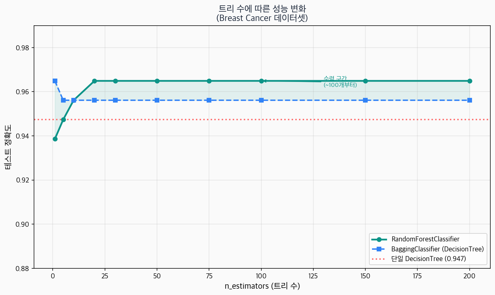

배깅은 부트스트랩으로 뽑은 서로 다른 훈련 데이터에 트리를 한 그루씩 학습시키고 예측을 다수결로 모은다. 트리들이 완전히 독립이라면 평균의 분산은 트리 수 $B$ 에 반비례해 줄어든다. 하지만 모든 트리가 같은 원본에서 나왔기 때문에 서로 닮고, 그 상관관계 $\rho$ 때문에 실제 분산은 $\rho \sigma^2 + \frac{1-\rho}{B}\sigma^2$ 가 된다. 뒷항은 트리를 늘리면 사라지지만 앞항은 트리를 만 그루 심어도 그대로다.

랜덤 포레스트는 남는 쪽을 겨냥한다. 각 노드에서 분기 후보로 쓸 특성을 전체가 아니라 **무작위로 고른 일부**로 제한한다. 이 한 줄짜리 변경이 $\rho$ 를 끌어내린다.

---

## 후보 특성을 무작위로 제한한다

배깅에서 트리들이 닮아버리는 주범은 예측력이 유난히 강한 특성 하나다. 어느 부트스트랩 샘플을 쓰든 그 특성이 불순도를 가장 많이 줄이므로, 모든 트리가 그것을 루트에 놓는다. 데이터는 달랐는데 트리는 같은 자리에서 갈라지고, 결국 같은 샘플에서 나란히 틀린다.

랜덤 포레스트는 노드마다 후보 명단을 새로 뽑는다. 명단에 그 강한 특성이 없으면, 그 노드는 어쩔 수 없이 두 번째로 좋은 특성으로 분기한다.

<div style="margin: 24px 0; text-align: center;">
<svg viewBox="0 0 400 264" style="width: 100%; height: auto; max-width: 380px;"
     xmlns="http://www.w3.org/2000/svg"
     font-family="Pretendard, -apple-system, sans-serif"
     role="img" aria-label="위쪽은 배깅에서 여덟 개 특성이 모두 후보라 항상 f3이 선택되는 모습, 아래쪽은 랜덤 포레스트에서 노드마다 세 개씩만 후보로 뽑혀 f3, f5, f7이 각각 선택되는 모습">
<text x="200" y="22" text-anchor="middle" font-size="16" font-weight="700" fill="var(--text, #1c1917)">분기 후보가 되는 특성</text>
<!-- 위: 배깅 -->
<text x="18" y="48" font-size="14" fill="var(--text-muted, #6d6762)">위: 배깅 (특성 8개가 모두 후보)</text>
<rect x="18" y="58" width="32" height="26" rx="4" fill="var(--primary, #0a756c)"/>
<text x="34" y="76" text-anchor="middle" font-size="14" fill="var(--on-fill, #ffffff)">f1</text>
<rect x="54" y="58" width="32" height="26" rx="4" fill="var(--primary, #0a756c)"/>
<text x="70" y="76" text-anchor="middle" font-size="14" fill="var(--on-fill, #ffffff)">f2</text>
<rect x="90" y="58" width="32" height="26" rx="4" fill="var(--primary, #0a756c)"/>
<text x="106" y="76" text-anchor="middle" font-size="14" fill="var(--on-fill, #ffffff)">f3</text>
<rect x="126" y="58" width="32" height="26" rx="4" fill="var(--primary, #0a756c)"/>
<text x="142" y="76" text-anchor="middle" font-size="14" fill="var(--on-fill, #ffffff)">f4</text>
<rect x="162" y="58" width="32" height="26" rx="4" fill="var(--primary, #0a756c)"/>
<text x="178" y="76" text-anchor="middle" font-size="14" fill="var(--on-fill, #ffffff)">f5</text>
<rect x="198" y="58" width="32" height="26" rx="4" fill="var(--primary, #0a756c)"/>
<text x="214" y="76" text-anchor="middle" font-size="14" fill="var(--on-fill, #ffffff)">f6</text>
<rect x="234" y="58" width="32" height="26" rx="4" fill="var(--primary, #0a756c)"/>
<text x="250" y="76" text-anchor="middle" font-size="14" fill="var(--on-fill, #ffffff)">f7</text>
<rect x="270" y="58" width="32" height="26" rx="4" fill="var(--primary, #0a756c)"/>
<text x="286" y="76" text-anchor="middle" font-size="14" fill="var(--on-fill, #ffffff)">f8</text>
<text x="318" y="76" font-size="14" fill="var(--text, #1c1917)">선택 f3</text>
<line x1="18" y1="100" x2="382" y2="100" stroke="var(--border, #e7e5e4)" stroke-width="1"/>
<!-- 아래: 랜덤 포레스트 -->
<text x="18" y="124" font-size="14" fill="var(--text-muted, #6d6762)">아래: 랜덤 포레스트 (노드마다 3개만 후보)</text>
<!-- 노드 1 -->
<rect x="18" y="134" width="32" height="26" rx="4" fill="var(--bg-subtle, #f5f4f2)" stroke="var(--border, #e7e5e4)"/>
<text x="34" y="152" text-anchor="middle" font-size="14" fill="var(--text-muted, #6d6762)">f1</text>
<rect x="54" y="134" width="32" height="26" rx="4" fill="var(--primary, #0a756c)"/>
<text x="70" y="152" text-anchor="middle" font-size="14" fill="var(--on-fill, #ffffff)">f2</text>
<rect x="90" y="134" width="32" height="26" rx="4" fill="var(--primary, #0a756c)"/>
<text x="106" y="152" text-anchor="middle" font-size="14" fill="var(--on-fill, #ffffff)">f3</text>
<rect x="126" y="134" width="32" height="26" rx="4" fill="var(--bg-subtle, #f5f4f2)" stroke="var(--border, #e7e5e4)"/>
<text x="142" y="152" text-anchor="middle" font-size="14" fill="var(--text-muted, #6d6762)">f4</text>
<rect x="162" y="134" width="32" height="26" rx="4" fill="var(--bg-subtle, #f5f4f2)" stroke="var(--border, #e7e5e4)"/>
<text x="178" y="152" text-anchor="middle" font-size="14" fill="var(--text-muted, #6d6762)">f5</text>
<rect x="198" y="134" width="32" height="26" rx="4" fill="var(--bg-subtle, #f5f4f2)" stroke="var(--border, #e7e5e4)"/>
<text x="214" y="152" text-anchor="middle" font-size="14" fill="var(--text-muted, #6d6762)">f6</text>
<rect x="234" y="134" width="32" height="26" rx="4" fill="var(--primary, #0a756c)"/>
<text x="250" y="152" text-anchor="middle" font-size="14" fill="var(--on-fill, #ffffff)">f7</text>
<rect x="270" y="134" width="32" height="26" rx="4" fill="var(--bg-subtle, #f5f4f2)" stroke="var(--border, #e7e5e4)"/>
<text x="286" y="152" text-anchor="middle" font-size="14" fill="var(--text-muted, #6d6762)">f8</text>
<text x="318" y="152" font-size="14" fill="var(--text, #1c1917)">선택 f3</text>
<!-- 노드 2 -->
<rect x="18" y="170" width="32" height="26" rx="4" fill="var(--primary, #0a756c)"/>
<text x="34" y="188" text-anchor="middle" font-size="14" fill="var(--on-fill, #ffffff)">f1</text>
<rect x="54" y="170" width="32" height="26" rx="4" fill="var(--bg-subtle, #f5f4f2)" stroke="var(--border, #e7e5e4)"/>
<text x="70" y="188" text-anchor="middle" font-size="14" fill="var(--text-muted, #6d6762)">f2</text>
<rect x="90" y="170" width="32" height="26" rx="4" fill="var(--bg-subtle, #f5f4f2)" stroke="var(--border, #e7e5e4)"/>
<text x="106" y="188" text-anchor="middle" font-size="14" fill="var(--text-muted, #6d6762)">f3</text>
<rect x="126" y="170" width="32" height="26" rx="4" fill="var(--bg-subtle, #f5f4f2)" stroke="var(--border, #e7e5e4)"/>
<text x="142" y="188" text-anchor="middle" font-size="14" fill="var(--text-muted, #6d6762)">f4</text>
<rect x="162" y="170" width="32" height="26" rx="4" fill="var(--primary, #0a756c)"/>
<text x="178" y="188" text-anchor="middle" font-size="14" fill="var(--on-fill, #ffffff)">f5</text>
<rect x="198" y="170" width="32" height="26" rx="4" fill="var(--bg-subtle, #f5f4f2)" stroke="var(--border, #e7e5e4)"/>
<text x="214" y="188" text-anchor="middle" font-size="14" fill="var(--text-muted, #6d6762)">f6</text>
<rect x="234" y="170" width="32" height="26" rx="4" fill="var(--bg-subtle, #f5f4f2)" stroke="var(--border, #e7e5e4)"/>
<text x="250" y="188" text-anchor="middle" font-size="14" fill="var(--text-muted, #6d6762)">f7</text>
<rect x="270" y="170" width="32" height="26" rx="4" fill="var(--primary, #0a756c)"/>
<text x="286" y="188" text-anchor="middle" font-size="14" fill="var(--on-fill, #ffffff)">f8</text>
<text x="318" y="188" font-size="14" fill="var(--text, #1c1917)">선택 f5</text>
<!-- 노드 3 -->
<rect x="18" y="206" width="32" height="26" rx="4" fill="var(--bg-subtle, #f5f4f2)" stroke="var(--border, #e7e5e4)"/>
<text x="34" y="224" text-anchor="middle" font-size="14" fill="var(--text-muted, #6d6762)">f1</text>
<rect x="54" y="206" width="32" height="26" rx="4" fill="var(--bg-subtle, #f5f4f2)" stroke="var(--border, #e7e5e4)"/>
<text x="70" y="224" text-anchor="middle" font-size="14" fill="var(--text-muted, #6d6762)">f2</text>
<rect x="90" y="206" width="32" height="26" rx="4" fill="var(--bg-subtle, #f5f4f2)" stroke="var(--border, #e7e5e4)"/>
<text x="106" y="224" text-anchor="middle" font-size="14" fill="var(--text-muted, #6d6762)">f3</text>
<rect x="126" y="206" width="32" height="26" rx="4" fill="var(--primary, #0a756c)"/>
<text x="142" y="224" text-anchor="middle" font-size="14" fill="var(--on-fill, #ffffff)">f4</text>
<rect x="162" y="206" width="32" height="26" rx="4" fill="var(--bg-subtle, #f5f4f2)" stroke="var(--border, #e7e5e4)"/>
<text x="178" y="224" text-anchor="middle" font-size="14" fill="var(--text-muted, #6d6762)">f5</text>
<rect x="198" y="206" width="32" height="26" rx="4" fill="var(--primary, #0a756c)"/>
<text x="214" y="224" text-anchor="middle" font-size="14" fill="var(--on-fill, #ffffff)">f6</text>
<rect x="234" y="206" width="32" height="26" rx="4" fill="var(--primary, #0a756c)"/>
<text x="250" y="224" text-anchor="middle" font-size="14" fill="var(--on-fill, #ffffff)">f7</text>
<rect x="270" y="206" width="32" height="26" rx="4" fill="var(--bg-subtle, #f5f4f2)" stroke="var(--border, #e7e5e4)"/>
<text x="286" y="224" text-anchor="middle" font-size="14" fill="var(--text-muted, #6d6762)">f8</text>
<text x="318" y="224" font-size="14" fill="var(--text, #1c1917)">선택 f7</text>
<text x="18" y="250" font-size="14" fill="var(--text-muted, #6d6762)">색이 찬 칸 = 그 노드의 후보 특성</text>
</svg>
</div>

f3이 가장 강한 특성이지만 후보로 뽑히는 노드에서만 쓰인다. 나머지 노드는 f5나 f7로 갈라지고, 그렇게 자란 트리들은 서로 다른 곳에서 틀린다. 이것이 $\rho$ 가 내려간다는 말의 실제 내용이다.

대가가 없지는 않다. 후보를 줄이면 각 노드는 전체 중 최선이 아닌 분기를 고르게 되므로 **개별 트리의 성능은 떨어진다**. 랜덤 포레스트는 개별 트리를 조금 나쁘게 만드는 대신 트리들 사이의 상관관계를 크게 낮추는 거래이고, $\rho\sigma^2$ 이 분산의 바닥을 정하는 구조에서는 이 거래가 대체로 남는 장사다.

### max_features

후보 명단의 크기를 정하는 인자가 `max_features`다. 전체 특성 수를 $p$ 라 할 때 분류는 $\sqrt{p}$, 회귀는 $p$ 전체가 sklearn 기본값이고, 회귀에서도 $p/3$ 부근이 좋은 출발점으로 자주 쓰인다.

```python
from sklearn.ensemble import RandomForestClassifier

# 특성 30개면 노드마다 int(sqrt(30)) = 5개만 후보로 본다
rf = RandomForestClassifier(n_estimators=100, max_features='sqrt',
                            random_state=42, n_jobs=-1)
```

방향은 한 축 위에 있다. `max_features`를 줄이면 트리 간 상관관계가 내려가는 대신 개별 트리가 약해지고, 늘리면 반대가 된다. 값이 $p$ 와 같아지면 후보 제한이 사라져 그냥 배깅이 된다. 최적점은 양 끝이 아니라 가운데 어딘가다.

---

## 배깅과 얼마나 다른가

같은 데이터에서 단일 트리, 배깅, 랜덤 포레스트를 나란히 세워보면 차이가 한 줄로 드러난다.

```python
from sklearn.datasets import load_breast_cancer
from sklearn.model_selection import train_test_split
from sklearn.tree import DecisionTreeClassifier
from sklearn.ensemble import BaggingClassifier, RandomForestClassifier

X, y = load_breast_cancer(return_X_y=True)
X_train, X_test, y_train, y_test = train_test_split(
    X, y, test_size=0.2, random_state=42
)

models = {
    "단일 트리": DecisionTreeClassifier(random_state=42),
    "배깅": BaggingClassifier(n_estimators=100, random_state=42, n_jobs=-1),
    "랜덤 포레스트": RandomForestClassifier(n_estimators=100, random_state=42, n_jobs=-1),
}
for name, m in models.items():
    print(f"{name:8s} {m.fit(X_train, y_train).score(X_test, y_test):.4f}")
```

```text
단일 트리    0.9474
배깅       0.9561
랜덤 포레스트  0.9649
```

두 코드 어디에도 `max_features`가 보이지 않지만, 배깅의 기본값은 특성 전체이고 랜덤 포레스트의 기본값은 $\sqrt{p}$ 다. 실질적인 차이는 그것 하나인데 점수는 한 칸 더 올라간다. 유방암 데이터는 반지름·둘레·면적처럼 사실상 같은 것을 재는 특성이 여럿 들어 있어서, 후보를 강제로 흩어놓는 효과가 특히 잘 드러나는 편이다.



트리 수는 늘릴수록 좋아지다가 멈춘다. 이 데이터에서는 5그루 0.9474, 10그루 0.9561, 25그루부터 0.9649로 수렴하고 300그루까지 더 올라가지 않는다. 트리를 늘려도 과적합이 생기지는 않으므로 성능이 아니라 학습 시간과 메모리가 상한을 정한다. `oob_score=True`를 켜두면 검증 셋을 따로 떼지 않고도 이 수렴 지점을 눈으로 확인할 수 있다.

---

## 특성 중요도

랜덤 포레스트는 어떤 특성이 예측에 기여했는지를 학습 과정에서 부산물로 뱉어낸다. 트리를 키우는 동안 특성 $j$ 로 분기한 모든 노드에서 줄어든 불순도를, 그 노드에 도달한 샘플 비율로 가중해 합산한 값이다.

$$\text{Imp}(j) = \frac{1}{B}\sum_{b=1}^{B} \sum_{t \,\in\, T_b,\; v(t)=j} \frac{n_t}{n} \, \Delta G(t)$$

$v(t)$ 는 노드 $t$ 가 분기에 쓴 특성, $\Delta G(t)$ 는 그 분기로 줄어든 지니 불순도다. sklearn은 마지막에 전체 합이 1이 되도록 정규화한다.

```python
import numpy as np

rf = RandomForestClassifier(n_estimators=200, random_state=42, n_jobs=-1)
rf.fit(X_train, y_train)

names = load_breast_cancer().feature_names
for i in np.argsort(rf.feature_importances_)[::-1][:6]:
    print(f"{names[i]:24s} {rf.feature_importances_[i]:.4f}")
```

```text
worst area               0.1285
worst concave points     0.1283
worst perimeter          0.1271
mean concave points      0.1198
worst radius             0.0693
mean concavity           0.0558
```

### 상관된 특성이 만드는 함정

상위 네 개가 0.12~0.13에 몰려 있다. 이것을 "네 특성이 비슷하게 중요하다"로 읽으면 곤란하다. worst radius, worst perimeter, worst area 세 개의 상관계수는 0.978에서 0.994 사이로, 원 하나의 반지름과 둘레와 넓이를 각각 적어둔 것에 가깝다. 어느 노드에서든 셋 중 아무거나 뽑히면 되므로 하나가 받았어야 할 중요도가 셋에 쪼개져 들어간다. 이 목록에서 worst radius가 5위로 내려앉은 것도 실력 차이가 아니라 나눠 가진 결과다.

지니 기반 중요도에는 편향이 하나 더 있다. 임계값 후보가 많은 특성일수록 우연히 불순도를 줄이는 분할을 찾을 기회가 많아서, 연속형이나 고유값이 많은 범주형이 과대평가된다.

### Permutation Importance

이 편향을 우회하는 방법이 순열 중요도다. 학습이 끝난 모델에 검증 데이터를 넣되 특성 하나의 값만 행 사이에서 무작위로 섞어 다시 예측하고, 점수가 얼마나 떨어지는지를 잰다. 학습 과정이 아니라 예측 결과로 재기 때문에 임계값 개수 같은 학습 시점의 사정에 휘둘리지 않는다.

```python
from sklearn.inspection import permutation_importance

perm = permutation_importance(rf, X_test, y_test, n_repeats=30,
                              random_state=0, n_jobs=-1)
for i in np.argsort(perm.importances_mean)[::-1][:4]:
    print(f"{names[i]:24s} {perm.importances_mean[i]:.4f} ± {perm.importances_std[i]:.4f}")
```

```text
worst texture            0.0018 ± 0.0035
mean texture             0.0015 ± 0.0033
worst perimeter          0.0009 ± 0.0026
worst radius             0.0009 ± 0.0026
```

값이 전부 0에 붙어 있다. 지니 중요도가 0.13을 준 특성조차 여기서는 0.001이다. 모델이 무너지지 않았기 때문인데, worst perimeter를 망가뜨려도 worst radius와 worst area에 같은 정보가 그대로 남아 있어서 예측이 흔들리지 않는다.

두 방법이 이렇게 다른 답을 내면 어느 쪽이 맞는지를 따질 것이 아니라, **특성들이 서로 심하게 겹쳐 있다는 신호로 읽어야 한다.** 이 상태에서는 어느 방법으로 재도 개별 특성의 중요도라는 것이 성립하지 않는다. 순위를 진지하게 쓸 생각이라면 상관관계로 특성을 묶어 묶음마다 대표 하나만 남기고 다시 재는 편이 낫다.

:::warning

**중요도를 인과로 읽지 않는다**

특성 중요도는 이 모델이 예측을 만들 때 무엇에 기댔는지를 말할 뿐, 그 특성을 바꾸면 결과가 바뀐다는 뜻이 아니다.

중요도가 0인 특성도 "쓸모없는 특성"이 아니라 "다른 특성이 이미 같은 정보를 담고 있어 이 모델이 고르지 않은 특성"인 경우가 많다.

:::

---

## 하이퍼파라미터

기본값으로 시작해서 필요한 것만 건드리면 된다. 랜덤 포레스트가 강력한 베이스라인으로 불리는 이유가 여기에 있다.

| 파라미터 | 기본값 | 조정 방향 |
|---|---|---|
| `n_estimators` | 100 | 100~300. OOB 점수가 평평해지는 지점까지 |
| `max_features` | `'sqrt'` | 분류는 그대로. 과소적합이면 늘리고 트리가 너무 닮았으면 줄인다 |
| `max_depth` | None | 보통 건드리지 않는다. 과적합이 심하면 5~20 |
| `min_samples_leaf` | 1 | 노이즈가 많은 데이터에서 5~20으로 올리면 안정된다 |
| `n_jobs` | None | 코어를 다 쓰려면 -1. 트리 학습과 예측 모두 병렬화된다 |

과적합을 잡을 때는 `max_depth`보다 `min_samples_leaf`를 먼저 올리는 편이 낫다. 깊이는 트리 전체를 같은 칼로 자르지만, 리프 최소 샘플 수는 데이터가 성긴 가지만 골라서 멈추게 하기 때문이다.

특성 스케일링은 필요 없다. 분기 조건이 "특성 값 $\le$ 임계값" 비교뿐이라 값의 순서만 유지되면 결과가 한 자리도 바뀌지 않는다. `StandardScaler`를 파이프라인에 끼워도 점수가 같게 나오는 것을 확인해두면 이 습관을 떼기 쉽다.

배포에서는 메모리를 한 번 계산해보는 것이 좋다. 랜덤 포레스트는 학습된 트리를 전부 들고 있어야 예측할 수 있고, 트리 하나의 크기는 리프 개수에 비례한다. 완전히 자란 트리 1000그루면 직렬화한 모델 파일이 수백 MB에 이르기도 한다. 이럴 때 트리 수를 줄이는 것보다 `min_samples_leaf`를 올리는 쪽이 성능 손실이 적다.

---

## 마치며

랜덤 포레스트가 배깅에 더한 것은 인자 하나다. 각 노드에서 후보 특성을 무작위로 솎아내는 것, 그것뿐이다. 하지만 그 한 줄이 건드리는 지점이 정확하다. 트리를 아무리 늘려도 없어지지 않던 $\rho\sigma^2$ 항을, 트리 수가 아니라 $\rho$ 자체를 낮춰서 줄인다.

거래의 구조도 분명하다. 최선이 아닌 분기를 강요당한 개별 트리는 조금 나빠지고, 대신 트리들이 서로 다른 곳에서 틀리게 된다. 앙상블에서는 후자가 더 값이 나가기 때문에 합계가 이득으로 남는다.

특성 중요도는 이 모델에서 가장 쉽게 얻어지는 출력이면서 가장 자주 잘못 읽히는 출력이기도 하다. 지니 중요도와 순열 중요도의 순위가 어긋난다면 어느 한쪽이 틀렸다는 뜻이 아니라 특성들이 서로 겹쳐 있다는 뜻이다.

다음 글에서는 반대편 앙상블을 다룬다. 배깅과 랜덤 포레스트가 트리를 나란히 세워 분산을 줄인다면, 부스팅은 트리를 한 줄로 세워 앞 트리가 틀린 곳에 다음 트리를 붙이면서 편향을 줄인다.

---

## 함께 보면 좋은 글

- [앙상블 학습과 배깅](/ml/ensemble-and-bagging/) : 부트스트랩과 OOB, 분산 감소 공식의 유도
- [결정 트리](/ml/decision-tree/) : 포레스트를 이루는 트리 한 그루가 어떻게 자라는지
- [부스팅](/ml/boosting/) : 트리를 순차로 쌓아 편향을 줄이는 반대편 접근

---

## 참고자료

- [Leo Breiman, "Random Forests" (2001), Machine Learning 45:5-32](https://link.springer.com/article/10.1023/A:1010933404324)
- [Scikit-learn RandomForestClassifier](https://scikit-learn.org/stable/modules/generated/sklearn.ensemble.RandomForestClassifier.html)
- [Scikit-learn Permutation Importance with Multicollinear or Correlated Features](https://scikit-learn.org/stable/auto_examples/inspection/plot_permutation_importance_multicollinear.html)
- [Trevor Hastie et al., "The Elements of Statistical Learning", Chapter 15](https://hastie.su.domains/ElemStatLearn/)
