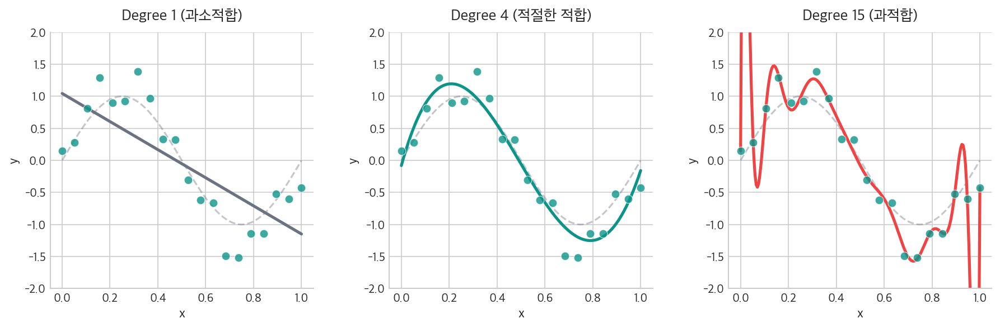
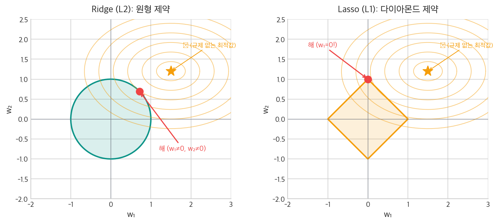
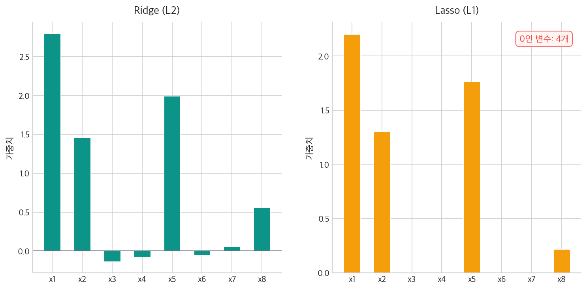
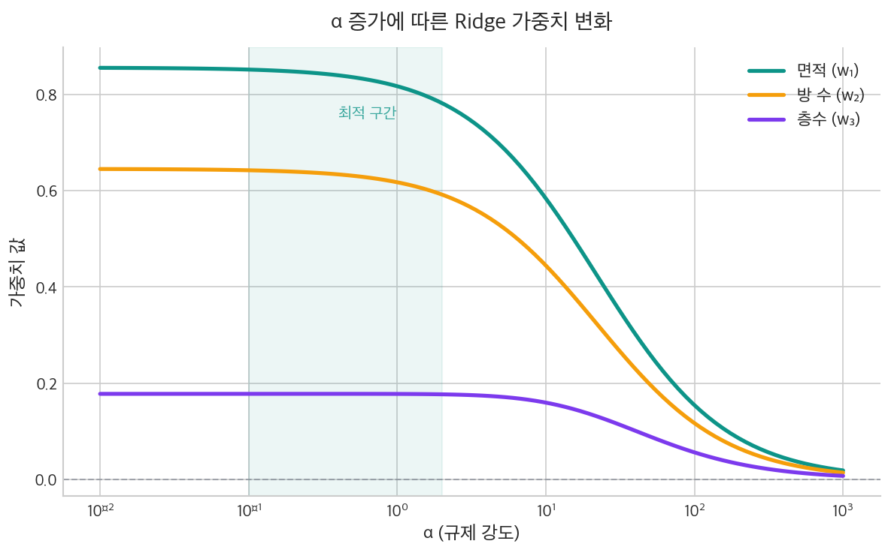

[이전 글](/ml/decision-boundary/)에서 로지스틱 회귀의 결정 경계를 시각화하고, 다항 특성을 추가하면 더 복잡한 경계를 만들 수 있다는 걸 봤다. 하지만 [다중 선형 회귀](/ml/multiple-linear-regression/)에서 변수를 늘렸을 때도 느꼈듯이, 변수가 많을수록 모델이 더 정확해지는 걸까? 변수를 10개, 50개, 100개로 늘리면?

실제로 해보면 이상한 일이 벌어진다. 훈련 데이터에서는 오차가 거의 0에 수렴하는데, **새 데이터에서는 예측이 엉망**이 된다. 훈련 데이터를 외워버린 것이다. 이게 **과적합(Overfitting)** 이고, 이를 막는 기법이 **규제(Regularization)** 다.

---

## 과적합이란?

간단한 예로 시작하자. sin 곡선에 노이즈를 섞은 데이터가 있다.

```python
import numpy as np

np.random.seed(42)
x = np.linspace(0, 1, 20)
y = np.sin(2 * np.pi * x) + np.random.normal(0, 0.3, 20)
```

이 데이터에 다항 회귀(Polynomial Regression)를 적용한다. 차수를 1, 4, 15로 바꿔보면:



- **Degree 1** (직선): 데이터의 곡선 패턴을 전혀 잡아내지 못한다 → **과소적합(Underfitting)**
- **Degree 4**: 노이즈를 무시하고 전체 경향을 잘 따라간다 → **적절한 적합**
- **Degree 15**: 모든 데이터 포인트를 꿰뚫는다. 훈련 오차는 거의 0. 하지만 데이터 사이에서 곡선이 미친 듯이 흔들린다 → **과적합(Overfitting)**

핵심은 이거다. 모델이 복잡해지면(=파라미터가 많아지면) **훈련 데이터의 노이즈까지 학습**한다. 훈련 데이터에 대한 성능은 올라가지만, 본 적 없는 데이터에서 성능이 떨어진다.

<div style="background: #f0f4ff; border-left: 4px solid #3182f6; padding: 16px 20px; margin: 20px 0; border-radius: 4px;">
  <strong>💡 편향-분산 트레이드오프(Bias-Variance Tradeoff) — [편향-분산 글](/ml/bias-variance/)에서 자세히 다룬다</strong><br>
  과소적합 = 높은 편향(Bias), 과적합 = 높은 분산(Variance). 모델 복잡도를 올리면 편향은 줄지만 분산이 커진다. 최적의 복잡도는 이 둘의 합이 최소인 지점이다. 규제는 <strong>분산을 줄이는 대가로 편향을 약간 올려서</strong> 전체 오차를 낮추는 전략이다.
</div>

### 과적합은 왜 생길까?

[다중 선형 회귀 글](/ml/multiple-linear-regression/)의 모델을 떠올려보자. 변수가 n개면 가중치도 n개다. 데이터 수(m)보다 변수 수(n)가 많아지면, 모델은 방정식의 자유도가 넘쳐서 훈련 데이터를 정확히 맞추는 무한히 많은 해를 찾을 수 있다. 그중에는 가중치가 극단적으로 큰 해도 포함된다.

가중치가 크다는 건, 입력의 작은 변화에 출력이 크게 흔들린다는 뜻이다. 이게 바로 과적합의 메커니즘이다.

```
가중치가 크다 → 입력의 작은 변화에 출력이 크게 변한다 → 노이즈에 민감 → 과적합
```

그래서 해결책은 직관적이다 — **가중치를 작게 유지한다**.

---

## 규제의 핵심 아이디어

[비용 함수 글](/ml/cost-function/)에서 MSE를 최소화하는 것이 학습의 목표라고 했다.

```
J(w, b) = (1/m) Σ(ŷᵢ - yᵢ)²
```

규제는 여기에 **패널티 항(Penalty Term)** 을 추가한다.

```
J(w, b) = MSE + λ × Penalty(w)
```

- **MSE**: 예측을 정확하게 (데이터에 맞추려는 힘)
- **Penalty**: 가중치를 작게 (단순하게 유지하려는 힘)
- **λ (lambda)**: 두 힘의 균형을 조절하는 하이퍼파라미터

λ = 0이면 규제 없음 (원래 선형 회귀). λ가 커지면 가중치를 더 강하게 억제한다. 너무 크면 모든 가중치가 0에 가까워져서 과소적합이 된다.

그렇다면 Penalty를 어떻게 정의할까? 여기서 Ridge와 Lasso가 갈린다.

---

## Ridge Regression (L2 규제)

Ridge는 가중치의 **제곱 합**을 패널티로 사용한다.

```
J(w, b) = (1/m) Σ(ŷᵢ - yᵢ)² + λ Σwⱼ²
```

왜 이렇게 되는가? 이 식은 두 가지 힘의 줄다리기다. 앞의 MSE는 "데이터를 정확히 맞춰라"고 밀고, 뒤의 λΣwⱼ²은 "가중치를 작게 유지해라"고 당긴다. 경사하강법은 두 힘의 균형점을 찾아간다.

가중치가 클수록 제곱으로 인해 패널티가 급격히 커진다. 결과적으로 **모든 가중치를 고르게 작게 만든다.** 어떤 가중치도 정확히 0이 되지는 않는다 — 모든 변수를 조금씩 사용한다.

### 직접 구현

[경사하강법 글](/ml/gradient-descent/)에서 구현한 코드에 규제 항만 추가하면 된다.

```python
import numpy as np

# 이전 글의 아파트 데이터 (면적, 방 수, 층수 → 가격)
X = np.array([
    [142, 5, 23], [91, 2, 20], [132, 4,  3], [54, 2,  5],
    [146, 4, 19], [111, 5,  7], [100, 1, 21], [60, 4,  9],
    [142, 2,  7], [122, 5, 18], [126, 4,  4], [114, 1, 14],
    [114, 1, 18], [127, 3,  9], [156, 3, 21], [139, 2,  2],
    [143, 4, 20], [63, 4, 15], [42, 3,  7],  [61, 4, 12],
], dtype=float)
y = np.array([
    7.56, 4.63, 6.45, 3.34, 6.88, 6.80, 5.25, 4.84,
    5.97, 7.28, 6.06, 4.23, 5.01, 5.83, 6.70, 5.45,
    6.85, 4.73, 3.57, 4.84,
])

# Standardization
X_mean, X_std = X.mean(axis=0), X.std(axis=0)
X_scaled = (X - X_mean) / X_std

m, n = X_scaled.shape
w = np.zeros(n)
b = 0.0
lr = 0.01
lam = 0.1  # 규제 강도 (sklearn에서는 alpha)
epochs = 1000

for epoch in range(epochs):
    y_pred = X_scaled @ w + b
    error = y_pred - y

    # 핵심: dw에 규제 항 2λw 추가
    dw = (2/m) * (X_scaled.T @ error) + 2 * lam * w
    db = (2/m) * np.sum(error)  # b에는 규제 적용 안 함

    w -= lr * dw
    b -= lr * db

cost = np.mean((X_scaled @ w + b - y) ** 2)
print(f"Cost: {cost:.4f}")
print(f"w = {np.round(w, 4)}")  # [0.7818, 0.5918, 0.1767]
```

규제 없는 버전의 가중치 `[0.856, 0.645, 0.178]`과 비교하면, 모든 가중치가 조금씩 줄었다. 특히 가장 큰 가중치인 면적(w₁)이 0.856에서 0.782로 줄어든 게 보인다. λ를 키울수록 더 강하게 줄어든다.

> 아래 sklearn Ridge의 결과(`[0.8169, 0.6173, 0.1775]`)와 위 직접 구현의 결과가 다른 이유: sklearn은 비용함수를 `(1/2n) × Σ(error²) + alpha/2 × Σ(w²)` 형태로 정의하고, 여기서는 `(1/n) × Σ(error²) + lam × Σ(w²)`을 썼기 때문이다. `lam=0.1`과 `alpha=1.0`은 규제 스케일이 다르므로 가중치도 다르게 나온다.

<div style="background: #fff3f0; border-left: 4px solid #ff6b6b; padding: 16px 20px; margin: 20px 0; border-radius: 4px;">
  <strong>⚠️ b는 왜 규제하지 않을까?</strong><br>
  편향(b)은 입력 변수와 무관하게 출력을 일정하게 올리거나 내리는 역할이다. b를 규제하면 데이터의 평균적인 수준을 잡아내는 능력을 억제하게 되어 오히려 성능이 나빠진다. 규제의 목적은 <strong>특성 간 관계의 복잡도</strong>를 줄이는 것이지, 출력의 전체 수준을 낮추는 게 아니다.
</div>

### sklearn으로 Ridge

```python
from sklearn.linear_model import Ridge
from sklearn.preprocessing import StandardScaler
from sklearn.pipeline import Pipeline

pipe = Pipeline([
    ('scaler', StandardScaler()),
    ('ridge', Ridge(alpha=1.0))  # alpha = λ
])
pipe.fit(X, y)

print(f"R² = {pipe.score(X, y):.4f}")
print(f"coef = {np.round(pipe.named_steps['ridge'].coef_, 4)}")
```

```
R² = 0.9489
coef = [0.8169  0.6173  0.1775]
```

규제 없는 선형 회귀의 R²(0.9506)과 거의 차이가 없다. 훈련 성능을 아주 약간 포기하는 대신, 새 데이터에 대한 일반화 성능을 높인 것이다.

---

## Lasso Regression (L1 규제)

Lasso는 가중치의 **절댓값 합**을 패널티로 사용한다.

```
J(w, b) = (1/m) Σ(ŷᵢ - yᵢ)² + λ Σ|wⱼ|
```

Ridge와 결정적인 차이가 하나 있다 — **일부 가중치를 정확히 0으로 만든다.** 즉, 불필요한 변수를 자동으로 제거하는 **변수 선택(Feature Selection)** 효과가 있다.

### 왜 L1은 0을 만들까?

이건 수학적으로 흥미로운 부분이다.

```
                        L2 (Ridge)                    L1 (Lasso)
제약 영역 모양:             원(circle)                    다이아몬드(diamond)
등고선과 만나는 지점:      축 위가 아닌 곳                 꼭짓점 (축 위)
결과:                     모든 wⱼ ≠ 0                    일부 wⱼ = 0
```

비용 함수의 등고선(타원)이 제약 영역과 처음 만나는 지점이 해(solution)다. L2의 원은 등고선과 축이 아닌 곳에서 만나지만, L1의 다이아몬드는 꼭짓점(축 위)에서 만나기 쉽다. 축 위라는 건 해당 가중치가 0이라는 뜻이다.



### sklearn으로 Lasso

```python
from sklearn.linear_model import Lasso

pipe_lasso = Pipeline([
    ('scaler', StandardScaler()),
    ('lasso', Lasso(alpha=0.1))
])
pipe_lasso.fit(X, y)

print(f"R² = {pipe_lasso.score(X, y):.4f}")
print(f"coef = {np.round(pipe_lasso.named_steps['lasso'].coef_, 4)}")
```

```
R² = 0.9327
coef = [0.7818  0.5509  0.0943]
```

alpha를 더 키우면 가중치가 점점 0으로 떨어진다.

```python
for alpha in [0.01, 0.1, 0.5, 1.0]:
    lasso = Lasso(alpha=alpha)
    lasso.fit(X_scaled, y)
    zeros = np.sum(lasso.coef_ == 0)
    print(f"α={alpha:5.2f} | coef={np.round(lasso.coef_, 3)} | 0인 변수: {zeros}개")
```

```
α= 0.01 | coef=[0.848  0.636  0.169] | 0인 변수: 0개
α= 0.10 | coef=[0.782  0.551  0.094] | 0인 변수: 0개
α= 0.50 | coef=[0.432  0.178  0.   ] | 0인 변수: 1개
α= 1.00 | coef=[0.     0.     0.   ] | 0인 변수: 3개
```

α=0.5에서 층수(w₃)가 0이 되고, α=1.0에서는 **모든 가중치가 0**이 된다 — 규제가 너무 강해서 모델이 아무 예측도 하지 않는 상태다. 변수가 수십~수백 개인 실전 데이터에서는, 불필요한 변수만 0으로 보내고 중요한 변수는 살아남는 중간 α를 찾는 게 핵심이다.

---

## ElasticNet (L1 + L2)

Ridge의 안정성과 Lasso의 변수 선택을 동시에 원한다면? ElasticNet이 두 패널티를 결합한다.

```
J(w, b) = MSE + α × [ρ × Σ|wⱼ| + (1-ρ)/2 × Σwⱼ²]    ← sklearn 정의를 따른 수식
```

- `α` (alpha): 전체 규제 강도
- `ρ` (l1_ratio): L1과 L2의 비율 (1이면 Lasso, 0이면 Ridge)
- L2 항에만 `1/2`이 붙는 이유: sklearn의 구현 관습이다. 미분 시 2와 상쇄되어 gradient가 깔끔해진다

```python
from sklearn.linear_model import ElasticNet

pipe_en = Pipeline([
    ('scaler', StandardScaler()),
    ('en', ElasticNet(alpha=0.1, l1_ratio=0.5))  # L1과 L2를 반반
])
pipe_en.fit(X, y)

print(f"R² = {pipe_en.score(X, y):.4f}")
print(f"coef = {np.round(pipe_en.named_steps['en'].coef_, 4)}")
```

```
R² = 0.9402
coef = [0.7813  0.5723  0.1376]
```

실전에서는 **상관된 변수가 여러 개 있을 때** ElasticNet이 유용하다. Lasso는 상관된 변수 중 하나만 골라서 나머지를 0으로 만들지만, ElasticNet은 상관된 변수들을 그룹으로 묶어서 함께 선택한다.

---

## Ridge vs Lasso vs ElasticNet 비교

| | Ridge (L2) | Lasso (L1) | ElasticNet |
|---|---|---|---|
| **패널티** | Σwⱼ² | Σ\|wⱼ\| | ρΣ\|wⱼ\| + (1-ρ)Σwⱼ² |
| **변수 선택** | ❌ 모든 변수 유지 | ✅ 불필요한 변수 제거 | ✅ 그룹 단위 선택 |
| **상관된 변수** | 가중치를 고르게 분배 | 하나만 선택, 나머지 0 | 그룹으로 함께 선택 |
| **해의 유일성** | 항상 유일 | n > m이면 최대 m개 선택 | 항상 유일 |
| **언제 쓸까** | 모든 변수가 유의미할 때 | 불필요한 변수가 많을 때 | 상관된 변수 그룹이 있을 때 |



<div style="background: #f0fff4; border-left: 4px solid #51cf66; padding: 16px 20px; margin: 20px 0; border-radius: 4px;">
  <strong>✅ 실전 선택 가이드</strong><br>
  변수가 적고 대부분 유의미하다 → <strong>Ridge</strong>. 변수가 많고 일부만 중요하다 → <strong>Lasso</strong>. 변수 간 상관관계가 높다 → <strong>ElasticNet</strong>. 확신이 없다면 ElasticNet(l1_ratio=0.5)로 시작해서 조정한다.
</div>

---

## λ(alpha) 최적값 찾기

규제 강도 λ를 어떻게 정할까? 직접 여러 값을 시도하는 대신, **교차 검증(Cross-Validation)** 으로 자동 선택할 수 있다.

```python
from sklearn.linear_model import RidgeCV, LassoCV

# RidgeCV: 여러 alpha를 시도하고 최적값을 자동 선택
ridge_cv = RidgeCV(alphas=np.logspace(-4, 4, 50))
ridge_cv.fit(X_scaled, y)
print(f"Ridge 최적 α = {ridge_cv.alpha_:.4f}")
print(f"coef = {np.round(ridge_cv.coef_, 4)}")

# LassoCV: K-fold CV로 최적 alpha 선택
lasso_cv = LassoCV(alphas=np.logspace(-4, 1, 50), cv=5)
lasso_cv.fit(X_scaled, y)
print(f"Lasso 최적 α = {lasso_cv.alpha_:.4f}")
print(f"coef = {np.round(lasso_cv.coef_, 4)}")
```

```
Ridge 최적 α = 0.3907
coef = [0.84    0.634   0.1777]

Lasso 최적 α = 0.0001
coef = [0.8555  0.6451  0.1776]
```

`RidgeCV`와 `LassoCV`는 내부적으로 교차 검증을 돌려서, 검증 데이터에서 성능이 가장 좋은 α를 자동으로 선택한다. 여기서 LassoCV가 α ≈ 0에 가까운 값을 선택한 건 의미가 있다 — 이 데이터는 변수 3개가 모두 유의미하기 때문에, 변수를 제거하는 Lasso의 장점이 발휘될 여지가 없다. 불필요한 변수가 섞여 있는 실전 데이터에서는 더 큰 α가 선택된다.

### α에 따른 가중치 변화

α를 0에서 점점 키우면 가중치가 어떻게 변하는지 시각적으로 확인해보자.



α가 커질수록 모든 가중치가 0에 수렴하는 모습을 볼 수 있다. 너무 작으면 규제가 없는 것과 같고, 너무 크면 모든 가중치가 사라져서 과소적합이 된다. 최적의 α는 이 사이 어딘가에 있고, 교차 검증이 이를 찾아준다.

---

## 흔한 실수

### 1. Feature Scaling 없이 규제를 적용한다

```python
# ❌ 스케일링 없이 Ridge 적용
ridge = Ridge(alpha=1.0)
ridge.fit(X, y)  # 면적(42~156)과 방 수(1~5)의 스케일이 다름
```

규제는 가중치의 크기에 패널티를 준다. 스케일이 다르면 가중치의 크기도 변수의 단위에 의존하기 때문에, **면적처럼 값이 큰 변수의 가중치는 상대적으로 작고, 방 수처럼 값이 작은 변수의 가중치는 상대적으로 크다.** 결과적으로 규제가 불공정하게 적용된다. [이전 글](/ml/multiple-linear-regression/)에서 다룬 Standardization을 반드시 먼저 적용한다.

```python
# ✅ Pipeline으로 스케일링 → 규제 적용
pipe = Pipeline([
    ('scaler', StandardScaler()),
    ('ridge', Ridge(alpha=1.0))
])
```

### 2. λ를 극단적으로 설정한다

```python
# ❌ λ가 너무 크면 → 모든 가중치 ≈ 0 → 과소적합
ridge_big = Ridge(alpha=10000)
ridge_big.fit(X_scaled, y)
print(ridge_big.coef_)  # [0.002, 0.001, 0.001] — 거의 0

# ❌ λ = 0이면 → 규제 없음 → 그냥 선형 회귀
ridge_zero = Ridge(alpha=0)
```

λ의 적절한 범위는 데이터마다 다르다. `RidgeCV`나 `LassoCV`로 자동 선택하는 게 가장 안전하다.

### 3. 규제가 필요 없는 모델에 적용한다

트리 기반 모델(Decision Tree, Random Forest, XGBoost)은 규제 방식이 근본적으로 다르다. L1/L2 규제는 **경사하강법으로 학습하는 선형 모델**에 적용하는 기법이다. 트리 모델은 가지치기(pruning), max_depth 같은 자체 규제 메커니즘을 사용한다 — [결정 트리 글](/ml/decision-tree/)에서 이를 다룬다.

<div style="background: #fff3f0; border-left: 4px solid #ff6b6b; padding: 16px 20px; margin: 20px 0; border-radius: 4px;">
  <strong>⚠️ 흔한 오해: "규제를 적용하면 항상 성능이 좋아진다"</strong><br>
  규제는 과적합을 줄이는 도구이지, 마법이 아니다. 데이터 수에 비해 특성 수가 적고 과적합 징후가 없다면, 규제를 적용해도 성능이 개선되지 않거나 오히려 나빠진다. 먼저 <a href="/ml/bias-variance/">학습 곡선</a>으로 과적합 여부를 진단하고, 필요한 경우에만 규제를 적용하자.
</div>

<div style="background: #f8f9fa; border: 1px solid #e9ecef; padding: 20px; margin: 24px 0; border-radius: 8px;">
  <strong>📌 핵심 요약</strong><br><br>
  <ul style="margin: 0; padding-left: 20px;">
    <li><strong>과적합</strong>: 모델이 훈련 데이터의 노이즈까지 학습 → 새 데이터에서 성능 하락</li>
    <li><strong>규제</strong>: 비용 함수에 가중치 크기 패널티를 추가 → 가중치를 작게 유지 → 과적합 방지</li>
    <li><strong>Ridge(L2)</strong>: 모든 가중치를 고르게 축소. 모든 변수가 유의미할 때</li>
    <li><strong>Lasso(L1)</strong>: 일부 가중치를 0으로 만듦 → 자동 변수 선택. 불필요한 변수가 많을 때</li>
    <li><strong>ElasticNet</strong>: L1 + L2 결합. 상관된 변수가 많을 때</li>
    <li><strong>α(lambda)</strong>: <code>RidgeCV</code>, <code>LassoCV</code>로 교차 검증 자동 선택</li>
  </ul>
</div>

---

## 마치며

규제의 핵심은 "모델에게 겸손함을 강제하는 것"이다. 데이터를 완벽하게 맞추려는 욕심을 억제하고, 약간의 훈련 오차를 감수하는 대신 새 데이터에 대한 예측력을 지킨다. 여기까지가 선형 모델의 기본기다 — [선형 회귀](/ml/linear-regression/)부터 [로지스틱 회귀](/ml/logistic-regression/)까지, 비용 함수, 경사하강법, Feature Scaling, 규제가 하나의 흐름으로 연결된다. 다음 글에서는 로지스틱 회귀 외에 다른 분류 접근법을 만나본다 — 확률로 분류하는 [나이브 베이즈(Naive Bayes)](/ml/naive-bayes/)다.

## 참고자료

- [Andrew Ng — Machine Learning Specialization: Regularization (Coursera)](https://www.coursera.org/specializations/machine-learning-introduction)
- [Scikit-learn — Ridge Regression Documentation](https://scikit-learn.org/stable/modules/generated/sklearn.linear_model.Ridge.html)
- [Scikit-learn — Lasso Regression Documentation](https://scikit-learn.org/stable/modules/generated/sklearn.linear_model.Lasso.html)
- [StatQuest: Regularization (YouTube)](https://www.youtube.com/watch?v=Q81RR3yKn30)
- [An Introduction to Statistical Learning — Chapter 6 (James, Witten, Hastie, Tibshirani)](https://www.statlearning.com/)
