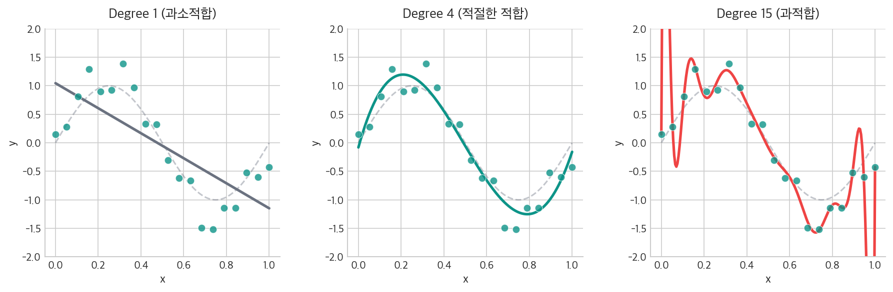
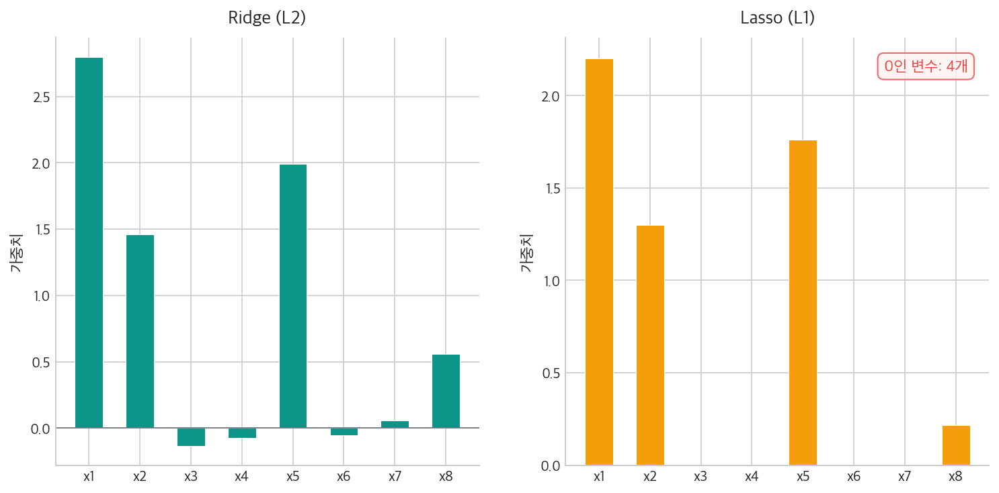

변수를 늘리고 다항 특성까지 넣으면 훈련 데이터의 오차는 계속 줄어든다. 그런데 새 데이터에서는 어느 지점부터 예측이 오히려 나빠진다. 훈련 데이터를 외워버린 것이고, 이게 과적합(Overfitting)이다. 이걸 막는 기법이 규제(Regularization)다.

## 과적합은 큰 가중치에서 온다

sin 곡선에 노이즈를 섞은 20개 점에 다항 회귀를 차수 1, 4, 15로 맞춰본다.

```python
import numpy as np

np.random.seed(42)
x = np.linspace(0, 1, 20)
y = np.sin(2 * np.pi * x) + np.random.normal(0, 0.3, 20)
```



차수 1은 곡선 패턴을 전혀 못 잡고(과소적합), 차수 4는 노이즈를 무시하고 전체 경향을 따라가고, 차수 15는 모든 점을 꿰뚫는다. 마지막 것의 훈련 오차는 거의 0인데, 점과 점 사이에서 곡선이 위아래로 크게 요동친다. 새 데이터가 그 사이에 떨어지면 예측이 크게 빗나간다.

왜 이렇게 되나. 변수가 $n$개면 가중치도 $n$개다. 데이터 수 $m$보다 $n$이 커지면 훈련 데이터를 정확히 맞추는 해가 무한히 많아지고, 그중에는 가중치가 극단적으로 큰 해도 섞여 있다. 가중치가 크다는 건 입력이 조금 흔들릴 때 출력이 크게 튄다는 뜻이다. 노이즈에 민감해지고, 그게 과적합의 메커니즘이다.

처방도 그만큼 단순하다. 가중치를 작게 유지한다. 모델을 단순하게 만드는 대가로 훈련 오차는 조금 올라가지만(편향 증가), 데이터가 조금 바뀌어도 결과가 덜 흔들린다(분산 감소). 둘의 합이 줄어드는 구간이 있고, 규제는 그 구간을 노린다.

## 비용 함수에 패널티를 더한다

학습의 목표는 MSE를 최소화하는 것이었다. 규제는 여기에 패널티 항 하나를 더한다.

$$J(\mathbf{w}, b) = \frac{1}{m}\sum_{i=1}^{m}(\hat{y}_i - y_i)^2 + \lambda \cdot \mathrm{Penalty}(\mathbf{w})$$

앞의 MSE는 데이터에 맞추라고 밀고, 뒤의 패널티는 가중치를 줄이라고 당긴다. $\lambda$는 두 힘의 균형점을 정하는 하이퍼파라미터다. $\lambda = 0$이면 규제가 없는 원래 선형 회귀고, $\lambda$가 커질수록 가중치를 강하게 억누른다. 너무 키우면 모든 가중치가 0에 붙어 과소적합이 된다.

패널티를 어떻게 정의하느냐에서 Ridge와 Lasso가 갈린다.

아래 코드는 전부 같은 데이터를 쓴다. 면적(평), 방 수, 층수로 가격(억원)을 예측하는 아파트 20채짜리 데이터다. 규제는 가중치 크기에 값을 매기니 변수들의 단위부터 맞춰놓는다.

```python
X = np.array([[142,5,23],[91,2,20],[132,4,3],[54,2,5],[146,4,19],[111,5,7],
              [100,1,21],[60,4,9],[142,2,7],[122,5,18],[126,4,4],[114,1,14],
              [114,1,18],[127,3,9],[156,3,21],[139,2,2],[143,4,20],[63,4,15],
              [42,3,7],[61,4,12]], dtype=float)
y = np.array([7.56,4.63,6.45,3.34,6.88,6.80,5.25,4.84,5.97,7.28,
              6.06,4.23,5.01,5.83,6.70,5.45,6.85,4.73,3.57,4.84])

X_scaled = (X - X.mean(axis=0)) / X.std(axis=0)
```

이 데이터에 규제 없는 선형 회귀를 돌리면 가중치가 `[0.856, 0.645, 0.178]`, R²가 0.9506으로 나온다. 앞으로 나오는 숫자는 전부 이 값과 비교한 것이다.

## Ridge는 제곱 합으로 누른다

$$J(\mathbf{w}, b) = \frac{1}{m}\sum_{i=1}^{m}(\hat{y}_i - y_i)^2 + \lambda \sum_{j=1}^{n} w_j^2$$

가중치가 클수록 제곱 때문에 패널티가 가파르게 커진다. 결과적으로 모든 가중치를 고르게 줄이되, 어느 하나를 정확히 0으로 보내지는 않는다. 모든 변수를 조금씩 쓰는 셈이다.

$w_j$로 미분하면 기울기에 $2\lambda w_j$가 더해진다. 경사하강법 코드는 그 한 항만 바뀐다.

```python
m, n = X_scaled.shape
w, b = np.zeros(n), 0.0
lr, lam = 0.01, 0.1

for _ in range(1000):
    error = X_scaled @ w + b - y
    w -= lr * ((2/m) * (X_scaled.T @ error) + 2 * lam * w)   # 규제 항이 붙는 자리
    b -= lr * (2/m) * np.sum(error)                          # b에는 규제를 걸지 않는다

print(np.round(w, 4))   # [0.7818 0.5918 0.1767]
```

규제 없는 `[0.856, 0.645, 0.178]`과 비교하면 세 가중치가 모두 줄었고, 가장 컸던 면적이 0.856에서 0.782로 가장 많이 깎였다.

:::warning

**b는 규제하지 않는다**

편향 $b$는 입력과 무관하게 출력 전체를 위아래로 옮기는 항이다. 규제의 목적은 특성과 출력 사이 관계의 복잡도를 낮추는 것이지, 출력의 평균 수준을 0쪽으로 끌어내리는 게 아니다. $b$까지 규제하면 타깃의 평균이 0에서 멀수록 손해만 본다.

:::

sklearn으로는 한 줄이다.

```python
from sklearn.linear_model import Ridge

ridge = Ridge(alpha=1.0).fit(X_scaled, y)
print(f"R2 = {ridge.score(X_scaled, y):.4f}")   # 0.9489
print(np.round(ridge.coef_, 4))                 # [0.8169 0.6173 0.1775]
```

규제 없는 R²(0.9506)과 거의 차이가 없다. 훈련 성능을 조금 내주고 일반화 성능을 산 것이다.

값이 위 직접 구현과 다른 건 규제 스케일이 서로 달라서다. sklearn의 `Ridge`는 오차 제곱합을 데이터 수로 나누지 않고 $\sum(\hat{y}_i - y_i)^2 + \alpha \sum w_j^2$을 최소화한다. 이걸 위 코드처럼 MSE 형태로 쓰려면 양변을 $m$으로 나눠야 하니 $\lambda = \alpha / m$이다. $m = 20$이므로 `alpha=1.0`에 대응하는 값은 `lam=0.05`이고, 그 값을 넣으면 직접 구현도 `[0.8169, 0.6173, 0.1775]`로 정확히 일치한다.

## Lasso는 절댓값 합으로 누른다

$$J(\mathbf{w}, b) = \frac{1}{m}\sum_{i=1}^{m}(\hat{y}_i - y_i)^2 + \lambda \sum_{j=1}^{n} \lvert w_j \rvert$$

Ridge와 결정적으로 다른 점이 하나 있다. 일부 가중치를 **정확히 0**으로 만든다. 쓸모없는 변수를 모델이 알아서 빼주는 변수 선택(Feature Selection) 효과다.

$\alpha$를 키우면서 계수를 보면 하나씩 떨어져 나간다.

```python
from sklearn.linear_model import Lasso

for alpha in [0.01, 0.1, 0.5, 1.0]:
    coef = Lasso(alpha=alpha).fit(X_scaled, y).coef_
    print(alpha, np.round(coef, 3), (coef == 0).sum())
```

| α | 면적 | 방 수 | 층수 | 0이 된 변수 |
|---|---|---|---|---|
| 0.01 | 0.848 | 0.636 | 0.169 | 0개 |
| 0.10 | 0.782 | 0.551 | 0.094 | 0개 |
| 0.50 | 0.432 | 0.178 | 0.000 | 1개 |
| 1.00 | 0.000 | 0.000 | 0.000 | 3개 |

α=0.5에서 층수가 먼저 0이 되고, α=1.0에서는 셋 다 0이 된다. 마지막은 규제가 너무 세서 모델이 아무 말도 하지 않는 상태다. 변수가 수십, 수백 개인 실전 데이터에서는 쓸모없는 것만 0으로 보내고 중요한 것은 살리는 중간 α를 찾는 게 관건이다.

### 왜 L1만 계수를 0으로 만드나

패널티가 붙은 최소화 문제는 예산 제약이 걸린 최소화 문제로 바꿔 쓸 수 있다. "패널티 총량이 $t$ 이하인 범위에서 MSE를 최소화하라"는 형태다.

$$\min_{\mathbf{w}} \frac{1}{m}\sum_{i=1}^{m}(\hat{y}_i - y_i)^2 \quad \text{s.t.} \quad \mathrm{Penalty}(\mathbf{w}) \le t$$

변수가 두 개일 때 이 제약 영역을 그려보면 모양이 다르다. Ridge의 $w_1^2 + w_2^2 \le t$는 원점을 중심으로 한 원이고, Lasso의 $\lvert w_1 \rvert + \lvert w_2 \rvert \le t$는 축 위에 꼭짓점이 놓인 마름모다. 한편 MSE의 등고선은 규제 없는 최적점을 중심으로 퍼져 나가는 곡선들이다. 해는 이 등고선이 커지다가 제약 영역에 처음 닿는 지점이다.

<div style="margin: 24px 0; text-align: center;">
<svg viewBox="0 0 400 640" style="width: 100%; height: auto; max-width: 380px;"
     xmlns="http://www.w3.org/2000/svg"
     font-family="Pretendard, -apple-system, sans-serif"
     role="img" aria-label="Ridge의 원형 제약은 손실 등고선과 축 밖에서 만나 두 계수가 모두 0이 아니고, Lasso의 마름모 제약은 축 위 꼭짓점에서 만나 한 계수가 정확히 0이 된다">
<!-- 위 패널: Ridge, 원형 제약 -->
<text x="200" y="28" text-anchor="middle" font-size="17" font-weight="700" fill="var(--text, #1c1917)">Ridge (L2), 원형 제약</text>
<line x1="46" y1="218" x2="374" y2="218" stroke="var(--text-muted, #6d6762)" stroke-opacity="0.55" stroke-width="1"/>
<line x1="120" y1="74" x2="120" y2="282" stroke="var(--text-muted, #6d6762)" stroke-opacity="0.55" stroke-width="1"/>
<text x="378" y="238" text-anchor="middle" font-size="14" fill="var(--text-muted, #6d6762)">w₁</text>
<text x="104" y="84" text-anchor="middle" font-size="14" fill="var(--text-muted, #6d6762)">w₂</text>
<circle cx="255" cy="168" r="90" fill="none" stroke="var(--text-muted, #6d6762)" stroke-opacity="0.6" stroke-width="1.2"/>
<circle cx="255" cy="168" r="60" fill="none" stroke="var(--text-muted, #6d6762)" stroke-opacity="0.6" stroke-width="1.2"/>
<circle cx="120" cy="218" r="54" fill="var(--bg-subtle, #f5f4f2)" stroke="var(--primary, #0a756c)" stroke-width="2.5"/>
<circle cx="255" cy="168" r="5" fill="none" stroke="var(--text-muted, #6d6762)" stroke-width="2"/>
<text x="255" y="150" text-anchor="middle" font-size="14" fill="var(--text-muted, #6d6762)">규제 전 최적</text>
<circle cx="171" cy="199" r="5.5" fill="var(--primary, #0a756c)"/>
<text x="148" y="192" text-anchor="middle" font-size="15" font-weight="700" fill="var(--primary, #0a756c)">해</text>
<text x="200" y="298" text-anchor="middle" font-size="15" fill="var(--text, #1c1917)">축 밖에서 만남, 두 계수 모두 0 아님</text>
<line x1="40" y1="326" x2="360" y2="326" stroke="var(--border, #e7e5e4)" stroke-width="1"/>
<!-- 아래 패널: Lasso, 마름모 제약 -->
<text x="200" y="356" text-anchor="middle" font-size="17" font-weight="700" fill="var(--text, #1c1917)">Lasso (L1), 마름모 제약</text>
<line x1="46" y1="532" x2="374" y2="532" stroke="var(--text-muted, #6d6762)" stroke-opacity="0.55" stroke-width="1"/>
<line x1="120" y1="383" x2="120" y2="594" stroke="var(--text-muted, #6d6762)" stroke-opacity="0.55" stroke-width="1"/>
<text x="378" y="552" text-anchor="middle" font-size="14" fill="var(--text-muted, #6d6762)">w₁</text>
<text x="104" y="393" text-anchor="middle" font-size="14" fill="var(--text-muted, #6d6762)">w₂</text>
<circle cx="255" cy="482" r="95" fill="none" stroke="var(--text-muted, #6d6762)" stroke-opacity="0.6" stroke-width="1.2"/>
<circle cx="255" cy="482" r="63" fill="none" stroke="var(--text-muted, #6d6762)" stroke-opacity="0.6" stroke-width="1.2"/>
<polygon points="174,532 120,478 66,532 120,586" fill="var(--bg-subtle, #f5f4f2)" stroke="var(--accent, #9d5604)" stroke-width="2.5"/>
<circle cx="255" cy="482" r="5" fill="none" stroke="var(--text-muted, #6d6762)" stroke-width="2"/>
<text x="255" y="464" text-anchor="middle" font-size="14" fill="var(--text-muted, #6d6762)">규제 전 최적</text>
<circle cx="174" cy="532" r="5.5" fill="var(--accent, #9d5604)"/>
<text x="138" y="514" text-anchor="middle" font-size="15" font-weight="700" fill="var(--accent, #9d5604)">해</text>
<text x="200" y="612" text-anchor="middle" font-size="15" fill="var(--text, #1c1917)">축 위 꼭짓점에서 만남, w₂ = 0</text>
</svg>
</div>

원은 어디를 잘라도 매끄러워서 등고선이 축이 아닌 자리에 닿는다. 두 계수 모두 0이 아닌 값으로 남는다. 마름모는 축 위에 뾰족한 꼭짓점이 있고, 등고선이 커지다가 제일 먼저 부딪히는 곳이 대개 그 꼭짓점이다. 꼭짓점은 나머지 좌표가 0인 점이다. 차원이 올라갈수록 꼭짓점과 모서리가 늘어나서 이 효과는 더 강해진다.

## ElasticNet은 둘을 섞는다

Ridge의 안정성과 Lasso의 변수 선택을 같이 원하면 두 패널티를 섞는다. sklearn의 정의는 이렇다.

$$J = \mathrm{MSE} + \alpha\left[\rho \sum_j \lvert w_j \rvert + \frac{1-\rho}{2}\sum_j w_j^2\right]$$

$\alpha$는 전체 규제 강도, $\rho$(`l1_ratio`)는 L1이 차지하는 비율이다. 1이면 Lasso, 0이면 Ridge가 된다.

```python
from sklearn.linear_model import ElasticNet

en = ElasticNet(alpha=0.1, l1_ratio=0.5).fit(X_scaled, y)
print(f"R2 = {en.score(X_scaled, y):.4f}")   # 0.9402
print(np.round(en.coef_, 4))                 # [0.7813 0.5723 0.1376]
```

ElasticNet이 빛나는 자리는 상관된 변수가 여럿일 때다. Lasso는 그중 하나만 골라 남기고 나머지를 0으로 보내는데, 어느 것이 뽑힐지는 데이터가 조금만 바뀌어도 달라진다. ElasticNet은 상관된 변수들을 묶어서 함께 살리거나 함께 죽인다.

## 셋 중 무엇을 고를까

| | Ridge (L2) | Lasso (L1) | ElasticNet |
|---|---|---|---|
| 패널티 | $\sum w_j^2$ | $\sum \lvert w_j \rvert$ | 둘의 가중합 |
| 변수 선택 | 없음, 전부 유지 | 있음, 일부를 0으로 | 있음, 그룹 단위 |
| 상관된 변수 | 가중치를 고르게 나눔 | 하나만 남기고 나머지 0 | 그룹으로 함께 선택 |
| 해의 유일성 | 항상 유일 | 특성이 데이터보다 많으면 최대 $m$개까지만 선택 | 항상 유일 |
| 쓰는 자리 | 변수가 대체로 유의미할 때 | 쓸모없는 변수가 많을 때 | 상관된 변수 그룹이 있을 때 |



변수 8개짜리 예시다. Ridge는 여덟 개를 모두 0이 아닌 값으로 남기고, Lasso는 그중 넷을 지운다.

:::tip

**고르는 순서**

변수가 적고 대부분 쓸모 있으면 Ridge, 변수가 많고 일부만 중요하면 Lasso, 변수끼리 상관이 높으면 ElasticNet이다. 판단이 안 서면 `ElasticNet(l1_ratio=0.5)`으로 시작해서 비율을 옮겨본다.

:::

## λ는 교차 검증으로 고른다

적절한 λ는 데이터마다 다르다. 손으로 찍지 말고 교차 검증에 맡긴다.

```python
from sklearn.linear_model import RidgeCV, LassoCV

ridge_cv = RidgeCV(alphas=np.logspace(-4, 4, 50)).fit(X_scaled, y)
lasso_cv = LassoCV(alphas=np.logspace(-4, 1, 50), cv=5).fit(X_scaled, y)
print(ridge_cv.alpha_, lasso_cv.alpha_)   # 0.3907 0.0001
```

둘 다 여러 α로 학습해보고 검증 데이터에서 성능이 가장 좋은 값을 남긴다. 여기서 LassoCV가 거의 0에 가까운 α를 고른 건 읽을 만한 신호다. 이 데이터는 변수 세 개가 모두 유의미해서 지울 게 없고, 그러니 Lasso의 장기가 발휘될 자리가 아니라는 뜻이다. 쓸모없는 변수가 섞인 데이터라면 훨씬 큰 α가 뽑힌다.

## 규제를 걸기 전에

**스케일링이 먼저다.** 규제는 가중치의 크기에 값을 매기는데, 가중치의 크기는 변수의 단위에 따라 달라진다. 면적(42~156)의 계수는 작게, 방 수(1~5)의 계수는 크게 나오니 같은 λ가 두 변수에 전혀 다른 세기로 걸린다. `Pipeline`으로 묶어두면 이 순서를 놓칠 일이 없다.

```python
from sklearn.pipeline import Pipeline
from sklearn.preprocessing import StandardScaler

pipe = Pipeline([('scaler', StandardScaler()), ('ridge', Ridge(alpha=1.0))])
```

**과적합이 없으면 규제해도 얻을 게 없다.** 데이터 수에 비해 특성이 적고 훈련 오차와 검증 오차가 붙어 있다면 규제는 편향만 더하고 끝난다. 학습 곡선으로 과적합을 먼저 확인하고 걸어야 한다.

**모델마다 규제 방식이 다르다.** L1/L2 패널티는 가중치를 갖는 선형 모델의 도구다. 트리 기반 모델은 가중치가 없으니 `max_depth` 제한이나 가지치기 같은 자기 방식의 규제를 쓴다.

## 마치며

규제는 모델에게 데이터를 다 맞추지 말라고 강제하는 장치다. 훈련 오차를 조금 내주고 그 대가로 새 데이터에 대한 예측력을 지킨다.

Ridge와 Lasso를 가르는 건 패널티 식의 사소한 차이가 아니라 제약 영역의 모양이다. 원은 매끄러워서 해가 축을 비껴가고, 마름모는 꼭짓점이 축 위에 있어서 해가 그리로 빨려 들어간다. Lasso가 변수를 골라내는 능력은 절댓값이라는 함수 모양에서 자동으로 따라 나온 것이지 따로 붙인 기능이 아니다. 그래서 L1 패널티는 선형 회귀 바깥에서도, 계수를 희소하게 만들고 싶은 자리마다 같은 방식으로 쓰인다.

다음 글에서는 로지스틱 회귀와 다른 방식으로 분류에 접근하는 모델을 본다. 확률을 직접 계산해서 분류하는 나이브 베이즈다.

## 함께 보면 좋은 글

- [다중 선형 회귀](/ml/multiple-linear-regression/) : 변수를 늘렸을 때 계수가 흔들리는 다중공선성
- [편향-분산](/ml/bias-variance/) : 규제가 무엇을 내주고 무엇을 얻는지의 배경
- [피처 선택](/ml/feature-selection/) : Lasso 말고도 변수를 골라내는 여러 방법

## 참고자료

- [Andrew Ng, Machine Learning Specialization: Regularization (Coursera)](https://www.coursera.org/specializations/machine-learning-introduction)
- [Scikit-learn, Ridge Documentation](https://scikit-learn.org/stable/modules/generated/sklearn.linear_model.Ridge.html)
- [Scikit-learn, Lasso Documentation](https://scikit-learn.org/stable/modules/generated/sklearn.linear_model.Lasso.html)
- [An Introduction to Statistical Learning, Chapter 6 (James, Witten, Hastie, Tibshirani)](https://www.statlearning.com/)
