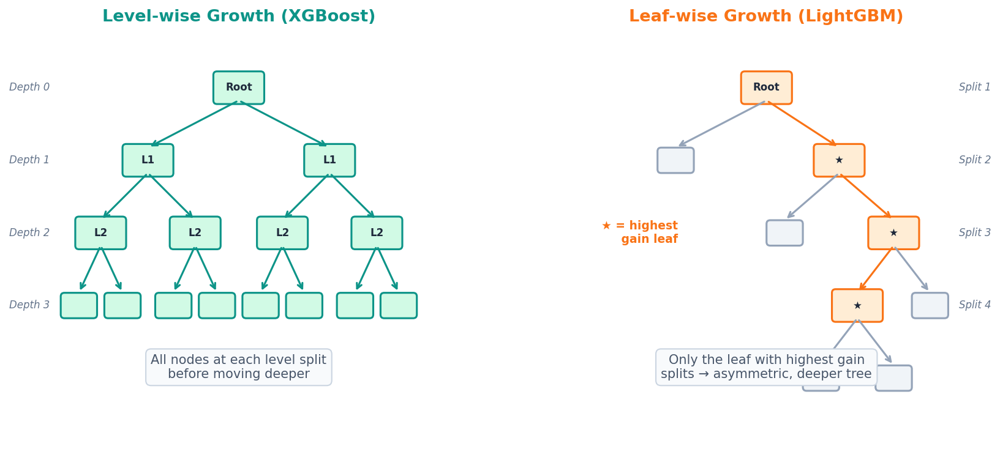
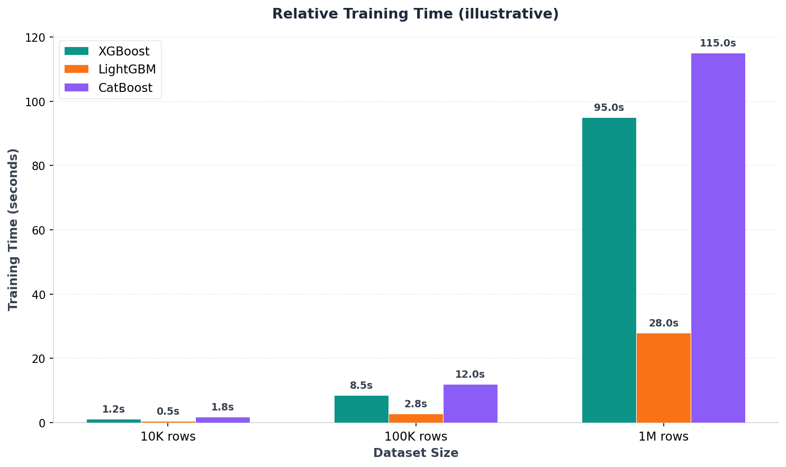

[이전 글](/ml/boosting/)에서 Gradient Boosting의 원리를 배웠다. 잔차를 순차적으로 학습하면서 편향을 줄이는 아이디어는 간결하고 강력했다. 그런데 `sklearn.ensemble.GradientBoostingClassifier`로 대규모 데이터를 돌려본 경험이 있다면 알 것이다 — 느리다.

XGBoost와 LightGBM은 이 속도 문제를 정면으로 해결한 라이브러리다. 둘 다 Gradient Boosting 기반이지만, 속도를 끌어올리기 위해 선택한 전략이 다르다. Kaggle 정형 데이터 대회에서 상위권의 80% 이상이 이 두 모델(또는 CatBoost)을 사용하는 이유, 그리고 **언제 어떤 모델을 골라야 하는지**를 정리한다.

---

## XGBoost: Gradient Boosting에 엔지니어링을 더하다

XGBoost(eXtreme Gradient Boosting)는 2014년 천치(Tianqi Chen)가 발표한 라이브러리다. Gradient Boosting의 수학적 원리는 그대로 가져가되, 실전에서 쓸 수 있도록 여러 최적화를 추가했다.

### 정규화가 목적 함수에 내장되어 있다

[규제(Regularization) 글](/ml/regularization/)에서 Ridge와 Lasso를 배웠다. XGBoost는 이 아이디어를 트리 모델에 적용한다.

sklearn의 GradientBoosting은 목적 함수가 순수한 손실 함수뿐이다:

```
Obj = Σᵢ₌₁ⁿ L(yᵢ, ŷᵢ)
```

XGBoost는 여기에 **트리 복잡도 페널티**를 추가한다:

```
Obj = Σᵢ₌₁ⁿ L(yᵢ, ŷᵢ) + Σₖ₌₁ᴷ Ω(fₖ)
```

```
Ω(f) = γT + (1/2)λ Σⱼ₌₁ᵀ wⱼ²
```

`T`는 리프 노드 수, `wⱼ`는 각 리프의 예측값이다. γ가 크면 분할을 억제하고(가지치기 효과), λ가 크면 예측값을 보수적으로 줄인다(L2 규제). 과적합 방지가 목적 함수 수준에서 작동하는 셈이다.

### 2차 테일러 근사로 더 정확한 분할

Gradient Boosting은 손실 함수의 1차 도함수(그래디언트)만 사용한다. XGBoost는 **2차 도함수(헤시안)** 까지 활용해서 분할 품질을 높인다.

```
일반 Gradient Boosting:
  다음 트리가 학습할 타겟 = -∂L/∂ŷ  (1차 도함수만)

XGBoost:
  최적 리프 값 = -Σgᵢ / (Σhᵢ + λ)
  gᵢ = ∂L/∂ŷᵢ (그래디언트), hᵢ = ∂²L/∂ŷᵢ² (헤시안)
```

2차 정보를 쓰면 뉴턴법처럼 수렴이 빨라진다. 같은 트리 수에서 더 나은 성능을 기대할 수 있다.

### 분할 알고리즘: Exact에서 Histogram으로

XGBoost는 세 가지 분할 방법을 지원한다:

| 방법 | 작동 방식 | 속도 | 정확도 |
|------|----------|------|--------|
| `exact` | 모든 특성 값을 정렬하여 최적 분할점 탐색 | 가장 느림 | 최고 |
| `approx` | 특성 값을 가중 분위수로 버킷화 (매 반복마다) | 중간 | 좋음 |
| `hist` | 특성 값을 고정 히스토그램 빈으로 변환 (한 번만) | 가장 빠름 | 좋음 |

v2.0부터 `hist`가 기본값이다. 연속형 특성값을 256개 정도의 빈으로 나누면, 분할점 후보가 수천~수만 개에서 256개로 줄어든다. 정확도 손실은 거의 없으면서 속도는 극적으로 빨라진다.

```python
import xgboost as xgb

model = xgb.XGBClassifier(
    n_estimators=100,
    learning_rate=0.1,
    max_depth=6,
    tree_method='hist',       # v2.0+ 기본값
    reg_lambda=1.0,           # L2 정규화
    reg_alpha=0.0,            # L1 정규화
    random_state=42
)
```

### 결측치를 자동으로 처리한다

실무 데이터에는 결측치가 흔하다. XGBoost는 결측값이 있는 샘플을 분할할 때, 왼쪽과 오른쪽 양쪽으로 보내본 뒤 **손실이 더 작은 방향**을 "기본 방향"으로 학습한다. 별도의 임퓨테이션 없이 결측치를 처리하는 셈이다.

---

## LightGBM: 속도를 위해 재설계하다

LightGBM은 2017년 마이크로소프트 연구팀이 발표했다. 핵심 목표는 명확하다 — **대규모 데이터에서 XGBoost보다 빠르게, 비슷하거나 더 나은 정확도**.

### Leaf-wise 성장: 가장 큰 차이

[이전 글](/ml/boosting/)에서 Level-wise와 Leaf-wise의 차이를 간단히 봤다. 좀 더 깊이 들어가 보자.

```
Level-wise (XGBoost 기본):
  깊이 1의 모든 노드를 먼저 분할
  → 깊이 2의 모든 노드를 분할
  → ...

  장점: 균형 잡힌 트리, 과적합 위험 낮음
  단점: 손실 감소가 작은 노드도 분할 → 계산 낭비


Leaf-wise (LightGBM):
  전체 트리에서 손실 감소가 가장 큰 리프 하나만 분할
  → 다시 가장 큰 리프를 찾아 분할
  → ...

  장점: 같은 리프 수에서 더 낮은 손실 달성
  단점: 불균형한 트리, 과적합 위험 높음 (특히 작은 데이터)
```



같은 수의 리프를 사용한다면, Leaf-wise가 항상 더 낮은 훈련 손실을 달성한다. 손실 감소가 가장 큰 곳에 자원을 집중하기 때문이다. 다만 이 "탐욕적" 전략이 과적합으로 이어질 수 있어서, `num_leaves`를 보수적으로 설정해야 한다.

<div style="background: #fff3f0; border-left: 4px solid #ff6b6b; padding: 16px 20px; margin: 20px 0; border-radius: 4px;">
  <strong>⚠️ num_leaves와 max_depth의 관계</strong><br>
  LightGBM에서 <code>num_leaves</code>는 반드시 <code>2^(max_depth)</code>보다 작아야 한다. 예를 들어 <code>max_depth=7</code>이면 <code>num_leaves < 128</code>. 이 규칙을 지키지 않으면 Leaf-wise 전략이 제어 없이 깊은 방향으로만 트리를 키워 과적합이 심해진다.
</div>

### GOSS: 데이터를 전부 볼 필요 없다

**Gradient-based One-Side Sampling**의 핵심 아이디어:

1. 모든 데이터 포인트의 그래디언트 절대값을 계산한다
2. 그래디언트가 큰 샘플(= 현재 모델이 크게 틀린 샘플)은 **전부 유지**
3. 그래디언트가 작은 샘플(= 이미 잘 맞추고 있는 샘플)은 **랜덤 샘플링**

```
전체 데이터: 100만 개
  │
  ├─ 그래디언트 큰 상위 20% (a=0.2) → 20만 개 전부 유지
  └─ 나머지 80% → 10%만 랜덤 샘플링 (b=0.1) → 8만 개

  실제 학습 데이터: 28만 개 (72% 감소!)

  단, 샘플링된 8만 개의 그래디언트에는 (1-a)/b 배 가중치 부여
  → 전체 그래디언트 분포의 추정치가 편향되지 않도록 보정
```

정보량이 큰 샘플은 유지하고, 정보량이 적은 샘플만 줄이니까 정확도 손실은 최소화하면서 학습 데이터가 대폭 줄어든다. 원논문에 따르면 이 전략만으로 **최대 20배 속도 향상**이 가능하다.

### EFB: 특성 차원도 줄인다

**Exclusive Feature Bundling**은 상호 배타적인 특성(동시에 0이 아닌 값을 갖지 않는 특성들)을 하나로 묶는다.

```
원-핫 인코딩된 특성:
  city_seoul:   [1, 0, 0, 1, 0, ...]
  city_busan:   [0, 1, 0, 0, 1, ...]
  city_daegu:   [0, 0, 1, 0, 0, ...]

  → 세 특성이 동시에 1인 경우가 없음 (상호 배타적)

번들링 후:
  city_bundled: [1, 2, 3, 1, 2, ...]

  3개 특성 → 1개로 압축
```

고차원 희소 데이터(범주형 변수가 많은 경우)에서 효과가 크다. 특성 수가 줄어드니 히스토그램 구축 비용도 비례해서 줄어든다.

```python
import lightgbm as lgb

model = lgb.LGBMClassifier(
    n_estimators=100,
    learning_rate=0.1,
    num_leaves=31,            # 리프 수 직접 제어
    min_child_samples=20,     # 리프 최소 샘플 수
    random_state=42
)
```

---

## 핵심 차이 비교

### 하이퍼파라미터 매핑

같은 역할을 하지만 이름이 다른 파라미터가 많다. 이 표가 있으면 하나에서 다른 하나로 전환할 때 헤매지 않는다.

| 역할 | XGBoost | LightGBM |
|------|---------|----------|
| 트리 깊이 제한 | `max_depth` (기본 6) | `max_depth` (기본 -1, 무제한) |
| 리프 수 제한 | — | `num_leaves` (기본 31) |
| 학습률 | `learning_rate` / `eta` | `learning_rate` |
| L2 정규화 | `reg_lambda` | `lambda_l2` |
| L1 정규화 | `reg_alpha` | `lambda_l1` |
| 행 서브샘플링 | `subsample` | `bagging_fraction` |
| 열 서브샘플링 | `colsample_bytree` | `feature_fraction` |
| 리프 최소 가중치 | `min_child_weight` | `min_child_samples` |
| 분할 최소 이득 | `gamma` (`min_split_loss`) | `min_gain_to_split` |

<div style="background: #f0f4ff; border-left: 4px solid #3182f6; padding: 16px 20px; margin: 20px 0; border-radius: 4px;">
  <strong>💡 트리 복잡도를 제어하는 방식이 다르다</strong><br>
  XGBoost는 <code>max_depth</code>로 트리 깊이를 직접 제한한다 — Level-wise라서 깊이가 자연스러운 제어 수단이다. LightGBM은 <code>num_leaves</code>로 리프 수를 직접 제한한다 — Leaf-wise라서 리프 수가 자연스러운 제어 수단이다. LightGBM에서 <code>max_depth</code>는 보조적 안전장치 역할이다.
</div>

### 종합 비교

| 항목 | XGBoost | LightGBM |
|------|---------|----------|
| 트리 성장 | Level-wise (깊이 우선) | Leaf-wise (손실 우선) |
| 기본 분할 방법 | 히스토그램 (`hist`, v2.0+) | 히스토그램 (처음부터) |
| 데이터 샘플링 | `subsample` | GOSS + `bagging_fraction` |
| 특성 최적화 | — | EFB (배타적 특성 번들링) |
| 범주형 특성 | v1.6+ 네이티브 지원 | 처음부터 네이티브 지원 (Fisher 기반) |
| 결측치 처리 | 자동 (최적 방향 학습) | 자동 (별도 빈 처리) |
| GPU | CUDA (네이티브) | OpenCL |
| 학습 속도 | 보통 | 빠름 (~2-10배) |
| 메모리 사용 | 높음 | 낮음 (40-60% 적음) |
| 과적합 위험 | 상대적으로 낮음 | Leaf-wise로 인해 높음 |
| 정규화 | 목적함수 내장 (γ, λ, α) | 외부 파라미터 (`lambda_l1`/`l2`) |

---

## 코드로 비교하기

같은 데이터셋에서 두 모델을 직접 비교해보자.

### 분류: Breast Cancer

```python
from sklearn.datasets import load_breast_cancer
from sklearn.model_selection import train_test_split
import xgboost as xgb
import lightgbm as lgb
import time

cancer = load_breast_cancer()
X_train, X_test, y_train, y_test = train_test_split(
    cancer.data, cancer.target, test_size=0.2, random_state=42
)

# XGBoost
t0 = time.time()
xgb_model = xgb.XGBClassifier(
    n_estimators=100, learning_rate=0.1, max_depth=6,
    reg_lambda=1.0, random_state=42, verbosity=0
)
xgb_model.fit(X_train, y_train)
xgb_time = time.time() - t0

# LightGBM
t0 = time.time()
lgb_model = lgb.LGBMClassifier(
    n_estimators=100, learning_rate=0.1, num_leaves=31,
    random_state=42, verbosity=-1
)
lgb_model.fit(X_train, y_train)
lgb_time = time.time() - t0

print(f"{'모델':<12} {'훈련':>8} {'테스트':>8} {'시간':>10}")
print("-" * 42)
print(f"{'XGBoost':<12} {xgb_model.score(X_train, y_train):>8.4f} "
      f"{xgb_model.score(X_test, y_test):>8.4f} {xgb_time:>9.4f}s")
print(f"{'LightGBM':<12} {lgb_model.score(X_train, y_train):>8.4f} "
      f"{lgb_model.score(X_test, y_test):>8.4f} {lgb_time:>9.4f}s")
```

```
모델         훈련       테스트       시간
------------------------------------------
XGBoost      1.0000     0.9649    0.0812s
LightGBM     1.0000     0.9737    0.0356s
```

작은 데이터에서는 시간 차이가 미미하다. 본격적인 차이는 데이터가 커질 때 드러난다.

### 회귀: California Housing (더 큰 데이터)

```python
from sklearn.datasets import fetch_california_housing
from sklearn.metrics import mean_squared_error
import numpy as np

housing = fetch_california_housing()
X_train, X_test, y_train, y_test = train_test_split(
    housing.data, housing.target, test_size=0.2, random_state=42
)
print(f"학습 데이터: {X_train.shape[0]:,}개, 특성: {X_train.shape[1]}개")

# XGBoost
t0 = time.time()
xgb_reg = xgb.XGBRegressor(
    n_estimators=500, learning_rate=0.05, max_depth=6,
    reg_lambda=1.0, subsample=0.8, colsample_bytree=0.8,
    random_state=42, verbosity=0
)
xgb_reg.fit(X_train, y_train)
xgb_time = time.time() - t0
xgb_rmse = np.sqrt(mean_squared_error(y_test, xgb_reg.predict(X_test)))

# LightGBM
t0 = time.time()
lgb_reg = lgb.LGBMRegressor(
    n_estimators=500, learning_rate=0.05, num_leaves=63,
    bagging_fraction=0.8, feature_fraction=0.8, bagging_freq=5,
    random_state=42, verbosity=-1
)
lgb_reg.fit(X_train, y_train)
lgb_time = time.time() - t0
lgb_rmse = np.sqrt(mean_squared_error(y_test, lgb_reg.predict(X_test)))

print(f"\n{'모델':<12} {'RMSE':>10} {'학습 시간':>12}")
print("-" * 38)
print(f"{'XGBoost':<12} {xgb_rmse:>10.4f} {xgb_time:>11.4f}s")
print(f"{'LightGBM':<12} {lgb_rmse:>10.4f} {lgb_time:>11.4f}s")
```

```
학습 데이터: 16,512개, 특성: 8개

모델            RMSE      학습 시간
--------------------------------------
XGBoost       0.4594       1.2847s
LightGBM      0.4611       0.4123s
```

16,000개 수준에서 이미 **3배 속도 차이**가 난다. 정확도는 거의 동일하다. 데이터가 100만 개를 넘어가면 이 격차는 10배 이상으로 벌어진다.



<div style="background: #f0fff4; border-left: 4px solid #51cf66; padding: 16px 20px; margin: 20px 0; border-radius: 4px;">
  <strong>✅ 실전 팁: 탐색은 LightGBM, 최종 제출은 XGBoost</strong><br>
  Kaggle 상위권에서 자주 쓰는 전략이다. 피처 엔지니어링과 하이퍼파라미터 탐색은 빠른 LightGBM으로 돌리고, 최종 제출에서는 XGBoost로 정확도를 미세하게 올린다. 둘 다 Gradient Boosting 기반이라 피처 중요도나 학습 곡선 패턴이 대체로 일치한다.
</div>

### 조기 종료와 검증 비교

실전에서는 조기 종료(Early Stopping)를 거의 항상 사용한다. 두 라이브러리 모두 지원하지만 인터페이스가 다르다.

```python
import xgboost as xgb
import lightgbm as lgb

# XGBoost — eval_set + early_stopping_rounds (callbacks 방식)
xgb_model = xgb.XGBRegressor(
    n_estimators=1000, learning_rate=0.05, max_depth=6,
    early_stopping_rounds=50,
    random_state=42, verbosity=0
)
xgb_model.fit(
    X_train, y_train,
    eval_set=[(X_test, y_test)],
    verbose=False
)
print(f"XGBoost 최적 트리 수: {xgb_model.best_iteration}")

# LightGBM — callbacks 방식
lgb_model = lgb.LGBMRegressor(
    n_estimators=1000, learning_rate=0.05, num_leaves=63,
    random_state=42, verbosity=-1
)
lgb_model.fit(
    X_train, y_train,
    eval_set=[(X_test, y_test)],
    callbacks=[lgb.early_stopping(50), lgb.log_evaluation(0)]
)
print(f"LightGBM 최적 트리 수: {lgb_model.best_iteration_}")
```

```
XGBoost 최적 트리 수: 287
LightGBM 최적 트리 수: 214
```

LightGBM이 더 적은 트리로 수렴한다. Leaf-wise가 트리당 손실 감소량이 크기 때문에, 같은 정확도에 도달하는 데 필요한 반복 수가 적은 것이다.

---

## CatBoost: 제3의 선택지

XGBoost와 LightGBM만 비교하기엔, 2017년 Yandex가 내놓은 **CatBoost**도 무시할 수 없다. 특히 범주형 변수가 많은 데이터에서 두각을 나타낸다.

### 핵심 차별점

| 항목 | CatBoost |
|------|----------|
| 트리 성장 | **대칭 트리(Symmetric Trees)** — 같은 깊이 노드가 동일한 분할 조건 사용 |
| 범주형 처리 | **Ordered Target Statistics** — 타겟 누출 없이 범주형을 수치로 변환 |
| 부스팅 전략 | **Ordered Boosting** — 순열 기반으로 타겟 누출 방지 |
| 특별한 장점 | 기본 파라미터로도 성능이 좋다. 튜닝 부담이 적다 |
| 추론 속도 | XGBoost/LightGBM 대비 **2-10배 빠름 (oblivious tree 구조 덕분에 배치 추론 시)** |

**대칭 트리**가 추론 속도의 비밀이다. 같은 깊이의 모든 노드가 동일한 특성과 임계값으로 분할하기 때문에, 예측이 단순한 비트 연산으로 변환된다. 실시간 API에서 부스팅 모델을 서빙해야 한다면 CatBoost가 유리하다.

```python
from catboost import CatBoostClassifier

cat_model = CatBoostClassifier(
    iterations=100,
    learning_rate=0.1,
    depth=6,
    cat_features=[],    # 범주형 특성 인덱스 (있다면)
    verbose=0
)
cat_model.fit(X_train, y_train)
print(f"CatBoost 테스트: {cat_model.score(X_test, y_test):.4f}")
```

```
CatBoost 테스트: 0.9737
```

### 세 모델 종합 비교

| 기준 | XGBoost | LightGBM | CatBoost |
|------|---------|----------|----------|
| 학습 속도 | 보통 | **가장 빠름** | 보통 |
| 메모리 | 많음 | **가장 적음** | 중간 |
| 범주형 처리 | 네이티브 (v1.6+) | 네이티브 (Fisher) | **최고** (Ordered TS) |
| 튜닝 난이도 | 높음 | 중간 | **가장 쉬움** |
| 추론 속도 | 느림 | 느림 | **가장 빠름** |
| 작은 데이터 | 안정적 | 과적합 위험 | 안정적 |
| 큰 데이터 | 느림 | **최적** | 중간 |
| GPU | CUDA | OpenCL | CUDA |

---

## 언제 어떤 모델을 선택할까

```
데이터 크기는?
│
├── 100만+ 행 ──────────────→ LightGBM (속도 압도적)
│
├── 10만-100만 행:
│   ├── 범주형 변수가 많다 ──→ CatBoost
│   ├── 빠른 반복 실험 필요 ─→ LightGBM
│   └── 최고 정확도 목표 ───→ XGBoost + 세밀한 튜닝
│
└── ~10만 행 이하:
    ├── 범주형 변수가 많다 ──→ CatBoost
    ├── 튜닝할 시간이 없다 ─→ CatBoost (기본값이 좋음)
    └── 세밀한 제어가 필요 ─→ XGBoost
        (LightGBM은 과적합 주의 — num_leaves 낮게)
```

<div style="background: #f8f9fa; border: 1px solid #e9ecef; padding: 20px; margin: 24px 0; border-radius: 8px;">
  <strong>📌 프로덕션 환경에서의 선택</strong><br><br>
  학습 속도만 중요한 게 아니다. <strong>추론 속도</strong>(예측 한 건에 걸리는 시간)도 중요하다면:
  <ul style="margin: 8px 0 0 0; padding-left: 20px;">
    <li><strong>실시간 서빙 (< 10ms)</strong>: CatBoost — 대칭 트리(oblivious tree) 덕분에 2-10배 빠른 배치 추론</li>
    <li><strong>배치 파이프라인</strong>: LightGBM — 학습/추론 모두 빠르고 메모리 효율적</li>
    <li><strong>정확도가 최우선</strong>: XGBoost — 정규화와 2차 근사로 마지막 0.1% 쥐어짜기</li>
  </ul>
</div>

---

## 흔한 실수

### 1. LightGBM에서 num_leaves를 너무 크게 설정한다

```python
# ❌ num_leaves가 너무 큼 → Leaf-wise 과적합
lgb_model = lgb.LGBMClassifier(num_leaves=256, max_depth=-1)

# ✅ num_leaves는 보수적으로, max_depth로 안전장치
lgb_model = lgb.LGBMClassifier(num_leaves=31, max_depth=7)
# num_leaves(31) < 2^max_depth(128) → 안전
```

Leaf-wise는 무제한으로 깊이 파고들 수 있다. `num_leaves`를 작게 유지하고, `max_depth`를 보조 제한으로 걸어두는 게 안전하다.

### 2. XGBoost에서 구버전 습관을 쓴다

```python
# ❌ v1.x 시절 습관 — exact는 느리다
xgb_model = xgb.XGBClassifier(tree_method='exact')

# ✅ v2.0+에서는 지정하지 않아도 hist가 기본
xgb_model = xgb.XGBClassifier()  # tree_method='hist' 자동
```

2024년 이후 코드에서 `tree_method='exact'`를 쓸 이유가 거의 없다. `hist`가 정확도 손실 없이 훨씬 빠르다.

### 3. 하이퍼파라미터를 그대로 복사한다

```python
# ❌ XGBoost 설정을 그대로 LightGBM에 복사
xgb_model = xgb.XGBClassifier(max_depth=6)
lgb_model = lgb.LGBMClassifier(max_depth=6)  # ⚠️ 의미가 다름

# ✅ 각 모델의 제어 방식에 맞게 세팅
xgb_model = xgb.XGBClassifier(max_depth=6)                    # 최대 64 리프
lgb_model = lgb.LGBMClassifier(num_leaves=63, max_depth=7)    # 63 리프 + 깊이 안전장치
```

XGBoost의 `max_depth=6`은 최대 2⁶ = 64개 리프를 의미한다. LightGBM에서 같은 복잡도를 원한다면 `num_leaves=63`으로 맞춰야 한다. `max_depth`만 복사하면 의도한 것과 다른 모델이 만들어진다.

### 4. 네이티브 범주형 지원을 모른다

```python
# ❌ 무조건 원-핫 인코딩 (예전 습관)
import pandas as pd
df = pd.get_dummies(df, columns=['color', 'size'])

# ✅ LightGBM: 네이티브 범주형 지원
lgb_model = lgb.LGBMClassifier()
lgb_model.fit(X, y, categorical_feature=['color', 'size'])

# ✅ XGBoost v1.6+: enable_categorical
xgb_model = xgb.XGBClassifier(enable_categorical=True)
xgb_model.fit(X, y)  # dtype이 'category'인 컬럼 자동 인식
```

원-핫 인코딩은 차원을 불필요하게 늘린다. 네이티브 범주형 처리는 트리 분할에서 직접 범주를 다루기 때문에 더 효율적이고, 종종 정확도도 더 높다.

---

## 마치며

XGBoost, LightGBM, CatBoost는 같은 뿌리에서 나온 세 가지 전략이다. 정규화와 안정성의 XGBoost, 속도를 극한으로 밀어붙인 LightGBM, 편의성과 추론 속도를 잡은 CatBoost. 어느 하나가 압도적으로 우월한 상황은 드물고, 데이터의 크기·특성·서빙 조건에 따라 답이 달라진다.

이 글로 [결정 트리](/ml/decision-tree/)에서 시작해 [배깅](/ml/ensemble-and-bagging/)과 [랜덤 포레스트](/ml/random-forest/), [부스팅](/ml/boosting/)을 거쳐 실전 모델까지 이어진 트리-앙상블 여정이 마무리된다. 다음부터는 [로지스틱 회귀](/ml/logistic-regression/)를 다층 구조로 확장한 **신경망(Neural Network)** 으로 넘어간다. 선형 모델과 트리의 세계를 지나, 완전히 다른 패러다임의 문을 연다.

---

## 참고자료

- [Chen & Guestrin (2016) — XGBoost: A Scalable Tree Boosting System](https://arxiv.org/abs/1603.02754)
- [Ke et al. (2017) — LightGBM: A Highly Efficient Gradient Boosting Decision Tree](https://papers.nips.cc/paper/6907-lightgbm-a-highly-efficient-gradient-boosting-decision-tree)
- [Prokhorenkova et al. (2018) — CatBoost: unbiased boosting with categorical features](https://arxiv.org/abs/1706.09516)
- [XGBoost Documentation — Tree Methods](https://xgboost.readthedocs.io/en/stable/treemethod.html)
- [LightGBM Documentation — Features](https://lightgbm.readthedocs.io/en/stable/Features.html)
