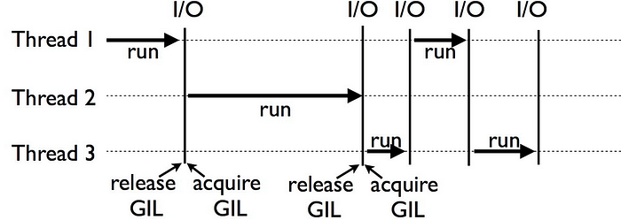

## GIL 이란?
CPython에서 GIL은 파이썬 객체에 대한 접근을 보호하는 뮤텍스로, 여러 스레드가 동시에 파이썬의 바이트코드를 실행하는 것을 방지합니다. GIL의 영역에서는 경쟁 상태(race condition)를 예방하고, 스레드 안정성(thread-safe)을 보장합니다.
 

<em>GIL 동작 방식 (출처: <a href="https://chandrashek1007.medium.com/python-global-interpreter-lock-is-it-good-or-bad-634d1c82b4fd" target="_blank">Medium</a>)</em>

위의 이미지에서는 3개의 스레드가 어떠한 방식으로 GIL을 사용하는지 설명하고 있습니다. 각 스레드는 GIL이라는 일종의 Lock을 획득해야만 자원을 할당받고, 사용할 수 있습니다. 그동안 다른 스레드는 GIL이 풀릴 때까지 자원에 접근할 수 없습니다. 즉, 파이썬에서는 멀티스레딩을 유도하더라도, 실제로 여러 스레드가 동시에 작업하지 못하게 되는 것입니다.
 

## 왜 Python은 GIL을 선택할 수 밖에 없었을까?
멀티스레딩으로 동작할 수 없다는 것은, 당연히 성능에 큰 영향을 미칩니다. 그럼에도 Python은 GIL을 사용하는 이유가 무엇일까요? 파이썬은 모든 것이 객체입니다. 파이썬이 배우기 쉬운 언어인만큼, 내부에서는 많은 일을 해주고 있습니다. 그중 중요한 것이 바로 참조 카운팅과 가비지 컬렉션입니다. 파이썬은 객체들의 메모리를 할당하고, 관리하기 위해서 각 객체들의 참조되는 횟수를 저장합니다. 더 이상 다른 객체들이 특정 객체를 참조하지 않을 때, 파이썬의 GC는 해당 객체를 메모리에서 해제하게 됩니다.

만약 여러 스레드가 동시에 한 객체에 접근하게 된다면, 객체의 참조 카운트에 문제가 생길 수 있습니다. 경쟁 상태 (Race Condition)가 발생하는 것입니다. 예상치 못하게 참조 카운트가 변하게 된다면, 이를 기반으로 작동하는 GC까지 문제가 이어질 수 있습니다. 메모리 관리에 문제가 생긴다는 것은 시스템의 치명적인 문제로 이어질 수 있다는 것을 뜻합니다.

이러한 사태를 방지하기 위해 Python이 선택한 방식이 바로 GIL입니다. 단순히 하나의 자원에 하나의 스레드만 접근할 수 있게 한다면, 복잡한 동시성 문제를 생각할 필요가 없게 되는 것입니다.
 

## 멀티스레딩과 I/O 바운드
그렇다고 파이썬의 멀티스레딩이 완전히 쓸모 없는 것은 아닙니다. 어떤 작업의 영역은 크게 CPU 바운드와 I/O 바운드 작업으로 나눌 수 있습니다. 이때 I/O 바운드 작업의 경우 CPU 사용보다는 입출력 장치 속도에 의해 제한됩니다. 즉, 하드웨어의 I/O처리 능력에 따라 결정되며, CPU는 작업을 요청하고 대기하다가 응답이 오면 결과를 처리할 뿐 CPU 리소스를 크게 사용하지 않습니다.

다시 말해, 수행하려는 작업에 I/O 바운드 비중이 높다면 멀티스레딩 방식이 싱글스레드보다 효과적일 수 있습니다. 대기하는 동안 다른 스레드로 컨텍스트 스위칭이 일어나고, 그동안 다른 작업을 이어나갈 수 있기 때문입니다. 다른 방안으로 멀티프로세싱을 사용하는 방법도 있지만, 프로세스의 경우 스레드에 비해 컨텍스트 스위칭 비용이 크므로 잘 고려하여 설계해야합니다.

 

그동안 많은 프로젝트에서 파이썬의 GIL을 제거하고자 하는 시도들이 있었다고 합니다. 다만, 대부분의 경우 멀티 스레드의 성능이 향상되면 싱글 스레드의 성능이 저하되는 경우가 많습니다. 무엇보다 가장 큰 과제는 이미 매우 많이 존재하는 서드파티들이 GIL 빌드에서 동작하고 있기 때문에, GIL이 사라진다면 엄청난 호환성 문제들이 일어날 것입니다. 앞으로 어떠한 방향으로 흘러갈지는 모르겠지만, 파이썬으로 효과적인 병렬 처리까지 할 수 있다면 큰 변화를 불러일으킬 수 있지 않을까.. 하는 기대를 해봅니다.
 

## 참고 자료

- [Python Global Interpreter Lock](https://wiki.python.org/moin/GlobalInterpreterLock)
- [Is Python Global Interpreter Lock Good or Bad?](https://chandrashek1007.medium.com/python-global-interpreter-lock-is-it-good-or-bad-634d1c82b4fd)