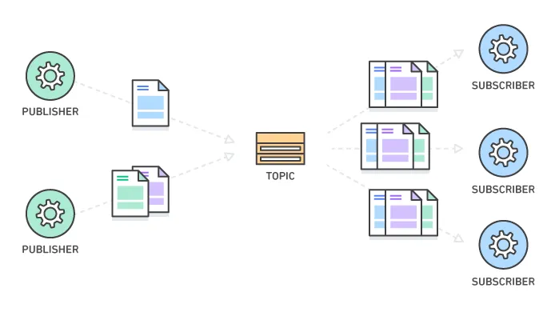
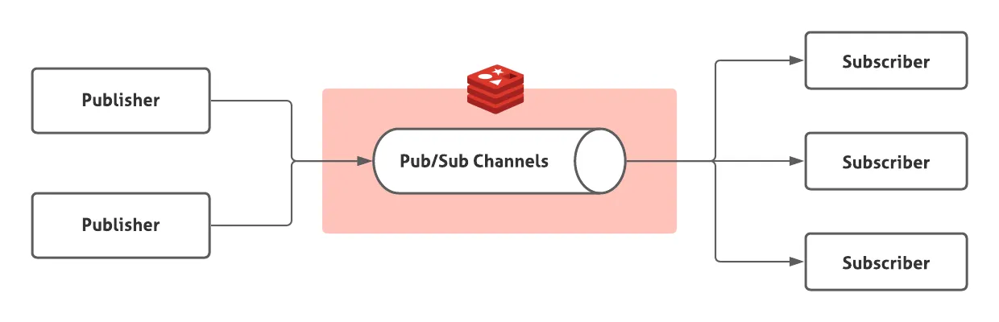

서비스를 개발 하다 보면 **"하나의 이벤트가 발생했을 때 여러 시스템이 동시에 반응해야 하는"** 상황을 자주 마주하게 됩니다. 예를 들어, 고객이 온라인 쇼핑몰에서 주문을 완료하면 다음과 같은 작업들이 동시에 일어나야 합니다.

- 결제 시스템에서 결제 처리
- 재고 시스템에서 상품 수량 차감
- 배송 시스템에서 배송 준비 시작
- 주문 확인 이메일/SMS 발송
- 고객 포인트 적립 처리
- 주문 통계 데이터 업데이트

가장 직관적인 방법은 주문 처리 코드에서 각각의 시스템을 순차적으로 호출하는 것입니다. 하지만 특정 단계에서 문제가 생기면 전체 주문 과정이 멈춰버리고, 새로운 기능을 추가할 때마다 기존 주문 코드를 수정해야 하는 번거로움도 있습니다.

**"이벤트를 발생시키기만 하면, 관심 있는 시스템들이 알아서 처리하게 할 수는 없을까?"**

바로 이런 고민에서 나온 해결책이 **Publish-Subscribe 패턴**입니다. 이벤트를 '발행(Publish)'하면, 해당 이벤트에 관심 있는 시스템들이 '구독(Subscribe)'해서 각자 필요한 작업을 처리하는 방식입니다.

# Publish-Subscribe
분산 시스템이나 마이크로서비스 아키텍처에서는 서로 다른 컴포넌트 간의 메시지 교환 방식을 메시징 패턴으로 정의합니다. 메시징 패턴에는 Request-Reply, Publish-Subscribe, Push-Pull 등 다양한 패턴이 있는데, 그중에서도 Publish-Subscribe 패턴에 대해 자세히 알아보겠습니다.

<br>


<p align="center" style="color: #666; font-size: 14px;"><em>Publish-Subscribe 패턴 (출처: <a href="https://aws.amazon.com/what-is/pub-sub-messaging/" target="_blank">AWS</a>)</em></p>


- **Publisher**: 메시지를 생성해 특정 토픽에 발행
- **Broker**: 발행된 메시지를 받아 구독자들에게 전달하는 중개자
- **Subscriber**: 관심 있는 토픽을 구독하고 메시지를 수신

Publish-Subscribe는 특정한 주제(Topic)에 대하여 해당 토픽을 구독한 모든 구독자에게 메시지를 발행하는 방식입니다. 발행자와 구독자는 서로를 모르는 상태에서 통신하기 때문에 서비스 간 의존도를 낮출 수 있고, 토픽을 늘리는 방식으로 수평 확장이 가능하다는 장점이 있습니다.

<br>

이러한 특성 덕분에 다음과 같은 상황에서 유용하게 활용됩니다.
- 여러 서비스가 **하나의 이벤트를 동시에 반응**해야 할 때
- **실시간 브로드캐스트**가 필요한 채팅, 알림, 모니터링 시스템
- 이벤트 기반 마이크로서비스 구조에서 **서비스 간 직접 호출 없이** 데이터를 전파하고자 할 때

물론 장점만 있는 것은 아닙니다. 메시지를 활용해 통신을 주고 받는 만큼, 메시지를 실제로 수신했는지, 중복해서 수신하지는 않았는지 등에 대한 상태 관리가 필요합니다. 따라서 신뢰성 혹은 순서 보장 등 추가적인 요구 사항이 필요한 경우에는 Apache Kafka와 같은 더 정교한 메시징 시스템을 활용하여야 합니다.


# Redis Pub / Sub



<p align="center" style="color: #666; font-size: 14px;"><em>Redis Pub/Sub 구조 (출처: <a href="https://pompitzz.github.io/blog/Redis/LocalCacheSyncWithRedisPubSub.html" target="_blank">pompitzz 블로그</a>)</em></p>

<br>
Redis Pub/Sub은 Redis가 제공하는 메시징 기능으로 매우 단순한 구조로 되어 있습니다. 메시지를 publish하면 해당 채널을 구독하고 있는 모든 subscriber에게 메시지를 전달합니다. Redis Pub/Sub은 단순하고 구현이 쉬운 만큼 다음과 같은 특징을 주의해야 합니다.

- **메시지 유실 가능성**: Subscriber가 존재하지 않으면, 메시지는 사라집니다.
- **전송 보장 없음**: 네트워크 장애 시 메시지가 전달되지 않을 수 있습니다.
- **메시지 순서**: 여러 Publisher가 동시에 메시지를 보낼 때 순서가 보장되지 않을 수 있습니다.
- **재시도 메커니즘 부재**: 실패한 메시지에 대한 재처리 기능이 없습니다.

결국 보내는 쪽도 보내고 끝, 받는 쪽도 받고 끝인 단순한 구조 때문에 일반적인 메시지 큐로 취급되지 않습니다. 이렇듯 단점이 명확하지만, Redis는 In-Memory 기반인 만큼 매우 빠르게 메시지를 주고받을 수 있기 때문에, 짧고 간단한 메시지를 빠르게 보내고 싶을 때는 유용하게 사용할 수 있습니다.

# 코드 예시

Redis Pub/Sub을 실제로 사용하려면 Redis 서버를 실행해야 합니다.

### Publisher (발행자)
```python
import redis

client = redis.Redis(host="localhost", port=6379)
channel_name = "news"

for i in range(5):
    message = f"안녕하세요, Redis Pub/Sub 테스트입니다! ({i + 1})"
    client.publish(channel_name, message)
    print(f"[PUBLISH] ({channel_name}) -> {message}")

print("발행 완료. Publisher 종료.")
```


- `redis.Redis()`: Redis 서버에 연결합니다. 기본적으로 localhost:6379에 연결됩니다.
- `client.publish()`: 지정된 채널에 메시지를 발행합니다. 메시지를 받은 구독자 수를 반환합니다.

### Subscriber (구독자)
```python
import redis

client = redis.Redis(host="localhost", port=6379)
channel_name = "news"

pubsub = client.pubsub()
pubsub.subscribe(channel_name)  # 채널 구독

print(f"[SUBSCRIBE] '{channel_name}' 채널을 구독하였습니다. 메시지를 기다립니다...")

# 구독 상태로 대기하면서 메시지를 읽어들임
for message in pubsub.listen():
    if message["type"] == "message":
        data = message["data"].decode("utf-8")
        print(f"[RECEIVE] ({channel_name}) <- {data}")
```

- `client.pubsub()`: Redis Pub/Sub 객체를 생성합니다. 이 객체를 통해 구독과 수신을 처리합니다.
- `pubsub.subscribe()`: 특정 채널을 구독합니다. 여러 채널을 동시에 구독할 수도 있습니다.
- `pubsub.listen()`: 블로킹 방식으로 메시지를 대기합니다. 메시지가 오면 즉시 반환됩니다.
- `message["type"]`: Redis는 구독 확인, 메시지 수신 등 다양한 타입의 메시지를 보내므로 "message" 타입만 처리합니다.

<br>

**💡 주요 포인트**
- 구독자가 먼저 실행되어야 메시지를 받을 수 있습니다. 구독자가 없으면 메시지는 사라집니다.
- `listen()`은 무한 루프로 동작하므로 Ctrl+C로 종료할 수 있습니다.
- 하나의 채널에 여러 구독자가 있으면 모든 구독자가 동일한 메시지를 받습니다.

## 실행 결과

터미널을 2개 열고, 먼저 Subscriber(구독자)를 실행합니다.
```bash
[SUBSCRIBE] 'news' 채널을 구독하였습니다. 메시지를 기다립니다...
```
    
다른 터미널에서는 Publisher(발행자)를 실행합니다.
```bash
[PUBLISH] (news) -> 안녕하세요, Redis Pub/Sub 테스트입니다! (1)
[PUBLISH] (news) -> 안녕하세요, Redis Pub/Sub 테스트입니다! (2)
...
[PUBLISH] (news) -> 안녕하세요, Redis Pub/Sub 테스트입니다! (5)
발행 완료. Publisher 종료.
```
    
Subscriber 터미널에서 발행된 메시지가 순서대로 출력되는 것을 확인할 수 있습니다.
```bash
[RECEIVE] (news) <- 안녕하세요, Redis Pub/Sub 테스트입니다! (1)
[RECEIVE] (news) <- 안녕하세요, Redis Pub/Sub 테스트입니다! (2)
...
[RECEIVE] (news) <- 안녕하세요, Redis Pub/Sub 테스트입니다! (5)
```

이처럼 Redis Pub/Sub은 매우 간단한 구조로 동작합니다. 발행자는 메시지를 보내고, 구독자는 실시간으로 메시지를 받아볼 수 있습니다. 

### 패턴 매칭을 활용한 구독
```python
import redis

client = redis.Redis(host="localhost", port=6379, db=0)
pubsub = client.pubsub()

# 'news:'로 시작하는 모든 채널 구독
pattern = "news:*"
pubsub.psubscribe(pattern)
print(f"[PSUBSCRIBE] 패턴 '{pattern}' 로 구독을 시작합니다. 메시지를 기다립니다...")

for message in pubsub.listen():
    if message["type"] == "pmessage":
        channel = message["channel"].decode("utf-8")
        data = message["data"].decode("utf-8")
        print(f"[RECEIVE] ({channel}) <- {data}")
```

**코드 설명:**
- `pubsub.psubscribe()`: 패턴 기반 구독을 시작합니다. 와일드카드(`*`)를 사용해 여러 채널을 한 번에 구독할 수 있습니다.
- `"news:*"`: `news:`로 시작하는 모든 채널을 의미합니다. 예를 들어 `news:korea`, `news:world`, `news:tech` 등이 모두 매칭됩니다.
- `message["type"] == "pmessage"`: 패턴 구독에서는 메시지 타입이 "pmessage"입니다.
- `message["channel"]`: 실제 메시지가 발행된 채널명을 알 수 있습니다.


# 마무리

Redis Pub/Sub은 **빠르고 간단한 실시간 메시징**이 필요할 때 매우 유용한 도구입니다. 복잡한 설정 없이도 몇 줄의 코드만으로 이벤트 기반 아키텍처를 구축할 수 있어서, 실시간 알림이나 채팅 시스템, 간단한 마이크로서비스 간 통신에 적합합니다.

다만 메시지 유실 가능성과 순서 보장의 한계가 있으므로, 중요한 비즈니스 로직에는 신중하게 사용해야 합니다. 만약 메시지 지속성과 순서 보장이 중요하다면 **Redis Streams**를, 대용량 메시지 처리와 복잡한 라우팅이 필요하다면 **Apache Kafka**를 고려해볼 수 있습니다.


## 참고 자료

- [Redis 공식 문서 - Pub/Sub](https://redis.io/docs/manual/pubsub/)
- [REDIS의 PUB/SUB 기능](https://inpa.tistory.com/entry/REDIS-%F0%9F%93%9A-PUBSUB-%EA%B8%B0%EB%8A%A5-%EC%86%8C%EA%B0%9C-%EC%B1%84%ED%8C%85-%EA%B5%AC%EB%8F%85-%EC%95%8C%EB%A6%BC)
