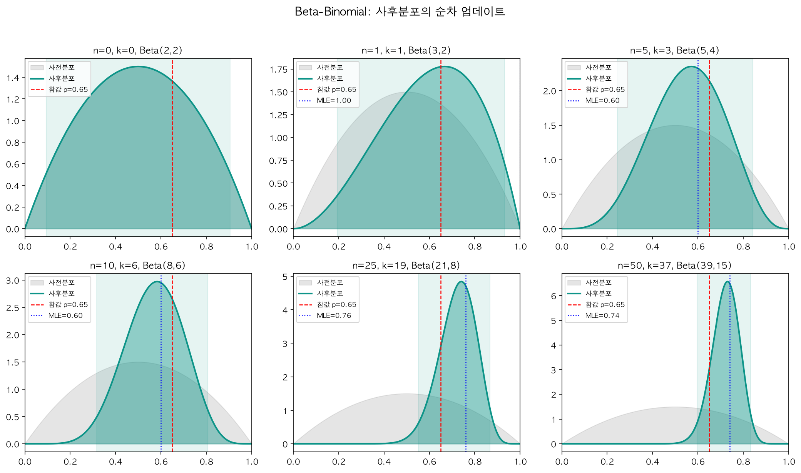

동전을 10번 던져 앞면이 7번 나왔다. MLE는 $\hat{p} = 0.7$이라고 답한다. 하지만 우리는 이것이 평범한 동전이며 앞면 확률이 0.5 근처일 가능성이 높다는 사실을 이미 알고 있다. 빈도주의 프레임워크에는 이 사전 지식을 넣을 자리가 없다. 데이터만이 증거다.

**베이지안 추론**(Bayesian Inference)은 사전 지식과 데이터를 명시적으로 결합한다. 모수를 확률변수로 두고, 관측 이후 갱신된 믿음을 사후분포 하나에 담는다.

## 빈도주의 vs 베이지안: 두 세계관

| 관점 | 빈도주의(Frequentist) | 베이지안(Bayesian) |
|------|----------------------|-------------------|
| **모수 $\theta$의 본질** | 고정된 미지의 상수 | 불확실성을 가진 확률변수 |
| **확률의 해석** | 장기적 빈도(Long-run frequency) | 믿음의 정도(Degree of belief) |
| **추론 방법** | MLE, 가설검정, 신뢰구간 | 사후분포, MAP, 신용구간 |
| **사전 지식** | 사용하지 않음 (데이터만) | 사전분포로 명시적 반영 |
| **불확실성 표현** | 표본 분포, p-value | 사후분포 전체 |
| **표본 크기 작을 때** | 불안정 (점근 이론 의존) | 사전분포가 안정화 역할 |
| **계산 비용** | 대체로 낮음 | 높을 수 있음 (MCMC 등) |

빈도주의에서 $\theta$는 알려지지 않았지만 고정된 값이므로 "$P(\theta = 0.5)$"라는 표현 자체가 성립하지 않는다. 베이지안에서 $\theta$는 확률변수이며, 불확실성을 확률분포로 표현할 수 있다.

데이터가 충분히 많으면 사전분포의 영향은 사라지고 두 패러다임의 결과가 수렴하는데, 이때는 빈도주의가 계산적으로 훨씬 간결하다. 규제 기관의 승인 절차처럼 "객관적" 기준이 요구되는 경우에도 빈도주의 가설검정이 표준이다. 반면 표본이 적을 때, 사전 지식이 풍부할 때, 불확실성의 전체 분포가 필요할 때는 베이지안이 강점을 갖는다. 임상시험의 적응적 설계, 추천 시스템의 콜드 스타트, A/B 테스트의 조기 종료 판단이 그런 영역이다.

## 베이지안 추론의 핵심 공식

베이즈 정리를 사건이 아니라 모수 $\theta$와 데이터 $X$로 바꿔 쓰면 베이지안 추론의 핵심 공식이 된다.

$$
\underbrace{P(\theta | X)}_{\text{사후분포}} = \frac{\overbrace{P(X | \theta)}^{\text{우도}} \cdot \overbrace{P(\theta)}^{\text{사전분포}}}{\underbrace{P(X)}_{\text{증거(주변우도)}}}
$$

| 요소 | 표기 | 역할 |
|------|------|------|
| **사전분포(Prior)** | $P(\theta)$ | 데이터를 보기 **전** 모수에 대한 믿음 |
| **우도(Likelihood)** | $P(X \mid \theta)$ | 주어진 $\theta$에서 데이터가 관측될 가능성 |
| **증거(Evidence)** | $P(X) = \int P(X \mid \theta) P(\theta) \, d\theta$ | 정규화 상수, $\theta$에 의존하지 않음 |
| **사후분포(Posterior)** | $P(\theta \mid X)$ | 데이터를 본 **후** 모수에 대한 업데이트된 믿음 |

증거 $P(X)$는 $\theta$에 대해 적분한 상수이므로 사후분포의 **형태**를 결정하는 데는 필요하지 않다. 비례 관계로 쓰면 이렇게 된다.

$$
\boxed{P(\theta | X) \propto P(X | \theta) \cdot P(\theta)}
$$

사전 믿음에 데이터의 증거를 곱하면 업데이트된 믿음을 얻는다. 데이터가 추가될 때마다 사후분포를 새로운 사전분포로 삼아 반복할 수 있으니, 베이지안 추론은 본질적으로 **순차적 학습**(sequential learning) 프레임워크이기도 하다.

## 사전분포(Prior)의 선택

사전분포는 반영하는 정보의 세기에 따라 세 가지로 나뉜다.

- **무정보(Non-informative)**: 균일분포 $P(\theta) \propto 1$은 직관적이지만 모수 변환에 대해 불변이 아니다($\theta$에 균일이면 $\theta^2$에는 균일이 아니다). **Jeffreys prior** $P(\theta) \propto \sqrt{I(\theta)}$는 피셔 정보량 $I(\theta)$를 이용해 이 문제를 피하며, 베르누이 분포에서는 $\text{Beta}(1/2, 1/2)$가 된다.
- **약정보(Weakly Informative)**: 극단적인 값만 배제하는 정도의 약한 정보를 반영한다. 사람의 키에 $N(170, 50^2)$을 쓰면 "-100cm이거나 500cm일 가능성은 낮다"는 상식만 넣는 셈이다. 실무에서 가장 많이 쓰인다.
- **정보적(Informative)**: 기존 메타분석 결과를 약물 효과의 사전분포로 쓰는 식으로 구체적 사전 지식을 반영한다.

:::warning

**사전분포 민감도(Prior Sensitivity)**

사전분포의 선택이 결론을 크게 바꾼다면, 그 분석은 데이터보다 사전 가정에 의존하고 있다는 신호다. 서로 다른 합리적 사전분포를 넣어보고 결론이 일관되는지 확인하는 민감도 분석이 필요하다.

:::

## 켤레 사전분포(Conjugate Prior)

사후분포를 구하려면 $P(X|\theta) \cdot P(\theta)$를 계산하고 정규화해야 하는데, 이 적분은 일반적으로 해석적으로 풀리지 않는다. 그런데 특정 우도-사전분포 조합에서는 **사후분포가 사전분포와 같은 분포족에 속한다**. 이런 사전분포를 **켤레 사전분포**(Conjugate Prior)라 하고, 적분 없이 하이퍼파라미터만 갱신하면 사후분포가 완성된다.

| 우도(Likelihood) | 켤레 사전분포(Prior) | 사후분포(Posterior) | 비고 |
|:---|:---|:---|:---|
| $\text{Bernoulli}(p)$ / $\text{Binomial}(n,p)$ | $\text{Beta}(\alpha, \beta)$ | $\text{Beta}(\alpha + k, \, \beta + n - k)$ | $k$: 성공 횟수 |
| $\text{Poisson}(\lambda)$ | $\text{Gamma}(\alpha, \beta)$ | $\text{Gamma}(\alpha + \sum x_i, \, \beta + n)$ | $\beta$는 rate 모수 |
| $\text{Normal}(\mu, \sigma^2_0)$ ($\sigma^2_0$ 기지) | $\text{Normal}(\mu_0, \tau^2_0)$ | $\text{Normal}(\mu_n, \tau^2_n)$ | $\tau^2_n = \left(\frac{1}{\tau^2_0} + \frac{n}{\sigma^2_0}\right)^{-1}$, $\mu_n = \tau^2_n\left(\frac{\mu_0}{\tau^2_0} + \frac{n\bar{x}}{\sigma^2_0}\right)$ |
| $\text{Exponential}(\lambda)$ | $\text{Gamma}(\alpha, \beta)$ | $\text{Gamma}(\alpha + n, \, \beta + \sum x_i)$ | |
| $\text{Multinomial}$ | $\text{Dirichlet}(\boldsymbol{\alpha})$ | $\text{Dirichlet}(\boldsymbol{\alpha} + \mathbf{k})$ | $\mathbf{k}$: 각 범주 관측 수 |

### Beta-Binomial 유도

동전을 $n$번 던져 앞면이 $k$번 나왔고, $p$의 사전분포로 $\text{Beta}(\alpha, \beta)$를 쓴다고 하자. 베타 밀도 $p^{\alpha-1}(1-p)^{\beta-1}$과 이항 우도 $p^k(1-p)^{n-k}$를 곱한 뒤 $p$에 의존하지 않는 상수를 모두 버리면, 남는 것은 베타 분포의 커널 그 자체다.

$$
P(p \mid X=k) \propto p^{k + \alpha - 1}(1-p)^{n - k + \beta - 1} \;\Longrightarrow\; \boxed{p \mid X=k \;\sim\; \text{Beta}(\alpha + k, \; \beta + n - k)}
$$

$\alpha$에 성공 횟수를, $\beta$에 실패 횟수를 더하면 끝이다. 따라서 $\alpha, \beta$는 **가상의 사전 관측**으로 해석할 수 있다. $\text{Beta}(2, 5)$는 "이전에 2번 성공, 5번 실패를 관측한 것과 같은 사전 믿음"이고, $\alpha + \beta$는 사전 유효 표본 크기가 된다. 이 값이 클수록 사전분포가 강하게 작용한다.

## 사후분포에서의 추론

### MAP 추정 (Maximum A Posteriori)

사후분포의 **최빈값**(mode)을 점추정값으로 쓰는 방법이다.

$$
\hat{\theta}_{\text{MLE}} = \arg\max_\theta P(X|\theta), \qquad \hat{\theta}_{\text{MAP}} = \arg\max_\theta P(X|\theta) \cdot P(\theta)
$$

MAP는 MLE에 사전분포라는 가중치를 곱한 것이다. 사전분포가 균일분포이면 $P(\theta) \propto 1$이므로 MAP = MLE가 된다. 즉 **MLE는 균일 사전분포를 사용한 MAP의 특수한 경우**다. Beta-Binomial에서 $\text{Beta}(\alpha + k, \beta + n - k)$의 최빈값은 $\hat{p}_{\text{MAP}} = \frac{\alpha + k - 1}{\alpha + \beta + n - 2}$이다.

### 사후 평균 (Posterior Mean)

사후분포의 기댓값을 점추정값으로 쓸 수도 있다. $\text{Beta}(\alpha + k, \beta + n - k)$의 평균을 변형하면 구조가 드러난다.

$$
\hat{p}_{\text{post.mean}} = \frac{\alpha + k}{\alpha + \beta + n} = \underbrace{\frac{n}{\alpha + \beta + n}}_{\text{데이터 가중치}} \cdot \underbrace{\frac{k}{n}}_{\text{MLE}} + \underbrace{\frac{\alpha + \beta}{\alpha + \beta + n}}_{\text{사전분포 가중치}} \cdot \underbrace{\frac{\alpha}{\alpha + \beta}}_{\text{사전 평균}}
$$

**사후 평균은 MLE와 사전 평균의 가중 평균이다.** 데이터가 많아지면 MLE 쪽으로, 사전분포가 강하면 사전 평균 쪽으로 끌린다. 이것이 베이지안 추론의 사전-데이터 균형 메커니즘이다.

### 신용구간(Credible Interval) vs 신뢰구간

| | 95% 신뢰구간 (Frequentist) | 95% 신용구간 (Bayesian) |
|---|---|---|
| **정의** | 같은 절차를 반복하면 95%의 구간이 참 모수를 포함 | 모수가 이 구간에 있을 확률이 95% |
| **해석** | 절차에 대한 확률 (장기 빈도) | 모수에 대한 직접적 확률 진술 |
| **"이 구간에 $\theta$가 있을 확률이 95%"** | **아니오** ($\theta$는 상수) | **예** ($\theta$는 확률변수) |

신용구간은 보통 양쪽 꼬리를 2.5%씩 잘라내는 등꼬리(equal-tailed) 구간으로 구한다. 사후 밀도가 가장 높은 영역을 택하는 **HPD**(Highest Posterior Density) 구간을 쓰면 같은 확률에서 더 좁거나 같은 구간을 얻는다. 사후분포가 대칭이면 둘이 일치하고, 비대칭일 때 서로 다른 구간이 된다.

## Python 실습: 사후분포의 순차 갱신

데이터가 하나씩 추가될 때 사후분포가 어떻게 변하는지 확인해 보자. 켤레 관계 덕분에 갱신은 덧셈 두 번이 전부다.

```python
import numpy as np
from scipy import stats

np.random.seed(42)
true_p = 0.65                                    # 실제 앞면 확률
data = np.random.binomial(1, true_p, size=50)
alpha_prior, beta_prior = 2, 2                   # Beta(2,2): p가 0.5 근처라는 약한 사전 지식

for n_obs in [0, 1, 5, 10, 25, 50]:
    k = int(data[:n_obs].sum())
    a, b = alpha_prior + k, beta_prior + (n_obs - k)
    lo, hi = stats.beta(a, b).ppf([0.025, 0.975])
    print(f"n={n_obs:2d}, k={k:2d} -> Beta({a},{b}), "
          f"사후평균={a/(a+b):.3f}, 95% CrI=[{lo:.3f}, {hi:.3f}]")
```

```
n= 0, k= 0 -> Beta(2,2), 사후평균=0.500, 95% CrI=[0.094, 0.906]
n= 1, k= 1 -> Beta(3,2), 사후평균=0.600, 95% CrI=[0.194, 0.932]
n= 5, k= 3 -> Beta(5,4), 사후평균=0.556, 95% CrI=[0.245, 0.843]
n=10, k= 6 -> Beta(8,6), 사후평균=0.571, 95% CrI=[0.316, 0.808]
n=25, k=19 -> Beta(21,8), 사후평균=0.724, 95% CrI=[0.551, 0.868]
n=50, k=37 -> Beta(39,15), 사후평균=0.722, 95% CrI=[0.597, 0.832]
```



*데이터가 쌓일수록 사후분포가 좁아지고, 사전분포의 자리를 표본이 밀어낸다. 빨간 점선이 참값이다.*

$n=0$에서는 사전분포 $\text{Beta}(2,2)$ 그대로 $p=0.5$ 근처에 퍼져 있다가, 데이터가 쌓일수록 신용구간이 좁아진다. 여기서 한 가지를 짚어둘 만하다. 이 표본은 50번 중 앞면이 37번(0.74) 나왔고, 그래서 사후평균이 참값 0.65가 아니라 0.72에 자리잡는다. 사후분포가 끌려가는 곳은 참값이 아니라 데이터가 가리키는 값이다. 참값은 신용구간 $[0.597, 0.832]$ 안에 들어 있을 뿐이고, 그것이 이 구간이 하는 약속의 전부다. $n=50$에서는 사전분포의 흔적이 거의 남지 않는다.

## MCMC 입문: 켤레가 아닌 경우

켤레 사전분포는 편리하지만 현실의 모델은 대부분 이렇게 깔끔하지 않다. 다중 모수 모델, 비표준 우도, 계층적 구조에서는 정규화 상수 $P(X) = \int P(X|\theta)P(\theta)\,d\theta$를 해석적으로 계산할 수 없다.

핵심 아이디어는 이것이다. **사후분포를 정확히 알 수 없어도, 사후분포에서 샘플을 뽑을 수만 있으면 충분하다.** 충분히 많은 샘플이 있으면 히스토그램으로 형태를 파악하고 평균이나 분위수를 계산할 수 있다. 이것이 **마르코프 체인 몬테카를로**(Markov Chain Monte Carlo, MCMC)다.

### Metropolis-Hastings 알고리즘

제안 분포로 다음 후보를 뽑고, 사후 밀도의 비율에 따라 수용 여부를 정하는 방식이다.

1. 임의의 시작점 $\theta_0$을 선택한다.
2. 현재 위치 $\theta_t$에서 제안 분포 $q(\theta^* | \theta_t)$로 후보 $\theta^*$를 생성한다. 예를 들어 $\theta^* \sim N(\theta_t, \sigma^2)$.
3. **수용 확률**을 계산한다. 일반형에는 제안 분포의 비대칭을 보정하는 $q(\theta_t|\theta^*) / q(\theta^*|\theta_t)$ 항이 붙지만, 대칭 제안 분포를 쓰면 이 항이 1이 되어 아래처럼 간소화된다.

$$
\alpha = \min\left(1, \; \frac{P(X|\theta^*) \cdot P(\theta^*)}{P(X|\theta_t) \cdot P(\theta_t)}\right)
$$

4. 균일 난수 $u \sim U(0,1)$을 뽑아 $u < \alpha$이면 $\theta_{t+1} = \theta^*$, 아니면 $\theta_{t+1} = \theta_t$.
5. 2-4를 수천에서 수만 번 반복한다.

여기서 핵심은 수용 확률의 비율에서 **정규화 상수 $P(X)$가 상쇄된다**는 점이다. 분자와 분모 모두 $P(\theta|X) \propto P(X|\theta)P(\theta)$이므로, 정규화 상수를 모르고도 사후분포에서 샘플링할 수 있다.

실무에서 MCMC를 직접 구현하는 일은 드물다. PyMC(NUTS 기반)나 Stan(HMC 기반)이 자동 미분과 수렴 진단, 사후 예측 검사를 기본 제공하므로, 원리를 이해한 뒤에는 이런 도구로 넘어가는 것이 낫다.

## 같은 문제, 두 가지 풀이

동전을 30번 던져 앞면이 21번 나왔다. 이 동전은 공정한가.

### 빈도주의 접근

```python
import numpy as np
from scipy import stats

n, k = 30, 21
p_hat = k / n                                     # MLE

se = np.sqrt(p_hat * (1 - p_hat) / n)             # Wald 95% 신뢰구간
ci_freq = (p_hat - 1.96 * se, p_hat + 1.96 * se)

z = (p_hat - 0.5) / np.sqrt(0.5 * 0.5 / n)        # H0: p = 0.5 vs H1: p ≠ 0.5
p_value = 2 * (1 - stats.norm.cdf(abs(z)))

print(f"MLE={p_hat:.4f}, CI=[{ci_freq[0]:.4f}, {ci_freq[1]:.4f}]")
print(f"z={z:.4f}, p-value={p_value:.4f}")
# MLE=0.7000, CI=[0.5360, 0.8640]
# z=2.1909, p-value=0.0285
```

p-value = 0.028 < 0.05이므로 귀무가설을 기각한다. 이 동전이 공정하지 않다는 증거가 있다. 하지만 "공정하지 않을 확률이 얼마인지"는 빈도주의가 답할 수 없는 질문이다.

### 베이지안 접근

```python
from scipy import stats

n, k = 30, 21
alpha_post, beta_post = 2 + k, 2 + (n - k)    # Beta(2,2) 사전분포 -> Beta(23, 11)
posterior = stats.beta(alpha_post, beta_post)

p_map = (alpha_post - 1) / (alpha_post + beta_post - 2)
ci = posterior.ppf([0.025, 0.975])            # 등꼬리 신용구간

print(f"MAP={p_map:.4f}, 사후평균={posterior.mean():.4f}")
print(f"95% 신용구간=[{ci[0]:.4f}, {ci[1]:.4f}]")
print(f"P(p > 0.5 | data)={1 - posterior.cdf(0.5):.4f}")
print(f"P(0.45 < p < 0.55 | data)={posterior.cdf(0.55) - posterior.cdf(0.45):.4f}")
# MAP=0.6875, 사후평균=0.6765
# 95% 신용구간=[0.5129, 0.8204]
# P(p > 0.5 | data)=0.9825
# P(0.45 < p < 0.55 | data)=0.0587
```

$P(p > 0.5 \mid \text{data}) \approx 0.98$, 즉 이 동전이 앞면 쪽으로 편향되었을 확률이 약 98%다. 거의 공정하다고 볼 구간($0.45 < p < 0.55$)에 들어갈 확률은 6%에 불과하다.

| | 빈도주의 | 베이지안 |
|---|---|---|
| **점추정** | $\hat{p}=0.70$ | MAP=0.69, 평균=0.68 |
| **구간추정** | CI: [0.54, 0.86] | CrI: [0.51, 0.82] |
| **검정** | p-value=0.028 (기각) | $P(p>0.5\mid\text{data})=0.98$ |
| **해석** | "이 절차가 장기적으로 참을 포함할 확률 95%" | "p가 이 구간에 있을 확률 95%" |

베이지안 점추정이 MLE보다 약간 작은 것은 $\text{Beta}(2,2)$가 0.5 방향으로 수축(shrinkage)시키기 때문이다. 신용구간이 신뢰구간보다 약간 좁게 나왔는데, 이는 사전분포의 기여와 함께 Wald 구간이 이항 비율에서 조악한 정규 근사라는 사정이 겹친 결과다. 사전분포 효과만으로 해석하면 안 된다.

## 흔히 빠지는 함정

**사전분포가 주관적이라는 비판.** 빈도주의도 완전히 객관적이지는 않다. 모델 선택, 유의수준 설정, 단측/양측 검정의 선택 모두 분석자의 판단이다. 사전분포는 그 판단을 명시적으로 드러낸다는 점에서 오히려 투명하고, 데이터가 충분하면 합리적인 사전분포 사이의 차이는 사라진다.

**MCMC 수렴 진단 생략.** 체인이 수렴하지 않았다면 샘플 수가 아무리 많아도 결과는 의미가 없다. 체인이 사후분포의 일부 영역에만 갇혀 있을 수 있다(multi-modality). 다음 세 가지를 확인해야 한다.

- **Trace plot**: 체인이 하나의 영역에 안정적으로 머무르는지 육안으로 확인
- **$\hat{R}$ (R-hat)**: 여러 체인 간 분산과 체인 내 분산의 비율. $\hat{R} < 1.01$이면 수렴으로 판단
- **유효 표본 크기(ESS)**: 자기상관을 고려한 실질적 독립 표본 수. 최소 수백 이상 확보

**사전분포와 우도의 스케일 불일치.** 데이터가 $\theta \approx 100$ 근처를 가리키는데 사전분포가 $N(0, 1)$이면, MCMC가 사후 밀도가 극히 낮은 영역만 헤매게 된다.

## 마치며

베이지안 관점에서는 사후분포라는 하나의 객체 안에 점추정, 구간추정, 검정이 모두 녹아 있다. 사전 지식이 있으면 쓰고, 없으면 약한 사전분포로 두면 된다.

다만 베이지안이 항상 더 나은 것은 아니다. 사전분포를 잘못 설정하면 MLE보다 못한 결과를 내고, 데이터가 충분히 많으면 빈도주의 방법이 계산적으로 유리하면서 결과도 거의 같다. 모수를 상수로 보는 관점과 확률변수로 보는 관점은 서로 다른 철학이며, 각각이 더 자연스러운 문제 영역이 있다.

## 함께 보면 좋은 글

- [조건부 확률과 베이즈 정리](/stats/conditional-probability-bayes/)
- [최대우도추정(MLE)과 적률법](/stats/mle-and-mom/)
- [신뢰구간](/stats/confidence-intervals/)
- [부트스트랩](/stats/bootstrap/)

## 참고자료

- Gelman, A. et al. *Bayesian Data Analysis* (3rd ed.). Chapman & Hall/CRC, 2013. (베이지안 통계의 표준 교재)
- McElreath, R. *Statistical Rethinking* (2nd ed.). CRC Press, 2020. (직관적 설명과 R/Stan 실습)
- Kruschke, J. *Doing Bayesian Data Analysis* (2nd ed.). Academic Press, 2014. ("Puppy Book"으로 불리는 실용 입문서)
- Murphy, K. *Probabilistic Machine Learning: An Introduction*. MIT Press, 2022. (ML 관점의 베이지안 접근)
- Vehtari, A. et al. (2021). "Rank-Normalization, Folding, and Localization: An Improved $\hat{R}$ for Assessing Convergence of MCMC." *Bayesian Analysis*, 16(2), 667-718.
- [PyMC Documentation](https://www.pymc.io/projects/docs/en/stable/)
