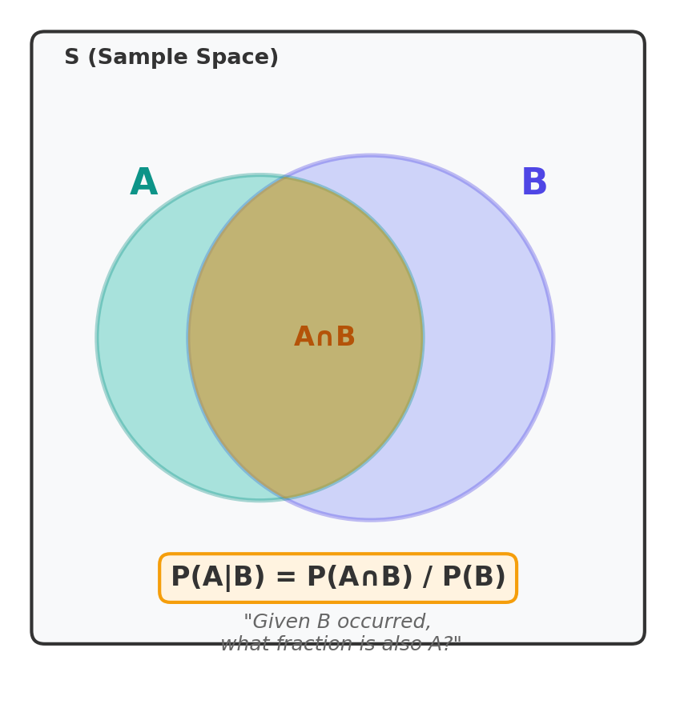
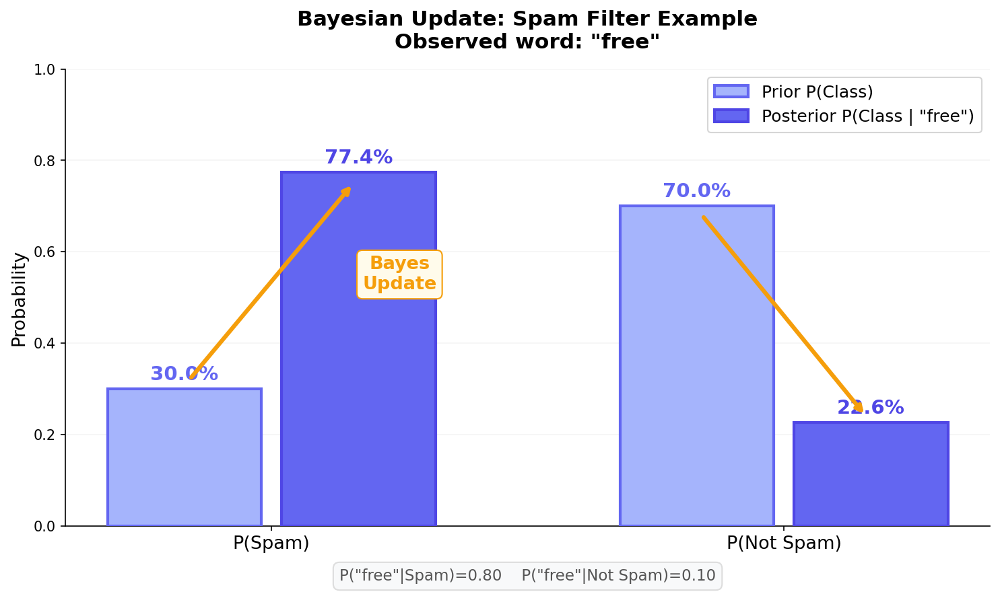
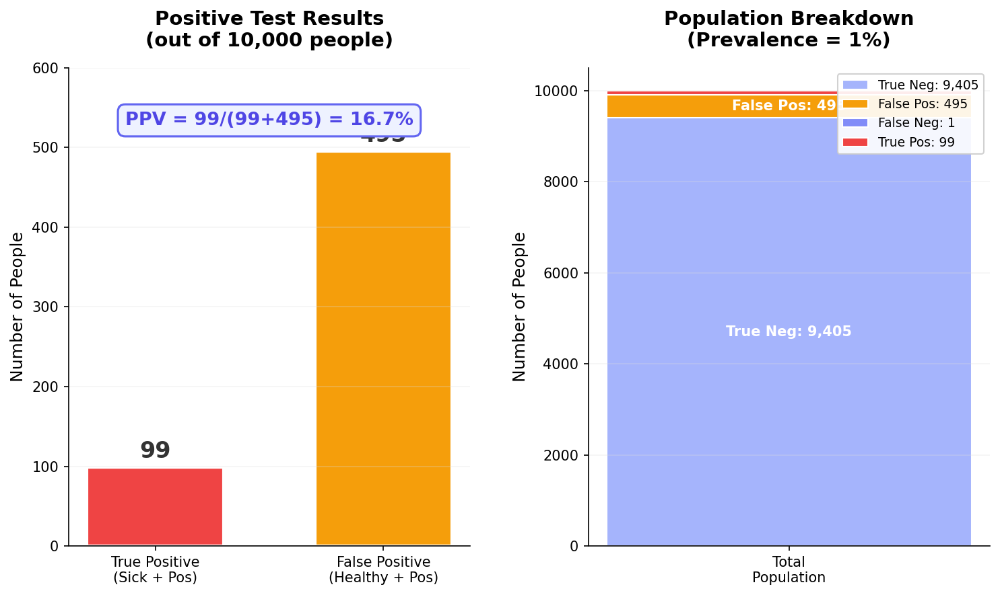
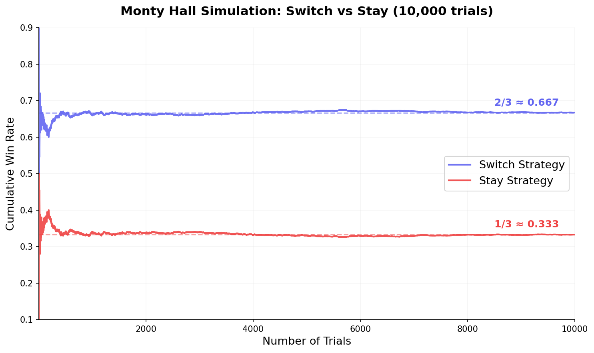

## 들어가며: 정보가 확률을 바꾼다

[이전 글](/stats/probability-fundamentals/)에서 확률의 공리와 셈 원리를 다뤘다. 표본공간 위에서 사건의 확률을 어떻게 계산하는지 기초를 세운 셈이다. 그런데 현실 문제를 떠올려 보면, 아무런 정보 없이 "순수한" 확률을 계산하는 경우가 과연 얼마나 될까?

의사는 환자의 증상을 **이미 관찰한 뒤** 질병 확률을 판단한다. 스팸 필터는 이메일에 포함된 **특정 단어를 확인한 뒤** 스팸 여부를 결정한다. 자율주행차는 센서 데이터를 **수집한 뒤** 장애물의 존재 확률을 갱신한다. 사실 우리가 일상에서 내리는 대부분의 판단도 마찬가지다 — 새로운 정보를 얻으면 기존 믿음이 업데이트된다.

이 "정보에 의한 확률 업데이트"를 수학적으로 정밀하게 다루는 도구가 바로 **조건부 확률(Conditional Probability)**과 **베이즈 정리(Bayes' Theorem)**다. 머신러닝의 근간이 되는 개념이니, 이번 글에서 직관부터 수식까지 단단히 다져보자.

---

## 조건부 확률의 정의

### 핵심 아이디어: 표본공간이 줄어든다

주사위를 던져서 짝수가 나왔다는 정보를 얻었다고 하자. 이 순간 가능한 결과는 {2, 4, 6}으로 줄어든다. 원래 6개였던 표본공간이 3개로 축소된 것이다. 이 축소된 공간 안에서 "3 이상"인 사건의 확률은? {4, 6}이니 2/3이 된다.

이것이 조건부 확률의 핵심 직관이다. **이미 일어난 사건 B가 새로운 표본공간이 되고, 그 안에서 A의 비율을 계산하는 것**이 조건부 확률이다.

### 수식 정의

사건 B가 일어났을 때 사건 A의 조건부 확률은 다음과 같이 정의한다:

$$
P(A|B) = \frac{P(A \cap B)}{P(B)}, \quad P(B) > 0
$$

세로 막대(|)는 "given"이라고 읽으며, "B가 주어졌을 때"라는 뜻이다. 분모의 $P(B) > 0$ 조건은 확률이 0인 사건을 조건으로 삼을 수 없다는 의미다.


<p align="center" style="color: #888; font-size: 13px;"><em>조건부 확률의 면적 모델 — B가 새로운 표본공간이 되고, 그 안에서 A∩B의 비율이 P(A|B)다</em></p>

면적 다이어그램을 보면 직관이 선명해진다. 전체 사각형이 표본공간 S이고, B라는 조건이 주어지면 우리의 "세계"가 B 원 안으로 축소된다. P(A|B)는 B 영역 중 A와 겹치는 부분의 비율인 셈이다.

### 곱셈 규칙

조건부 확률 정의를 변형하면 **곱셈 규칙(Multiplication Rule)**을 바로 얻는다:

$$
P(A \cap B) = P(A|B) \cdot P(B) = P(B|A) \cdot P(A)
$$

두 사건의 교집합 확률을 구할 때 매우 유용한 공식이다. 특히 순차적으로 일어나는 사건을 다룰 때 자연스럽다. "먼저 B가 일어나고(P(B)), 그다음 B가 일어난 상태에서 A가 일어날(P(A|B)) 확률"로 읽으면 된다.

<div style="background: #f0f4ff; border-left: 4px solid #3182f6; padding: 16px 20px; margin: 20px 0; border-radius: 4px;"><strong>💡 참고</strong><br>곱셈 규칙은 세 개 이상의 사건으로 확장할 수 있다:<br><br>$P(A \cap B \cap C) = P(A) \cdot P(B|A) \cdot P(C|A \cap B)$<br><br>이를 <strong>연쇄 규칙(Chain Rule of Probability)</strong>이라 하며, 확률적 그래프 모델의 기초가 된다.</div>

### 간단한 예제: 카드 뽑기

52장의 카드 덱에서 카드를 2장 연속으로 뽑는다(비복원). 두 장 모두 에이스(A)일 확률은?

$$
P(\text{두 장 모두 A}) = P(\text{첫 번째 A}) \times P(\text{두 번째 A} | \text{첫 번째 A})
$$

$$
= \frac{4}{52} \times \frac{3}{51} = \frac{12}{2652} = \frac{1}{221} \approx 0.0045
$$

첫 번째 에이스를 뽑은 뒤 남은 카드는 51장이고 에이스는 3장이므로, 두 번째 조건부 확률이 3/51이 된다. 곱셈 규칙이 자연스럽게 적용되는 전형적 사례다.

---

## 독립과 조건부 독립

### 독립 사건의 정의

두 사건 A와 B가 **독립(Independent)**이라 함은, 한 사건의 발생이 다른 사건의 확률에 영향을 주지 않는다는 뜻이다. 수식으로는:

$$
P(A \cap B) = P(A) \cdot P(B)
$$

또는 동치로:

$$
P(A|B) = P(A)
$$

B가 일어났든 아니든 A의 확률이 변하지 않으면, A와 B는 독립이다. 주사위 두 개를 동시에 던질 때, 첫 번째 주사위 결과와 두 번째 주사위 결과가 독립인 것은 직관적으로 자명하다.

<div style="background: #fff3f0; border-left: 4px solid #ff6b6b; padding: 16px 20px; margin: 20px 0; border-radius: 4px;"><strong>⚠️ 주의</strong><br><strong>독립 ≠ 배반(상호 배타)</strong>. 많은 학생이 이 둘을 혼동한다.<br><br>• <strong>배반(Mutually Exclusive)</strong>: $P(A \cap B) = 0$ — 두 사건이 동시에 일어날 수 없다<br>• <strong>독립(Independent)</strong>: $P(A \cap B) = P(A)P(B)$ — 한 사건이 다른 사건 확률에 영향을 주지 않는다<br><br>$P(A) > 0$이고 $P(B) > 0$인 배반 사건은 <em>절대로</em> 독립이 아니다. A가 일어나면 B가 일어날 수 없으므로 $P(B|A) = 0 \neq P(B)$이기 때문이다.</div>

### 조건부 독립

사건 C가 주어졌을 때 A와 B가 조건부 독립(Conditionally Independent)이라 함은:

$$
P(A \cap B | C) = P(A|C) \cdot P(B|C)
$$

물론 조건부 독립과 (무조건) 독립은 별개의 개념이다. 독립인 사건이 조건을 추가하면 종속이 될 수 있고, 그 반대도 가능하다.

### 나이브 베이즈의 "나이브"한 가정

[나이브 베이즈 분류기](/ml/naive-bayes/)의 이름에 "나이브(Naive)"가 붙는 이유가 바로 이 조건부 독립 가정이다. 클래스 $C$가 주어졌을 때 특성(feature) $X_1, X_2, \ldots, X_n$이 서로 조건부 독립이라고 가정한다:

$$
P(X_1, X_2, \ldots, X_n | C) = \prod_{i=1}^{n} P(X_i | C)
$$

현실에서 특성들이 완전히 조건부 독립인 경우는 드물다. 이메일에서 "무료"와 "할인"이라는 단어는 스팸이라는 조건 하에서도 함께 등장하는 경향이 있다. 그럼에도 이 "순진한" 가정은 실전에서 놀라울 만큼 잘 작동한다. 분류 확률의 정확한 값보다 **어떤 클래스의 확률이 더 큰지 순서**만 맞으면 되기 때문이다.

---

## 전확률 공식 (Law of Total Probability)

### 분할로 확률을 분해하기

어떤 사건 A의 확률을 직접 계산하기 어려울 때, 표본공간을 여러 조각으로 **분할(Partition)**한 뒤 각 조각에서의 조건부 확률을 이용하면 쉽게 구할 수 있다.

사건 $B_1, B_2, \ldots, B_n$이 표본공간 S의 분할이라면 (서로 배반이고 합집합이 S):

$$
P(A) = \sum_{i=1}^{n} P(A|B_i) \cdot P(B_i)
$$

이것이 **전확률 공식(Law of Total Probability)**이다.

가장 흔히 쓰는 경우는 $n=2$일 때다. 사건 B와 그 여사건 $B^c$로 분할하면:

$$
P(A) = P(A|B) \cdot P(B) + P(A|B^c) \cdot P(B^c)
$$

### 예시: 의료 검사 양성 판정

구체적 예시로 들어가 보자. 어떤 질병의 유병률(Prevalence)은 1%다. 검사의 성능은 다음과 같다:

| 지표 | 값 | 의미 |
|------|-----|------|
| 민감도(Sensitivity) | 99% | 실제 환자 중 양성 판정 비율 |
| 특이도(Specificity) | 95% | 건강한 사람 중 음성 판정 비율 |

**질문**: 검사에서 양성(+) 판정을 받았을 때, 실제로 그 질병에 걸렸을 확률은?

먼저 전확률 공식으로 양성 판정 전체 확률을 구하자:

$$
P(+) = P(+|\text{sick}) \cdot P(\text{sick}) + P(+|\text{healthy}) \cdot P(\text{healthy})
$$

$$
= 0.99 \times 0.01 + 0.05 \times 0.99 = 0.0099 + 0.0495 = 0.0594
$$

양성 판정을 받을 전체 확률은 약 5.94%다. 여기서 놀라운 점은 양성 판정의 대부분이 **건강한 사람의 거짓 양성(False Positive)**에서 온다는 것이다. 유병률이 1%로 낮기 때문에, 건강한 사람(99%)의 5%인 4.95%가 거짓 양성을 이끌고, 이것이 실제 환자의 양성(0.99%)보다 훨씬 크다.

이 결과는 곧 베이즈 정리로 이어진다.

---

## 베이즈 정리 유도와 직관

### 유도

베이즈 정리는 곱셈 규칙과 전확률 공식을 조합하면 자연스럽게 따라온다.

곱셈 규칙에서:
$$
P(A|B) \cdot P(B) = P(B|A) \cdot P(A)
$$

양변을 $P(B)$로 나누면:
$$
P(A|B) = \frac{P(B|A) \cdot P(A)}{P(B)}
$$

분모에 전확률 공식을 대입하면 **베이즈 정리(Bayes' Theorem)**의 완전한 형태가 된다:

$$
P(A|B) = \frac{P(B|A) \cdot P(A)}{P(B|A) \cdot P(A) + P(B|A^c) \cdot P(A^c)}
$$

### 각 요소의 이름

| 기호 | 이름 | 의미 |
|------|------|------|
| $P(A)$ | **사전 확률(Prior)** | 데이터를 보기 전 A에 대한 믿음 |
| $P(B\|A)$ | **우도(Likelihood)** | A가 참일 때 B가 관측될 가능성 |
| $P(B)$ | **증거(Evidence)** | B가 관측될 전체 확률 (정규화 상수) |
| $P(A\|B)$ | **사후 확률(Posterior)** | B를 관측한 뒤 업데이트된 A에 대한 믿음 |

한 줄로 요약하면:

$$
\text{Posterior} = \frac{\text{Likelihood} \times \text{Prior}}{\text{Evidence}}
$$

결국 베이즈 정리는 **"새로운 증거(B)를 관측했을 때, 기존 믿음(Prior)을 어떻게 업데이트해서 새로운 믿음(Posterior)을 얻을 것인가"**에 대한 공식이다.

### 스팸 필터 예시

스팸 메일의 사전 확률이 $P(\text{spam}) = 0.3$이라 하자. "무료(free)"라는 단어가 포함되어 있을 때, 이 메일이 스팸일 확률은?

- $P(\text{"free"}|\text{spam}) = 0.8$ — 스팸 메일의 80%에 "free"가 포함
- $P(\text{"free"}|\text{not spam}) = 0.1$ — 정상 메일의 10%에 "free"가 포함

베이즈 정리를 적용하면:

$$
P(\text{spam}|\text{"free"}) = \frac{0.8 \times 0.3}{0.8 \times 0.3 + 0.1 \times 0.7} = \frac{0.24}{0.24 + 0.07} = \frac{0.24}{0.31} \approx 0.774
$$

"free"라는 단어 하나를 관측했을 뿐인데, 스팸 확률이 30%에서 77.4%로 급격히 상승했다.


<p align="center" style="color: #888; font-size: 13px;"><em>베이즈 업데이트 — "free"라는 단어 관측 전후로 스팸 확률이 30%에서 77.4%로 업데이트된다</em></p>

이것이 베이즈 정리의 힘이다. 사전 믿음(Prior)에 새로운 증거의 우도(Likelihood)를 곱해서 사후 믿음(Posterior)을 계산한다. 증거가 누적될수록 확률은 점점 더 정확해진다.

<div style="background: #f0fff4; border-left: 4px solid #51cf66; padding: 16px 20px; margin: 20px 0; border-radius: 4px;"><strong>✅ 팁</strong><br>스팸 필터가 여러 단어를 순차적으로 관측할 때, 첫 번째 단어로 얻은 Posterior가 두 번째 단어를 처리할 때의 Prior가 된다. 이렇게 <strong>반복적으로 업데이트</strong>하는 것이 베이지안 추론의 핵심 패턴이다.</div>

---

## 베이즈 정리 실전: 의료 검사

### 양성 예측도(PPV) 계산

앞서 전확률 공식에서 다뤘던 의료 검사 예시를 베이즈 정리로 완성하자.

- 유병률: $P(\text{sick}) = 0.01$
- 민감도: $P(+|\text{sick}) = 0.99$
- 특이도: $P(-|\text{healthy}) = 0.95$, 따라서 $P(+|\text{healthy}) = 0.05$

$$
P(\text{sick}|+) = \frac{P(+|\text{sick}) \cdot P(\text{sick})}{P(+)}
= \frac{0.99 \times 0.01}{0.0594} = \frac{0.0099}{0.0594} \approx 0.167
$$

**검사에서 양성 판정을 받았는데, 실제로 아플 확률은 겨우 16.7%에 불과하다.**

민감도 99%, 특이도 95%라는 꽤 좋은 검사인데도 양성 예측도(Positive Predictive Value, PPV)가 이렇게 낮다니 직관에 반하는 결과다. 그런데 이것은 수학적으로 완벽하게 맞는 결과다.

### 자연 빈도(Natural Frequency)로 이해하기

확률보다 구체적인 숫자로 생각하면 훨씬 와닿는다. 10,000명을 생각해 보자:

| 구분 | 인원 | 양성 판정 | 음성 판정 |
|------|------|-----------|-----------|
| 실제 환자 (100명) | 100 | **99** (진양성) | 1 (위음성) |
| 건강한 사람 (9,900명) | 9,900 | **495** (위양성) | 9,405 (진음성) |
| **양성 판정 합계** | | **594** | |

양성 판정 594명 중 실제 환자는 99명이다. $99 / 594 \approx 16.7\%$. 양성 판정자의 약 83%가 건강한 사람인 것이다.


<p align="center" style="color: #888; font-size: 13px;"><em>10,000명 기준 양성 판정 분석 — 위양성(495명)이 진양성(99명)을 압도한다</em></p>

### 왜 이런 일이 일어나는가?

핵심은 **기저율(Base Rate)**이다. 유병률이 1%로 매우 낮기 때문에, 건강한 사람의 수(9,900명)가 환자 수(100명)를 압도한다. 건강한 사람 중 5%만 거짓 양성이 나와도 절대 숫자(495명)가 환자의 진양성(99명)보다 5배나 많다.

이 현상을 **기저율 무시(Base Rate Neglect)**라 하며, 인간이 빠지기 쉬운 인지적 편향 중 하나다. 베이즈 정리는 이 함정에서 벗어나게 해주는 정량적 도구인 셈이다.

<div style="background: #f0f4ff; border-left: 4px solid #3182f6; padding: 16px 20px; margin: 20px 0; border-radius: 4px;"><strong>💡 참고</strong><br>유병률이 올라가면 PPV도 급격히 올라간다. 유병률이 10%이면 PPV ≈ 68.8%, 50%이면 PPV ≈ 95.2%가 된다. 따라서 의료 검사는 <strong>고위험군(유병률이 높은 집단)</strong>을 대상으로 시행할 때 훨씬 유용하다.</div>

### Python으로 확인하기

```python
def ppv(prevalence, sensitivity, specificity):
    """양성 예측도(PPV) 계산 — 베이즈 정리 직접 적용"""
    p_pos = sensitivity * prevalence + (1 - specificity) * (1 - prevalence)
    return (sensitivity * prevalence) / p_pos

# 유병률 1%, 민감도 99%, 특이도 95%
print(f"PPV (유병률 1%):  {ppv(0.01, 0.99, 0.95):.3f}")   # 0.167
print(f"PPV (유병률 10%): {ppv(0.10, 0.99, 0.95):.3f}")   # 0.688
print(f"PPV (유병률 50%): {ppv(0.50, 0.99, 0.95):.3f}")   # 0.952
```

```
PPV (유병률 1%):  0.167
PPV (유병률 10%): 0.688
PPV (유병률 50%): 0.952
```

유병률이 높아질수록 PPV가 급격히 상승하는 것을 확인할 수 있다. 사전 확률(Prior)이 결과에 미치는 영향이 이렇게나 크다.

---

## Monty Hall Problem

### 문제 설명

미국의 유명 게임쇼에서 유래한 이 문제는 조건부 확률의 직관이 얼마나 배반적인지 보여주는 고전적 예시다.

1. 세 개의 문(1번, 2번, 3번) 뒤에 하나의 자동차와 두 마리의 염소가 있다
2. 참가자가 하나의 문을 선택한다 (예: 1번)
3. 진행자(Monty)는 참가자가 고르지 않은 문 중 **염소가 있는 문**을 하나 연다 (예: 3번)
4. 참가자에게 선택을 바꿀 기회를 준다

**질문**: 선택을 바꾸는 것(Switch)이 유리한가, 유지하는 것(Stay)이 유리한가?

### 베이즈 정리로 풀기

참가자가 1번 문을 골랐고, Monty가 3번 문(염소)을 열었다고 하자.

사전 확률(Prior):
- $P(C_1) = P(C_2) = P(C_3) = 1/3$ (자동차가 각 문 뒤에 있을 확률)

Monty가 3번 문을 열 확률(Likelihood):
- $P(\text{open 3}|C_1) = 1/2$ — 자동차가 1번이면, 2번·3번 중 아무거나 열 수 있다
- $P(\text{open 3}|C_2) = 1$ — 자동차가 2번이면, 반드시 3번을 열어야 한다
- $P(\text{open 3}|C_3) = 0$ — 자동차가 3번이면, 3번을 열 수 없다

베이즈 정리 적용:

$$
P(C_1|\text{open 3}) = \frac{P(\text{open 3}|C_1) \cdot P(C_1)}{P(\text{open 3})}
= \frac{\frac{1}{2} \times \frac{1}{3}}{\frac{1}{2}} = \frac{1}{3}
$$

$$
P(C_2|\text{open 3}) = \frac{P(\text{open 3}|C_2) \cdot P(C_2)}{P(\text{open 3})}
= \frac{1 \times \frac{1}{3}}{\frac{1}{2}} = \frac{2}{3}
$$

여기서 $P(\text{open 3}) = 1/2 \times 1/3 + 1 \times 1/3 + 0 \times 1/3 = 1/2$ 이다.

결론: **선택을 바꾸면 승률이 2/3, 유지하면 1/3이다.** 바꾸는 것이 2배 유리하다.

### 직관적 이해

왜 이런 결과가 나올까? 핵심은 **Monty가 무작위로 문을 여는 것이 아니라, 반드시 염소가 있는 문을 연다**는 점이다. 이 행위가 정보를 제공한다.

처음 선택이 맞을 확률은 1/3이다. 이건 Monty가 문을 열기 전이든 후든 변하지 않는다. 따라서 나머지 두 문에 자동차가 있을 확률 2/3가 Monty가 열지 않은 한 문으로 집중된다.

### Python 시뮬레이션으로 검증

말로는 납득이 안 된다면, 시뮬레이션으로 직접 확인해 보자.

```python
import random

def monty_hall_simulation(n_trials=10000, switch=True):
    """Monty Hall 시뮬레이션"""
    wins = 0
    for _ in range(n_trials):
        car = random.randint(0, 2)        # 자동차 위치
        choice = random.randint(0, 2)      # 참가자 선택

        # Monty가 염소 문을 연다
        available = [d for d in range(3) if d != choice and d != car]
        monty_opens = random.choice(available)

        if switch:
            # 남은 문으로 변경
            final = [d for d in range(3) if d != choice and d != monty_opens][0]
        else:
            final = choice

        if final == car:
            wins += 1

    return wins / n_trials

random.seed(42)
print(f"Switch 전략 승률: {monty_hall_simulation(10000, switch=True):.4f}")
print(f"Stay 전략 승률:   {monty_hall_simulation(10000, switch=False):.4f}")
```

```
Switch 전략 승률: 0.6639
Stay 전략 승률:   0.3386
```

10,000번 시뮬레이션 결과, Switch 전략의 승률은 약 2/3, Stay 전략의 승률은 약 1/3로 수렴한다. 수학적 결과와 정확히 일치한다.


<p align="center" style="color: #888; font-size: 13px;"><em>10,000번 시뮬레이션에서 Switch 전략(2/3)과 Stay 전략(1/3)의 누적 승률 수렴</em></p>

시뮬레이션 초반에는 승률이 불안정하지만, 시행 횟수가 늘어나면서 이론값에 매끄럽게 수렴하는 것을 볼 수 있다. 이것이 큰 수의 법칙(Law of Large Numbers)이 작동하는 모습이기도 하다.

---

## 빈도론 vs 베이지안 패러다임

### 두 가지 확률 해석

조건부 확률과 베이즈 정리를 배웠으니, 확률을 바라보는 두 가지 큰 패러다임을 짚고 넘어가자.

**빈도론(Frequentist)**적 관점에서 확률은 **무한히 반복했을 때의 상대 빈도**다. 동전을 무한히 던지면 앞면의 비율이 수렴하는 값이 확률이다. 이 관점에서 모수(parameter)는 고정된 상수이고, 데이터가 확률적이다.

**베이지안(Bayesian)** 관점에서 확률은 **불확실성에 대한 주관적 믿음의 정도**다. "내일 비가 올 확률 70%"는 반복 실험의 빈도가 아니라, 현재 가용한 정보에 기반한 믿음의 크기다. 이 관점에서 모수 자체가 확률 분포를 가지며, 데이터를 관측할 때마다 베이즈 정리로 업데이트한다.

| 측면 | 빈도론 (Frequentist) | 베이지안 (Bayesian) |
|------|---------------------|---------------------|
| 확률의 의미 | 장기적 빈도 | 믿음의 정도 |
| 모수(θ) | 고정된 상수 | 확률 분포를 가진 변수 |
| 추론 방식 | MLE, 신뢰구간, p-value | 사전분포 → 사후분포 업데이트 |
| 대표적 방법 | [로지스틱 회귀](/ml/logistic-regression/), t-검정 | 베이지안 신경망, MCMC |

### ML에서의 위치

머신러닝에서 두 패러다임은 자주 교차한다. 최대우도추정(MLE)은 빈도론적 접근이고, 최대사후확률추정(MAP)은 베이지안적 접근이다. 흥미로운 점은 MAP에서 사전분포가 균등(Uniform)이면 MLE와 동일한 결과를 낸다는 것이다. 결국 **정규화(Regularization)는 베이지안 관점에서 특정 사전분포를 부과하는 것**으로 해석할 수 있다.

- **L2 정규화 (Ridge)** → 가우시안 사전분포
- **L1 정규화 (Lasso)** → 라플라스 사전분포

이런 연결 고리를 알고 있으면, 왜 정규화가 과적합을 방지하는지에 대한 더 깊은 직관을 얻을 수 있다. "모수가 극단적인 값을 갖지 않을 것이다"라는 사전 믿음을 수학적으로 표현한 것이 정규화인 셈이다.

<div style="background: #f0f4ff; border-left: 4px solid #3182f6; padding: 16px 20px; margin: 20px 0; border-radius: 4px;"><strong>💡 참고</strong><br><strong>판별적(Discriminative) vs 생성적(Generative) 모델</strong>의 구분도 조건부 확률과 관련이 깊다.<br><br>• <strong>판별적 모델</strong>: $P(Y|X)$를 직접 모델링 — 로지스틱 회귀, SVM, 신경망<br>• <strong>생성적 모델</strong>: $P(X|Y)P(Y)$를 모델링하고 베이즈 정리로 $P(Y|X)$ 계산 — 나이브 베이즈, GMM<br><br>자세한 비교는 <a href="/ml/logistic-regression/">로지스틱 회귀 글</a>에서 다룬다.</div>

---

## 핵심 공식 정리

이번 글에서 다룬 공식들을 한눈에 정리하자.

```
┌──────────────────────────────────────────────────────────────┐
│                    조건부 확률 & 베이즈                        │
├──────────────────────────────────────────────────────────────┤
│                                                              │
│  조건부 확률:    P(A|B) = P(A∩B) / P(B)                      │
│                                                              │
│  곱셈 규칙:     P(A∩B) = P(A|B)·P(B) = P(B|A)·P(A)         │
│                                                              │
│  독립:          P(A∩B) = P(A)·P(B)  ⟺  P(A|B) = P(A)      │
│                                                              │
│  전확률 공식:   P(A) = Σ P(A|Bᵢ)·P(Bᵢ)                     │
│                                                              │
│  베이즈 정리:   P(A|B) = P(B|A)·P(A) / P(B)                 │
│                        = Likelihood × Prior / Evidence       │
│                                                              │
└──────────────────────────────────────────────────────────────┘
```

각 공식이 독립적인 것이 아니라, 조건부 확률 정의에서 곱셈 규칙이 나오고, 곱셈 규칙과 전확률 공식을 조합하면 베이즈 정리가 나온다. 하나의 논리적 사슬로 연결되어 있다는 점을 기억하자.

---

## 연습 문제

개념을 다졌으니, 직접 풀어보며 정착시키자.

### 문제 1: 공장 불량률

공장 A는 전체 제품의 60%를 생산하고, 공장 B는 40%를 생산한다. 공장 A의 불량률은 2%, 공장 B의 불량률은 5%다. 무작위로 하나를 뽑았더니 불량이었을 때, 공장 A에서 생산되었을 확률은?

<details>
<summary><strong>풀이 보기</strong></summary>

전확률 공식으로 불량 확률을 구한다:

$$P(\text{defect}) = 0.02 \times 0.6 + 0.05 \times 0.4 = 0.012 + 0.020 = 0.032$$

베이즈 정리:

$$P(A|\text{defect}) = \frac{P(\text{defect}|A) \cdot P(A)}{P(\text{defect})} = \frac{0.02 \times 0.6}{0.032} = \frac{0.012}{0.032} = 0.375$$

불량품이 공장 A에서 나왔을 확률은 **37.5%**다. 공장 A가 더 많은 제품을 생산하지만(60%), 불량률이 낮아서(2%), 불량품 중에서는 오히려 소수를 차지한다.

</details>

### 문제 2: 두 번 양성

유병률 1%인 질병에 대해 (민감도 99%, 특이도 95%) 검사를 두 번 독립적으로 시행했고, 두 번 모두 양성이었다. 실제로 아플 확률은?

<details>
<summary><strong>풀이 보기</strong></summary>

첫 번째 검사 후 사후 확률이 새로운 사전 확률이 된다:

**1차 업데이트**: $P(\text{sick}|+_1) = 0.167$ (앞서 계산)

**2차 업데이트**: Prior = 0.167

$$P(\text{sick}|+_1, +_2) = \frac{0.99 \times 0.167}{0.99 \times 0.167 + 0.05 \times 0.833} = \frac{0.16533}{0.16533 + 0.04165} = \frac{0.16533}{0.20698} \approx 0.799$$

두 번 양성이면 확률이 **약 79.9%**로 크게 상승한다. 한 번(16.7%)에서 두 번(79.9%)으로의 도약이 인상적이다. 증거가 누적될수록 Posterior가 극적으로 변할 수 있다.

</details>

### 문제 3: 독립 판정

$P(A) = 0.4$, $P(B) = 0.5$, $P(A \cup B) = 0.7$일 때, A와 B는 독립인가?

<details>
<summary><strong>풀이 보기</strong></summary>

포함-배제 원리에서:
$$P(A \cap B) = P(A) + P(B) - P(A \cup B) = 0.4 + 0.5 - 0.7 = 0.2$$

독립이면 $P(A \cap B) = P(A) \cdot P(B) = 0.4 \times 0.5 = 0.2$

$0.2 = 0.2$ ✓ 이므로 **A와 B는 독립이다.**

</details>

---

## 마치며

이번 글에서 다룬 내용을 요약하면:

<div style="background: #f8f9fa; border: 1px solid #e9ecef; padding: 20px; margin: 24px 0; border-radius: 8px;"><strong>📌 핵심 요약</strong><br><br><ul style="margin: 0; padding-left: 20px;"><li><strong>조건부 확률</strong>: P(A|B)는 B가 일어났을 때 A의 확률 — 표본공간이 B로 축소된다</li><li><strong>독립</strong>: P(A∩B) = P(A)P(B)일 때 독립이며, 배반과는 전혀 다른 개념이다</li><li><strong>전확률 공식</strong>: 표본공간을 분할하여 복잡한 확률을 분해 계산한다</li><li><strong>베이즈 정리</strong>: Prior × Likelihood / Evidence = Posterior. 새로운 증거로 믿음을 업데이트한다</li><li><strong>기저율의 중요성</strong>: 유병률이 낮으면 좋은 검사도 양성 예측도가 낮다 (의료 검사 예시)</li><li><strong>빈도론 vs 베이지안</strong>: 확률의 두 해석이 ML에서 MLE와 MAP으로 이어진다</li></ul></div>

조건부 확률과 베이즈 정리는 단순한 수학 공식이 아니다. **정보가 주어졌을 때 불확실성을 업데이트하는 체계적 방법론**이며, 나이브 베이즈부터 베이지안 딥러닝까지 머신러닝 전반에 스며들어 있다.

[다음 글](/stats/random-variables-expectation/)에서는 **확률변수(Random Variable)와 기댓값(Expectation)**을 다룬다. 확률을 "사건"이 아닌 "숫자를 뱉는 함수"로 바라보는 관점의 전환이 기다리고 있다.

---

## 참고 자료

- Blitzstein, J. K., & Hwang, J. (2019). *Introduction to Probability* (2nd ed.), Chapter 2: Conditional Probability
- Harvard Statistics 110: Probability — Lecture 4-6 (Conditional Probability & Bayes)
- 3Blue1Brown. (2019). *Bayes theorem, the geometry of changing beliefs* [Video]
- Wikipedia. *Bayes' theorem*. https://en.wikipedia.org/wiki/Bayes%27_theorem
