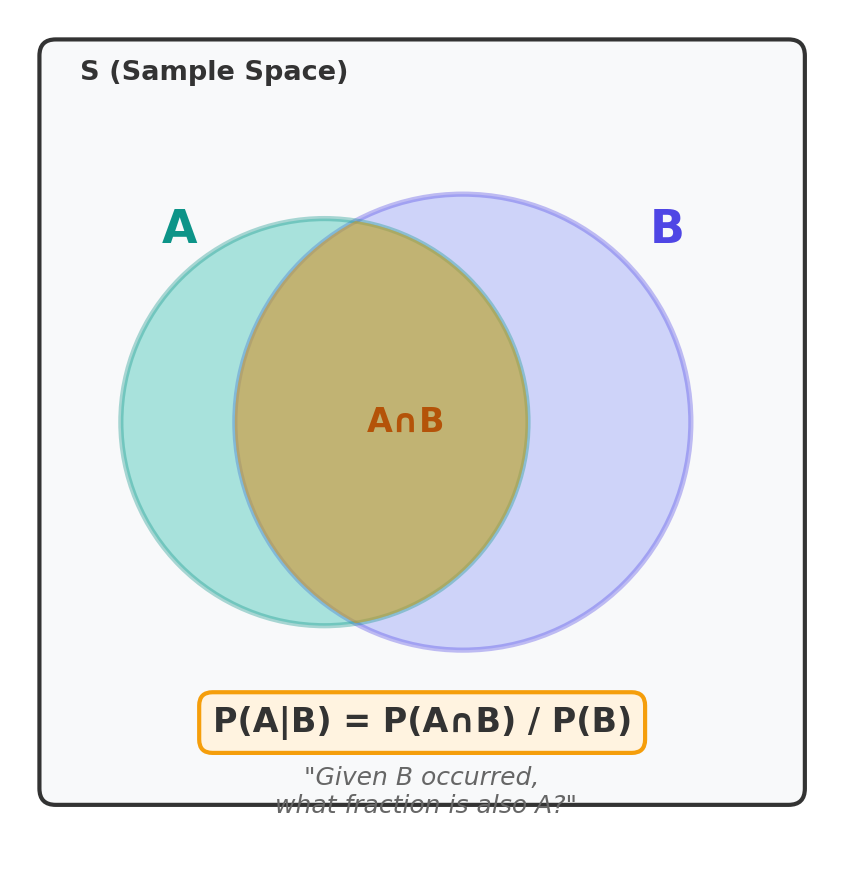
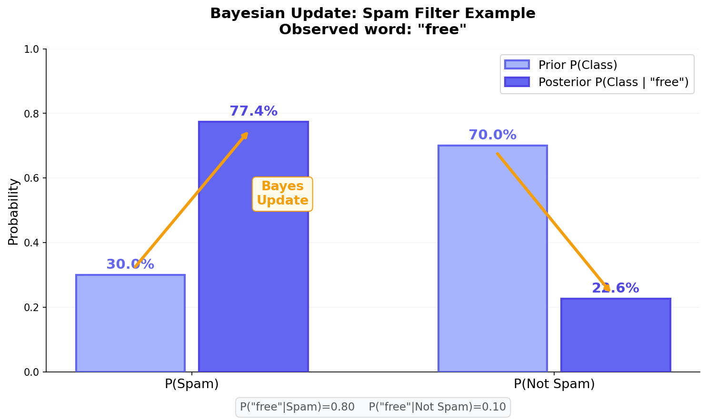
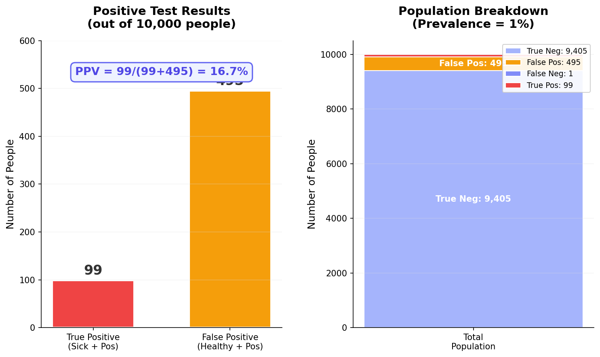
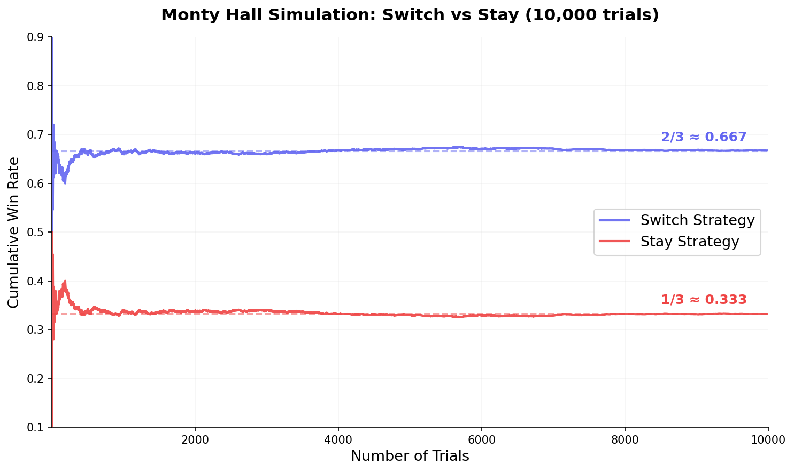

의사는 환자의 증상을 이미 관찰한 뒤 질병 확률을 판단한다. 스팸 필터는 이메일에 포함된 특정 단어를 확인한 뒤 스팸 여부를 결정한다. 아무런 정보 없이 "순수한" 확률을 계산하는 경우는 사실 드물다.

이 "정보에 의한 확률 업데이트"를 수학적으로 다루는 도구가 조건부 확률(Conditional Probability)과 베이즈 정리(Bayes' Theorem)다.

## 조건부 확률의 정의

주사위를 던져서 짝수가 나왔다는 정보를 얻었다고 하자. 이 순간 가능한 결과는 {2, 4, 6}으로 줄어든다. 원래 6개였던 표본공간이 3개로 축소된 것이다. 이 축소된 공간 안에서 "3 이상"인 사건의 확률은 {4, 6}이니 2/3이 된다.

이것이 조건부 확률의 핵심 직관이다. 이미 일어난 사건 B가 새로운 표본공간이 되고, 그 안에서 A의 비율을 계산하는 것이 조건부 확률이다.

$$
P(A|B) = \frac{P(A \cap B)}{P(B)}, \quad P(B) > 0
$$

세로 막대(|)는 "given"이라고 읽으며 "B가 주어졌을 때"라는 뜻이다. 분모의 $P(B) > 0$ 조건은 확률이 0인 사건을 조건으로 삼을 수 없다는 의미다.



*조건부 확률의 면적 모델: B가 새로운 표본공간이 되고, 그 안에서 A∩B의 비율이 P(A|B)다*

### 곱셈 규칙

조건부 확률 정의를 변형하면 곱셈 규칙(Multiplication Rule)을 바로 얻는다.

$$
P(A \cap B) = P(A|B) \cdot P(B) = P(B|A) \cdot P(A)
$$

"먼저 B가 일어나고(P(B)), 그다음 B가 일어난 상태에서 A가 일어날(P(A|B)) 확률"로 읽으면 된다. 세 개 이상으로 확장하면 $P(A \cap B \cap C) = P(A) \cdot P(B|A) \cdot P(C|A \cap B)$가 되고, 이를 연쇄 규칙(Chain Rule of Probability)이라 부른다. 확률적 그래프 모델의 기초다.

52장의 카드 덱에서 카드를 2장 연속으로 뽑을 때(비복원) 두 장 모두 에이스일 확률이 전형적인 적용 사례다. 첫 번째 에이스를 뽑은 뒤 남은 카드는 51장이고 에이스는 3장이므로 두 번째 조건부 확률이 3/51이 된다.

$$
P(\text{두 장 모두 A}) = \frac{4}{52} \times \frac{3}{51} = \frac{1}{221} \approx 0.0045
$$

## 독립과 조건부 독립

두 사건 A와 B가 독립(Independent)이라 함은 한 사건의 발생이 다른 사건의 확률에 영향을 주지 않는다는 뜻이다.

$$
P(A \cap B) = P(A) \cdot P(B) \iff P(A|B) = P(A)
$$

B가 일어났든 아니든 A의 확률이 변하지 않으면 A와 B는 독립이다. 주사위 두 개를 동시에 던질 때 첫 번째 결과와 두 번째 결과가 독립인 것은 자명하다.

:::warning

**주의: 독립과 배반은 다르다**

- 배반(Mutually Exclusive): $P(A \cap B) = 0$, 두 사건이 동시에 일어날 수 없다
- 독립(Independent): $P(A \cap B) = P(A)P(B)$, 한 사건이 다른 사건 확률에 영향을 주지 않는다

$P(A) > 0$이고 $P(B) > 0$인 배반 사건은 절대로 독립이 아니다. A가 일어나면 B가 일어날 수 없으므로 $P(B|A) = 0 \neq P(B)$이기 때문이다.

:::

사건 C가 주어졌을 때 A와 B가 조건부 독립(Conditionally Independent)이라 함은 $P(A \cap B | C) = P(A|C) \cdot P(B|C)$를 뜻한다. 조건부 독립과 무조건 독립은 별개의 개념이다. 독립인 사건이 조건을 추가하면 종속이 될 수 있고, 그 반대도 가능하다.

[나이브 베이즈 분류기](/ml/naive-bayes/)의 이름에 "나이브(Naive)"가 붙는 이유가 이 가정이다. 클래스 $C$가 주어졌을 때 특성 $X_1, \ldots, X_n$이 서로 조건부 독립이라고 가정한다.

$$
P(X_1, X_2, \ldots, X_n | C) = \prod_{i=1}^{n} P(X_i | C)
$$

현실에서 특성들이 완전히 조건부 독립인 경우는 드물다. 그럼에도 잘 작동하는 이유는 확률의 정확한 값이 아니라 어떤 클래스의 확률이 더 큰지 순서만 맞으면 되기 때문이다.

## 전확률 공식

어떤 사건 A의 확률을 직접 계산하기 어려울 때, 표본공간을 여러 조각으로 분할(Partition)한 뒤 각 조각에서의 조건부 확률을 이용하면 쉽게 구할 수 있다. 사건 $B_1, \ldots, B_n$이 표본공간의 분할이라면(서로 배반이고 합집합이 전체):

$$
P(A) = \sum_{i=1}^{n} P(A|B_i) \cdot P(B_i)
$$

가장 흔히 쓰는 경우는 사건 B와 그 여사건 $B^c$로 분할하는 $n=2$다.

$$
P(A) = P(A|B) \cdot P(B) + P(A|B^c) \cdot P(B^c)
$$

## 베이즈 정리 유도와 직관

베이즈 정리는 곱셈 규칙과 전확률 공식을 조합하면 자연스럽게 따라온다. 곱셈 규칙 $P(A|B) \cdot P(B) = P(B|A) \cdot P(A)$의 양변을 $P(B)$로 나누고, 분모에 전확률 공식을 대입하면 완전한 형태가 된다.

$$
P(A|B) = \frac{P(B|A) \cdot P(A)}{P(B)} = \frac{P(B|A) \cdot P(A)}{P(B|A) \cdot P(A) + P(B|A^c) \cdot P(A^c)}
$$

| 기호 | 이름 | 의미 |
|------|------|------|
| $P(A)$ | 사전 확률(Prior) | 데이터를 보기 전 A에 대한 믿음 |
| $P(B\|A)$ | 우도(Likelihood) | A가 참일 때 B가 관측될 가능성 |
| $P(B)$ | 증거(Evidence) | B가 관측될 전체 확률 (정규화 상수) |
| $P(A\|B)$ | 사후 확률(Posterior) | B를 관측한 뒤 업데이트된 A에 대한 믿음 |

$$
\text{Posterior} = \frac{\text{Likelihood} \times \text{Prior}}{\text{Evidence}}
$$

### 스팸 필터 예시

스팸 메일의 사전 확률이 $P(\text{spam}) = 0.3$이고, 스팸의 80%에 "free"가 들어 있고($P(\text{"free"}|\text{spam}) = 0.8$), 정상 메일의 10%에 들어 있다고($P(\text{"free"}|\text{not spam}) = 0.1$) 하자.

$$
P(\text{spam}|\text{"free"}) = \frac{0.8 \times 0.3}{0.8 \times 0.3 + 0.1 \times 0.7} = \frac{0.24}{0.31} \approx 0.774
$$



*베이즈 업데이트: "free"라는 단어 관측 전후로 스팸 확률이 30%에서 77.4%로 업데이트된다*

단어 하나로 확률이 두 배 넘게 뛴 셈이다. 여러 단어를 순차적으로 관측할 때는 첫 번째 단어로 얻은 Posterior가 두 번째 단어를 처리할 때의 Prior가 된다.

### ML의 정규화와의 연결

최대우도추정(MLE)에 사전분포를 얹은 것이 최대사후확률추정(MAP)이다. MAP에서 사전분포가 균등(Uniform)이면 MLE와 같은 결과를 낸다. 이 관점에서 정규화(Regularization)는 파라미터에 특정 사전분포를 부과하는 것으로 해석할 수 있다.

- L2 정규화(Ridge)는 가우시안 사전분포를 부과하는 것과 같다
- L1 정규화(Lasso)는 라플라스 사전분포를 부과하는 것과 같다

"모수가 극단적인 값을 갖지 않을 것"이라는 사전 믿음을 수학적으로 표현한 것이 정규화인 셈이다.

## 베이즈 정리 실전: 의료 검사

어떤 질병의 유병률(Prevalence)이 1%이고, 검사의 민감도(Sensitivity, 실제 환자 중 양성 판정 비율)가 99%, 특이도(Specificity, 건강한 사람 중 음성 판정 비율)가 95%라고 하자. 검사에서 양성 판정을 받았을 때 실제로 그 질병에 걸렸을 확률은 얼마일까?

먼저 전확률 공식으로 양성 판정 전체 확률을 구한다.

$$
P(+) = P(+|\text{sick}) P(\text{sick}) + P(+|\text{healthy}) P(\text{healthy}) = 0.99 \times 0.01 + 0.05 \times 0.99 = 0.0594
$$

여기에 베이즈 정리를 적용한다.

$$
P(\text{sick}|+) = \frac{P(+|\text{sick}) \cdot P(\text{sick})}{P(+)} = \frac{0.0099}{0.0594} \approx 0.167
$$

민감도 99%, 특이도 95%라는 꽤 좋은 검사인데도 양성 예측도(Positive Predictive Value, PPV)는 16.7%에 불과하다.

### 자연 빈도로 이해하기

확률보다 구체적인 숫자로 생각하면 훨씬 와닿는다. 10,000명을 기준으로 보자.

| 구분 | 인원 | 양성 판정 | 음성 판정 |
|------|------|-----------|-----------|
| 실제 환자 | 100 | **99** (진양성) | 1 (위음성) |
| 건강한 사람 | 9,900 | **495** (위양성) | 9,405 (진음성) |
| 양성 판정 합계 | | **594** | |



*10,000명 기준 양성 판정 분석: 위양성(495명)이 진양성(99명)을 압도한다*

핵심은 기저율(Base Rate)이다. 유병률이 1%로 낮아 건강한 사람(9,900명)이 환자(100명)를 압도하므로, 건강한 사람 중 5%만 거짓 양성이 나와도 절대 숫자가 진양성의 5배가 된다. 이렇게 기저율을 젖혀 두고 검사 정확도만 보고 판단하는 오류를 기저율 무시(Base Rate Neglect)라 한다. 사람이 빠지기 쉬운 인지 편향이고, 베이즈 정리는 여기서 벗어나게 해주는 정량적 도구다.

:::info

**유병률이 바뀌면 PPV도 바뀐다**

같은 검사라도 유병률이 10%면 PPV는 68.8%, 50%면 95.2%가 된다. 의료 검사는 유병률이 높은 고위험군을 대상으로 시행할 때 훨씬 유용하다.

:::

## Monty Hall Problem

미국 게임쇼에서 유래한 이 문제는 조건부 확률의 직관이 얼마나 배반적인지 보여준다.

1. 세 개의 문(1번, 2번, 3번) 뒤에 하나의 자동차와 두 마리의 염소가 있다
2. 참가자가 하나의 문을 선택한다 (예: 1번)
3. 진행자(Monty)는 참가자가 고르지 않은 문 중 염소가 있는 문을 하나 연다 (예: 3번)
4. 참가자에게 선택을 바꿀 기회를 준다

선택을 바꾸는 것(Switch)이 유리한가, 유지하는 것(Stay)이 유리한가?

### 베이즈 정리로 풀기

참가자가 1번 문을 골랐고 Monty가 3번 문(염소)을 열었다고 하자. 사전 확률은 $P(C_1) = P(C_2) = P(C_3) = 1/3$이고, Monty가 3번을 열 우도는 다음과 같다.

- $P(\text{open 3}|C_1) = 1/2$: 자동차가 1번이면 2번·3번 중 아무거나 열 수 있다
- $P(\text{open 3}|C_2) = 1$: 자동차가 2번이면 반드시 3번을 열어야 한다
- $P(\text{open 3}|C_3) = 0$: 자동차가 3번이면 3번을 열 수 없다

따라서 $P(\text{open 3}) = \frac{1}{2} \cdot \frac{1}{3} + 1 \cdot \frac{1}{3} + 0 = \frac{1}{2}$이고,

$$
P(C_1|\text{open 3}) = \frac{\frac{1}{2} \times \frac{1}{3}}{\frac{1}{2}} = \frac{1}{3}, \qquad
P(C_2|\text{open 3}) = \frac{1 \times \frac{1}{3}}{\frac{1}{2}} = \frac{2}{3}
$$

선택을 바꾸면 승률이 2/3, 유지하면 1/3이다. 핵심은 Monty가 무작위로 문을 여는 것이 아니라 반드시 염소가 있는 문을 연다는 점이다. 처음 선택이 맞을 확률 1/3은 Monty가 문을 열어도 변하지 않으므로, 나머지 2/3가 열리지 않은 한 문으로 집중된다.

### 시뮬레이션으로 검증

```python
import random

def monty_hall_simulation(n_trials=10000, switch=True):
    """Monty Hall 시뮬레이션"""
    wins = 0
    for _ in range(n_trials):
        car = random.randint(0, 2)        # 자동차 위치
        choice = random.randint(0, 2)     # 참가자 선택

        # Monty가 염소 문을 연다
        available = [d for d in range(3) if d != choice and d != car]
        monty_opens = random.choice(available)

        if switch:
            final = [d for d in range(3) if d != choice and d != monty_opens][0]
        else:
            final = choice

        if final == car:
            wins += 1

    return wins / n_trials

random.seed(42)
print(f"Switch 전략 승률: {monty_hall_simulation(10000, switch=True):.4f}")
print(f"Stay 전략 승률:   {monty_hall_simulation(10000, switch=False):.4f}")
# Switch 전략 승률: 0.6672
# Stay 전략 승률:   0.3317
```



*10,000번 시뮬레이션에서 Switch 전략(2/3)과 Stay 전략(1/3)의 누적 승률 수렴*

시뮬레이션 초반에는 승률이 불안정하지만 시행 횟수가 늘어나면서 이론값 2/3과 1/3에 수렴한다.

## 연습 문제

**문제 1**. 공장 A는 전체 제품의 60%를, 공장 B는 40%를 생산한다. A의 불량률은 2%, B의 불량률은 5%다. 무작위로 뽑은 제품이 불량이었을 때 공장 A에서 생산되었을 확률은?

전확률 공식으로 불량 확률을 구하면 $P(\text{defect}) = 0.02 \times 0.6 + 0.05 \times 0.4 = 0.032$이고, 베이즈 정리를 적용하면 $P(A|\text{defect}) = 0.012 / 0.032 = 0.375$다. 공장 A가 제품을 더 많이 만들지만(60%) 불량률이 낮아서(2%) 불량품 중에서는 오히려 소수를 차지한다.

**문제 2**. 위 의료 검사(유병률 1%, 민감도 99%, 특이도 95%)를 두 번 시행했고 두 번 모두 양성이었다. 실제로 아플 확률은?

첫 번째 검사의 사후 확률이 두 번째 검사의 사전 확률이 된다. 1차 사후 확률은 $0.0099 / 0.0594 = 1/6 \approx 0.1667$이므로,

$$
P(\text{sick}|+_1, +_2) = \frac{0.99 \times \frac{1}{6}}{0.99 \times \frac{1}{6} + 0.05 \times \frac{5}{6}} = \frac{0.165}{0.2067} \approx 0.798
$$

한 번 양성일 때 16.7%였던 확률이 두 번 양성이면 79.8%까지 올라간다. 단, 이 계산은 두 검사가 질병 상태가 주어졌을 때 조건부 독립이라는 가정 위에 있다. 같은 검사를 반복하면 같은 방향으로 틀리는 경향이 있어서 실제로는 이 가정이 깨지기 쉽다.

## 마치며

:::summary

**핵심 요약**

- 조건부 확률 $P(A|B)$는 표본공간이 B로 축소된 뒤의 A의 비율이다
- 독립은 $P(A \cap B) = P(A)P(B)$이며, 배반과는 전혀 다른 개념이다
- 전확률 공식은 표본공간을 분할해 복잡한 확률을 분해한다
- 베이즈 정리는 Prior에 Likelihood를 곱하고 Evidence로 나눠 Posterior를 얻는다
- 유병률이 낮으면 좋은 검사도 양성 예측도가 낮다 (기저율의 중요성)

:::

조건부 확률과 베이즈 정리는 정보가 주어졌을 때 불확실성을 업데이트하는 체계적 방법론이며, 나이브 베이즈부터 베이지안 딥러닝까지 머신러닝 전반에 스며들어 있다.

## 함께 보면 좋은 글

- [확률의 기초: 표본공간, 사건, 확률 공리부터 셈 원리까지](/stats/probability-fundamentals/)
- [확률변수와 기댓값: PMF, PDF, CDF, 기댓값, 분산의 핵심 원리](/stats/random-variables-expectation/)
- [나이브 베이즈 분류기](/ml/naive-bayes/)
- [로지스틱 회귀](/ml/logistic-regression/)

## 참고자료

- Blitzstein, J. K., & Hwang, J. (2019). *Introduction to Probability* (2nd ed.), Chapter 2: Conditional Probability
- Harvard Statistics 110: Probability, Lecture 4-6 (Conditional Probability & Bayes)
- 3Blue1Brown. (2019). *Bayes theorem, the geometry of changing beliefs* [Video]
- [Wikipedia: Bayes' theorem](https://en.wikipedia.org/wiki/Bayes%27_theorem)
