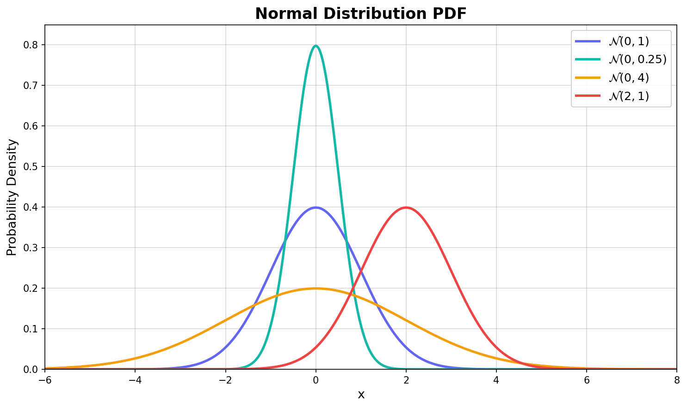
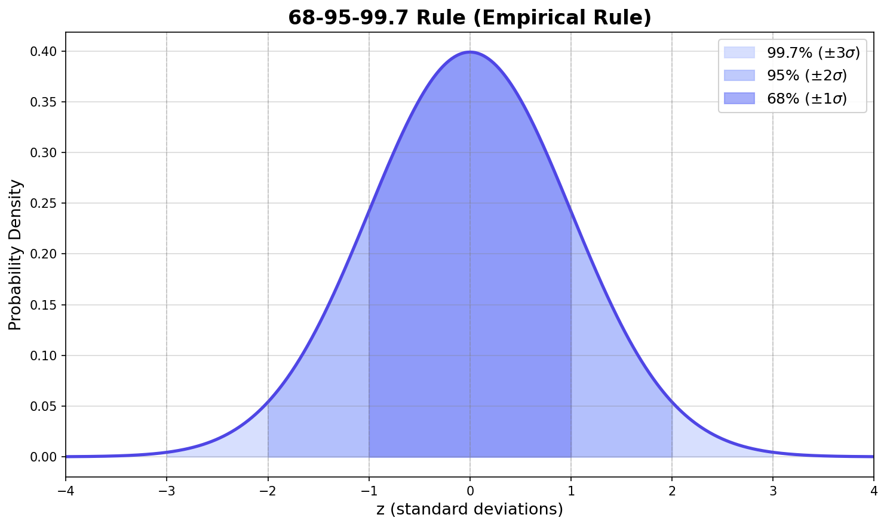
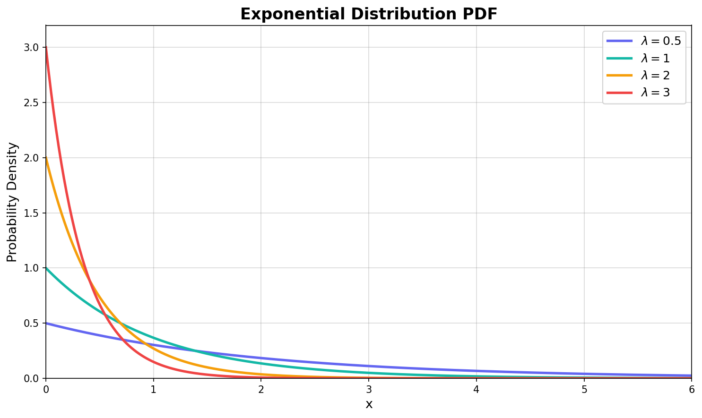
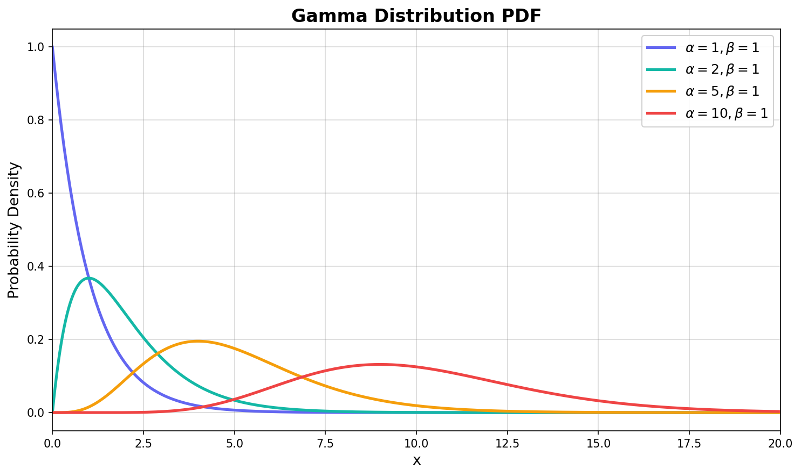
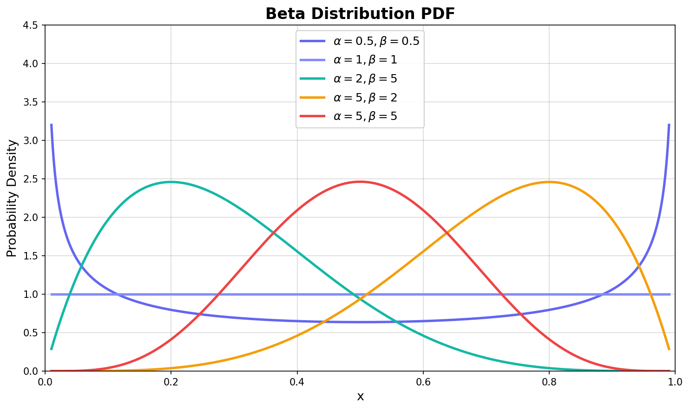
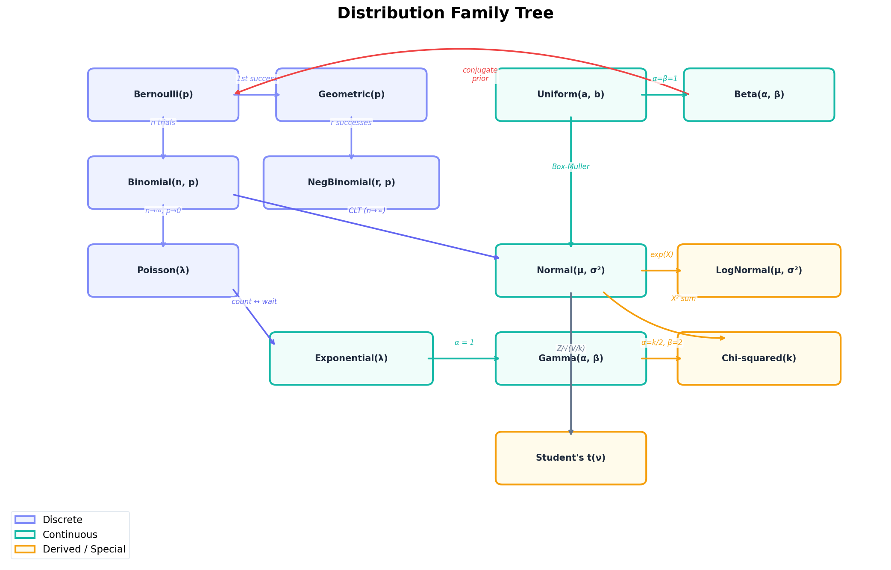

[이전 글](/stats/discrete-distributions/)에서 이산확률분포 — 베르누이, 이항, 포아송, 기하 — 를 다뤘다. 이산분포는 "몇 개"를 세는 세계였다. 동전 앞면 횟수, 하루 접속자 수, 첫 성공까지의 시행 횟수. 전부 정수값으로 떨어졌다.

그런데 현실의 데이터 대부분은 정수가 아니다. 사람의 키 172.3cm, 서버 응답 시간 0.347초, 주가 수익률 -2.14%. 이런 값들은 셀 수 없이 촘촘한 실수 위에 분포한다. 이것이 **연속확률분포**(Continuous Probability Distribution)의 영역이다.

이번 글에서는 ML에서 가장 핵심적인 분포인 정규분포를 중심으로, 실전에서 반드시 알아야 할 연속분포 5가지를 하나씩 쌓아올린다.

---

## 연속분포의 핵심: PDF와 적분

본격적으로 들어가기 전에, [확률변수와 기댓값](/stats/random-variables-expectation/) 글에서 다뤘던 핵심 개념을 짧게 복습하자.

이산분포에서는 PMF $P(X = x)$로 특정 값의 확률을 바로 구할 수 있었다. 하지만 연속분포에서는 $P(X = x) = 0$이다. 왜? 실수 직선 위의 "한 점"은 길이가 0이기 때문이다. 대신 **구간**에 대한 확률을 PDF(확률 밀도 함수)를 적분해서 구한다.

$$P(a \leq X \leq b) = \int_a^b f(x) \, dx$$

PDF $f(x)$는 확률 그 자체가 아니라 **밀도**다. 확률은 그 밀도를 구간 위에서 적분해야 나온다. 이 차이가 연속분포를 다루는 전체 사고방식을 결정한다.

:::info

**💡 참고**

PDF의 **두 가지 조건**: (1) 모든 $x$에 대해 $f(x) \geq 0$, (2) $\int_{-\infty}^{\infty} f(x) \, dx = 1$. 이산에서 PMF의 합이 1인 것과 같은 원리다.

:::

이제 가장 단순한 분포부터 시작해서, 점점 풍부한 구조를 가진 분포로 올라가보자.

---

## 균일 분포 Uniform(a, b)

### 가장 단순한 연속분포

**균일 분포**(Uniform Distribution)는 구간 $[a, b]$ 위에서 모든 값이 동일한 확률 밀도를 갖는 분포다. 어떤 값이 나올지에 대해 아무런 선호도 없는, 가장 "공평한" 분포라고 할 수 있다.

$$f(x) = \begin{cases} \frac{1}{b - a} & \text{if } a \leq x \leq b \\ 0 & \text{otherwise} \end{cases}$$

PDF가 상수이므로 그래프는 직사각형 형태다. 높이가 $\frac{1}{b-a}$이고, 구간 길이가 $(b-a)$이므로, 넓이는 정확히 1이 된다.

### 기댓값과 분산

$$E[X] = \frac{a + b}{2}, \quad \text{Var}(X) = \frac{(b - a)^2}{12}$$

기댓값은 구간의 정중앙이고, 분산은 구간 길이의 제곱을 12로 나눈 값이다. 직관적으로 당연한 결과 — 모든 값이 균등하니 평균은 한가운데에 놓인다.

### 왜 중요한가

균일 분포는 단순하지만, 그 역할은 결코 단순하지 않다.

- **난수 생성의 출발점**: 거의 모든 프로그래밍 언어의 `random()` 함수가 $\text{Uniform}(0, 1)$에서 난수를 뽑는다. 다른 모든 분포의 난수는 이 균일 난수를 변환해서 만든다 (뒤에서 다룰 Box-Muller 변환이 대표적).
- **무정보 사전분포(Uninformative Prior)**: 베이지안 추론에서 "아무 사전 정보가 없다"를 수학적으로 표현할 때 균일 분포를 사용한다.
- **셔플과 샘플링**: 데이터를 무작위로 섞거나, train/test를 나누는 모든 과정이 균일 분포에 기반한다.

```python
import numpy as np
from scipy import stats
import matplotlib.pyplot as plt

# Uniform(2, 8)
a, b = 2, 8
rv = stats.uniform(loc=a, scale=b - a)  # scipy: loc=a, scale=b-a

# 기본 통계량
print(f"E[X] = {rv.mean():.2f}")    # 5.00
print(f"Var(X) = {rv.var():.2f}")   # 3.00
print(f"Std(X) = {rv.std():.2f}")   # 1.73

# 구간 확률 계산: P(3 ≤ X ≤ 5)
prob = rv.cdf(5) - rv.cdf(3)
print(f"P(3 ≤ X ≤ 5) = {prob:.4f}")  # 0.3333 — 구간 길이/전체 길이
```

구간 확률이 단순히 **부분 길이 / 전체 길이**로 계산된다는 점이 균일 분포의 직관적인 매력이다.

---

## 정규 분포 Normal(μ, σ²)

### THE Distribution

통계학과 ML에서 가장 중요한 분포를 딱 하나만 고르라면, 누구든 **정규 분포**(Normal Distribution)를 꼽을 것이다. 가우시안 분포(Gaussian Distribution)라고도 불리며, 그 유명한 **종 모양**(bell curve)의 주인공이다.

$$f(x) = \frac{1}{\sigma\sqrt{2\pi}} \exp\left(-\frac{(x - \mu)^2}{2\sigma^2}\right)$$

두 개의 파라미터가 분포의 모든 것을 결정한다.
- <strong>$\mu$ (평균)</strong>: 종의 중심 위치. 분포를 좌우로 이동시킨다.
- <strong>$\sigma^2$ (분산)</strong>: 종의 폭. 클수록 넓게 퍼지고, 작을수록 뾰족해진다.

### 기댓값과 분산

$$E[X] = \mu, \quad \text{Var}(X) = \sigma^2$$

파라미터 이름 그대로다. 이렇게 깔끔한 대응은 정규 분포만의 특권이라 할 수 있다.

### 파라미터에 따른 형태 변화

$\mu$와 $\sigma^2$이 달라지면 PDF가 어떻게 변하는지 시각적으로 확인해보자.


<p align="center" style="color: #888; font-size: 13px;"><em>μ는 분포의 위치를, σ²는 폭을 결정한다. σ²가 작을수록 평균 근처에 밀집된다.</em></p>

```python
from scipy import stats
import numpy as np

# 다양한 정규분포 비교
configs = [
    (0, 1, 'Standard Normal'),
    (0, 0.5, 'Narrow (σ²=0.25)'),
    (0, 2, 'Wide (σ²=4)'),
    (2, 1, 'Shifted (μ=2)'),
]

for mu, sigma, name in configs:
    rv = stats.norm(loc=mu, scale=sigma)
    print(f"{name}: E[X]={rv.mean():.1f}, Var={rv.var():.2f}, "
          f"P(-1≤X≤1)={rv.cdf(1)-rv.cdf(-1):.4f}")
```

$\sigma^2 = 0.25$ (좁은 분포)일 때 $P(-1 \leq X \leq 1)$이 가장 크다는 점에 주목하자. 분산이 작으면 값들이 평균 근처에 집중되기 때문이다.

### 68-95-99.7 법칙

정규 분포에서 가장 많이 인용되는 성질이다. **경험적 법칙**(Empirical Rule)이라고도 한다.

$$P(\mu - k\sigma \leq X \leq \mu + k\sigma) = \begin{cases} 0.6827 & k = 1 \\ 0.9545 & k = 2 \\ 0.9973 & k = 3 \end{cases}$$


<p align="center" style="color: #888; font-size: 13px;"><em>데이터의 68%가 ±1σ 이내, 95%가 ±2σ 이내, 99.7%가 ±3σ 이내에 놓인다.</em></p>

이 법칙이 실전에서 활용되는 대표적인 사례가 [이상 탐지(Anomaly Detection)](/ml/anomaly-detection/)다. 관측값이 평균에서 $3\sigma$ 이상 벗어나면, 전체의 0.3%도 안 되는 극단값이므로 이상치로 판단하는 것이다.

```python
from scipy import stats

rv = stats.norm(0, 1)

# 68-95-99.7 검증
for k in [1, 2, 3]:
    prob = rv.cdf(k) - rv.cdf(-k)
    print(f"P(|Z| ≤ {k}) = {prob:.4f} ({prob*100:.2f}%)")
# P(|Z| ≤ 1) = 0.6827 (68.27%)
# P(|Z| ≤ 2) = 0.9545 (95.45%)
# P(|Z| ≤ 3) = 0.9973 (99.73%)
```

### 표준정규분포와 Z 변환

임의의 정규분포 $X \sim \mathcal{N}(\mu, \sigma^2)$를 평균 0, 분산 1인 **표준정규분포**로 변환하는 과정을 **표준화(Standardization)** 또는 **Z 변환**이라 한다.

$$Z = \frac{X - \mu}{\sigma} \sim \mathcal{N}(0, 1)$$

이 변환이 중요한 이유는 세 가지다.

1. **비교 가능**: 서로 다른 단위, 다른 스케일의 데이터를 같은 기준으로 비교할 수 있다.
2. **확률표 통일**: 모든 정규분포의 확률을 하나의 표준정규분포 표로 계산할 수 있다.
3. **ML의 표준 전처리**: `StandardScaler`가 바로 이 Z 변환이다.

```python
import numpy as np

# 시험 점수: 평균 70, 표준편차 10
scores = np.array([85, 92, 78, 65, 55])

# Z 변환 (StandardScaler와 동일한 연산)
mu, sigma = scores.mean(), scores.std()
z_scores = (scores - mu) / sigma
print(f"원점수: {scores}")
print(f"Z 점수: {z_scores.round(3)}")
# 양수면 평균 이상, 음수면 평균 이하
```

### 왜 ML에서 기본 가정인가

정규 분포가 ML의 기본 가정이 된 데에는 깊은 이유가 있다.

- **[선형 회귀]**(/ml/linear-regression/)는 잔차(residual)가 정규 분포를 따른다고 가정한다: $\epsilon \sim \mathcal{N}(0, \sigma^2)$.
- **[이상 탐지]**(/ml/anomaly-detection/)는 데이터가 가우시안 분포를 따른다고 가정하고, 밀도가 낮은 영역을 이상치로 판단한다.
- **[PCA]**(/ml/pca/)는 데이터가 가우시안일 때 공분산 행렬의 고유벡터가 최적의 축이 된다.

가장 근본적인 이유는 **중심극한정리**(CLT)다 — 어떤 분포든 충분히 많이 더하면 정규 분포에 수렴한다. 이 강력한 정리는 [다음 글](/stats/lln-and-clt/)에서 자세히 다룬다.

:::warning

**⚠️ 주의**

"데이터가 정규 분포를 따른다"는 가정은 강력하지만 위험하기도 하다. 소득 분포, 주가 수익률, 네트워크 트래픽처럼 **두꺼운 꼬리**(heavy tail)를 가진 데이터에 정규 분포를 무작정 적용하면 극단값의 확률을 심각하게 과소평가하게 된다.

:::

---

## 지수 분포 Exponential(λ)

### 포아송 과정의 대기 시간

[이전 글](/stats/discrete-distributions/)에서 포아송 분포가 "단위 시간 동안 발생하는 사건의 **횟수**"를 모델링한다고 배웠다. 그렇다면 자연스럽게 이런 질문이 따라온다 — 사건과 사건 사이의 **대기 시간**은 어떤 분포를 따를까?

그 답이 바로 **지수 분포**(Exponential Distribution)다. 포아송 분포의 이산적 짝꿍이 기하 분포였다면, 연속적 짝꿍이 지수 분포다.

$$f(x) = \lambda e^{-\lambda x}, \quad x \geq 0$$

여기서 $\lambda > 0$는 **사건 발생률**(rate)이다. $\lambda$가 크면 사건이 자주 발생하므로 대기 시간이 짧고, $\lambda$가 작으면 대기 시간이 길다.

### 기댓값과 분산

$$E[X] = \frac{1}{\lambda}, \quad \text{Var}(X) = \frac{1}{\lambda^2}$$

평균 대기 시간이 발생률의 역수라는 점이 직관적이다. 시간당 2번 서버 장애가 발생한다면($\lambda = 2$), 평균 대기 시간은 0.5시간(30분)이다.

### 파라미터에 따른 형태


<p align="center" style="color: #888; font-size: 13px;"><em>λ가 클수록 0 근처에 밀집되고 빠르게 감소한다. 사건이 자주 발생할수록 짧은 대기 시간이 압도적으로 많다.</em></p>

### 무기억성 (Memoryless Property)

지수 분포의 가장 독특한 성질이자, 연속분포 중에서 지수 분포**만** 가지는 특성이다.

$$P(X > s + t \mid X > s) = P(X > t)$$

풀어서 말하면: "이미 $s$시간 동안 사건이 안 일어났다고 해서, 앞으로 $t$시간 안에 일어날 확률이 달라지지 않는다." 콜센터에서 10분 넘게 대기했다고 해서 다음 1분 안에 연결될 확률이 높아지지 않는다는 뜻이다.

:::info

**💡 참고**

이산분포에서 무기억성을 가진 분포는 **기하 분포**뿐이었다. 지수 분포는 기하 분포의 연속 버전이라고 할 수 있다. 둘 다 포아송 과정에서 파생되며, 둘 다 무기억성을 가진다.

:::

### 포아송-지수 연결

포아송 분포와 지수 분포는 동전의 양면이다.

- **포아송**: 고정된 시간 구간에서 사건 **횟수** → $X \sim \text{Poisson}(\lambda t)$
- **지수**: 사건 간 **대기 시간** → $T \sim \text{Exp}(\lambda)$

```python
from scipy import stats
import numpy as np

lam = 3  # 시간당 평균 3건 발생

# 포아송: 1시간 동안 사건 횟수 시뮬레이션
rng = np.random.default_rng(42)
counts = rng.poisson(lam, size=10000)
print(f"포아송 평균 횟수: {counts.mean():.3f}")  # ≈ 3.0

# 지수: 사건 간 대기 시간 시뮬레이션
wait_times = rng.exponential(1/lam, size=10000)
print(f"지수 평균 대기시간: {wait_times.mean():.3f}시간")  # ≈ 0.333

# 검증: 대기 시간 < 0.5시간일 확률
rv = stats.expon(scale=1/lam)
print(f"P(T < 0.5) = {rv.cdf(0.5):.4f}")  # 0.7769

# 무기억성 검증
p_fresh = 1 - rv.cdf(0.2)          # P(T > 0.2)
p_conditional = (1 - rv.cdf(0.7)) / (1 - rv.cdf(0.5))  # P(T > 0.7 | T > 0.5)
print(f"P(T > 0.2) = {p_fresh:.6f}")
print(f"P(T > 0.7 | T > 0.5) = {p_conditional:.6f}")
# 두 값이 같다 — 무기억성!
```

---

## 감마 분포 Gamma(α, β)

### 지수 분포의 일반화

지수 분포가 "첫 번째 사건까지의 대기 시간"이라면, **감마 분포**(Gamma Distribution)는 "$\alpha$번째 사건까지의 대기 시간"이다. 지수 분포는 감마 분포에서 $\alpha = 1$인 특수한 경우에 해당한다.

$$f(x) = \frac{x^{\alpha-1} e^{-x/\beta}}{\beta^\alpha \, \Gamma(\alpha)}, \quad x > 0$$

여기서 $\Gamma(\alpha)$는 **감마 함수**로, 계승(factorial)의 연속적 확장이다: 양의 정수 $n$에 대해 $\Gamma(n) = (n-1)!$. 예를 들어 $\Gamma(5) = 4! = 24$.

두 파라미터의 역할이 명확하다.
- <strong>$\alpha$ (형태 파라미터, shape)</strong>: 분포의 형태를 결정. $\alpha = 1$이면 지수 분포, $\alpha$가 커지면 점점 종 모양에 가까워진다.
- <strong>$\beta$ (척도 파라미터, scale)</strong>: 분포의 스케일을 결정. 가로축을 늘리거나 줄인다.

### 기댓값과 분산

$$E[X] = \alpha\beta, \quad \text{Var}(X) = \alpha\beta^2$$

### α에 따른 형태 변화


<p align="center" style="color: #888; font-size: 13px;"><em>α=1일 때 지수 분포 형태에서, α가 커질수록 대칭적인 종 모양으로 변해간다.</em></p>

$\alpha$가 커질수록 분포의 최빈값(mode)이 오른쪽으로 이동하면서 점점 정규 분포와 비슷한 모양이 된다는 점을 주목하자. 실제로 $\alpha$가 충분히 크면 감마 분포는 정규 분포에 근사한다.

### 카이제곱 분포와의 관계

통계학에서 자주 등장하는 **카이제곱 분포(Chi-squared Distribution)** $\chi^2(k)$는 사실 감마 분포의 특수한 경우다.

$$\chi^2(k) = \text{Gamma}\left(\frac{k}{2}, 2\right)$$

카이제곱 분포는 $k$개의 독립적인 표준정규 확률변수의 제곱합이다: $Z_1^2 + Z_2^2 + \cdots + Z_k^2 \sim \chi^2(k)$. 가설 검정, 적합도 검정, 분산 분석에서 핵심 역할을 한다.

```python
from scipy import stats
import numpy as np

# 감마 분포 vs 지수 분포
alpha, beta = 1, 2
gamma_rv = stats.gamma(a=alpha, scale=beta)
exp_rv = stats.expon(scale=beta)

# alpha=1일 때 감마 = 지수
x = np.linspace(0, 10, 100)
assert np.allclose(gamma_rv.pdf(x), exp_rv.pdf(x)), "Gamma(1,β) == Exp(1/β)"
print("✓ Gamma(1, β) = Exponential(1/β) 확인!")

# 감마 분포의 기본 통계량
for alpha in [1, 2, 5, 10]:
    rv = stats.gamma(a=alpha, scale=1)
    print(f"Gamma(α={alpha:2d}, β=1): E[X]={rv.mean():.1f}, "
          f"Var={rv.var():.1f}, Mode={max(0, alpha-1):.1f}")

# 카이제곱과 감마의 관계
k = 6
chi2_rv = stats.chi2(df=k)
gamma_equiv = stats.gamma(a=k/2, scale=2)
x = np.linspace(0, 20, 100)
assert np.allclose(chi2_rv.pdf(x), gamma_equiv.pdf(x))
print(f"✓ χ²({k}) = Gamma({k/2}, 2) 확인!")
```

:::tip

**✅ 팁**

scipy에서 감마 분포의 파라미터 이름에 주의하자. `stats.gamma(a=α, scale=β)`에서 `a`가 형태 파라미터 α이고, `scale`이 척도 파라미터 β다. 일부 교재에서는 rate 파라미터 λ = 1/β를 사용하므로, 어떤 파라미터화(parameterization)를 쓰는지 항상 확인해야 한다.

:::

---

## 베타 분포 Beta(α, β)

### 확률의 확률을 모델링하다

앞서 다룬 분포들은 전부 값의 범위가 $[0, \infty)$이거나 $(-\infty, \infty)$였다. **베타 분포**(Beta Distribution)는 $[0, 1]$ 구간에서만 정의되는, 독특한 위치의 분포다.

$$f(x) = \frac{\Gamma(\alpha + \beta)}{\Gamma(\alpha)\Gamma(\beta)} x^{\alpha-1}(1-x)^{\beta-1}, \quad 0 \leq x \leq 1$$

$[0, 1]$ 구간이라는 것은 곧 **확률값이나 비율**을 모델링하기에 완벽한 분포라는 의미다. 클릭률(CTR), 전환율, 합격률처럼 0과 1 사이의 값을 다룰 때 베타 분포가 등장한다.

### 기댓값과 분산

$$E[X] = \frac{\alpha}{\alpha + \beta}, \quad \text{Var}(X) = \frac{\alpha\beta}{(\alpha + \beta)^2(\alpha + \beta + 1)}$$

기댓값이 $\frac{\alpha}{\alpha + \beta}$라는 점에서, $\alpha$를 "성공 횟수", $\beta$를 "실패 횟수"로 해석할 수 있다. 성공이 많을수록 기댓값이 1에 가까워지고, 실패가 많을수록 0에 가까워진다.

### α, β에 따른 형태 변화

베타 분포의 가장 매력적인 특성은 두 파라미터의 조합에 따라 놀랍도록 다양한 형태를 만들어낸다는 점이다.


<p align="center" style="color: #888; font-size: 13px;"><em>α, β 값에 따라 U자, 균일, 왼쪽 집중, 오른쪽 집중, 대칭 종 모양까지 모든 형태를 만들 수 있다.</em></p>

| α, β 조합 | 형태 | 해석 |
|-----------|------|------|
| α = β = 0.5 | U자형 | 극단값(0 또는 1 근처)에 집중 |
| α = β = 1 | 균일 분포 | 아무 정보 없음 (= Uniform(0,1)) |
| α < β | 왼쪽 집중 (right-skewed) | 질량이 0 근처에 몰리고, 오른쪽 꼬리가 길다 |
| α > β | 오른쪽 집중 (left-skewed) | 질량이 1 근처에 몰리고, 왼쪽 꼬리가 길다 |
| α = β > 1 | 대칭 종 모양 | 0.5 근처에 집중 |

### 베이지안의 핵심: 켤레 사전분포

베타 분포가 ML과 통계학에서 특별한 위치를 차지하는 가장 큰 이유는 **켤레 사전분포(Conjugate Prior)** 역할 때문이다.

베르누이/이항 분포의 파라미터 $p$에 대해 베타 분포를 사전분포로 사용하면, 데이터를 관측한 후의 사후분포도 여전히 베타 분포가 된다.

$$\text{Prior: } p \sim \text{Beta}(\alpha, \beta) \quad \xrightarrow{\text{데이터: } s\text{번 성공, } f\text{번 실패}} \quad \text{Posterior: } p \sim \text{Beta}(\alpha + s, \beta + f)$$

사전분포와 사후분포가 같은 "가족"에 속하므로 계산이 깔끔하고, 데이터가 들어올 때마다 파라미터만 갱신하면 된다.

```python
from scipy import stats
import numpy as np

# A/B 테스트 시나리오: 새 버튼의 클릭률을 추정
# 사전 지식: 기존 CTR ≈ 5%, 약한 확신 → Beta(2, 38)
alpha_prior, beta_prior = 2, 38

# 데이터: 200명 중 15명 클릭
successes, failures = 15, 185

# 사후분포: Beta(2+15, 38+185) = Beta(17, 223)
alpha_post = alpha_prior + successes
beta_post = beta_prior + failures

prior = stats.beta(alpha_prior, beta_prior)
posterior = stats.beta(alpha_post, beta_post)

print(f"사전분포 E[p] = {prior.mean():.4f}")      # 0.0500
print(f"사후분포 E[p] = {posterior.mean():.4f}")    # 0.0708
print(f"95% 신용구간: [{posterior.ppf(0.025):.4f}, {posterior.ppf(0.975):.4f}]")
# 데이터가 사전 믿음(5%)을 7.1%로 업데이트했다
```

:::info

**💡 참고**

$\alpha + \beta$의 크기가 "확신의 강도"를 나타낸다. $\text{Beta}(2, 38)$은 총 40번의 가상 시행에 기반한 약한 사전 지식이고, 데이터 200개가 추가되면 사후분포의 $\alpha + \beta = 240$으로, 데이터의 영향이 사전분포를 압도한다.

:::

---

## 5대 연속분포 비교 총정리

지금까지 다룬 5가지 분포를 한눈에 비교해보자.

| 분포 | 파라미터 | 정의역 | PDF | E[X] | Var(X) | 핵심 용도 |
|------|---------|--------|-----|------|--------|----------|
| **Uniform(a,b)** | a, b | [a, b] | $\frac{1}{b-a}$ | $\frac{a+b}{2}$ | $\frac{(b-a)^2}{12}$ | 난수 생성, 무정보 사전분포 |
| **Normal(μ,σ²)** | μ, σ² | (−∞, ∞) | $\frac{1}{\sigma\sqrt{2\pi}}e^{-\frac{(x-\mu)^2}{2\sigma^2}}$ | μ | σ² | ML 기본 가정, CLT |
| **Exp(λ)** | λ | [0, ∞) | $\lambda e^{-\lambda x}$ | $\frac{1}{\lambda}$ | $\frac{1}{\lambda^2}$ | 대기 시간, 무기억성 |
| **Gamma(α,β)** | α, β | (0, ∞) | $\frac{x^{\alpha-1}e^{-x/\beta}}{\beta^\alpha\Gamma(\alpha)}$ | αβ | αβ² | 지수 일반화, χ² |
| **Beta(α,β)** | α, β | [0, 1] | $\frac{x^{\alpha-1}(1-x)^{\beta-1}}{B(\alpha,\beta)}$ | $\frac{\alpha}{\alpha+\beta}$ | $\frac{\alpha\beta}{(\alpha+\beta)^2(\alpha+\beta+1)}$ | 확률 모델링, 켤레 사전분포 |

```python
from scipy import stats

# 5대 분포 한 번에 비교
distributions = {
    'Uniform(0,1)':    stats.uniform(0, 1),
    'Normal(0,1)':     stats.norm(0, 1),
    'Exp(1)':          stats.expon(scale=1),
    'Gamma(3,2)':      stats.gamma(a=3, scale=2),
    'Beta(2,5)':       stats.beta(2, 5),
}

print(f"{'분포':<16} {'E[X]':>8} {'Var(X)':>10} {'Skew':>8} {'Kurt':>8}")
print("-" * 54)
for name, rv in distributions.items():
    print(f"{name:<16} {rv.mean():>8.4f} {rv.var():>10.4f} "
          f"{rv.stats(moments='s')[0]:>8.4f} {rv.stats(moments='k')[0]:>8.4f}")
```

---

## 분포 간 관계: 패밀리 트리

지금까지 개별 분포를 하나씩 살펴봤다. 하지만 이 분포들은 고립된 존재가 아니다. 서로 특수한 경우이거나, 극한에서 수렴하거나, 짝을 이루는 관계로 연결되어 있다. 이산분포까지 포함한 전체 관계도를 그려보자.


<p align="center" style="color: #888; font-size: 13px;"><em>이산분포(보라)와 연속분포(초록), 파생분포(노랑)의 관계. 화살표는 특수 경우나 극한 관계를 나타낸다.</em></p>

주요 연결 관계를 정리하면 이렇다.

### 이산 → 연속 연결

| 관계 | 설명 |
|------|------|
| Binomial → Normal | $n$이 충분히 크면 이항분포가 정규분포에 수렴 (CLT) |
| Poisson ↔ Exponential | 포아송 = 횟수, 지수 = 대기 시간 (동전의 양면) |
| Geometric → Exponential | 기하분포의 연속 버전이 지수분포 |
| Bernoulli ↔ Beta | 베타 = 베르누이 파라미터 $p$의 켤레 사전분포 |

### 연속 → 연속 연결

| 관계 | 설명 |
|------|------|
| Exponential → Gamma | 지수는 Gamma(1, β)의 특수 경우 |
| Gamma → Chi-squared | 카이제곱은 Gamma(k/2, 2)의 특수 경우 |
| Uniform → Normal | Box-Muller 변환으로 균일에서 정규 생성 |
| Uniform → Beta | Uniform(0,1) = Beta(1,1) |
| Normal → LogNormal | $X \sim \mathcal{N}$이면 $e^X \sim \text{LogNormal}$ |
| Normal, Chi-sq → Student's t | $\frac{Z}{\sqrt{V/k}}$, $Z \sim \mathcal{N}(0,1)$, $V \sim \chi^2(k)$ |

```python
from scipy import stats
import numpy as np

# 관계 검증 1: Uniform(0,1) == Beta(1,1)
x = np.linspace(0, 1, 100)
assert np.allclose(stats.uniform.pdf(x), stats.beta.pdf(x, 1, 1))
print("✓ Uniform(0,1) = Beta(1,1)")

# 관계 검증 2: Exponential(λ) == Gamma(1, 1/λ)
lam = 3.0
x = np.linspace(0, 5, 100)
exp_pdf = stats.expon.pdf(x, scale=1/lam)
gamma_pdf = stats.gamma.pdf(x, a=1, scale=1/lam)
assert np.allclose(exp_pdf, gamma_pdf)
print("✓ Exp(λ) = Gamma(1, 1/λ)")

# 관계 검증 3: Binomial → Normal (CLT)
n = 1000
p = 0.3
binom_rv = stats.binom(n, p)
normal_approx = stats.norm(n*p, np.sqrt(n*p*(1-p)))

# 두 CDF가 거의 일치
x_test = np.arange(250, 350)
max_diff = np.max(np.abs(binom_rv.cdf(x_test) - normal_approx.cdf(x_test)))
print(f"✓ Binom(1000, 0.3) vs Normal 근사: CDF 최대 차이 = {max_diff:.6f}")
```

이 패밀리 트리를 머릿속에 그려두면, 새로운 분포를 만났을 때 "이건 어디서 파생된 건가?"라는 질문으로 빠르게 이해할 수 있다.

:::info

**💡 참고**

위 관계도에서 가장 중요한 연결 두 가지를 꼽자면: (1) **Poisson ↔ Exponential** — 같은 현상의 이산/연속 관점, (2) **Binomial → Normal (CLT)** — 이산분포가 충분히 반복되면 연속분포로 수렴한다는 대정리. 이 두 연결을 이해하면 나머지는 자연스럽게 따라온다.

:::

---

## 정규 분포의 특별한 위치

### 어디서나 정규를 가정하는 이유

이 글에서 다룬 5가지 분포 중에서도 정규 분포는 유독 특별한 위치에 있다. 왜 이렇게 어디서나 등장하는 걸까?

핵심 답은 **중심극한정리**(Central Limit Theorem)다.

> 어떤 분포를 따르든, 독립적인 확률변수를 충분히 많이 더하면 그 합의 분포는 정규 분포에 수렴한다.

사람의 키는 유전, 영양, 환경, 운동 등 수많은 독립적 요인의 합으로 결정된다. 각 요인이 어떤 분포를 따르든, 그 합산 결과는 정규 분포에 가까워진다. 이것이 자연계에서 정규 분포가 흔한 근본적 이유다.

CLT의 수학적 증명과 시뮬레이션은 [다음 글: 큰 수의 법칙과 중심극한정리](/stats/lln-and-clt/)에서 본격적으로 다룬다.

### Box-Muller 변환: 균일에서 정규로

앞서 균일 분포가 "모든 난수의 출발점"이라고 했다. 균일 분포에서 정규 분포 난수를 만드는 고전적인 방법이 **Box-Muller 변환**이다.

두 개의 독립적인 균일 난수 $U_1, U_2 \sim \text{Uniform}(0, 1)$로부터 두 개의 독립적인 표준정규 난수를 생성한다.

$$Z_0 = \sqrt{-2 \ln U_1} \cos(2\pi U_2)$$
$$Z_1 = \sqrt{-2 \ln U_1} \sin(2\pi U_2)$$

```python
import numpy as np
from scipy import stats

def box_muller(n, seed=42):
    """균일 난수 → 정규 난수 (Box-Muller Transform)"""
    rng = np.random.default_rng(seed)
    u1 = rng.uniform(0, 1, size=n)
    u2 = rng.uniform(0, 1, size=n)

    z0 = np.sqrt(-2 * np.log(u1)) * np.cos(2 * np.pi * u2)
    z1 = np.sqrt(-2 * np.log(u1)) * np.sin(2 * np.pi * u2)
    return z0, z1

# 10만 개 정규 난수 생성
z0, z1 = box_muller(100_000)

# 정규 분포인지 검증
print(f"z0: mean={z0.mean():.4f}, std={z0.std():.4f}")  # ≈ 0, 1
print(f"z1: mean={z1.mean():.4f}, std={z1.std():.4f}")  # ≈ 0, 1

# Shapiro-Wilk 정규성 검정 (샘플 5000개)
stat, p_value = stats.shapiro(z0[:5000])
print(f"Shapiro-Wilk p-value: {p_value:.4f}")  # >> 0.05: 정규 분포!
```

균일 분포라는 가장 단순한 분포에서 출발해, 로그와 삼각함수라는 비선형 변환을 거쳐 정규 분포가 탄생한다. 수학의 우아함이 빛나는 순간이다.

왜 이 변환이 동작하는가? $U_1$에 $-\ln$을 취하면 지수 분포가 되고, $\sqrt{2 \cdot (\cdot)}$를 적용하면 Rayleigh 분포가 된다. 여기에 $U_2$에서 나온 균일한 각도 $\theta = 2\pi U_2$를 결합하면, 2차원 표준정규 분포의 극좌표 표현과 정확히 일치한다. 이것이 Box-Muller의 핵심 아이디어다.

:::tip

**✅ 팁**

실제로 NumPy의 `np.random.normal()`은 Box-Muller 변환의 개선 버전인 **Ziggurat 알고리즘**을 사용한다. 원리는 같지만 삼각함수 연산을 피해 더 빠르다.

:::

---

## scipy.stats 치트시트

이 글에서 사용한 scipy.stats API를 정리해두면 나중에 분포를 다룰 때 편리하다.

```python
from scipy import stats

# 1. 분포 객체 생성
rv = stats.norm(loc=0, scale=1)      # Normal(0, 1)
rv = stats.expon(scale=1/lam)        # Exponential(λ) — scale = 1/λ
rv = stats.gamma(a=alpha, scale=beta) # Gamma(α, β)
rv = stats.beta(a=alpha, b=beta)     # Beta(α, β)
rv = stats.uniform(loc=a, scale=b-a) # Uniform(a, b)

# 2. 공통 메서드
rv.pdf(x)         # 확률 밀도 함수
rv.cdf(x)         # 누적 분포 함수 P(X ≤ x)
rv.ppf(q)         # 역 CDF (분위수 함수)
rv.mean()         # 기댓값
rv.var()          # 분산
rv.std()          # 표준편차
rv.interval(0.95) # 95% 구간 (대칭)
rv.rvs(size=n)    # n개 난수 생성

# 3. 확률 계산 패턴
P_interval = rv.cdf(b) - rv.cdf(a)   # P(a ≤ X ≤ b)
P_tail = 1 - rv.cdf(x)               # P(X > x) — 상위 꼬리
x_95 = rv.ppf(0.95)                   # 상위 5% 시작점
```

:::warning

**⚠️ 주의**

scipy의 파라미터 이름은 교재와 다를 수 있다. 특히 지수 분포에서 `scale = 1/λ`이고, 감마 분포에서 `a = α`인 점을 매번 확인해야 한다. 잘못된 파라미터화는 결과를 완전히 뒤집는다.

:::

---

## 마치며

:::summary

**📌 핵심 요약**

- **균일 분포**: 모든 값이 동등. 난수 생성의 출발점이자 무정보 사전분포.
- **정규 분포**: ML의 기본 가정. 68-95-99.7 법칙, Z 변환, CLT의 귀결.
- **지수 분포**: 포아송 과정의 대기 시간. 유일한 연속 무기억 분포.
- **감마 분포**: 지수의 일반화. α번째 사건 대기. 카이제곱 분포의 모체.
- **베타 분포**: [0,1] 구간의 만능 분포. 베이지안 켤레 사전분포의 핵심.
- 분포들은 고립되지 않고 **패밀리 트리**로 연결된다. 특수 경우, 극한 수렴, 켤레 관계를 이해하면 새로운 분포도 빠르게 파악할 수 있다.

:::

이산분포에서 연속분포까지, 확률분포의 핵심 레퍼토리를 완성했다. 하지만 하나의 근본적인 질문이 남아 있다 — **왜 어디서나 정규 분포가 나타나는가?**

[다음 글](/stats/lln-and-clt/)에서는 큰 수의 법칙(LLN)과 중심극한정리(CLT)를 통해 이 질문에 정면으로 답한다. 독립적인 확률변수의 평균이 "자동으로" 정규 분포에 수렴하는 메커니즘을 수학과 시뮬레이션으로 확인할 것이다.

---

## References

- Blitzstein, J. K., & Hwang, J. (2019). *Introduction to Probability* (2nd ed.), Chapters 5-7. Harvard Stat 110.
- Wasserman, L. (2004). *All of Statistics*, Chapters 2-3. Springer.
- scipy.stats documentation: [https://docs.scipy.org/doc/scipy/reference/stats.html](https://docs.scipy.org/doc/scipy/reference/stats.html)
