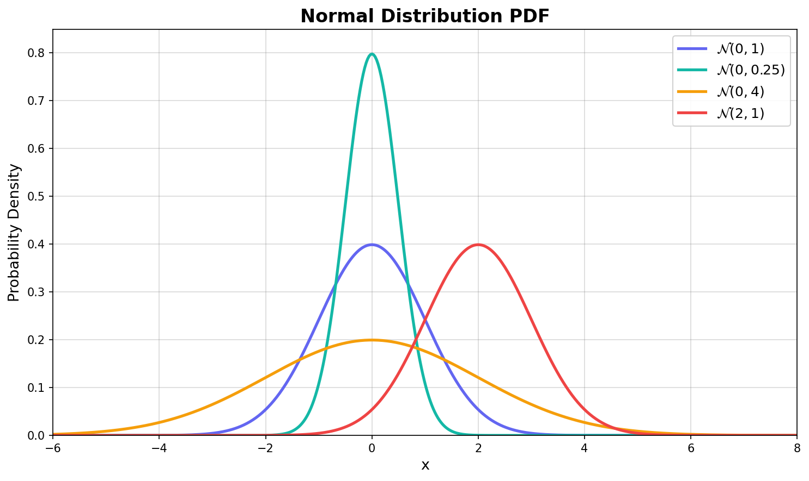
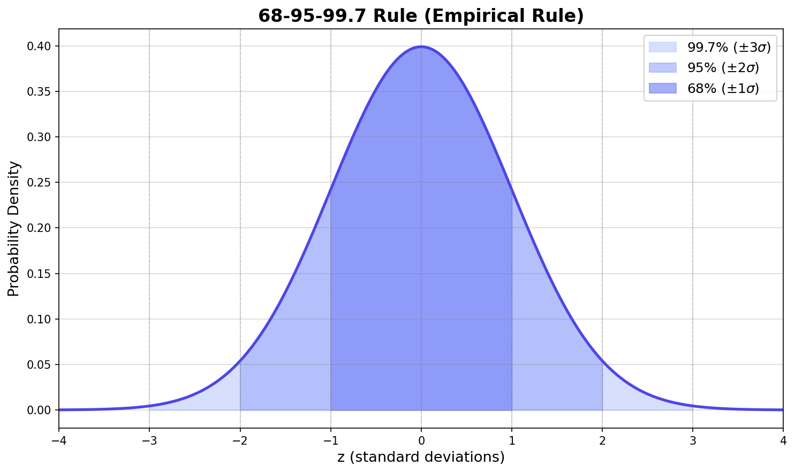
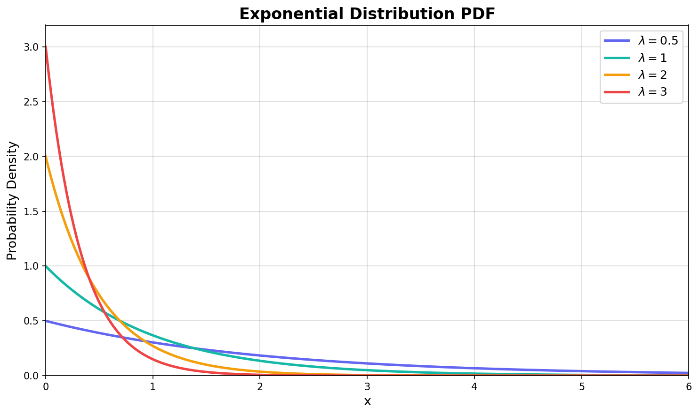
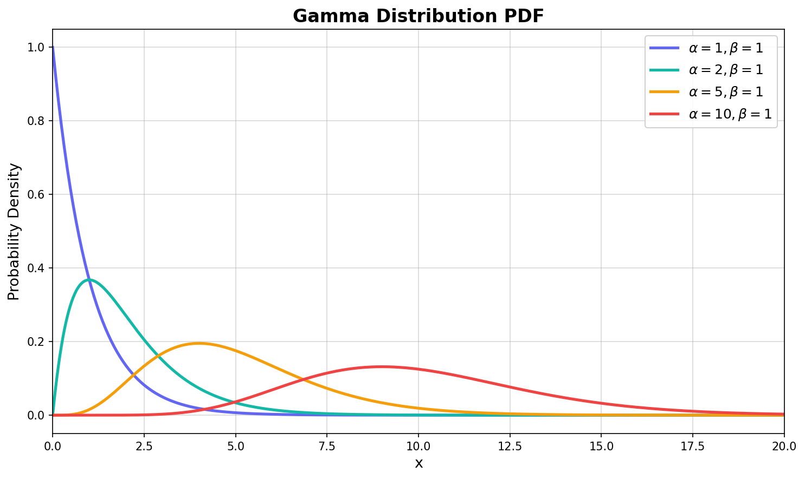
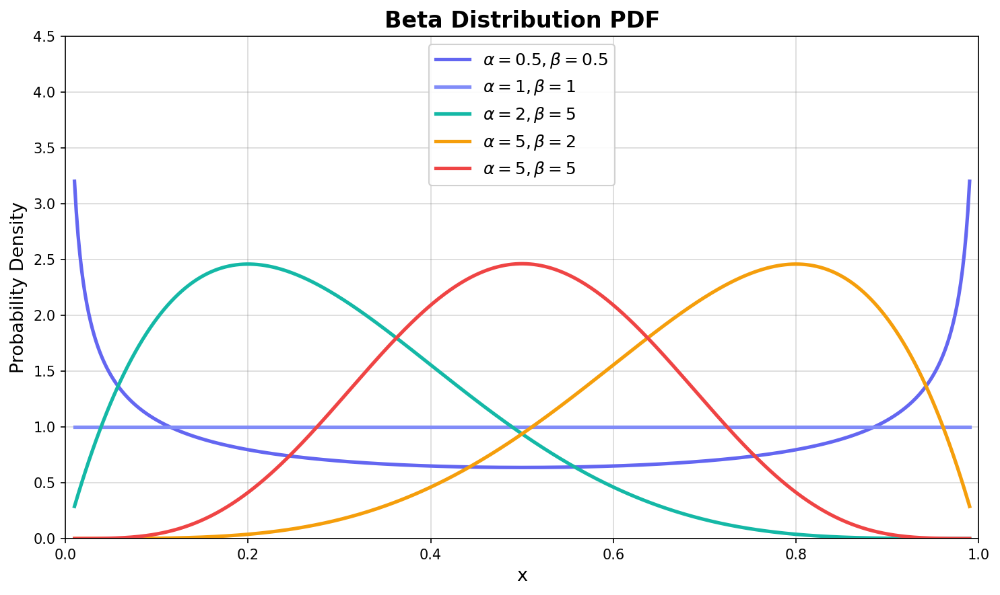
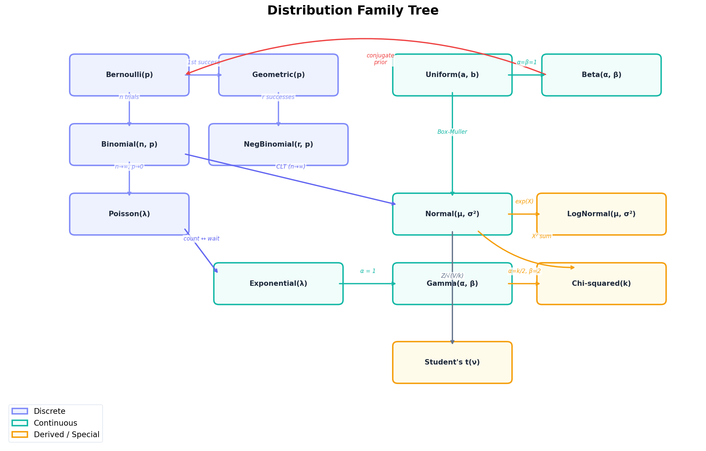

사람의 키 172.3cm, 서버 응답 시간 0.347초, 주가 수익률 -2.14%. 현실의 데이터 대부분은 정수로 떨어지지 않고 셀 수 없이 촘촘한 실수 위에 놓인다. 이것이 **연속확률분포**(Continuous Probability Distribution)의 영역이다. 이 글에서는 ML에서 가장 핵심적인 정규분포를 중심으로 연속분포 다섯 가지와 그 사이의 관계를 정리한다.

## 연속분포의 핵심: PDF와 적분

이산분포에서는 PMF $P(X = x)$로 특정 값의 확률을 바로 구할 수 있었다. 하지만 연속분포에서는 $P(X = x) = 0$이다. 실수 직선 위의 한 점은 길이가 0이기 때문이다. 대신 **구간**에 대한 확률을 PDF(확률 밀도 함수)로 적분해서 구한다.

$$P(a \leq X \leq b) = \int_a^b f(x) \, dx$$

PDF $f(x)$는 확률 그 자체가 아니라 **밀도**다. 확률은 그 밀도를 구간 위에서 적분해야 나온다. 이 차이가 연속분포를 다루는 전체 사고방식을 결정한다. PDF가 만족해야 할 조건은 두 가지로, 모든 $x$에 대해 $f(x) \geq 0$이고 $\int_{-\infty}^{\infty} f(x) \, dx = 1$이어야 한다. 이산에서 PMF의 합이 1인 것과 같은 원리다.

## 균일 분포 Uniform(a, b)

### 정의

**균일 분포**(Uniform Distribution)는 구간 $[a, b]$ 위에서 모든 값이 동일한 확률 밀도를 갖는 분포다.

$$f(x) = \begin{cases} \frac{1}{b - a} & \text{if } a \leq x \leq b \\ 0 & \text{otherwise} \end{cases}$$

PDF가 상수이므로 그래프는 직사각형 형태다. 높이가 $\frac{1}{b-a}$이고 구간 길이가 $(b-a)$이므로 넓이는 정확히 1이 된다.

### 기댓값과 분산

$$E[X] = \frac{a + b}{2}, \quad \text{Var}(X) = \frac{(b - a)^2}{12}$$

### 왜 중요한가

균일 분포는 단순하지만 그 역할은 단순하지 않다.

- **난수 생성의 출발점**: 거의 모든 프로그래밍 언어의 `random()` 함수가 $\text{Uniform}(0, 1)$에서 난수를 뽑는다. 다른 모든 분포의 난수는 이 균일 난수를 변환해서 만든다(뒤에서 다룰 Box-Muller 변환이 대표적이다).
- **무정보 사전분포(Uninformative Prior)**: 베이지안 추론에서 "아무 사전 정보가 없다"를 수학적으로 표현할 때 쓴다.
- **셔플과 샘플링**: 데이터를 무작위로 섞거나 train/test를 나누는 모든 과정이 균일 분포에 기반한다.

```python
from scipy import stats

rv = stats.uniform(loc=2, scale=6)  # Uniform(2, 8). scipy는 loc=a, scale=b-a

# E[X] = 5.0, Var(X) = 3.0, Std(X) = 1.73
print(f"P(3 <= X <= 5) = {rv.cdf(5) - rv.cdf(3):.4f}")  # 0.3333 (부분 길이 / 전체 길이)
```

## 정규 분포 Normal(μ, σ²)

### 정의

통계학과 ML에서 가장 중요한 분포는 **정규 분포**(Normal Distribution)다. 가우시안 분포(Gaussian Distribution)라고도 불리며, 종 모양(bell curve)의 주인공이다.

$$f(x) = \frac{1}{\sigma\sqrt{2\pi}} \exp\left(-\frac{(x - \mu)^2}{2\sigma^2}\right)$$

두 개의 파라미터가 분포의 모든 것을 결정한다.

- **$\mu$ (평균)**: 종의 중심 위치. 분포를 좌우로 이동시킨다.
- **$\sigma^2$ (분산)**: 종의 폭. 클수록 넓게 퍼지고, 작을수록 뾰족해진다.

### 기댓값과 분산

$$E[X] = \mu, \quad \text{Var}(X) = \sigma^2$$

### 파라미터에 따른 형태 변화



*μ는 분포의 위치를, σ²는 폭을 결정한다. σ²가 작을수록 평균 근처에 밀집된다.*

| 분포 | E[X] | Var(X) | $P(-1 \leq X \leq 1)$ |
|---|---|---|---|
| Standard Normal (μ=0, σ²=1) | 0 | 1 | 0.6827 |
| Narrow (μ=0, σ²=0.25) | 0 | 0.25 | **0.9545** |
| Wide (μ=0, σ²=4) | 0 | 4 | 0.3829 |
| Shifted (μ=2, σ²=1) | 2 | 1 | 0.1573 |

### 68-95-99.7 법칙

정규 분포에서 가장 많이 인용되는 성질이다. **경험적 법칙**(Empirical Rule)이라고도 한다.

$$P(\mu - k\sigma \leq X \leq \mu + k\sigma) = \begin{cases} 0.6827 & k = 1 \\ 0.9545 & k = 2 \\ 0.9973 & k = 3 \end{cases}$$



*데이터의 68%가 ±1σ 이내, 95%가 ±2σ 이내, 99.7%가 ±3σ 이내에 놓인다.*

이 법칙이 실전에서 활용되는 대표적인 사례가 [이상 탐지(Anomaly Detection)](/ml/anomaly-detection/)다. 관측값이 평균에서 $3\sigma$ 이상 벗어나면 전체의 0.3%도 안 되는 극단값이므로 이상치로 판단한다.

### 표준정규분포와 Z 변환

임의의 정규분포 $X \sim \mathcal{N}(\mu, \sigma^2)$를 평균 0, 분산 1인 **표준정규분포**로 변환하는 과정을 **표준화(Standardization)** 또는 **Z 변환**이라 한다.

$$Z = \frac{X - \mu}{\sigma} \sim \mathcal{N}(0, 1)$$

이 변환이 중요한 이유는 세 가지다.

1. **비교 가능**: 서로 다른 단위, 다른 스케일의 데이터를 같은 기준으로 비교할 수 있다.
2. **확률표 통일**: 모든 정규분포의 확률을 하나의 표준정규분포 표로 계산할 수 있다.
3. **ML의 표준 전처리**: `StandardScaler`가 바로 이 Z 변환이다.

### 왜 ML에서 기본 가정인가

- [**선형 회귀**](/ml/linear-regression/)는 잔차(residual)가 정규 분포를 따른다고 가정한다: $\epsilon \sim \mathcal{N}(0, \sigma^2)$.
- [**이상 탐지**](/ml/anomaly-detection/)는 데이터가 가우시안 분포를 따른다고 가정하고 밀도가 낮은 영역을 이상치로 판단한다.
- [**PCA**](/ml/pca/)는 데이터가 가우시안일 때 공분산 행렬의 고유벡터가 최적의 축이 된다.

가장 근본적인 이유는 **중심극한정리**(CLT)다. 어떤 분포든 독립적인 확률변수를 충분히 많이 더하면 그 합의 분포는 정규 분포에 수렴한다. 사람의 키는 유전, 영양, 환경, 운동 등 수많은 독립적 요인의 합으로 결정되며, 각 요인이 어떤 분포를 따르든 합산 결과는 정규 분포에 가까워진다. 이것이 자연계에서 정규 분포가 흔한 근본적 이유다.

:::warning

**주의**

"데이터가 정규 분포를 따른다"는 가정은 강력하지만 위험하기도 하다. 소득 분포, 주가 수익률, 네트워크 트래픽처럼 **두꺼운 꼬리**(heavy tail)를 가진 데이터에 정규 분포를 무작정 적용하면 극단값의 확률을 심각하게 과소평가하게 된다.

:::

## 지수 분포 Exponential(λ)

### 포아송 과정의 대기 시간

포아송 분포가 단위 시간 동안 발생하는 사건의 **횟수**를 세는 분포라면, 사건과 사건 사이의 **대기 시간**을 재는 분포가 **지수 분포**(Exponential Distribution)다. 둘 다 같은 포아송 과정에서 나온다.

$$f(x) = \lambda e^{-\lambda x}, \quad x \geq 0$$

여기서 $\lambda > 0$는 **사건 발생률**(rate)이다. $\lambda$가 크면 사건이 자주 발생하므로 대기 시간이 짧고, $\lambda$가 작으면 대기 시간이 길다.

### 기댓값과 분산

$$E[X] = \frac{1}{\lambda}, \quad \text{Var}(X) = \frac{1}{\lambda^2}$$

평균 대기 시간이 발생률의 역수다. 시간당 2번 서버 장애가 발생한다면($\lambda = 2$) 평균 대기 시간은 0.5시간이다.



*λ가 클수록 0 근처에 밀집되고 빠르게 감소한다. 사건이 자주 발생할수록 짧은 대기 시간이 압도적으로 많다.*

### 무기억성

지수 분포의 가장 독특한 성질이자, 연속분포 중에서 지수 분포**만** 가지는 특성이다.

$$P(X > s + t \mid X > s) = P(X > t)$$

이미 $s$시간 동안 사건이 안 일어났다고 해서 앞으로 $t$시간 안에 일어날 확률이 달라지지 않는다는 뜻이다. 콜센터에서 10분 넘게 대기했다고 해서 다음 1분 안에 연결될 확률이 높아지지 않는다.

이산분포에서 무기억성을 가진 분포는 기하 분포뿐이었고, 지수 분포는 그 연속 버전에 해당한다. 다만 기하 분포는 베르누이 과정의 대기 시간이고, 지수 분포는 포아송 과정의 대기 시간이라는 점이 다르다.

### 포아송과 지수의 관계

- **포아송**: 고정된 시간 구간에서 사건 **횟수**, $X \sim \text{Poisson}(\lambda t)$
- **지수**: 사건 간 **대기 시간**, $T \sim \text{Exp}(\lambda)$

```python
from scipy import stats

rv = stats.expon(scale=1/3)  # 시간당 3건. scipy는 scale = 1/λ

print(f"P(T < 0.5) = {rv.cdf(0.5):.4f}")  # 0.7769

# 무기억성: P(T > 0.7 | T > 0.5) 와 P(T > 0.2) 가 일치한다
print(f"{rv.sf(0.7) / rv.sf(0.5):.6f} == {rv.sf(0.2):.6f}")  # 0.548812 == 0.548812
```

## 감마 분포 Gamma(α, β)

### 지수 분포의 일반화

지수 분포가 "첫 번째 사건까지의 대기 시간"이라면, **감마 분포**(Gamma Distribution)는 "$\alpha$번째 사건까지의 대기 시간"이다. 지수 분포는 감마 분포에서 $\alpha = 1$인 특수한 경우다.

$$f(x) = \frac{x^{\alpha-1} e^{-x/\beta}}{\beta^\alpha \, \Gamma(\alpha)}, \quad x > 0$$

여기서 $\Gamma(\alpha)$는 **감마 함수**로, 계승(factorial)의 연속적 확장이다. 양의 정수 $n$에 대해 $\Gamma(n) = (n-1)!$이므로 $\Gamma(5) = 4! = 24$다.

- **$\alpha$ (형태 파라미터, shape)**: 분포의 형태를 결정한다. $\alpha = 1$이면 지수 분포다.
- **$\beta$ (척도 파라미터, scale)**: 분포의 스케일을 결정한다. 가로축을 늘리거나 줄인다.

### 기댓값과 분산

$$E[X] = \alpha\beta, \quad \text{Var}(X) = \alpha\beta^2$$



*α=1일 때 지수 분포 형태에서, α가 커질수록 대칭적인 종 모양으로 변해간다.*

$\alpha$가 커질수록 최빈값이 오른쪽으로 이동하면서 정규 분포에 근사해 간다.

### 카이제곱 분포와의 관계

통계학에서 자주 등장하는 **카이제곱 분포(Chi-squared Distribution)** $\chi^2(k)$는 감마 분포의 특수한 경우다.

$$\chi^2(k) = \text{Gamma}\left(\frac{k}{2}, 2\right)$$

카이제곱 분포는 $k$개의 독립적인 표준정규 확률변수의 제곱합이다: $Z_1^2 + Z_2^2 + \cdots + Z_k^2 \sim \chi^2(k)$. 가설 검정, 적합도 검정, 분산 분석에서 핵심 역할을 한다.

:::tip

**팁**

scipy에서 감마 분포의 파라미터 이름에 주의해야 한다. `stats.gamma(a=α, scale=β)`에서 `a`가 형태 파라미터 α이고 `scale`이 척도 파라미터 β다. 일부 교재는 rate 파라미터 λ = 1/β를 쓰므로, 어떤 모수화를 쓰는지 항상 확인해야 한다. 지수 분포에서 `scale = 1/λ`인 것도 같은 이유다. 모수화를 잘못 잡으면 결과가 통째로 어긋난다.

:::

## 베타 분포 Beta(α, β)

### 확률의 확률을 모델링하다

앞서 다룬 분포들은 값의 범위가 $[0, \infty)$이거나 $(-\infty, \infty)$였다. **베타 분포**(Beta Distribution)는 $[0, 1]$ 구간에서만 정의된다.

$$f(x) = \frac{\Gamma(\alpha + \beta)}{\Gamma(\alpha)\Gamma(\beta)} x^{\alpha-1}(1-x)^{\beta-1}, \quad 0 \leq x \leq 1$$

$[0, 1]$ 구간이라는 것은 곧 **확률값이나 비율**을 모델링하기에 완벽하다는 의미다. 클릭률(CTR), 전환율, 합격률처럼 0과 1 사이의 값을 다룰 때 베타 분포가 등장한다.

### 기댓값과 분산

$$E[X] = \frac{\alpha}{\alpha + \beta}, \quad \text{Var}(X) = \frac{\alpha\beta}{(\alpha + \beta)^2(\alpha + \beta + 1)}$$

기댓값이 $\frac{\alpha}{\alpha + \beta}$라는 점에서 $\alpha$를 "성공 횟수", $\beta$를 "실패 횟수"로 해석할 수 있다.

### α, β에 따른 형태 변화



*α, β 값에 따라 U자, 균일, 왼쪽 집중, 오른쪽 집중, 대칭 종 모양까지 모든 형태를 만들 수 있다.*

| α, β 조합 | 형태 | 해석 |
|-----------|------|------|
| α = β = 0.5 | U자형 | 극단값(0 또는 1 근처)에 집중 |
| α = β = 1 | 균일 분포 | 아무 정보 없음 (= Uniform(0,1)) |
| α < β | 질량이 0 근처, 오른쪽 꼬리가 길다 | 양의 왜도 |
| α > β | 질량이 1 근처, 왼쪽 꼬리가 길다 | 음의 왜도 |
| α = β > 1 | 대칭 종 모양 | 0.5 근처에 집중 |

### 베이지안의 핵심: 켤레 사전분포

베타 분포가 특별한 위치를 차지하는 가장 큰 이유는 **켤레 사전분포(Conjugate Prior)** 역할 때문이다. 베르누이/이항 분포의 파라미터 $p$에 대해 베타 분포를 사전분포로 쓰면, 데이터를 관측한 후의 사후분포도 여전히 베타 분포가 된다.

$$\text{Prior: } p \sim \text{Beta}(\alpha, \beta) \quad \xrightarrow{\text{데이터: } s\text{번 성공, } f\text{번 실패}} \quad \text{Posterior: } p \sim \text{Beta}(\alpha + s, \beta + f)$$

사전분포와 사후분포가 같은 가족에 속하므로 계산이 깔끔하고, 데이터가 들어올 때마다 파라미터만 갱신하면 된다.

```python
from scipy import stats

# 사전 지식: 기존 CTR 약 5%, 확신은 약함 -> Beta(2, 38)
prior = stats.beta(2, 38)

# 데이터: 200명 중 15명 클릭 -> Beta(2+15, 38+185)
posterior = stats.beta(2 + 15, 38 + 185)

print(f"사전 E[p]     = {prior.mean():.4f}")      # 0.0500
print(f"사후 E[p]     = {posterior.mean():.4f}")  # 0.0708
print(f"95% 신용구간  = [{posterior.ppf(0.025):.4f}, {posterior.ppf(0.975):.4f}]")
# 95% 신용구간  = [0.0420, 0.1064]
```

$\alpha + \beta$의 크기가 확신의 강도를 나타낸다. $\text{Beta}(2, 38)$은 총 40번의 가상 시행에 기반한 약한 사전 지식이고, 데이터 200개가 추가되면 사후분포의 $\alpha + \beta = 240$이 되어 데이터의 영향이 사전분포를 압도한다.

## 5대 연속분포 비교 총정리

| 분포 | 파라미터 | 정의역 | PDF | E[X] | Var(X) | 핵심 용도 |
|------|---------|--------|-----|------|--------|----------|
| **Uniform(a,b)** | a, b | [a, b] | $\frac{1}{b-a}$ | $\frac{a+b}{2}$ | $\frac{(b-a)^2}{12}$ | 난수 생성, 무정보 사전분포 |
| **Normal(μ,σ²)** | μ, σ² | (−∞, ∞) | $\frac{1}{\sigma\sqrt{2\pi}}e^{-\frac{(x-\mu)^2}{2\sigma^2}}$ | μ | σ² | ML 기본 가정, CLT |
| **Exp(λ)** | λ | [0, ∞) | $\lambda e^{-\lambda x}$ | $\frac{1}{\lambda}$ | $\frac{1}{\lambda^2}$ | 대기 시간, 무기억성 |
| **Gamma(α,β)** | α, β | (0, ∞) | $\frac{x^{\alpha-1}e^{-x/\beta}}{\beta^\alpha\Gamma(\alpha)}$ | αβ | αβ² | 지수 일반화, χ² |
| **Beta(α,β)** | α, β | [0, 1] | $\frac{x^{\alpha-1}(1-x)^{\beta-1}}{B(\alpha,\beta)}$ | $\frac{\alpha}{\alpha+\beta}$ | $\frac{\alpha\beta}{(\alpha+\beta)^2(\alpha+\beta+1)}$ | 확률 모델링, 켤레 사전분포 |

## 분포 간 관계: 패밀리 트리



*이산분포(보라)와 연속분포(초록), 파생분포(노랑)의 관계. 화살표는 특수 경우나 극한 관계를 나타낸다.*

### 이산과 연속의 연결

| 관계 | 설명 |
|------|------|
| Binomial → Normal | $n$이 충분히 크면 이항분포가 정규분포에 수렴 (CLT) |
| Poisson ↔ Exponential | 포아송은 횟수, 지수는 대기 시간. 같은 포아송 과정의 두 관점 |
| Geometric → Exponential | 베르누이 과정의 대기 시간(기하)에 대응하는 연속 버전이 지수 |
| Bernoulli ↔ Beta | 베타는 베르누이 파라미터 $p$의 켤레 사전분포 |

### 연속끼리의 연결

| 관계 | 설명 |
|------|------|
| Exponential → Gamma | 지수는 Gamma(1, β)의 특수 경우 |
| Gamma → Chi-squared | 카이제곱은 Gamma(k/2, 2)의 특수 경우 |
| Uniform → Normal | Box-Muller 변환으로 균일에서 정규 생성 |
| Uniform → Beta | Uniform(0,1) = Beta(1,1) |
| Normal → LogNormal | $X \sim \mathcal{N}$이면 $e^X \sim \text{LogNormal}$ |
| Normal, Chi-sq → Student's t | $\frac{Z}{\sqrt{V/k}}$, $Z \sim \mathcal{N}(0,1)$, $V \sim \chi^2(k)$ |

두 표에서 가장 중요한 연결은 **Poisson ↔ Exponential**(같은 현상의 이산/연속 관점)과 **Binomial → Normal**(이산분포가 충분히 반복되면 연속분포로 수렴)이다. 참고로 Binomial(1000, 0.3)과 그 정규 근사의 CDF 최대 차이는 0.016에 불과하다.

## Box-Muller 변환: 균일에서 정규로

앞서 균일 분포가 모든 난수의 출발점이라고 했다. 균일 분포에서 정규 분포 난수를 만드는 고전적인 방법이 **Box-Muller 변환**이다. 두 개의 독립적인 균일 난수 $U_1, U_2 \sim \text{Uniform}(0, 1)$로부터 두 개의 독립적인 표준정규 난수를 생성한다.

$$Z_0 = \sqrt{-2 \ln U_1} \cos(2\pi U_2)$$
$$Z_1 = \sqrt{-2 \ln U_1} \sin(2\pi U_2)$$

```python
import numpy as np

rng = np.random.default_rng(42)
u1, u2 = rng.uniform(0, 1, 100_000), rng.uniform(0, 1, 100_000)

z0 = np.sqrt(-2 * np.log(u1)) * np.cos(2 * np.pi * u2)
z1 = np.sqrt(-2 * np.log(u1)) * np.sin(2 * np.pi * u2)

print(f"z0: mean={z0.mean():.4f}, std={z0.std():.4f}")  # mean=0.0043, std=1.0000
print(f"z1: mean={z1.mean():.4f}, std={z1.std():.4f}")  # mean=0.0079, std=0.9993
```

왜 이 변환이 동작하는가? $U_1$에 $-\ln$을 취하면 지수 분포가 되고, 여기에 $\sqrt{2 \cdot (\cdot)}$를 적용하면 Rayleigh 분포가 된다. 여기에 $U_2$에서 나온 균일한 각도 $\theta = 2\pi U_2$를 결합하면 2차원 표준정규 분포의 극좌표 표현과 정확히 일치한다.

## scipy.stats 모수화 정리

교재 표기와 scipy의 인자 이름이 어긋나는 지점만 모으면 다음과 같다. 이 다섯 줄이 연속분포를 다룰 때 가장 자주 틀리는 자리다.

```python
from scipy import stats

rv = stats.norm(loc=mu, scale=sigma)      # Normal(μ, σ²). scale은 분산이 아니라 표준편차
rv = stats.expon(scale=1/lam)             # Exponential(λ). scale = 1/λ
rv = stats.gamma(a=alpha, scale=beta)     # Gamma(α, β). a가 shape, scale이 β
rv = stats.beta(a=alpha, b=beta)          # Beta(α, β)
rv = stats.uniform(loc=a, scale=b - a)    # Uniform(a, b). scale은 b가 아니라 구간 길이
```

이산분포와 마찬가지로 `pdf`, `cdf`, `ppf`, `sf`, `mean`, `var`, `std`, `interval`, `rvs`가 모든 분포에서 동일하게 동작한다.

## 마치며

:::summary

**핵심 요약**

- **균일 분포**: 모든 값이 동등하다. 난수 생성의 출발점이자 무정보 사전분포.
- **정규 분포**: ML의 기본 가정. 68-95-99.7 법칙, Z 변환, CLT의 귀결.
- **지수 분포**: 포아송 과정의 대기 시간. 유일한 연속 무기억 분포.
- **감마 분포**: 지수의 일반화. α번째 사건까지의 대기. 카이제곱의 모체.
- **베타 분포**: [0,1] 구간의 만능 분포. 베이지안 켤레 사전분포의 핵심.

:::

분포들은 고립되어 있지 않고 특수 경우, 극한 수렴, 켤레 관계로 이어진 패밀리 트리를 이룬다. 새로운 분포를 만나면 이 트리의 어디에 붙는지부터 확인하면 된다. 정규 분포가 어디서나 나타나는 이유로 앞에서 중심극한정리를 들었는데, 그 정리가 정확히 무엇을 보장하고 어떤 조건에서 깨지는지는 따로 짚어야 할 주제다.

## 함께 보면 좋은 글

- [이산확률분포 총정리](/stats/discrete-distributions/)
- [확률변수와 기댓값](/stats/random-variables-expectation/)
- [큰 수의 법칙과 중심극한정리](/stats/lln-and-clt/)

## 참고자료

- Blitzstein, J. K., & Hwang, J. (2019). *Introduction to Probability* (2nd ed.), Chapters 5-7. Harvard Stat 110.
- Wasserman, L. (2004). *All of Statistics*, Chapters 2-3. Springer.
- scipy.stats documentation: [https://docs.scipy.org/doc/scipy/reference/stats.html](https://docs.scipy.org/doc/scipy/reference/stats.html)
