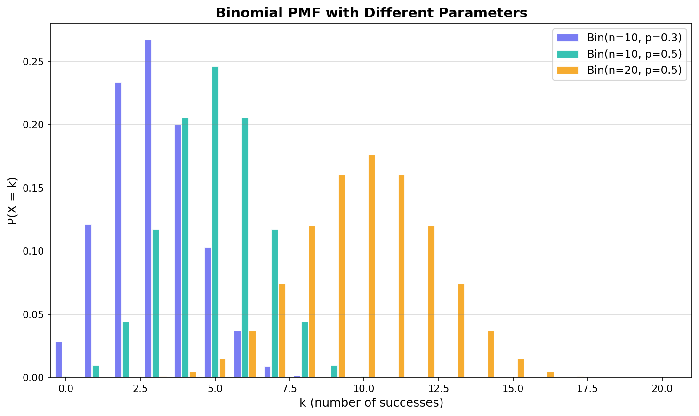
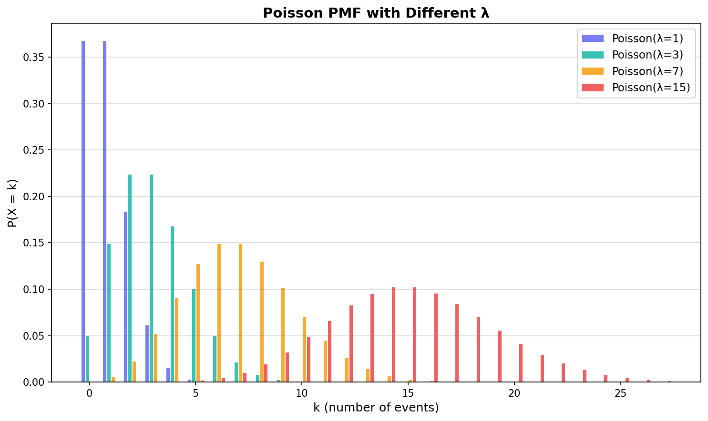
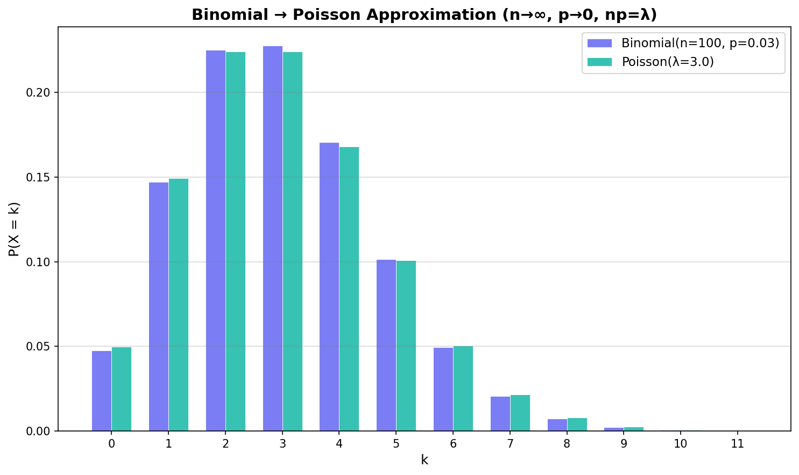
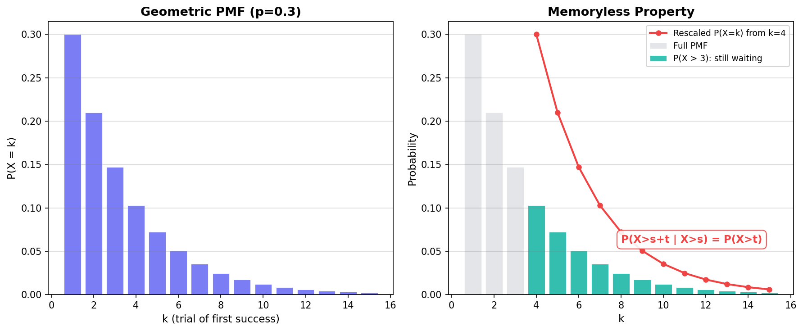
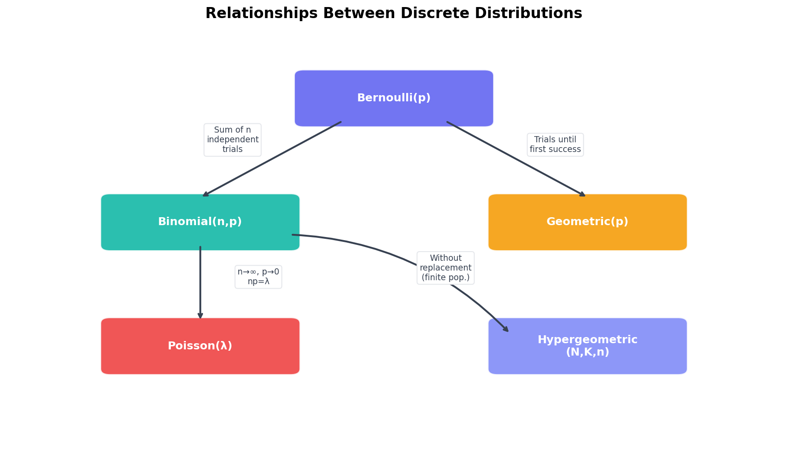

[이전 글](/stats/random-variables-expectation/)에서 확률변수, PMF, 기댓값, 분산의 개념을 다뤘다. 개념은 알겠는데, 실제로 어떤 확률변수가 어떤 모양의 분포를 따르는지는 아직 이야기하지 않았다. 동전 던지기, 불량품 검사, 서버 트래픽 — 현실의 문제마다 등장하는 이산확률분포(Discrete Probability Distribution)가 다르고, 각 분포에는 고유한 수학적 구조가 있다.

이번 글에서는 ML과 통계에서 가장 빈번하게 만나는 이산분포 5가지를 한 자리에서 정리한다. 베르누이, 이항, 포아송, 기하, 초기하 — 이름은 많지만 사실 하나의 뿌리에서 갈라진 가족이다. 단순 공식 나열이 아니라, 각 분포가 **왜 그런 형태를 가지는지**, 분포 간에 어떤 **관계**가 있는지, 그리고 `scipy.stats`로 어떻게 활용하는지까지 다룬다.

---

## 베르누이 분포 — 모든 것의 시작

### 정의

**베르누이 분포(Bernoulli Distribution)**는 가장 단순한 이산분포다. 결과가 딱 두 가지 — 성공(1) 또는 실패(0) — 인 시행 하나를 모델링한다.

$$X \sim \text{Bernoulli}(p)$$

여기서 $p$는 성공 확률이다. PMF는 다음과 같다.

$$P(X = k) = p^k (1-p)^{1-k}, \quad k \in \{0, 1\}$$

풀어 쓰면 간단하다.

| $k$ | $P(X = k)$ |
|-----|------------|
| 0 (실패) | $1 - p$ |
| 1 (성공) | $p$ |

### 기댓값과 분산

$$E[X] = p$$
$$\text{Var}(X) = p(1-p)$$

분산이 $p = 0.5$일 때 최대값 0.25를 가진다. 동전 던지기처럼 결과가 반반일 때 불확실성이 가장 큰 셈이다.

### ML에서의 베르누이

베르누이 분포가 가장 직접적으로 등장하는 곳은 [로지스틱 회귀](/ml/logistic-regression/)다. 로지스틱 회귀의 시그모이드 출력 $\hat{y} = \sigma(w^Tx)$는 사실상 베르누이 분포의 파라미터 $p$를 추정하는 것이다.

$$y \mid x \sim \text{Bernoulli}(\sigma(w^T x))$$

이진 크로스엔트로피 손실(Binary Cross-Entropy Loss)도 결국 베르누이 분포의 음의 로그 우도(Negative Log-Likelihood)에서 온다.

```python
from scipy.stats import bernoulli
import numpy as np

# 베르누이 분포: 성공 확률 0.7
p = 0.7
rv = bernoulli(p)

# PMF
print(f"P(X=0) = {rv.pmf(0):.2f}")  # 0.30
print(f"P(X=1) = {rv.pmf(1):.2f}")  # 0.70

# 기댓값, 분산
print(f"E[X]   = {rv.mean():.2f}")   # 0.70
print(f"Var(X) = {rv.var():.2f}")    # 0.21

# 랜덤 샘플 생성
samples = rv.rvs(size=10000, random_state=42)
print(f"샘플 평균 = {samples.mean():.4f}")  # ≈ 0.70
```

단순하지만, 베르누이는 이후 나올 이항분포, 기하분포의 기본 구성 블록이 된다. 마치 레고의 1×1 블록처럼, 이 분포를 여러 번 쌓으면 이항이 되고, 성공이 나올 때까지 반복하면 기하가 된다.

<div style="background: #f0f4ff; border-left: 4px solid #3182f6; padding: 16px 20px; margin: 20px 0; border-radius: 4px;"><strong>💡 참고</strong><br>베르누이 시행이 "독립"이라는 가정이 핵심이다. 이전 시행의 결과가 다음 시행에 영향을 미치지 않아야 한다. 이 독립 가정이 깨지면 이항분포나 기하분포의 공식이 성립하지 않는다.</div>

---

## 이항 분포 — 성공 횟수 세기

### 정의

**이항 분포(Binomial Distribution)**는 독립적인 베르누이 시행을 $n$번 반복했을 때, 성공 횟수의 분포다.

$$X \sim \text{Binomial}(n, p)$$

PMF는 [조합 공식](/stats/probability-fundamentals/)을 사용한다.

$$P(X = k) = \binom{n}{k} p^k (1-p)^{n-k}, \quad k = 0, 1, \ldots, n$$

$\binom{n}{k}$는 $n$번 중 성공할 $k$번을 고르는 경우의 수, $p^k$는 그 $k$번이 모두 성공할 확률, $(1-p)^{n-k}$는 나머지가 모두 실패할 확률이다. 세 요소를 곱하면 "정확히 $k$번 성공"의 확률이 된다.

### 기댓값과 분산

$$E[X] = np$$
$$\text{Var}(X) = np(1-p)$$

$n$개의 독립 베르누이 확률변수의 합이므로, 기댓값과 분산 모두 $n$배가 되는 것은 자연스럽다.

### 시각화: 파라미터에 따른 형태 변화


<p align="center" style="color: #888; font-size: 13px;"><em>n과 p를 바꿀 때 이항 분포의 형태가 어떻게 달라지는지 비교</em></p>

$p = 0.5$이면 대칭, $p < 0.5$이면 오른쪽으로 치우치고, $n$이 커지면 분포가 넓어지면서 종 모양에 가까워진다. 이것이 나중에 배울 중심극한정리(CLT)와 연결되는 지점이다.

### A/B 테스트와 이항 분포

웹 서비스에서 A/B 테스트를 진행한다고 하자. 버튼 A의 클릭률이 5%, 방문자 200명이 A를 봤을 때, 클릭 수 $X$는 $\text{Binomial}(200, 0.05)$를 따른다.

```python
from scipy.stats import binom
import numpy as np

# A/B 테스트: 200명 중 클릭률 5%
n, p = 200, 0.05
rv = binom(n, p)

# 기댓값, 분산
print(f"E[X]    = {rv.mean():.1f}")    # 10.0
print(f"Var(X)  = {rv.var():.2f}")     # 9.50
print(f"Std(X)  = {rv.std():.2f}")     # 3.08

# 정확히 10명이 클릭할 확률
print(f"P(X=10) = {rv.pmf(10):.4f}")   # 0.1284

# 15명 이상 클릭할 확률
print(f"P(X≥15) = {1 - rv.cdf(14):.4f}")  # 0.0781

# CDF를 이용한 구간 확률
print(f"P(5≤X≤15) = {rv.cdf(15) - rv.cdf(4):.4f}")  # 0.9292
```

"15명 이상 클릭할 확률이 약 7.8%"라는 결과는, 만약 실제로 15명 이상 클릭했다면 클릭률이 5%라는 귀무가설을 의심할 근거가 될 수 있다. 이것이 가설 검정의 출발점이다.

<div style="background: #f0fff4; border-left: 4px solid #51cf66; padding: 16px 20px; margin: 20px 0; border-radius: 4px;"><strong>✅ 팁</strong><br><code>scipy.stats</code>의 <code>cdf(k)</code>는 $P(X \leq k)$를 반환한다. "k 이상"의 확률을 구하려면 <code>1 - cdf(k-1)</code> 또는 <code>sf(k-1)</code>을 사용하면 된다. <code>sf</code>는 survival function으로, <code>1 - cdf</code>를 수치적으로 더 안정적으로 계산한다.</div>

---

## 포아송 분포 — 사건의 발생 빈도

### 정의

**포아송 분포(Poisson Distribution)**는 일정한 시간 또는 공간 내에서 사건이 발생하는 횟수를 모델링한다.

$$X \sim \text{Poisson}(\lambda)$$

파라미터 $\lambda$는 단위 시간(또는 공간) 당 평균 발생 횟수다. PMF는 다음과 같다.

$$P(X = k) = \frac{e^{-\lambda} \lambda^k}{k!}, \quad k = 0, 1, 2, \ldots$$

이항 분포와 달리 $k$의 상한이 없다. 이론적으로 무한히 많은 사건이 발생할 수 있다(확률이 극도로 작아질 뿐).

### 기댓값과 분산

$$E[X] = \lambda$$
$$\text{Var}(X) = \lambda$$

포아송 분포의 독특한 성질은 **기댓값과 분산이 동일**하다는 점이다. 실제 데이터의 표본 평균과 표본 분산이 비슷하다면, 포아송 분포를 의심해 볼 수 있다.

### 시각화: λ에 따른 형태 변화


<p align="center" style="color: #888; font-size: 13px;"><em>λ가 커질수록 분포가 오른쪽으로 이동하며 종 모양에 가까워진다</em></p>

$\lambda = 1$일 때는 0에 집중된 강하게 왼쪽 치우친 형태지만, $\lambda = 15$가 되면 거의 정규분포처럼 보인다. 이 역시 중심극한정리의 결과인데, 포아송 분포를 독립적인 많은 희귀 사건의 합으로 볼 수 있기 때문이다.

### 이항 분포에서 포아송으로의 수렴

포아송 분포는 이항 분포의 극한 케이스다. 시행 횟수 $n$이 매우 크고, 개별 성공 확률 $p$가 매우 작으며, 그 곱 $np = \lambda$가 적당한 상수로 유지될 때:

$$\lim_{n \to \infty} \binom{n}{k} p^k (1-p)^{n-k} = \frac{e^{-\lambda} \lambda^k}{k!}, \quad \text{where } p = \frac{\lambda}{n}$$

직관적으로 이해하면 — "희귀한 사건이 아주 많은 기회에서 발생하는 상황"이 포아송의 영역인 셈이다.


<p align="center" style="color: #888; font-size: 13px;"><em>Binomial(100, 0.03)과 Poisson(3)의 PMF가 거의 일치한다</em></p>

```python
from scipy.stats import binom, poisson
import numpy as np

# 이항 → 포아송 근사
n, p = 100, 0.03
lam = n * p  # = 3.0

k_values = np.arange(0, 11)
binom_pmf = binom.pmf(k_values, n, p)
poisson_pmf = poisson.pmf(k_values, lam)

print("k  | Binom(100,0.03) | Poisson(3)  | 차이")
print("-" * 48)
for k, b, po in zip(k_values, binom_pmf, poisson_pmf):
    print(f"{k:2d} | {b:.6f}        | {po:.6f}    | {abs(b-po):.6f}")
```

```
k  | Binom(100,0.03) | Poisson(3)  | 차이
------------------------------------------------
 0 | 0.047553        | 0.049787    | 0.002234
 1 | 0.147082        | 0.149361    | 0.002279
 2 | 0.225176        | 0.224042    | 0.001134
 3 | 0.227474        | 0.224042    | 0.003432
 4 | 0.170606        | 0.168031    | 0.002574
 5 | 0.101363        | 0.100819    | 0.000544
 6 | 0.049588        | 0.050409    | 0.000822
 7 | 0.020616        | 0.021604    | 0.000988
 8 | 0.007427        | 0.008102    | 0.000675
 9 | 0.002352        | 0.002701    | 0.000349
10 | 0.000663        | 0.000810    | 0.000147
```

차이가 소수점 셋째 자리 수준이다. $n$이 더 크고 $p$가 더 작아지면 이 차이는 0에 수렴한다.

### 서버 트래픽 예시

분당 평균 5건의 API 요청이 들어오는 서버가 있다고 하자.

```python
from scipy.stats import poisson

lam = 5  # 분당 평균 5건
rv = poisson(lam)

# 기본 통계량
print(f"E[X]   = {rv.mean():.1f}")   # 5.0
print(f"Var(X) = {rv.var():.1f}")    # 5.0

# 정확히 3건 들어올 확률
print(f"P(X=3) = {rv.pmf(3):.4f}")   # 0.1404

# 10건 이상 들어올 확률 (서버 과부하 기준)
print(f"P(X≥10) = {rv.sf(9):.4f}")   # 0.0318

# 99번째 백분위수 — 서버 용량 계획에 활용
print(f"99th percentile = {rv.ppf(0.99):.0f}")  # 11건
```

"분당 11건까지 처리할 수 있으면 99%의 시간 동안 문제가 없다"는 결론이 나온다. 이런 식으로 포아송 분포는 시스템 용량 설계에 직접 활용된다.

<div style="background: #fff3f0; border-left: 4px solid #ff6b6b; padding: 16px 20px; margin: 20px 0; border-radius: 4px;"><strong>⚠️ 주의</strong><br>포아송 분포의 전제 조건을 잊지 말아야 한다: (1) 사건이 <strong>독립적</strong>으로 발생하고, (2) 동시 발생이 없으며, (3) 평균 발생률 λ가 <strong>일정</strong>해야 한다. 출퇴근 시간에 트래픽이 급증하는 서비스라면 시간대별로 λ를 다르게 설정해야 한다.</div>

---

## 기하 분포 — 첫 성공까지의 대기

### 정의

**기하 분포(Geometric Distribution)**는 독립적인 베르누이 시행을 반복할 때, 처음으로 성공할 때까지의 시행 횟수를 모델링한다.

$$X \sim \text{Geometric}(p)$$

PMF는 직관적이다: 처음 $k-1$번은 실패하고, $k$번째에 성공해야 한다.

$$P(X = k) = (1-p)^{k-1} p, \quad k = 1, 2, 3, \ldots$$

### 기댓값과 분산

$$E[X] = \frac{1}{p}$$
$$\text{Var}(X) = \frac{1-p}{p^2}$$

성공 확률이 높을수록 기대 시행 횟수가 줄어드는 것은 당연하다. $p = 0.5$면 평균 2번, $p = 0.1$이면 평균 10번 시도해야 첫 성공을 본다. 분산 공식에서 분모가 $p^2$인 점에 주목하자 — 성공 확률이 낮을수록 분산이 $1/p$ 보다 더 빠르게 커지므로, 첫 성공까지의 시행 횟수 예측이 그만큼 불확실해진다.

### 시각화와 무기억성


<p align="center" style="color: #888; font-size: 13px;"><em>왼쪽: 기하 분포의 PMF / 오른쪽: 무기억성 — 3번 실패 후의 조건부 분포가 원래 분포와 동일</em></p>

기하 분포의 가장 독특한 성질은 **무기억성(Memoryless Property)**이다.

$$P(X > s + t \mid X > s) = P(X > t)$$

"이미 $s$번 실패했다"는 정보가 미래에 아무런 영향을 주지 않는다. 3번 실패한 사람이나 방금 시작한 사람이나, 앞으로의 성공 확률 구조가 완전히 동일하다. 이는 각 시행이 독립이라는 가정에서 자연스럽게 따라오는 결과이기도 하다.

증명 자체는 간단하다:

$$P(X > s+t \mid X > s) = \frac{P(X > s+t)}{P(X > s)} = \frac{(1-p)^{s+t}}{(1-p)^s} = (1-p)^t = P(X > t)$$

<div style="background: #f0f4ff; border-left: 4px solid #3182f6; padding: 16px 20px; margin: 20px 0; border-radius: 4px;"><strong>💡 참고</strong><br>이산분포 중 무기억성을 가지는 분포는 기하 분포가 <strong>유일</strong>하다. 연속분포에서는 지수 분포(Exponential Distribution)가 이에 대응되며, 다음 글에서 다룬다.</div>

### 재시도 전략 연결

네트워크 패킷 전송 실패 시 재시도하는 상황을 생각해보자. 한 번 전송의 성공 확률이 $p = 0.8$이라면:

```python
from scipy.stats import geom
import numpy as np

p = 0.8
rv = geom(p)

# 기본 통계량
print(f"E[X]   = {rv.mean():.2f}")   # 1.25
print(f"Var(X) = {rv.var():.4f}")    # 0.3125

# 첫 시도에 성공할 확률
print(f"P(X=1) = {rv.pmf(1):.2f}")   # 0.80

# 3번 이내에 성공할 확률
print(f"P(X≤3) = {rv.cdf(3):.4f}")   # 0.9920

# 5번 넘게 시도해야 할 확률
print(f"P(X>5) = {rv.sf(5):.6f}")    # 0.000320
```

3번 이내에 성공할 확률이 99.2%다. 재시도 횟수를 3으로 설정하면 사실상 대부분의 경우를 커버할 수 있다는 결론이 나온다.

```python
# 무기억성 검증
s, t = 3, 2

# P(X > s+t | X > s)
p_conditional = rv.sf(s + t) / rv.sf(s)

# P(X > t)
p_marginal = rv.sf(t)

print(f"P(X > {s+t} | X > {s}) = {p_conditional:.6f}")
print(f"P(X > {t})             = {p_marginal:.6f}")
print(f"동일한가? {np.isclose(p_conditional, p_marginal)}")
```

```
P(X > 5 | X > 3) = 0.040000
P(X > 2)             = 0.040000
동일한가? True
```

---

## 초기하 분포 — 비복원 추출의 세계

### 정의

**초기하 분포(Hypergeometric Distribution)**는 유한 모집단에서 **비복원 추출**할 때의 분포다. 이항 분포와의 결정적 차이는 추출 후 원래대로 돌려놓지 않는다는 점이다.

전체 $N$개 중 성공 범주 $K$개가 있는 모집단에서, $n$개를 비복원 추출할 때 성공 횟수 $X$의 분포:

$$X \sim \text{Hypergeometric}(N, K, n)$$

$$P(X = k) = \frac{\binom{K}{k} \binom{N-K}{n-k}}{\binom{N}{n}}$$

분자의 $\binom{K}{k}$는 성공 범주에서 $k$개를 고르는 경우의 수, $\binom{N-K}{n-k}$는 실패 범주에서 나머지를 고르는 경우의 수다. 분모 $\binom{N}{n}$은 전체에서 $n$개를 고르는 모든 경우의 수로 나눠 확률을 만든다.

### 기댓값과 분산

$$E[X] = n \cdot \frac{K}{N}$$

$$\text{Var}(X) = n \cdot \frac{K}{N} \cdot \frac{N-K}{N} \cdot \frac{N-n}{N-1}$$

이항 분포의 분산 $np(1-p)$와 비교하면, 끝에 $\frac{N-n}{N-1}$이라는 **유한 모집단 보정 계수(Finite Population Correction)**가 붙는다. $N$이 $n$에 비해 충분히 크면 이 값은 1에 가까워지고, 초기하 분포는 이항 분포로 수렴한다.

### 품질 검사 예시

100개의 제품 중 불량품이 10개 있다. 검사원이 무작위로 5개를 뽑았을 때, 불량품이 2개 이상 포함될 확률은?

```python
from scipy.stats import hypergeom

# 모집단: N=100, 불량 K=10, 추출 n=5
N, K, n = 100, 10, 5
rv = hypergeom(N, K, n)

# 기본 통계량
print(f"E[X]   = {rv.mean():.2f}")   # 0.50
print(f"Var(X) = {rv.var():.4f}")    # 0.4318

# 불량품이 정확히 0개, 1개, 2개일 확률
for k in range(4):
    print(f"P(X={k}) = {rv.pmf(k):.4f}")

# 2개 이상 불량
print(f"\nP(X≥2)  = {1 - rv.cdf(1):.4f}")
```

```
E[X]   = 0.50
Var(X) = 0.4318
P(X=0) = 0.5838
P(X=1) = 0.3394
P(X=2) = 0.0702
P(X=3) = 0.0064
P(X≥2)  = 0.0769
```

### 이항 분포와의 비교

같은 문제를 이항 분포로 계산하면 어떨까? "불량률 10%로 5개를 **복원 추출**한다"고 가정하는 것이다.

```python
from scipy.stats import binom, hypergeom

N, K, n = 100, 10, 5
p = K / N  # = 0.1

hyper_rv = hypergeom(N, K, n)
binom_rv = binom(n, p)

print("k | Hypergeometric | Binomial   | 차이")
print("-" * 45)
for k in range(5):
    h = hyper_rv.pmf(k)
    b = binom_rv.pmf(k)
    print(f"{k} | {h:.6f}       | {b:.6f}   | {abs(h-b):.6f}")
```

```
k | Hypergeometric | Binomial   | 차이
---------------------------------------------
0 | 0.583752       | 0.590490   | 0.006738
1 | 0.339391       | 0.328050   | 0.011341
2 | 0.070219       | 0.072900   | 0.002681
3 | 0.006384       | 0.008100   | 0.001716
4 | 0.000251       | 0.000450   | 0.000199
```

$N = 100$, $n = 5$이면 표본 비율이 5%에 불과하므로 두 분포의 차이가 크지 않다. 하지만 $N = 20$처럼 모집단이 작아지면 차이가 커진다. 일반적으로 **표본 크기가 모집단의 5% 이하**이면 이항 근사를 사용해도 무방하다. 이 "5% 규칙"은 통계 교과서에서 자주 등장하는 경험적 기준이다.

<div style="background: #fff3f0; border-left: 4px solid #ff6b6b; padding: 16px 20px; margin: 20px 0; border-radius: 4px;"><strong>⚠️ 주의</strong><br>카드 게임, 로또 확률 계산 등 비복원 추출 상황에서 이항 분포를 쓰면 답이 달라진다. "꺼낸 것을 다시 넣는가?" — 이 질문이 이항과 초기하를 가르는 기준이다.</div>

---

## 분포 간 관계 — 큰 그림 잡기

다섯 가지 분포를 개별적으로 배웠으니, 이제 이들 사이의 관계를 조망해보자.


<p align="center" style="color: #888; font-size: 13px;"><em>이산확률분포 간 관계 — 베르누이가 근본이고, 조건에 따라 다른 분포가 파생된다</em></p>

핵심 관계를 정리하면 다음과 같다.

| 관계 | 설명 |
|------|------|
| **베르누이 → 이항** | 독립 베르누이 시행 $n$번의 성공 횟수 합 |
| **베르누이 → 기하** | 독립 베르누이 시행을 첫 성공까지 반복한 시행 횟수 |
| **이항 → 포아송** | $n \to \infty$, $p \to 0$, $np = \lambda$ 고정 시 수렴 |
| **이항 → 초기하** | 복원 추출(이항)을 비복원 추출로 바꾸면 초기하 |
| **초기하 → 이항** | $N \to \infty$, $K/N = p$ 고정 시 수렴 |

### 어떤 분포를 선택할 것인가

실제 문제를 만났을 때 어떤 분포를 적용할지 결정하는 흐름은 다음과 같다.

1. **결과가 성공/실패 두 가지인가?**
   - 아니라면: 다항 분포 등 다른 분포 고려
   - 맞다면: ↓
2. **시행이 한 번인가?**
   - 맞다면: **베르누이 분포**
   - 아니라면: ↓
3. **복원 추출인가? (또는 모집단이 충분히 큰가?)**
   - 아니라면 (비복원, 유한 모집단): **초기하 분포**
   - 맞다면: ↓
4. **관심사가 "성공 횟수"인가, "첫 성공까지의 시도 횟수"인가?**
   - 성공 횟수: **이항 분포**
   - 첫 성공까지 시도 횟수: **기하 분포**
5. **이항인데, $n$이 크고 $p$가 작은가?**
   - 맞다면: **포아송 근사** 사용 가능

<div style="background: #f0fff4; border-left: 4px solid #51cf66; padding: 16px 20px; margin: 20px 0; border-radius: 4px;"><strong>✅ 팁</strong><br>포아송 분포는 "성공/실패"의 프레임 없이도 독립적으로 등장한다. "단위 시간당 사건 발생 횟수"가 핵심 키워드라면, 이항에서 출발하지 않고 바로 포아송을 적용해도 좋다.</div>

---

## scipy.stats 통합 실습

다섯 분포 모두 `scipy.stats`에서 동일한 API를 제공한다. 이 통일된 인터페이스 덕분에 분포를 바꿔도 코드 구조가 변하지 않는다.

### 공통 API 정리

| 메서드 | 설명 | 예시 |
|--------|------|------|
| `pmf(k)` | 확률 질량 함수: $P(X = k)$ | `binom.pmf(3, 10, 0.5)` |
| `cdf(k)` | 누적 분포 함수: $P(X \leq k)$ | `poisson.cdf(5, 3)` |
| `sf(k)` | 생존 함수: $P(X > k) = 1 - \text{cdf}(k)$ | `geom.sf(3, 0.5)` |
| `ppf(q)` | 분위수 함수: $\text{cdf}^{-1}(q)$ | `binom.ppf(0.95, 10, 0.5)` |
| `rvs(size)` | 랜덤 샘플 생성 | `poisson.rvs(5, size=1000)` |
| `mean()` | 기댓값 | `rv.mean()` |
| `var()` | 분산 | `rv.var()` |
| `std()` | 표준편차 | `rv.std()` |
| `interval(alpha)` | 신뢰 구간 | `rv.interval(0.95)` |

### 5개 분포 비교 코드

```python
from scipy.stats import bernoulli, binom, poisson, geom, hypergeom
import numpy as np

# 분포 정의
distributions = {
    'Bernoulli(0.7)':       bernoulli(0.7),
    'Binomial(10, 0.3)':    binom(10, 0.3),
    'Poisson(5)':           poisson(5),
    'Geometric(0.4)':       geom(0.4),
    'Hypergeom(50,10,5)':   hypergeom(50, 10, 5),
}

print(f"{'Distribution':<22} {'E[X]':>8} {'Var(X)':>8} {'Std(X)':>8}")
print("-" * 50)
for name, rv in distributions.items():
    print(f"{name:<22} {rv.mean():>8.3f} {rv.var():>8.3f} {rv.std():>8.3f}")
```

```
Distribution             E[X]   Var(X)   Std(X)
--------------------------------------------------
Bernoulli(0.7)           0.700    0.210    0.458
Binomial(10, 0.3)        3.000    2.100    1.449
Poisson(5)               5.000    5.000    2.236
Geometric(0.4)           2.500    3.750    1.936
Hypergeom(50,10,5)       1.000    0.735    0.857
```

포아송의 기댓값과 분산이 동일한 점(둘 다 5.0), 기하 분포의 분산이 기댓값보다 큰 점이 눈에 띈다.

### 랜덤 샘플링과 경험적 검증

이론적 기댓값과 분산이 실제 샘플링 결과와 일치하는지 확인해보자.

```python
np.random.seed(42)

print(f"{'Distribution':<22} {'이론E[X]':>9} {'샘플평균':>9} {'이론Var':>9} {'샘플분산':>9}")
print("-" * 62)
for name, rv in distributions.items():
    samples = rv.rvs(size=100000)
    print(f"{name:<22} {rv.mean():>9.3f} {samples.mean():>9.3f} "
          f"{rv.var():>9.3f} {samples.var():>9.3f}")
```

```
Distribution            이론E[X]    샘플평균     이론Var    샘플분산
--------------------------------------------------------------
Bernoulli(0.7)           0.700     0.700     0.210     0.210
Binomial(10, 0.3)        3.000     2.998     2.100     2.098
Poisson(5)               5.000     4.999     5.000     4.987
Geometric(0.4)           2.500     2.505     3.750     3.773
Hypergeom(50,10,5)       1.000     0.999     0.735     0.735
```

10만 개 샘플이면 이론값과 소수점 둘째 자리까지 일치한다. 이것이 **큰 수의 법칙(Law of Large Numbers)**이 작동하는 모습이다.

---

## 5대 이산분포 종합 비교표

<div style="background: #f8f9fa; border: 1px solid #e9ecef; padding: 20px; margin: 24px 0; border-radius: 8px;"><strong>📌 핵심 요약</strong><br><br>

| 분포 | 파라미터 | PMF | E[X] | Var(X) | 핵심 키워드 |
|------|----------|-----|------|--------|-------------|
| **베르누이** | $p$ | $p^k(1-p)^{1-k}$ | $p$ | $p(1-p)$ | 한 번의 성공/실패 |
| **이항** | $n, p$ | $\binom{n}{k}p^k(1-p)^{n-k}$ | $np$ | $np(1-p)$ | $n$번 중 성공 횟수 |
| **포아송** | $\lambda$ | $\frac{e^{-\lambda}\lambda^k}{k!}$ | $\lambda$ | $\lambda$ | 단위당 사건 빈도 |
| **기하** | $p$ | $(1-p)^{k-1}p$ | $\frac{1}{p}$ | $\frac{1-p}{p^2}$ | 첫 성공까지 시도 |
| **초기하** | $N,K,n$ | $\frac{\binom{K}{k}\binom{N-K}{n-k}}{\binom{N}{n}}$ | $n\frac{K}{N}$ | $n\frac{K}{N}\frac{N-K}{N}\frac{N-n}{N-1}$ | 비복원 추출 |

</div>

| 분포 | 독립 가정 | 시행 횟수 | 모집단 크기 | 무기억성 | scipy.stats |
|------|-----------|-----------|-------------|----------|-------------|
| 베르누이 | - | 1회 | - | - | `bernoulli` |
| 이항 | 필요 | $n$회 (고정) | 무한 (또는 충분히 큼) | 없음 | `binom` |
| 포아송 | 필요 | 무한 | 무한 | 없음 | `poisson` |
| 기하 | 필요 | 무한 (첫 성공까지) | 무한 | **있음** | `geom` |
| 초기하 | 불필요 | $n$회 (고정) | 유한 $N$ | 없음 | `hypergeom` |

---

## 분포 선택 빠른 참조

실무에서 "이 상황에 어떤 분포를 쓰지?"라는 질문이 가장 자주 나온다. 아래 예시들로 감을 잡아두면 된다.

| 상황 | 적합한 분포 | 이유 |
|------|------------|------|
| 이메일이 스팸인가 아닌가 | 베르누이 | 한 번의 이진 판단 |
| 100명 중 구매 고객 수 | 이항 | $n$번 독립 시행의 성공 합 |
| 1시간 동안 접수된 CS 문의 수 | 포아송 | 단위 시간당 사건 빈도 |
| 결함 없는 첫 제품이 나올 때까지 검사 횟수 | 기하 | 첫 성공까지의 시행 |
| 52장 카드에서 5장 뽑을 때 하트 수 | 초기하 | 비복원 추출 |
| 하루 교통사고 건수 | 포아송 | 희귀 사건의 빈도 |
| [분류 모델](/ml/classification-metrics/)의 TP/FP 수 | 이항/초기하 | 모집단 크기에 따라 결정 |
| [나이브 베이즈](/ml/naive-bayes/) 단어 빈도 | 다항 (이항의 확장) | 여러 범주의 카운트 |

---

## 마치며

이번 글에서 ML과 통계의 근간이 되는 이산확률분포 5가지를 정리했다. 각 분포의 PMF, 기댓값, 분산을 단순히 외우는 것보다 중요한 것은 **분포 간의 관계**를 이해하는 것이다. 베르누이에서 이항과 기하가 갈라지고, 이항의 극한에서 포아송이 나타나며, 복원/비복원의 차이가 이항과 초기하를 가른다.

`scipy.stats`의 통일된 인터페이스 — `pmf`, `cdf`, `sf`, `rvs` — 를 한번 익혀두면 어떤 분포든 같은 패턴으로 다룰 수 있다는 것도 실무적으로 큰 장점이다. 분포가 바뀌어도 코드 구조는 그대로 유지되니, 모델링 과정에서 분포 변경 비용이 매우 낮다.

[다음 글](/stats/continuous-distributions/)에서는 연속확률분포의 세계로 넘어간다. 균일 분포, 정규 분포, 지수 분포, 감마 분포, 베타 분포 — 이산에서 연속으로 확장될 때 PMF가 PDF로, 합이 적분으로 바뀌는 과정을 다룬다.

---

## References

- Blitzstein, J. K. & Hwang, J. (2019). *Introduction to Probability* (2nd ed.), Chapters 3-5.
- Wasserman, L. (2004). *All of Statistics*, Chapter 2.
- [scipy.stats documentation](https://docs.scipy.org/doc/scipy/reference/stats.html)
- [Harvard Stat 110: Probability](https://projects.iq.harvard.edu/stat110)
