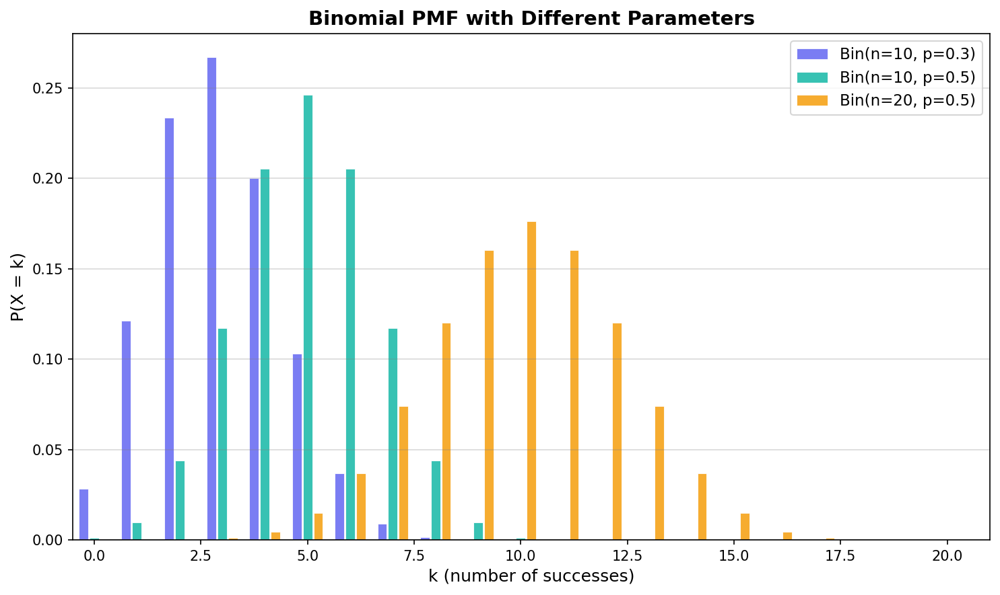
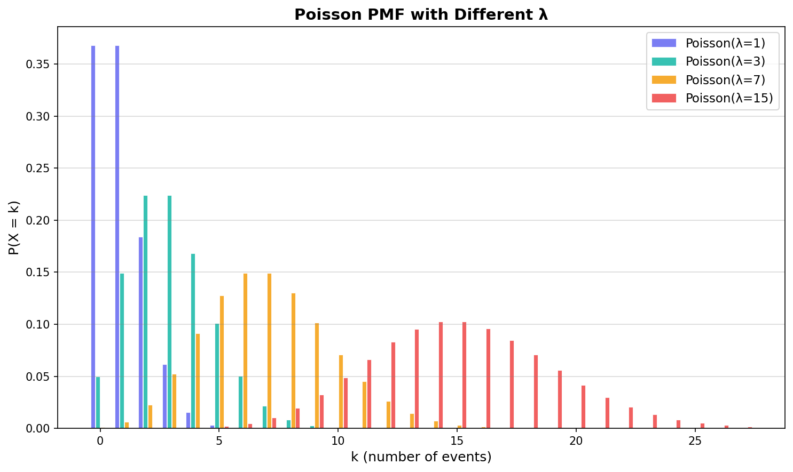
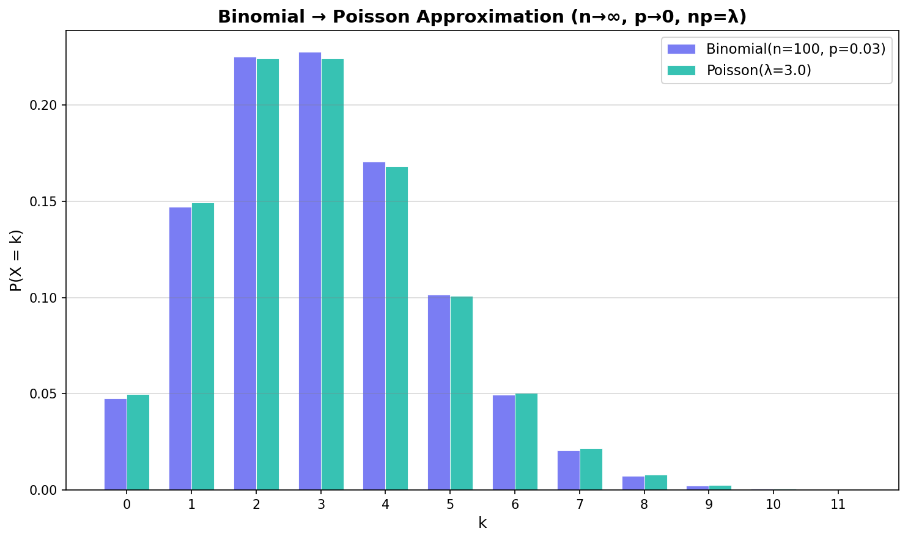
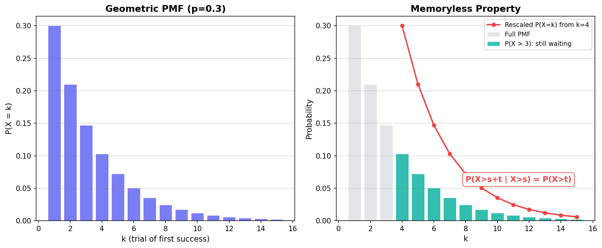
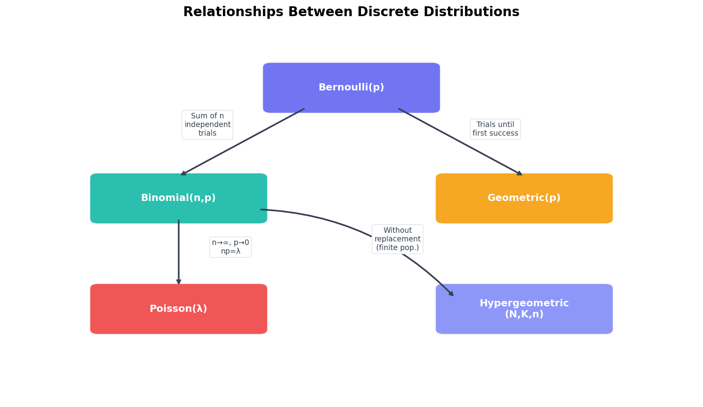

동전 던지기, 불량품 검사, 서버 트래픽. 상황마다 등장하는 이산확률분포(Discrete Probability Distribution)가 다르고, 각 분포에는 고유한 수학적 구조가 있다. 이 글에서는 ML과 통계에서 가장 자주 만나는 이산분포 다섯 가지를 하나의 계보로 정리한다. 이름은 다섯이지만 뿌리는 하나이고, 진짜 값어치는 개별 공식보다 분포 사이의 관계에 있다.

## 베르누이 분포: 모든 것의 시작

### 정의

**베르누이 분포**(Bernoulli Distribution)는 가장 단순한 이산분포다. 결과가 성공(1) 또는 실패(0) 두 가지뿐인 시행 하나를 모델링한다.

$$X \sim \text{Bernoulli}(p)$$

여기서 $p$는 성공 확률이다. PMF는 다음과 같다.

$$P(X = k) = p^k (1-p)^{1-k}, \quad k \in \{0, 1\}$$

| $k$ | $P(X = k)$ |
|-----|------------|
| 0 (실패) | $1 - p$ |
| 1 (성공) | $p$ |

### 기댓값과 분산

$$E[X] = p$$
$$\text{Var}(X) = p(1-p)$$

분산은 $p = 0.5$일 때 최댓값 0.25를 가진다. 결과가 반반일 때 불확실성이 가장 큰 셈이다.

### ML에서의 베르누이

베르누이 분포가 가장 직접적으로 등장하는 곳은 [로지스틱 회귀](/ml/logistic-regression/)다. 시그모이드 출력 $\hat{y} = \sigma(w^Tx)$는 사실상 베르누이 분포의 파라미터 $p$를 추정하는 것이다.

$$y \mid x \sim \text{Bernoulli}(\sigma(w^T x))$$

이진 크로스엔트로피 손실(Binary Cross-Entropy Loss)도 결국 베르누이 분포의 음의 로그 우도에서 온다. 여기서 베르누이 시행이 독립이라는 가정이 깨지면, 아래에서 다룰 이항과 기하의 공식이 전부 성립하지 않는다.

## 이항 분포: 성공 횟수 세기

### 정의

**이항 분포**(Binomial Distribution)는 독립적인 베르누이 시행을 $n$번 반복했을 때 성공 횟수의 분포다.

$$X \sim \text{Binomial}(n, p)$$

$$P(X = k) = \binom{n}{k} p^k (1-p)^{n-k}, \quad k = 0, 1, \ldots, n$$

$\binom{n}{k}$는 $n$번 중 성공할 $k$번을 고르는 경우의 수, $p^k$는 그 $k$번이 모두 성공할 확률, $(1-p)^{n-k}$는 나머지가 모두 실패할 확률이다. 세 요소를 곱하면 "정확히 $k$번 성공"의 확률이 된다.

### 기댓값과 분산

$$E[X] = np$$
$$\text{Var}(X) = np(1-p)$$

$n$개의 독립 베르누이 확률변수의 합이므로 기댓값과 분산 모두 $n$배가 되는 것은 자연스럽다.

### 파라미터에 따른 형태 변화



*n과 p를 바꿀 때 이항 분포의 형태가 어떻게 달라지는지 비교*

$p = 0.5$이면 좌우 대칭이고, $p < 0.5$이면 질량이 왼쪽에 몰리면서 오른쪽 꼬리가 길어진다(양의 왜도). $n$이 커지면 분포가 넓어지면서 종 모양에 가까워지는데, 이것이 나중에 배울 중심극한정리(CLT)와 연결되는 지점이다.

### A/B 테스트와 이항 분포

버튼 A의 클릭률이 5%, 방문자 200명이 A를 봤을 때 클릭 수 $X$는 $\text{Binomial}(200, 0.05)$를 따른다.

```python
from scipy.stats import binom

rv = binom(200, 0.05)  # E[X] = 10.0, Var(X) = 9.5

print(f"P(X=10)     = {rv.pmf(10):.4f}")                # 0.1284
print(f"P(X>=15)    = {rv.sf(14):.4f}")                 # 0.0781
print(f"P(5<=X<=15) = {rv.cdf(15) - rv.cdf(4):.4f}")    # 0.9292
```

`sf(k)`는 $P(X > k)$를 반환하는 생존 함수로, `1 - cdf(k)`보다 수치적으로 안정적이다. 15명 이상 클릭할 확률이 7.8%에 불과하므로, 실제로 15명 이상이 클릭했다면 클릭률이 5%라는 귀무가설을 의심할 근거가 된다. 이것이 가설 검정의 출발점이다.

## 포아송 분포: 사건의 발생 빈도

### 정의

**포아송 분포**(Poisson Distribution)는 일정한 시간 또는 공간 내에서 사건이 발생하는 횟수를 모델링한다. 파라미터 $\lambda$는 단위 시간(또는 공간)당 평균 발생 횟수다.

$$X \sim \text{Poisson}(\lambda)$$

$$P(X = k) = \frac{e^{-\lambda} \lambda^k}{k!}, \quad k = 0, 1, 2, \ldots$$

이항 분포와 달리 $k$의 상한이 없다. 이론적으로 무한히 많은 사건이 발생할 수 있다(확률이 극도로 작아질 뿐).

### 기댓값과 분산

$$E[X] = \lambda$$
$$\text{Var}(X) = \lambda$$

기댓값과 분산이 같다는 것이 포아송 분포의 독특한 성질이다. 실제 데이터의 표본 평균과 표본 분산이 비슷하다면 포아송 분포를 의심해 볼 수 있다.

### λ에 따른 형태 변화



*λ가 커질수록 분포가 오른쪽으로 이동하며 종 모양에 가까워진다*

$\lambda = 1$일 때는 질량이 0 근처에 몰리고 오른쪽 꼬리가 긴 형태(양의 왜도)지만, $\lambda = 15$가 되면 거의 정규분포처럼 보인다. 포아송 분포를 독립적인 많은 희귀 사건의 합으로 볼 수 있기 때문이며, 이 역시 중심극한정리의 결과다.

### 이항 분포에서 포아송으로의 수렴

포아송 분포는 이항 분포의 극한 케이스다. 시행 횟수 $n$이 매우 크고, 개별 성공 확률 $p$가 매우 작으며, 그 곱 $np = \lambda$가 적당한 상수로 유지될 때 다음이 성립한다.

$$\lim_{n \to \infty} \binom{n}{k} p^k (1-p)^{n-k} = \frac{e^{-\lambda} \lambda^k}{k!}, \quad \text{where } p = \frac{\lambda}{n}$$

희귀한 사건이 아주 많은 기회에서 발생하는 상황이 포아송의 영역인 셈이다.



*Binomial(100, 0.03)과 Poisson(3)의 PMF가 거의 일치한다*

| $k$ | Binom(100, 0.03) | Poisson(3) | 차이 |
|---|---|---|---|
| 0 | 0.0476 | 0.0498 | 0.0022 |
| 1 | 0.1471 | 0.1494 | 0.0023 |
| 2 | 0.2252 | 0.2240 | 0.0011 |
| 3 | 0.2275 | 0.2240 | 0.0034 |
| 4 | 0.1706 | 0.1680 | 0.0026 |
| 5 | 0.1013 | 0.1008 | 0.0005 |

차이가 소수점 셋째 자리 수준이다. $n$이 더 크고 $p$가 더 작아지면 이 차이는 0에 수렴한다.

### 서버 트래픽 예시

분당 평균 5건의 API 요청이 들어오는 서버를 생각해보자.

```python
from scipy.stats import poisson

rv = poisson(5)  # 분당 평균 5건. E[X] = Var(X) = 5

print(f"P(X=3)    = {rv.pmf(3):.4f}")     # 0.1404
print(f"P(X>=10)  = {rv.sf(9):.4f}")      # 0.0318
print(f"99th pct  = {rv.ppf(0.99):.0f}")  # 11
```

분당 11건까지 처리할 수 있으면 99%의 시간 동안 문제가 없다는 결론이 나온다. 이런 식으로 포아송 분포는 시스템 용량 설계에 직접 활용된다.

:::warning

**주의**

포아송 분포의 전제 조건은 세 가지다. 사건이 독립적으로 발생하고, 동시 발생이 없으며, 평균 발생률 λ가 일정해야 한다. 출퇴근 시간에 트래픽이 급증하는 서비스라면 시간대별로 λ를 다르게 설정해야 한다.

:::

## 기하 분포: 첫 성공까지의 대기

### 정의

**기하 분포**(Geometric Distribution)는 독립적인 베르누이 시행을 반복할 때 처음으로 성공할 때까지의 시행 횟수를 모델링한다. 처음 $k-1$번은 실패하고 $k$번째에 성공해야 한다.

$$X \sim \text{Geometric}(p)$$

$$P(X = k) = (1-p)^{k-1} p, \quad k = 1, 2, 3, \ldots$$

### 기댓값과 분산

$$E[X] = \frac{1}{p}$$
$$\text{Var}(X) = \frac{1-p}{p^2}$$

$p = 0.5$면 평균 2번, $p = 0.1$이면 평균 10번 시도해야 첫 성공을 본다.

### 무기억성



*왼쪽은 기하 분포의 PMF, 오른쪽은 3번 실패 후의 조건부 분포가 원래 분포와 동일함을 보여준다*

기하 분포의 가장 독특한 성질은 **무기억성**(Memoryless Property)이다.

$$P(X > s + t \mid X > s) = P(X > t)$$

이미 $s$번 실패했다는 정보가 미래에 아무런 영향을 주지 않는다. 3번 실패한 사람이나 방금 시작한 사람이나 앞으로의 성공 확률 구조가 완전히 동일하다. 증명은 간결하다.

$$P(X > s+t \mid X > s) = \frac{P(X > s+t)}{P(X > s)} = \frac{(1-p)^{s+t}}{(1-p)^s} = (1-p)^t = P(X > t)$$

이산분포 중 무기억성을 가지는 분포는 기하 분포가 유일하다. 연속분포에서는 지수 분포가 이에 대응된다.

### 재시도 전략 연결

네트워크 패킷 전송에 실패하면 재시도하는 상황에서, 한 번 전송의 성공 확률이 $p = 0.8$이라 하자.

```python
from scipy.stats import geom

rv = geom(0.8)  # E[X] = 1.25, Var(X) = 0.3125

print(f"P(X<=3) = {rv.cdf(3):.4f}")   # 0.9920
print(f"P(X>5)  = {rv.sf(5):.6f}")    # 0.000320

# 무기억성: P(X>5 | X>3) 과 P(X>2) 가 일치한다
print(f"{rv.sf(5) / rv.sf(3):.4f} == {rv.sf(2):.4f}")  # 0.0400 == 0.0400
```

3번 이내에 성공할 확률이 99.2%다. 재시도 횟수를 3으로 설정하면 사실상 대부분의 경우를 커버한다.

## 초기하 분포: 비복원 추출의 세계

### 정의

**초기하 분포**(Hypergeometric Distribution)는 유한 모집단에서 비복원 추출할 때의 분포다. 이항 분포와의 결정적 차이는 추출한 것을 원래대로 돌려놓지 않는다는 점이다.

전체 $N$개 중 성공 범주 $K$개가 있는 모집단에서 $n$개를 비복원 추출할 때, 성공 횟수 $X$의 분포는 다음과 같다.

$$X \sim \text{Hypergeometric}(N, K, n)$$

$$P(X = k) = \frac{\binom{K}{k} \binom{N-K}{n-k}}{\binom{N}{n}}$$

분자의 $\binom{K}{k}$는 성공 범주에서 $k$개를 고르는 경우의 수, $\binom{N-K}{n-k}$는 실패 범주에서 나머지를 고르는 경우의 수다. 분모 $\binom{N}{n}$은 전체에서 $n$개를 고르는 모든 경우의 수다.

### 기댓값과 분산

$$E[X] = n \cdot \frac{K}{N}$$

$$\text{Var}(X) = n \cdot \frac{K}{N} \cdot \frac{N-K}{N} \cdot \frac{N-n}{N-1}$$

이항 분포의 분산 $np(1-p)$와 비교하면 끝에 $\frac{N-n}{N-1}$이라는 **유한 모집단 보정 계수**(Finite Population Correction)가 붙는다. $N$이 $n$에 비해 충분히 크면 이 값은 1에 가까워지고, 초기하 분포는 이항 분포로 수렴한다.

### 이항 분포와의 비교

100개의 제품 중 불량품이 10개 있고 검사원이 무작위로 5개를 뽑는 상황($N = 100$, $K = 10$, $n = 5$)을 보자. 같은 문제를 "불량률 10%로 5개를 복원 추출한다"고 보고 이항 분포로 계산하면 결과가 얼마나 달라지는지 비교하면 다음과 같다.

| $k$ | Hypergeometric | Binomial | 차이 |
|---|---|---|---|
| 0 | 0.5838 | 0.5905 | 0.0067 |
| 1 | 0.3394 | 0.3281 | 0.0113 |
| 2 | 0.0702 | 0.0729 | 0.0027 |
| 3 | 0.0064 | 0.0081 | 0.0017 |
| 4 | 0.0003 | 0.0005 | 0.0002 |

초기하로 계산하면 $E[X] = 0.5$, $\text{Var}(X) = 0.4318$이고, 불량이 2개 이상 나올 확률은 $P(X \geq 2) = 0.0769$다. $N = 100$, $n = 5$이면 표본 비율이 5%에 불과하므로 두 분포의 차이가 크지 않지만, $N = 20$처럼 모집단이 작아지면 차이가 커진다. 표본 크기가 모집단의 5~10% 이하일 때 이항 근사를 쓰는 것이 흔히 통용되는 기준이다.

## 분포 간 관계



*베르누이가 근본이고, 조건에 따라 다른 분포가 파생된다*

| 관계 | 설명 |
|------|------|
| **베르누이 → 이항** | 독립 베르누이 시행 $n$번의 성공 횟수 합 |
| **베르누이 → 기하** | 독립 베르누이 시행을 첫 성공까지 반복한 시행 횟수 |
| **이항 → 포아송** | $n \to \infty$, $p \to 0$, $np = \lambda$ 고정 시 수렴 |
| **이항 → 초기하** | 복원 추출(이항)을 비복원 추출로 바꾸면 초기하 |
| **초기하 → 이항** | $N \to \infty$, $K/N = p$ 고정 시 수렴 |

### 어떤 분포를 선택할 것인가

<div style="margin: 24px 0; text-align: center;">
<svg viewBox="0 0 400 448" style="width: 100%; height: auto; max-width: 380px;"
     xmlns="http://www.w3.org/2000/svg"
     font-family="Pretendard, -apple-system, sans-serif"
     role="img" aria-label="이산확률분포 선택 결정 트리. 성공과 실패로 나뉘는 시행인지, 시행이 한 번인지, 복원 추출인지, 무엇을 세는지에 따라 포아송, 베르누이, 초기하, 이항, 기하 분포로 갈린다. 범주가 셋 이상이면 다항분포로, 이항에서 시행 수가 크고 성공 확률이 작으면 포아송 근사로 넘어간다.">
<style>
.ds-q { fill: var(--bg-subtle, #f5f4f2); stroke: var(--border, #e7e5e4); stroke-width: 1.5; }
.ds-r { fill: var(--bg-muted, #eeecea); stroke: var(--primary, #0d9488); stroke-width: 1.5; }
.ds-fn { fill: var(--bg-warn, #fffbeb); stroke: var(--text-warn, #d97706); stroke-width: 1.5; stroke-dasharray: 6 4; }
.ds-ft { fill: var(--text-warn, #d97706); font-size: 15px; font-weight: 600; }
.ds-qt { fill: var(--text, #1c1917); font-size: 15px; font-weight: 600; }
.ds-rn { fill: var(--primary, #0d9488); font-size: 15px; font-weight: 700; }
.ds-rh { fill: var(--text-muted, #78716c); font-size: 14px; }
.ds-e { fill: var(--text-muted, #78716c); font-size: 14px; }
.ds-l { stroke: var(--text-muted, #78716c); stroke-width: 1.4; fill: none; }
</style>
<defs>
<marker id="dsArrow" viewBox="0 0 10 10" refX="9" refY="5" markerWidth="6" markerHeight="6" orient="auto-start-reverse">
<path d="M 0 0 L 10 5 L 0 10 z" fill="var(--text-muted, #78716c)"/>
</marker>
</defs>
<!-- 판단 노드 -->
<rect class="ds-q" x="8" y="14" width="176" height="38" rx="6"/>
<text class="ds-qt" x="96" y="38" text-anchor="middle">성공/실패로 나뉘나?</text>
<rect class="ds-q" x="8" y="96" width="176" height="38" rx="6"/>
<text class="ds-qt" x="96" y="120" text-anchor="middle">시행이 한 번인가?</text>
<rect class="ds-q" x="8" y="178" width="176" height="38" rx="6"/>
<text class="ds-qt" x="96" y="202" text-anchor="middle">복원 추출인가?</text>
<rect class="ds-q" x="8" y="260" width="176" height="38" rx="6"/>
<text class="ds-qt" x="96" y="284" text-anchor="middle">무엇을 세는가?</text>
<!-- 결과 노드 -->
<rect class="ds-r" x="236" y="11" width="156" height="44" rx="6"/>
<text class="ds-rn" x="314" y="30" text-anchor="middle">포아송</text>
<text class="ds-rh" x="314" y="47" text-anchor="middle">단위 시간당 횟수</text>
<rect class="ds-r" x="236" y="93" width="156" height="44" rx="6"/>
<text class="ds-rn" x="314" y="112" text-anchor="middle">베르누이</text>
<text class="ds-rh" x="314" y="129" text-anchor="middle">성공 여부 하나</text>
<rect class="ds-r" x="236" y="175" width="156" height="44" rx="6"/>
<text class="ds-rn" x="314" y="194" text-anchor="middle">초기하</text>
<text class="ds-rh" x="314" y="211" text-anchor="middle">비복원 추출</text>
<rect class="ds-r" x="236" y="240" width="156" height="44" rx="6"/>
<text class="ds-rn" x="314" y="259" text-anchor="middle">이항</text>
<text class="ds-rh" x="314" y="276" text-anchor="middle">성공 횟수</text>
<rect class="ds-r" x="236" y="304" width="156" height="44" rx="6"/>
<text class="ds-rn" x="314" y="323" text-anchor="middle">기하</text>
<text class="ds-rh" x="314" y="340" text-anchor="middle">첫 성공까지</text>
<!-- 가로 분기 -->
<path class="ds-l" d="M 184 33 L 232 33" marker-end="url(#dsArrow)"/>
<text class="ds-e" x="208" y="27" text-anchor="middle">아니오</text>
<path class="ds-l" d="M 184 115 L 232 115" marker-end="url(#dsArrow)"/>
<text class="ds-e" x="208" y="109" text-anchor="middle">예</text>
<path class="ds-l" d="M 184 197 L 232 197" marker-end="url(#dsArrow)"/>
<text class="ds-e" x="208" y="191" text-anchor="middle">아니오</text>
<path class="ds-l" d="M 184 279 L 208 279 L 208 262 L 232 262" marker-end="url(#dsArrow)"/>
<path class="ds-l" d="M 184 279 L 208 279 L 208 326 L 232 326" marker-end="url(#dsArrow)"/>
<!-- 세로 진행 -->
<path class="ds-l" d="M 96 52 L 96 92" marker-end="url(#dsArrow)"/>
<text class="ds-e" x="104" y="77">예</text>
<path class="ds-l" d="M 96 134 L 96 174" marker-end="url(#dsArrow)"/>
<text class="ds-e" x="104" y="159">아니오</text>
<path class="ds-l" d="M 96 216 L 96 256" marker-end="url(#dsArrow)"/>
<text class="ds-e" x="104" y="241">예</text>
<!-- 트리 밖의 두 갈래 -->
<rect class="ds-fn" x="8" y="364" width="384" height="76" rx="6"/>
<text class="ds-ft" x="24" y="388">트리가 담지 않은 두 갈래</text>
<text class="ds-rh" x="24" y="412">범주가 셋 이상 → 다항분포</text>
<text class="ds-rh" x="24" y="432">이항에서 n 크고 p 작음 → 포아송 근사</text>
</svg>
</div>

포아송 분포는 성공/실패의 프레임 없이도 독립적으로 등장한다. "단위 시간당 사건 발생 횟수"가 핵심 키워드라면 이항에서 출발하지 않고 바로 포아송을 적용해도 좋다.

## scipy.stats 공통 API

다섯 분포 모두 `scipy.stats`에서 같은 인터페이스를 제공하므로, 분포를 바꿔도 코드 구조가 변하지 않는다.

| 메서드 | 설명 | 예시 |
|--------|------|------|
| `pmf(k)` | 확률 질량 함수: $P(X = k)$ | `binom.pmf(3, 10, 0.5)` |
| `cdf(k)` | 누적 분포 함수: $P(X \leq k)$ | `poisson.cdf(5, 3)` |
| `sf(k)` | 생존 함수: $P(X > k) = 1 - \text{cdf}(k)$ | `geom.sf(3, 0.5)` |
| `ppf(q)` | 분위수 함수: $\text{cdf}^{-1}(q)$ | `binom.ppf(0.95, 10, 0.5)` |
| `rvs(size)` | 랜덤 샘플 생성 | `poisson.rvs(5, size=1000)` |
| `mean()` / `var()` / `std()` | 기댓값 / 분산 / 표준편차 | `rv.mean()` |
| `interval(alpha)` | 신뢰 구간 | `rv.interval(0.95)` |

## 5대 이산분포 종합 비교표

:::summary

**핵심 요약**

| 분포 | 파라미터 | PMF | E[X] | Var(X) | 무기억성 | scipy | 핵심 키워드 |
|------|----------|-----|------|--------|----------|-------|-------------|
| **베르누이** | $p$ | $p^k(1-p)^{1-k}$ | $p$ | $p(1-p)$ | 없음 | `bernoulli` | 한 번의 성공/실패 |
| **이항** | $n, p$ | $\binom{n}{k}p^k(1-p)^{n-k}$ | $np$ | $np(1-p)$ | 없음 | `binom` | $n$번 중 성공 횟수 |
| **포아송** | $\lambda$ | $\frac{e^{-\lambda}\lambda^k}{k!}$ | $\lambda$ | $\lambda$ | 없음 | `poisson` | 단위당 사건 빈도 |
| **기하** | $p$ | $(1-p)^{k-1}p$ | $\frac{1}{p}$ | $\frac{1-p}{p^2}$ | **있음** | `geom` | 첫 성공까지 시도 |
| **초기하** | $N,K,n$ | $\frac{\binom{K}{k}\binom{N-K}{n-k}}{\binom{N}{n}}$ | $n\frac{K}{N}$ | $n\frac{K}{N}\frac{N-K}{N}\frac{N-n}{N-1}$ | 없음 | `hypergeom` | 비복원 추출 |

독립 가정은 이항과 기하에서는 시행의 독립을, 포아송에서는 사건의 독립을 뜻한다. 초기하는 비복원 추출이라 시행이 구조적으로 종속이고, 독립을 둘 수 없기 때문에 유한 모집단 보정 계수가 따라붙는다.

:::

## 분포 선택 빠른 참조

| 상황 | 적합한 분포 | 이유 |
|------|------------|------|
| 이메일이 스팸인가 아닌가 | 베르누이 | 한 번의 이진 판단 |
| 100명 중 구매 고객 수 | 이항 | $n$번 독립 시행의 성공 합 |
| 1시간 동안 접수된 CS 문의 수 | 포아송 | 단위 시간당 사건 빈도 |
| 결함 없는 첫 제품이 나올 때까지 검사 횟수 | 기하 | 첫 성공까지의 시행 |
| 52장 카드에서 5장 뽑을 때 하트 수 | 초기하 | 비복원 추출 |
| 하루 교통사고 건수 | 포아송 | 희귀 사건의 빈도 |
| [분류 모델](/ml/classification-metrics/)의 TP/FP 수 | 이항/초기하 | 모집단 크기에 따라 결정 |
| [나이브 베이즈](/ml/naive-bayes/) 단어 빈도 | 다항 (이항의 확장) | 여러 범주의 카운트 |

## 마치며

각 분포의 PMF와 기댓값을 외우는 것보다 중요한 것은 분포 간의 관계다. 베르누이에서 이항과 기하가 갈라지고, 이항의 극한에서 포아송이 나타나며, 복원과 비복원의 차이가 이항과 초기하를 가른다. 새로운 이산분포를 만나면 이 계보의 어디에 붙는지부터 확인하면 된다.

## 함께 보면 좋은 글

- [확률의 기초: 표본공간, 사건, 조합](/stats/probability-fundamentals/)
- [확률변수와 기댓값](/stats/random-variables-expectation/)
- [연속확률분포 총정리](/stats/continuous-distributions/)
- [큰 수의 법칙과 중심극한정리](/stats/lln-and-clt/)

## 참고자료

- Blitzstein, J. K. & Hwang, J. (2019). *Introduction to Probability* (2nd ed.), Chapters 3-5.
- Wasserman, L. (2004). *All of Statistics*, Chapter 2.
- [scipy.stats documentation](https://docs.scipy.org/doc/scipy/reference/stats.html)
- [Harvard Stat 110: Probability](https://projects.iq.harvard.edu/stat110)
