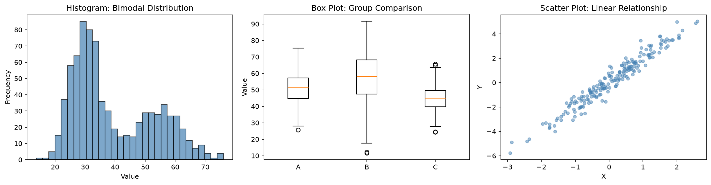
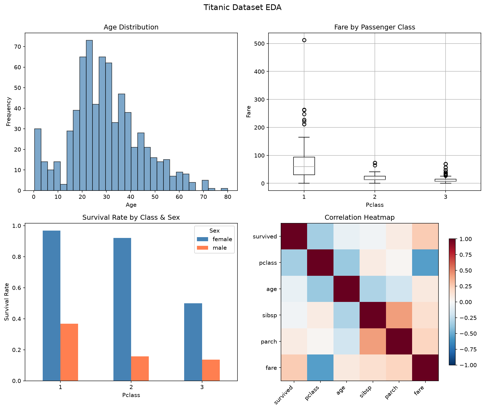

데이터 파일을 처음 건네받았을 때 가장 먼저 하는 일은 MLE를 돌리는 것도, 가설검정을 설계하는 것도 아니다. 열이 몇 개인지, 결측이 얼마나 되는지, 분포가 어떤 모양인지 들여다보는 것이다.

평균과 표준편차 몇 개로 요약해 넘어가면 이봉 분포도, 뒤틀린 꼬리도, 뒤섞인 두 모집단도 그대로 통과한다. **기술통계**(Descriptive Statistics)와 **탐색적 데이터 분석**(Exploratory Data Analysis, EDA)은 그 통과를 막는 절차다.

## EDA란 무엇인가

EDA라는 용어를 처음 체계화한 사람은 통계학자 John Tukey다. 1977년 저서 *Exploratory Data Analysis*에서 그는 가설을 미리 세워 검증하기보다 데이터가 드러내는 패턴을 먼저 관찰하라고 주장했다. 가설을 세우고 검정하는 **확인적 분석**(Confirmatory Data Analysis, CDA)과 대비되는 접근이다.

| 구분 | 확인적 분석(CDA) | 탐색적 분석(EDA) |
|------|----------------|----------------|
| **목적** | 사전 가설의 검증 | 패턴 발견, 가설 생성 |
| **방법** | 통계 검정, 신뢰구간 | 시각화, 기술통계, 요약 |
| **순서** | 가설 → 데이터 수집 → 검정 | 데이터 관찰 → 패턴 발견 → 가설 제안 |
| **비유** | 재판(유죄/무죄 판결) | 수사(단서 수집, 용의자 탐색) |

EDA는 한 번 하고 끝나는 단계가 아니다. 모델링 중 잔차가 이상하게 보이면 다시 돌아가고, 특성 공학 후에도, 새 데이터가 들어와도 반복한다.

## 중심 경향 측도

| 측도 | 정의 | 특징 |
|------|------|------|
| **평균(Mean)** | 모든 값의 합 / 개수 | 모든 데이터를 반영하지만, 이상치에 민감 |
| **중앙값(Median)** | 정렬 후 가운데 값 | 이상치에 강건(robust) |
| **최빈값(Mode)** | 가장 빈도가 높은 값 | 범주형에도 적용 가능, 연속형에서는 잘 안 씀 |

세 측도의 차이가 극명해지는 경우를 보자.

```python
import numpy as np

# 연봉 데이터 (단위: 만원)
salaries = np.array([3000, 3200, 3500, 3800, 4000, 4200, 4500, 5000, 12000, 50000])

print(f"평균: {np.mean(salaries):,.0f}만원")     # 평균: 9,320만원
print(f"중앙값: {np.median(salaries):,.0f}만원")  # 중앙값: 4,100만원
```

평균은 9,320만원이지만 10명 중 8명은 5,000만원 이하를 받는다. 상위 두 명의 극단적 고연봉이 평균을 끌어올린 것이다. 소득·부동산·페이지뷰처럼 **오른쪽 꼬리가 긴**(right-skewed) 데이터에서는 중앙값이 훨씬 정직한 대표값이다.

## 산포도 측도

중심만으로는 부족하다. 평균이 같은 두 데이터셋이 전혀 다른 분포를 가질 수 있기 때문이다.

```python
import numpy as np

A = np.array([48, 49, 50, 51, 52])
B = np.array([10, 30, 50, 70, 90])

for name, data in [("A", A), ("B", B)]:
    print(f"[{name}] 평균={np.mean(data):.1f}, "
          f"표준편차={np.std(data, ddof=1):.1f}, "
          f"IQR={np.percentile(data, 75) - np.percentile(data, 25):.1f}")
# [A] 평균=50.0, 표준편차=1.6, IQR=2.0
# [B] 평균=50.0, 표준편차=31.6, IQR=40.0
```

| 측도 | 수식 | 이상치 민감도 |
|------|------|-------------|
| **분산(Variance)** | $s^2 = \frac{1}{n-1}\sum(x_i - \bar{x})^2$ | 높음 (제곱 때문) |
| **표준편차(Std)** | $s = \sqrt{s^2}$ | 높음 |
| **IQR** | Q3 − Q1 (75번째 − 25번째 백분위) | 낮음 (중앙 50%만 사용) |
| **범위(Range)** | max − min | 매우 높음 (극값 2개에 의존) |

IQR은 이상치 판정에도 쓰인다. $Q_1 - 1.5 \times IQR$보다 작거나 $Q_3 + 1.5 \times IQR$보다 큰 값을 이상치 후보로 본다. 정규분포라면 이 범위 밖에 놓일 확률이 약 0.7%이므로, 그보다 자주 나타나면 꼬리가 두껍거나 다른 무언가가 섞여 있다는 뜻이다. 박스플롯의 수염 길이가 바로 이 규칙이다.

## 분포의 형태: 왜도와 첨도

평균과 표준편차가 같더라도 분포의 **모양** 자체가 다를 수 있다.

**왜도(Skewness)** 는 비대칭 정도를 측정한다. 0이면 좌우 대칭이고, 양수면 오른쪽 꼬리가 길며(소득, 페이지뷰), 음수면 왼쪽 꼬리가 길다(만점 근처에 몰리는 시험 점수).

**첨도(Kurtosis)** 는 꼬리의 두꺼운 정도를 측정한다. 정규분포를 기준(0)으로 삼는 **초과 첨도**(Excess Kurtosis)를 주로 쓰며, 양수면 극단값이 정규분포보다 자주 발생하고 음수면 드물다. `scipy.stats.kurtosis`는 `fisher=True`가 기본값이라 초과 첨도를 반환하고, pandas의 `.kurt()`도 마찬가지다.

```python
import numpy as np
from scipy import stats

np.random.seed(42)
normal_data = np.random.normal(50, 10, 10000)
skewed_data = np.random.exponential(10, 10000)

print(f"정규분포  왜도={stats.skew(normal_data):.3f}, "
      f"첨도={stats.kurtosis(normal_data):.3f}")
print(f"지수분포  왜도={stats.skew(skewed_data):.3f}, "
      f"첨도={stats.kurtosis(skewed_data):.3f}")
# 정규분포  왜도=0.002, 첨도=0.026
# 지수분포  왜도=1.997, 첨도=5.819
```

지수분포의 이론값은 왜도 2, 초과 첨도 6이고 표본값이 여기에 가깝게 나온다.

:::info

**첨도는 "뾰족함"이 아니다**

첨도를 "분포가 뾰족한 정도"로 설명하는 교재가 많지만 부정확하다. 첨도가 높은 분포는 중심이 뾰족한 것이 아니라 **꼬리가 두꺼운** 것이다. 금융 데이터의 "fat tail"이 바로 높은 첨도이며, 정규분포를 가정한 리스크 모델이 극단적 사건을 과소평가하는 이유도 여기에 있다.

:::

## 시각화 도구 모음

숫자만으로는 부족하다. Anscombe의 quartet은 평균과 상관계수, 회귀직선이 소수점 둘째 자리까지 같고 분산도 셋째 자리에서야 갈리면서, 시각화하면 완전히 다른 모양이 나오는 네 데이터셋을 일부러 만들어낸 예시다.

| 도구 | 용도 | 적합한 상황 |
|------|------|-----------|
| **히스토그램** | 단일 변수의 분포 형태 | 연속형 변수의 전체 분포 파악 |
| **박스플롯** | 중앙값, IQR, 이상치 요약 | 그룹 간 분포 비교, 이상치 탐지 |
| **바이올린 플롯** | 박스플롯 + 밀도 추정 | 분포의 세부 형태까지 비교 |
| **산점도** | 두 변수 간 관계 | 상관관계, 군집, 비선형 패턴 |
| **상관 히트맵** | 다변량 상관 행렬 | 변수 간 관계의 전체 조망 |



*왼쪽부터 히스토그램(이봉 분포), 박스플롯(그룹 비교), 산점도(선형 관계)*

봉우리가 두 개인 분포는 평균·표준편차·상관계수 어느 것으로도 드러나지 않는다. 히스토그램 하나면 즉시 보인다.

## Python 실습: 타이타닉 데이터셋 EDA

```python
import pandas as pd
import seaborn as sns

df = sns.load_dataset('titanic')
print(f"행: {df.shape[0]}, 열: {df.shape[1]}")
# 행: 891, 열: 15
```

891행 15열이다. 분석에 쓸 연속형은 `age`와 `fare`, 정수 계수형은 `sibsp`와 `parch`다. 나머지는 범주형인데, 그중 상당수가 다른 열의 다른 표현이다. `alive`는 `survived`를 문자열로 옮긴 것이고, `class`는 `pclass`를, `embark_town`은 `embarked`를, `alone`은 `sibsp + parch == 0`을 옮긴 것이다. `who`와 `adult_male`은 `sex`와 `age`에서 파생됐다. 이런 열을 그대로 모델에 넣으면 같은 정보가 중복으로 들어간다.

### 1단계: 결측치 확인

```python
missing = df.isnull().sum()
missing_pct = (missing / len(df) * 100).round(1)
missing_df = pd.DataFrame({'결측수': missing, '비율(%)': missing_pct})
print(missing_df[missing_df['결측수'] > 0])
# age          177   19.9
# embarked       2    0.2
# deck         688   77.2
# embark_town    2    0.2
```

`deck`은 77%가 결측이라 분석에서 빼는 것이 합리적이고, `age`는 19.9%를 어떻게 처리할지 전략이 필요하다. `embarked`는 2건뿐이라 최빈값 대체나 삭제로 끝난다.

### 2단계: 기술통계 요약

```python
print(df[['age', 'fare']].describe().round(2))
# age:  mean 29.70, std 14.53, min 0.42, max 80.00
# fare: mean 32.20, std 49.69, min 0.00, max 512.33

print(f"생존율: {df['survived'].mean():.1%}")   # 생존율: 38.4%
```

`fare`의 표준편차(49.69)가 평균(32.20)보다 크다는 점에 주목하라. 극단적으로 비대칭인 분포라는 신호다. 대다수는 저렴한 3등석이었고, 소수의 1등석 요금이 평균을 끌어올렸다.

### 3단계: 그룹별 비교

```python
print(df.groupby('sex')['survived'].mean().round(3))
# female    0.742
# male      0.189

print(df.groupby('pclass')['survived'].mean().round(3))
# 1    0.630
# 2    0.473
# 3    0.242
```

여성의 생존율(74.2%)이 남성(18.9%)보다 압도적으로 높고, 1등석(63.0%)이 3등석(24.2%)보다 두 배 이상 높다. "Women and children first" 원칙과 사회경제적 요인이 함께 작용했다.

### 4단계: 시각화 종합



*타이타닉 데이터셋 EDA. 나이 분포, 등급별 요금, 성별×등급 생존율, 상관 히트맵*

상관 히트맵에서 `pclass`와 `fare`의 음의 상관(-0.55)이 눈에 띈다. 등급 숫자가 작을수록(1등석) 요금이 높으니 자연스러운 결과다. `survived`와 `fare`의 양의 상관(0.26)은 비싼 표를 산 승객일수록 생존 확률이 높았다는 패턴을 반영한다.

## EDA 체크리스트

| 단계 | 확인 항목 | 핵심 함수/도구 |
|------|----------|--------------|
| **1. 구조 파악** | 행/열 수, 데이터 타입, 컬럼명 | `df.shape`, `df.dtypes`, `df.info()` |
| **2. 결측치** | 컬럼별 결측 비율, 결측 패턴(MCAR/MAR/MNAR) | `df.isnull().sum()` |
| **3. 기술통계** | 평균, 중앙값, 표준편차, 사분위수 | `df.describe()` |
| **4. 분포 확인** | 왜도, 첨도, 히스토그램 | `df.skew()`, `df.kurt()` |
| **5. 이상치** | 1.5×IQR 규칙, 도메인 기반 판단 | 박스플롯, Z-score |
| **6. 변수 간 관계** | 상관계수, 산점도, 교차표 | `df.corr()`, 히트맵 |

매 단계에서 "이 데이터에서 무엇이 이상한가, 무엇이 기대와 다른가"를 묻지 않으면 출력만 쌓이고 발견은 없다.

## 흔한 실수 두 가지

**이상치를 무조건 제거하기.** 이상치를 발견하면 반사적으로 삭제하는 경우가 많지만, 세 가지로 구분해야 한다.

- **입력 오류**: 나이가 -5세, 키가 300cm. 수정하거나 제거한다.
- **자연적 극단값**: 빌 게이츠의 연봉. 제거하면 안 되고, 분석 목적에 따라 판단한다.
- **다른 모집단**: 봇 트래픽이 섞인 웹 로그. 분리해서 별도로 분석한다.

무조건 제거하면 정보가 사라지고, 무조건 유지하면 모델이 왜곡된다. 도메인 지식에 기반한 판단이 필요하다.

**상관관계를 인과로 해석하기.** 상관계수가 높다고 해서 하나가 다른 하나의 원인인 것은 아니다. 아이스크림 판매량과 익사 사고 건수가 양의 상관을 보이지만, 아이스크림이 익사를 유발하는 것이 아니라 **기온**이라는 교란변수가 둘 다에 영향을 미친다. 인과를 추론하려면 무작위 통제 실험(RCT)이나 인과 추론 프레임워크가 필요하다. EDA에서 발견한 상관관계는 추가 조사가 필요한 가설이지 결론이 아니다.

## 마치며

기술통계 지표는 분포를 요약하지만 분포를 대신하지 못한다. 비대칭 분포에서는 평균보다 중앙값이, 이상치가 있을 때는 표준편차보다 IQR이 정직하다. 그리고 어떤 요약값 조합도 이봉 분포나 Anscombe의 quartet을 구분하지 못한다.

숫자와 그림을 항상 쌍으로 보는 것, 그것이 EDA에서 지켜야 할 최소한의 규율이다.

## 함께 보면 좋은 글

- [확률변수와 기댓값](/stats/random-variables-expectation/)
- [연속 확률분포](/stats/continuous-distributions/)
- [표본 추출과 편향](/stats/sampling-and-bias/)
- [가설검정](/stats/hypothesis-testing/)

## 참고자료

- Tukey, J.W. *Exploratory Data Analysis*. Addison-Wesley, 1977. (EDA 개념을 체계화한 고전)
- Wickham, H. & Grolemund, G. *R for Data Science* (2nd ed.). O'Reilly, 2023. (EDA 워크플로의 실전적 안내)
- VanderPlas, J. *Python Data Science Handbook*. O'Reilly, 2016. (pandas + matplotlib EDA 실습)
- McKinney, W. *Python for Data Analysis* (3rd ed.). O'Reilly, 2022. (pandas 창시자의 데이터 분석 가이드)
- [seaborn documentation](https://seaborn.pydata.org/)
