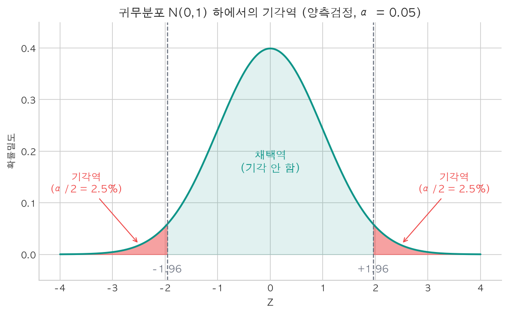
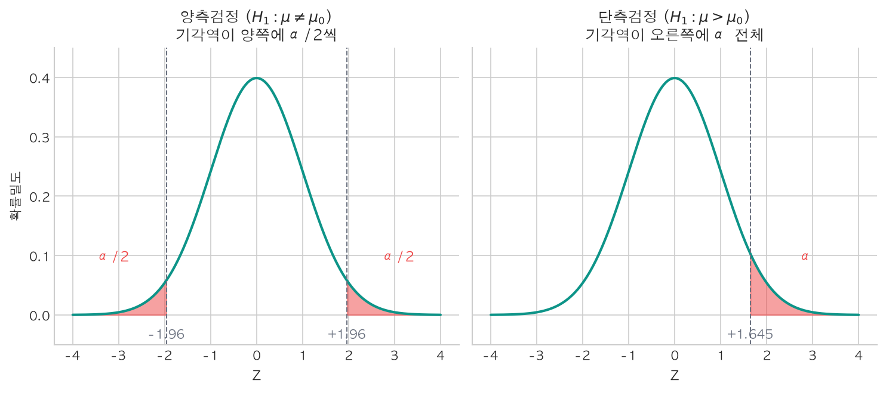
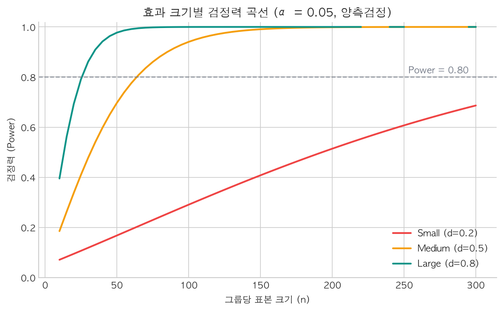

[이전 글](/stats/confidence-intervals/)에서 신뢰구간을 다뤘다. "모수 $\theta$가 이 구간 안에 있을 것이다"라는 구간추정은 점추정의 불확실성을 정량화하는 강력한 도구였다. 그런데 한 가지 자연스러운 질문이 떠오른다 — <strong>만약 우리가 주장하는 특정 값 $\theta_0$이 신뢰구간 밖에 있다면, 그 주장을 기각해도 되는 걸까?</strong>

"이 약은 효과가 없다", "새 알고리즘의 전환율은 기존과 같다", "이 동전은 공정하다" — 이런 주장을 데이터에 기반해 **체계적으로 판단하는 프레임워크**가 바로 **가설검정**(Hypothesis Testing)이다. 통계적 추론에서 가장 널리 쓰이면서도, 동시에 가장 오해가 많은 개념이기도 하다.

---

## 가설검정이란?

### 두 개의 가설

가설검정은 두 개의 상충하는 가설을 설정하는 것에서 시작한다.

| 가설 | 기호 | 의미 | 역할 |
|---|---|---|---|
| **귀무가설**(Null Hypothesis) | $H_0$ | 현재 상태, 효과 없음, 차이 없음 | "기각 대상" — 반증하고 싶은 주장 |
| **대립가설**(Alternative Hypothesis) | $H_1$ (또는 $H_a$) | 연구자가 주장하고 싶은 것 | 증거가 충분할 때 채택 |

예를 들어, 새로운 추천 알고리즘이 기존보다 클릭률(CTR)을 높이는지 확인하고 싶다면:

$$H_0: \mu_{\text{new}} = \mu_{\text{old}} \quad \text{vs} \quad H_1: \mu_{\text{new}} > \mu_{\text{old}}$$

여기서 핵심적인 비대칭이 있다. <strong>$H_0$은 "참이라고 가정"하는 것이지, "참이라고 믿는" 것이 아니다.</strong> 검찰이 피고인의 무죄를 추정하는 것과 같다 — 충분한 증거가 있을 때만 유죄(기각)를 선고한다.

### 검정 통계량

가설이 세워지면 다음 단계는 데이터를 하나의 숫자로 요약하는 **검정 통계량**(Test Statistic)의 계산이다. 검정 통계량은 $H_0$이 참일 때 알려진 분포를 따르도록 설계된 함수다.

대표적인 예로, 모평균 검정에서 모분산 $\sigma^2$을 알 때의 Z-통계량:

$$Z = \frac{\bar{X} - \mu_0}{\sigma / \sqrt{n}}$$

$H_0: \mu = \mu_0$이 참이라면, [중심극한정리](/stats/lln-and-clt/)에 의해 $Z \sim N(0, 1)$을 따른다. 이 분포가 검정 논리의 토대가 된다.

:::info

**💡 검정 통계량의 핵심 성질**

검정 통계량은 반드시 "**$H_0$이 참일 때의 분포**"가 알려져 있어야 한다. Z-통계량은 표준정규분포, t-통계량은 t-분포, 카이제곱 통계량은 $\chi^2$-분포를 따른다. 이 귀무분포(null distribution)가 있어야 "이 데이터가 얼마나 극단적인가"를 판단할 수 있다.

:::

### 논리 구조: 귀류법

가설검정의 논리는 수학의 **귀류법**(Proof by Contradiction)과 정확히 같은 구조를 갖는다.

| 단계 | 귀류법 | 가설검정 |
|---|---|---|
| 1 | 명제 A가 거짓이라 가정 | $H_0$이 참이라 가정 |
| 2 | 논리적 모순 도출 | 관측 데이터가 $H_0$ 하에서 나올 확률이 극히 낮음을 확인 |
| 3 | 따라서 A는 참 | 따라서 $H_0$을 기각 |

이 논리를 단계별로 풀어보면:

1. <strong>$H_0$이 참이라고 가정</strong>한다 ($\mu = \mu_0$)
2. 이 가정 하에서 검정 통계량의 분포를 계산한다 ($Z \sim N(0, 1)$)
3. 실제 데이터로 검정 통계량의 관측값 $z_{\text{obs}}$를 계산한다
4. <strong>$z_{\text{obs}}$가 귀무분포에서 극단적인 위치에 있다면</strong> → $H_0$ 가정과 데이터가 양립하기 어렵다 → $H_0$을 **기각**한다

"극단적"의 기준은 <strong>유의수준(Significance Level, $\alpha$)</strong>으로 미리 정한다. 보통 $\alpha = 0.05$를 사용하는데, 이는 "$H_0$이 참일 때 기각할 확률을 5% 이하로 유지하겠다"는 뜻이다.


<p align="center" style="color: #888; font-size: 13px;"><em>귀무분포 N(0,1) 하에서의 기각역. 임계값 ±1.96 바깥의 빨간 영역이 기각역이다.</em></p>

관측된 $z_{\text{obs}}$가 $|z_{\text{obs}}| > 1.96$이면 기각역에 속하므로 $H_0$을 기각한다.

:::warning

**⚠️ 주의: "기각하지 않음" ≠ "$H_0$이 참"**

$H_0$을 기각하지 않았다고 해서 $H_0$이 참이라는 뜻은 아니다. 단지 "**$H_0$을 기각할 만큼 충분한 증거가 없다**"는 것이다. "증거 불충분으로 무죄"이지 "결백이 증명됨"이 아닌 것과 같다.

:::

---

## p-value의 정의와 해석

### 정확한 정의

p-value는 가설검정에서 가장 중요하면서도 가장 오해받는 개념이다.

> **p-value**: $H_0$이 참이라는 가정 하에서, 관측된 검정 통계량만큼 또는 그보다 더 극단적인 값이 나올 확률.

수식으로 쓰면, 양측검정의 경우:

$$p\text{-value} = P(|Z| \geq |z_{\text{obs}}| \mid H_0 \text{ 참})$$

p-value가 작다는 것은 "$H_0$이 참인 세계에서 이런 데이터는 매우 드물다"는 뜻이다. 따라서 <strong>p-value $\leq \alpha$이면 $H_0$을 기각</strong>한다.

### 흔한 오해 3가지

| 오해 | 왜 틀린가 |
|---|---|
| "p-value는 $H_0$이 참일 확률이다" | p-value는 **데이터에 대한 확률**이지, 가설에 대한 확률이 아니다. $P(\text{data} \mid H_0)$이지 $P(H_0 \mid \text{data})$가 아니다. |
| "p = 0.03이면 $H_0$이 틀릴 확률이 97%다" | 위와 같은 오류. 사후 확률은 베이즈 정리 없이는 계산할 수 없다. |
| "p = 0.8이면 $H_0$이 참이다" | 높은 p-value는 $H_0$에 대한 증거가 아니다. 단지 기각할 근거가 부족할 뿐이다. |

:::info

**💡 p-value를 한 문장으로**

"$H_0$이 참인 세상에서 이 데이터(또는 더 극단적인 데이터)를 관측할 확률" — 이것이 p-value의 전부다. 이 확률이 너무 작으면($\leq \alpha$), "$H_0$이 참인 세상"이라는 가정 자체를 의심하는 것이다.

:::

### Python으로 p-value 계산

```python
import numpy as np
from scipy import stats

# 예제: 어떤 공장의 볼트 평균 길이가 10cm인지 검정
# H₀: μ = 10  vs  H₁: μ ≠ 10  (양측검정)
np.random.seed(5)
n = 36
mu_0 = 10.0          # 귀무가설 하의 모평균
sigma = 2.0          # 모표준편차 (알려져 있다고 가정)

# 실제로는 μ = 10.8인 모집단에서 추출
sample = np.random.normal(10.8, sigma, size=n)
x_bar = np.mean(sample)

# Z-통계량 계산
z_obs = (x_bar - mu_0) / (sigma / np.sqrt(n))

# 양측 p-value
p_value = 2 * (1 - stats.norm.cdf(abs(z_obs)))

print(f"표본 평균: {x_bar:.4f}")
print(f"Z-통계량:  {z_obs:.4f}")
print(f"p-value:   {p_value:.6f}")
print(f"결론 (α=0.05): {'H₀ 기각' if p_value < 0.05 else 'H₀ 기각 실패'}")
# 표본 평균: 10.7658
# Z-통계량:  2.2973
# p-value:   0.021602
# 결론 (α=0.05): H₀ 기각
```

Z = 2.30으로 임계값 1.96을 넘겼고, p-value = 0.022 < 0.05이므로 $H_0$을 기각한다. 표본 평균 10.77은 $\mu_0 = 10$과 통계적으로 유의한 차이를 보인다.

---

## 유의수준(α)과 기각역

### α의 의미

위 예제에서 0.05라는 기준은 어디서 온 것일까? <strong>유의수준 $\alpha$</strong>는 검정 전에 연구자가 설정하는 **1종 오류의 허용 한계**로, "$H_0$이 참인데 실수로 기각할 확률을 최대 $\alpha$로 제한하겠다"는 선언이다.

$\alpha = 0.05$는 관행이지 자연법칙이 아니다. 분야에 따라 기준은 달라진다:

| 분야 | 일반적인 $\alpha$ | 이유 |
|---|---|---|
| 탐색적 연구 | 0.10 | 놓치는 것보다 발견이 중요 |
| 일반 사회과학 | 0.05 | 관행 (Fisher의 제안) |
| 입자물리학 | $3 \times 10^{-7}$ (5σ) | 잘못된 발견의 비용이 극도로 큼 |
| 유전체 연구 | $5 \times 10^{-8}$ | 수백만 번의 동시 검정 보정 |

### 양측 검정 vs 단측 검정

대립가설의 방향에 따라 기각역의 위치가 달라진다.


<p align="center" style="color: #888; font-size: 13px;"><em>양측검정은 α를 양쪽 꼬리에 나눠 배치하고(임계값 ±1.96), 단측검정은 한쪽에 α 전체를 배치한다(임계값 1.645).</em></p>

단측 검정은 한쪽에 $\alpha$ 전체를 몰아넣으므로 임계값이 낮아진다 (1.96 → 1.645). 같은 데이터에서 기각이 더 쉬워지지만, 반대 방향의 효과는 감지할 수 없다는 트레이드오프가 있다.

:::warning

**⚠️ 단측 검정 남용 금지**

데이터를 본 후에 방향을 정해서 단측 검정을 하는 것은 p-hacking의 한 형태다. **검정 방향은 데이터를 보기 전에 결정**해야 한다. A/B 테스트에서 "새 버전이 더 나을 것이다"라는 사전 가설이 명확할 때만 단측 검정을 쓴다.

:::

---

## 1종 오류와 2종 오류

$\alpha$를 설정한다는 것은 곧 **틀릴 가능성을 감수한다**는 뜻이다. 가설검정이 이분법적 결정인 이상, 두 가지 종류의 오류는 피할 수 없다.

| | <strong>$H_0$ 참 (효과 없음)</strong> | <strong>$H_1$ 참 (효과 있음)</strong> |
|---|---|---|
| <strong>$H_0$ 기각 안 함</strong> | 올바른 결정 (확률 $1-\alpha$) | <strong>2종 오류</strong> (확률 $\beta$) — 놓침 |
| <strong>$H_0$ 기각</strong> | <strong>1종 오류</strong> (확률 $\alpha$) — 거짓 경보 | 올바른 결정 (확률 $1-\beta$) — <strong>검정력</strong> |

### 재판 비유

| 가설검정 | 재판 |
|---|---|
| $H_0$: 무죄 | 무죄 추정 원칙 |
| $H_0$ 기각 → 유죄 판결 | 증거가 충분해야 유죄 선고 |
| 1종 오류 | 무고한 사람에게 유죄 선고 |
| 2종 오류 | 범인을 무죄 방면 |
| $\alpha$를 낮춤 | 유죄 판결 기준을 엄격하게 → 억울한 사람 줄지만, 범인 놓칠 가능성 ↑ |

재판 비유가 잘 보여주듯, **1종 오류와 2종 오류 사이에는 근본적인 트레이드오프**가 존재한다. $\alpha$를 줄여 기각 기준을 엄격하게 잡으면 1종 오류는 감소하지만, 그만큼 2종 오류($\beta$)가 커진다. 두 오류를 동시에 줄이는 유일한 방법은 표본 크기 $n$을 늘리는 것뿐이다.

실제로 $H_0$이 참인 모집단에서 표본을 뽑아 검정하는 과정을 10,000번 시뮬레이션해 보면, $H_0$을 기각하는 비율은 0.0548로 이론값 $\alpha = 0.05$에 수렴한다. 이것이 유의수준의 의미다. <strong>$H_0$이 참일 때 기각할 확률이 $\alpha$로 제어된다.</strong>

---

## 검정력(Power)

### 정의

2종 오류를 $\beta$라 했을 때, 그 여사건인 **검정력**(Power)은 $H_1$이 참일 때 $H_0$을 올바르게 기각할 확률이다.

$$\text{Power} = 1 - \beta = P(\text{H}_0 \text{ 기각} \mid H_1 \text{ 참})$$

검정력이 낮으면 실제 효과가 있어도 발견하지 못한다. 일반적으로 <strong>Power $\geq 0.80$</strong>을 목표로 한다 (즉, 효과가 있을 때 80% 이상의 확률로 탐지).

### 검정력에 영향을 미치는 세 가지 요인

그렇다면 검정력을 높이려면 어떤 레버를 당길 수 있을까?

**1. 효과 크기(Effect Size)**: 실제 모수 $\mu$와 $\mu_0$의 차이가 클수록 탐지가 쉽다.

<strong>2. 표본 크기($n$)</strong>: $n$이 커지면 표준오차 $\sigma/\sqrt{n}$이 줄어들어, 같은 효과도 더 선명하게 드러난다.

<strong>3. 유의수준($\alpha$)</strong>: $\alpha$를 높이면 기각역이 넓어져서 검정력이 올라가지만, 1종 오류도 함께 증가한다.

세 요인이 실제로 얼마나 영향을 주는지 보자. $n = 50$, $\alpha = 0.05$(양측)로 고정하고 효과 크기만 바꾸면서 검정력을 계산하면(statsmodels의 `NormalIndPower` 사용) 다음과 같다.

| 효과 크기 (Cohen's d) | 검정력 |
|---|---|
| 0.1 | 0.079 |
| 0.2 | 0.170 |
| 0.3 | 0.323 |
| 0.5 | 0.705 |
| 0.8 | **0.979** |

효과 크기 0.2에서는 검정력이 17%에 불과하지만, 0.8이 되면 98%에 달한다. 작은 효과를 탐지하려면 표본 크기를 크게 늘려야 한다.

### 필요 표본 크기 계산

실무에서 가장 빈번하게 마주치는 질문은 이것이다: "원하는 검정력을 달성하려면 $n$이 얼마나 필요한가?"

```python
from statsmodels.stats.power import TTestIndPower

power_analysis = TTestIndPower()

# 두 그룹 평균 비교 (A/B 테스트)
# 효과 크기 0.3, α=0.05, Power=0.80 달성에 필요한 각 그룹 표본 크기
required_n = power_analysis.solve_power(
    effect_size=0.3, alpha=0.05, power=0.80,
    ratio=1.0, alternative='two-sided'
)

print(f"필요 표본 크기 (각 그룹): {required_n:.0f}")
print(f"총 필요 표본:             {2 * required_n:.0f}")
# 필요 표본 크기 (각 그룹): 175
# 총 필요 표본:             351
```

효과 크기 0.3을 감지하려면 각 그룹에 175명, 총 351명이 필요하다. A/B 테스트 설계 시 이 계산을 실험 시작 전에 반드시 수행해야 하는 이유가 여기 있다 — 표본이 부족한 상태에서 검정을 돌리면, 실제 효과가 존재해도 발견하지 못하는 **검정력 부족(underpowered)** 문제에 빠지게 된다.

### 검정력 곡선

표본 크기에 따른 검정력의 변화를 시각화하면 다음과 같다.


<p align="center" style="color: #888; font-size: 13px;"><em>효과 크기별 검정력 곡선 (α = 0.05, 양측검정). 점선은 목표 검정력 0.80.</em></p>

큰 효과(d=0.8)는 $n \approx 25$만으로도 80% 검정력을 달성하지만, 작은 효과(d=0.2)는 $n \approx 400$이 필요하다. 이것이 검정력 분석의 핵심 메시지다 — **탐지하려는 효과가 작을수록 데이터가 훨씬 많이 필요하다.**

---

## 신뢰구간과 가설검정의 쌍대성

지금까지 가설검정의 내부 구조를 살펴봤는데, 이전 글에서 배운 [신뢰구간](/stats/confidence-intervals/)과는 어떤 관계일까? 사실 이 둘은 동전의 양면이다.

### 동치 관계

$100(1-\alpha)\%$ 신뢰구간을 $\text{CI}$라 하면:

$$\theta_0 \notin \text{CI} \quad \Longleftrightarrow \quad \text{유의수준 } \alpha \text{에서 } H_0: \theta = \theta_0 \text{ 기각}$$

직관적으로, 95% 신뢰구간이 $[10.2, 11.3]$인데 $H_0: \mu = 10$을 검정하면? $10 \notin [10.2, 11.3]$이므로 $\alpha = 0.05$에서 기각된다.

앞서 p-value 예제에서 쓴 볼트 데이터(표본 평균 10.77)로 직접 확인할 수 있다. 95% 신뢰구간을 계산하면 $[10.11, 11.42]$인데, $\mu_0 = 10$은 이 구간 밖에 있다. 동시에 p-value는 0.022로 $\alpha = 0.05$보다 작아 $H_0$이 기각된다. 둘은 항상 같은 결론을 낸다.

:::info

**💡 실무적 함의**

신뢰구간이 가설검정보다 더 많은 정보를 준다. 가설검정은 "기각/기각 안 함"의 이분법이지만, 신뢰구간은 **효과의 방향과 크기**까지 보여준다. 논문이나 리포트에서는 p-value와 함께 신뢰구간을 반드시 보고하는 것이 좋다.

:::

---

## 완전한 가설검정 예제: Z-검정과 t-검정

지금까지의 예제에서는 모분산 $\sigma^2$을 안다고 가정했지만, 실무에서는 $\sigma^2$을 모르는 경우가 대부분이다. 이때 $\sigma$를 표본 표준편차 $s$로 대체하면, 검정 통계량은 Z-분포 대신 **t-분포**를 따르게 된다.

$$t = \frac{\bar{X} - \mu_0}{s / \sqrt{n}} \sim t(n-1)$$

Python에서는 `scipy.stats.ttest_1samp`으로 한 줄이면 충분하다.

```python
# 사례: 커피숍 음료 제조 시간이 평균 3분인지 검정
# H₀: μ = 3  vs  H₁: μ ≠ 3
np.random.seed(123)
prep_times = np.random.normal(3.4, 0.8, size=25)  # 실제 평균 3.4분

# One-sample t-test
t_stat, p_value = stats.ttest_1samp(prep_times, popmean=3.0)

# 신뢰구간 직접 계산
n = len(prep_times)
x_bar = np.mean(prep_times)
se = stats.sem(prep_times)
t_crit = stats.t.ppf(0.975, df=n-1)
ci = (x_bar - t_crit * se, x_bar + t_crit * se)

print(f"표본 크기: {n}")
print(f"표본 평균: {x_bar:.4f}")
print(f"표본 표준편차: {np.std(prep_times, ddof=1):.4f}")
print(f"t-통계량: {t_stat:.4f}")
print(f"p-value:  {p_value:.6f}")
print(f"95% CI:   [{ci[0]:.4f}, {ci[1]:.4f}]")
print(f"결론:     {'H₀ 기각 — 평균 제조 시간은 3분과 유의하게 다르다'
                   if p_value < 0.05 else 'H₀ 기각 실패'}")
# 표본 크기: 25
# 표본 평균: 3.5121
# 표본 표준편차: 0.9854
# t-통계량: 2.5984
# p-value:  0.015760
# 95% CI:   [3.1053, 3.9188]
# 결론:     H₀ 기각 — 평균 제조 시간은 3분과 유의하게 다르다
```

t-통계량 2.60, p-value 0.016 < 0.05이므로 $H_0$을 기각한다. 95% 신뢰구간 $[3.11, 3.92]$에 3.0이 포함되지 않는 것도 동일한 결론이다. [점추정](/stats/point-estimation/)에서 배운 표본 평균 $\bar{X} = 3.51$이 단일 숫자라면, 여기서는 그 추정값이 $\mu_0 = 3$과 **통계적으로 유의하게 다른지** 판단한 것이다.

---

## 흔한 실수와 함정

가설검정은 강력하지만, 잘못 사용하면 오히려 잘못된 확신을 심어줄 수 있다. 실무에서 가장 빈번한 함정 세 가지를 짚어 보자.

### 1. p-hacking

여러 변수를 탐색하면서 p < 0.05인 것만 보고하는 행위다. 20개 변수를 검정하면 효과가 전혀 없어도 평균 1개는 "유의"하게 나온다 ($0.05 \times 20 = 1$).

실제로 효과가 전혀 없는 두 그룹을 만들어 독립적인 t-검정을 20번 반복하는 시뮬레이션을 돌려 보면, 그중 1개에서 p = 0.0117이라는 "유의한" 결과가 나온다. 물론 거짓 양성이다. 이 20개 중 유의한 1개만 골라 보고하면 없는 효과를 만들어낼 수 있다. p-hacking의 다양한 수법과 방어책은 [통계적 함정](/stats/statistical-pitfalls/) 글에서 시뮬레이션과 함께 자세히 다룬다.

### 2. 다중 검정 보정

다중 검정 문제를 해결하는 가장 간단한 방법은 **Bonferroni 보정**이다: $m$번의 검정을 수행할 때, 유의수준을 $\alpha/m$으로 낮춘다.

$$\alpha_{\text{adjusted}} = \frac{\alpha}{m} = \frac{0.05}{20} = 0.0025$$

더 정교한 방법으로는 **Benjamini-Hochberg** 절차(FDR 제어)가 있다.

### 3. "유의하다" ≠ "중요하다"

통계적 유의성(Statistical Significance)과 실질적 유의성(Practical Significance)을 혼동해서는 안 된다.

$n$이 충분히 크면 아무리 작은 차이도 "통계적으로 유의"하게 만들 수 있다. 예를 들어, A/B 테스트에서 전환율이 2.001%에서 2.003%로 올랐다면? p < 0.05일 수 있지만, 0.002%p 차이가 사업적으로 의미 있는지는 전혀 별개의 문제다.

이것이 **효과 크기**(Effect Size)를 함께 보고해야 하는 이유다. Cohen's d, 오즈비(Odds Ratio), 상관계수 등 효과 크기 지표는 "차이가 얼마나 큰가"를 p-value와 독립적으로 알려준다.

:::warning

**⚠️ 보고 원칙**

결과를 보고할 때는 반드시 세 가지를 함께 적어야 한다:
1. **p-value** (통계적 유의성)
2. **효과 크기** (실질적 유의성)
3. **신뢰구간** (추정의 불확실성)

"p = 0.03이므로 유의하다"만으로는 불충분하다.

:::

---

## 마치며

이 글에서 다룬 가설검정의 전체 절차를 한눈에 정리하면 다음과 같다.

1. **가설 설정**: $H_0: \theta = \theta_0$ vs $H_1: \theta \neq \theta_0$ (또는 $>$, $<$)
2. **유의수준 설정**: 보통 $\alpha = 0.05$
3. **검정 통계량 선택 및 계산**: 예를 들어 $Z = (\bar{X} - \mu_0) / (\sigma/\sqrt{n})$
4. **p-value 계산 또는 기각역 확인**: p-value $\leq \alpha$이면 기각, 아니면 기각 실패
5. **결론 보고**: 기각 여부와 함께 효과 크기, 신뢰구간을 반드시 함께 보고

각 단계에서 핵심은 결국 하나로 귀결된다 — $H_0$이 참이라 가정했을 때, 데이터가 그 가정과 양립하기 어려울 정도로 극단적이면 $H_0$을 기각한다는 귀류법적 논리다.

다만 이 프레임워크를 올바르게 사용하려면, p-value의 의미를 정확히 이해하고, 통계적 유의성과 실질적 유의성을 구분하며, 실험 전 검정력을 충분히 확보해야 한다. 0.05라는 숫자에 집착하기보다 효과 크기와 신뢰구간을 종합적으로 판단하는 습관이 훨씬 중요하다.

이번 글에서는 가설검정의 **논리 구조와 기초 개념**에 집중했다. [다음 글](/stats/statistical-tests/)에서는 이 프레임워크 위에서 실제로 사용하는 **t-검정, ANOVA, 카이제곱 검정** 등 구체적인 검정 방법들을 다룬다. 어떤 상황에서 어떤 검정을 선택해야 하는지, 각 검정의 가정과 한계는 무엇인지 하나씩 짚어볼 것이다.

---

## 참고자료

- Casella, G. & Berger, R. L. (2002). *Statistical Inference*, 2nd Edition. Cengage Learning. Chapter 8.
- Wasserman, L. (2004). *All of Statistics*. Springer. Chapter 10.
- Cohen, J. (1988). *Statistical Power Analysis for the Behavioral Sciences*, 2nd Edition. Lawrence Erlbaum.
- American Statistical Association (2016). "Statement on Statistical Significance and P-Values." *The American Statistician*, 70(2), 129–133.
- Greenland, S. et al. (2016). "Statistical tests, P values, confidence intervals, and power: a guide to misinterpretations." *European Journal of Epidemiology*, 31, 337–350.
