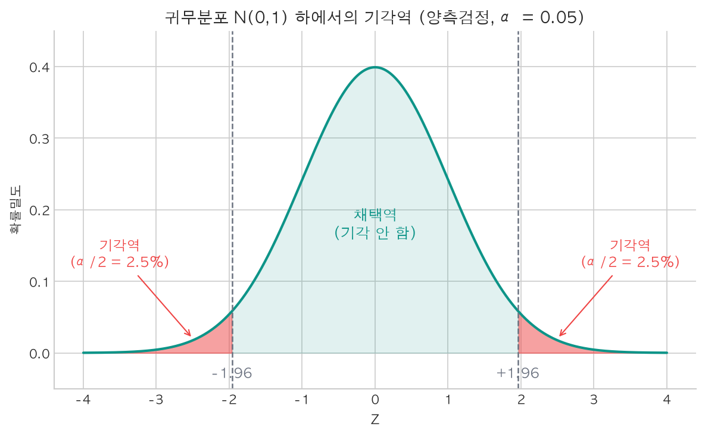
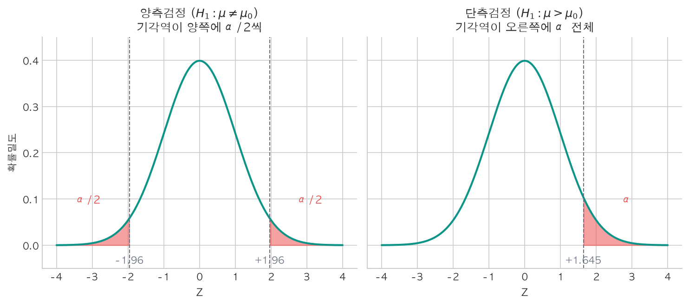
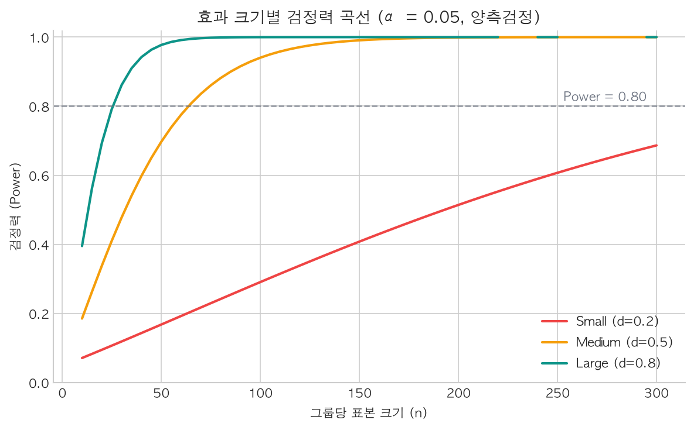

"이 약은 효과가 없다", "새 알고리즘의 전환율은 기존과 같다", "이 동전은 공정하다". 이런 주장을 데이터에 기반해 판정하는 절차가 **가설검정**(Hypothesis Testing)이다.

통계적 추론에서 가장 널리 쓰이면서 가장 자주 잘못 읽히는 도구이기도 하다. p-value를 "귀무가설이 참일 확률"로 읽는 오해가 대표적이다.

## 가설검정이란?

### 두 개의 가설

가설검정은 두 개의 상충하는 가설을 설정하는 것에서 시작한다.

| 가설 | 기호 | 의미 | 역할 |
|---|---|---|---|
| **귀무가설**(Null Hypothesis) | $H_0$ | 현재 상태, 효과 없음, 차이 없음 | 기각 대상. 반증하고 싶은 주장 |
| **대립가설**(Alternative Hypothesis) | $H_1$ (또는 $H_a$) | 연구자가 주장하고 싶은 것 | 증거가 충분해 $H_0$을 기각했을 때 지지되는 쪽 |

예를 들어 새로운 추천 알고리즘이 기존보다 클릭률(CTR)을 높이는지 확인하고 싶다면:

$$H_0: \mu_{\text{new}} = \mu_{\text{old}} \quad \text{vs} \quad H_1: \mu_{\text{new}} > \mu_{\text{old}}$$

여기서 핵심적인 비대칭이 있다. **$H_0$은 "참이라고 가정"하는 것이지 "참이라고 믿는" 것이 아니다.** 재판에서 무죄를 추정하는 것과 같다. 충분한 증거가 있을 때만 유죄(기각)를 선고한다.

### 검정 통계량

가설이 세워지면 다음 단계는 데이터를 하나의 숫자로 요약하는 **검정 통계량**(Test Statistic)의 계산이다. 검정 통계량은 $H_0$이 참일 때의 분포, 즉 귀무분포(null distribution)가 알려져 있도록 설계된 함수다. 이 분포가 있어야 "이 데이터가 얼마나 극단적인가"를 판단할 수 있다.

대표적인 예로 모평균 검정에서 모분산 $\sigma^2$을 알 때의 Z-통계량:

$$Z = \frac{\bar{X} - \mu_0}{\sigma / \sqrt{n}}$$

$H_0: \mu = \mu_0$이 참이라면 중심극한정리에 의해 $Z \sim N(0, 1)$을 따른다.

### 논리 구조: 귀류법

가설검정의 논리는 수학의 **귀류법**(Proof by Contradiction)과 같은 구조를 갖는다.

| 단계 | 귀류법 | 가설검정 |
|---|---|---|
| 1 | 명제 A가 거짓이라 가정 | $H_0$이 참이라 가정 |
| 2 | 논리적 모순 도출 | 관측 데이터가 $H_0$ 하에서 나올 확률이 극히 낮음을 확인 |
| 3 | 따라서 A는 참 | 따라서 $H_0$을 기각 |

"극단적"의 기준은 유의수준(Significance Level, $\alpha$)으로 데이터를 보기 전에 정한다.



*귀무분포 N(0,1) 하에서의 기각역. 임계값 ±1.96 바깥의 빨간 영역이 기각역이다.*

관측된 $z_{\text{obs}}$가 $|z_{\text{obs}}| > 1.96$이면 기각역에 속하므로 $H_0$을 기각한다.

:::warning

**주의: "기각하지 않음"은 "$H_0$이 참"이 아니다**

$H_0$을 기각하지 않았다고 해서 $H_0$이 참이라는 뜻은 아니다. 단지 **$H_0$을 기각할 만큼 충분한 증거가 없다**는 것이다. "증거 불충분으로 무죄"이지 "결백이 증명됨"이 아닌 것과 같다.

:::

## p-value의 정의와 해석

> **p-value**: $H_0$이 참이라는 가정 하에서, 관측된 검정 통계량만큼 또는 그보다 더 극단적인 값이 나올 확률.

수식으로 쓰면 양측검정의 경우:

$$p\text{-value} = P(|Z| \geq |z_{\text{obs}}| \mid H_0 \text{ 참})$$

p-value가 작다는 것은 "$H_0$이 참인 세계에서 이런 데이터는 매우 드물다"는 뜻이다. 따라서 **p-value $\leq \alpha$이면 $H_0$을 기각**한다. 확률이 걸린 대상이 가설이 아니라 데이터라는 점이 모든 오해의 갈림길이다.

### 흔한 오해 3가지

| 오해 | 왜 틀린가 |
|---|---|
| "p-value는 $H_0$이 참일 확률이다" | p-value는 **데이터에 대한 확률**이지 가설에 대한 확률이 아니다. $P(\text{data} \mid H_0)$이지 $P(H_0 \mid \text{data})$가 아니다. |
| "p = 0.03이면 $H_0$이 틀릴 확률이 97%다" | 위와 같은 오류. 사후 확률은 베이즈 정리 없이는 계산할 수 없다. |
| "p = 0.8이면 $H_0$이 참이다" | 높은 p-value는 $H_0$에 대한 증거가 아니다. 단지 기각할 근거가 부족할 뿐이다. |

### Python으로 p-value 계산

```python
import numpy as np
from scipy import stats

# 어떤 공장의 볼트 평균 길이가 10cm인지 검정
# H₀: μ = 10  vs  H₁: μ ≠ 10  (양측검정)
np.random.seed(5)
n, mu_0, sigma = 36, 10.0, 2.0

sample = np.random.normal(10.8, sigma, size=n)   # 실제로는 μ = 10.8
x_bar = np.mean(sample)

z_obs = (x_bar - mu_0) / (sigma / np.sqrt(n))
p_value = 2 * (1 - stats.norm.cdf(abs(z_obs)))

print(f"표본 평균: {x_bar:.4f}, Z: {z_obs:.4f}, p-value: {p_value:.6f}")
# 표본 평균: 10.7658, Z: 2.2973, p-value: 0.021602
```

Z = 2.30으로 임계값 1.96을 넘겼고 p-value = 0.022 < 0.05이므로 $H_0$을 기각한다.

## 유의수준(α)과 기각역

**유의수준 $\alpha$**는 검정 전에 연구자가 설정하는 **1종 오류의 허용 한계**로, "$H_0$이 참인데 실수로 기각할 확률을 최대 $\alpha$로 제한하겠다"는 선언이다.

$\alpha = 0.05$는 관행이지 자연법칙이 아니다. 분야에 따라 기준은 달라진다.

| 분야 | 일반적인 $\alpha$ | 이유 |
|---|---|---|
| 탐색적 연구 | 0.10 | 놓치는 것보다 발견이 중요 |
| 일반 사회과학 | 0.05 | 관행 (Fisher의 제안) |
| 입자물리학 | $3 \times 10^{-7}$ (5σ) | 잘못된 발견의 비용이 극도로 큼 |
| 유전체 연구 | $5 \times 10^{-8}$ | 수백만 번의 동시 검정 보정 |

### 양측 검정 vs 단측 검정

대립가설의 방향에 따라 기각역의 위치가 달라진다.



*양측검정은 α를 양쪽 꼬리에 나눠 배치하고(임계값 ±1.96), 단측검정은 한쪽에 α 전체를 배치한다(임계값 1.645).*

단측 검정은 한쪽에 $\alpha$ 전체를 몰아넣으므로 임계값이 낮아진다(1.96에서 1.645로). 같은 데이터에서 기각이 더 쉬워지지만 반대 방향의 효과는 감지할 수 없다는 트레이드오프가 있다.

:::warning

**단측 검정 남용 금지**

데이터를 본 후에 방향을 정해서 단측 검정을 하는 것은 p-hacking의 한 형태다. **검정 방향은 데이터를 보기 전에 결정**해야 한다. A/B 테스트에서 "새 버전이 더 나을 것이다"라는 사전 가설이 명확할 때만 단측 검정을 쓴다.

:::

## 1종 오류와 2종 오류

가설검정이 이분법적 결정인 이상 두 가지 종류의 오류는 피할 수 없다.

| | **$H_0$ 참 (효과 없음)** | **$H_1$ 참 (효과 있음)** |
|---|---|---|
| **$H_0$ 기각 안 함** | 올바른 결정 (확률 $1-\alpha$) | **2종 오류** (확률 $\beta$), 놓침 |
| **$H_0$ 기각** | **1종 오류** (확률 $\alpha$), 거짓 경보 | 올바른 결정 (확률 $1-\beta$), **검정력** |

$\alpha$를 낮추는 것은 유죄 판결 기준을 엄격하게 잡는 것과 같다. 무고한 유죄(1종 오류)는 줄지만 범인을 놓칠 확률(2종 오류)은 커진다. 두 오류를 동시에 줄이는 유일한 방법은 표본 크기 $n$을 늘리는 것이다.

실제로 $H_0$이 참인 모집단에서 표본을 뽑아 검정하는 과정을 10,000번 시뮬레이션하면 $H_0$을 기각하는 비율은 0.0548로 이론값 $\alpha = 0.05$ 근처에 머문다. **$H_0$이 참일 때 기각할 확률이 $\alpha$로 제어된다**는 것이 유의수준의 의미다.

## 검정력(Power)

2종 오류를 $\beta$라 했을 때 그 여사건인 **검정력**(Power)은 $H_1$이 참일 때 $H_0$을 올바르게 기각할 확률이다.

$$\text{Power} = 1 - \beta = P(\text{H}_0 \text{ 기각} \mid H_1 \text{ 참})$$

검정력이 낮으면 실제 효과가 있어도 발견하지 못한다. 일반적으로 **Power $\geq 0.80$**을 목표로 한다.

### 검정력에 영향을 미치는 세 가지 요인

1. **효과 크기(Effect Size)**: 실제 모수 $\mu$와 $\mu_0$의 차이가 클수록 탐지가 쉽다.
2. **표본 크기($n$)**: $n$이 커지면 표준오차 $\sigma/\sqrt{n}$이 줄어들어 같은 효과도 더 선명하게 드러난다.
3. **유의수준($\alpha$)**: $\alpha$를 높이면 기각역이 넓어져 검정력이 올라가지만 1종 오류도 함께 증가한다.

두 집단 비교에서 **각 그룹 50명**($n_1 = n_2 = 50$, 총 100명), $\alpha = 0.05$ 양측으로 고정하고 효과 크기만 바꾸면 검정력은 다음과 같이 움직인다.

| 효과 크기 (Cohen's d) | 검정력 |
|---|---|
| 0.1 | 0.079 |
| 0.2 | 0.170 |
| 0.3 | 0.323 |
| 0.5 | 0.705 |
| 0.8 | **0.979** |

### 필요 표본 크기 계산

실무에서 가장 빈번한 질문은 "원하는 검정력을 달성하려면 $n$이 얼마나 필요한가?"이다. 위 표는 모분산을 아는 경우의 정규 근사(`NormalIndPower`)로 계산했는데, 실제로는 모분산을 모르고 표본에서 추정하므로 자유도를 반영한 t 기반 계산(`TTestIndPower`)을 쓴다. 표본이 어느 정도 크면 두 결과는 거의 같다.

```python
from statsmodels.stats.power import TTestIndPower

power_analysis = TTestIndPower()

# 효과 크기 0.3, α=0.05, Power=0.80 달성에 필요한 각 그룹 표본 크기
required_n = power_analysis.solve_power(
    effect_size=0.3, alpha=0.05, power=0.80,
    ratio=1.0, alternative='two-sided'
)

print(f"필요 표본 크기 (각 그룹): {required_n:.0f}")
print(f"총 필요 표본:             {2 * required_n:.0f}")
# 필요 표본 크기 (각 그룹): 175
# 총 필요 표본:             351
```

효과 크기 0.3을 감지하려면 각 그룹에 175명, 총 351명이 필요하다. 표본이 부족한 상태에서 검정을 돌리면 실제 효과가 존재해도 발견하지 못하는 **검정력 부족(underpowered)** 문제에 빠진다.



*효과 크기별 검정력 곡선 (α = 0.05, 양측검정). 점선은 목표 검정력 0.80.*

큰 효과(d=0.8)는 $n \approx 25$만으로도 80% 검정력을 달성하지만 작은 효과(d=0.2)는 $n \approx 400$이 필요하다. 탐지하려는 효과가 작을수록 데이터가 훨씬 많이 필요하다.

## 신뢰구간과 가설검정의 쌍대성

$100(1-\alpha)\%$ 신뢰구간을 $\text{CI}$라 하면 다음이 성립한다.

$$\theta_0 \notin \text{CI} \quad \Longleftrightarrow \quad \text{유의수준 } \alpha \text{에서 } H_0: \theta = \theta_0 \text{ 기각}$$

앞서 p-value 예제에서 쓴 볼트 데이터(표본 평균 10.77)로 확인할 수 있다. 95% 신뢰구간은 $[10.11, 11.42]$이고 $\mu_0 = 10$은 이 구간 밖에 있다. 동시에 p-value는 0.022로 $\alpha = 0.05$보다 작아 $H_0$이 기각된다. 둘은 항상 같은 결론을 낸다.

신뢰구간은 가설검정보다 더 많은 정보를 준다. 가설검정은 기각 여부의 이분법이지만 신뢰구간은 **효과의 방향과 크기**까지 보여준다.

## 흔한 실수와 함정

### 1. p-hacking

여러 변수를 탐색하면서 p < 0.05인 것만 보고하는 행위다. 20개 변수를 검정하면 효과가 전혀 없어도 평균 1개는 "유의"하게 나온다($0.05 \times 20 = 1$). 이 20개 중 유의한 1개만 골라 보고하면 없는 효과를 만들어낼 수 있다.

### 2. "유의하다"는 "중요하다"가 아니다

통계적 유의성(Statistical Significance)과 실질적 유의성(Practical Significance)은 다른 개념이다.

$n$이 충분히 크면 아무리 작은 차이도 통계적으로 유의하게 만들 수 있다. A/B 테스트에서 전환율이 2.001%에서 2.003%로 올랐다면 p < 0.05일 수 있지만, 0.002%p 차이가 사업적으로 의미 있는지는 전혀 별개의 문제다.

이것이 **효과 크기**(Effect Size)를 함께 보고해야 하는 이유다. Cohen's d, 오즈비(Odds Ratio), 상관계수 등 효과 크기 지표는 "차이가 얼마나 큰가"를 p-value와 독립적으로 알려준다.

:::warning

**보고 원칙**

결과를 보고할 때는 세 가지를 함께 적어야 한다.

1. **p-value** (통계적 유의성)
2. **효과 크기** (실질적 유의성)
3. **신뢰구간** (추정의 불확실성)

"p = 0.03이므로 유의하다"만으로는 불충분하다.

:::

## 마치며

가설검정의 전체 절차는 다섯 단계로 정리된다.

1. **가설 설정**: $H_0: \theta = \theta_0$ vs $H_1: \theta \neq \theta_0$ (또는 $>$, $<$)
2. **유의수준 설정**: 보통 $\alpha = 0.05$
3. **검정 통계량 선택 및 계산**: 예를 들어 $Z = (\bar{X} - \mu_0) / (\sigma/\sqrt{n})$
4. **p-value 계산 또는 기각역 확인**: p-value $\leq \alpha$이면 기각
5. **결론 보고**: 기각 여부와 함께 효과 크기, 신뢰구간을 함께 보고

프레임워크를 올바르게 쓰려면 p-value의 의미를 정확히 이해하고, 통계적 유의성과 실질적 유의성을 구분하며, 실험 전 검정력을 확보해야 한다.

## 함께 보면 좋은 글

- [신뢰구간(Confidence Interval)](/stats/confidence-intervals/)
- [t-검정, ANOVA, 카이제곱 검정](/stats/statistical-tests/)
- [통계적 함정](/stats/statistical-pitfalls/)
- [점추정(Point Estimation)](/stats/point-estimation/)

## 참고자료

- Casella, G. & Berger, R. L. (2002). *Statistical Inference*, 2nd Edition. Cengage Learning. Chapter 8.
- Wasserman, L. (2004). *All of Statistics*. Springer. Chapter 10.
- Cohen, J. (1988). *Statistical Power Analysis for the Behavioral Sciences*, 2nd Edition. Lawrence Erlbaum.
- American Statistical Association (2016). "Statement on Statistical Significance and P-Values." *The American Statistician*, 70(2), 129-133.
- Greenland, S. et al. (2016). "Statistical tests, P values, confidence intervals, and power: a guide to misinterpretations." *European Journal of Epidemiology*, 31, 337-350.
