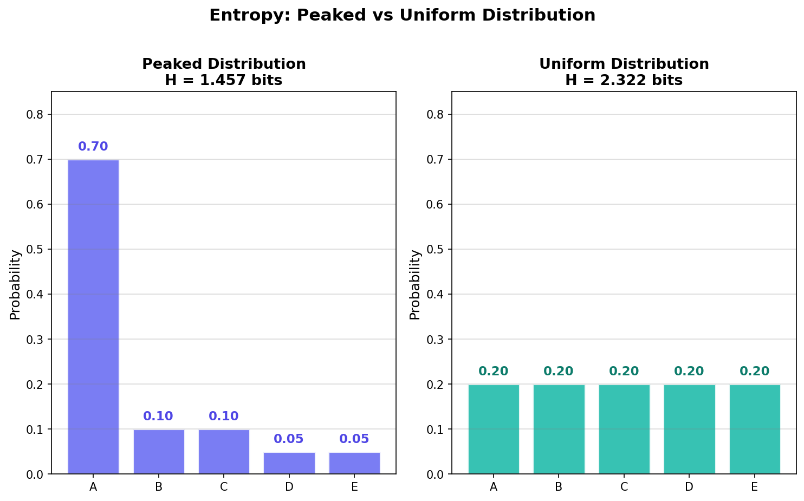
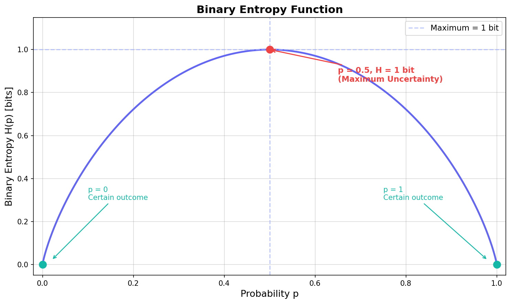
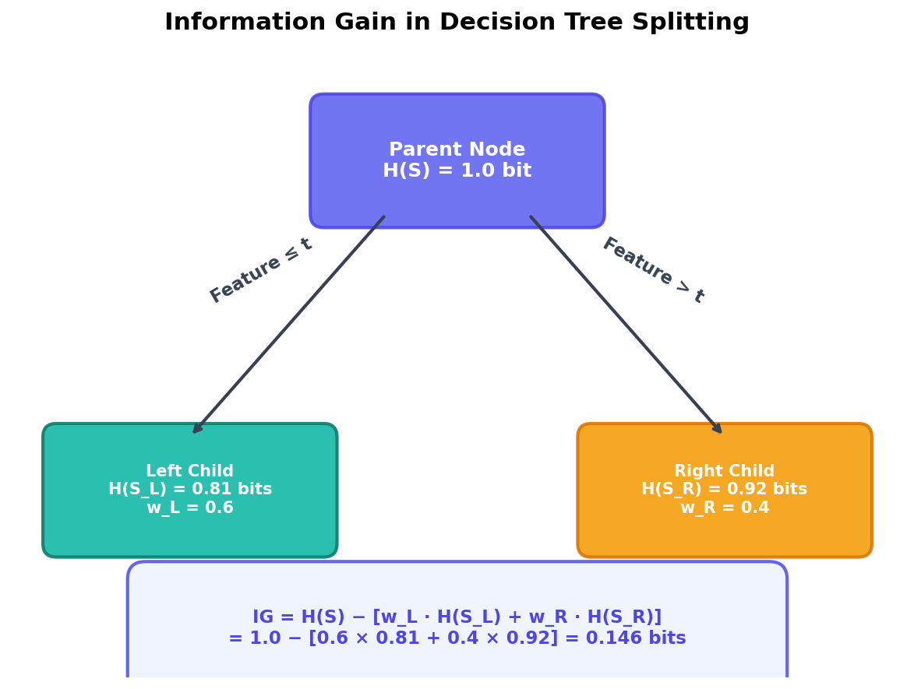
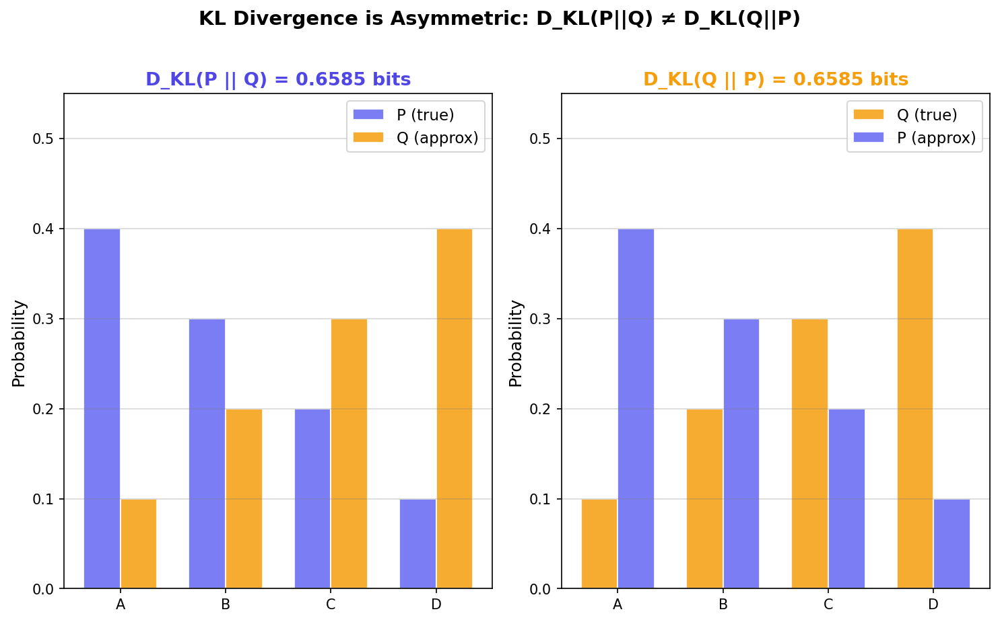
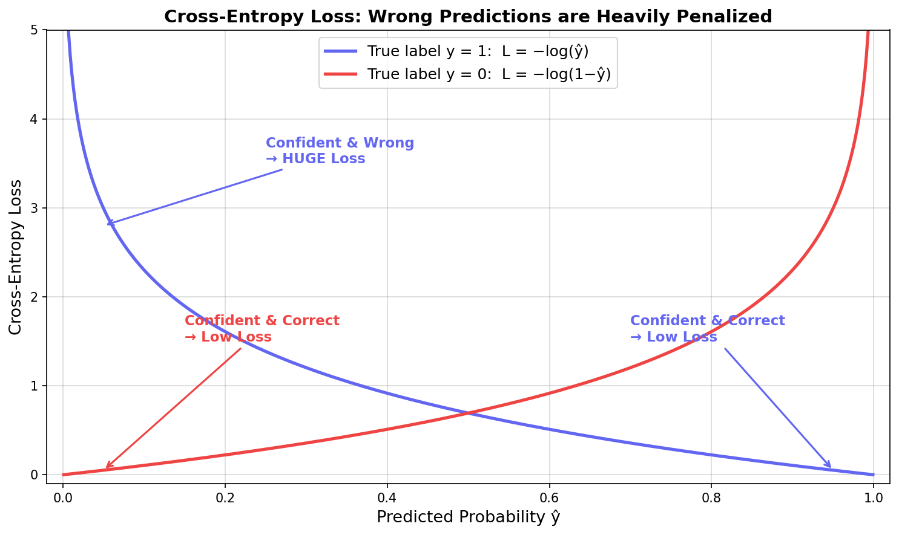
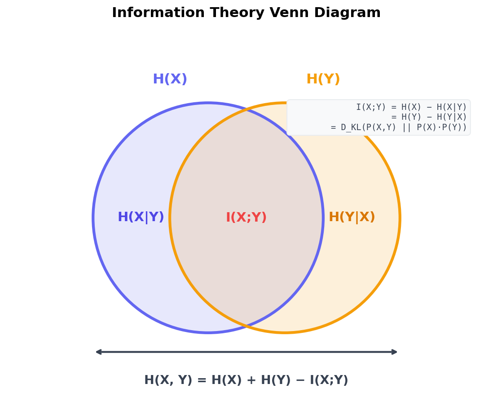

## 들어가며: ML/DL 곳곳에 숨어 있는 정보이론

[결정 트리](/ml/decision-tree/)를 공부하다 보면 **Information Gain**이 등장하고, [로지스틱 회귀](/ml/logistic-regression/)에서는 **Cross-Entropy Loss**가 당연하다는 듯 쓰인다. LLM 논문을 읽으면 **Perplexity**라는 지표가 모델 성능을 평가하고, VAE 논문에서는 **KL Divergence**가 ELBO의 핵심 항으로 자리잡고 있다. 이 개념들은 모두 하나의 뿌리에서 나왔다 — 바로 **정보이론(Information Theory)**이다.

1948년 클로드 섀넌(Claude Shannon)이 발표한 "A Mathematical Theory of Communication"은 통신 공학을 위한 이론이었지만, 그 수학적 도구들은 70년이 지난 지금 머신러닝과 딥러닝의 근간이 되었다. [이전 글](/stats/lln-and-clt/)까지 다져온 확률론 위에, 이번 글에서 정보이론의 핵심 개념을 하나씩 쌓아 올려보자.

이 글을 끝까지 읽고 나면, Cross-Entropy Loss가 왜 그런 형태인지, KL Divergence가 무엇을 측정하는지, 그리고 이 모든 것이 어떻게 연결되는지 명확하게 이해하게 될 것이다.

---

## 정보량(Self-Information): 놀라움을 숫자로

### 확률이 낮을수록 정보가 크다

"내일 해가 뜬다"는 뉴스를 들었을 때와 "내일 서울에 눈이 3미터 쌓인다"는 뉴스를 들었을 때, 어느 쪽이 더 많은 **정보**를 전달하는가? 당연히 후자다. 확률이 낮은 사건이 발생했다는 소식은 그만큼 **놀랍고**, 그 놀라움의 크기가 곧 정보의 양이다.

이 직관을 수식으로 표현한 것이 **정보량(Self-Information)**이다:

$$
I(x) = \log_2 \frac{1}{p(x)} = -\log_2 p(x)
$$

단위는 **비트(bit)**이다. 로그의 밑을 자연로그(ln)로 쓰면 단위가 **냇(nat)**이 되는데, 머신러닝에서는 주로 자연로그를 사용한다.

### 왜 로그인가?

로그를 사용하는 이유는 단순하지 않다. 정보량이 갖춰야 할 핵심 성질을 생각해 보자:

1. **확률이 낮을수록 정보가 많다**: $p(x)$가 작을수록 $I(x)$가 커야 한다.
2. **확실한 사건의 정보는 0이다**: $p(x) = 1$이면 $I(x) = 0$이어야 한다.
3. **독립 사건의 정보는 더해진다**: 동전을 두 번 던지는 것은 한 번 던지는 정보의 두 배여야 한다.

세 번째 조건이 핵심이다. 독립 사건 A, B의 결합 확률은 $p(A \cap B) = p(A) \cdot p(B)$인데, 정보량은 **곱이 아니라 합**이 되어야 한다. 곱셈을 덧셈으로 바꾸는 함수? 그것이 바로 로그다.

$$
I(A \cap B) = -\log_2[p(A) \cdot p(B)] = -\log_2 p(A) - \log_2 p(B) = I(A) + I(B)
$$

```python
import numpy as np

def self_information(p, base=2):
    """정보량 계산 (비트 단위)"""
    return -np.log(p) / np.log(base)

# 동전 던지기 (공정한 동전)
print(f"공정한 동전 앞면: {self_information(0.5):.2f} bits")      # 1.00 bits

# 주사위 (6면체)
print(f"주사위 특정 눈:   {self_information(1/6):.2f} bits")      # 2.58 bits

# 확실한 사건
print(f"확실한 사건:      {self_information(1.0):.2f} bits")      # 0.00 bits

# 희귀 사건 (1%)
print(f"1% 확률 사건:     {self_information(0.01):.2f} bits")     # 6.64 bits
```

공정한 동전의 앞면이 나왔다는 정보는 정확히 1비트다. 사실 비트(bit)라는 단위 자체가 "이진 선택 하나의 정보량"에서 유래한 것이다. 주사위의 특정 눈이 나왔다는 정보는 약 2.58비트 — 이진 질문 약 2~3개에 해당하는 정보량이다.

<div style="background: #f0f4ff; border-left: 4px solid #3182f6; padding: 16px 20px; margin: 20px 0; border-radius: 4px;"><strong>💡 참고</strong><br>로그의 밑에 따라 단위가 달라진다. base=2이면 비트(bit), base=e이면 냇(nat), base=10이면 하틀리(hartley)다. ML에서 손실 함수에 쓸 때는 주로 자연로그(nat)를 사용하는데, 밑이 달라져도 상수 배 차이일 뿐 본질은 같다.</div>

---

## 엔트로피(Entropy): 불확실성의 척도

### 평균 정보량 = 불확실성

정보량이 개별 사건의 "놀라움"이라면, **엔트로피(Entropy)**는 확률 분포 전체의 **평균 놀라움**, 즉 **불확실성**을 측정한다. 이산 확률 변수 $X$의 엔트로피는 다음과 같이 정의된다:

$$
H(X) = -\sum_{x \in \mathcal{X}} p(x) \log p(x) = \mathbb{E}[I(X)]
$$

정보량 $I(x)$의 기댓값이 바로 엔트로피다. 결국 "이 분포에서 사건 하나를 관측했을 때, 평균적으로 얼마나 놀라운가?"를 수치화한 것이다.

### 언제 엔트로피가 높고, 언제 낮은가?


<p align="center" style="color: #888; font-size: 13px;"><em>왼쪽: 한 값에 집중된 분포 (낮은 엔트로피) / 오른쪽: 균일 분포 (높은 엔트로피)</em></p>

핵심 직관은 간단하다:

- **균일 분포**: 모든 결과가 동등하게 가능하므로 불확실성이 최대 → **엔트로피 최대**
- **한 값에 집중된 분포**: 결과가 거의 확실하므로 불확실성이 낮음 → **엔트로피 낮음**
- **확정적 분포** ($p(x_0)=1$, 나머지 0): 불확실성이 없음 → **엔트로피 = 0**

```python
import numpy as np

def entropy(probs, base=2):
    """이산 확률 분포의 엔트로피 계산"""
    probs = np.array(probs)
    probs = probs[probs > 0]  # 0 log 0 = 0 (극한)
    return -np.sum(probs * np.log(probs)) / np.log(base)

# 균일 분포 (5개 값)
uniform = [0.2, 0.2, 0.2, 0.2, 0.2]
print(f"균일 분포: H = {entropy(uniform):.3f} bits")    # 2.322 bits

# 집중된 분포
peaked = [0.7, 0.1, 0.1, 0.05, 0.05]
print(f"집중 분포: H = {entropy(peaked):.3f} bits")     # 1.356 bits

# 확정적 분포
certain = [1.0, 0.0, 0.0, 0.0, 0.0]
print(f"확정 분포: H = {entropy(certain):.3f} bits")    # 0.000 bits

# 공정한 동전
fair_coin = [0.5, 0.5]
print(f"공정 동전: H = {entropy(fair_coin):.3f} bits")  # 1.000 bits
```

5개 값을 가진 균일 분포의 엔트로피는 $\log_2 5 \approx 2.322$ 비트다. 일반적으로 $n$개 값을 가진 균일 분포의 엔트로피는 $\log_2 n$이며, 이것이 해당 값의 개수에서 달성 가능한 **최대 엔트로피**다.

<div style="background: #fff3f0; border-left: 4px solid #ff6b6b; padding: 16px 20px; margin: 20px 0; border-radius: 4px;"><strong>⚠️ 주의</strong><br>$0 \cdot \log 0$은 수학적으로 정의되지 않지만, 극한 $\lim_{p \to 0^+} p \log p = 0$이므로 정보이론에서는 관례적으로 $0 \log 0 = 0$으로 정의한다. 코드에서는 확률이 0인 항을 필터링하면 된다.</div>

### 연속 확률 변수의 미분 엔트로피

연속 확률 변수의 경우 합(Σ)이 적분으로 바뀐다:

$$
h(X) = -\int_{-\infty}^{\infty} f(x) \log f(x) \, dx
$$

이를 **미분 엔트로피(Differential Entropy)**라 부른다. 이산 엔트로피와 달리 음수가 될 수 있다는 점이 다르다. 예를 들어 $\text{Uniform}(0, 1/2)$의 미분 엔트로피는 $\log(1/2) = -1$ 비트다. 이는 "연속 변수의 불확실성을 이산적으로 환산하면 음수가 나올 수 있다"는 뜻일 뿐, 물리적으로 문제가 되지는 않는다.

---

## 이진 엔트로피(Binary Entropy)와 결정 트리

### 이진 엔트로피 함수

확률 변수가 두 가지 결과만 가지는 경우 (성공 확률 $p$, 실패 확률 $1-p$), 엔트로피는 하나의 매개변수 $p$에 대한 함수로 깔끔하게 표현된다:

$$
H(p) = -p \log_2 p - (1-p) \log_2 (1-p)
$$


<p align="center" style="color: #888; font-size: 13px;"><em>이진 엔트로피 함수 — p=0.5에서 최대값 1비트에 도달한다</em></p>

그래프에서 확인할 수 있듯이:

- $p = 0$ 또는 $p = 1$: 결과가 확정 → $H = 0$
- $p = 0.5$: 최대 불확실성 → $H = 1$ 비트

이 함수가 [결정 트리](/ml/decision-tree/)에서 어떻게 쓰이는지 바로 살펴보자.

### Information Gain: 결정 트리의 분할 기준

결정 트리는 데이터를 분할할 때 "불확실성을 가장 많이 줄이는 특성"을 선택한다. 분할 전후의 엔트로피 차이가 바로 **정보 이득(Information Gain)**이다:

$$
\text{IG}(S, A) = H(S) - \sum_{v \in \text{Values}(A)} \frac{|S_v|}{|S|} H(S_v)
$$


<p align="center" style="color: #888; font-size: 13px;"><em>Information Gain = 부모 엔트로피에서 자식 노드의 가중 엔트로피를 뺀 값</em></p>

부모 노드의 불확실성에서, 분할 후 각 자식 노드의 가중 평균 불확실성을 빼면 "이 분할이 얼마나 불확실성을 줄였는가"를 알 수 있다. IG가 클수록 좋은 분할이다.

```python
import numpy as np

def information_gain(parent_probs, children_list, weights):
    """
    Information Gain 계산
    parent_probs: 부모 노드의 클래스 확률 리스트
    children_list: 각 자식 노드의 클래스 확률 리스트의 리스트
    weights: 각 자식 노드의 가중치 (비율)
    """
    def H(probs):
        probs = np.array(probs)
        probs = probs[probs > 0]
        return -np.sum(probs * np.log2(probs))

    parent_entropy = H(parent_probs)
    children_entropy = sum(w * H(c) for w, c in zip(weights, children_list))
    return parent_entropy - children_entropy

# 예시: 이메일 스팸 분류
# 부모: 50% 스팸, 50% 정상
parent = [0.5, 0.5]

# 분할 A: "무료" 단어 포함 여부
# 포함(60%): 80% 스팸, 20% 정상 → 잘 분리됨!
# 미포함(40%): 10% 스팸, 90% 정상
ig_a = information_gain(parent, [[0.8, 0.2], [0.1, 0.9]], [0.6, 0.4])
print(f"'무료' 단어 기준 분할: IG = {ig_a:.4f} bits")  # 0.3959

# 분할 B: 이메일 길이 기준 (별로 유용하지 않은 특성)
# 긴 이메일(50%): 45% 스팸, 55% 정상
# 짧은 이메일(50%): 55% 스팸, 45% 정상
ig_b = information_gain(parent, [[0.45, 0.55], [0.55, 0.45]], [0.5, 0.5])
print(f"이메일 길이 기준 분할: IG = {ig_b:.4f} bits")   # 0.0050

print(f"\n→ '무료' 단어 기준이 {ig_a/ig_b:.0f}배 더 유용한 분할!")
```

결과를 보면 "무료"라는 단어의 포함 여부가 이메일 길이보다 약 79배 더 유용한 분할 기준이라는 것을 IG가 정량적으로 알려준다. ID3, C4.5 같은 결정 트리 알고리즘이 바로 이 원리로 동작한다.

<div style="background: #f0fff4; border-left: 4px solid #51cf66; padding: 16px 20px; margin: 20px 0; border-radius: 4px;"><strong>✅ 팁</strong><br>scikit-learn의 <code>DecisionTreeClassifier(criterion='entropy')</code>로 설정하면 Information Gain 기반 분할을 사용한다. 기본값인 <code>'gini'</code>는 지니 불순도를 사용하는데, 실제 성능 차이는 대부분의 경우 미미하다.</div>

---

## 결합 엔트로피와 조건부 엔트로피

### 결합 엔트로피 H(X, Y)

두 확률 변수 $X$, $Y$를 동시에 고려했을 때의 불확실성이 **결합 엔트로피(Joint Entropy)**다:

$$
H(X, Y) = -\sum_{x} \sum_{y} p(x, y) \log p(x, y)
$$

두 변수가 독립이면 $H(X, Y) = H(X) + H(Y)$이다. 의존적이면 공유하는 정보가 있으므로 $H(X, Y) \leq H(X) + H(Y)$이다.

### 조건부 엔트로피 H(X|Y)

$Y$를 알았을 때 $X$에 대해 남아 있는 불확실성이 **조건부 엔트로피(Conditional Entropy)**다:

$$
H(X|Y) = -\sum_{x} \sum_{y} p(x, y) \log p(x|y) = H(X, Y) - H(Y)
$$

마지막 등식이 바로 **체인 룰(Chain Rule)**이다:

$$
H(X, Y) = H(Y) + H(X|Y) = H(X) + H(Y|X)
$$

직관적으로 풀어보면: "X와 Y의 결합 불확실성 = Y의 불확실성 + Y를 알고 난 뒤 X에 대해 남은 불확실성"이다. [조건부 확률](/stats/conditional-probability-bayes/)에서 $P(A, B) = P(B) \cdot P(A|B)$의 정보이론 버전이라고 생각하면 된다.

```python
import numpy as np

def joint_entropy(joint_probs, base=2):
    """결합 엔트로피 계산"""
    probs = np.array(joint_probs).flatten()
    probs = probs[probs > 0]
    return -np.sum(probs * np.log(probs)) / np.log(base)

def conditional_entropy(joint_probs, base=2):
    """H(X|Y) 계산 — joint_probs[i][j] = P(X=i, Y=j)"""
    joint = np.array(joint_probs)
    py = joint.sum(axis=0)  # Y의 주변 확률

    h = 0
    for j in range(joint.shape[1]):
        if py[j] > 0:
            for i in range(joint.shape[0]):
                if joint[i, j] > 0:
                    p_x_given_y = joint[i, j] / py[j]
                    h -= joint[i, j] * np.log(p_x_given_y) / np.log(base)
    return h

# 예시: 날씨(X)와 우산 소지(Y)
# X: 맑음, 비  /  Y: 우산 있음, 우산 없음
# P(맑음, 우산없음) = 0.4, P(맑음, 우산있음) = 0.1
# P(비, 우산없음) = 0.1,   P(비, 우산있음) = 0.4
joint = [[0.4, 0.1],   # 맑음: [우산없음, 우산있음]
         [0.1, 0.4]]   # 비:   [우산없음, 우산있음]

H_XY = joint_entropy(joint)
H_X_given_Y = conditional_entropy(joint)

# 주변 엔트로피
px = np.array(joint).sum(axis=1)
H_X = -np.sum(px[px > 0] * np.log2(px[px > 0]))

print(f"H(X)    = {H_X:.4f} bits")          # 날씨의 불확실성
print(f"H(X,Y)  = {H_XY:.4f} bits")         # 결합 불확실성
print(f"H(X|Y)  = {H_X_given_Y:.4f} bits")  # 우산을 알 때 날씨의 불확실성
print(f"→ Y를 알면 X의 불확실성이 {H_X - H_X_given_Y:.4f} bits 줄어든다!")
```

우산을 가지고 있는지 알면 날씨에 대한 불확실성이 줄어든다. 이 줄어드는 양 $H(X) - H(X|Y)$에 특별한 이름이 있는데, 뒤에서 다룰 **상호정보량(Mutual Information)**이다.

---

## KL 발산(KL Divergence): 두 분포 사이의 거리

### 정의: 하나의 분포로 다른 분포를 설명할 때의 비용

이제 정보이론에서 가장 중요한 개념 중 하나인 **KL 발산(Kullback-Leibler Divergence)**에 도달했다. 진짜 데이터 분포 $P$를 모델 분포 $Q$로 근사할 때, 얼마나 많은 정보를 잃는지 측정하는 도구다:

$$
D_{KL}(P \| Q) = \sum_{x} p(x) \log \frac{p(x)}{q(x)} = \mathbb{E}_{x \sim P}\left[\log \frac{p(x)}{q(x)}\right]
$$

연속 분포에서는 합이 적분으로 바뀐다:

$$
D_{KL}(P \| Q) = \int p(x) \log \frac{p(x)}{q(x)} \, dx
$$

### KL 발산의 핵심 성질

**1. 항상 0 이상이다 (Gibbs' Inequality)**

$$
D_{KL}(P \| Q) \geq 0, \quad \text{등호는 } P = Q \text{일 때만 성립}
$$

이 성질 덕분에 KL 발산은 "두 분포가 얼마나 다른지"의 척도로 쓸 수 있다. 0이면 두 분포가 완전히 같다는 뜻이다.

**2. 비대칭이다!**

$$
D_{KL}(P \| Q) \neq D_{KL}(Q \| P) \quad \text{(일반적으로)}
$$

이것이 KL 발산을 "거리(distance)"가 아닌 "발산(divergence)"이라고 부르는 이유다. 진짜 거리 함수(metric)라면 대칭이어야 하지만, KL 발산은 그렇지 않다.


<p align="center" style="color: #888; font-size: 13px;"><em>같은 두 분포 P와 Q에 대해 D_KL(P||Q)와 D_KL(Q||P)의 값이 다르다</em></p>

### 비대칭의 직관

$D_{KL}(P \| Q)$를 풀어서 읽으면: "진짜 분포 $P$에서 샘플을 뽑았을 때, $Q$를 사용해서 인코딩하면 추가로 필요한 비트 수"다. $P$에서 확률이 높은 영역에 $Q$가 낮은 확률을 부여하면 큰 페널티를 받는다.

반대로 $D_{KL}(Q \| P)$는 $Q$에서 샘플을 뽑았을 때 $P$로 인코딩하는 비용이므로, $Q$에서 확률이 높은 영역에 초점이 맞춰진다. 어느 분포의 관점에서 보느냐에 따라 결과가 달라지는 것이다.

```python
import numpy as np

def kl_divergence(p, q, base=np.e):
    """D_KL(P || Q) 계산"""
    p, q = np.array(p, dtype=float), np.array(q, dtype=float)
    # P(x) > 0인 곳에서만 계산 (Q(x) = 0이면 발산 → 무한대)
    mask = p > 0
    return np.sum(p[mask] * np.log(p[mask] / q[mask])) / np.log(base)

P = [0.4, 0.3, 0.2, 0.1]
Q = [0.1, 0.2, 0.3, 0.4]

kl_pq = kl_divergence(P, Q, base=2)
kl_qp = kl_divergence(Q, P, base=2)

print(f"D_KL(P || Q) = {kl_pq:.4f} bits")
print(f"D_KL(Q || P) = {kl_qp:.4f} bits")
print(f"차이: {abs(kl_pq - kl_qp):.4f} bits")
print(f"→ 비대칭! D_KL(P||Q) ≠ D_KL(Q||P)")

# P = Q일 때
R = [0.25, 0.25, 0.25, 0.25]
print(f"\nD_KL(R || R) = {kl_divergence(R, R, base=2):.4f} bits")  # 0
```

<div style="background: #fff3f0; border-left: 4px solid #ff6b6b; padding: 16px 20px; margin: 20px 0; border-radius: 4px;"><strong>⚠️ 주의</strong><br>$Q(x) = 0$인 곳에서 $P(x) > 0$이면 $D_{KL}(P \| Q) = \infty$가 된다. 실제 구현에서는 $Q$에 아주 작은 값(smoothing)을 더하거나, $P$의 support가 $Q$의 support에 포함되도록 보장해야 한다.</div>

---

## 교차 엔트로피(Cross-Entropy): 분류 손실 함수의 정체

### 정의: 잘못된 분포로 인코딩하는 비용

**교차 엔트로피(Cross-Entropy)**는 엔트로피와 KL 발산을 연결하는 다리다:

$$
H(P, Q) = -\sum_{x} p(x) \log q(x)
$$

이 식은 "진짜 분포 $P$에서 데이터가 발생하지만, 인코딩에는 분포 $Q$를 사용할 때 필요한 평균 비트 수"를 의미한다. 그리고 핵심 관계가 여기 있다:

$$
H(P, Q) = H(P) + D_{KL}(P \| Q)
$$

교차 엔트로피 = 진짜 엔트로피 + KL 발산. $H(P)$는 데이터 자체의 고유한 불확실성이므로 모델이 바꿀 수 없는 상수다. 따라서 **교차 엔트로피를 최소화하는 것은 KL 발산을 최소화하는 것과 동일하다**. 이것이 분류 모델의 손실 함수로 교차 엔트로피를 사용하는 근본적인 이유다.

### 분류 문제에서의 Cross-Entropy Loss

이진 분류에서 진짜 레이블이 $y \in \{0, 1\}$이고 모델의 예측 확률이 $\hat{y} = P(Y=1|x)$일 때, Cross-Entropy Loss는:

$$
\mathcal{L}_{CE} = -[y \log \hat{y} + (1 - y) \log(1 - \hat{y})]
$$

$N$개 샘플 전체의 평균을 내면 [로지스틱 회귀의 손실 함수](/ml/logistic-regression/)가 된다:

$$
J(\theta) = -\frac{1}{N} \sum_{i=1}^{N} [y_i \log \hat{y}_i + (1 - y_i) \log(1 - \hat{y}_i)]
$$

다중 클래스($K$개 클래스)로 확장하면:

$$
\mathcal{L}_{CE} = -\sum_{k=1}^{K} y_k \log \hat{y}_k
$$

여기서 $y_k$는 원-핫 인코딩된 진짜 레이블이므로, 정답 클래스 $c$에 대해서만 $-\log \hat{y}_c$가 남는다. 모델이 정답 클래스에 높은 확률을 부여할수록 손실이 줄어드는 구조다.

### 왜 MSE가 아닌 Cross-Entropy인가?

분류 문제에서 왜 평균제곱오차(MSE) 대신 Cross-Entropy를 쓰는가? 이 질문은 [손실 함수](/ml/cost-function/) 선택의 핵심이다. 두 가지 이유가 있다.


<p align="center" style="color: #888; font-size: 13px;"><em>교차 엔트로피 손실 — 틀린 예측에 대한 페널티가 급격히 증가한다</em></p>

**이유 1: 그래디언트 소실 방지**

시그모이드 활성화 + MSE 조합의 그래디언트를 구해보면:

$$
\frac{\partial \mathcal{L}_{MSE}}{\partial w} = (a - y) \cdot \sigma'(z) \cdot x
$$

시그모이드의 도함수 $\sigma'(z)$는 출력이 0이나 1에 가까울 때 거의 0에 수렴한다. 모델이 확신을 갖고 **틀린 예측**을 했을 때(가장 빨리 학습해야 할 때!) 오히려 그래디언트가 사라지는 것이다.

반면 시그모이드 + Cross-Entropy 조합의 그래디언트는:

$$
\frac{\partial \mathcal{L}_{CE}}{\partial w} = (a - y) \cdot x
$$

$\sigma'(z)$ 항이 깔끔하게 소거된다. 예측이 아무리 극단적이어도 그래디언트가 살아 있으므로, 모델이 크게 틀렸을 때 빠르게 교정할 수 있다.

**이유 2: 최대우도추정과의 연결**

Cross-Entropy Loss를 최소화하는 것은 베르누이 분포에 대한 **최대우도추정(MLE)**과 정확히 같다. [확률론의 관점](/stats/probability-fundamentals/)에서도 이론적으로 가장 자연스러운 선택인 셈이다.

```python
import numpy as np

def cross_entropy_loss(y_true, y_pred, epsilon=1e-15):
    """이진 교차 엔트로피 손실"""
    y_pred = np.clip(y_pred, epsilon, 1 - epsilon)  # log(0) 방지
    return -np.mean(y_true * np.log(y_pred) + (1 - y_true) * np.log(1 - y_pred))

def mse_loss(y_true, y_pred):
    """평균제곱오차 손실"""
    return np.mean((y_true - y_pred) ** 2)

# 시나리오: 진짜 레이블 = 1
y_true = np.array([1, 1, 1, 1])

# 케이스별 예측
predictions = [0.9, 0.7, 0.3, 0.01]
labels = ["자신있게 맞춤 (0.9)", "약간 맞춤 (0.7)",
          "약간 틀림 (0.3)", "자신있게 틀림 (0.01)"]

print("예측값        | CE Loss  | MSE Loss | CE/MSE 비율")
print("-" * 55)
for pred, label in zip(predictions, labels):
    y_p = np.array([pred])
    y_t = np.array([1])
    ce = cross_entropy_loss(y_t, y_p)
    mse = mse_loss(y_t, y_p)
    ratio = ce / mse if mse > 0 else float('inf')
    print(f"{label:22s} | {ce:.4f}  | {mse:.4f}  | {ratio:.1f}x")
```

코드를 실행해 보면, 모델이 자신 있게 틀렸을 때(예측 0.01, 정답 1) CE Loss는 MSE Loss보다 수십 배 더 큰 페널티를 부과한다. 이 "자비 없는" 페널티 구조가 분류 모델을 빠르고 효과적으로 학습시키는 비결이다.

<div style="background: #f8f9fa; border: 1px solid #e9ecef; padding: 20px; margin: 24px 0; border-radius: 8px;"><strong>📌 핵심 요약</strong><br><br><ul style="margin: 0; padding-left: 20px;"><li>Cross-Entropy Loss 최소화 = KL Divergence 최소화 = 모델 분포를 진짜 분포에 가깝게</li><li>시그모이드 + CE 조합: 그래디언트에서 σ'(z) 소거 → 그래디언트 소실 없음</li><li>시그모이드 + MSE 조합: σ'(z) 항이 남아 → 극단적 예측에서 학습 정체</li><li>CE Loss = 베르누이 분포의 음의 로그 우도 → MLE와 수학적으로 동치</li></ul></div>

---

## ML/DL에서의 정보이론 활용

정보이론의 개념들이 ML/DL의 어디에서 어떻게 쓰이는지 종합적으로 정리해 보자.

### (a) 결정 트리: Information Gain

앞서 다뤘듯이, 결정 트리는 엔트로피를 기반으로 최적의 분할을 찾는다. CART 알고리즘은 지니 불순도를, ID3/C4.5는 Information Gain(엔트로피 기반)을 사용한다. 두 방법의 성능 차이는 미미하지만, 수학적 근거는 정보이론에서 나온다.

### (b) 로지스틱 회귀의 Cross-Entropy Loss

[로지스틱 회귀](/ml/logistic-regression/)의 손실 함수 $J(\theta) = -\frac{1}{N}\sum[y \log \hat{y} + (1-y) \log(1-\hat{y})]$는 교차 엔트로피 그 자체다. 모델이 출력하는 확률 분포 $Q(\hat{y})$를 진짜 분포 $P(y)$에 가깝게 만드는 것이 학습의 목표다.

### (c) LLM의 Perplexity

언어 모델의 성능을 평가하는 **퍼플렉시티(Perplexity)**는 교차 엔트로피의 지수 변환이다:

$$
\text{PPL} = 2^{H(P, Q)} \approx e^{\mathcal{L}_{CE}}
$$

퍼플렉시티가 $k$라는 것은 "모델이 매 토큰마다 평균적으로 $k$개의 선택지 중에서 고민하는 것과 같다"는 직관적 의미를 가진다. GPT-4 같은 최신 LLM은 매우 낮은 퍼플렉시티를 달성하는데, 이는 모델의 예측 분포가 실제 언어 분포에 매우 가깝다는 뜻이다.

```python
import numpy as np

def perplexity(cross_entropy_loss, base='e'):
    """CE loss로부터 Perplexity 계산"""
    if base == 'e':
        return np.exp(cross_entropy_loss)
    elif base == '2':
        return 2 ** cross_entropy_loss

# 좋은 언어 모델: CE loss = 2.5 (nat)
good_model_ppl = perplexity(2.5)
print(f"좋은 모델 PPL: {good_model_ppl:.1f}")  # ~12.2

# 나쁜 언어 모델: CE loss = 5.0 (nat)
bad_model_ppl = perplexity(5.0)
print(f"나쁜 모델 PPL: {bad_model_ppl:.1f}")   # ~148.4

# 완벽한 모델: CE loss = 0
perfect_ppl = perplexity(0.0)
print(f"완벽한 모델 PPL: {perfect_ppl:.1f}")    # 1.0

print(f"\n→ PPL이 낮을수록 모델이 다음 토큰을 잘 예측한다")
```

### (d) VAE의 ELBO에서 KL 항

**변분 오토인코더(VAE)**의 학습 목적 함수인 ELBO(Evidence Lower Bound)에는 KL 발산이 명시적으로 등장한다:

$$
\text{ELBO} = \mathbb{E}_{q(z|x)}[\log p(x|z)] - D_{KL}(q(z|x) \| p(z))
$$

첫 번째 항은 복원 손실(reconstruction loss)이고, 두 번째 항은 인코더가 만드는 잠재 분포 $q(z|x)$가 사전 분포 $p(z)$(보통 표준정규분포)에서 너무 멀어지지 않도록 하는 **정규화 항**이다. KL 발산이 잠재 공간의 구조를 유지하는 핵심 역할을 한다.

### (e) RLHF의 KL 페널티

최근 LLM 정렬(alignment)에서 핵심 기법인 RLHF(Reinforcement Learning from Human Feedback)에서도 KL 발산이 등장한다. 보상 모델에 의해 fine-tuning된 정책 $\pi_\theta$가 원래 참조 정책 $\pi_{\text{ref}}$에서 너무 벗어나지 않도록 KL 페널티를 부과한다:

$$
\text{objective} = \mathbb{E}[r(x, y)] - \beta \cdot D_{KL}(\pi_\theta \| \pi_{\text{ref}})
$$

$\beta$가 너무 작으면 모델이 보상을 해킹하고, 너무 크면 원래 모델에서 벗어나지 못한다. KL 발산이 이 균형을 정량적으로 조절하는 것이다.

<div style="background: #f0f4ff; border-left: 4px solid #3182f6; padding: 16px 20px; margin: 20px 0; border-radius: 4px;"><strong>💡 참고</strong><br>이렇게 보면, 정보이론은 ML/DL의 "공용어"라 할 수 있다. 결정 트리부터 LLM까지, 모델이 "얼마나 잘/못 예측하는가"를 측정하는 거의 모든 지표가 엔트로피, KL 발산, 교차 엔트로피라는 동일한 수학적 프레임워크에서 나온다.</div>

---

## 상호정보량(Mutual Information): 두 변수의 의존성

### 정의: "Y를 알면 X에 대해 얼마나 더 알게 되는가?"

**상호정보량(Mutual Information)**은 두 확률 변수 사이의 의존성을 측정한다. 정의는 여러 동치 형태로 쓸 수 있다:

$$
I(X; Y) = H(X) - H(X|Y) = H(Y) - H(Y|X)
$$

$$
I(X; Y) = D_{KL}(P(X, Y) \| P(X) \cdot P(Y))
$$

$$
I(X; Y) = \sum_{x} \sum_{y} p(x, y) \log \frac{p(x, y)}{p(x) p(y)}
$$

첫 번째 정의가 직관적으로 가장 명쾌하다: $X$의 불확실성에서 $Y$를 알고 난 뒤의 불확실성을 빼면, $Y$가 $X$에 대해 제공하는 정보량이 나온다.

두 번째 정의도 의미심장하다: 결합 분포 $P(X, Y)$와 독립 가정 하의 분포 $P(X) \cdot P(Y)$의 KL 발산이 상호정보량이다. 두 변수가 독립이면 $P(X, Y) = P(X)P(Y)$이므로 $I(X; Y) = 0$이 된다.

### 벤 다이어그램으로 보는 정보량의 관계


<p align="center" style="color: #888; font-size: 13px;"><em>정보이론의 핵심 관계를 벤 다이어그램 하나로 — H(X), H(Y), H(X,Y), H(X|Y), H(Y|X), I(X;Y)</em></p>

이 다이어그램 하나에 정보이론의 핵심 관계가 모두 담겨 있다:

- **$H(X)$**: 왼쪽 원 전체 = $H(X|Y) + I(X;Y)$
- **$H(Y)$**: 오른쪽 원 전체 = $H(Y|X) + I(X;Y)$
- **$I(X;Y)$**: 두 원의 교집합 = 공유 정보량
- **$H(X, Y)$**: 두 원의 합집합 = $H(X) + H(Y) - I(X;Y)$

### 상호정보량의 핵심 성질

1. **$I(X; Y) \geq 0$**: KL 발산이므로 항상 비음수
2. **$I(X; Y) = I(Y; X)$**: KL 발산은 비대칭이지만, 상호정보량은 대칭!
3. **$I(X; Y) = 0 \iff X \perp Y$**: 독립일 때만 0
4. **$I(X; Y) \leq \min(H(X), H(Y))$**: 공유 정보는 개별 정보량을 초과할 수 없다

```python
import numpy as np

def mutual_information(joint_probs, base=2):
    """상호정보량 I(X;Y) 계산"""
    joint = np.array(joint_probs)
    px = joint.sum(axis=1)  # X의 주변 분포
    py = joint.sum(axis=0)  # Y의 주변 분포

    mi = 0
    for i in range(joint.shape[0]):
        for j in range(joint.shape[1]):
            if joint[i, j] > 0 and px[i] > 0 and py[j] > 0:
                mi += joint[i, j] * np.log(joint[i, j] / (px[i] * py[j])) / np.log(base)
    return mi

# 강한 의존성: 날씨와 우산
joint_dep = [[0.4, 0.1],   # 맑음: [우산없음, 우산있음]
             [0.1, 0.4]]   # 비:   [우산없음, 우산있음]

# 독립: 날씨와 동전
joint_ind = [[0.25, 0.25],  # 맑음: [앞면, 뒷면]
             [0.25, 0.25]]  # 비:   [앞면, 뒷면]

# 완전 의존: Y = X (동일 변수)
joint_same = [[0.5, 0.0],   # X=0: [Y=0, Y=1]
              [0.0, 0.5]]   # X=1: [Y=0, Y=1]

print(f"날씨-우산 (의존적):   I(X;Y) = {mutual_information(joint_dep):.4f} bits")
print(f"날씨-동전 (독립):     I(X;Y) = {mutual_information(joint_ind):.4f} bits")
print(f"Y=X (완전 의존):      I(X;Y) = {mutual_information(joint_same):.4f} bits")
```

날씨와 우산 사이에는 상당한 상호정보량이 있지만, 날씨와 동전 던지기 사이에는 0이다. 그리고 변수가 자기 자신과의 상호정보량은 자신의 엔트로피와 같다 — $I(X; X) = H(X)$. 이래서 엔트로피를 "자기 정보(self-information)"라 부르기도 한다.

### Feature Selection에서의 활용

상호정보량은 피처 선택(Feature Selection)에서 강력한 도구다. 타겟 변수 $Y$와의 상호정보량이 높은 피처는 예측에 유용한 정보를 많이 담고 있다는 뜻이다.

```python
from sklearn.feature_selection import mutual_info_classif
from sklearn.datasets import make_classification
import numpy as np

# 인위적 데이터: 5개 유용한 피처, 5개 노이즈 피처
X, y = make_classification(
    n_samples=1000, n_features=10, n_informative=5,
    n_redundant=0, n_clusters_per_class=1, random_state=42
)

# 각 피처와 타겟의 상호정보량 계산
mi_scores = mutual_info_classif(X, y, random_state=42)

print("피처별 상호정보량 (I(X_i; Y)):")
print("-" * 35)
for i, score in enumerate(mi_scores):
    bar = "█" * int(score * 30)
    useful = "✓" if i < 5 else "✗"
    print(f"Feature {i:2d} [{useful}]: {score:.4f} {bar}")
```

scikit-learn의 `mutual_info_classif`는 연속 변수에 대해 k-최근접 이웃 기반 추정을 사용해서 상호정보량을 계산한다. 상관 계수(correlation)가 선형 관계만 포착하는 것과 달리, 상호정보량은 **비선형 의존성까지 포착**할 수 있다는 장점이 있다.

<div style="background: #f0fff4; border-left: 4px solid #51cf66; padding: 16px 20px; margin: 20px 0; border-radius: 4px;"><strong>✅ 팁</strong><br>상호정보량은 상관 계수의 "상위 호환"이라고 볼 수 있다. 상관 계수가 0이어도 상호정보량이 높을 수 있다 (예: Y = X²처럼 비선형 관계). 다만 추정이 더 어렵고 샘플이 많이 필요하다는 trade-off가 있다.</div>

---

## 정보이론 개념 총정리: 연결 지도

지금까지 다룬 개념들이 어떻게 연결되는지 한눈에 정리해 보자.

```python
# 정보이론 개념들의 관계를 코드로 검증
import numpy as np

# 두 분포 정의
P = np.array([0.5, 0.3, 0.2])
Q = np.array([0.3, 0.4, 0.3])

# 기본 함수들
def H(p):
    """엔트로피"""
    p = p[p > 0]
    return -np.sum(p * np.log2(p))

def H_cross(p, q):
    """교차 엔트로피"""
    mask = p > 0
    return -np.sum(p[mask] * np.log2(q[mask]))

def KL(p, q):
    """KL 발산"""
    mask = p > 0
    return np.sum(p[mask] * np.log2(p[mask] / q[mask]))

# 핵심 관계 검증
print("=" * 55)
print("정보이론 핵심 관계 검증")
print("=" * 55)

H_P = H(P)
H_PQ = H_cross(P, Q)
KL_PQ = KL(P, Q)

print(f"\n1. H(P)       = {H_P:.6f} bits")
print(f"   H(P, Q)    = {H_PQ:.6f} bits")
print(f"   D_KL(P||Q) = {KL_PQ:.6f} bits")

print(f"\n2. H(P,Q) = H(P) + D_KL(P||Q)?")
print(f"   좌변: {H_PQ:.6f}")
print(f"   우변: {H_P + KL_PQ:.6f}")
print(f"   → {'일치!' if abs(H_PQ - (H_P + KL_PQ)) < 1e-10 else '불일치'}")

print(f"\n3. D_KL(P||Q) ≥ 0?")
print(f"   D_KL(P||Q) = {KL_PQ:.6f} ≥ 0  → {'성립!' if KL_PQ >= 0 else '위반!'}")

print(f"\n4. H(P,Q) ≥ H(P)?  (CE ≥ Entropy)")
print(f"   {H_PQ:.6f} ≥ {H_P:.6f}  → {'성립!' if H_PQ >= H_P else '위반!'}")

print(f"\n5. CE 최소화 = KL 최소화?")
print(f"   H(P)는 상수이므로, min H(P,Q) ⟺ min D_KL(P||Q)")
print(f"   → 모델 Q를 진짜 분포 P에 맞추는 것!")
```

<div style="background: #f8f9fa; border: 1px solid #e9ecef; padding: 20px; margin: 24px 0; border-radius: 8px;"><strong>📌 핵심 요약</strong><br><br><ul style="margin: 0; padding-left: 20px;"><li><strong>정보량</strong> I(x) = −log p(x): 놀라움의 크기</li><li><strong>엔트로피</strong> H(X) = E[I(X)]: 평균 놀라움 = 불확실성</li><li><strong>KL 발산</strong> D_KL(P||Q): P 대신 Q를 쓸 때의 추가 비용 (비대칭, ≥0)</li><li><strong>교차 엔트로피</strong> H(P,Q) = H(P) + D_KL(P||Q): 잘못된 분포의 인코딩 비용</li><li><strong>상호정보량</strong> I(X;Y) = H(X) − H(X|Y): 공유 정보 (대칭, ≥0)</li><li>CE Loss 최소화 ↔ KL Divergence 최소화 ↔ 모델 분포를 진짜 분포에 맞추기</li></ul></div>

---

## 마치며: 확률에서 정보이론까지, 그리고 그 너머로

stats-probability 시리즈의 마지막 글이다. [확률의 공리](/stats/probability-fundamentals/)에서 출발해서, [조건부 확률과 베이즈 정리](/stats/conditional-probability-bayes/)를 거쳐, 이번 글에서 정보이론에 도달했다. 돌이켜 보면 하나의 일관된 이야기가 있었다 — **불확실성을 어떻게 정량화하고, 새로운 정보로 어떻게 업데이트하는가**.

정보이론은 이 질문에 가장 정밀한 답을 준다. 엔트로피는 불확실성 자체를 측정하고, 교차 엔트로피와 KL 발산은 모델의 예측이 현실에서 얼마나 벗어났는지 측정한다. [결정 트리](/ml/decision-tree/)가 데이터를 쪼갤 때도, [로지스틱 회귀](/ml/logistic-regression/)가 가중치를 갱신할 때도, GPT가 다음 토큰을 예측할 때도, 그 밑바닥에는 동일한 수학이 흐르고 있다.

수학적 기반을 다졌으니, 이제 그 위에 통계적 추론을 세울 차례다. 다음 시리즈(stats-inference)에서는 점추정, 구간추정, 가설검정 — 데이터에서 결론을 이끌어내는 체계적 방법을 다룬다. 정보이론의 관점이 통계적 추론에서도 어떻게 활용되는지 확인하게 될 것이다.

---

## 참고 자료

- Cover, T. M., & Thomas, J. A. (2006). *Elements of Information Theory* (2nd Edition), Chapters 2-3
- Goodfellow, I., Bengio, Y., & Courville, A. (2016). *Deep Learning*, Chapter 3: Information Theory
- Harvard Stat 110 Supplementary Materials
- 3Blue1Brown, "Information Theory" Visual Explanations
- Wikipedia: [Kullback-Leibler divergence](https://en.wikipedia.org/wiki/Kullback%E2%80%93Leibler_divergence), [Cross-entropy](https://en.wikipedia.org/wiki/Cross-entropy)
