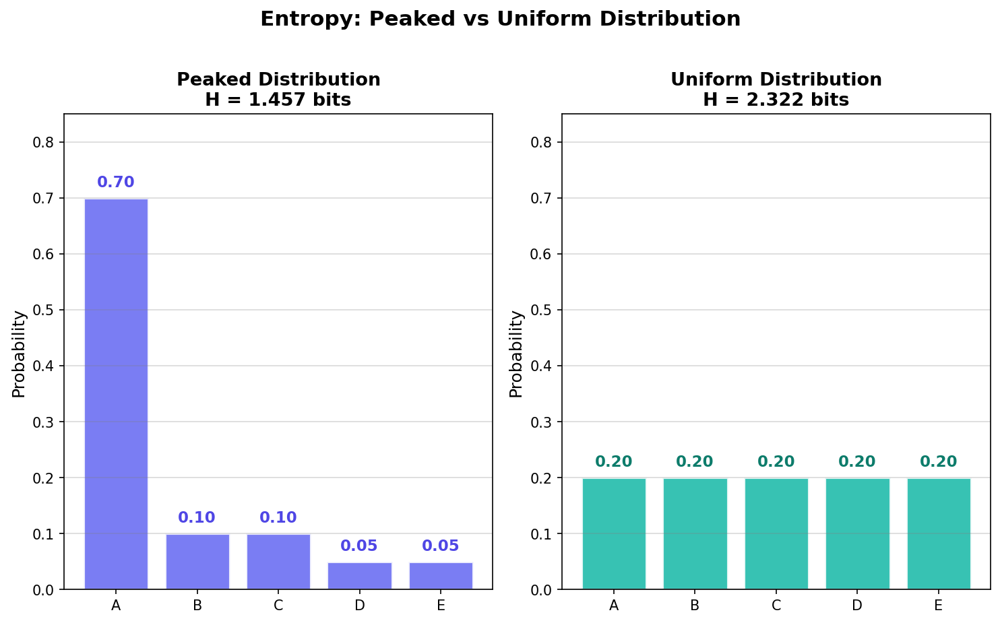
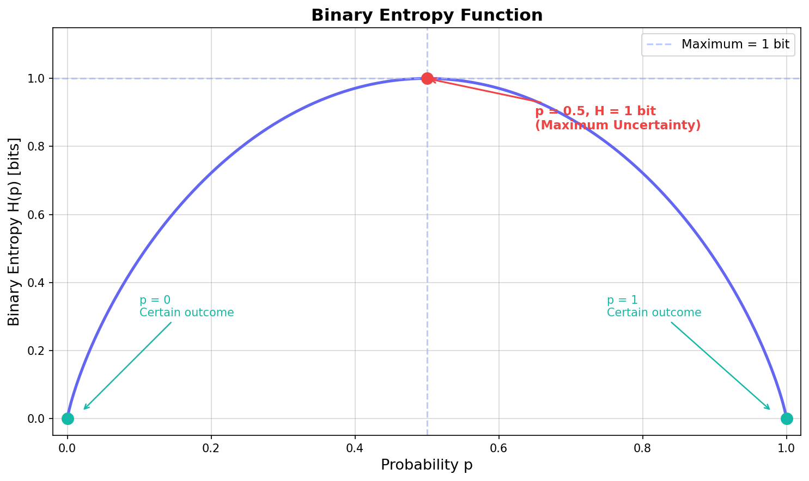
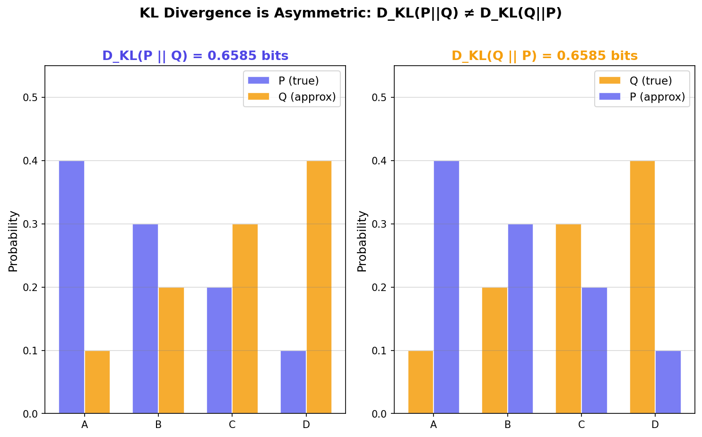
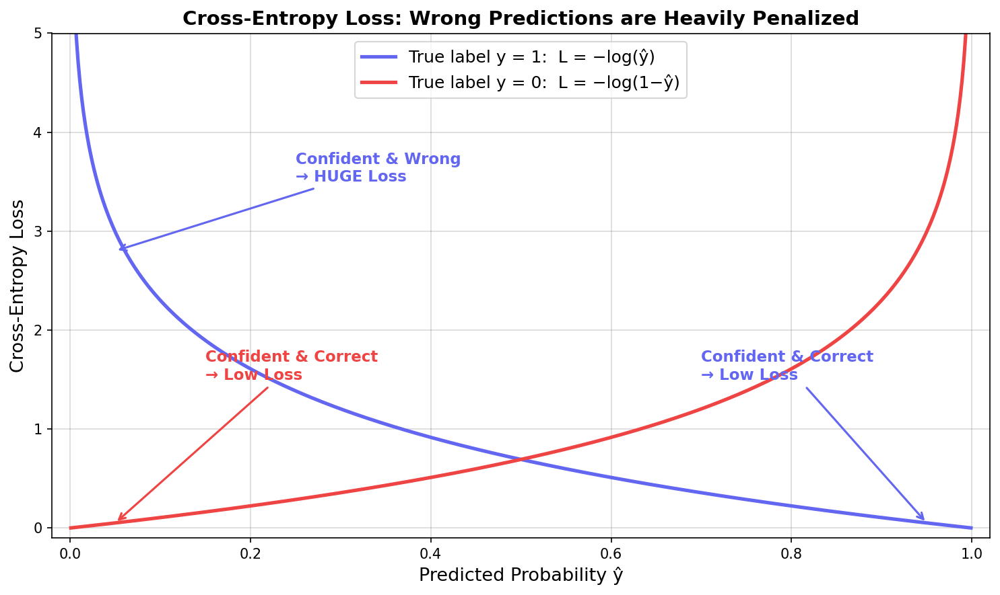

## 들어가며: ML/DL 곳곳에 숨어 있는 정보이론

[로지스틱 회귀](/ml/logistic-regression/)에서는 **Cross-Entropy Loss**가 당연하다는 듯 쓰이고, LLM 논문을 읽으면 **Perplexity**가 모델 성능을 평가한다. VAE 논문에서는 **KL Divergence**가 ELBO의 핵심 항으로 자리잡고 있다. 이 개념들은 모두 하나의 뿌리에서 나왔다. 1948년 클로드 섀넌(Claude Shannon)이 통신 공학을 위해 세운 **정보이론**(Information Theory)이다.

## 정보량(Self-Information): 놀라움을 숫자로

### 확률이 낮을수록 정보가 크다

"내일 해가 뜬다"는 뉴스와 "내일 서울에 눈이 3미터 쌓인다"는 뉴스 중 어느 쪽이 더 많은 **정보**를 전달하는가? 당연히 후자다. 확률이 낮은 사건이 발생했다는 소식은 그만큼 놀랍고, 그 놀라움의 크기가 곧 정보의 양이다. 이 직관을 수식으로 옮긴 것이 **정보량**(Self-Information)이다.

$$
I(x) = \log_2 \frac{1}{p(x)} = -\log_2 p(x)
$$

로그의 밑이 2이면 단위는 **비트**(bit), 자연로그면 **냇**(nat), 상용로그면 **하틀리**(hartley)다. 밑이 달라져도 상수 배 차이일 뿐이다. 이 글의 엔트로피와 KL 발산 예제는 비트로 통일하고, 단위가 달라지는 곳에서는 그때 밝힌다.

### 왜 로그인가?

정보량이 갖춰야 할 성질은 세 가지다.

1. **확률이 낮을수록 정보가 많다**: $p(x)$가 작을수록 $I(x)$가 커야 한다.
2. **확실한 사건의 정보는 0이다**: $p(x) = 1$이면 $I(x) = 0$이어야 한다.
3. **독립 사건의 정보는 더해진다**: 동전을 두 번 던지는 것은 한 번 던지는 정보의 두 배여야 한다.

세 번째 조건이 로그를 강제한다. 독립 사건의 결합 확률은 $p(A \cap B) = p(A) \cdot p(B)$인데 정보량은 곱이 아니라 합이 되어야 하고, 곱셈을 덧셈으로 바꾸는 함수가 바로 로그이기 때문이다.

| 사건 | 확률 | 정보량 |
|---|---|---|
| 공정한 동전 앞면 | 0.5 | 1.00 bits |
| 주사위의 특정 눈 | 1/6 | 2.58 bits |
| 확실한 사건 | 1.0 | 0.00 bits |
| 1% 확률 사건 | 0.01 | 6.64 bits |

비트라는 단위 자체가 "이진 선택 하나의 정보량"에서 유래했으므로, 공정한 동전의 앞면이 정확히 1비트인 것은 우연이 아니다.

## 엔트로피(Entropy): 불확실성의 척도

### 평균 정보량 = 불확실성

정보량이 개별 사건의 놀라움이라면, **엔트로피**(Entropy)는 확률 분포 전체의 평균 놀라움이다.

$$
H(X) = -\sum_{x \in \mathcal{X}} p(x) \log p(x) = \mathbb{E}[I(X)]
$$

정보량의 기댓값이 곧 엔트로피다. 정의 자체는 로그의 밑과 무관하며, 밑은 결과의 단위만 정한다.

### 언제 엔트로피가 높고, 언제 낮은가?



*왼쪽: 한 값에 집중된 분포 (낮은 엔트로피) / 오른쪽: 균일 분포 (높은 엔트로피)*

| 분포 | 확률 | 엔트로피 |
|---|---|---|
| 균일 (5개 값) | (0.2, 0.2, 0.2, 0.2, 0.2) | 2.322 bits |
| 집중 | (0.7, 0.1, 0.1, 0.05, 0.05) | 1.457 bits |
| 확정 | (1, 0, 0, 0, 0) | 0.000 bits |
| 공정한 동전 | (0.5, 0.5) | 1.000 bits |

$n$개 값을 가진 균일 분포의 엔트로피 $\log_2 n$이 그 개수에서 달성 가능한 **최대 엔트로피**이고, 결과가 확정된 분포의 0이 최소다. 계산할 때 $p(x) = 0$인 항은 $\lim_{p \to 0^+} p \log p = 0$이므로 관례적으로 $0 \log 0 = 0$으로 두고 건너뛴다.

## 이진 엔트로피(Binary Entropy)

결과가 두 가지뿐이면(성공 확률 $p$, 실패 확률 $1-p$) 엔트로피는 하나의 매개변수에 대한 함수로 깔끔하게 정리된다.

$$
H(p) = -p \log_2 p - (1-p) \log_2 (1-p)
$$



*이진 엔트로피 함수. p=0.5에서 최대값 1비트에 도달한다*

$p = 0$이나 $p = 1$에서는 결과가 확정이므로 $H = 0$이고, $p = 0.5$에서 불확실성이 최대가 되어 1비트다. 뒤에서 볼 교차 엔트로피는 이 엔트로피에 KL 발산을 더한 형태인데, 정답이 0 또는 1로 확정된 분류 문제에서는 정답 분포의 엔트로피가 곡선의 양 끝, 즉 0이다. 그래서 그 경우 교차 엔트로피는 KL 발산과 정확히 같아진다.

## KL 발산(KL Divergence): 거리가 아닌 비대칭 척도

### 정의: 하나의 분포로 다른 분포를 설명할 때의 비용

진짜 데이터 분포 $P$를 모델 분포 $Q$로 근사할 때 얼마나 많은 정보를 잃는지 측정하는 도구가 **KL 발산**(Kullback-Leibler Divergence)이다.

$$
D_{KL}(P \| Q) = \sum_{x} p(x) \log \frac{p(x)}{q(x)} = \mathbb{E}_{x \sim P}\left[\log \frac{p(x)}{q(x)}\right]
$$

연속 분포에서는 합이 적분으로 바뀐다.

$$
D_{KL}(P \| Q) = \int p(x) \log \frac{p(x)}{q(x)} \, dx
$$

### 핵심 성질 두 가지

첫째, **항상 0 이상이다**(Gibbs' Inequality).

$$
D_{KL}(P \| Q) \geq 0, \quad \text{등호는 } P = Q \text{일 때만 성립}
$$

덕분에 두 분포가 얼마나 다른지의 척도로 쓸 수 있고, 값이 0이면 두 분포가 완전히 같다는 뜻이다.

둘째, **비대칭이다**.

$$
D_{KL}(P \| Q) \neq D_{KL}(Q \| P) \quad \text{(일반적으로)}
$$

이것이 KL 발산을 "거리(distance)"가 아닌 "발산(divergence)"이라 부르는 이유다. 거리 함수(metric)라면 대칭이어야 하고 삼각부등식도 만족해야 하는데, KL 발산은 둘 다 아니다.



*같은 두 분포 P와 Q에 대해 D_KL(P||Q)와 D_KL(Q||P)의 값이 다르다*

$D_{KL}(P \| Q)$를 풀어 읽으면 "진짜 분포 $P$에서 샘플을 뽑았을 때 $Q$로 인코딩하면 추가로 드는 비트 수"다. $P$에서 확률이 높은 영역에 $Q$가 낮은 확률을 부여하면 큰 페널티를 받는다. 반대 방향인 $D_{KL}(Q \| P)$는 $Q$에서 확률이 높은 영역에 초점이 맞춰지므로, 어느 분포의 관점에서 보느냐에 따라 값이 달라진다.

```python
import numpy as np

def kl_divergence(p, q, base=2):
    """D_KL(P || Q) 계산"""
    p, q = np.array(p, dtype=float), np.array(q, dtype=float)
    mask = p > 0  # Q(x)=0인데 P(x)>0이면 무한대로 발산한다
    return np.sum(p[mask] * np.log(p[mask] / q[mask])) / np.log(base)

P, Q = [0.5, 0.3, 0.2], [0.1, 0.3, 0.6]
R = [1/3, 1/3, 1/3]

print(f"D_KL(P || Q) = {kl_divergence(P, Q):.4f} bits")
print(f"D_KL(Q || P) = {kl_divergence(Q, P):.4f} bits")
print(f"D_KL(R || R) = {kl_divergence(R, R):.4f} bits")
# D_KL(P || Q) = 0.8440 bits
# D_KL(Q || P) = 0.7188 bits
# D_KL(R || R) = 0.0000 bits
```

:::warning

**주의**

$Q(x) = 0$인 곳에서 $P(x) > 0$이면 $D_{KL}(P \| Q) = \infty$가 된다. 실제 구현에서는 $Q$에 아주 작은 값(smoothing)을 더하거나, $P$의 support가 $Q$의 support에 포함되도록 보장해야 한다.

:::

## 교차 엔트로피(Cross-Entropy): 분류 손실 함수의 정체

### 정의: 잘못된 분포로 인코딩하는 비용

**교차 엔트로피**(Cross-Entropy)는 엔트로피와 KL 발산을 연결하는 다리다.

$$
H(P, Q) = -\sum_{x} p(x) \log q(x)
$$

"진짜 분포 $P$에서 데이터가 발생하지만 인코딩에는 $Q$를 사용할 때 필요한 평균 비트 수"라는 뜻이고, 여기서 핵심 관계가 나온다.

$$
H(P, Q) = H(P) + D_{KL}(P \| Q)
$$

$H(P)$는 데이터 자체의 고유한 불확실성이므로 모델이 바꿀 수 없는 상수다. 따라서 **교차 엔트로피를 최소화하는 것은 KL 발산을 최소화하는 것과 같다**. 이것이 분류 모델의 손실 함수로 교차 엔트로피를 쓰는 근본적인 이유다.

### 분류 문제에서의 Cross-Entropy Loss

이진 분류에서 진짜 레이블이 $y \in \{0, 1\}$이고 모델의 예측 확률이 $\hat{y} = P(Y=1|x)$일 때 Cross-Entropy Loss는 다음과 같다.

$$
\mathcal{L}_{CE} = -[y \log \hat{y} + (1 - y) \log(1 - \hat{y})]
$$

$N$개 샘플 전체의 평균을 내면 [로지스틱 회귀의 손실 함수](/ml/logistic-regression/)가 된다.

$$
J(\theta) = -\frac{1}{N} \sum_{i=1}^{N} [y_i \log \hat{y}_i + (1 - y_i) \log(1 - \hat{y}_i)]
$$

$K$개 클래스로 확장하면 $\mathcal{L}_{CE} = -\sum_{k=1}^{K} y_k \log \hat{y}_k$인데, $y_k$가 원-핫 인코딩된 레이블이므로 정답 클래스 $c$에 대해서만 $-\log \hat{y}_c$가 남는다. 모델이 정답 클래스에 높은 확률을 부여할수록 손실이 줄어드는 구조다.

### 왜 MSE가 아닌 Cross-Entropy인가?



*교차 엔트로피 손실. 틀린 예측에 대한 페널티가 급격히 증가한다*

**이유 1: 그래디언트 소실 방지**

시그모이드 활성화에 $\mathcal{L}_{MSE} = \frac{1}{2}(a - y)^2$를 결합하면 그래디언트는 이렇게 나온다.

$$
\frac{\partial \mathcal{L}_{MSE}}{\partial w} = (a - y) \cdot \sigma'(z) \cdot x
$$

시그모이드의 도함수 $\sigma'(z)$는 출력이 0이나 1에 가까울 때 거의 0에 수렴한다. 모델이 확신을 갖고 틀린 예측을 했을 때, 즉 가장 빨리 학습해야 할 때 오히려 그래디언트가 사라진다.

반면 시그모이드와 Cross-Entropy를 결합하면 $\sigma'(z)$ 항이 깔끔하게 소거된다.

$$
\frac{\partial \mathcal{L}_{CE}}{\partial w} = (a - y) \cdot x
$$

예측이 아무리 극단적이어도 그래디언트가 살아 있으므로, 모델이 크게 틀렸을 때 빠르게 교정할 수 있다.

**이유 2: 손실에 상한이 없다**

정답이 1인데 $\hat{y} \to 0$으로 예측하면 CE는 $-\log \hat{y} \to \infty$로 발산한다. 반면 MSE는 $\frac{1}{2}(1 - \hat{y})^2 \to 0.5$에서 멈춘다. 확신에 찬 오답에 MSE가 부과할 수 있는 손실에는 천장이 있지만, CE에는 없다.

**이유 3: 최대우도추정과의 연결**

Cross-Entropy Loss를 최소화하는 것은 베르누이 분포에 대한 최대우도추정(MLE)과 정확히 같다. 이론적으로도 가장 자연스러운 선택인 셈이다.

## 정보이론이 ML/DL에 남긴 것

### LLM의 Perplexity

언어 모델 평가에 쓰이는 **퍼플렉시티**(Perplexity)는 교차 엔트로피의 지수 변환이다. $H$가 비트 단위면 $\text{PPL} = 2^{H(P, Q)}$이고, 냇 단위면 $\text{PPL} = e^{H(P, Q)}$다. 두 식은 근사 관계가 아니라 로그 밑만 다른 같은 등식이다.

퍼플렉시티가 $k$라는 것은 모델이 매 토큰마다 평균 $k$개의 선택지를 놓고 고민한다는 뜻이다. 교차 엔트로피가 0이면 PPL은 1이 되고, 냇 단위 손실 2.5는 PPL 12.2, 5.0은 PPL 148.4에 해당한다. 다만 PPL은 평가 코퍼스와 토크나이저에 따라 값이 달라지므로, 조건이 다른 모델끼리 직접 비교할 수는 없다.

### VAE와 RLHF의 KL 항

**변분 오토인코더**(VAE)의 목적 함수 ELBO에서 KL 발산은 인코더가 만드는 잠재 분포 $q(z|x)$가 사전 분포 $p(z)$에서 너무 멀어지지 않게 잡아 주는 정규화 항으로 들어간다.

$$
\text{ELBO} = \mathbb{E}_{q(z|x)}[\log p(x|z)] - D_{KL}(q(z|x) \| p(z))
$$

RLHF도 구조가 같다. fine-tuning된 정책 $\pi_\theta$가 참조 정책 $\pi_{\text{ref}}$에서 벗어나는 정도에 $\beta \cdot D_{KL}(\pi_\theta \| \pi_{\text{ref}})$만큼 페널티를 매긴다. $\beta$가 작으면 모델이 보상을 해킹하고, 크면 원래 모델에서 벗어나지 못한다. KL 발산이 이 균형을 정량적으로 조절한다.

## 정보이론 개념 총정리

$P = (0.5, 0.3, 0.2)$, $Q = (0.3, 0.4, 0.3)$로 직접 계산하면 $H(P) = 1.485$, $D_{KL}(P \| Q) = 0.127$, $H(P, Q) = 1.612$ 비트로 $H(P, Q) = H(P) + D_{KL}(P \| Q)$가 수치적으로 정확히 성립한다. $D_{KL} \geq 0$이므로 항상 $H(P, Q) \geq H(P)$이고, $H(P)$는 모델과 무관한 상수이므로 **교차 엔트로피를 최소화하는 일은 곧 모델 분포 $Q$를 진짜 분포 $P$에 맞추는 일**이다.

:::summary

**핵심 요약**

- **정보량** I(x) = −log p(x): 놀라움의 크기
- **엔트로피** H(X) = E[I(X)]: 평균 놀라움, 곧 불확실성
- **KL 발산** D_KL(P||Q): P 대신 Q를 쓸 때의 추가 비용 (비대칭, ≥0)
- **교차 엔트로피** H(P,Q) = H(P) + D_KL(P||Q): 잘못된 분포로 인코딩하는 비용
- CE Loss 최소화는 KL 발산 최소화이고, 곧 모델 분포를 진짜 분포에 맞추는 일이다

:::

## 마치며

엔트로피는 불확실성 자체를 재고, 교차 엔트로피와 KL 발산은 모델의 예측이 현실에서 얼마나 벗어났는지를 잰다. 로지스틱 회귀가 가중치를 갱신할 때도, LLM이 다음 토큰을 예측할 때도 그 밑바닥에는 같은 수학이 흐른다. 손실 함수를 고른다는 것은 결국 무엇을 정보로 셀 것인지를 고르는 일이다.

## 함께 보면 좋은 글

- [확률의 공리와 확률론의 기초](/stats/probability-fundamentals/)
- [조건부 확률과 베이즈 정리](/stats/conditional-probability-bayes/)
- [큰 수의 법칙과 중심극한정리](/stats/lln-and-clt/)
- [점추정: 데이터에서 모수를 추정하는 첫 번째 원리](/stats/point-estimation/)

## 참고자료

- Cover, T. M., & Thomas, J. A. (2006). *Elements of Information Theory* (2nd Edition), Chapters 2-3
- Goodfellow, I., Bengio, Y., & Courville, A. (2016). *Deep Learning*, Chapter 3: Information Theory
- Shannon, C. E. (1948). "A Mathematical Theory of Communication." *Bell System Technical Journal*, 27, 379-423
- Wikipedia: [Kullback-Leibler divergence](https://en.wikipedia.org/wiki/Kullback%E2%80%93Leibler_divergence), [Cross-entropy](https://en.wikipedia.org/wiki/Cross-entropy)
