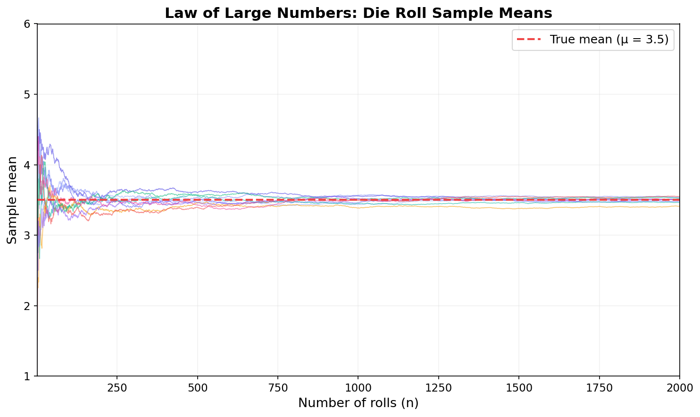
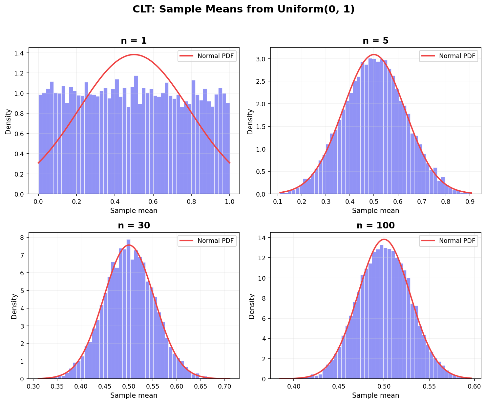
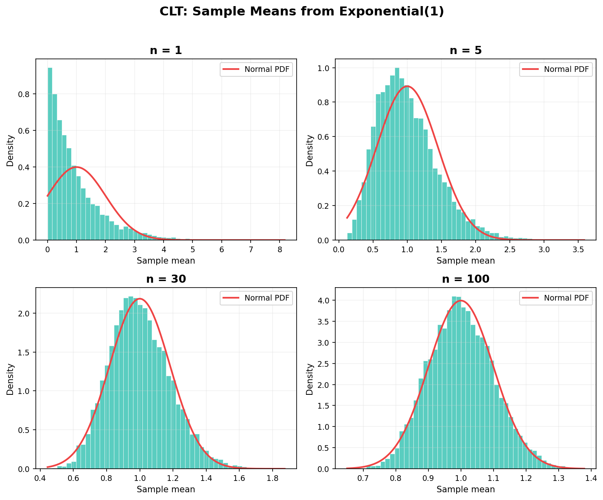
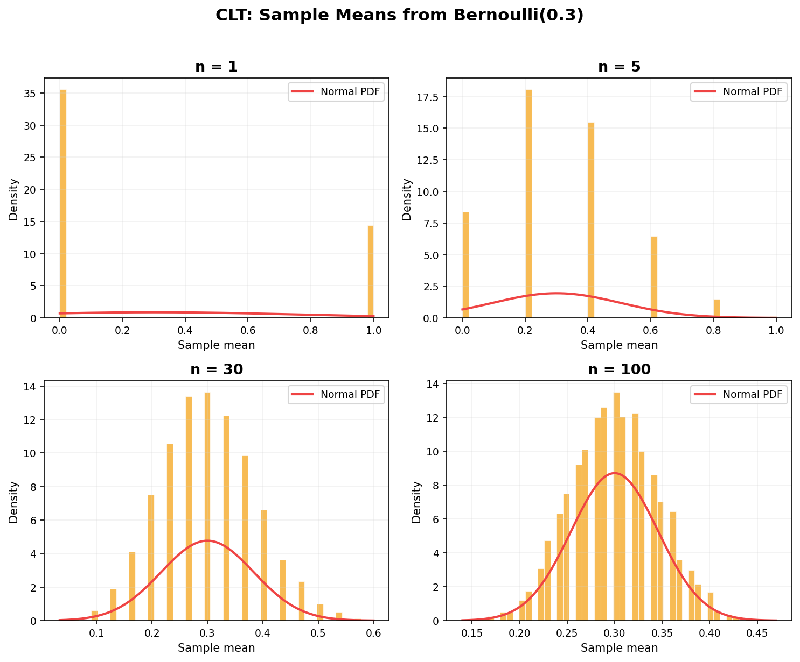
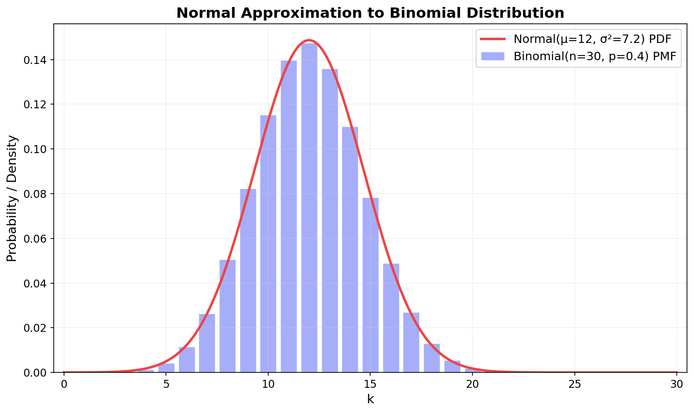

통계학에서 가장 근본적인 질문 두 가지가 있다. **"왜 표본 평균으로 모집단 평균을 추정할 수 있는가?"** 그리고 **"왜 표본이 30개 이상이면 정규분포를 가정해도 되는가?"**

첫 번째 질문의 답이 **큰 수의 법칙(Law of Large Numbers, LLN)**이고, 두 번째 질문의 답이 **중심극한정리(Central Limit Theorem, CLT)**다. 이 두 정리가 없다면 설문 조사도, A/B 테스트도, 머신러닝 모델의 평가도 전부 수학적 근거를 잃는다.

[이전 글](/stats/continuous-distributions/)에서 정규분포를 포함한 연속확률분포를 다뤘다. 정규분포가 왜 그토록 자주 등장하는지, 그 근본적인 이유가 바로 CLT에 있다. 이번 글에서 그 연결고리를 완성한다.

---

## 큰 수의 약한 법칙 (Weak Law of Large Numbers)

### 직관부터

동전을 10번 던졌을 때 앞면 비율이 0.7이 나올 수 있다. 100번이면? 0.55 정도로 줄어든다. 10,000번이면? 거의 0.5에 가까워진다. 이것이 **큰 수의 법칙**의 핵심이다 — 시행 횟수가 늘어날수록 표본 평균은 모평균에 가까워진다.

수학적으로 표현하면 이렇다.

### 정확한 진술

$X_1, X_2, \ldots, X_n$이 평균 $\mu$, 분산 $\sigma^2$을 가진 **독립 동일 분포(i.i.d.)** 확률변수라 하자. 표본 평균 $\bar{X}_n = \frac{1}{n}\sum_{i=1}^{n} X_i$에 대해, 임의의 $\epsilon > 0$에 대해:

$$\lim_{n \to \infty} P\left(|\bar{X}_n - \mu| \geq \epsilon\right) = 0$$

말로 풀면, $n$이 충분히 크면 표본 평균 $\bar{X}_n$이 $\mu$에서 $\epsilon$만큼 벗어날 확률이 0에 수렴한다는 뜻이다. 이를 **확률 수렴(convergence in probability)**이라 부른다.

### 체비셰프 부등식으로 증명하기

증명은 놀라울 정도로 간결하다. [확률변수와 기댓값](/stats/random-variables-expectation/) 글에서 다뤘던 **체비셰프 부등식(Chebyshev's Inequality)**을 떠올려보자.

$$P(|X - \mu| \geq k) \leq \frac{\text{Var}(X)}{k^2}$$

표본 평균 $\bar{X}_n$에 적용하면:

- $E[\bar{X}_n] = \mu$ (기댓값의 선형성)
- $\text{Var}(\bar{X}_n) = \frac{\sigma^2}{n}$ (독립이므로)

$$P(|\bar{X}_n - \mu| \geq \epsilon) \leq \frac{\sigma^2}{n\epsilon^2}$$

$n \to \infty$이면 우변이 $0$으로 간다. 끝이다.

<div style="background: #f0f4ff; border-left: 4px solid #3182f6; padding: 16px 20px; margin: 20px 0; border-radius: 4px;"><strong>💡 참고</strong><br>이 증명이 작동하려면 <strong>분산이 유한</strong>해야 한다. 코시 분포(Cauchy Distribution)처럼 분산이 존재하지 않는 분포에서는 큰 수의 법칙이 성립하지 않는다. 코시 분포에서 표본 평균을 아무리 많이 모아도 수렴하지 않는다는 사실은 꽤 반직관적이다.</div>

```python
import numpy as np

# 체비셰프 부등식으로 경계 계산
sigma_sq = 1.0    # 분산
epsilon = 0.1     # 허용 오차

for n in [10, 100, 1000, 10000]:
    bound = sigma_sq / (n * epsilon**2)
    print(f"n={n:>5}: P(|X̄ - μ| ≥ {epsilon}) ≤ {bound:.6f}")

# n=   10: P(|X̄ - μ| ≥ 0.1) ≤ 10.000000  (의미 없는 상한)
# n=  100: P(|X̄ - μ| ≥ 0.1) ≤ 1.000000
# n= 1000: P(|X̄ - μ| ≥ 0.1) ≤ 0.010000
# n=10000: P(|X̄ - μ| ≥ 0.1) ≤ 0.001000
```

$n$이 작을 때는 상한(bound)이 1을 넘어서 의미가 없지만, $n$이 커지면 확률이 빠르게 줄어드는 걸 확인할 수 있다. 체비셰프 부등식 자체는 느슨한 부등식이지만, "수렴한다"는 사실을 증명하기에는 충분하다.

---

## 큰 수의 강한 법칙 (Strong Law of Large Numbers)

약한 법칙은 "특정 $n$에서 벗어날 확률이 작다"고 말한다. **강한 법칙(Strong Law of Large Numbers, SLLN)**은 한 단계 더 강한 주장을 한다.

$$P\left(\lim_{n \to \infty} \bar{X}_n = \mu\right) = 1$$

이것은 **거의 확실한 수렴(almost sure convergence)**이다. "궤적 하나하나가 결국 $\mu$에 수렴한다"는 뜻이다.

### 약한 법칙 vs 강한 법칙

둘의 차이를 비유로 설명하면 이렇다.

| | 약한 법칙 (WLLN) | 강한 법칙 (SLLN) |
|---|---|---|
| **수렴 종류** | 확률 수렴 | 거의 확실한 수렴 |
| **직관** | "큰 $n$에서 스냅샷을 찍으면, 대부분 $\mu$ 근처에 있다" | "각 궤적이 끝까지 따라가면, 결국 $\mu$에 도달한다" |
| **비유** | 특정 시점에 대부분의 학생이 교실에 있다 | 모든 학생이 결국 교실에 도착한다 |

약한 법칙은 "한 시점의 스냅샷"에 대한 진술이고, 강한 법칙은 "전체 시퀀스"에 대한 진술이다. 강한 법칙이 성립하면 약한 법칙도 자동으로 성립한다.

<div style="background: #f0fff4; border-left: 4px solid #51cf66; padding: 16px 20px; margin: 20px 0; border-radius: 4px;"><strong>✅ 팁</strong><br>실전에서 WLLN과 SLLN의 구분이 문제가 되는 경우는 거의 없다. ML/통계 응용에서는 "표본 크기가 크면 표본 평균이 모평균에 수렴한다"는 사실 자체가 중요하지, 수렴의 종류까지 따질 일은 드물다. 다만 이론적 증명에서는 이 구분이 결정적인 역할을 하기도 한다.</div>

강한 법칙의 증명은 체비셰프 부등식만으로는 부족하고, 보렐-칸텔리 보조정리(Borel-Cantelli Lemma) 같은 측도론적 도구가 필요하다. 이 글의 범위를 벗어나므로 결과만 받아들이자.

---

## 시뮬레이션으로 보는 LLN

이론을 확인하는 가장 확실한 방법은 직접 돌려보는 것이다. 주사위를 반복해서 던지면서, 표본 평균이 진짜 $\mu = 3.5$로 수렴하는지 관찰해보자.

```python
import numpy as np
import matplotlib.pyplot as plt

np.random.seed(42)

n_rolls = 2000
n_paths = 10  # 10개의 독립적인 궤적

fig, ax = plt.subplots(figsize=(10, 6), dpi=150)

for i in range(n_paths):
    rolls = np.random.randint(1, 7, size=n_rolls)
    cumulative_mean = np.cumsum(rolls) / np.arange(1, n_rolls + 1)
    ax.plot(range(1, n_rolls + 1), cumulative_mean, alpha=0.6, linewidth=0.8)

ax.axhline(y=3.5, color='red', linestyle='--', linewidth=2, label='True mean (μ = 3.5)')
ax.set_xlabel('Number of rolls (n)')
ax.set_ylabel('Sample mean')
ax.set_title('Law of Large Numbers: Die Roll Sample Means')
ax.set_ylim(1, 6)
ax.legend()
ax.grid(True, alpha=0.3)
plt.tight_layout()
plt.savefig('lln-convergence.png', bbox_inches='tight', dpi=150)
```


<p align="center" style="color: #888; font-size: 13px;"><em>10개의 독립 궤적이 모두 μ=3.5로 수렴한다. 초반에는 궤적마다 들쭉날쭉하지만, n이 커질수록 빨간 점선에 밀착한다.</em></p>

그래프에서 주목할 점이 세 가지 있다.

1. **초반(n < 50)**: 궤적마다 편차가 크다. 어떤 궤적은 4.5, 어떤 궤적은 2.5 근처를 맴돈다.
2. **중반(n ≈ 200~500)**: 대부분의 궤적이 3.5 근처로 모인다. 하지만 아직 떨림이 남아있다.
3. **후반(n > 1000)**: 모든 궤적이 3.5에 사실상 붙어버린다. 이것이 "거의 확실한 수렴"의 시각적 증거다.

```python
# 수치로 확인: n이 커질수록 편차가 줄어듦
np.random.seed(42)
for n in [10, 50, 100, 500, 1000, 5000]:
    means = [np.mean(np.random.randint(1, 7, size=n)) for _ in range(1000)]
    print(f"n={n:>5}: mean of means = {np.mean(means):.4f}, "
          f"std of means = {np.std(means):.4f}")

# n=   10: mean of means = 3.4988, std of means = 0.5354
# n=   50: mean of means = 3.5011, std of means = 0.2426
# n=  100: mean of means = 3.5004, std of means = 0.1707
# n=  500: mean of means = 3.5000, std of means = 0.0766
# n= 1000: mean of means = 3.4999, std of means = 0.0538
# n= 5000: mean of means = 3.5001, std of means = 0.0241
```

표본 평균의 표준편차가 $\frac{\sigma}{\sqrt{n}}$에 비례해서 줄어드는 패턴이 선명하다. $n$이 4배가 되면 표준편차는 절반이 된다. 이 관계가 곧 CLT로 이어진다.

---

## 중심극한정리 (Central Limit Theorem)

큰 수의 법칙은 "표본 평균이 모평균에 **수렴한다**"고 말한다. 그런데 더 구체적인 질문이 있다 — 수렴하는 과정에서, 표본 평균은 **어떤 분포**를 따르는가?

바로 이 질문에 답하는 것이 중심극한정리다.

### 정확한 진술

$X_1, X_2, \ldots, X_n$이 평균 $\mu$, 분산 $\sigma^2$을 가진 i.i.d. 확률변수일 때:

$$Z_n = \frac{\bar{X}_n - \mu}{\sigma / \sqrt{n}} \xrightarrow{d} N(0, 1) \quad \text{as } n \to \infty$$

동치 표현으로:

$$\bar{X}_n \overset{d}{\approx} N\left(\mu, \frac{\sigma^2}{n}\right) \quad \text{for large } n$$

말로 풀면: **원래 분포가 무엇이든** — 균일이든, 지수든, 베르누이든, 아무 괴상한 분포든 — 표본 평균을 표준화하면 표준정규분포에 수렴한다.

<div style="background: #fff3f0; border-left: 4px solid #ff6b6b; padding: 16px 20px; margin: 20px 0; border-radius: 4px;"><strong>⚠️ 주의</strong><br><strong>CLT의 조건을 정확히 기억하자.</strong><br><br><ul style="margin: 0; padding-left: 20px;"><li><strong>i.i.d.</strong>: 독립이고 동일한 분포를 따라야 한다.</li><li><strong>유한 분산</strong>: $\sigma^2 < \infty$여야 한다. 코시 분포처럼 분산이 발산하면 CLT가 성립하지 않는다.</li><li><strong>n이 "충분히" 커야</strong> 한다. 얼마나 커야 하는지는 원래 분포의 비대칭도(skewness)에 달렸다. 대칭 분포면 n=10도 충분할 수 있고, 극단적으로 치우친 분포면 n=100도 부족할 수 있다.</li></ul></div>

### LLN과 CLT의 관계

| | 큰 수의 법칙 (LLN) | 중심극한정리 (CLT) |
|---|---|---|
| **묻는 것** | $\bar{X}_n$이 어디로 가는가? | $\bar{X}_n$이 어떤 **분포**를 따르는가? |
| **답** | $\mu$로 수렴 | $N(\mu, \sigma^2/n)$에 근사 |
| **비유** | "과녁의 중심을 맞힌다" | "화살이 중심 주위로 **종 모양**으로 퍼진다" |

LLN은 "어디로"를 말하고, CLT는 "어떻게 퍼지면서"를 말한다. CLT가 더 구체적이고 강력한 진술이다.

---

## CLT 시뮬레이션: 눈으로 확인하기

CLT의 위력을 체감하는 가장 좋은 방법은, 전혀 정규분포가 아닌 분포에서 표본 평균을 반복 추출해보는 것이다. 세 가지 분포 — 균일, 지수, 베르누이 — 에서 각각 실험해보자.

### 균일분포 Uniform(0, 1)에서

균일분포는 직사각형 모양이다. 정규분포와는 전혀 다르다.

```python
import numpy as np
import matplotlib.pyplot as plt
from scipy import stats

np.random.seed(42)
n_samples = 10000
sample_sizes = [1, 5, 30, 100]

fig, axes = plt.subplots(2, 2, figsize=(10, 8), dpi=150)
axes = axes.flatten()

for idx, n in enumerate(sample_sizes):
    # Uniform(0,1)에서 n개씩 뽑아 평균을 10000번 반복
    means = [np.mean(np.random.uniform(0, 1, n)) for _ in range(n_samples)]

    ax = axes[idx]
    ax.hist(means, bins=50, density=True, alpha=0.7, color='#6366f1')

    # 이론적 정규분포 겹치기
    mu, sigma = 0.5, np.sqrt(1/12 / n)
    x = np.linspace(min(means), max(means), 200)
    ax.plot(x, stats.norm.pdf(x, mu, sigma), color='red', linewidth=2)

    ax.set_title(f'n = {n}')
    ax.set_xlabel('Sample mean')

plt.suptitle('CLT: Sample Means from Uniform(0, 1)')
plt.tight_layout()
plt.savefig('clt-uniform.png', bbox_inches='tight', dpi=150)
```


<p align="center" style="color: #888; font-size: 13px;"><em>Uniform(0,1)에서 표본 평균의 분포 변화. n=1일 때는 직사각형이지만, n=30만 되어도 정규분포와 거의 일치한다.</em></p>

$n = 1$일 때는 원래 분포 그대로 — 납작한 직사각형이다. $n = 5$에서 이미 종 모양의 윤곽이 잡히고, $n = 30$이면 빨간 정규분포 곡선과 거의 완벽하게 겹친다.

### 지수분포 Exponential(1)에서

지수분포는 오른쪽으로 긴 꼬리를 가진, 극도로 비대칭인 분포다. 이런 분포에서도 CLT가 작동할까?

```python
fig, axes = plt.subplots(2, 2, figsize=(10, 8), dpi=150)
axes = axes.flatten()

for idx, n in enumerate(sample_sizes):
    means = [np.mean(np.random.exponential(1.0, n)) for _ in range(n_samples)]

    ax = axes[idx]
    ax.hist(means, bins=50, density=True, alpha=0.7, color='#14b8a6')

    mu, sigma = 1.0, np.sqrt(1.0 / n)
    x = np.linspace(max(0, min(means)), max(means), 200)
    ax.plot(x, stats.norm.pdf(x, mu, sigma), color='red', linewidth=2)

    ax.set_title(f'n = {n}')

plt.suptitle('CLT: Sample Means from Exponential(1)')
plt.tight_layout()
plt.savefig('clt-exponential.png', bbox_inches='tight', dpi=150)
```


<p align="center" style="color: #888; font-size: 13px;"><em>극도로 비대칭인 Exp(1)에서도 n=30이면 정규분포에 상당히 가까워지고, n=100이면 거의 완벽하게 일치한다.</em></p>

$n = 1$일 때는 지수분포 특유의 급격한 감소 곡선이 보인다. $n = 5$에서는 아직 오른쪽 꼬리가 남아있지만, $n = 30$에서 이미 정규분포와 상당히 유사하다. $n = 100$이면 구분이 불가능할 정도다. 비대칭 분포는 대칭 분포보다 수렴이 느리지만, 결국 수렴한다는 사실은 변하지 않는다.

### 베르누이 분포 Bernoulli(0.3)에서

베르누이 분포는 0 또는 1만 가지는 가장 극단적인 이산분포다. 연속적인 정규분포로 수렴할 수 있을까?

```python
fig, axes = plt.subplots(2, 2, figsize=(10, 8), dpi=150)
axes = axes.flatten()
p = 0.3

for idx, n in enumerate(sample_sizes):
    means = [np.mean(np.random.binomial(1, p, n)) for _ in range(n_samples)]

    ax = axes[idx]
    ax.hist(means, bins=50, density=True, alpha=0.7, color='#f59e0b')

    mu, sigma = p, np.sqrt(p * (1 - p) / n)
    x = np.linspace(max(0, min(means)), min(1, max(means)), 200)
    ax.plot(x, stats.norm.pdf(x, mu, sigma), color='red', linewidth=2)

    ax.set_title(f'n = {n}')

plt.suptitle('CLT: Sample Means from Bernoulli(0.3)')
plt.tight_layout()
plt.savefig('clt-bernoulli.png', bbox_inches='tight', dpi=150)
```


<p align="center" style="color: #888; font-size: 13px;"><em>0과 1만 가지는 Bernoulli(0.3)에서도 n이 커지면 표본 평균이 정규분포로 수렴한다. 이산에서 연속으로의 전환이 극적이다.</em></p>

$n = 1$일 때는 0과 1에만 막대가 서 있다. $n = 5$에서는 0, 0.2, 0.4, 0.6, 0.8, 1.0의 6개 값만 가능하므로 여전히 듬성듬성하다. 하지만 $n = 30$부터 연속적인 히스토그램이 정규분포 곡선을 따라 형성된다. 이산 분포에서 연속적인 종 모양이 나타나는 이 전환은 CLT의 마법 같은 측면이다.

<div style="background: #f8f9fa; border: 1px solid #e9ecef; padding: 20px; margin: 24px 0; border-radius: 8px;"><strong>📌 핵심 요약</strong><br><br><ul style="margin: 0; padding-left: 20px;"><li>직사각형(균일), 감소 곡선(지수), 점 두 개(베르누이) — 원래 분포의 모양이 전혀 달라도 표본 평균은 정규분포로 수렴한다.</li><li>대칭 분포(균일)는 n=5에서 이미 수렴이 눈에 보이고, 비대칭 분포(지수)는 n=30~100이 필요하다.</li><li>"n ≥ 30이면 정규 가정 가능"이라는 경험 법칙의 수학적 근거가 바로 여기에 있다.</li></ul></div>

---

## CLT가 중요한 이유: 통계적 추론의 수학적 근거

CLT가 단순히 "수학적으로 아름답다"에서 그치지 않는 이유는, 현대 통계학의 거의 모든 추론 방법이 CLT 위에 서 있기 때문이다.

### 신뢰구간의 공식이 나오는 원리

모평균 $\mu$를 추정할 때 우리는 이렇게 쓴다:

$$\bar{X} \pm z_{\alpha/2} \cdot \frac{\sigma}{\sqrt{n}}$$

이 공식이 왜 성립하는지 CLT로 추적해보자.

**Step 1**: CLT에 의해 $\bar{X}_n \sim N(\mu, \sigma^2/n)$ (근사적으로).

**Step 2**: 표준화하면 $Z = \frac{\bar{X}_n - \mu}{\sigma/\sqrt{n}} \sim N(0, 1)$.

**Step 3**: 95% 신뢰구간을 원하면, $P(-1.96 \leq Z \leq 1.96) = 0.95$.

**Step 4**: $Z$에 $\bar{X}_n$과 $\mu$를 대입하고 $\mu$에 대해 풀면:

$$P\left(\bar{X}_n - 1.96 \cdot \frac{\sigma}{\sqrt{n}} \leq \mu \leq \bar{X}_n + 1.96 \cdot \frac{\sigma}{\sqrt{n}}\right) = 0.95$$

이것이 95% 신뢰구간이다. CLT가 없으면 $\bar{X}_n$이 정규분포를 따른다는 보장이 없으니, 이 공식 자체가 성립하지 않는다.

```python
import numpy as np
from scipy import stats

# CLT 기반 신뢰구간 직접 구현
np.random.seed(42)
population = np.random.exponential(scale=5, size=100000)  # 모집단: Exp(5)
true_mean = population.mean()
print(f"True population mean: {true_mean:.4f}")

# 표본 추출 후 95% 신뢰구간
n = 50
sample = np.random.choice(population, size=n, replace=False)
x_bar = sample.mean()
s = sample.std(ddof=1)  # 표본 표준편차

z = 1.96  # 95% 신뢰수준
margin = z * s / np.sqrt(n)

print(f"Sample mean: {x_bar:.4f}")
print(f"95% CI: [{x_bar - margin:.4f}, {x_bar + margin:.4f}]")
print(f"Contains true mean? {x_bar - margin <= true_mean <= x_bar + margin}")
```

지수분포 — 정규분포가 아닌 비대칭 분포 — 에서 뽑았는데도, CLT 덕분에 신뢰구간이 유효하게 작동한다.

### p-값과 가설 검정

가설 검정에서 "검정 통계량이 $N(0,1)$을 따른다"고 가정하는 것도 CLT 때문이다. CLT가 그 가정을 정당화해주지 않으면, $z$-검정과 $t$-검정 모두 수학적 근거를 잃는다. 이 부분은 추론 시리즈에서 본격적으로 다룰 예정이다.

---

## ML에서의 LLN과 CLT

통계학뿐 아니라, 머신러닝의 핵심 알고리즘들도 LLN과 CLT에 기대고 있다.

### SGD가 작동하는 이유

경사하강법(Gradient Descent)은 전체 데이터의 그래디언트를 계산한다:

$$\nabla L = \frac{1}{N} \sum_{i=1}^{N} \nabla l_i$$

확률적 경사하강법(SGD)은 이걸 미니배치 $B$개로 근사한다:

$$\nabla \hat{L} = \frac{1}{B} \sum_{i=1}^{B} \nabla l_i$$

왜 이 근사가 유효한가? **LLN에 의해** $\nabla \hat{L}$이 $\nabla L$에 수렴하기 때문이다. 미니배치가 클수록 더 정확한 근사가 된다.

여기에 **CLT를 적용하면** 한 걸음 더 나간다:

$$\nabla \hat{L} \sim N\left(\nabla L, \frac{\sigma^2_{\nabla}}{B}\right)$$

미니배치 그래디언트의 노이즈가 $\frac{1}{\sqrt{B}}$에 비례한다는 것이다. 배치 크기를 4배로 늘리면 노이즈는 절반으로 줄어든다.

<div style="background: #f0f4ff; border-left: 4px solid #3182f6; padding: 16px 20px; margin: 20px 0; border-radius: 4px;"><strong>💡 참고</strong><br>이것이 <a href="/ml/gradient-descent/">경사하강법</a> 글에서 "배치 크기를 키우면 학습이 안정적이지만 일반화 성능이 떨어질 수 있다"고 했던 이유다. CLT에 의해 큰 배치는 노이즈가 작아 손실 곡면의 sharp minima에 빠지기 쉽다. 적당한 노이즈(작은 배치)가 오히려 flat minima로 이끌어 일반화에 유리하다는 것이 현재의 이해다.</div>

### 교차 검증 점수의 분포

[교차 검증](/ml/cross-validation/)에서 $k$-fold CV의 평균 점수를 보고한다. 각 fold의 점수 $s_1, s_2, \ldots, s_k$가 있을 때, CLT에 의해:

$$\bar{s} \sim N\left(\mu_s, \frac{\sigma_s^2}{k}\right)$$

$k$가 충분히 크면 평균 점수의 분포가 정규분포를 따르므로, 모델 성능의 신뢰구간을 구할 수 있다.

```python
# k-fold CV 점수의 신뢰구간
import numpy as np

cv_scores = np.array([0.847, 0.832, 0.859, 0.841, 0.853,
                       0.838, 0.862, 0.845, 0.851, 0.836])
k = len(cv_scores)

mean_score = cv_scores.mean()
std_score = cv_scores.std(ddof=1)
margin = 1.96 * std_score / np.sqrt(k)

print(f"Mean CV score: {mean_score:.4f}")
print(f"95% CI: [{mean_score - margin:.4f}, {mean_score + margin:.4f}]")
# Mean CV score: 0.8464
# 95% CI: [0.8402, 0.8526]
```

### 이상치 탐지의 정당성

[이상치 탐지](/ml/anomaly-detection/)에서 "데이터가 가우시안을 따른다"고 가정하고 $\mu \pm 3\sigma$ 바깥을 이상치로 판단하는 방법을 다뤘다. 원래 데이터가 정규분포가 아니더라도, 충분히 많은 독립적 요인이 합쳐진 측정값이라면 CLT에 의해 근사적으로 정규분포를 따른다. 키, 시험 점수, 센서 측정값 등이 정규분포를 따르는 것처럼 보이는 이유가 바로 이것이다.

---

## 이항 분포의 정규 근사

CLT의 가장 실용적인 응용 중 하나가 **이항 분포의 정규 근사(Normal Approximation to Binomial)**다.

### 왜 필요한가

[이산확률분포](/stats/discrete-distributions/) 글에서 다뤘던 이항 분포 $X \sim \text{Binomial}(n, p)$는 $n$이 클 때 정확한 계산이 번거롭다. $P(X \leq 45)$를 구하려면 $\sum_{k=0}^{45}\binom{n}{k}p^k(1-p)^{n-k}$를 계산해야 한다.

이항 분포는 $n$개의 독립적인 베르누이 시행의 합이다:

$$X = X_1 + X_2 + \cdots + X_n, \quad X_i \sim \text{Bernoulli}(p)$$

CLT를 적용하면:

$$\frac{X - np}{\sqrt{np(1-p)}} \xrightarrow{d} N(0, 1)$$

즉, **이항 분포를 정규분포로 근사**할 수 있다:

$$X \overset{d}{\approx} N\left(np, \, np(1-p)\right)$$

### 적용 조건

정규 근사가 유효하려면 다음 조건이 필요하다:

- $np \geq 5$ **그리고** $n(1-p) \geq 5$

이 조건은 이항 분포가 충분히 "종 모양"에 가까워야 한다는 직관적 요구다. $p$가 극단적(0.01이나 0.99)이면 $n$이 매우 커야 한다.

### 연속성 보정 (Continuity Correction)

이산 분포를 연속 분포로 근사하면 정보 손실이 생긴다. 이를 보정하는 기법이 **연속성 보정(Continuity Correction)**이다.

이산값 $k$는 연속 구간 $[k - 0.5, k + 0.5]$에 대응한다고 보는 것이다:

$$P(X \leq k) \approx \Phi\left(\frac{k + 0.5 - np}{\sqrt{np(1-p)}}\right)$$

$$P(X = k) \approx \Phi\left(\frac{k + 0.5 - np}{\sqrt{np(1-p)}}\right) - \Phi\left(\frac{k - 0.5 - np}{\sqrt{np(1-p)}}\right)$$

```python
import numpy as np
from scipy import stats

# Binomial(n=30, p=0.4)
n, p = 30, 0.4
mu = n * p        # 12
sigma = np.sqrt(n * p * (1 - p))  # sqrt(7.2) ≈ 2.683

# P(X ≤ 15)를 세 가지 방법으로 계산
exact = stats.binom.cdf(15, n, p)
normal_no_correction = stats.norm.cdf(15, mu, sigma)
normal_with_correction = stats.norm.cdf(15.5, mu, sigma)

print(f"Exact (Binomial):           {exact:.6f}")
print(f"Normal (no correction):     {normal_no_correction:.6f}")
print(f"Normal (with correction):   {normal_with_correction:.6f}")

# Exact (Binomial):           0.928679
# Normal (no correction):     0.868643
# Normal (with correction):   0.904502

# 조건 확인
print(f"\nnp = {n*p:.1f} ≥ 5? {n*p >= 5}")
print(f"n(1-p) = {n*(1-p):.1f} ≥ 5? {n*(1-p) >= 5}")
```

연속성 보정을 적용하면 정확한 값에 더 가까워지는 것이 보인다. 보정 없이는 오차가 약 6%포인트지만, 보정을 적용하면 약 2.4%포인트로 줄어든다.

### 시각적 비교

```python
import matplotlib.pyplot as plt
from scipy import stats
import numpy as np

n, p = 30, 0.4
mu, sigma = n * p, np.sqrt(n * p * (1 - p))

fig, ax = plt.subplots(figsize=(10, 6), dpi=150)

# Binomial PMF
k = np.arange(0, n + 1)
pmf = stats.binom.pmf(k, n, p)
ax.bar(k, pmf, color='#818cf8', alpha=0.7, label=f'Binomial(n={n}, p={p})')

# Normal PDF
x = np.linspace(0, n, 300)
pdf = stats.norm.pdf(x, mu, sigma)
ax.plot(x, pdf, color='red', linewidth=2.5,
        label=f'Normal(μ={mu:.0f}, σ²={n*p*(1-p):.1f})')

ax.set_xlabel('k')
ax.set_ylabel('Probability / Density')
ax.set_title('Normal Approximation to Binomial Distribution')
ax.legend()
ax.grid(True, alpha=0.3)
plt.tight_layout()
plt.savefig('normal-approximation.png', bbox_inches='tight', dpi=150)
```


<p align="center" style="color: #888; font-size: 13px;"><em>Binomial(30, 0.4)의 PMF(막대)와 Normal(12, 7.2)의 PDF(곡선). 정규 곡선이 이항 분포의 막대를 잘 감싸고 있다.</em></p>

### A/B 테스트 연결

웹 서비스의 A/B 테스트에서 "전환율이 통계적으로 유의하게 달라졌는가?"를 검정할 때, 바로 이 정규 근사를 사용한다. 방문자 $n$명 중 전환한 사람 수 $X \sim \text{Binomial}(n, p)$이고, $n$이 충분히 크면:

$$\hat{p} = \frac{X}{n} \overset{d}{\approx} N\left(p, \frac{p(1-p)}{n}\right)$$

두 그룹의 전환율 차이 $\hat{p}_A - \hat{p}_B$의 분포를 정규분포로 근사해서 $z$-검정을 수행하는 것이다. CLT 없이는 A/B 테스트의 통계적 유의성을 계산할 수 없다.

<div style="background: #f0fff4; border-left: 4px solid #51cf66; padding: 16px 20px; margin: 20px 0; border-radius: 4px;"><strong>✅ 팁</strong><br>실무에서 A/B 테스트를 설계할 때 필요한 <strong>최소 표본 크기</strong>도 이 정규 근사에서 나온다. 원하는 유의수준($\alpha$), 검정력($1 - \beta$), 최소 검출 효과($\delta$)를 정하면, CLT 기반 공식으로 필요한 $n$을 역산할 수 있다.</div>

---

## 자주 혼동하는 포인트

### "n ≥ 30" 규칙의 진실

교과서에서 "n ≥ 30이면 CLT를 적용할 수 있다"고 흔히 말하지만, 이것은 **경험 법칙(rule of thumb)**이지 수학적 정리가 아니다.

- **대칭 분포**(균일 등): $n = 10$이면 이미 충분히 정규에 가깝다.
- **약간 비대칭**(지수 등): $n = 30$이면 꽤 괜찮다.
- **극도로 비대칭**(로그정규, 파레토 등): $n = 100$ 이상이 필요할 수 있다.

핵심은 $n$ 자체가 아니라, **원래 분포와 정규분포 사이의 거리**다. 비대칭도(skewness)와 첨도(kurtosis)가 클수록 더 큰 $n$이 필요하다.

### CLT는 "분포"가 정규에 수렴한다는 것이지, "데이터"가 정규가 된다는 것이 아니다

데이터 $X_1, X_2, \ldots, X_n$ 자체는 원래 분포를 따른다. 정규분포로 수렴하는 것은 **표본 평균** $\bar{X}_n$의 분포다. 이 구분을 혼동하면 안 된다.

```python
import numpy as np
from scipy.stats import skew

# 데이터 자체 vs 표본 평균의 분포
np.random.seed(42)

# 지수분포에서 데이터 뽑기
data = np.random.exponential(1.0, size=10000)
print(f"Data skewness: {skew(data):.4f}")  # ≈ 2 (매우 비대칭)

# 표본 평균(n=50)의 분포
means = [np.mean(np.random.exponential(1.0, 50)) for _ in range(10000)]
print(f"Sample mean skewness: {skew(means):.4f}")  # ≈ 0.28 (거의 대칭)
```

---

## 마치며

이번 글에서 다룬 두 정리를 한 문장으로 요약하면 이렇다.

- **큰 수의 법칙**: 표본을 많이 모으면, 표본 평균은 모평균에 수렴한다.
- **중심극한정리**: 표본을 많이 모으면, 표본 평균의 분포는 정규분포에 수렴한다.

이 두 정리가 통계적 추론, 신뢰구간, 가설 검정, SGD, A/B 테스트 — 데이터 사이언스의 거의 모든 도구 — 를 수학적으로 정당화한다. "왜 표본으로 모집단을 추정할 수 있는가?"에 대한 답이 LLN이고, "왜 정규분포를 가정해도 되는가?"에 대한 답이 CLT다.

<div style="background: #f8f9fa; border: 1px solid #e9ecef; padding: 20px; margin: 24px 0; border-radius: 8px;"><strong>📌 핵심 요약</strong><br><br><ul style="margin: 0; padding-left: 20px;"><li><strong>WLLN</strong>: 표본 평균이 모평균에 확률 수렴한다. 체비셰프 부등식으로 간결하게 증명된다.</li><li><strong>SLLN</strong>: 각 궤적이 거의 확실하게 수렴한다. 실전에서는 WLLN과 구분할 필요가 거의 없다.</li><li><strong>CLT</strong>: i.i.d. + 유한 분산 조건 하에서, $\bar{X}_n$의 표준화가 $N(0,1)$에 분포 수렴한다.</li><li><strong>원래 분포가 뭐든 상관없다</strong> — 균일, 지수, 베르누이 모두 표본 평균은 정규분포로 수렴한다.</li><li><strong>이항 분포의 정규 근사</strong>: $np \geq 5$, $n(1-p) \geq 5$일 때 유효하며, 연속성 보정으로 정확도를 높일 수 있다.</li><li><strong>ML 연결</strong>: SGD 미니배치의 수렴(LLN), 그래디언트 노이즈의 분포(CLT), CV 점수의 신뢰구간(CLT).</li></ul></div>

다음 글에서는 **정보 이론(Information Theory)**으로 넘어간다. 확률분포의 "불확실성"을 정량화하는 엔트로피 개념 — 이것이 결정 트리, 교차 엔트로피 손실 함수, KL 발산 같은 ML 핵심 도구의 수학적 기반이다.

---

## 참고 자료

- Blitzstein, J. K., & Hwang, J. (2019). *Introduction to Probability* (2nd ed.), Chapters 10-11.
- Wasserman, L. (2004). *All of Statistics*, Chapters 5-6.
- Harvard Stat 110: [Probability Course](https://projects.iq.harvard.edu/stat110)
- MIT 6.041: [Probabilistic Systems Analysis](https://ocw.mit.edu/courses/6-041-probabilistic-systems-analysis-and-applied-probability-fall-2010/)
