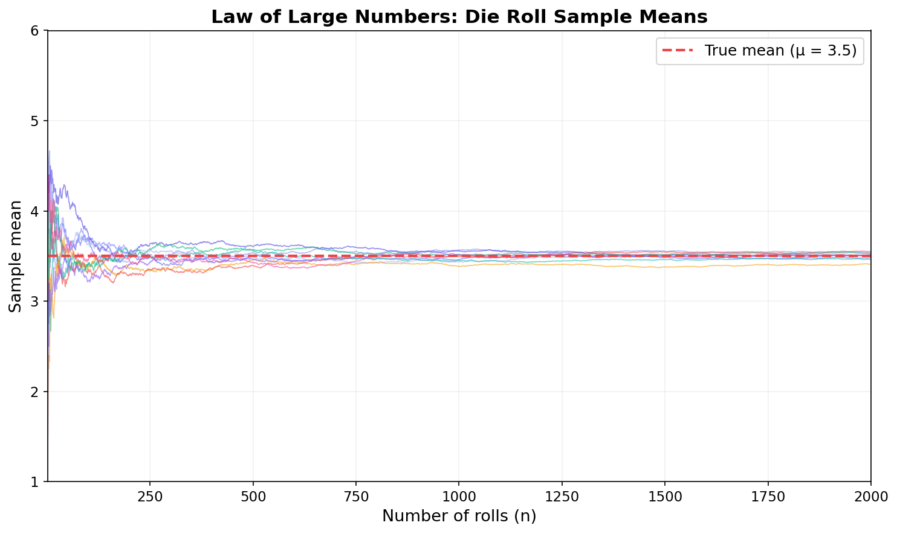
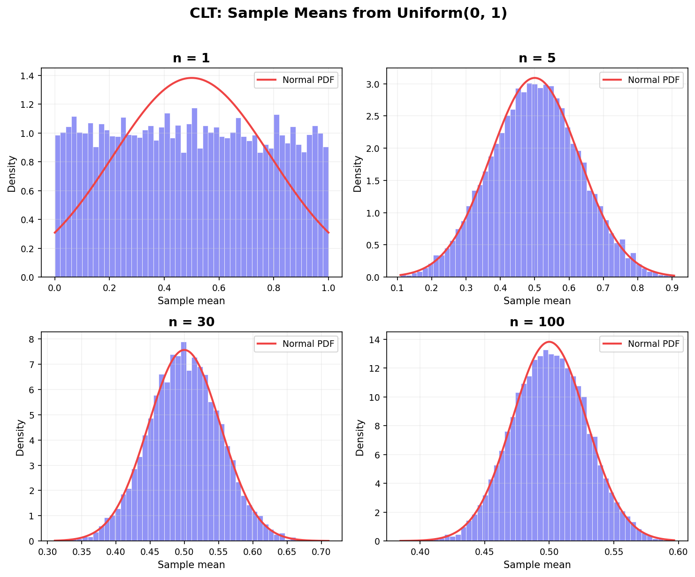
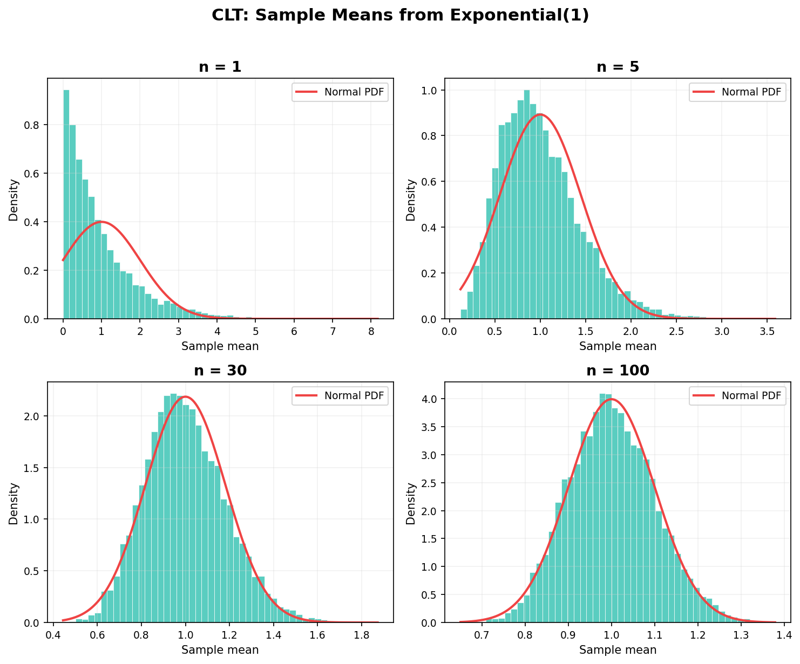
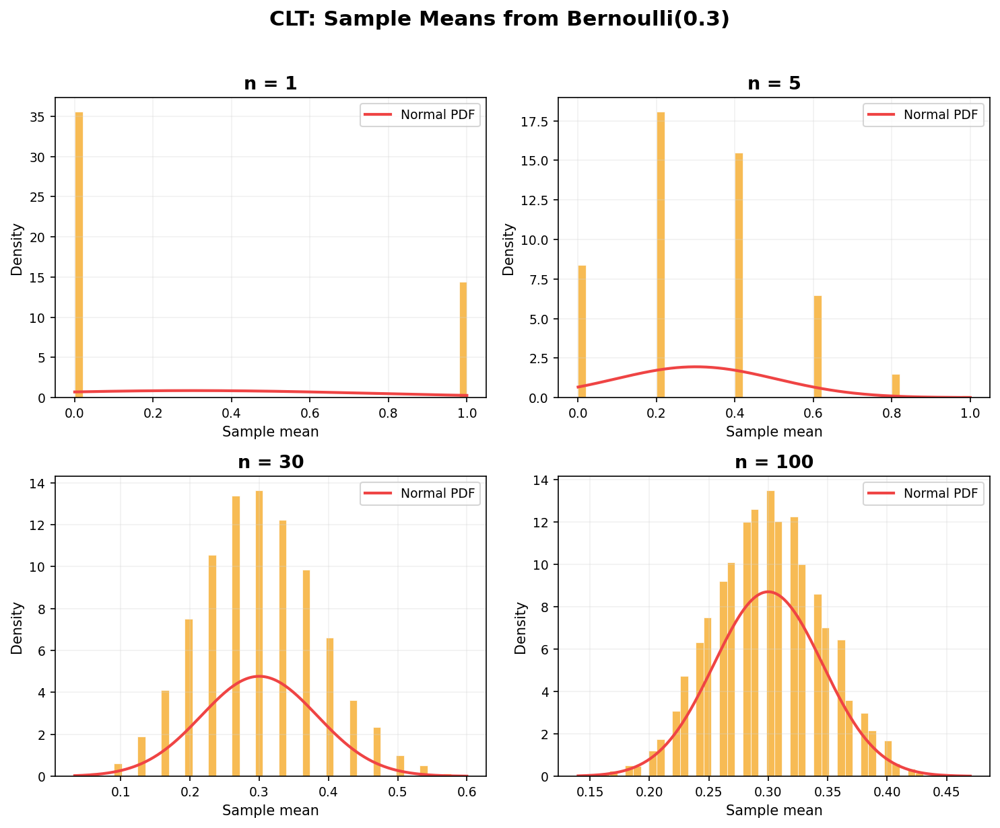
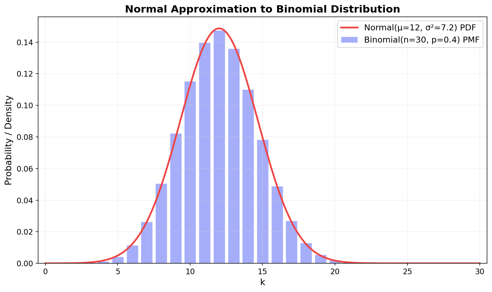

통계학에서 가장 근본적인 질문 두 가지가 있다. **"왜 표본 평균으로 모집단 평균을 추정할 수 있는가?"** 그리고 **"왜 표본이 30개 이상이면 정규분포를 가정해도 되는가?"**

첫 번째 질문의 답이 **큰 수의 법칙**(Law of Large Numbers, LLN)이고, 두 번째 질문의 답이 **중심극한정리**(Central Limit Theorem, CLT)다. 이 두 정리가 없다면 설문 조사도, A/B 테스트도, 머신러닝 모델의 평가도 전부 수학적 근거를 잃는다.

## 큰 수의 약한 법칙 (Weak Law of Large Numbers)

### 직관부터

동전을 10번 던졌을 때 앞면 비율이 0.7이 나올 수 있다. 100번이면 0.55 정도로 줄어든다. 10,000번이면 거의 0.5에 가까워진다. 시행 횟수가 늘어날수록 표본 평균이 모평균에 가까워진다는 것, 이것이 큰 수의 법칙의 핵심이다.

### 정확한 진술

$X_1, X_2, \ldots, X_n$이 평균 $\mu$, 분산 $\sigma^2$을 가진 **독립 동일 분포(i.i.d.)** 확률변수라 하자. 표본 평균 $\bar{X}_n = \frac{1}{n}\sum_{i=1}^{n} X_i$에 대해, 임의의 $\epsilon > 0$에 대해 다음이 성립한다.

$$\lim_{n \to \infty} P\left(|\bar{X}_n - \mu| \geq \epsilon\right) = 0$$

말로 풀면, $n$이 충분히 크면 표본 평균 $\bar{X}_n$이 $\mu$에서 $\epsilon$만큼 벗어날 확률이 0에 수렴한다는 뜻이다. 이를 **확률 수렴**(convergence in probability)이라 부른다.

### 체비셰프 부등식으로 증명하기

증명은 놀라울 정도로 간결하다. **체비셰프 부등식**(Chebyshev's Inequality)에서 출발한다.

$$P(|X - \mu| \geq k) \leq \frac{\text{Var}(X)}{k^2}$$

표본 평균 $\bar{X}_n$은 $E[\bar{X}_n] = \mu$(기댓값의 선형성)이고 $\text{Var}(\bar{X}_n) = \frac{\sigma^2}{n}$(독립이므로)이다. 대입하면 다음을 얻는다.

$$P(|\bar{X}_n - \mu| \geq \epsilon) \leq \frac{\sigma^2}{n\epsilon^2}$$

$n \to \infty$이면 우변이 $0$으로 간다. 끝이다. 우변은 $n$이 작을 때 1을 넘어 아무 정보도 주지 못하지만($\sigma^2 = 1$, $\epsilon = 0.1$이면 $n = 100$에서야 1이 된다), 수렴한다는 사실을 증명하기에는 충분하다.

:::info

**참고**

이 증명이 작동하려면 분산이 유한해야 한다. 다만 유한 분산은 체비셰프 부등식 기반 증명의 조건이고, WLLN 자체는 기댓값만 존재하면 성립할 수 있다(특성함수 기반 증명). 코시 분포(Cauchy Distribution)는 기댓값 자체가 정의되지 않기 때문에 큰 수의 법칙이 성립하지 않는다. 코시 분포에서 표본 평균을 아무리 많이 모아도 수렴하지 않는다는 사실은 꽤 반직관적이다.

:::

## 큰 수의 강한 법칙 (Strong Law of Large Numbers)

약한 법칙은 "특정 $n$에서 벗어날 확률이 작다"고 말한다. **강한 법칙**(Strong Law of Large Numbers, SLLN)은 한 단계 더 강한 주장을 한다.

$$P\left(\lim_{n \to \infty} \bar{X}_n = \mu\right) = 1$$

이것은 **거의 확실한 수렴**(almost sure convergence)이다. 궤적 하나하나가 결국 $\mu$에 수렴한다는 뜻이다.

| | 약한 법칙 (WLLN) | 강한 법칙 (SLLN) |
|---|---|---|
| **수렴 종류** | 확률 수렴 | 거의 확실한 수렴 |
| **직관** | "큰 $n$에서 스냅샷을 찍으면, 대부분 $\mu$ 근처에 있다" | "각 궤적이 끝까지 따라가면, 결국 $\mu$에 도달한다" |
| **비유** | 특정 시점에 대부분의 학생이 교실에 있다 | 모든 학생이 결국 교실에 도착한다 |

강한 법칙이 성립하면 약한 법칙도 자동으로 성립한다. 실전에서 둘의 구분이 문제가 되는 경우는 드물지만, 이론적 증명에서는 결정적인 역할을 하기도 한다. 강한 법칙의 증명은 체비셰프 부등식만으로는 부족하고 보렐-칸텔리 보조정리(Borel-Cantelli Lemma) 같은 측도론적 도구가 필요하므로, 여기서는 결과만 받아들인다.

## 시뮬레이션으로 보는 LLN

주사위를 반복해서 던지면서 표본 평균이 $\mu = 3.5$로 수렴하는지 관찰해보자.



*10개의 독립 궤적이 모두 μ=3.5로 수렴한다. 초반에는 궤적마다 들쭉날쭉하지만, n이 커질수록 빨간 점선에 밀착한다.*

$n$이 50보다 작을 때는 궤적마다 3.5에서 크게 벗어나 어떤 궤적은 4.5, 어떤 궤적은 2.5 근처를 맴돈다. 1000을 넘기면 모든 궤적이 3.5에 사실상 붙는다.

수치로 확인하면 수렴의 속도까지 보인다.

```python
import numpy as np

rng = np.random.default_rng(42)
for n in [10, 50, 100, 500, 1000, 5000]:
    means = [rng.integers(1, 7, size=n).mean() for _ in range(1000)]
    print(f"n={n:>5}: mean of means = {np.mean(means):.4f}, "
          f"std of means = {np.std(means):.4f}")

# n=   10: mean of means = 3.4752, std of means = 0.5333
# n=   50: mean of means = 3.5025, std of means = 0.2463
# n=  100: mean of means = 3.5057, std of means = 0.1721
# n=  500: mean of means = 3.4984, std of means = 0.0751
# n= 1000: mean of means = 3.4990, std of means = 0.0531
# n= 5000: mean of means = 3.4997, std of means = 0.0248
```

표본 평균의 표준편차가 $\frac{\sigma}{\sqrt{n}}$에 비례해 줄어드는 패턴이 선명하다. 주사위의 $\sigma = \sqrt{35/12} \approx 1.708$이므로 이론값은 $n = 100$에서 0.1708, $n = 5000$에서 0.0242이고, 실측이 이를 그대로 따라간다. $n$이 4배가 되면 표준편차는 절반이 된다. 이 관계가 곧 CLT로 이어진다.

## 중심극한정리 (Central Limit Theorem)

큰 수의 법칙은 표본 평균이 모평균에 수렴한다고 말한다. 그렇다면 수렴하는 과정에서 표본 평균은 **어떤 분포**를 따르는가? 이 질문에 답하는 것이 중심극한정리다.

### 정확한 진술

$X_1, X_2, \ldots, X_n$이 평균 $\mu$, 분산 $\sigma^2$을 가진 i.i.d. 확률변수일 때 다음이 성립한다.

$$Z_n = \frac{\bar{X}_n - \mu}{\sigma / \sqrt{n}} \xrightarrow{d} N(0, 1) \quad \text{as } n \to \infty$$

동치 표현으로 쓰면 이렇다.

$$\bar{X}_n \overset{d}{\approx} N\left(\mu, \frac{\sigma^2}{n}\right) \quad \text{for large } n$$

원래 분포가 균일이든, 지수든, 베르누이든, 어떤 괴상한 분포든 표본 평균을 표준화하면 표준정규분포에 수렴한다.

:::warning

**주의**

CLT의 조건을 정확히 기억해야 한다.

- **i.i.d.**: 독립이고 동일한 분포를 따라야 한다.
- **유한 분산**: $\sigma^2 < \infty$여야 한다. 평균은 유한한데 분산이 무한한 분포, 예컨대 파레토($\alpha = 1.5$)나 자유도 2의 t 분포에서는 고전적 CLT가 성립하지 않는다. 코시 분포는 기댓값 단계에서 이미 정의되지 않으므로 애초에 이 정리의 사정권 밖이다.
- **n이 충분히 커야 한다**: 얼마나 커야 하는지는 원래 분포의 비대칭도(skewness)에 달렸다. 대칭 분포면 n=10도 충분할 수 있고, 극단적으로 치우친 분포면 n=100도 부족할 수 있다.

:::

### LLN과 CLT의 관계

| | 큰 수의 법칙 (LLN) | 중심극한정리 (CLT) |
|---|---|---|
| **묻는 것** | $\bar{X}_n$이 어디로 가는가? | $\bar{X}_n$이 어떤 **분포**를 따르는가? |
| **답** | $\mu$로 수렴 | $N(\mu, \sigma^2/n)$에 근사 |
| **비유** | "과녁의 중심을 맞힌다" | "화살이 중심 주위로 **종 모양**으로 퍼진다" |

## CLT 시뮬레이션: 눈으로 확인하기

CLT의 위력을 체감하는 가장 좋은 방법은, 전혀 정규분포가 아닌 분포에서 표본 평균을 반복 추출해보는 것이다. 균일, 지수, 베르누이 세 분포에서 각각 $n$개씩 뽑아 평균을 내는 일을 10,000번 반복하고, 그 평균들의 히스토그램을 이론적 정규분포 곡선과 겹쳐 그렸다.

### 균일분포 Uniform(0, 1)에서



*Uniform(0,1)에서 표본 평균의 분포 변화. n=1일 때는 직사각형이지만, n=30만 되어도 정규분포와 거의 일치한다.*

$n = 1$일 때는 원래 분포 그대로 납작한 직사각형이다. $n = 5$에서 이미 종 모양의 윤곽이 잡히고, $n = 30$이면 빨간 정규분포 곡선과 거의 완벽하게 겹친다.

### 지수분포 Exponential(1)에서

지수분포는 오른쪽으로 긴 꼬리를 가진, 극도로 비대칭인 분포다. 이런 분포에서도 CLT가 작동할까?



*극도로 비대칭인 Exp(1)에서도 n=30이면 정규분포에 상당히 가까워지고, n=100이면 거의 완벽하게 일치한다.*

$n = 1$일 때는 지수분포 특유의 급격한 감소 곡선이 보인다. $n = 5$에서는 아직 오른쪽 꼬리가 남아 있지만 $n = 30$에서 이미 정규분포와 상당히 유사하고, $n = 100$이면 구분이 불가능할 정도다. 비대칭 분포는 대칭 분포보다 수렴이 느리지만, 결국 수렴한다는 사실은 변하지 않는다.

### 베르누이 분포 Bernoulli(0.3)에서

베르누이 분포는 0 또는 1만 가지는 가장 극단적인 이산분포다. 연속적인 정규분포로 수렴할 수 있을까?



*0과 1만 가지는 Bernoulli(0.3)에서도 n이 커지면 표본 평균이 정규분포로 수렴한다. 이산에서 연속으로의 전환이 극적이다.*

$n = 1$일 때는 0과 1에만 막대가 서 있다. $n = 5$에서는 0, 0.2, 0.4, 0.6, 0.8, 1.0의 6개 값만 가능하므로 여전히 듬성듬성하다. 하지만 $n = 30$부터 연속적인 히스토그램이 정규분포 곡선을 따라 형성된다.

:::summary

**핵심 요약**

- 직사각형(균일), 감소 곡선(지수), 점 두 개(베르누이). 원래 분포의 모양이 전혀 달라도 표본 평균은 정규분포로 수렴한다.
- 대칭 분포(균일)는 n=5에서 이미 수렴이 눈에 보이고, 비대칭 분포(지수)는 n=30~100이 필요하다.

:::

## CLT가 중요한 이유: 통계적 추론의 수학적 근거

현대 통계학의 거의 모든 추론 방법이 CLT 위에 서 있다.

### 신뢰구간의 공식이 나오는 원리

모평균 $\mu$를 추정할 때 우리는 이렇게 쓴다.

$$\bar{X} \pm z_{\alpha/2} \cdot \frac{\sigma}{\sqrt{n}}$$

CLT에 의해 $\bar{X}_n \overset{d}{\approx} N(\mu, \sigma^2/n)$이므로 표준화하면 $Z = \frac{\bar{X}_n - \mu}{\sigma/\sqrt{n}} \sim N(0, 1)$이고, $P(-1.96 \leq Z \leq 1.96) = 0.95$를 $\mu$에 대해 풀면 다음을 얻는다.

$$P\left(\bar{X}_n - 1.96 \cdot \frac{\sigma}{\sqrt{n}} \leq \mu \leq \bar{X}_n + 1.96 \cdot \frac{\sigma}{\sqrt{n}}\right) = 0.95$$

CLT가 없으면 $\bar{X}_n$이 정규분포를 따른다는 보장이 없으니 이 공식 자체가 성립하지 않는다. 실제로 정규분포가 아닌 지수분포 모집단에서 표본 50개를 뽑아 이 구간을 20,000번 만들어 보면 참 평균을 94.95% 포함한다. 명목 95%와 거의 일치한다.

### p-값과 가설 검정

가설 검정에서 검정 통계량이 $N(0,1)$을 따른다고 가정하는 것도 CLT 때문이다. CLT가 그 가정을 정당화해주지 않으면 $z$-검정과 $t$-검정 모두 수학적 근거를 잃는다.

## ML에서의 LLN과 CLT

### SGD가 작동하는 이유

경사하강법(Gradient Descent)은 전체 데이터의 그래디언트를 계산한다.

$$\nabla L = \frac{1}{N} \sum_{i=1}^{N} \nabla l_i$$

확률적 경사하강법(SGD)은 이걸 미니배치 $B$개로 근사한다.

$$\nabla \hat{L} = \frac{1}{B} \sum_{i=1}^{B} \nabla l_i$$

왜 이 근사가 유효한가? **LLN에 의해** $\nabla \hat{L}$이 $\nabla L$에 수렴하기 때문이다. 여기에 **CLT를 적용하면** 한 걸음 더 나간다.

$$\nabla \hat{L} \sim N\left(\nabla L, \frac{\sigma^2_{\nabla}}{B}\right)$$

미니배치 그래디언트의 노이즈가 $\frac{1}{\sqrt{B}}$에 비례한다는 것이다. 배치 크기를 4배로 늘리면 노이즈는 절반으로 줄어든다.

:::info

**참고**

[경사하강법](/ml/gradient-descent/)에서 "배치 크기를 키우면 학습이 안정적이지만 일반화 성능이 떨어질 수 있다"고 한 배경이 여기에 있다. 큰 배치는 CLT에 따라 그래디언트 노이즈가 작아지고, 적당한 노이즈가 오히려 flat minima로 이끌어 일반화에 유리하다는 것이 현재 널리 받아들여지는 가설이다. 다만 sharp minima와 일반화 성능의 인과 관계 자체는 아직 논쟁 중이다.

:::

### 교차 검증 점수의 분포

[교차 검증](/ml/cross-validation/)에서 $k$-fold CV의 평균 점수를 보고할 때, 각 fold의 점수 $s_1, \ldots, s_k$에 대해 CLT를 적용하면 다음을 얻는다.

$$\bar{s} \sim N\left(\mu_s, \frac{\sigma_s^2}{k}\right)$$

10-fold CV의 평균이 0.8464, 표준편차가 0.0099라면 95% 신뢰구간은 $0.8464 \pm 0.0061$, 즉 $[0.8403, 0.8525]$가 된다. 모델 성능을 단일 숫자가 아니라 구간으로 보고할 수 있는 근거다.

### 이상치 탐지의 정당성

[이상치 탐지](/ml/anomaly-detection/)에서 데이터가 가우시안을 따른다고 가정하고 $\mu \pm 3\sigma$ 바깥을 이상치로 판단한다. 원래 데이터가 정규분포가 아니더라도, 충분히 많은 독립적 요인이 합쳐진 측정값이라면 CLT에 의해 근사적으로 정규분포를 따른다. 키, 시험 점수, 센서 측정값이 정규분포처럼 보이는 이유가 이것이다.

## 이항 분포의 정규 근사

CLT의 가장 실용적인 응용 중 하나가 **이항 분포의 정규 근사**(Normal Approximation to Binomial)다.

### 왜 필요한가

이항 분포 $X \sim \text{Binomial}(n, p)$는 $n$이 클 때 정확한 계산이 번거롭다. $P(X \leq 45)$를 구하려면 $\sum_{k=0}^{45}\binom{n}{k}p^k(1-p)^{n-k}$를 계산해야 한다.

이항 분포는 $n$개의 독립적인 베르누이 시행의 합이다.

$$X = X_1 + X_2 + \cdots + X_n, \quad X_i \sim \text{Bernoulli}(p)$$

CLT를 적용하면 다음이 성립하고,

$$\frac{X - np}{\sqrt{np(1-p)}} \xrightarrow{d} N(0, 1)$$

따라서 이항 분포를 정규분포로 근사할 수 있다.

$$X \overset{d}{\approx} N\left(np, \, np(1-p)\right)$$

### 적용 조건

정규 근사가 유효하려면 $np \geq 5$이고 $n(1-p) \geq 5$여야 한다. $p$가 극단적(0.01이나 0.99)이면 $n$이 매우 커야 한다.

### 연속성 보정 (Continuity Correction)

이산 분포를 연속 분포로 근사하면 정보 손실이 생긴다. 이산값 $k$를 연속 구간 $[k - 0.5, k + 0.5]$에 대응시켜 이를 보정하는 기법이 **연속성 보정**(Continuity Correction)이다.

$$P(X \leq k) \approx \Phi\left(\frac{k + 0.5 - np}{\sqrt{np(1-p)}}\right)$$

$$P(X = k) \approx \Phi\left(\frac{k + 0.5 - np}{\sqrt{np(1-p)}}\right) - \Phi\left(\frac{k - 0.5 - np}{\sqrt{np(1-p)}}\right)$$

```python
import numpy as np
from scipy import stats

n, p = 30, 0.4
mu, sigma = n * p, np.sqrt(n * p * (1 - p))  # 12.0, 2.683
# np = 12.0 >= 5, n(1-p) = 18.0 >= 5 이므로 근사 조건을 만족한다

print(f"Exact (Binomial):         {stats.binom.cdf(15, n, p):.6f}")
print(f"Normal (no correction):   {stats.norm.cdf(15, mu, sigma):.6f}")
print(f"Normal (with correction): {stats.norm.cdf(15.5, mu, sigma):.6f}")

# Exact (Binomial):         0.902943
# Normal (no correction):   0.868224
# Normal (with correction): 0.903947
```

보정 없이 근사하면 오차가 3.47%포인트지만, 연속성 보정을 넣으면 0.10%포인트로 떨어진다. 이산값 하나에 폭 1의 구간을 배정하는 것만으로 오차가 사실상 사라지는 셈이다.



*Binomial(30, 0.4)의 PMF(막대)와 Normal(12, 7.2)의 PDF(곡선). 정규 곡선이 이항 분포의 막대를 잘 감싸고 있다.*

### A/B 테스트 연결

웹 서비스의 A/B 테스트에서 전환율이 통계적으로 유의하게 달라졌는지 검정할 때 바로 이 정규 근사를 사용한다. 방문자 $n$명 중 전환한 사람 수 $X \sim \text{Binomial}(n, p)$이고, $n$이 충분히 크면 다음이 성립한다.

$$\hat{p} = \frac{X}{n} \overset{d}{\approx} N\left(p, \frac{p(1-p)}{n}\right)$$

두 그룹의 전환율 차이 $\hat{p}_A - \hat{p}_B$의 분포를 정규분포로 근사해서 $z$-검정을 수행하는 것이다. CLT 없이는 A/B 테스트의 통계적 유의성을 계산할 수 없다.

## 자주 혼동하는 포인트

### "n ≥ 30" 규칙의 진실

교과서에서 "n ≥ 30이면 CLT를 적용할 수 있다"고 흔히 말하지만, 이것은 **경험 법칙**(rule of thumb)이지 수학적 정리가 아니다.

- **대칭 분포**(균일 등): $n = 10$이면 이미 충분히 정규에 가깝다.
- **약간 비대칭**(지수 등): $n = 30$이면 꽤 괜찮다.
- **극도로 비대칭**(로그정규, 파레토 등): $n = 100$ 이상이 필요할 수 있다.

핵심은 $n$ 자체가 아니라 **원래 분포와 정규분포 사이의 거리**다. 비대칭도(skewness)와 첨도(kurtosis)가 클수록 더 큰 $n$이 필요하다.

### CLT는 "분포"가 정규에 수렴한다는 것이지, "데이터"가 정규가 된다는 것이 아니다

데이터 $X_1, X_2, \ldots, X_n$ 자체는 원래 분포를 따른다. 정규분포로 수렴하는 것은 **표본 평균** $\bar{X}_n$의 분포다.

```python
import numpy as np
from scipy.stats import skew

rng = np.random.default_rng(42)

data = rng.exponential(1.0, size=10000)
print(f"데이터 자체의 왜도      = {skew(data):.4f}")      # 1.9891 (매우 비대칭)

means = [np.mean(rng.exponential(1.0, 50)) for _ in range(10000)]
print(f"표본 평균(n=50)의 왜도  = {skew(means):.4f}")     # 0.2642 (거의 대칭)
```

지수분포의 왜도는 2인데, 표본 평균의 왜도는 $2/\sqrt{n} = 2/\sqrt{50} \approx 0.283$으로 줄어든다. 데이터의 비대칭은 그대로 남아 있고, 평균의 분포만 정규에 가까워진다.

## 마치며

- **큰 수의 법칙**: 표본을 많이 모으면 표본 평균은 모평균에 수렴한다.
- **중심극한정리**: 표본을 많이 모으면 표본 평균의 분포는 정규분포에 수렴한다.

이 두 정리가 통계적 추론, 신뢰구간, 가설 검정, SGD, A/B 테스트를 수학적으로 정당화한다.

:::summary

**핵심 요약**

- **WLLN**: 표본 평균이 모평균에 확률 수렴한다. 체비셰프 부등식으로 간결하게 증명된다.
- **SLLN**: 각 궤적이 거의 확실하게 수렴한다. 실전에서는 WLLN과 구분할 필요가 거의 없다.
- **CLT**: i.i.d. + 유한 분산 조건 하에서 $\bar{X}_n$의 표준화가 $N(0,1)$에 분포 수렴한다. 원래 분포가 무엇이든 상관없다.
- **이항 분포의 정규 근사**: $np \geq 5$, $n(1-p) \geq 5$일 때 유효하며, 연속성 보정을 넣으면 오차가 3.47%p에서 0.10%p로 줄어든다.
- **ML 연결**: SGD 미니배치의 수렴(LLN), 그래디언트 노이즈의 분포(CLT), CV 점수의 신뢰구간(CLT).

:::

## 함께 보면 좋은 글

- [이산확률분포 총정리](/stats/discrete-distributions/)
- [연속확률분포 총정리](/stats/continuous-distributions/)
- [확률변수와 기댓값](/stats/random-variables-expectation/)

## 참고자료

- Blitzstein, J. K., & Hwang, J. (2019). *Introduction to Probability* (2nd ed.), Chapters 10-11.
- Wasserman, L. (2004). *All of Statistics*, Chapters 5-6.
- Harvard Stat 110: [Probability Course](https://projects.iq.harvard.edu/stat110)
- MIT 6.041: [Probabilistic Systems Analysis](https://ocw.mit.edu/courses/6-041-probabilistic-systems-analysis-and-applied-probability-fall-2010/)
