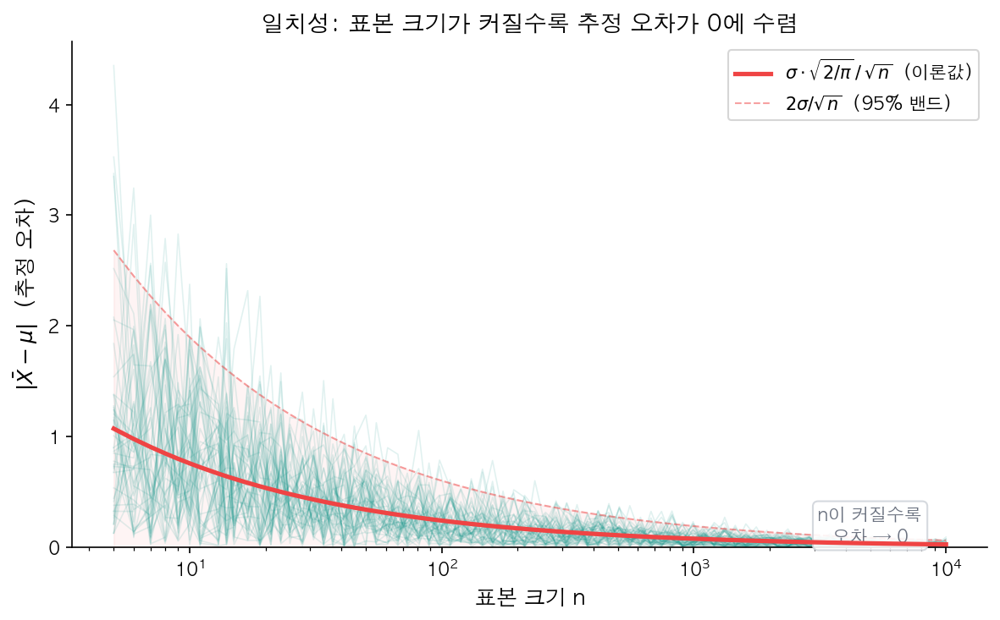
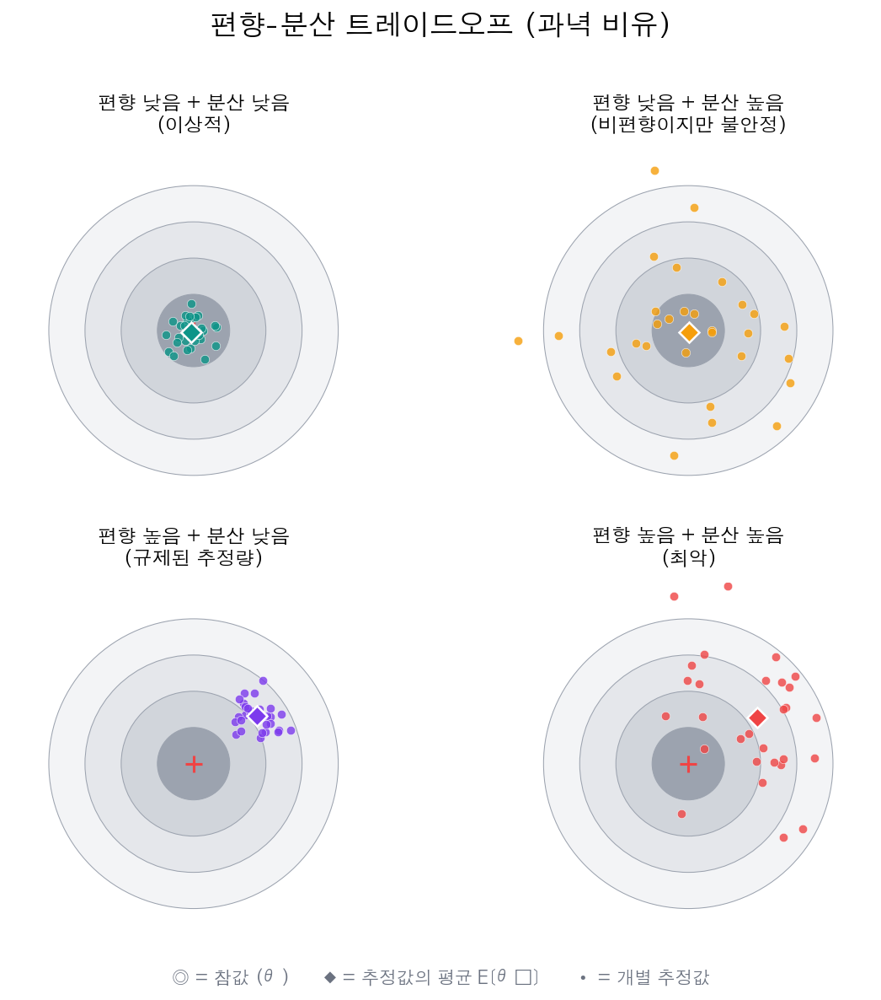

[이전 시리즈](/stats/information-theory/)에서 확률론의 기초를 다졌다. 확률변수, 기댓값, 분산, 다양한 확률분포, 극한 정리, 정보이론까지 — 이 도구들은 "불확실한 세상을 수학으로 표현하는 언어"였다.

그런데 현실의 질문은 다르다. "이 동전의 앞면 확률은 정확히 얼마인가?", "고객의 평균 체류 시간은 얼마인가?", "이 약의 효과 크기는 얼마인가?" — 확률분포를 안다고 이 질문에 답할 수 있는 건 아니다. **모집단의 진짜 값(모수)을 모르는 상태에서, 표본 데이터만으로 그 값을 추측해야 한다**. 여기서 **통계적 추론(Statistical Inference)**이 시작된다.

이번 글은 통계적 추론 시리즈의 첫 번째 주제를 다룬다. 가장 기본적인 질문 — "모수를 하나의 숫자로 추정한다면, 어떤 값이 가장 좋은가?" — 에서 출발하는 **점추정(Point Estimation)**을 살펴보자.

---

## 모수란 무엇인가?

### 통계적 모형의 구조

통계적 추론의 첫 번째 단계는 데이터가 어떤 확률 모형에서 생성되었는지 가정하는 데서 시작한다.

예를 들어, 어떤 공장에서 생산되는 볼트의 길이를 측정한다고 하자. 측정값 $X_1, X_2, \ldots, X_n$이 있을 때, 이 데이터가 정규분포 $N(\mu, \sigma^2)$를 따른다고 가정한다. 여기서 $\mu$와 $\sigma^2$가 바로 **모수(Parameter)**다.

<strong>모수(Parameter, $\theta$)</strong> — 확률분포의 형태를 결정하는 미지의 상수. 이 값은 모집단의 특성을 완전히 규정하지만, 우리는 그 참값을 직접 알 수 없다.

| 분포 | 모수 | 의미 |
|---|---|---|
| $\text{Bernoulli}(p)$ | $p$ | 성공 확률 |
| $N(\mu, \sigma^2)$ | $\mu, \sigma^2$ | 평균, 분산 |
| $\text{Poisson}(\lambda)$ | $\lambda$ | 단위 시간당 평균 발생 횟수 |
| $\text{Exponential}(\lambda)$ | $\lambda$ | 발생률 (또는 $1/\lambda$ = 평균 대기시간) |

[확률분포 시리즈](/stats/discrete-distributions/)에서 이 분포들을 다뤘을 때는 모수를 "주어진 값"으로 취급했다. $p = 0.5$인 동전, $\lambda = 3$인 포아송 과정처럼. 하지만 현실에서는 $p$도 $\lambda$도 알 수 없다. **데이터를 관찰해서 이 값들을 추정하는 것**이 통계적 추론의 핵심이다.

### 모수 공간

모수가 취할 수 있는 모든 값의 집합을 <strong>모수 공간(Parameter Space, $\Theta$)</strong>이라 한다.

- $\text{Bernoulli}(p)$: $\Theta = [0, 1]$
- $N(\mu, \sigma^2)$: $\Theta = \mathbb{R} \times (0, \infty)$
- $\text{Poisson}(\lambda)$: $\Theta = (0, \infty)$

모수 공간을 명시하는 것이 중요한 이유는, 추정값이 이 공간 안에 있어야 의미가 있기 때문이다. 확률을 추정했는데 1.3이 나온다면 뭔가 잘못되었다고 볼 수 있다.

---

## 추정량과 추정값: 함수 vs 숫자

점추정에서 가장 중요한 구분이 하나 있다. **추정량(Estimator)**과 **추정값(Estimate)**의 차이를 이해해야 한다.

> **추정량(Estimator)** $\hat{\theta}$: 데이터를 입력으로 받아 모수의 추정값을 출력하는 **함수(규칙)**. 데이터를 넣기 전의 "레시피"이다.
>
> **추정값(Estimate)** $\hat{\theta}_{\text{obs}}$: 실제 관측된 데이터를 추정량에 넣어 계산한 **구체적인 숫자**.

이 구분이 왜 중요할까? 추정량은 확률변수이고, 추정값은 상수이기 때문이다. 추정량의 성질(편향, 분산 등)을 논할 수 있는 것은, 그것이 아직 데이터가 주어지기 전의 확률변수라는 점에서 비롯된다.

```python
import numpy as np

np.random.seed(42)

# 모수: 모집단 평균 μ = 5 (실제로는 모르는 값)
true_mu = 5.0

# 추정량: "표본 평균" — 데이터를 받아 평균을 반환하는 함수(규칙)
def sample_mean(data):
    return np.mean(data)

# 추정값: 특정 표본을 넣었을 때 나오는 숫자
sample1 = np.random.normal(true_mu, 2, size=10)
sample2 = np.random.normal(true_mu, 2, size=10)

estimate1 = sample_mean(sample1)
estimate2 = sample_mean(sample2)

print(f"표본 1의 추정값: {estimate1:.4f}")
print(f"표본 2의 추정값: {estimate2:.4f}")
print(f"참값 μ = {true_mu}")
# 표본 1의 추정값: 5.8961
# 표본 2의 추정값: 3.4187
# 참값 μ = 5.0
```

같은 추정량(표본 평균)이라도, 표본이 달라지면 추정값이 달라진다. 추정량은 하나지만, 추정값은 표본마다 다른 숫자가 나온다. 이 "표본마다 달라지는 정도"가 곧 추정량의 분산이고, 이것이 추정량의 품질을 따지는 출발점이 된다.

<div style="background: #f0f4ff; border-left: 4px solid #3182f6; padding: 16px 20px; margin: 20px 0; border-radius: 4px;"><strong>💡 참고</strong><br><strong>통계량(Statistic)</strong>이란 표본의 함수 중 모수에 의존하지 않는 것을 말한다. 표본 평균 $\bar{X} = \frac{1}{n}\sum X_i$는 모수 $\mu$를 포함하지 않으므로 통계량이다. 추정량은 특별히 "모수를 추정하는 목적으로 사용하는 통계량"이다.</div>

---

## 대표적 점추정량: 표본 평균과 표본 분산

### 표본 평균

모집단 평균 $\mu$를 추정하는 가장 자연스러운 추정량:

$$\bar{X} = \frac{1}{n}\sum_{i=1}^{n} X_i$$

직관적으로도, "데이터의 평균을 구한다"는 것이 모집단 평균을 추정하는 자연스러운 방법이다. [큰 수의 법칙](/stats/lln-and-clt/)이 이 직관을 수학적으로 보장한다 — $n$이 커지면 $\bar{X}$는 $\mu$에 수렴한다.

### 표본 분산 — 왜 n이 아니라 n-1로 나누는가?

모집단 분산 $\sigma^2$의 추정량으로 두 가지 후보가 있다:

$$\tilde{S}^2 = \frac{1}{n}\sum_{i=1}^{n}(X_i - \bar{X})^2 \qquad \text{vs} \qquad S^2 = \frac{1}{n-1}\sum_{i=1}^{n}(X_i - \bar{X})^2$$

$n$으로 나누는 것이 자연스러워 보이지만, 통계학에서는 $n-1$로 나누는 $S^2$를 표준으로 사용한다. 왜일까?

핵심은 **자유도(Degrees of Freedom)**에 있다. $n$개의 편차 $X_i - \bar{X}$는 서로 독립이 아니다. 이들의 합은 항상 0이기 때문이다:

$$\sum_{i=1}^{n}(X_i - \bar{X}) = 0$$

$n$개의 편차 중 $n-1$개만 자유롭게 변할 수 있고, 마지막 하나는 나머지에 의해 결정된다. 자유롭게 변하는 정보의 개수가 $n-1$이므로, $n-1$로 나누는 것이 맞다. 이것을 **베셀 보정(Bessel's Correction)**이라 한다.

수학적으로 증명하면:

$$E[\tilde{S}^2] = E\left[\frac{1}{n}\sum(X_i - \bar{X})^2\right] = \frac{n-1}{n}\sigma^2 \neq \sigma^2$$

$$E[S^2] = E\left[\frac{1}{n-1}\sum(X_i - \bar{X})^2\right] = \sigma^2 \quad \checkmark$$

$n$으로 나누면 평균적으로 $\sigma^2$보다 작은 값이 나온다. 즉, 모분산을 **과소추정**하는 경향이 있다. $n-1$로 나누면 이 편향이 정확히 사라진다.

```python
import numpy as np

np.random.seed(42)
true_var = 4.0  # σ² = 4
n = 10
n_simulations = 100_000

biased_estimates = []
unbiased_estimates = []

for _ in range(n_simulations):
    sample = np.random.normal(0, np.sqrt(true_var), size=n)
    biased_estimates.append(np.var(sample, ddof=0))     # n으로 나눔
    unbiased_estimates.append(np.var(sample, ddof=1))    # n-1로 나눔

print(f"σ² = {true_var}")
print(f"E[S̃²] (n으로 나눔):   {np.mean(biased_estimates):.4f}")
print(f"E[S²] (n-1로 나눔): {np.mean(unbiased_estimates):.4f}")
# σ² = 4.0
# E[S̃²] (n으로 나눔):   3.6008
# E[S²] (n-1로 나눔): 4.0009
```

$n$으로 나눈 $\tilde{S}^2$의 평균은 3.60 — 참값 4보다 체계적으로 작다. $n-1$로 나눈 $S^2$는 거의 정확히 4에 수렴한다. 이것이 `numpy`에서 `ddof=1`을 명시해야 하는 이유다.

<div style="background: #fff3f0; border-left: 4px solid #ff6b6b; padding: 16px 20px; margin: 20px 0; border-radius: 4px;"><strong>⚠️ 주의</strong><br>Python에서 <code>np.var()</code>의 기본값은 <code>ddof=0</code>(n으로 나눔)이고, <code>np.std()</code>도 마찬가지다. 통계적 추정 목적으로 사용할 때는 반드시 <code>ddof=1</code>을 지정해야 한다. 반면 pandas의 <code>.var()</code>와 <code>.std()</code>는 기본값이 <code>ddof=1</code>이다.</div>

---

## 좋은 추정량의 조건

같은 모수를 추정하는 방법은 여러 가지다. 모집단 평균 $\mu$를 추정하려면 표본 평균을 쓸 수도 있고, 중앙값을 쓸 수도 있고, 최솟값과 최댓값의 평균을 쓸 수도 있다. 어떤 추정량이 "더 좋은" 것인지 판단하는 기준이 필요하다.

### 비편향성 (Unbiasedness)

추정량 $\hat{\theta}$가 **비편향(Unbiased)**이라 함은:

$$E[\hat{\theta}] = \theta$$

즉, 추정량을 무수히 많은 표본에 대해 반복하면, 그 평균이 참값과 정확히 일치한다는 뜻이다. 한 번의 추정이 정확할 필요는 없지만, **평균적으로는 맞추는** 것이다.

**편향(Bias)**은 이 기대값과 참값의 차이:

$$\text{Bias}(\hat{\theta}) = E[\hat{\theta}] - \theta$$

앞서 확인했듯이:
- 표본 평균 $\bar{X}$: $E[\bar{X}] = \mu$ → **비편향** ✓
- $n$으로 나눈 표본분산 $\tilde{S}^2$: $E[\tilde{S}^2] = \frac{n-1}{n}\sigma^2$ → **편향** ✗
- $n-1$로 나눈 표본분산 $S^2$: $E[S^2] = \sigma^2$ → **비편향** ✓

<div style="background: #f0f4ff; border-left: 4px solid #3182f6; padding: 16px 20px; margin: 20px 0; border-radius: 4px;"><strong>💡 참고</strong><br>비편향성이 항상 최선은 아니다. 뒤에서 다룰 MSE 분해에서 보겠지만, 약간의 편향을 허용하면 분산이 크게 줄어들어 전체적으로 더 나은 추정을 할 수 있다. 이것이 ML에서 <a href="/ml/regularization/">규제(Regularization)</a>가 작동하는 원리이기도 하다.</div>

### 일치성 (Consistency)

추정량 $\hat{\theta}_n$이 **일치추정량(Consistent Estimator)**이라 함은:

$$\hat{\theta}_n \xrightarrow{P} \theta \quad (n \to \infty)$$

데이터가 많아질수록 추정량이 참값에 수렴한다는 것이다. [큰 수의 법칙](/stats/lln-and-clt/)이 바로 표본 평균의 일치성을 보장한다.

비편향성과 일치성은 서로 다른 개념이다:
- **비편향이지만 비일치**: 존재 가능하지만 실전에서는 드물다.
- **편향이지만 일치**: $\tilde{S}^2$(n으로 나눈 표본분산)가 그 예. 편향이 $\frac{n-1}{n}\sigma^2 - \sigma^2 = -\frac{\sigma^2}{n}$이므로, $n \to \infty$이면 편향이 0으로 사라진다.

실전에서는 **일치성이 비편향성보다 중요한 경우가 많다**. 데이터가 충분하면 결국 정답에 도달한다는 보장이 있기 때문이다.

```python
import numpy as np

np.random.seed(42)
true_mu = 10.0
n_reps = 1000  # 각 n에서 1000회 반복

# 표본 크기가 커질수록 평균 오차가 줄어든다
sample_sizes = [5, 10, 50, 100, 500, 1000, 5000, 10000]
for n in sample_sizes:
    errors = [abs(np.mean(np.random.normal(true_mu, 3, size=n)) - true_mu)
              for _ in range(n_reps)]
    mean_error = np.mean(errors)
    bar = '█' * int(mean_error * 30)
    print(f"n = {n:>5d}  |  평균|오차| = {mean_error:.4f}  {bar}")

# n =     5  |  평균|오차| = 1.0706  ████████████████████████████████
# n =    10  |  평균|오차| = 0.7511  ██████████████████████
# n =    50  |  평균|오차| = 0.3368  ██████████
# n =   100  |  평균|오차| = 0.2441  ███████
# n =   500  |  평균|오차| = 0.1093  ███
# n =  1000  |  평균|오차| = 0.0759  ██
# n =  5000  |  평균|오차| = 0.0324
# n = 10000  |  평균|오차| = 0.0230
```

1000회 반복의 평균 오차가 $n$이 커질수록 단조감소한다. 이론적으로 평균 오차는 $\sigma\sqrt{2/\pi}/\sqrt{n}$에 비례하므로, $n$을 4배로 늘리면 오차가 절반으로 줄어든다. 시각적으로 더 많은 시뮬레이션 궤적을 겹쳐 보면 패턴이 선명해진다.


<p align="center" style="color: #888; font-size: 13px;"><em>50개의 시뮬레이션 궤적(반투명)이 모두 0으로 수렴한다. 빨간 선은 이론적 기대 오차 σ√(2/π)/√n.</em></p>

### 효율성 (Efficiency)

두 추정량이 모두 비편향일 때, **분산이 작은 쪽이 더 효율적**이다.

$$\text{Var}(\hat{\theta}_1) < \text{Var}(\hat{\theta}_2) \implies \hat{\theta}_1 \text{이 더 효율적}$$

예를 들어, 정규분포 $N(\mu, \sigma^2)$에서 $\mu$를 추정할 때:

| 추정량 | 비편향? | 분산 |
|---|---|---|
| 표본 평균 $\bar{X}$ | ✓ | $\sigma^2 / n$ |
| 표본 중앙값 | ✓ | $\pi\sigma^2 / (2n) \approx 1.57\sigma^2 / n$ |

두 추정량 모두 비편향이지만, 표본 평균의 분산이 더 작다. 정규분포에서 표본 평균은 중앙값보다 약 57% 더 효율적이다. 단, 이건 정규분포일 때의 이야기다 — 이상치가 많은 분포에서는 중앙값이 더 안정적(robust)할 수 있다.

#### 크래머-라오 하한 (Cramér-Rao Lower Bound)

비편향 추정량의 분산에는 **이론적 최솟값**이 존재한다. 이것이 **크래머-라오 하한(CRLB)**이다:

$$\text{Var}(\hat{\theta}) \geq \frac{1}{nI(\theta)}$$

여기서 $I(\theta)$는 **피셔 정보량(Fisher Information)**으로, 하나의 관측값이 모수에 대해 담고 있는 정보의 양을 측정한다:

$$I(\theta) = E\left[\left(\frac{\partial}{\partial\theta} \log f(X; \theta)\right)^2\right]$$

이 하한에 정확히 도달하는 추정량을 **효율적 추정량(Efficient Estimator)** 또는 **최적 비편향 추정량**이라 한다. 정규분포에서 $\bar{X}$는 $\mu$에 대한 효율적 추정량이다.

<div style="background: #f0fff4; border-left: 4px solid #51cf66; padding: 16px 20px; margin: 20px 0; border-radius: 4px;"><strong>✅ 팁</strong><br>크래머-라오 하한의 실전적 의미: "이보다 더 정밀한 비편향 추정은 불가능하다." 물론 편향을 허용하면 이 한계를 넘길 수 있다 — 이것이 정규화(규제)의 수학적 정당성이기도 하다.</div>

---

## MSE: 편향과 분산을 하나로

### 비편향성만으로는 부족하다

비편향 추정량이 항상 최선은 아니다. 분산이 매우 큰 비편향 추정량보다, 약간의 편향이 있더라도 분산이 작은 추정량이 실전에서 더 쓸모 있을 수 있다.

이 트레이드오프를 하나의 지표로 요약한 것이 **평균제곱오차(Mean Squared Error, MSE)**다:

$$\text{MSE}(\hat{\theta}) = E[(\hat{\theta} - \theta)^2]$$

MSE는 추정량이 참값에서 얼마나 벗어나는지를 평균적으로 측정한다. 그리고 이것은 편향과 분산으로 깔끔하게 분해된다.

### 편향-분산 분해 (Bias-Variance Decomposition)

$$\text{MSE}(\hat{\theta}) = \text{Bias}(\hat{\theta})^2 + \text{Var}(\hat{\theta})$$

증명은 간단하다. $\hat{\theta} - \theta$를 $(\hat{\theta} - E[\hat{\theta}]) + (E[\hat{\theta}] - \theta)$로 분해하면:

$$\text{MSE} = E[(\hat{\theta} - \theta)^2] = E\left[\left((\hat{\theta} - E[\hat{\theta}]) + (E[\hat{\theta}] - \theta)\right)^2\right]$$

전개하면 교차항의 기댓값이 0이 되어 ($E[\hat{\theta} - E[\hat{\theta}]] = 0$):

$$= E[(\hat{\theta} - E[\hat{\theta}])^2] + (E[\hat{\theta}] - \theta)^2 = \text{Var}(\hat{\theta}) + \text{Bias}(\hat{\theta})^2$$

이 분해가 전달하는 메시지는 명확하다:
- **비편향 추정량**: Bias = 0이므로 MSE = Var. 분산만 줄이면 된다.
- **편향 추정량**: Bias² + Var. 편향을 조금 키워서 분산을 크게 줄일 수 있다면, 전체 MSE가 작아진다.

### 과녁 비유

이 개념을 과녁에 비유하면 직관적이다.


<p align="center" style="color: #888; font-size: 13px;"><em>과녁 중심(◎)이 참값 θ, 점들이 개별 추정값, 다이아몬드(◆)가 추정값의 평균이다.</em></p>

왼쪽 아래(편향 높음 + 분산 낮음)의 경우가 흥미롭다. 점들이 과녁 중심에서 벗어나 있지만 모여 있다. MSE 관점에서, 이것이 오른쪽 위(비편향 + 분산 높음)보다 더 나을 수 있다.

### 시뮬레이션: 편향된 추정량이 더 나을 수 있다

$n$으로 나눈 표본분산(편향)과 $n-1$로 나눈 표본분산(비편향)의 MSE를 비교해 보자.

```python
import numpy as np

np.random.seed(42)
true_var = 4.0
n = 5  # 표본이 작을 때 차이가 드러남
n_sims = 100_000

biased = []    # n으로 나눔
unbiased = []  # n-1로 나눔

for _ in range(n_sims):
    sample = np.random.normal(0, np.sqrt(true_var), size=n)
    biased.append(np.var(sample, ddof=0))
    unbiased.append(np.var(sample, ddof=1))

biased = np.array(biased)
unbiased = np.array(unbiased)
```

10만 번의 시뮬레이션에서 같은 표본에 대해 두 가지 방식(`ddof=0` vs `ddof=1`)으로 분산을 추정했다. 표본 크기를 $n=5$로 작게 잡았는데, 편향의 영향이 작은 표본에서 가장 뚜렷하게 드러나기 때문이다. 이제 각 추정량의 MSE를 Bias²와 Var로 분해해 보자.

```python
# MSE 계산
mse_biased = np.mean((biased - true_var) ** 2)
mse_unbiased = np.mean((unbiased - true_var) ** 2)

# Bias²와 Variance 분해
bias_biased = np.mean(biased) - true_var
bias_unbiased = np.mean(unbiased) - true_var

print("=" * 50)
print(f"{'':>20} {'n으로 나눔':>12} {'n-1로 나눔':>12}")
print("=" * 50)
print(f"{'E[추정량]':>20} {np.mean(biased):>12.4f} {np.mean(unbiased):>12.4f}")
print(f"{'Bias':>20} {bias_biased:>12.4f} {bias_unbiased:>12.4f}")
print(f"{'Bias²':>20} {bias_biased**2:>12.4f} {bias_unbiased**2:>12.4f}")
print(f"{'Var':>20} {np.var(biased):>12.4f} {np.var(unbiased):>12.4f}")
print(f"{'MSE':>20} {mse_biased:>12.4f} {mse_unbiased:>12.4f}")
print("=" * 50)
# ==================================================
#                       n으로 나눔   n-1로 나눔
# ==================================================
#             E[추정량]       3.2062       4.0077
#                 Bias      -0.7938       0.0077
#                Bias²       0.6301       0.0001
#                  Var       5.1593       8.0614
#                  MSE       5.7895       8.0615
# ==================================================
```

놀라운 결과가 나왔다. 편향된 추정량($n$으로 나눔)의 MSE가 **비편향 추정량보다 오히려 작다**. 편향(Bias² ≈ 0.63)이 있지만, 분산이 훨씬 작아서(5.16 vs 8.06) 전체 MSE에서 이긴다.

$n$이 작을수록 이 차이가 두드러지고, $n$이 커지면 편향이 0에 수렴하면서 두 추정량의 MSE가 비슷해진다. **"비편향이 항상 좋다"는 편견을 버려야 한다.**

<div style="background: #f0f4ff; border-left: 4px solid #3182f6; padding: 16px 20px; margin: 20px 0; border-radius: 4px;"><strong>💡 ML에서의 편향-분산 트레이드오프</strong><br>이 MSE 분해는 ML에서 <a href="/ml/regularization/">규제(Regularization)</a>의 수학적 근거다. Ridge 회귀에서 가중치에 페널티를 부과하면 추정량에 편향이 생기지만, 분산이 크게 줄어든다. 결과적으로 MSE(= 테스트 오차)가 줄어든다. <a href="/ml/bias-variance/">편향-분산 트레이드오프</a>가 실은 이 공식에서 출발한 것이다.</div>

---

## 충분 통계량: 정보 손실 없는 요약

### 직관

$n$개의 데이터를 하나의 숫자로 압축해야 한다면, 당연히 정보가 손실될 수 있다. 그런데 **모수 추정에 필요한 정보는 하나도 잃지 않으면서** 데이터를 요약할 수 있는 통계량이 존재한다. 이것이 **충분 통계량(Sufficient Statistic)**이다.

예를 들어, 동전을 100번 던져서 앞면이 나온 횟수를 세면 62번이었다고 하자. 이 "62"라는 숫자만으로 $p$를 추정하기에 충분할까? 직관적으로 그렇다. 던진 순서(HHTHT...)의 세부 정보는 $p$ 추정에 추가 정보를 주지 않는다.

### 정의

통계량 $T(X)$가 모수 $\theta$에 대해 **충분**하다 함은, $T(X)$가 주어졌을 때 데이터 $X$의 조건부 분포가 $\theta$에 의존하지 않는다는 것이다:

$$P(X = x \mid T(X) = t) \text{ does not depend on } \theta$$

통계량의 값을 알고 나면, 원래 데이터를 더 봐도 $\theta$에 대해 추가 정보를 얻을 수 없다는 뜻이다.

### Fisher-Neyman 분해 정리

충분 통계량을 찾는 실용적인 도구가 **Fisher-Neyman 분해 정리(Factorization Theorem)**다:

> $T(X)$가 $\theta$에 대해 충분할 필요충분조건은, 결합 확률(밀도)함수가 다음과 같이 분해되는 것이다:
>
> $$f(x_1, \ldots, x_n; \theta) = g(T(x), \theta) \cdot h(x)$$
>
> 여기서 $g$는 데이터에 $T(x)$를 통해서만 의존하고, $h$는 $\theta$와 무관하다.

#### 예시: 베르누이 분포

$X_1, \ldots, X_n \stackrel{iid}{\sim} \text{Bernoulli}(p)$일 때:

$$f(x; p) = \prod_{i=1}^{n} p^{x_i}(1-p)^{1-x_i} = p^{\sum x_i}(1-p)^{n - \sum x_i}$$

$T = \sum_{i=1}^{n} X_i$로 놓으면 $g(T, p) = p^T(1-p)^{n-T}$, $h(x) = 1$로 분해된다. 따라서 $T = \sum X_i$(= 성공 횟수)가 $p$에 대한 충분 통계량이다.

#### 예시: 정규분포

$X_1, \ldots, X_n \stackrel{iid}{\sim} N(\mu, \sigma^2)$일 때 ($\sigma^2$ 기지):

$$f(x; \mu) = \left(\frac{1}{2\pi\sigma^2}\right)^{n/2} \exp\left(-\frac{1}{2\sigma^2}\sum(x_i - \mu)^2\right)$$

지수 안의 $\sum(x_i - \mu)^2 = \sum x_i^2 - 2\mu\sum x_i + n\mu^2$ 에서 데이터 $x$를 통해 $\mu$와 결합하는 항은 $\sum x_i$뿐이다. ($n\mu^2$는 $x$와 무관하므로 $g(T, \mu)$에 흡수된다.) 따라서 $T = \sum X_i$ (또는 동치인 $\bar{X}$)가 $\mu$에 대한 충분 통계량이다.

```python
import numpy as np

np.random.seed(42)
true_p = 0.7
n = 100

# 100번의 베르누이 시행
data = np.random.binomial(1, true_p, size=n)

# 충분 통계량: 성공 횟수
T = data.sum()

# 충분 통계량만으로 추정
estimate_from_T = T / n

# 전체 데이터로 추정 (결과는 동일)
estimate_from_data = data.mean()

print(f"충분 통계량 T = {T}")
print(f"T로부터 추정: p̂ = {estimate_from_T:.4f}")
print(f"전체 데이터로 추정: p̂ = {estimate_from_data:.4f}")
print(f"두 추정값 동일? {estimate_from_T == estimate_from_data}")
# 충분 통계량 T = 70
# T로부터 추정: p̂ = 0.7000
# 전체 데이터로 추정: p̂ = 0.7000
# 두 추정값 동일? True
```

100개의 0/1 데이터 대신 "70"이라는 숫자 하나만 있으면 $p$를 추정하기에 충분하다. 데이터를 100차원에서 1차원으로 압축했지만, 모수 추정에 필요한 정보는 하나도 잃지 않았다.

<div style="background: #f8f9fa; border: 1px solid #e9ecef; padding: 20px; margin: 24px 0; border-radius: 8px;"><strong>📌 핵심 요약</strong><br><br><ul style="margin: 0; padding-left: 20px;"><li><strong>모수(Parameter)</strong>: 확률분포를 결정하는 미지의 상수. 직접 관측할 수 없고, 데이터로 추정해야 한다.</li><li><strong>추정량 vs 추정값</strong>: 추정량은 함수(확률변수), 추정값은 구체적인 숫자. 추정량의 성질(편향, 분산)을 따질 수 있다.</li><li><strong>비편향성</strong>: $E[\hat{\theta}] = \theta$. 평균적으로 참값을 맞추지만, 한 번의 추정이 정확하다는 보장은 아니다.</li><li><strong>일치성</strong>: $n \to \infty$이면 추정량이 참값에 수렴. 데이터가 충분하면 결국 정답에 도달한다.</li><li><strong>MSE = Bias² + Var</strong>: 편향을 약간 허용해서 분산을 크게 줄이면 전체 오차가 감소할 수 있다. ML 규제의 수학적 근거.</li><li><strong>베셀 보정</strong>: 표본 분산에서 $n-1$로 나누는 이유. 자유도가 $n-1$이기 때문이다.</li><li><strong>충분 통계량</strong>: 모수 추정에 필요한 모든 정보를 담고 있는 데이터 요약. Fisher-Neyman 분해 정리로 찾을 수 있다.</li></ul></div>

---

## 마치며

점추정은 결국 "데이터를 하나의 숫자로 요약해서 모수를 추측한다"는 단순한 아이디어에서 출발한다. 하지만 그 단순한 아이디어 안에 비편향성, 일치성, 효율성, MSE라는 정교한 평가 체계가 숨어 있다. 특히 MSE의 편향-분산 분해는 단순히 통계학의 도구가 아니라, 머신러닝 전반의 사고방식을 지배하는 프레임워크다.

그런데 표본 평균이나 표본 분산은 "직관적으로 자연스러운" 추정량이었다. 임의의 확률분포에서 모수를 추정해야 한다면? 체계적으로 최적의 추정량을 찾는 방법이 필요하다. 다음 글에서 다룰 **최대우도추정(MLE)**과 **적률법(Method of Moments)**이 바로 그 답이다.

---

## 참고자료

- Wasserman, L. (2004). *All of Statistics*, Chapter 6: Models, Statistical Inference, and Learning.
- Casella, G. & Berger, R. (2002). *Statistical Inference* (2nd ed.), Chapter 7: Point Estimation.
- MIT 18.650: [Statistics for Applications](https://ocw.mit.edu/courses/18-650-statistics-for-applications-fall-2016/)
- Harvard Stat 110: [Probability Course](https://projects.iq.harvard.edu/stat110)
