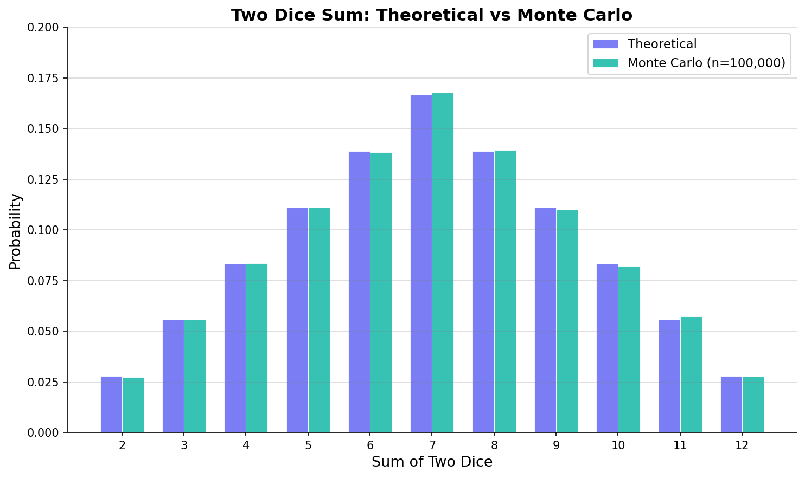
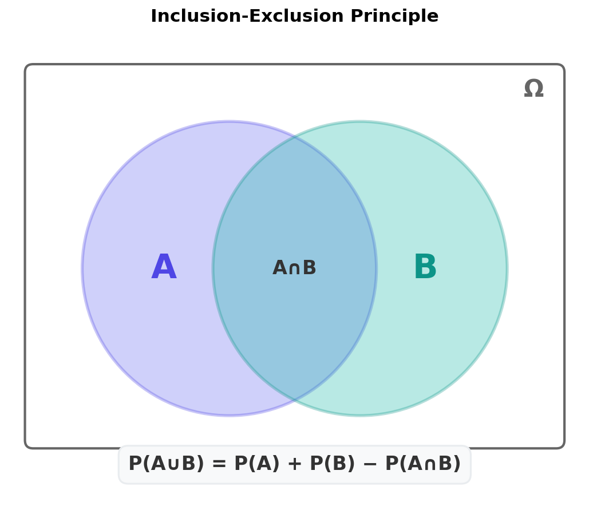
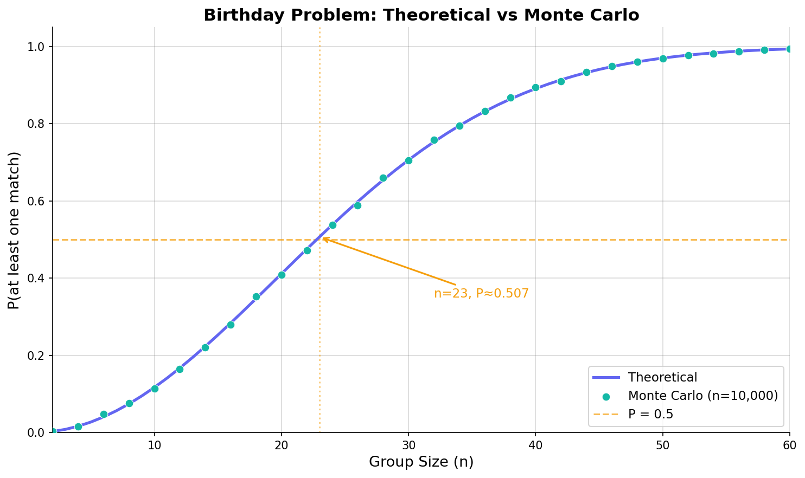

"확률 정도는 고등학교 때 다 배웠잖아?"

머신러닝을 공부하다 보면 이런 생각이 드는 순간이 온다. 동전 던지기, 주사위 확률 — 별거 아닌 것 같다. 그런데 손실 함수에 로그가 붙는 이유를 설명하라고 하면 막히고, 베이즈 분류기에서 사전확률과 사후확률이 뒤섞이면 헷갈리기 시작한다. 정규분포 가정이 왜 필요한지, MLE가 뭔지 물어보면 "대충은 아는데..." 수준에 머문다.

결국 확률론의 기초가 부실하면, [머신러닝](/ml/overview/)의 수학적 직관이 통째로 흔들린다. 이 시리즈는 그 기반을 처음부터 제대로 쌓기 위해 시작한다. 첫 번째 글에서는 표본공간, 사건, 확률 공리, 셈 원리(순열·조합)까지 — 확률론의 언어와 문법을 Python 시뮬레이션과 함께 잡아간다.

---

## 왜 확률을 "제대로" 배워야 하는가

머신러닝에서 확률은 장식이 아니다. 모델의 거의 모든 구성 요소에 확률이 녹아 있다.

| ML 개념 | 확률이 쓰이는 방식 |
|---|---|
| 로지스틱 회귀 | 시그모이드 출력 = P(y=1\|x), 크로스 엔트로피 손실 |
| 나이브 베이즈 | 베이즈 정리로 사후확률 직접 계산 |
| 정규분포 가정 | 선형 회귀의 오차항 ε ~ N(0, σ²) |
| MLE / MAP | 파라미터를 "가장 그럴듯한 확률"로 추정 |
| 소프트맥스 | 다중 클래스 확률 분포 출력 |
| 드롭아웃 | 각 뉴런을 확률 p로 무작위 비활성화 |

경험상, 확률 기초가 탄탄한 사람과 그렇지 않은 사람의 차이는 "수식을 읽을 수 있느냐"에서 가장 크게 드러난다. 논문이나 교재에서 P(Y|X), E[X], Var(X) 같은 표기가 나왔을 때, 기호 하나하나가 무엇을 뜻하는지 바로 파악할 수 있어야 한다. 그래야 수식을 "해석"하는 게 아니라 "읽는" 수준이 된다.

:::info

**💡 시리즈 안내**

이 시리즈는 **확률과 정보이론**을 다루며, ML 시리즈와 병행해서 읽으면 좋다. 특히 [나이브 베이즈](/ml/naive-bayes/)나 MLE 관련 글에서 여기의 개념이 직접 사용된다.

:::

---

## 실험, 표본공간, 사건

확률론의 출발점은 세 가지 개념이다.

**실험(Experiment)** — 결과가 불확실한 과정. 동전을 던지거나, 주사위를 굴리거나, 서버 응답 시간을 측정하는 것 모두 실험이다.

**표본공간(Sample Space, Ω)** — 실험에서 나올 수 있는 모든 결과의 집합. "가능한 세계의 전체 목록"이라고 생각하면 된다.

**사건(Event)** — 표본공간의 부분집합. 우리가 관심 있는 결과들의 모음이다.

```python
# 동전 1번 던지기
omega_coin = {'H', 'T'}
event_head = {'H'}  # "앞면이 나온다" 사건

# 주사위 1번 굴리기
omega_dice = {1, 2, 3, 4, 5, 6}
event_even = {2, 4, 6}  # "짝수가 나온다" 사건

# 동전 2번 던지기
omega_two_coins = {('H','H'), ('H','T'), ('T','H'), ('T','T')}
event_at_least_one_head = {('H','H'), ('H','T'), ('T','H')}

print(f"동전 2번: Ω 크기 = {len(omega_two_coins)}")
print(f"적어도 1번 앞면: 사건 크기 = {len(event_at_least_one_head)}")
# 동전 2번: Ω 크기 = 4
# 적어도 1번 앞면: 사건 크기 = 3
```

사건은 결국 **집합**이다. 그래서 집합 연산이 그대로 적용된다.

| 연산 | 집합 표기 | 의미 |
|---|---|---|
| 합사건 | A ∪ B | A 또는 B (또는 둘 다) |
| 곱사건 | A ∩ B | A 그리고 B 동시에 |
| 여사건 | Aᶜ | A가 아닌 모든 것 |
| 배반사건 | A ∩ B = ∅ | A와 B가 동시에 일어날 수 없음 |

여기서 하나 짚고 넘어갈 점이 있다. 표본공간이 유한하지 않을 수도 있다는 것이다. 예를 들어 "다트를 던져서 과녁 위의 점을 맞히는" 실험에서 표본공간은 원판 위의 모든 점, 즉 연속적인 무한 집합이다. 이런 경우에도 확률을 정의할 수 있게 해주는 것이 바로 다음에 나올 공리적 접근이다.

---

## 확률의 세 가지 관점

같은 "확률"이라는 단어를 쓰지만, 사실 해석이 세 가지로 나뉜다. 이걸 모르면 나중에 빈도론 vs 베이지안 논쟁에서 길을 잃는다.

### 고전적 확률 (Classical)

> P(A) = |A| / |Ω| (모든 결과가 동등하게 가능할 때)

"동전의 앞면이 나올 확률은 1/2" — 이게 고전적 확률이다. 각 결과가 **equally likely**하다는 가정이 전제된다. 주사위, 동전, 카드 문제에서 쓰기 편하지만, "내일 비가 올 확률"처럼 결과가 동등하지 않은 경우에는 적용이 안 된다.

### 빈도론적 확률 (Frequentist)

> P(A) = lim(n→∞) nₐ / n (실험을 무한히 반복했을 때의 상대 빈도)

실험을 반복할수록 상대 빈도가 특정 값에 수렴한다는 관점이다. 물론 실제로 무한 번 실험할 수는 없으니, 충분히 많이 반복해서 근사하는 것이다. Monte Carlo 시뮬레이션이 바로 이 철학 위에 서 있다.

### 주관적 확률 (Bayesian)

> P(A)는 A에 대한 믿음의 정도

"이 환자가 특정 질병에 걸렸을 확률은 70%"라고 의사가 말할 때, 그건 동전을 70번 던져본 게 아니다. 기존 지식과 증거를 종합한 **주관적 믿음**이다. 베이지안 통계의 핵심이 바로 이 관점이고, 새로운 데이터가 들어올 때마다 믿음을 업데이트한다.

:::tip

**✅ 실전 팁**

ML에서는 세 관점이 모두 쓰인다. MLE(최대 우도 추정)는 빈도론적, MAP/베이지안 최적화는 주관적 확률 관점이다. 어느 하나가 "맞다"는 게 아니라 문제에 따라 적절한 관점을 선택하는 것이다.

:::

### Python Monte Carlo로 빈도론 확인하기

주사위 두 개를 던져서 합이 7이 되는 확률을 이론과 시뮬레이션으로 비교해보자. 이론적으로 합이 7이 되는 경우는 (1,6), (2,5), (3,4), (4,3), (5,2), (6,1)로 6가지, 전체 경우는 36가지이므로 P = 6/36 = 1/6 ≈ 0.1667이다.

```python
import random

def simulate_dice_sum(target_sum, num_trials=1_000_000):
    """주사위 2개의 합이 target_sum이 되는 빈도를 시뮬레이션"""
    count = 0
    for _ in range(num_trials):
        d1 = random.randint(1, 6)
        d2 = random.randint(1, 6)
        if d1 + d2 == target_sum:
            count += 1
    return count / num_trials

# 합 = 7인 경우
simulated_prob = simulate_dice_sum(7)
theoretical_prob = 6 / 36

print(f"이론적 확률: {theoretical_prob:.4f}")
print(f"시뮬레이션:  {simulated_prob:.4f}")
print(f"오차:        {abs(theoretical_prob - simulated_prob):.4f}")
# 이론적 확률: 0.1667
# 시뮬레이션:  0.1664
# 오차:        0.0003
```

100만 번 시뮬레이션하면 이론값과 소수점 셋째 자리까지 일치한다. 시행 횟수를 늘릴수록 오차는 줄어든다 — 이것이 **큰 수의 법칙(Law of Large Numbers)** 의 직관적 모습이다.

아래 그래프는 주사위 두 개의 합(2~12)에 대해 이론적 확률과 Monte Carlo 시뮬레이션 결과를 비교한 것이다.


<p align="center" style="color: #888; font-size: 13px;"><em>주사위 두 개 합의 확률: 보라색(이론값)과 청록색(시뮬레이션)이 거의 정확히 일치한다</em></p>

합이 7인 경우가 가장 높은 확률을 가지고, 양 끝(2, 12)으로 갈수록 확률이 줄어드는 삼각형 분포가 보인다. 이건 당연한 건데, 합이 7을 만드는 조합이 6가지로 가장 많기 때문이다.

---

## 콜모고로프 공리

1933년, 러시아 수학자 안드레이 콜모고로프(Andrey Kolmogorov)는 확률을 세 가지 공리만으로 정의했다. "확률이란 무엇인가?"라는 철학적 논쟁을 공리적 체계로 깔끔하게 정리한 것이다.

확률은 사건을 실수에 대응시키는 함수 P: Events → [0, 1]이고, 다음 세 가지를 만족해야 한다.

### 공리 1: 비음성 (Non-negativity)

> 모든 사건 A에 대해 **P(A) ≥ 0**

확률은 음수가 될 수 없다. 직관적으로 당연하다. "무언가가 일어날 가능성이 마이너스"라는 건 말이 안 된다.

### 공리 2: 정규성 (Normalization)

> **P(Ω) = 1**

표본공간 전체의 확률은 1이다. "가능한 모든 결과 중 하나는 반드시 일어난다"는 뜻이다.

### 공리 3: 가산 가법성 (Countable Additivity)

> 서로 배반인 사건 A₁, A₂, A₃, ... 에 대해 **P(A₁ ∪ A₂ ∪ A₃ ∪ ...) = P(A₁) + P(A₂) + P(A₃) + ...**

겹치지 않는 사건들의 합집합 확률은 각 확률의 합이다. 물과 기름처럼 섞이지 않는 사건이면 확률을 그냥 더하면 된다는 것이다.

```python
# 공리 검증: 주사위 예시
omega = {1, 2, 3, 4, 5, 6}

# 각 결과의 확률 (공정한 주사위)
P = {i: 1/6 for i in omega}

# 공리 1: 모든 확률이 0 이상
assert all(p >= 0 for p in P.values()), "공리 1 위반!"

# 공리 2: P(Ω) = 1
assert abs(sum(P.values()) - 1.0) < 1e-10, "공리 2 위반!"

# 공리 3: 배반 사건의 합
A = {1, 3, 5}  # 홀수
B = {2, 4, 6}  # 짝수 (A와 배반)
P_A = sum(P[i] for i in A)   # 3/6 = 0.5
P_B = sum(P[i] for i in B)   # 3/6 = 0.5
P_AuB = sum(P[i] for i in A | B)  # 6/6 = 1.0

assert abs(P_AuB - (P_A + P_B)) < 1e-10, "공리 3 위반!"
print(f"P(홀수) = {P_A:.4f}")
print(f"P(짝수) = {P_B:.4f}")
print(f"P(홀수 ∪ 짝수) = {P_AuB:.4f}")
# P(홀수) = 0.5000
# P(짝수) = 0.5000
# P(홀수 ∪ 짝수) = 1.0000
```

고작 세 줄짜리 공리인데, 여기서 확률의 모든 성질이 파생된다. 몇 가지 중요한 것들을 뽑아보자.

### 파생 성질들

**여사건(Complement):**

> P(Aᶜ) = 1 - P(A)

공리 2에서 P(Ω) = 1이고, A와 Aᶜ는 배반이므로 공리 3에 의해 P(A) + P(Aᶜ) = 1이 된다. 실전에서 "적어도 하나" 문제를 풀 때 여사건이 엄청나게 유용하다. 직접 세기 어려우면 "하나도 아닌 경우"를 세서 1에서 빼면 되니까.

**합집합 — 포함-배제 원리(Inclusion-Exclusion):**

> P(A ∪ B) = P(A) + P(B) - P(A ∩ B)

A와 B가 배반이 아닐 때, 단순히 더하면 겹치는 부분이 두 번 계산된다. 그래서 교집합을 한 번 빼준다.


<p align="center" style="color: #888; font-size: 13px;"><em>벤 다이어그램으로 보는 포함-배제 원리: 겹치는 A∩B를 한 번 빼줘야 정확한 합집합 확률이 나온다</em></p>

```python
# 포함-배제 예시: 52장 카드에서 1장 뽑기
# A = 하트 카드, B = 페이스 카드 (J, Q, K)

P_A = 13 / 52          # 하트: 13장
P_B = 12 / 52          # 페이스 카드: 12장 (4 수트 × 3)
P_A_and_B = 3 / 52     # 하트이면서 페이스 카드: 3장

P_A_or_B = P_A + P_B - P_A_and_B

print(f"P(하트) = {P_A:.4f}")
print(f"P(페이스) = {P_B:.4f}")
print(f"P(하트 ∩ 페이스) = {P_A_and_B:.4f}")
print(f"P(하트 ∪ 페이스) = {P_A_or_B:.4f}")
# P(하트) = 0.2500
# P(페이스) = 0.2308
# P(하트 ∩ 페이스) = 0.0577
# P(하트 ∪ 페이스) = 0.4231
```

포함-배제를 쓰지 않고 단순히 P(A) + P(B) = 0.4808로 계산하면, 하트 J/Q/K 3장이 이중 계산되어 틀린 답이 나온다. 실수하기 쉬운 부분이니 항상 겹침을 확인하는 습관이 중요하다.

:::warning

**⚠️ 흔한 실수**

"P(A 또는 B)"를 구할 때 무조건 P(A) + P(B)를 하는 건 A와 B가 배반(mutually exclusive)일 때만 성립한다. 두 사건이 겹칠 수 있다면 반드시 포함-배제를 써야 한다.

:::

**단조성(Monotonicity):**

> A ⊆ B이면 P(A) ≤ P(B)

작은 사건은 큰 사건보다 확률이 낮다. "6이 나오는 사건"은 "짝수가 나오는 사건"의 부분집합이므로 확률도 작거나 같다.

---

## 셈 원리 (Counting)

표본공간의 크기를 셀 수 있으면 고전적 확률을 바로 계산할 수 있다. 문제는 "세는 게 쉽지 않다"는 것이다. 52장 카드에서 5장을 뽑는 경우의 수는? 직접 나열하면 날이 샌다. 체계적으로 세는 방법이 필요하다.

### 곱의 법칙 (Multiplication Principle)

> 첫 번째 단계에서 n₁가지, 두 번째 단계에서 n₂가지 선택이 가능하면, 전체 경우의 수는 n₁ × n₂

```python
# 비밀번호: 영문 대문자 2자리 + 숫자 4자리
letters = 26  # A-Z
digits = 10   # 0-9

total = (letters ** 2) * (digits ** 4)
print(f"가능한 비밀번호 수: {total:,}")
# 가능한 비밀번호 수: 6,760,000
```

676만 가지나 되지만, 초당 100만 개를 시도하는 공격자에게는 7초도 안 걸린다. 비밀번호 보안이 왜 중요한지 셈 원리로 바로 느낄 수 있는 대목이다.

### 순열 (Permutation)

> n개에서 k개를 **순서를 고려하여** 뽑는 경우의 수: P(n, k) = n! / (n-k)!

순서가 중요하다. "ABC"와 "CBA"는 다른 배열이다.

```python
from math import perm, factorial

# 10명 중 회장, 부회장, 총무 3명을 뽑는 경우의 수
n, k = 10, 3
result = perm(n, k)
print(f"P({n}, {k}) = {result}")
# P(10, 3) = 720

# 같은 계산을 직접 하면
manual = factorial(10) // factorial(10 - 3)
assert result == manual
```

회장·부회장·총무는 역할이 다르니까 순서가 중요하다. A가 회장이고 B가 부회장인 것과, B가 회장이고 A가 부회장인 건 다른 경우다.

### 조합 (Combination)

> n개에서 k개를 **순서 없이** 뽑는 경우의 수: C(n, k) = n! / (k! × (n-k)!)

순서를 무시하면 같은 원소 집합이 k!번 중복 계산되므로, 순열에서 k!을 나눈 것이다.

```python
from math import comb

# 52장 카드에서 5장을 뽑는 포커 핸드 수
poker_hands = comb(52, 5)
print(f"C(52, 5) = {poker_hands:,}")
# C(52, 5) = 2,598,960

# 로또: 45개 번호 중 6개
lotto = comb(45, 6)
print(f"로또 경우의 수: {lotto:,}")
print(f"로또 1등 확률: 1/{lotto:,} ≈ {1/lotto:.8f}")
# 로또 경우의 수: 8,145,060
# 로또 1등 확률: 1/8,145,060 ≈ 0.00000012
```

로또 1등에 당첨될 확률이 약 814만 분의 1이라는 걸 조합 하나로 바로 계산할 수 있다. 개인적으로 이 숫자를 볼 때마다 "그냥 인덱스 펀드를 사자"라는 생각이 든다.

### 조합의 유용한 성질

```python
# 대칭성: C(n, k) = C(n, n-k)
assert comb(10, 3) == comb(10, 7)

# 파스칼 항등식: C(n, k) = C(n-1, k-1) + C(n-1, k)
assert comb(10, 3) == comb(9, 2) + comb(9, 3)

# 이항정리 합: C(n,0) + C(n,1) + ... + C(n,n) = 2^n
n = 10
total = sum(comb(n, k) for k in range(n + 1))
assert total == 2 ** n
print(f"C(10,0) + C(10,1) + ... + C(10,10) = {total}")
# C(10,0) + C(10,1) + ... + C(10,10) = 1024
```

마지막 성질이 재미있다. n개 원소의 부분집합 총 개수가 2ⁿ이라는 뜻인데, 각 원소를 "포함하거나/안 하거나" 2가지 선택이 있으므로 곱의 법칙으로도 자연스럽게 나온다.

### 다항 계수 (Multinomial Coefficient)

조합의 일반화 버전이다. n개를 k₁, k₂, ..., kₘ개씩 여러 그룹으로 나누는 경우의 수다.

> n! / (k₁! × k₂! × ... × kₘ!)  (단, k₁ + k₂ + ... + kₘ = n)

```python
from math import factorial

def multinomial(n, groups):
    """다항 계수 계산"""
    assert sum(groups) == n, "그룹 크기의 합이 n이어야 합니다"
    denom = 1
    for k in groups:
        denom *= factorial(k)
    return factorial(n) // denom

# 12명을 4명씩 3팀으로 나누는 경우의 수 (팀에 구분이 있는 경우)
result = multinomial(12, [4, 4, 4])
print(f"12명 → 4명×3팀: {result:,}")
# 12명 → 4명×3팀: 34,650

# "MISSISSIPPI"의 문자 배열 수
# M:1, I:4, S:4, P:2 → 총 11글자
result = multinomial(11, [1, 4, 4, 2])
print(f"MISSISSIPPI 배열 수: {result:,}")
# MISSISSIPPI 배열 수: 34,650
```

"MISSISSIPPI"처럼 중복된 문자가 있는 문자열의 배열 수를 구하는 전형적인 문제에서 다항 계수가 쓰인다. 11!은 약 4천만인데, 같은 문자끼리 자리를 바꿔도 구분이 안 되니까 중복을 나눠주는 것이다.

:::summary

**📌 셈 원리 요약**

- **곱의 법칙**: 독립적인 단계의 선택을 곱한다
- **순열 P(n,k)**: 순서 O → n!/(n-k)!
- **조합 C(n,k)**: 순서 X → n!/(k!(n-k)!)
- **다항 계수**: 여러 그룹으로 분할 → n!/(k₁!k₂!...kₘ!)
- 핵심 질문: **"순서가 중요한가?"** → Yes면 순열, No면 조합

:::

---

## Birthday Problem: 조합론의 반직관

Birthday Problem(생일 문제)은 확률론에서 가장 유명한 반직관적 결과 중 하나다. 문제는 간단하다.

> **n명이 모인 방에서, 적어도 두 명의 생일이 같을 확률은?**

직감적으로 "365일이나 되는데, 50명은 있어야 하지 않을까?"라고 생각하기 쉽다. 그런데 실제로는 **23명**만 모여도 확률이 50%를 넘는다.

### 이론적 풀이

여사건을 활용한다. "적어도 두 명의 생일이 같을 확률"을 직접 구하는 건 복잡하니, "모든 사람의 생일이 다를 확률"을 구해서 1에서 빼자.

n명이 모두 다른 생일을 가질 확률:

```
P(모두 다름) = 365/365 × 364/365 × 363/365 × ... × (365-n+1)/365
            = 365! / ((365-n)! × 365ⁿ)
```

따라서 적어도 한 쌍이 같을 확률은:

```
P(적어도 한 쌍 같음) = 1 - P(모두 다름)
```

```python
from math import factorial, prod

def birthday_theoretical(n):
    """n명일 때 적어도 한 쌍의 생일이 같을 확률 (이론값)"""
    if n > 365:
        return 1.0
    p_all_different = prod((365 - i) / 365 for i in range(n))
    return 1 - p_all_different

# 주요 지점 확인
for n in [10, 20, 23, 30, 50, 70]:
    p = birthday_theoretical(n)
    print(f"n={n:2d}: P = {p:.4f} {'← 50% 초과!' if n == 23 else ''}")
# n=10: P = 0.1169
# n=20: P = 0.4114
# n=23: P = 0.5073 ← 50% 초과!
# n=30: P = 0.7063
# n=50: P = 0.9704
# n=70: P = 0.9992
```

23명에서 이미 50.7%다. 50명이면 97%, 70명이면 99.9%. 왜 이렇게 빠르게 올라갈까?

비결은 **쌍(pair)의 개수**에 있다. n명에서 만들 수 있는 쌍은 C(n, 2) = n(n-1)/2개다. 23명이면 C(23, 2) = 253쌍이나 된다. 각 쌍이 같은 생일을 가질 확률은 1/365로 낮지만, 253번의 기회가 있으면 적어도 하나가 맞을 확률이 급격히 올라가는 것이다.

### Monte Carlo 검증

```python
import random

def birthday_montecarlo(n, num_trials=100_000):
    """Monte Carlo 시뮬레이션으로 생일 문제 확률 추정"""
    matches = 0
    for _ in range(num_trials):
        birthdays = [random.randint(1, 365) for _ in range(n)]
        if len(birthdays) != len(set(birthdays)):
            matches += 1
    return matches / num_trials

# 이론값과 시뮬레이션 비교
print(f"{'n':>4} {'이론값':>10} {'시뮬레이션':>10} {'오차':>10}")
print("-" * 38)
for n in [10, 23, 30, 50]:
    theo = birthday_theoretical(n)
    mc = birthday_montecarlo(n)
    print(f"{n:4d} {theo:10.4f} {mc:10.4f} {abs(theo-mc):10.4f}")
# 결과 예시:
#    n      이론값    시뮬레이션        오차
# --------------------------------------
#   10     0.1169     0.1171     0.0002
#   23     0.5073     0.5081     0.0008
#   30     0.7063     0.7058     0.0005
#   50     0.9704     0.9700     0.0004
```

아래 그래프가 이 결과를 시각적으로 보여준다.


<p align="center" style="color: #888; font-size: 13px;"><em>생일 문제: 인디고 곡선(이론값)과 청록색 점(시뮬레이션)이 거의 완벽하게 일치한다. n=23에서 50%를 넘는다.</em></p>

이론 곡선과 시뮬레이션 결과가 거의 정확히 겹친다. Monte Carlo가 얼마나 강력한 검증 도구인지 다시 한번 확인할 수 있다.

:::info

**💡 실전에서의 Birthday Problem**

이 문제는 단순한 수학 퀴즈가 아니다. 해시 충돌(Hash Collision) 분석에 직접 적용된다. 해시 함수의 출력 크기가 n비트라면, 약 2^(n/2)개의 입력만으로 충돌이 발생할 확률이 50%를 넘는다. 이것이 "Birthday Attack"이고, 암호학에서 해시 크기를 결정할 때 핵심 근거가 된다.

:::

---

## 확률의 직관을 망치는 함정들

셈 원리와 확률 공리를 배웠으면, 자주 빠지는 함정도 알아두어야 한다.

### 함정 1: 등확률 가정의 오용

"일어나거나 안 일어나거나, 둘 중 하나니까 확률은 50%"라는 논리는 위험하다. 내일 소행성이 지구에 충돌할 확률은 50%가 아니다. 등확률 가정은 대칭성이 보장될 때만 성립한다.

### 함정 2: 곱하기 vs 더하기 혼동

```python
# 동전 3번 던져서 모두 앞면일 확률
# 맞는 풀이: 독립이므로 곱하기
p_all_heads = (1/2) ** 3  # = 0.125

# 틀린 풀이: "3번 중 1번은 앞면이니까 1/2 + 1/2 + 1/2 = 3/2?"
# 확률이 1을 넘으면 뭔가 잘못된 것!
```

### 함정 3: "적어도 하나" 문제에서 직접 세기

```python
# 주사위 4번 던져서 적어도 하나가 6일 확률
# 방법 1 (복잡): 정확히 1개 + 정확히 2개 + 정확히 3개 + 정확히 4개
# 방법 2 (여사건): 1 - P(6이 하나도 안 나옴)

p_no_six = (5/6) ** 4
p_at_least_one_six = 1 - p_no_six
print(f"적어도 하나가 6일 확률: {p_at_least_one_six:.4f}")
# 적어도 하나가 6일 확률: 0.5177
```

여사건으로 풀면 한 줄이다. 사실 이 문제는 역사적으로도 유명한데, 17세기 도박사 슈발리에 드 메레(Chevalier de Méré)가 파스칼에게 물어본 바로 그 문제의 변형이다.

:::warning

**⚠️ 주의**

"적어도 하나"가 나오면 **여사건**부터 떠올리자. 직접 경우를 나누면 거의 항상 더 복잡해지고 실수할 확률(!)도 높아진다.

:::

---

## 마치며

이 글에서 다룬 내용을 정리하면 다음과 같다.

:::summary

**📌 핵심 요약**

- **표본공간(Ω)**은 가능한 모든 결과의 집합, **사건**은 그 부분집합
- 확률의 세 관점: 고전적(등확률), 빈도론적(상대 빈도), 주관적(믿음의 정도)
- **콜모고로프 공리** 3가지: 비음성, 정규성, 가산 가법성 → 여기서 여사건, 포함-배제 등 모든 성질이 파생
- **셈 원리**: 순서가 중요하면 순열, 아니면 조합. "순서가 중요한가?"가 핵심 질문
- **Birthday Problem**: 직관이 틀릴 수 있다 → 시뮬레이션으로 검증하는 습관이 중요

:::

여기까지가 확률론의 "알파벳"이다. 표본공간과 사건으로 상황을 정의하고, 공리로 확률을 계산하고, 셈 원리로 경우의 수를 세는 것. 이 기본기가 있어야 다음 단계로 넘어갈 수 있다.

[다음 글](/stats/conditional-probability-bayes/)에서는 **조건부 확률(Conditional Probability)** 과 **베이즈 정리(Bayes' Theorem)** 를 다룬다. "A가 일어났을 때 B의 확률은?" — 이 질문이 머신러닝의 핵심 추론 방식이 되는 과정을 따라가 볼 것이다.

---

## 참고자료

- **Blitzstein, J. K., & Hwang, J.** (2019). *Introduction to Probability* (2nd ed.). CRC Press. — Harvard Stat 110 교재. 직관적 설명과 엄밀한 수학의 균형이 좋다.
- **Bertsekas, D. P., & Tsitsiklis, J. N.** (2008). *Introduction to Probability* (2nd ed.). Athena Scientific. — MIT 6.041 교재. 공학적 관점에서 확률을 다룬다.
- **Harvard Stat 110: Probability.** [https://projects.iq.harvard.edu/stat110](https://projects.iq.harvard.edu/stat110) — Joe Blitzstein 교수의 무료 강의. YouTube에서 전체 강의를 볼 수 있다.
- **Wikipedia: Birthday Problem.** [https://en.wikipedia.org/wiki/Birthday_problem](https://en.wikipedia.org/wiki/Birthday_problem) — Birthday Attack과 해시 충돌 분석까지 확장된 설명.
- **Wikipedia: Probability Axioms.** [https://en.wikipedia.org/wiki/Probability_axioms](https://en.wikipedia.org/wiki/Probability_axioms) — 콜모고로프 공리의 형식적 정의와 역사적 배경.
