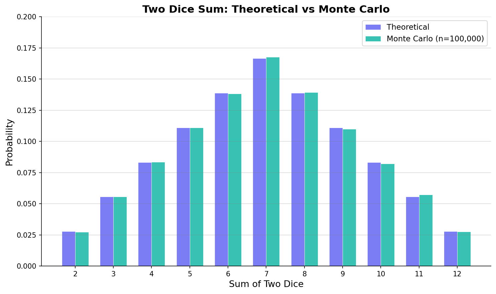
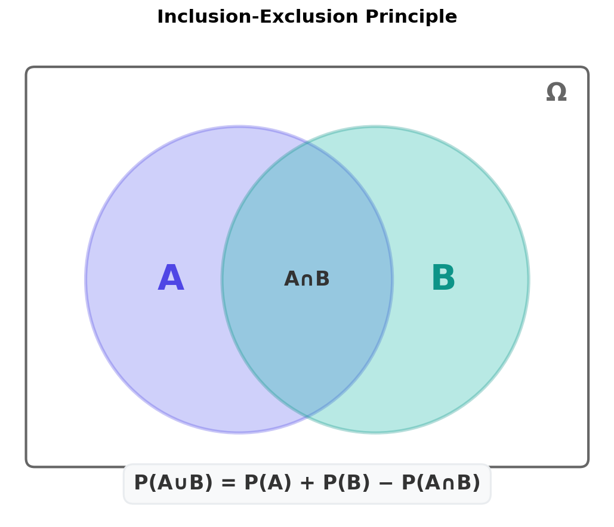
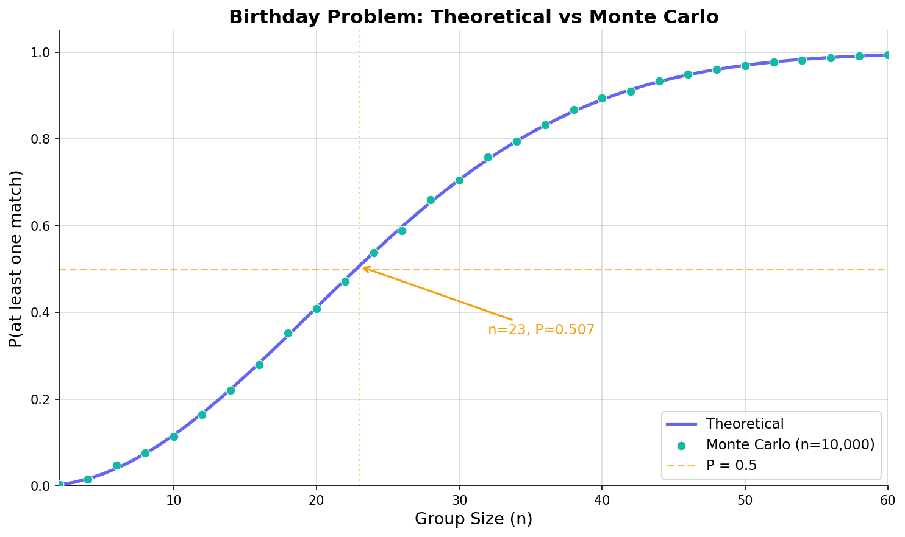

머신러닝을 공부하다 보면 손실 함수에 왜 로그가 붙는지, 베이즈 분류기에서 사전확률과 사후확률이 어떻게 갈리는지, MLE가 무엇인지에서 막힌다. 확률론의 기초가 부실하면 수학적 직관이 통째로 흔들린다.

확률은 모델의 장식이 아니라 거의 모든 구성 요소에 녹아 있다.

| ML 개념 | 확률이 쓰이는 방식 |
|---|---|
| 로지스틱 회귀 | 시그모이드 출력 = P(y=1\|x), 크로스 엔트로피 손실 |
| 나이브 베이즈 | 베이즈 정리로 사후확률 직접 계산 |
| 정규분포 가정 | 선형 회귀의 오차항 ε ~ N(0, σ²) |
| MLE / MAP | 파라미터를 "가장 그럴듯한 확률"로 추정 |
| 소프트맥스 | 다중 클래스 확률 분포 출력 |
| 드롭아웃 | 각 뉴런을 확률 p로 무작위 비활성화 |

이 글에서는 표본공간, 사건, 확률 공리, 셈 원리(순열·조합)까지 확률론의 언어와 문법을 잡는다.

## 실험, 표본공간, 사건

확률론의 출발점은 세 가지 개념이다.

**실험(Experiment)**: 결과가 불확실한 과정. 동전을 던지거나, 주사위를 굴리거나, 서버 응답 시간을 측정하는 것 모두 실험이다.

**표본공간(Sample Space, Ω)**: 실험에서 나올 수 있는 모든 결과의 집합. 동전을 2번 던지면 Ω = {HH, HT, TH, TT}로 크기가 4다.

**사건(Event)**: 표본공간의 부분집합. 위 실험에서 "적어도 한 번 앞면"은 {HH, HT, TH}로 크기가 3인 사건이다.

사건은 결국 집합이다. 그래서 집합 연산이 그대로 적용된다.

| 연산 | 집합 표기 | 의미 |
|---|---|---|
| 합사건 | A ∪ B | A 또는 B (또는 둘 다) |
| 곱사건 | A ∩ B | A 그리고 B 동시에 |
| 여사건 | Aᶜ | A가 아닌 모든 것 |
| 배반사건 | A ∩ B = ∅ | A와 B가 동시에 일어날 수 없음 |

표본공간이 유한하지 않을 수도 있다. 다트를 던져 과녁 위의 점을 맞히는 실험이라면 표본공간은 원판 위의 모든 점, 즉 연속적인 무한 집합이다. 이런 경우까지 확률을 정의하게 해주는 것이 다음에 나올 공리적 접근이다.

## 확률의 세 가지 관점

같은 "확률"이라는 단어를 쓰지만 해석은 세 가지로 나뉜다. 이걸 구분하지 못하면 빈도론과 베이지안 논쟁에서 길을 잃는다.

| 관점 | 정의 | 쓰임과 한계 |
|---|---|---|
| 고전적(Classical) | P(A) = \|A\| / \|Ω\| | 모든 결과가 동등하게 가능할 때만 성립한다. 주사위·동전·카드에는 편하지만 "내일 비가 올 확률"에는 쓸 수 없다 |
| 빈도론적(Frequentist) | P(A) = lim(n→∞) nₐ / n | 반복 가능한 실험의 상대 빈도. Monte Carlo 시뮬레이션이 이 철학 위에 서 있다 |
| 주관적(Bayesian) | A에 대한 믿음의 정도 | 반복할 수 없는 사건에도 확률을 준다. 새 데이터가 들어올 때마다 믿음을 갱신한다 |

ML에서는 세 관점이 모두 쓰인다. MLE는 빈도론적 접근이고, MAP과 베이지안 최적화는 주관적 확률 관점이다.

### 시뮬레이션으로 보는 빈도론

주사위 두 개를 던져 합이 7이 될 경우는 (1,6), (2,5), (3,4), (4,3), (5,2), (6,1)의 6가지이고 전체는 36가지이므로 확률은 6/36 = 1/6 ≈ 0.1667이다. 100만 회 Monte Carlo 시뮬레이션을 돌리면 소수점 셋째 자리까지 이 값에 일치한다. 시행 횟수를 늘릴수록 오차가 줄어드는 것이 큰 수의 법칙(Law of Large Numbers)의 직관적 모습이다.



*주사위 두 개 합의 확률: 보라색(이론값)과 청록색(시뮬레이션)이 거의 정확히 일치한다*

합이 7인 경우가 가장 높고 양 끝(2, 12)으로 갈수록 낮아지는 삼각형 분포가 나온다. 합 7을 만드는 조합이 6가지로 가장 많기 때문이다.

## 콜모고로프 공리

1933년 콜모고로프(Andrey Kolmogorov)는 "확률이란 무엇인가"라는 철학적 논쟁을 세 가지 공리로 정리했다. 확률은 사건을 실수에 대응시키는 함수 P: Events → ℝ이고, 다음을 만족한다.

**공리 1 (비음성)**: 모든 사건 A에 대해 P(A) ≥ 0

**공리 2 (정규성)**: P(Ω) = 1. 가능한 모든 결과 중 하나는 반드시 일어난다는 뜻이다.

**공리 3 (가산 가법성)**: 서로 배반인 사건 A₁, A₂, A₃, ...에 대해 P(A₁ ∪ A₂ ∪ A₃ ∪ ...) = P(A₁) + P(A₂) + P(A₃) + ...

확률이 1을 넘지 않는다는 것은 공리가 아니라 여기서 따라 나오는 성질이다. 세 줄짜리 공리에서 확률의 모든 성질이 파생된다.

### 파생 성질들

**여사건**: P(Aᶜ) = 1 - P(A)

공리 2에서 P(Ω) = 1이고 A와 Aᶜ는 배반이므로, 공리 3에 의해 P(A) + P(Aᶜ) = 1이 된다. "적어도 하나" 문제에서 직접 세기 어려우면 "하나도 아닌 경우"를 세서 1에서 빼면 된다.

**포함-배제 원리**: P(A ∪ B) = P(A) + P(B) - P(A ∩ B)

A와 B가 배반이 아니면 단순히 더할 때 겹치는 부분이 두 번 계산된다. 그래서 교집합을 한 번 뺀다.



*벤 다이어그램으로 보는 포함-배제 원리: 겹치는 A∩B를 한 번 빼줘야 정확한 합집합 확률이 나온다*

52장 카드에서 1장을 뽑을 때 하트는 13장, 페이스 카드(J, Q, K)는 12장, 하트이면서 페이스인 카드는 3장이다. 따라서 P(하트 ∪ 페이스) = (13 + 12 - 3) / 52 ≈ 0.4231이다. 그냥 더하면 0.4808이 되어 하트 J·Q·K 3장이 이중 계산된다.

:::warning

**흔한 실수**

"P(A 또는 B)"를 무조건 P(A) + P(B)로 계산하는 건 A와 B가 배반일 때만 맞다. 두 사건이 겹칠 수 있다면 반드시 포함-배제를 써야 한다.

:::

**단조성**: A ⊆ B이면 P(A) ≤ P(B)

"6이 나오는 사건"은 "짝수가 나오는 사건"의 부분집합이므로 확률도 작거나 같다.

## 셈 원리

표본공간의 크기를 셀 수 있으면 고전적 확률을 바로 계산할 수 있다. 문제는 세는 게 쉽지 않다는 것이다. 52장에서 5장을 뽑는 경우의 수를 직접 나열하면 날이 샌다.

### 곱의 법칙

첫 번째 단계에서 n₁가지, 두 번째 단계에서 n₂가지 선택이 가능하면 전체 경우의 수는 n₁ × n₂다.

```python
# 비밀번호: 영문 대문자 2자리 + 숫자 4자리
total = (26 ** 2) * (10 ** 4)
print(f"가능한 비밀번호 수: {total:,}")
# 가능한 비밀번호 수: 6,760,000
```

### 순열과 조합

**순열**은 n개에서 k개를 순서를 고려하여 뽑는 경우의 수로, P(n, k) = n! / (n-k)!다. "ABC"와 "CBA"를 다른 배열로 센다. 회장·부회장·총무처럼 뽑힌 자리마다 역할이 다를 때 쓴다.

**조합**은 순서를 무시하고 뽑는 경우의 수로, C(n, k) = n! / (k! × (n-k)!)다. 순서를 무시하면 같은 원소 집합이 k!번 중복 계산되므로 순열에서 k!을 나눈 것이다.

```python
from math import perm, comb

# 10명 중 회장, 부회장, 총무 (순서 O)
print(f"P(10, 3) = {perm(10, 3):,}")
# P(10, 3) = 720

# 52장에서 5장 뽑는 포커 핸드 (순서 X)
print(f"C(52, 5) = {comb(52, 5):,}")
# C(52, 5) = 2,598,960

# 로또: 45개 번호 중 6개
lotto = comb(45, 6)
print(f"로또 1등 확률: 1/{lotto:,} = {1/lotto:.8f}")
# 로또 1등 확률: 1/8,145,060 = 0.00000012
```

### 다항 계수

n개를 k₁, k₂, ..., kₘ개씩 여러 그룹으로 나누는 경우의 수는 n! / (k₁! × k₂! × ... × kₘ!)이다 (단, k₁ + k₂ + ... + kₘ = n). 중복 문자가 있는 문자열의 배열 수를 셀 때 쓴다.

"MISSISSIPPI"는 M 1개, I 4개, S 4개, P 2개로 총 11글자이므로 11! / (1!4!4!2!) = 34,650가지다. 11!은 약 4천만이지만 같은 문자끼리 자리를 바꿔도 구분이 안 되므로 중복을 나눠준다.

:::summary

**셈 원리 요약**

핵심 질문은 하나다. "순서가 중요한가?" Yes면 순열 P(n,k) = n!/(n-k)!, No면 조합 C(n,k) = n!/(k!(n-k)!), 여러 그룹으로 나누면 다항 계수다.

:::

## Birthday Problem: 조합론의 반직관

Birthday Problem은 확률론에서 가장 유명한 반직관적 결과 중 하나다. 문제는 간단하다.

> n명이 모인 방에서, 적어도 두 명의 생일이 같을 확률은?

"365일이나 되는데 50명은 있어야 하지 않을까"라고 생각하기 쉽지만, 실제로는 23명만 모여도 확률이 50%를 넘는다.

여사건을 활용한다. "적어도 두 명의 생일이 같을 확률"을 직접 구하는 건 복잡하니, "모든 사람의 생일이 다를 확률"을 구해서 1에서 뺀다.

$$
P(\text{모두 다름}) = \frac{365}{365} \times \frac{364}{365} \times \cdots \times \frac{365-n+1}{365} = \frac{365!}{(365-n)! \times 365^n}
$$

```python
from math import prod

def birthday_theoretical(n):
    """n명일 때 적어도 한 쌍의 생일이 같을 확률 (이론값)"""
    if n > 365:
        return 1.0
    return 1 - prod((365 - i) / 365 for i in range(n))

for n in [10, 20, 23, 30, 50, 70]:
    print(f"n={n:2d}: P = {birthday_theoretical(n):.4f}")
# n=10: P = 0.1169
# n=20: P = 0.4114
# n=23: P = 0.5073
# n=30: P = 0.7063
# n=50: P = 0.9704
# n=70: P = 0.9992
```

23명에서 이미 50.7%, 50명이면 97%, 70명이면 99.9%다. 왜 이렇게 빠르게 올라갈까? 직관적으로는 쌍(pair)의 개수로 설명할 수 있다. n명에서 만들 수 있는 쌍은 C(n, 2) = n(n-1)/2개이고, 23명이면 253쌍이나 된다. 각 쌍이 같은 생일일 확률은 1/365로 낮지만 253번의 기회가 있는 셈이다. 다만 쌍들이 서로 독립이 아니므로 이것은 정확한 계산이 아니라 어림셈이다.



*생일 문제: 인디고 곡선(이론값)과 청록색 점(시뮬레이션)이 거의 완벽하게 일치한다. n=23에서 50%를 넘는다.*

10만 회 Monte Carlo 시뮬레이션으로 검증하면 n = 23에서 이론값 0.5073에 대해 시뮬레이션 0.5081처럼 모든 n에서 오차가 0.001 이내다.

:::info

**실전에서의 Birthday Problem**

이 문제는 해시 충돌(Hash Collision) 분석에 직접 적용된다. 해시 함수의 출력 크기가 n비트라면 약 2^(n/2)개의 입력만으로 충돌 확률이 50%를 넘는다. 이것이 Birthday Attack이고, 암호학에서 해시 크기를 결정할 때 핵심 근거가 된다.

:::

## 확률의 직관을 망치는 함정들

**등확률 가정의 오용**: "일어나거나 안 일어나거나 둘 중 하나니까 50%"라는 논리는 위험하다. 내일 소행성이 지구에 충돌할 확률은 50%가 아니다. 등확률 가정은 대칭성이 보장될 때만 성립한다.

**곱하기와 더하기 혼동**: 동전 3번을 던져 모두 앞면일 확률은 독립이므로 (1/2)³ = 0.125다. "3번 중 1번은 앞면이니까 1/2 + 1/2 + 1/2"로 더하면 1.5가 되어 확률이 1을 넘는다.

**"적어도 하나" 문제에서 직접 세기**: 정확히 1개, 2개, 3개, 4개인 경우를 다 나누면 복잡해진다. 여사건을 쓰면 한 줄이다.

```python
# 주사위 4번 던져서 적어도 하나가 6일 확률
p_no_six = (5/6) ** 4
print(f"적어도 하나가 6일 확률: {1 - p_no_six:.4f}")
# 적어도 하나가 6일 확률: 0.5177
```

이 문제는 17세기 도박사 슈발리에 드 메레(Chevalier de Méré)가 파스칼에게 물어본 바로 그 문제다. 드 메레가 던진 일련의 도박 문제들이 1654년 파스칼과 페르마의 서한을 촉발했고, 그 서한이 확률론의 출발점으로 꼽힌다.

## 마치며

:::summary

**핵심 요약**

- 표본공간(Ω)은 가능한 모든 결과의 집합, 사건은 그 부분집합이다
- 확률의 세 관점: 고전적(등확률), 빈도론적(상대 빈도), 주관적(믿음의 정도)
- 콜모고로프 공리 3가지(비음성, 정규성, 가산 가법성)에서 여사건, 포함-배제 등 모든 성질이 파생된다
- 셈 원리의 핵심 질문은 "순서가 중요한가"다. Yes면 순열, No면 조합
- Birthday Problem: 직관이 틀릴 수 있으니 시뮬레이션으로 검증한다

:::

표본공간과 사건으로 상황을 정의하고, 공리로 확률을 계산하고, 셈 원리로 경우의 수를 세는 것. 여기까지가 확률론의 알파벳이다.

## 함께 보면 좋은 글

- [조건부 확률과 베이즈 정리: 사전 정보를 업데이트하는 방법](/stats/conditional-probability-bayes/)
- [확률변수와 기댓값: PMF, PDF, CDF, 기댓값, 분산의 핵심 원리](/stats/random-variables-expectation/)
- [나이브 베이즈 분류기](/ml/naive-bayes/)
- [머신러닝 개요](/ml/overview/)

## 참고자료

- Blitzstein, J. K., & Hwang, J. (2019). *Introduction to Probability* (2nd ed.). CRC Press. Harvard Stat 110 교재.
- Bertsekas, D. P., & Tsitsiklis, J. N. (2008). *Introduction to Probability* (2nd ed.). Athena Scientific. MIT 6.041 교재.
- [Harvard Stat 110: Probability](https://projects.iq.harvard.edu/stat110)
- [Wikipedia: Birthday Problem](https://en.wikipedia.org/wiki/Birthday_problem)
- [Wikipedia: Probability Axioms](https://en.wikipedia.org/wiki/Probability_axioms)
