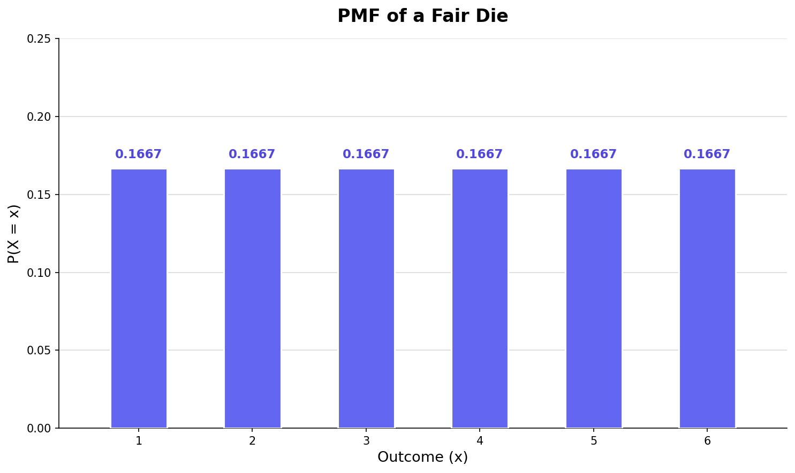
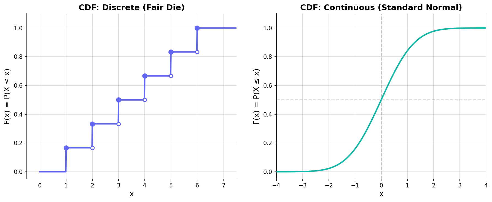
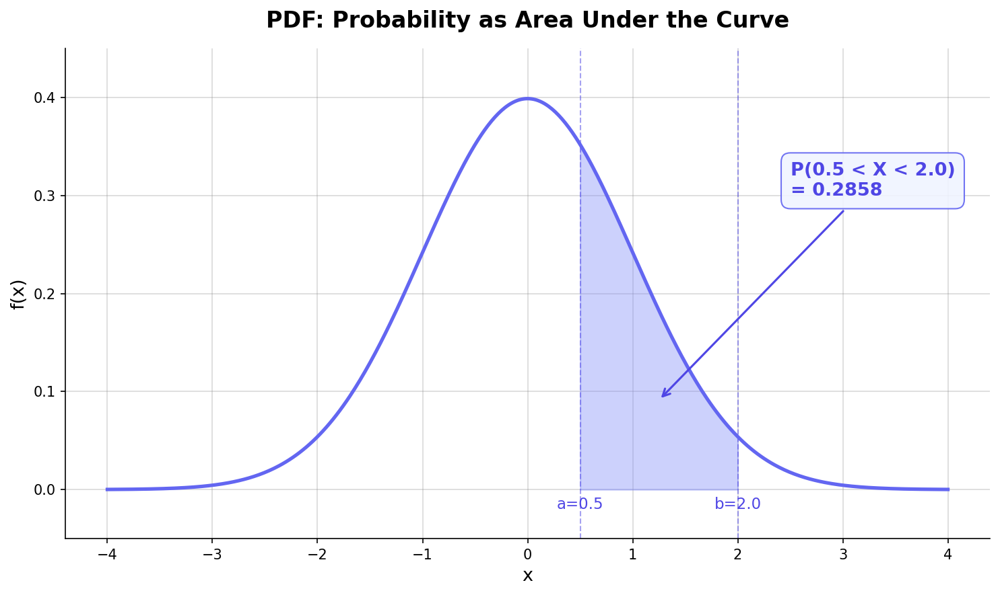
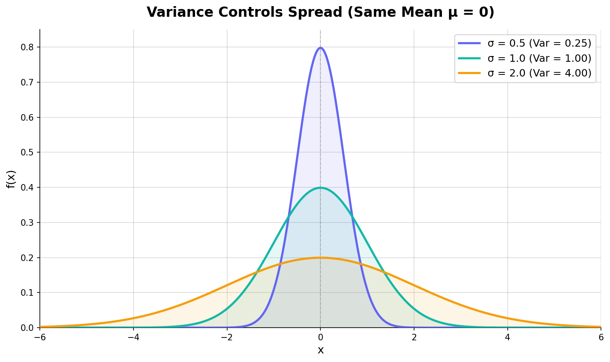
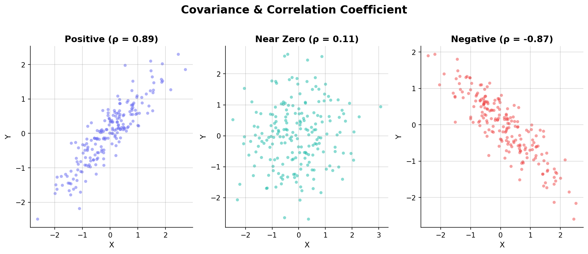

[이전 글](/stats/conditional-probability-bayes/)에서 조건부 확률과 베이즈 정리를 다뤘다. 동전 앞면, 주사위 눈, 카드 뽑기 — 지금까지 다룬 확률은 전부 "사건"에 대한 것이었다. 그런데 ML에서 실제로 다루는 값은 대부분 **숫자**다. 키 172.5cm, 주가 53,200원, 손실값 0.0342.

사건을 숫자로 바꿔주는 다리가 바로 **확률변수(Random Variable)**다. 확률변수를 정의하고 나면 그 숫자들의 평균(기댓값), 흩어진 정도(분산), 두 변수 간의 관계(공분산)를 수학적으로 깔끔하게 표현할 수 있게 된다. 이번 글에서는 이 핵심 도구들을 하나씩 쌓아올린다.

---

## 확률변수란 무엇인가

### 사건에서 숫자로

[확률 공리](/stats/probability-fundamentals/)에서 표본공간(Sample Space) $\Omega$를 배웠다. 주사위를 던지면 표본공간은 $\Omega = \{⚀, ⚁, ⚂, ⚃, ⚄, ⚅\}$이다. 그런데 수학 공식에 주사위 그림을 대입할 수는 없다. "⚂ + ⚄ = ?"는 의미가 없다.

**확률변수(Random Variable)**는 표본공간의 각 결과를 실수에 대응시키는 함수다.

$$X: \Omega \rightarrow \mathbb{R}$$

주사위 예시라면, $X(⚀) = 1$, $X(⚁) = 2$, ..., $X(⚅) = 6$으로 대응시킨다. 이제 $X + Y$같은 연산이 가능해진다.

:::info

**💡 참고**

"변수"라는 이름 때문에 혼동하기 쉽지만, 확률변수는 변수가 아니라 **함수**다. 표본공간의 원소를 입력받아 숫자를 출력하는 함수. 다만 역사적 관습으로 "변수"라 부른다.

:::

### 이산 vs 연속

확률변수가 취할 수 있는 값의 종류에 따라 두 가지로 나뉜다.

| 구분 | 이산 확률변수 (Discrete) | 연속 확률변수 (Continuous) |
|------|-------------------------|--------------------------|
| 가능한 값 | 셀 수 있는 값 (유한 또는 가산 무한) | 구간 내의 모든 실수 |
| 예시 | 주사위 눈, 불량품 수, 클릭 횟수 | 키, 몸무게, 온도, 주가 |
| 확률 표현 | PMF: $P(X = x)$ | PDF: $f(x)$ |

Python으로 확인해보자.

```python
import numpy as np

# 이산: 주사위 시뮬레이션
rng = np.random.default_rng(42)
dice_rolls = rng.integers(1, 7, size=10000)
print(f"주사위 가능한 값: {np.unique(dice_rolls)}")
# [1 2 3 4 5 6] — 딱 6개

# 연속: 키 시뮬레이션 (평균 170, 표준편차 6)
heights = rng.normal(170, 6, size=10000)
print(f"키 고유값 수: {len(np.unique(heights))}")
# 10000 — 사실상 모든 값이 다르다
```

이산은 값이 "톡톡 끊어지고", 연속은 값이 "빈틈 없이 이어진다." 이 차이가 확률을 기술하는 방식을 완전히 바꾼다.

---

## PMF: 이산 확률변수의 확률 분포

### 정의

**확률 질량 함수(Probability Mass Function, PMF)**는 이산 확률변수가 특정 값을 가질 확률을 알려준다.

$$p(x) = P(X = x)$$

공정한 주사위라면 각 눈의 PMF는 동일하다.

$$p(1) = p(2) = \cdots = p(6) = \frac{1}{6}$$

### PMF의 두 가지 성질

PMF가 유효하려면 반드시 두 조건을 만족해야 한다.

1. **비음수성**: 모든 $x$에 대해 $p(x) \geq 0$
2. **정규화**: $\sum_x p(x) = 1$ (모든 확률의 합은 1)

직관적으로 당연하다. 확률은 음수가 될 수 없고, 가능한 모든 결과의 확률을 더하면 1이어야 한다.

### 시각화: 공정한 주사위의 PMF


<p align="center" style="color: #888; font-size: 13px;"><em>공정한 주사위의 PMF — 모든 값에 동일한 확률 1/6이 할당된다</em></p>

막대 높이가 전부 같다. 이것이 **균일 분포(Uniform Distribution)**의 특징이다. 만약 주사위가 조작되어 6이 나올 확률이 높다면, 6번 막대만 높아지고 나머지는 낮아질 것이다 — 단, 합은 여전히 1이다.

```python
import numpy as np

# 공정한 주사위 PMF 직접 계산
outcomes = np.arange(1, 7)
pmf = np.ones(6) / 6

# 성질 1: 비음수
print(f"모두 0 이상? {np.all(pmf >= 0)}")  # True

# 성질 2: 합 = 1
print(f"합계: {pmf.sum():.1f}")  # 1.0

# 특정 사건의 확률: P(X >= 5) = P(X=5) + P(X=6)
p_ge_5 = pmf[outcomes >= 5].sum()
print(f"P(X >= 5) = {p_ge_5:.4f}")  # 0.3333
```

PMF의 핵심은 $P(X = x)$가 의미 있는 양수값을 가진다는 점이다. "주사위가 정확히 3이 나올 확률"이 $1/6$이라고 말할 수 있다. 하지만 연속 확률변수에서는 이 이야기가 달라진다.

---

## CDF: 이산과 연속을 관통하는 누적 분포

### 정의

**누적 분포 함수(Cumulative Distribution Function, CDF)**는 확률변수가 특정 값 **이하**일 확률이다.

$$F(x) = P(X \leq x)$$

이산이든 연속이든 상관없이 항상 정의된다. 이것이 CDF의 강점이다.

### CDF의 성질

어떤 확률변수든 CDF는 다음을 만족한다.

1. **단조 증가**: $x_1 < x_2$이면 $F(x_1) \leq F(x_2)$
2. **범위**: $\lim_{x \to -\infty} F(x) = 0$, $\lim_{x \to +\infty} F(x) = 1$
3. **우연속**: CDF는 오른쪽에서 연속이다

구간 확률도 CDF로 깔끔하게 구할 수 있다.

$$P(a < X \leq b) = F(b) - F(a)$$

### 이산 CDF vs 연속 CDF


<p align="center" style="color: #888; font-size: 13px;"><em>왼쪽: 이산(주사위)의 계단형 CDF / 오른쪽: 연속(표준정규)의 매끄러운 CDF</em></p>

왼쪽을 보자. 주사위 CDF는 계단 형태다. $x = 3$에서 갑자기 $1/6$만큼 뛰어오른다 — 왜냐하면 "정확히 3"이 나올 확률이 존재하기 때문이다. 계단 사이의 평평한 구간에서는 새로운 값이 추가되지 않으니 확률이 변하지 않는다.

오른쪽 연속 CDF는 매끄러운 S자 곡선이다. 점프가 없다. 이건 연속 확률변수에서 "정확히 특정 값"이 나올 확률이 0이라는 뜻이기도 하다.

```python
from scipy import stats

# 이산: 주사위 CDF 직접 계산
def dice_cdf(x):
    """공정한 주사위의 CDF"""
    if x < 1: return 0
    elif x >= 6: return 1
    else: return int(x) / 6

print(f"F(2.5) = {dice_cdf(2.5):.4f}")  # 0.3333 (1, 2만 포함)
print(f"F(4)   = {dice_cdf(4):.4f}")    # 0.6667 (1, 2, 3, 4 포함)

# 연속: 표준정규분포 CDF (scipy 활용)
print(f"P(X ≤ 0)   = {stats.norm.cdf(0):.4f}")     # 0.5000
print(f"P(X ≤ 1.96) = {stats.norm.cdf(1.96):.4f}") # 0.9750

# 구간 확률: P(0 < X ≤ 1.96) = F(1.96) - F(0)
p_interval = stats.norm.cdf(1.96) - stats.norm.cdf(0)
print(f"P(0 < X ≤ 1.96) = {p_interval:.4f}")  # 0.4750
```

CDF가 중요한 이유는 분포의 종류에 관계없이 동일한 형식으로 확률을 계산할 수 있다는 점에 있다. 퍼센타일, 중앙값, 신뢰구간 모두 CDF를 기반으로 정의된다.

---

## PDF: 연속 확률변수의 확률 밀도

### 왜 PMF가 안 되는가

연속 확률변수에서 $P(X = 172.53841...)$처럼 정확히 한 값의 확률을 물으면 답은 **항상 0**이다. 실수는 무한히 촘촘하기 때문에, 하나의 점에 양수 확률을 부여하면 모든 점의 확률을 더했을 때 무한대가 되어 버린다.

그래서 연속 확률변수는 "점"이 아니라 **"구간"**의 확률을 다룬다. 이때 사용하는 도구가 **확률 밀도 함수(Probability Density Function, PDF)**다.

### 정의

PDF $f(x)$는 CDF를 미분한 함수다.

$$f(x) = \frac{dF(x)}{dx}$$

반대로 구간 확률은 PDF를 적분하면 된다.

$$P(a < X < b) = \int_a^b f(x) \, dx$$

핵심은 확률이 **넓이**라는 것이다. PDF 곡선 아래의 면적이 확률이다.


<p align="center" style="color: #888; font-size: 13px;"><em>표준정규분포의 PDF — 색칠된 영역의 넓이가 P(0.5 < X < 2.0)을 나타낸다</em></p>

### PDF의 성질

1. **비음수성**: $f(x) \geq 0$
2. **전체 적분 = 1**: $\int_{-\infty}^{\infty} f(x) \, dx = 1$
3. <strong>$f(x)$는 확률이 아니다</strong> — 밀도다

:::warning

**⚠️ 주의**

PDF 값은 1을 넘을 수 있다. 예를 들어 평균 0, 표준편차 0.1인 정규분포의 꼭짓점에서 $f(0) \approx 3.99$다. 이것은 확률이 아니라 **밀도(density)**이기 때문이다. 확률은 넓이(적분)로만 구해지고, 넓이는 항상 0과 1 사이다.

:::

```python
from scipy import stats
import numpy as np

# PDF 값이 1을 넘는 사례
narrow_dist = stats.norm(loc=0, scale=0.1)
print(f"f(0) = {narrow_dist.pdf(0):.4f}")  # 3.9894 — 1보다 크다!

# 그래도 전체 적분은 1
x = np.linspace(-1, 1, 100000)
area = np.trapz(narrow_dist.pdf(x), x)
print(f"전체 넓이 ≈ {area:.6f}")  # 1.000000

# 구간 확률 계산: P(-0.2 < X < 0.2)
p = narrow_dist.cdf(0.2) - narrow_dist.cdf(-0.2)
print(f"P(-0.2 < X < 0.2) = {p:.4f}")  # 0.9545
```

### PMF, PDF, CDF 관계 정리

| | 이산 확률변수 | 연속 확률변수 |
|---|---|---|
| 확률 함수 | PMF: $p(x) = P(X = x)$ | PDF: $f(x) = F'(x)$ |
| CDF | $F(x) = \sum_{k \leq x} p(k)$ | $F(x) = \int_{-\infty}^{x} f(t) \, dt$ |
| $P(X = x)$ | $p(x)$ (양수 가능) | 항상 0 |
| $P(a < X \leq b)$ | $\sum_{a < k \leq b} p(k)$ | $\int_a^b f(x) \, dx$ |

---

## 기댓값 E[X]: 확률로 가중한 평균

### 직관

시험을 100번 본다고 하자. 점수의 분포를 알면, 장기적으로 평균 점수가 어떻게 될지 예측할 수 있다. 이 "장기 평균"이 기댓값이다.

단순 평균과 다른 점은 **각 값이 나올 확률로 가중**한다는 것이다.

### 정의

**이산 확률변수**:

$$E[X] = \sum_x x \cdot P(X = x)$$

**연속 확률변수**:

$$E[X] = \int_{-\infty}^{\infty} x \cdot f(x) \, dx$$

주사위의 기댓값을 계산해보자.

$$E[X] = 1 \cdot \frac{1}{6} + 2 \cdot \frac{1}{6} + 3 \cdot \frac{1}{6} + 4 \cdot \frac{1}{6} + 5 \cdot \frac{1}{6} + 6 \cdot \frac{1}{6} = 3.5$$

3.5는 주사위 눈에 존재하지 않는 값이다. 기댓값은 "가장 자주 나오는 값"이 아니라 "무한히 반복했을 때의 평균"이라는 점을 기억하자.

```python
import numpy as np

# 공정한 주사위 기댓값
outcomes = np.arange(1, 7)
probs = np.ones(6) / 6

E_X = np.sum(outcomes * probs)
print(f"E[X] = {E_X:.1f}")  # 3.5

# 시뮬레이션으로 검증
rng = np.random.default_rng(42)
rolls = rng.integers(1, 7, size=1_000_000)
print(f"시뮬레이션 평균 = {rolls.mean():.4f}")  # ≈ 3.5

# 조작된 주사위: P(6) = 0.5, 나머지 각 0.1
biased_probs = np.array([0.1, 0.1, 0.1, 0.1, 0.1, 0.5])
E_biased = np.sum(outcomes * biased_probs)
print(f"조작된 주사위 E[X] = {E_biased:.1f}")  # 4.5
```

조작된 주사위의 기댓값이 4.5로 올라간다. 높은 값에 가중치가 몰렸기 때문이다.

### LOTUS: 변환 함수의 기댓값

$X$의 기댓값을 알고 있을 때, $g(X)$의 기댓값을 구하려면 어떻게 해야 할까? $g(X)$의 분포를 새로 구할 필요 없이, 원래 분포에서 바로 계산할 수 있다. 이것이 **LOTUS(Law of the Unconscious Statistician)**다.

$$E[g(X)] = \sum_x g(x) \cdot P(X = x) \quad \text{(이산)}$$

$$E[g(X)] = \int_{-\infty}^{\infty} g(x) \cdot f(x) \, dx \quad \text{(연속)}$$

예를 들어 $E[X^2]$를 구할 때, $Y = X^2$의 분포를 따로 유도하지 않아도 된다.

```python
# LOTUS 적용: E[X^2] 주사위
E_X2 = np.sum(outcomes**2 * probs)
print(f"E[X²] = {E_X2:.4f}")  # 15.1667

# 검증: 시뮬레이션
print(f"시뮬레이션 E[X²] = {(rolls**2).mean():.4f}")  # ≈ 15.17
```

LOTUS는 뒤에서 분산을 계산할 때 핵심적으로 쓰인다.

### 기댓값의 선형성

기댓값의 가장 강력한 성질은 **선형성(Linearity)**이다. 독립이든 아니든 항상 성립한다.

$$E[aX + b] = aE[X] + b$$

$$E[X + Y] = E[X] + E[Y]$$

두 번째 식이 강력한 이유는 $X$와 $Y$의 관계(독립 여부)와 **무관하게** 성립하기 때문이다.

```python
# 선형성 검증
a, b = 3, 5
print(f"E[{a}X + {b}] = {a * E_X + b:.1f}")  # 15.5

# 시뮬레이션
transformed = a * rolls + b
print(f"시뮬레이션 = {transformed.mean():.4f}")  # ≈ 15.5

# 두 주사위의 합
rolls_2 = rng.integers(1, 7, size=1_000_000)
print(f"E[X] + E[Y] = {3.5 + 3.5}")  # 7.0
print(f"E[X + Y] 시뮬레이션 = {(rolls + rolls_2).mean():.4f}")  # ≈ 7.0
```

:::info

**💡 참고**

기댓값의 선형성은 ML에서 광범위하게 쓰인다. 손실 함수의 기댓값을 분석할 때, 편향-분산 분해(Bias-Variance Decomposition)를 유도할 때, 그리고 확률적 경사하강법(SGD)에서 미니배치 그래디언트가 전체 그래디언트의 불편 추정량(unbiased estimator)임을 증명할 때 핵심적으로 사용된다.

:::

---

## 분산 Var(X)와 표준편차

### 기댓값만으로는 부족하다

두 학생의 시험 점수를 생각해보자.

- 학생 A: 70, 70, 70, 70 → 평균 70
- 학생 B: 40, 100, 50, 90 → 평균 70

평균은 같지만, 학생 B의 점수는 훨씬 들쑥날쑥하다. 이 "흩어진 정도"를 수치화한 것이 **분산(Variance)**이다.

### 정의

$$\text{Var}(X) = E\big[(X - \mu)^2\big]$$

여기서 $\mu = E[X]$다. 각 값이 평균에서 얼마나 떨어져 있는지를 제곱해서 평균 낸 것이다.

LOTUS를 적용하면 계산에 편리한 공식이 나온다.

$$\text{Var}(X) = E[X^2] - (E[X])^2$$

이 공식이 실전에서 훨씬 자주 쓰인다. 이유는 간단하다 — $E[X^2]$와 $E[X]$만 알면 되니까.

### 왜 제곱하는가

평균과의 차이를 단순히 더하면, 양수와 음수가 상쇄된다(주사위 잔차 합이 0이 되던 것과 같은 문제다). 절댓값을 쓸 수도 있지만, 제곱이 수학적으로 훨씬 다루기 쉽다.

- 미분이 깔끔하다 ($|x|$는 $x=0$에서 미분 불가)
- 분산의 덧셈 정리가 깔끔하게 성립한다
- 가우스 분포와 자연스럽게 연결된다

[비용 함수 글](/ml/cost-function/)에서 MSE가 MAE보다 수학적으로 다루기 쉽다고 했던 이유가 바로 이것이다. 분산과 MSE는 같은 "제곱 편차"라는 아이디어에 뿌리를 두고 있다.

### 시각화: 분산이 분포의 폭을 결정한다


<p align="center" style="color: #888; font-size: 13px;"><em>같은 평균(μ=0)에서 σ가 커질수록 분포가 넓게 퍼진다</em></p>

σ = 0.5인 분포(보라색)는 좁고 뾰족하다. σ = 2.0인 분포(노란색)는 넓고 납작하다. 평균은 같지만 분산이 다르면 데이터의 성격이 완전히 달라진다.

```python
import numpy as np

# 주사위 분산 계산 (두 가지 방법)
outcomes = np.arange(1, 7)
probs = np.ones(6) / 6
mu = np.sum(outcomes * probs)  # 3.5

# 방법 1: 정의 그대로
var_def = np.sum((outcomes - mu)**2 * probs)
print(f"Var(X) 정의식 = {var_def:.4f}")  # 2.9167

# 방법 2: E[X²] - (E[X])²
E_X2 = np.sum(outcomes**2 * probs)
var_formula = E_X2 - mu**2
print(f"Var(X) 계산식 = {var_formula:.4f}")  # 2.9167

# 시뮬레이션 검증
rng = np.random.default_rng(42)
rolls = rng.integers(1, 7, size=1_000_000)
print(f"시뮬레이션 분산 = {rolls.var():.4f}")  # ≈ 2.917
```

### 분산의 성질

$$\text{Var}(aX + b) = a^2 \text{Var}(X)$$

상수 $b$를 더해도 분산은 변하지 않는다(평행 이동은 흩어진 정도에 영향을 주지 않는다). $a$를 곱하면 분산은 $a^2$배가 된다.

```python
a, b = 3, 5
var_X = rolls.var()
var_transformed = (a * rolls + b).var()

print(f"Var(X)         = {var_X:.4f}")
print(f"a²·Var(X)      = {a**2 * var_X:.4f}")
print(f"Var(aX + b)    = {var_transformed:.4f}")
# 세 값이 모두 같다
```

### 표준편차

분산은 단위가 원래 값의 제곱이다. 키의 분산이 36 cm²라면 해석하기 어렵다. 제곱근을 씌워서 원래 단위로 돌려놓은 것이 **표준편차(Standard Deviation)**다.

$$\sigma = \sqrt{\text{Var}(X)}$$

주사위의 표준편차는 $\sqrt{2.9167} \approx 1.708$이다. "주사위 눈은 평균 3.5에서 대략 ±1.7 정도 떨어져 있다"고 해석할 수 있다.

```python
import numpy as np

sigma = np.sqrt(var_def)
print(f"표준편차 σ = {sigma:.4f}")  # 1.7078

# numpy의 std 함수로 직접 계산
print(f"np.std 결과 = {rolls.std():.4f}")  # ≈ 1.708
```

:::warning

**⚠️ 주의**

NumPy의 `np.var()`와 `np.std()`는 기본적으로 **모분산**($N$으로 나눔)을 계산한다. 표본 분산($N-1$로 나눔, 불편 추정량)을 원하면 `ddof=1`을 명시해야 한다.

`np.var(data, ddof=1)`  # 표본 분산
`np.std(data, ddof=1)`  # 표본 표준편차

:::

---

## 공분산과 상관계수

### 두 확률변수의 관계

지금까지는 확률변수 하나의 성질을 다뤘다. ML에서는 대부분 여러 변수(피처)를 동시에 다루기 때문에, **두 변수가 함께 움직이는 방향과 정도**를 정량화할 수단이 필요하다.

### 공분산 (Covariance)

**공분산(Covariance)**은 두 확률변수가 평균으로부터 같은 방향으로 벗어나는 경향을 측정한다.

$$\text{Cov}(X, Y) = E\big[(X - \mu_X)(Y - \mu_Y)\big] = E[XY] - E[X]E[Y]$$

- $\text{Cov}(X, Y) > 0$: $X$가 클 때 $Y$도 큰 경향 (같은 방향)
- $\text{Cov}(X, Y) < 0$: $X$가 클 때 $Y$는 작은 경향 (반대 방향)
- $\text{Cov}(X, Y) = 0$: 선형 관계 없음

한 가지 주의할 점이 있다. 공분산은 변수의 단위에 의존하기 때문에, 값의 절대적 크기로 "관계가 강한지 약한지"를 판단하기 어렵다. 키(cm)와 몸무게(kg)의 공분산이 50이라 해도, 키를 m 단위로 바꾸면 값이 확 달라진다.

### 상관계수 (Correlation Coefficient)

이 문제를 해결하기 위해 공분산을 각 변수의 표준편차로 나눠 **정규화**한 것이 **피어슨 상관계수(Pearson Correlation Coefficient)**다.

$$\rho_{XY} = \frac{\text{Cov}(X, Y)}{\sigma_X \sigma_Y}$$

상관계수는 항상 $-1 \leq \rho \leq 1$ 범위에 있다.

- $\rho = 1$: 완벽한 양의 선형 관계
- $\rho = -1$: 완벽한 음의 선형 관계
- $\rho = 0$: 선형 관계 없음


<p align="center" style="color: #888; font-size: 13px;"><em>상관계수에 따른 산점도 패턴 — 양의 상관, 무상관, 음의 상관</em></p>

```python
import numpy as np

rng = np.random.default_rng(42)

# 양의 상관 데이터 생성
x = rng.normal(0, 1, 10000)
y_pos = 0.8 * x + 0.4 * rng.normal(0, 1, 10000)

# 공분산 & 상관계수
cov_xy = np.cov(x, y_pos)[0, 1]
corr_xy = np.corrcoef(x, y_pos)[0, 1]
print(f"Cov(X, Y)  = {cov_xy:.4f}")   # ≈ 0.80
print(f"Corr(X, Y) = {corr_xy:.4f}")  # ≈ 0.89

# E[XY] - E[X]E[Y] 직접 계산으로 검증
cov_manual = np.mean(x * y_pos) - np.mean(x) * np.mean(y_pos)
print(f"수동 계산   = {cov_manual:.4f}")  # 같은 값
```

### 독립이면 공분산은 0이다 — 역은 거짓

$X$와 $Y$가 **독립**이면 $\text{Cov}(X, Y) = 0$이다. 독립이면 $E[XY] = E[X] \cdot E[Y]$이기 때문이다.

하지만 **역은 성립하지 않는다**. 공분산이 0이어도 두 변수가 독립이 아닐 수 있다. 공분산은 오직 **선형 관계**만 포착하기 때문이다.

```python
# 공분산 = 0이지만 독립이 아닌 예시
rng = np.random.default_rng(42)
x = rng.uniform(-1, 1, 100000)
y = x**2  # Y는 X의 함수 → 독립이 아니다!

cov_val = np.cov(x, y)[0, 1]
corr_val = np.corrcoef(x, y)[0, 1]
print(f"Cov(X, X²) = {cov_val:.6f}")   # ≈ 0 (거의 0)
print(f"Corr(X, X²) = {corr_val:.6f}") # ≈ 0

# 하지만 Y = X²이므로 X를 알면 Y가 결정된다 — 절대 독립이 아니다!
print(f"X와 Y는 독립? 아니다. Y = X²이므로 완전히 종속적이다.")
```

이 예시에서 $Y = X^2$이므로 $X$를 알면 $Y$가 결정된다. 명백히 종속적이다. 그런데 공분산은 0에 가깝다. $X$가 양수일 때와 음수일 때 $Y$가 같은 방향으로 움직이기 때문에 **선형적**으로는 상쇄되기 때문이다.

:::info

**💡 참고**

공분산 행렬(Covariance Matrix)은 여러 변수 쌍의 공분산을 정사각 행렬로 정리한 것이다. [PCA(주성분 분석)](/ml/pca/)는 바로 이 공분산 행렬의 고유벡터를 찾는 과정이다. 분산이 가장 큰 방향을 찾아 차원을 축소하는 원리와 직접적으로 연결된다.

:::

### 분산의 덧셈 정리

두 확률변수 합의 분산은 다음과 같다.

$$\text{Var}(X + Y) = \text{Var}(X) + \text{Var}(Y) + 2\text{Cov}(X, Y)$$

$X$와 $Y$가 **독립**이면 $\text{Cov}(X, Y) = 0$이므로,

$$\text{Var}(X + Y) = \text{Var}(X) + \text{Var}(Y)$$

독립이 아니면 공분산 항이 추가된다. 양의 상관이 있으면 합의 분산이 더 커지고, 음의 상관이 있으면 줄어든다.

```python
import numpy as np

rng = np.random.default_rng(42)

# 독립인 경우
x = rng.normal(0, 2, 100000)    # Var = 4
y_ind = rng.normal(0, 3, 100000) # Var = 9

print("=== 독립인 경우 ===")
print(f"Var(X)     = {x.var():.2f}")
print(f"Var(Y)     = {y_ind.var():.2f}")
print(f"Var(X+Y)   = {(x + y_ind).var():.2f}")  # ≈ 13
print(f"합산 기대값  = {x.var() + y_ind.var():.2f}")

# 양의 상관인 경우
y_pos = 0.8 * x + rng.normal(0, 1, 100000)
print("\n=== 양의 상관인 경우 ===")
print(f"Var(X)     = {x.var():.2f}")
print(f"Var(Y)     = {y_pos.var():.2f}")
print(f"Cov(X,Y)   = {np.cov(x, y_pos)[0,1]:.2f}")
print(f"Var(X+Y)   = {(x + y_pos).var():.2f}")  # Var(X)+Var(Y)보다 크다
```

---

## 전체 개념 연결: Python으로 한눈에

지금까지 다룬 개념들을 하나의 코드 블록에서 정리해보자. 연속 확률변수(정규분포)를 대상으로 PMF/PDF, CDF, 기댓값, 분산을 모두 계산한다.

```python
import numpy as np
from scipy import stats

# 정규분포 N(5, 2²) 설정
mu, sigma = 5, 2
dist = stats.norm(loc=mu, scale=sigma)

# 1) PDF 값 (밀도, 확률이 아님)
print(f"f(5) = {dist.pdf(5):.4f}")   # 꼭짓점 밀도
print(f"f(3) = {dist.pdf(3):.4f}")   # 평균에서 1σ 왼쪽

# 2) CDF — 누적 확률
print(f"P(X ≤ 5) = {dist.cdf(5):.4f}")    # 0.5 (대칭)
print(f"P(X ≤ 7) = {dist.cdf(7):.4f}")    # 0.8413

# 3) 구간 확률
p_3_7 = dist.cdf(7) - dist.cdf(3)
print(f"P(3 < X < 7) = {p_3_7:.4f}")  # ≈ 0.6827 (1σ 규칙)

# 4) 기댓값 & 분산
print(f"E[X]   = {dist.mean():.1f}")   # 5.0
print(f"Var(X) = {dist.var():.1f}")    # 4.0
print(f"σ      = {dist.std():.1f}")    # 2.0

# 5) 시뮬레이션 대조
rng = np.random.default_rng(42)
samples = dist.rvs(size=1_000_000, random_state=rng)

print(f"\n--- 시뮬레이션 (n=1,000,000) ---")
print(f"표본 평균  = {samples.mean():.4f}")
print(f"표본 분산  = {samples.var():.4f}")
print(f"표본 σ    = {samples.std():.4f}")
```

이론값과 시뮬레이션 결과가 거의 일치한다. 표본 수가 커질수록 이 차이는 더 줄어든다 — 이것이 **대수의 법칙(Law of Large Numbers)**의 본질이며, 이후 글에서 다시 다루게 된다.

---

## 핵심 공식 치트시트

:::summary

**📌 핵심 요약**

- **확률변수**: 표본공간 → 실수로의 함수. 이산(PMF) vs 연속(PDF)
- **PMF**: $P(X = x)$ — 이산 확률변수의 각 값에 대한 확률
- **PDF**: $f(x)$ — 연속 확률변수의 밀도. 확률은 넓이(적분)로 구한다
- **CDF**: $F(x) = P(X \leq x)$ — 이산·연속 공통. 구간 확률 = $F(b) - F(a)$
- **기댓값**: $E[X]$ — 확률 가중 평균. 선형성이 핵심: $E[aX+b] = aE[X]+b$
- **분산**: $\text{Var}(X) = E[X^2] - (E[X])^2$ — 흩어진 정도. 표준편차 $\sigma = \sqrt{\text{Var}}$
- **공분산**: $\text{Cov}(X,Y) = E[XY] - E[X]E[Y]$ — 두 변수의 선형 관계. 독립 → Cov=0 (역 거짓)
- **상관계수**: $\rho = \text{Cov} / (\sigma_X \sigma_Y)$ — 단위 무관한 선형 관계 강도. $[-1, 1]$ 범위

:::

---

## 마치며

확률변수는 "사건의 세계"에서 "숫자의 세계"로 넘어가는 관문이다. 이 관문을 통과하면 PMF와 PDF로 분포를 기술하고, 기댓값으로 중심을 잡고, 분산으로 퍼짐을 측정하고, 공분산으로 변수 간 관계를 정량화할 수 있게 된다.

이 도구들은 ML 곳곳에서 마주치게 된다. 손실 함수의 기댓값, 편향-분산 트레이드오프, PCA의 공분산 행렬, 그리고 확률적 경사하강법의 이론적 보장까지 — 오늘 다진 기반 위에 구체적인 분포들을 올려놓을 차례다.

[다음 글](/stats/discrete-distributions/)에서는 베르누이, 이항, 포아송 등 이산분포를 하나씩 도출하고, 각 분포의 기댓값과 분산이 어떻게 유도되는지 살펴본다.

---

## 참고자료

- Blitzstein, J. K., & Hwang, J. (2019). *Introduction to Probability* (2nd ed.), Chapters 3-4.
- Wasserman, L. (2004). *All of Statistics*, Chapter 3.
- MIT 6.041 Lecture Notes: Random Variables, Expectation, Variance.
- [scipy.stats documentation](https://docs.scipy.org/doc/scipy/reference/stats.html)
