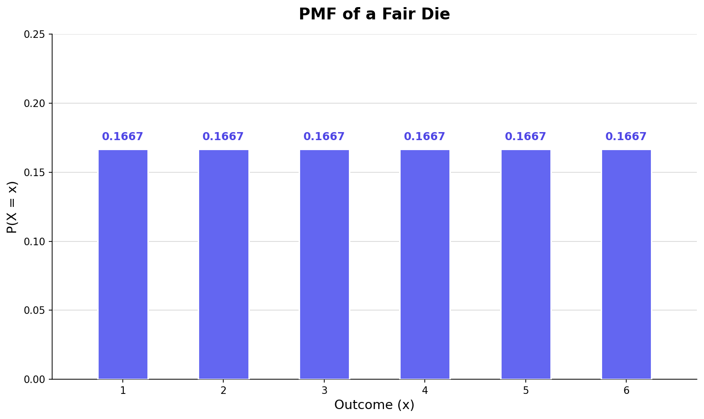
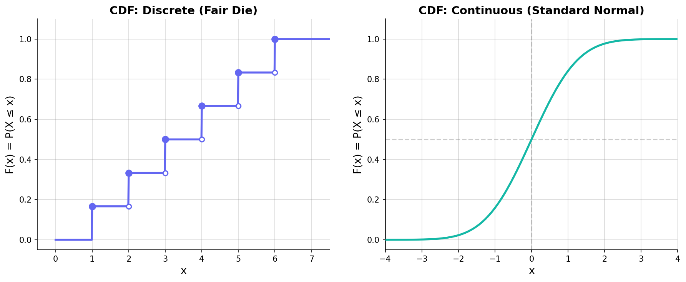
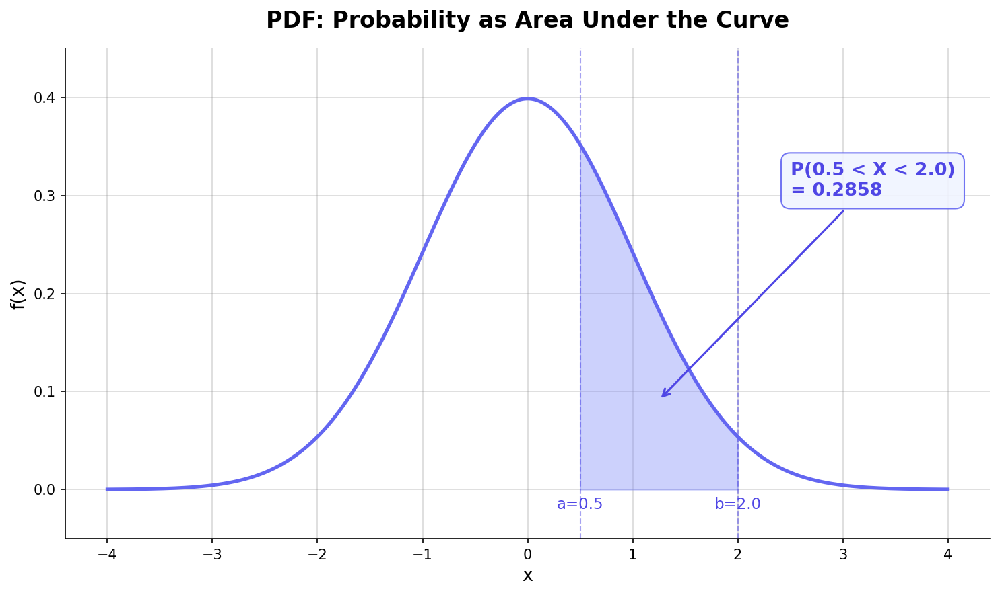
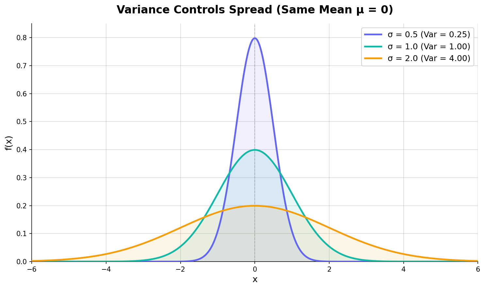
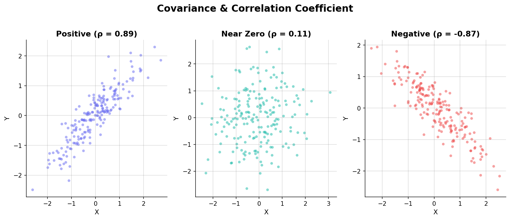

동전 앞면, 주사위 눈, 카드 뽑기처럼 지금까지의 확률은 전부 "사건"에 대한 것이었다. 그런데 ML에서 실제로 다루는 값은 대부분 숫자다. 키 172.5cm, 주가 53,200원, 손실값 0.0342.

사건을 숫자로 바꿔주는 다리가 확률변수(Random Variable)다. 확률변수를 정의하고 나면 그 숫자들의 평균(기댓값), 흩어진 정도(분산), 두 변수 간의 관계(공분산)를 수학적으로 표현할 수 있게 된다.

## 확률변수란 무엇인가

주사위를 던지면 표본공간은 $\Omega = \{⚀, ⚁, ⚂, ⚃, ⚄, ⚅\}$이다. 그런데 수학 공식에 주사위 그림을 대입할 수는 없다. "⚂ + ⚄ = ?"는 의미가 없다.

확률변수는 표본공간의 각 결과를 실수에 대응시키는 함수다.

$$X: \Omega \rightarrow \mathbb{R}$$

주사위라면 $X(⚀) = 1$, $X(⚁) = 2$, ..., $X(⚅) = 6$으로 대응시킨다. 이제 $X + Y$ 같은 연산이 가능해진다.

:::info

**참고**

"변수"라는 이름 때문에 혼동하기 쉽지만, 확률변수는 변수가 아니라 함수다. 표본공간의 원소를 입력받아 숫자를 출력하는 함수인데, 역사적 관습으로 "변수"라 부른다.

:::

확률변수가 취할 수 있는 값의 종류에 따라 두 가지로 나뉜다.

| 구분 | 이산 확률변수 (Discrete) | 연속 확률변수 (Continuous) |
|------|-------------------------|--------------------------|
| 가능한 값 | 셀 수 있는 값 (유한 또는 가산 무한) | 구간 내의 모든 실수 |
| 예시 | 주사위 눈, 불량품 수, 클릭 횟수 | 키, 몸무게, 온도, 주가 |
| 확률 표현 | PMF: $P(X = x)$ | PDF: $f(x)$ |

이산은 값이 톡톡 끊어지고 연속은 빈틈 없이 이어진다. 이 차이가 확률을 기술하는 방식을 완전히 바꾼다.

## PMF: 이산 확률변수의 확률 분포

확률 질량 함수(Probability Mass Function, PMF)는 이산 확률변수가 특정 값을 가질 확률을 알려준다.

$$p(x) = P(X = x)$$

공정한 주사위라면 $p(1) = p(2) = \cdots = p(6) = 1/6$이다. PMF가 유효하려면 두 조건을 만족해야 한다. 모든 $x$에 대해 $p(x) \geq 0$이고(비음수성), $\sum_x p(x) = 1$이어야 한다(정규화).



*공정한 주사위의 PMF: 모든 값에 동일한 확률 1/6이 할당된다*

막대 높이가 전부 같은 것이 균일 분포(Uniform Distribution)의 특징이다. 주사위가 조작되어 6이 나올 확률이 높아지면 6번 막대가 높아지는 대신 다른 막대가 낮아져서, 합은 여전히 1이 된다.

```python
import numpy as np

outcomes = np.arange(1, 7)
pmf = np.ones(6) / 6

# 특정 사건의 확률: P(X >= 5) = P(X=5) + P(X=6)
print(f"P(X >= 5) = {pmf[outcomes >= 5].sum():.4f}")
# P(X >= 5) = 0.3333
```

PMF에서는 $P(X = x)$가 의미 있는 양수값을 가진다. "주사위가 정확히 3이 나올 확률"이 1/6이라고 말할 수 있다. 연속 확률변수에서는 이 이야기가 달라진다.

## CDF: 이산과 연속을 관통하는 누적 분포

누적 분포 함수(Cumulative Distribution Function, CDF)는 확률변수가 특정 값 이하일 확률이다.

$$F(x) = P(X \leq x)$$

이산이든 연속이든 상관없이 항상 정의된다는 것이 CDF의 강점이다. 어떤 확률변수든 CDF는 다음을 만족한다.

1. 단조 증가: $x_1 < x_2$이면 $F(x_1) \leq F(x_2)$
2. 범위: $\lim_{x \to -\infty} F(x) = 0$, $\lim_{x \to +\infty} F(x) = 1$
3. 우연속: CDF는 오른쪽에서 연속이다

구간 확률도 CDF로 깔끔하게 구할 수 있다.

$$P(a < X \leq b) = F(b) - F(a)$$



*왼쪽: 이산(주사위)의 계단형 CDF / 오른쪽: 연속(표준정규)의 매끄러운 CDF*

주사위 CDF는 계단 형태다. $x = 3$에서 갑자기 1/6만큼 뛰어오르는데, "정확히 3"이 나올 확률이 존재하기 때문이다. 계단 사이의 평평한 구간에서는 새로운 값이 추가되지 않으니 확률이 변하지 않는다.

오른쪽 연속 CDF는 매끄러운 S자 곡선으로 점프가 없다. 이는 연속 확률변수에서 정확히 특정 값이 나올 확률이 0이라는 뜻이기도 하다.

```python
from scipy import stats

print(f"P(X <= 1.96) = {stats.norm.cdf(1.96):.4f}")
# P(X <= 1.96) = 0.9750

# 구간 확률: P(0 < X <= 1.96) = F(1.96) - F(0)
print(f"P(0 < X <= 1.96) = {stats.norm.cdf(1.96) - stats.norm.cdf(0):.4f}")
# P(0 < X <= 1.96) = 0.4750
```

퍼센타일, 중앙값, 신뢰구간은 모두 CDF를 기반으로 정의된다.

## PDF: 연속 확률변수의 확률 밀도

연속 확률변수에서 $P(X = 172.53841...)$처럼 정확히 한 값의 확률을 물으면 답은 항상 0이다. 실수는 무한히 촘촘하기 때문에, 모든 점에 같은 양수 확률을 부여하면 전체 합이 발산해 버린다.

그래서 연속 확률변수는 점이 아니라 구간의 확률을 다룬다. 이때 쓰는 도구가 확률 밀도 함수(Probability Density Function, PDF)다. PDF $f(x)$는 CDF를 미분한 함수이고, 반대로 구간 확률은 PDF를 적분하면 된다.

$$f(x) = \frac{dF(x)}{dx}, \qquad P(a < X < b) = \int_a^b f(x) \, dx$$

핵심은 확률이 넓이라는 것이다. PDF 곡선 아래의 면적이 확률이다.



*표준정규분포의 PDF: 색칠된 영역의 넓이가 P(0.5 < X < 2.0)을 나타낸다*

PDF는 $f(x) \geq 0$이고 $\int_{-\infty}^{\infty} f(x) \, dx = 1$을 만족한다.

:::warning

**주의: PDF 값은 확률이 아니다**

PDF 값은 1을 넘을 수 있다. 평균 0, 표준편차 0.1인 정규분포의 꼭짓점에서는 $f(0) \approx 3.99$다. 이것은 확률이 아니라 밀도(density)이기 때문이다. 확률은 넓이(적분)로만 구해지고, 넓이는 항상 0과 1 사이다.

:::

| | 이산 확률변수 | 연속 확률변수 |
|---|---|---|
| 확률 함수 | PMF: $p(x) = P(X = x)$ | PDF: $f(x) = F'(x)$ |
| CDF | $F(x) = \sum_{k \leq x} p(k)$ | $F(x) = \int_{-\infty}^{x} f(t) \, dt$ |
| $P(X = x)$ | $p(x)$ (양수 가능) | 항상 0 |
| $P(a < X \leq b)$ | $\sum_{a < k \leq b} p(k)$ | $\int_a^b f(x) \, dx$ |

## 기댓값: 확률로 가중한 평균

시험을 100번 본다고 하자. 점수의 분포를 알면 장기적으로 평균 점수가 어떻게 될지 예측할 수 있다. 이 장기 평균이 기댓값이다. 단순 평균과 다른 점은 각 값이 나올 확률로 가중한다는 것이다.

$$E[X] = \sum_x x \cdot P(X = x) \quad \text{(이산)}, \qquad E[X] = \int_{-\infty}^{\infty} x \cdot f(x) \, dx \quad \text{(연속)}$$

주사위의 기댓값은 $(1 + 2 + \cdots + 6)/6 = 3.5$다. 3.5는 주사위 눈에 존재하지 않는 값이다. 기댓값은 "가장 자주 나오는 값"이 아니라 "무한히 반복했을 때의 평균"이다.

```python
import numpy as np

outcomes = np.arange(1, 7)
probs = np.ones(6) / 6
print(f"E[X] = {np.sum(outcomes * probs):.1f}")
# E[X] = 3.5

# 조작된 주사위: P(6) = 0.5, 나머지 각 0.1
biased = np.array([0.1, 0.1, 0.1, 0.1, 0.1, 0.5])
print(f"조작된 주사위 E[X] = {np.sum(outcomes * biased):.1f}")
# 조작된 주사위 E[X] = 4.5
```

높은 값에 가중치가 몰리면 기댓값도 따라 올라간다.

### LOTUS: 변환 함수의 기댓값

$X$의 분포를 알 때 $g(X)$의 기댓값을 구하려면, $g(X)$의 분포를 새로 유도할 필요 없이 원래 분포에서 바로 계산하면 된다. 이것이 LOTUS(Law of the Unconscious Statistician)다.

$$E[g(X)] = \sum_x g(x) \cdot P(X = x), \qquad E[g(X)] = \int_{-\infty}^{\infty} g(x) \cdot f(x) \, dx$$

주사위의 $E[X^2]$는 $Y = X^2$의 분포를 따로 구하지 않고 $(1 + 4 + 9 + 16 + 25 + 36)/6 = 91/6 \approx 15.167$로 바로 계산된다. LOTUS는 뒤에서 분산을 계산할 때 핵심적으로 쓰인다.

### 기댓값의 선형성

기댓값의 가장 강력한 성질은 선형성(Linearity)이다.

$$E[aX + b] = aE[X] + b, \qquad E[X + Y] = E[X] + E[Y]$$

두 번째 식이 강력한 이유는 $X$와 $Y$의 독립 여부와 무관하게 항상 성립하기 때문이다. 주사위 하나면 $E[3X + 5] = 3 \times 3.5 + 5 = 15.5$이고, 주사위 두 개의 합은 $E[X] + E[Y] = 7$이다.

선형성은 손실 함수의 기댓값을 분석할 때, 편향-분산 분해를 유도할 때, 확률적 경사하강법(SGD)에서 미니배치 그래디언트가 전체 그래디언트의 불편 추정량임을 증명할 때 쓰인다.

## 분산과 표준편차

두 학생의 시험 점수를 보자. 학생 A는 70, 70, 70, 70이고 학생 B는 40, 100, 50, 90이다. 평균은 둘 다 70이지만 학생 B의 점수는 훨씬 들쑥날쑥하다. 이 흩어진 정도를 수치화한 것이 분산(Variance)이다.

$$\text{Var}(X) = E\big[(X - \mu)^2\big] = E[X^2] - (E[X])^2$$

여기서 $\mu = E[X]$다. 각 값이 평균에서 얼마나 떨어져 있는지를 제곱해서 평균 낸 것이고, LOTUS를 적용하면 오른쪽의 계산용 공식이 나온다. $E[X^2]$와 $E[X]$만 알면 되니 실전에서는 이쪽이 훨씬 자주 쓰인다.

평균과의 차이를 제곱하지 않고 그냥 더하면 양수와 음수가 상쇄되어 항상 0이 된다. 절댓값을 쓸 수도 있지만 제곱이 수학적으로 다루기 쉽다.

- 미분이 깔끔하다 ($|x|$는 $x=0$에서 미분 불가)
- 분산의 덧셈 정리가 깔끔하게 성립한다
- 가우스 분포와 자연스럽게 연결된다

MSE가 MAE보다 수학적으로 다루기 쉬운 이유도 여기에 있다. 분산과 MSE는 같은 "제곱 편차"라는 아이디어에 뿌리를 두고 있다.



*같은 평균(μ=0)에서 σ가 커질수록 분포가 넓게 퍼진다*

σ = 0.5인 분포는 좁고 뾰족하고, σ = 2.0인 분포는 넓고 납작하다. 평균이 같아도 분산이 다르면 데이터의 성격이 완전히 달라진다.

```python
import numpy as np

outcomes = np.arange(1, 7)
probs = np.ones(6) / 6
mu = np.sum(outcomes * probs)

var_def = np.sum((outcomes - mu)**2 * probs)          # 정의 그대로
var_formula = np.sum(outcomes**2 * probs) - mu**2      # E[X²] - (E[X])²
print(f"Var(X) = {var_def:.4f} / {var_formula:.4f}")
print(f"σ = {np.sqrt(var_def):.4f}")
# Var(X) = 2.9167 / 2.9167
# σ = 1.7078
```

분산에는 다음 성질이 있다.

$$\text{Var}(aX + b) = a^2 \text{Var}(X)$$

상수 $b$를 더해도 분산은 변하지 않는다. 평행 이동은 흩어진 정도에 영향을 주지 않기 때문이다. $a$를 곱하면 분산은 $a^2$배가 되므로, 주사위의 경우 $\text{Var}(3X + 5) = 9 \times 2.9167 \approx 26.25$다.

분산은 단위가 원래 값의 제곱이다. 키의 분산이 36 cm²라면 해석하기 어렵다. 제곱근을 씌워 원래 단위로 돌려놓은 것이 표준편차(Standard Deviation) $\sigma = \sqrt{\text{Var}(X)}$다. 주사위의 표준편차는 약 1.708이므로 "주사위 눈은 평균 3.5에서 대략 ±1.7 정도 떨어져 있다"고 해석할 수 있다.

:::warning

**주의: NumPy의 기본값은 모분산이다**

`np.var()`와 `np.std()`는 기본적으로 모분산($N$으로 나눔)을 계산한다. 표본 분산($N-1$로 나눔, 불편 추정량)을 원하면 `ddof=1`을 명시해야 한다.

```python
np.var(data, ddof=1)  # 표본 분산
np.std(data, ddof=1)  # 표본 표준편차
```

:::

## 공분산과 상관계수

ML에서는 대부분 여러 변수를 동시에 다루기 때문에, 두 변수가 함께 움직이는 방향과 정도를 정량화할 수단이 필요하다. 공분산(Covariance)은 두 확률변수가 평균으로부터 같은 방향으로 벗어나는 경향을 측정한다.

$$\text{Cov}(X, Y) = E\big[(X - \mu_X)(Y - \mu_Y)\big] = E[XY] - E[X]E[Y]$$

- $\text{Cov}(X, Y) > 0$: $X$가 클 때 $Y$도 큰 경향 (같은 방향)
- $\text{Cov}(X, Y) < 0$: $X$가 클 때 $Y$는 작은 경향 (반대 방향)
- $\text{Cov}(X, Y) = 0$: 선형 관계 없음

공분산은 변수의 단위에 의존하기 때문에 값의 절대적 크기로 관계의 강약을 판단하기 어렵다. 키(cm)와 몸무게(kg)의 공분산이 50이라 해도 키를 m 단위로 바꾸면 값이 확 달라진다. 그래서 공분산을 각 변수의 표준편차로 나눠 정규화한 것이 피어슨 상관계수(Pearson Correlation Coefficient)다.

$$\rho_{XY} = \frac{\text{Cov}(X, Y)}{\sigma_X \sigma_Y}, \qquad -1 \leq \rho \leq 1$$

$\rho = 1$이면 완벽한 양의 선형 관계, $\rho = -1$이면 완벽한 음의 선형 관계, $\rho = 0$이면 선형 관계가 없다는 뜻이다.



*상관계수에 따른 산점도 패턴: 양의 상관, 무상관, 음의 상관*

```python
import numpy as np

rng = np.random.default_rng(42)
x = rng.normal(0, 1, 10000)
y_pos = 0.8 * x + 0.4 * rng.normal(0, 1, 10000)

print(f"Cov(X, Y)  = {np.cov(x, y_pos)[0, 1]:.4f}")
print(f"Corr(X, Y) = {np.corrcoef(x, y_pos)[0, 1]:.4f}")
# Cov(X, Y)  = 0.8051
# Corr(X, Y) = 0.8939
```

### 독립이면 공분산은 0이지만, 역은 거짓이다

$X$와 $Y$가 독립이면 $E[XY] = E[X] \cdot E[Y]$이므로 $\text{Cov}(X, Y) = 0$이다. 하지만 역은 성립하지 않는다. 공분산이 0이어도 두 변수가 독립이 아닐 수 있는데, 공분산은 오직 선형 관계만 포착하기 때문이다.

```python
import numpy as np

rng = np.random.default_rng(42)
x = rng.uniform(-1, 1, 100_000)
y = x**2  # Y는 X의 함수이므로 독립이 아니다

print(f"Cov(X, X^2)  = {np.cov(x, y)[0, 1]:.6f}")
print(f"Corr(X, X^2) = {np.corrcoef(x, y)[0, 1]:.6f}")
# Cov(X, X^2)  = -0.000106
# Corr(X, X^2) = -0.000617
```

$Y = X^2$이므로 $X$를 알면 $Y$가 완전히 결정된다. 명백히 종속인데도 공분산은 0에 가깝다. $X$가 $-a$일 때와 $+a$일 때 $Y$는 같은 값을 가지므로, 곱 $(X - \mu_X)(Y - \mu_Y)$가 부호만 반대인 쌍으로 짝지어져 평균이 0이 되기 때문이다.

### 분산의 덧셈 정리

$$\text{Var}(X + Y) = \text{Var}(X) + \text{Var}(Y) + 2\text{Cov}(X, Y)$$

$X$와 $Y$가 독립이면 $\text{Cov}(X, Y) = 0$이므로 $\text{Var}(X + Y) = \text{Var}(X) + \text{Var}(Y)$로 간단해진다. 독립이 아니면 공분산 항이 남아서, 양의 상관이 있으면 합의 분산이 더 커지고 음의 상관이 있으면 줄어든다.

## 마치며

:::summary

**핵심 요약**

- 확률변수는 표본공간에서 실수로 가는 함수다. 이산이면 PMF, 연속이면 PDF로 기술한다
- PMF는 $P(X = x)$ 그 자체이지만, PDF $f(x)$는 확률이 아니라 밀도이고 확률은 넓이로 구한다
- CDF $F(x) = P(X \leq x)$는 이산·연속 공통이며 구간 확률은 $F(b) - F(a)$다
- 기댓값은 확률 가중 평균이고, 선형성 $E[aX+b] = aE[X]+b$는 독립 여부와 무관하게 성립한다
- 분산 $\text{Var}(X) = E[X^2] - (E[X])^2$, 표준편차 $\sigma = \sqrt{\text{Var}(X)}$, $\text{Var}(aX+b) = a^2\text{Var}(X)$
- 공분산은 선형 관계만 포착한다. 독립이면 공분산이 0이지만 역은 거짓이다

:::

확률변수는 사건의 세계에서 숫자의 세계로 넘어가는 관문이다. 이 관문을 통과하면 PMF와 PDF로 분포를 기술하고, 기댓값으로 중심을 잡고, 분산으로 퍼짐을 측정하고, 공분산으로 변수 간 관계를 정량화할 수 있게 된다. 손실 함수의 기댓값, 편향-분산 트레이드오프, PCA의 공분산 행렬이 모두 이 위에 올라간다.

## 함께 보면 좋은 글

- [확률의 기초: 표본공간, 사건, 확률 공리부터 셈 원리까지](/stats/probability-fundamentals/)
- [조건부 확률과 베이즈 정리: 사전 정보를 업데이트하는 방법](/stats/conditional-probability-bayes/)
- [PCA(주성분 분석)](/ml/pca/)
- [비용 함수](/ml/cost-function/)

## 참고자료

- Blitzstein, J. K., & Hwang, J. (2019). *Introduction to Probability* (2nd ed.), Chapters 3-4.
- Wasserman, L. (2004). *All of Statistics*, Chapter 3.
- MIT 6.041 Lecture Notes: Random Variables, Expectation, Variance.
- [scipy.stats documentation](https://docs.scipy.org/doc/scipy/reference/stats.html)
